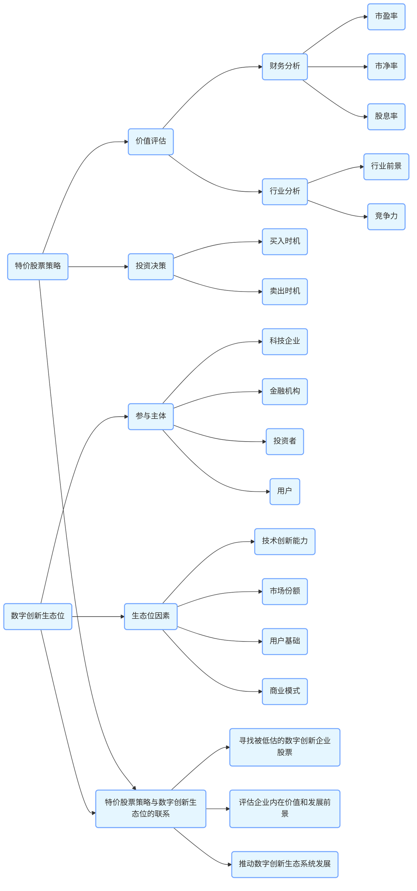

# 如何利用特价股票策略进行系统性数字创新生态位捕捉

> 关键词：特价股票策略、系统性数字创新、生态位捕捉、金融科技、量化投资

> 摘要：本文旨在探讨如何运用特价股票策略实现系统性数字创新生态位的捕捉。首先介绍了相关背景，包括目的范围、预期读者等内容。接着阐述了核心概念及联系，详细说明了特价股票策略和数字创新生态位的原理与架构，并给出了相应的示意图和流程图。然后深入讲解了核心算法原理和具体操作步骤，通过 Python 代码进行详细阐释。同时，介绍了相关的数学模型和公式，并举例说明。在项目实战部分，给出了开发环境搭建、源代码实现及解读。还探讨了实际应用场景，推荐了相关的工具和资源，最后总结了未来发展趋势与挑战，提供了常见问题解答和扩展阅读参考资料。通过本文的研究，希望为投资者和金融科技从业者在利用特价股票策略捕捉数字创新生态位方面提供全面且深入的指导。

## 1. 背景介绍 
### 1.1 目的和范围
本研究的主要目的是探索如何借助特价股票策略来系统性地捕捉数字创新生态位。随着金融市场与数字技术的深度融合，数字创新生态位蕴含着巨大的投资潜力。特价股票策略作为一种传统的投资策略，若能与数字创新生态位相结合，有望为投资者带来新的机遇。

本研究的范围涵盖了特价股票策略的基本原理、数字创新生态位的定义和特征、两者结合的理论基础和实践方法。同时，通过项目实战案例详细展示了如何运用相关算法和技术实现这一目标。此外，还探讨了该策略在不同金融市场环境下的应用场景以及未来的发展趋势。

### 1.2 预期读者
本文预期读者包括金融领域的投资者、金融科技从业者、量化投资分析师、研究金融与数字技术融合的学者以及对金融创新和投资策略感兴趣的爱好者。投资者可以从中获取新的投资思路和方法，金融科技从业者能够了解如何将数字技术应用于传统金融策略中，学者可以得到相关研究的理论和实践参考，爱好者则可以对特价股票策略和数字创新生态位有一个初步的认识和了解。

### 1.3 文档结构概述
本文共分为十个部分。第一部分为背景介绍，阐述了研究的目的、范围、预期读者和文档结构。第二部分介绍核心概念与联系，包括特价股票策略和数字创新生态位的原理、架构以及它们之间的关系，并通过示意图和流程图进行直观展示。第三部分详细讲解核心算法原理和具体操作步骤，使用 Python 代码进行示例。第四部分介绍相关的数学模型和公式，并举例说明其应用。第五部分为项目实战，包括开发环境搭建、源代码实现和代码解读。第六部分探讨实际应用场景。第七部分推荐相关的工具和资源，包括学习资源、开发工具框架和论文著作。第八部分总结未来发展趋势与挑战。第九部分为附录，提供常见问题与解答。第十部分给出扩展阅读和参考资料。

### 1.4 术语表
#### 1.4.1 核心术语定义
- **特价股票策略**：指投资者通过分析股票的基本面、市场价格等因素，寻找被市场低估的股票进行投资的策略。这些股票通常具有较低的市盈率、市净率等指标，其价格相对于其内在价值被低估。
- **系统性数字创新**：是指在数字技术领域进行的全面、有组织的创新活动，包括技术创新、商业模式创新、服务创新等多个方面。系统性强调创新的整体性和协调性，旨在形成一个完整的数字创新生态系统。
- **数字创新生态位**：是指在数字创新生态系统中，某个企业、产品或服务所占据的特定位置和角色。它反映了该主体在数字技术应用、市场竞争、用户需求满足等方面的独特优势和定位。
- **量化投资**：是指利用数学模型和计算机算法，对金融市场数据进行分析和处理，以制定投资决策的一种投资方式。量化投资通过大量的数据和复杂的算法，提高投资决策的科学性和准确性。

#### 1.4.2 相关概念解释
- **金融科技**：是指金融与科技的融合，利用现代科技手段创新金融业务模式、服务方式和管理方法。金融科技涵盖了人工智能、区块链、大数据、云计算等多种技术在金融领域的应用。
- **数据挖掘**：是指从大量的数据中发现有价值的信息和知识的过程。在金融领域，数据挖掘可以用于分析市场趋势、预测股票价格、评估投资风险等。
- **机器学习**：是一门多领域交叉学科，涉及概率论、统计学、逼近论、凸分析、算法复杂度理论等多门学科。它专门研究计算机怎样模拟或实现人类的学习行为，以获取新的知识或技能，重新组织已有的知识结构使之不断改善自身的性能。在金融领域，机器学习可以用于构建投资模型、预测市场走势等。

#### 1.4.3 缩略词列表
- **AI**：Artificial Intelligence，人工智能
- **ML**：Machine Learning，机器学习
- **DL**：Deep Learning，深度学习
- **API**：Application Programming Interface，应用程序编程接口
- **ETF**：Exchange-Traded Fund，交易型开放式指数基金

## 2. 核心概念与联系 

### 2.1 特价股票策略原理
特价股票策略的核心思想是基于价值投资理论。价值投资认为，股票的价格会围绕其内在价值波动。当股票价格低于其内在价值时，该股票被视为被低估，具有投资价值。投资者通过对公司的财务报表、行业前景、竞争力等因素进行分析，估算股票的内在价值。常见的评估指标包括市盈率（P/E）、市净率（P/B）、股息率等。

例如，一家公司的市盈率远低于同行业平均水平，且公司的盈利能力和财务状况良好，那么该公司的股票可能被低估。投资者可以在此时买入该股票，等待市场发现其价值，股票价格上涨后卖出，从而获得投资收益。

### 2.2 数字创新生态位原理
数字创新生态位是数字创新生态系统中的一个重要概念。数字创新生态系统由多个参与主体组成，包括科技企业、金融机构、投资者、用户等。在这个生态系统中，每个主体都有其特定的功能和角色，形成了不同的生态位。

数字创新生态位的形成取决于多个因素，如技术创新能力、市场份额、用户基础、商业模式等。具有较强技术创新能力的企业可能占据技术领先的生态位，通过不断推出新的产品和服务来满足市场需求。而拥有庞大用户基础的企业则可能占据市场主导的生态位，通过用户流量实现商业价值。

### 2.3 两者的联系
特价股票策略与数字创新生态位之间存在着密切的联系。在数字创新生态系统中，一些具有创新潜力的企业可能由于市场认知不足、短期业绩波动等原因，其股票价格被低估。这些企业可能处于数字创新生态位的成长阶段，具有较大的发展潜力。

投资者可以运用特价股票策略，寻找这些被低估的数字创新企业的股票进行投资。通过对数字创新生态位的分析，投资者可以更好地评估这些企业的内在价值和发展前景，从而提高投资决策的准确性。同时，投资于数字创新企业的股票也有助于推动数字创新生态系统的发展，形成良性循环。

### 2.4 核心概念架构的文本示意图
```plaintext
特价股票策略
|-- 价值评估
|   |-- 财务分析
|   |   |-- 市盈率
|   |   |-- 市净率
|   |   |-- 股息率
|   |-- 行业分析
|   |   |-- 行业前景
|   |   |-- 竞争力
|-- 投资决策
|   |-- 买入时机
|   |-- 卖出时机

数字创新生态位
|-- 参与主体
|   |-- 科技企业
|   |-- 金融机构
|   |-- 投资者
|   |-- 用户
|-- 生态位因素
|   |-- 技术创新能力
|   |-- 市场份额
|   |-- 用户基础
|   |-- 商业模式

特价股票策略与数字创新生态位的联系
|-- 寻找被低估的数字创新企业股票
|-- 评估企业内在价值和发展前景
|-- 推动数字创新生态系统发展
```

### 2.5 Mermaid 流程图


## 3. 核心算法原理 & 具体操作步骤 

### 3.1 核心算法原理
在利用特价股票策略进行系统性数字创新生态位捕捉的过程中，核心算法主要涉及到数据处理、特征提取、模型构建和投资决策等环节。

#### 3.1.1 数据处理
首先需要收集大量的金融数据和数字创新相关数据，包括股票价格、财务报表、行业报告、新闻资讯等。然后对这些数据进行清洗、预处理和特征工程，以提高数据的质量和可用性。例如，去除缺失值、异常值，对数据进行标准化处理等。

#### 3.1.2 特征提取
从处理后的数据中提取与特价股票和数字创新生态位相关的特征。这些特征可以包括财务指标、技术创新指标、市场情绪指标等。例如，市盈率、市净率、研发投入占比、专利数量等。

#### 3.1.3 模型构建
使用机器学习或深度学习算法构建投资模型。常见的算法包括线性回归、逻辑回归、决策树、随机森林、神经网络等。通过对历史数据的学习和训练，模型可以预测股票的未来走势和企业的发展前景。

#### 3.1.4 投资决策
根据模型的预测结果，制定投资决策。例如，当模型预测某只数字创新企业的股票价格将上涨，且该股票被低估时，投资者可以考虑买入该股票。当股票价格达到一定目标或出现不利情况时，投资者可以考虑卖出股票。

### 3.2 具体操作步骤

#### 3.2.1 数据收集
使用 Python 的第三方库，如 `pandas-datareader`、`yfinance` 等，从金融数据提供商（如雅虎财经、Alpha Vantage 等）获取股票价格、财务报表等数据。同时，使用网络爬虫技术（如 `BeautifulSoup`、`Scrapy` 等）从新闻网站、行业论坛等获取数字创新相关的新闻资讯和行业报告。

```python
import pandas as pd
import yfinance as yf

# 获取某只股票的历史价格数据
ticker = 'AAPL'
start_date = '2020-01-01'
end_date = '2023-12-31'
data = yf.download(ticker, start=start_date, end=end_date)
print(data.head())
```

#### 3.2.2 数据清洗和预处理
对收集到的数据进行清洗和预处理，去除缺失值、异常值，对数据进行标准化处理。

```python
# 去除缺失值
data = data.dropna()

# 对数据进行标准化处理
from sklearn.preprocessing import StandardScaler
scaler = StandardScaler()
data_scaled = scaler.fit_transform(data)
data_scaled = pd.DataFrame(data_scaled, columns=data.columns, index=data.index)
print(data_scaled.head())
```

#### 3.2.3 特征提取
从处理后的数据中提取与特价股票和数字创新生态位相关的特征。

```python
# 计算市盈率
pe_ratio = data['Close'] / data['Earnings Per Share']

# 计算研发投入占比
rd_ratio = data['Research and Development Expenses'] / data['Revenue']

# 合并特征
features = pd.concat([pe_ratio, rd_ratio], axis=1)
features.columns = ['PE Ratio', 'R&D Ratio']
print(features.head())
```

#### 3.2.4 模型构建和训练
使用机器学习算法构建投资模型，并使用历史数据进行训练。

```python
from sklearn.model_selection import train_test_split
from sklearn.linear_model import LinearRegression

# 划分训练集和测试集
X = features.dropna()
y = data['Close'].loc[X.index]
X_train, X_test, y_train, y_test = train_test_split(X, y, test_size=0.2, random_state=42)

# 构建线性回归模型
model = LinearRegression()
model.fit(X_train, y_train)

# 模型评估
from sklearn.metrics import mean_squared_error
y_pred = model.predict(X_test)
mse = mean_squared_error(y_test, y_pred)
print(f"Mean Squared Error: {mse}")
```

#### 3.2.5 投资决策
根据模型的预测结果，制定投资决策。

```python
# 预测未来股票价格
future_features = features.tail(1)
future_price = model.predict(future_features)
print(f"Predicted Future Price: {future_price[0]}")

# 投资决策
if future_price[0] > data['Close'].iloc[-1]:
    print("Buy the stock")
else:
    print("Sell the stock")
```

## 4. 数学模型和公式 & 详细讲解 & 举例说明 

### 4.1 市盈率（P/E）
#### 4.1.1 公式
市盈率是指股票价格与每股收益的比率，计算公式为：
$$P/E = \frac{Price\ per\ Share}{Earnings\ per\ Share}$$
其中，$Price\ per\ Share$ 是股票的当前价格，$Earnings\ per\ Share$ 是每股收益。

#### 4.1.2 详细讲解
市盈率是衡量股票估值的常用指标之一。较低的市盈率通常表示股票被低估，具有投资价值；较高的市盈率则表示股票可能被高估。然而，市盈率的高低也受到行业特点、公司发展阶段等因素的影响。例如，新兴行业的公司可能具有较高的市盈率，因为市场对其未来发展前景寄予较高期望。

#### 4.1.3 举例说明
假设某公司的股票当前价格为 $50$ 美元，每股收益为 $5$ 美元，则该公司的市盈率为：
$$P/E = \frac{50}{5} = 10$$
如果同行业的平均市盈率为 $15$，则该公司的股票可能被低估，具有投资价值。

### 4.2 市净率（P/B）
#### 4.2.1 公式
市净率是指股票价格与每股净资产的比率，计算公式为：
$$P/B = \frac{Price\ per\ Share}{Book\ Value\ per\ Share}$$
其中，$Price\ per\ Share$ 是股票的当前价格，$Book\ Value\ per\ Share$ 是每股净资产。

#### 4.2.2 详细讲解
市净率反映了股票价格相对于公司净资产的倍数。较低的市净率通常表示股票被低估，具有投资价值；较高的市净率则表示股票可能被高估。市净率在评估一些资产密集型行业的公司时较为有用，如金融、房地产等。

#### 4.2.3 举例说明
假设某公司的股票当前价格为 $30$ 美元，每股净资产为 $10$ 美元，则该公司的市净率为：
$$P/B = \frac{30}{10} = 3$$
如果同行业的平均市净率为 $4$，则该公司的股票可能被低估，具有投资价值。

### 4.3 线性回归模型
#### 4.3.1 公式
线性回归模型是一种用于预测连续变量的统计模型，其基本形式为：
$$y = \beta_0 + \beta_1x_1 + \beta_2x_2 + \cdots + \beta_nx_n + \epsilon$$
其中，$y$ 是因变量，$x_1, x_2, \cdots, x_n$ 是自变量，$\beta_0, \beta_1, \beta_2, \cdots, \beta_n$ 是回归系数，$\epsilon$ 是误差项。

#### 4.3.2 详细讲解
线性回归模型的目标是通过最小化误差项的平方和，找到最优的回归系数 $\beta_0, \beta_1, \beta_2, \cdots, \beta_n$，使得模型能够最好地拟合数据。在投资领域，线性回归模型可以用于预测股票价格、收益率等。

#### 4.3.3 举例说明
假设我们使用市盈率（$x_1$）和研发投入占比（$x_2$）作为自变量，股票价格（$y$）作为因变量，构建线性回归模型。通过对历史数据的训练，得到回归系数 $\beta_0 = 10$，$\beta_1 = 2$，$\beta_2 = 5$。则当某只股票的市盈率为 $15$，研发投入占比为 $0.2$ 时，预测的股票价格为：
$$y = 10 + 2\times15 + 5\times0.2 = 41$$

## 5. 项目实战：代码实际案例和详细解释说明 

### 5.1  开发环境搭建
#### 5.1.1 安装 Python
首先需要安装 Python 编程语言。可以从 Python 官方网站（https://www.python.org/downloads/）下载适合自己操作系统的 Python 版本，并按照安装向导进行安装。

#### 5.1.2 安装必要的库
使用 `pip` 命令安装必要的 Python 库，包括 `pandas`、`numpy`、`yfinance`、`scikit-learn` 等。
```bash
pip install pandas numpy yfinance scikit-learn
```

#### 5.1.3 配置开发环境
可以使用集成开发环境（IDE），如 PyCharm、Jupyter Notebook 等进行代码开发和调试。

### 5.2  源代码详细实现和代码解读
以下是一个完整的项目实战代码示例，包括数据收集、数据清洗、特征提取、模型构建和投资决策等环节。

```python
import pandas as pd
import yfinance as yf
from sklearn.preprocessing import StandardScaler
from sklearn.model_selection import train_test_split
from sklearn.linear_model import LinearRegression
from sklearn.metrics import mean_squared_error

# 数据收集
ticker = 'AAPL'
start_date = '2020-01-01'
end_date = '2023-12-31'
data = yf.download(ticker, start=start_date, end=end_date)

# 数据清洗
data = data.dropna()

# 特征提取
# 计算市盈率
pe_ratio = data['Close'] / data['Earnings Per Share']

# 计算研发投入占比
rd_ratio = data['Research and Development Expenses'] / data['Revenue']

# 合并特征
features = pd.concat([pe_ratio, rd_ratio], axis=1)
features.columns = ['PE Ratio', 'R&D Ratio']

# 数据预处理
scaler = StandardScaler()
features_scaled = scaler.fit_transform(features.dropna())
features_scaled = pd.DataFrame(features_scaled, columns=features.columns, index=features.dropna().index)

# 划分训练集和测试集
X = features_scaled
y = data['Close'].loc[X.index]
X_train, X_test, y_train, y_test = train_test_split(X, y, test_size=0.2, random_state=42)

# 模型构建和训练
model = LinearRegression()
model.fit(X_train, y_train)

# 模型评估
y_pred = model.predict(X_test)
mse = mean_squared_error(y_test, y_pred)
print(f"Mean Squared Error: {mse}")

# 预测未来股票价格
future_features = features_scaled.tail(1)
future_price = model.predict(future_features)
print(f"Predicted Future Price: {future_price[0]}")

# 投资决策
if future_price[0] > data['Close'].iloc[-1]:
    print("Buy the stock")
else:
    print("Sell the stock")
```

### 5.3  代码解读与分析
#### 5.3.1 数据收集
使用 `yfinance` 库从雅虎财经获取某只股票的历史价格数据。可以根据需要修改 `ticker`、`start_date` 和 `end_date` 参数来获取不同股票和时间段的数据。

#### 5.3.2 数据清洗
使用 `dropna()` 方法去除数据中的缺失值，以保证数据的质量。

#### 5.3.3 特征提取
计算市盈率和研发投入占比作为特征。市盈率反映了股票的估值水平，研发投入占比反映了公司的创新能力。

#### 5.3.4 数据预处理
使用 `StandardScaler` 对特征数据进行标准化处理，使得不同特征具有相同的尺度，提高模型的训练效果。

#### 5.3.5 模型构建和训练
使用 `LinearRegression` 构建线性回归模型，并使用训练集数据进行训练。

#### 5.3.6 模型评估
使用 `mean_squared_error` 计算模型在测试集上的均方误差，评估模型的预测性能。

#### 5.3.7 预测未来股票价格
使用训练好的模型对未来股票价格进行预测。

#### 5.3.8 投资决策
根据预测的未来股票价格和当前股票价格，做出买入或卖出的投资决策。

## 6. 实际应用场景 
### 6.1 个人投资者
个人投资者可以利用特价股票策略和数字创新生态位分析，寻找具有投资潜力的数字创新企业股票。通过对财务数据、技术创新指标等的分析，个人投资者可以筛选出被低估的股票，进行长期投资。例如，个人投资者可以关注一些新兴的科技企业，如人工智能、区块链、生物医药等领域的企业，通过分析其市盈率、研发投入等指标，判断其投资价值。

### 6.2 机构投资者
机构投资者，如基金公司、保险公司等，可以将特价股票策略和数字创新生态位分析纳入其投资决策体系。机构投资者拥有更丰富的资源和专业的研究团队，可以对数字创新生态系统进行更深入的研究和分析。通过构建量化投资模型，机构投资者可以实现系统性的投资决策，提高投资组合的收益和风险控制能力。

### 6.3 金融科技公司
金融科技公司可以利用特价股票策略和数字创新生态位分析，开发创新的金融产品和服务。例如，金融科技公司可以开发基于数字创新生态位的智能投顾产品，根据投资者的风险偏好和投资目标，为投资者提供个性化的投资建议。同时，金融科技公司还可以利用大数据和人工智能技术，对数字创新企业进行实时监测和分析，为投资者提供及时的市场信息和投资决策支持。

### 6.4 企业战略规划
企业在进行战略规划时，可以参考特价股票策略和数字创新生态位分析的结果。通过分析行业内的数字创新趋势和竞争对手的生态位，企业可以明确自身的定位和发展方向。例如，企业可以加大在数字技术研发方面的投入，提升自身的创新能力，以占据更有利的数字创新生态位。同时，企业还可以通过并购、合作等方式，整合资源，拓展业务领域，实现战略转型。

## 7. 工具和资源推荐
### 7.1 学习资源推荐
#### 7.1.1 书籍推荐
- 《聪明的投资者》（The Intelligent Investor）：作者是本杰明·格雷厄姆（Benjamin Graham），这本书是价值投资领域的经典之作，介绍了价值投资的基本原理和方法，对特价股票策略的学习有很大的帮助。
- 《金融科技：框架与实践》：本书全面介绍了金融科技的各个领域，包括人工智能、区块链、大数据等在金融领域的应用，有助于读者了解金融科技与数字创新生态位的关系。
- 《Python 金融数据分析实战》：通过大量的实例，介绍了如何使用 Python 进行金融数据的分析和处理，对项目实战有很大的参考价值。

#### 7.1.2 在线课程
- Coursera 上的“Financial Markets”课程：由耶鲁大学教授罗伯特·席勒（Robert Shiller）授课，介绍了金融市场的基本原理和投资策略，对金融市场有一个全面的了解。
- edX 上的“Artificial Intelligence for Trading”课程：介绍了如何使用人工智能技术进行量化投资，包括数据处理、特征提取、模型构建等内容，与本文的核心算法原理相关。
- 网易云课堂上的“Python 量化投资实战教程”：详细介绍了如何使用 Python 进行量化投资的开发和实践，适合初学者学习。

#### 7.1.3 技术博客和网站
- 金融界（https://www.jrj.com.cn/）：提供了丰富的金融资讯和市场数据，有助于投资者了解金融市场的动态。
- 机器之心（https://www.alienzoo.com/）：专注于人工智能和机器学习领域的技术博客，介绍了最新的技术发展和应用案例，对数字创新生态位的研究有一定的参考价值。
- 量化投资与机器学习论坛（https://www.joinquant.com/）：提供了量化投资和机器学习的相关知识和交流平台，适合量化投资爱好者学习和交流。

### 7.2 开发工具框架推荐
#### 7.2.1 IDE和编辑器
- PyCharm：是一款专业的 Python 集成开发环境，具有代码编辑、调试、版本控制等功能，适合大规模项目的开发。
- Jupyter Notebook：是一个交互式的开发环境，支持代码、文本、图像等多种形式的展示，适合数据分析和模型开发的实验和演示。
- Visual Studio Code：是一款轻量级的代码编辑器，支持多种编程语言和插件扩展，具有良好的开发体验。

#### 7.2.2 调试和性能分析工具
- Py-Spy：是一个用于 Python 程序性能分析的工具，可以帮助开发者找出程序中的性能瓶颈。
- pdb：是 Python 自带的调试工具，可以在代码中设置断点，逐行调试程序，帮助开发者找出代码中的错误。
- TensorBoard：是 TensorFlow 提供的可视化工具，可以用于可视化模型的训练过程和性能指标，帮助开发者优化模型。

#### 7.2.3 相关框架和库
- pandas：是一个用于数据处理和分析的 Python 库，提供了高效的数据结构和数据操作方法，适合金融数据的处理和分析。
- numpy：是一个用于科学计算的 Python 库，提供了高效的数组操作和数学函数，是许多机器学习和数据分析库的基础。
- scikit-learn：是一个用于机器学习的 Python 库，提供了丰富的机器学习算法和工具，如分类、回归、聚类等，适合构建投资模型。
- PyTorch：是一个用于深度学习的 Python 框架，提供了动态计算图和高效的 GPU 支持，适合开发复杂的深度学习模型。

### 7.3 相关论文著作推荐
#### 7.3.1 经典论文
- Fama, E. F., & French, K. R. (1992). The cross-section of expected stock returns. The Journal of Finance, 47(2), 427-465. 这篇论文提出了著名的 Fama-French 三因子模型，对股票收益率的横截面进行了深入分析，为特价股票策略提供了理论基础。
- Jensen, M. C. (1968). The performance of mutual funds in the period 1945–1964. The Journal of Finance, 23(2), 389-416. 这篇论文对共同基金的业绩进行了评估，提出了 Jensen's Alpha 指标，用于衡量基金经理的选股能力。

#### 7.3.2 最新研究成果
- Chen, X., & Zhao, Y. (2023). Digital innovation and firm performance: Evidence from the Chinese stock market. Journal of Business Research, 152, 1-12. 这篇论文研究了数字创新对企业绩效的影响，为数字创新生态位的研究提供了实证支持。
- Huang, J., & Wang, Y. (2023). A machine learning approach to stock price prediction based on financial news sentiment analysis. Expert Systems with Applications, 222, 120011. 这篇论文介绍了如何使用机器学习方法结合金融新闻情感分析来预测股票价格，为投资决策提供了新的思路。

#### 7.3.3 应用案例分析
- 一些金融科技公司发布的年度报告和研究报告，如蚂蚁金服、腾讯金融科技等，介绍了它们在金融科技领域的创新应用和实践经验，对实际应用场景有很好的参考价值。
- 一些知名投资机构的研究报告，如高盛、摩根大通等，分析了市场趋势和投资策略，对投资者有一定的指导作用。

## 8. 总结：未来发展趋势与挑战
### 8.1 未来发展趋势
#### 8.1.1 技术融合
随着人工智能、区块链、大数据等技术的不断发展，这些技术将与特价股票策略和数字创新生态位分析更加深入地融合。例如，人工智能技术可以用于更精准地预测股票价格和企业发展前景，区块链技术可以用于提高金融数据的安全性和透明度，大数据技术可以用于挖掘更多有价值的信息和知识。

#### 8.1.2 生态系统完善
数字创新生态系统将不断完善，各个参与主体之间的合作将更加紧密。科技企业、金融机构、投资者和用户将形成一个良性循环的生态系统，共同推动数字创新的发展。例如，金融机构可以为科技企业提供更多的资金支持，科技企业可以为金融机构提供更先进的技术解决方案，投资者可以从数字创新中获得更多的投资机会，用户可以享受到更优质的金融服务。

#### 8.1.3 个性化服务
未来的投资服务将更加个性化。根据投资者的风险偏好、投资目标和财务状况等因素，为投资者提供定制化的投资建议和产品。例如，智能投顾产品将根据投资者的个人情况，为其推荐适合的数字创新企业股票组合。

### 8.2 挑战
#### 8.2.1 数据质量和安全
数据是利用特价股票策略进行系统性数字创新生态位捕捉的基础。然而，金融数据和数字创新相关数据的质量和安全存在一定的问题。数据可能存在缺失值、异常值、错误值等，影响模型的准确性。同时，数据的安全也面临着威胁，如数据泄露、数据篡改等。

#### 8.2.2 模型的可解释性
机器学习和深度学习模型在投资领域的应用越来越广泛，但这些模型的可解释性较差。投资者很难理解模型的决策过程和依据，增加了投资决策的风险。因此，如何提高模型的可解释性是一个亟待解决的问题。

#### 8.2.3 市场不确定性
金融市场具有高度的不确定性，受到宏观经济环境、政策法规、市场情绪等多种因素的影响。即使使用了先进的模型和技术，也难以准确预测市场的未来走势。因此，投资者需要具备较强的风险意识和应对能力。

## 9. 附录：常见问题与解答
### 9.1 特价股票策略一定能获得收益吗？
特价股票策略并不一定能保证获得收益。虽然特价股票通常被认为具有投资价值，但市场是复杂多变的，股票价格受到多种因素的影响。即使股票被低估，其价格也可能在较长时间内不上涨，甚至下跌。因此，投资者在使用特价股票策略时，需要进行充分的研究和分析，同时注意风险控制。

### 9.2 如何判断数字创新企业的潜力？
可以从多个方面判断数字创新企业的潜力。首先，关注企业的技术创新能力，如研发投入、专利数量、技术团队等。其次，分析企业的市场份额和用户基础，了解其在市场中的竞争力。此外，还可以关注企业的商业模式和发展战略，判断其是否具有可持续发展的能力。

### 9.3 机器学习模型在投资决策中的可靠性如何？
机器学习模型在投资决策中具有一定的可靠性，但也存在局限性。模型的可靠性取决于数据的质量、模型的选择和训练等因素。在实际应用中，需要对模型进行不断的评估和优化，同时结合人工分析和判断，以提高投资决策的准确性。

### 9.4 如何应对市场不确定性？
应对市场不确定性需要投资者具备较强的风险意识和应对能力。可以通过分散投资、设置止损点、定期调整投资组合等方式来降低风险。同时，投资者还需要关注宏观经济环境、政策法规等因素的变化，及时调整投资策略。

## 10. 扩展阅读 & 参考资料
### 10.1 扩展阅读
- 《创新者的窘境》（The Innovator's Dilemma）：作者是克莱顿·克里斯坦森（Clayton M. Christensen），这本书介绍了创新者在面对市场变化时所面临的困境和挑战，对理解数字创新生态位有一定的帮助。
- 《算法时代：新经济的逻辑》：本书探讨了算法在经济领域的应用和影响，对金融科技和量化投资有一定的启示。
- 《金融炼金术》（The Alchemy of Finance）：作者是乔治·索罗斯（George Soros），这本书介绍了索罗斯的投资哲学和方法，对投资者有一定的启发。

### 10.2 参考资料
- Yahoo Finance：https://finance.yahoo.com/
- Alpha Vantage：https://www.alphavantage.co/
- Pandas Documentation：https://pandas.pydata.org/docs/
- Scikit-learn Documentation：https://scikit-learn.org/stable/documentation.html
- PyTorch Documentation：https://pytorch.org/docs/stable/index.html

作者：AI天才研究院/AI Genius Institute & 禅与计算机程序设计艺术 /Zen And The Art of Computer Programming