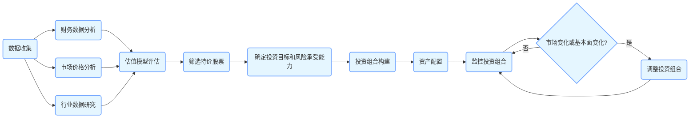

# 如何利用特价股票策略进行资产配置

> 关键词：特价股票策略、资产配置、股票估值、投资组合、风险控制、市场分析、收益优化

> 摘要：本文围绕如何利用特价股票策略进行资产配置展开深入探讨。首先介绍了该策略在资产配置中的背景意义和适用范围，明确预期读者。接着阐述了特价股票策略的核心概念、原理和架构，详细讲解了其核心算法原理及具体操作步骤，并给出了相关数学模型和公式。通过项目实战，展示了实际代码案例及详细解读。同时探讨了该策略的实际应用场景，推荐了相关学习资源、开发工具框架和论文著作。最后总结了未来发展趋势与挑战，提供常见问题解答和扩展阅读参考资料，旨在帮助投资者系统地理解和运用特价股票策略进行有效的资产配置。

## 1. 背景介绍 
### 1.1 目的和范围
在金融市场中，资产配置是投资者实现财富增值和风险控制的重要手段。特价股票策略作为一种独特的投资方法，旨在寻找被市场低估的股票，通过合理配置这些股票来优化投资组合的收益风险比。本文的目的在于全面介绍如何利用特价股票策略进行资产配置，涵盖从理论基础到实际操作的各个方面，包括特价股票的筛选、投资组合的构建、风险评估与控制等内容，为投资者提供一套系统的方法和思路。

### 1.2 预期读者
本文预期读者主要包括对股票投资和资产配置有兴趣的个人投资者、金融从业者如投资顾问、基金经理等，以及相关专业的学生和研究人员。对于希望通过特价股票策略提升投资收益、优化资产配置的人群具有较高的参考价值。

### 1.3 文档结构概述
本文将按照以下结构展开：首先介绍特价股票策略及资产配置的背景知识和相关术语；接着阐述核心概念、原理和架构，通过流程图和示意图进行直观展示；然后详细讲解核心算法原理和具体操作步骤，并给出Python源代码；之后介绍相关数学模型和公式，并举例说明；通过项目实战展示实际代码案例和详细解释；探讨该策略的实际应用场景；推荐相关的学习资源、开发工具框架和论文著作；最后总结未来发展趋势与挑战，提供常见问题解答和扩展阅读参考资料。

### 1.4 术语表
#### 1.4.1 核心术语定义
- **特价股票**：指市场价格低于其内在价值的股票，通常由于市场情绪、短期业绩波动或行业暂时困境等因素导致其被低估。
- **资产配置**：根据投资者的风险承受能力、投资目标和市场情况，将资金分配到不同资产类别（如股票、债券、现金等）的过程，以实现投资组合的收益最大化和风险最小化。
- **内在价值**：股票的真实价值，基于公司的基本面因素如盈利能力、资产状况、成长潜力等进行评估。
- **投资组合**：由多种资产组成的集合，通过合理搭配不同资产来分散风险和实现特定的投资目标。
- **风险控制**：采取各种措施降低投资过程中面临的不确定性和潜在损失的过程。

#### 1.4.2 相关概念解释
- **价值投资**：一种投资理念，强调通过分析公司的基本面来寻找被低估的股票，并长期持有，以获取股票价值回归带来的收益。特价股票策略与价值投资有密切联系，都是基于股票的内在价值进行投资决策。
- **市场效率**：指市场价格反映所有可用信息的程度。在有效市场中，股票价格能够迅速反映所有公开信息，难以找到被低估的股票；而在非有效市场中，存在信息不对称和市场情绪波动，为特价股票策略提供了机会。
- **分散化投资**：将资金分散投资于不同的资产、行业和地区，以降低单一资产或行业波动对投资组合的影响，实现风险的分散。

#### 1.4.3 缩略词列表
- **PE**：市盈率（Price - Earnings Ratio），指股票价格与每股收益的比率，用于衡量股票的估值水平。
- **PB**：市净率（Price - to - Book Ratio），指股票价格与每股净资产的比率，反映了股票价格相对于公司净资产的倍数。
- **ROE**：净资产收益率（Return on Equity），指公司净利润与股东权益的比率，衡量公司运用自有资本的效率。

## 2. 核心概念与联系 

### 核心概念原理
特价股票策略的核心原理基于价值投资理念，即认为市场并非完全有效，股票价格可能会偏离其内在价值。通过对公司基本面的深入分析，寻找那些市场价格低于其内在价值的股票，即特价股票。这些股票可能由于短期市场因素或投资者情绪的影响而被低估，但从长期来看，其价格有望回归到内在价值水平，从而为投资者带来超额收益。

在资产配置中运用特价股票策略，是将特价股票纳入投资组合，与其他资产（如债券、现金等）进行合理搭配，以实现投资组合的收益优化和风险控制。通过分散投资于不同行业、不同规模的特价股票，可以降低单一股票或行业的风险，同时利用特价股票的价值回归潜力提升投资组合的整体收益。

### 架构的文本示意图
特价股票策略进行资产配置的架构可以分为以下几个层次：
1. **数据收集层**：收集股票的相关数据，包括财务报表数据、市场价格数据、行业数据等，为后续的分析提供基础。
2. **分析评估层**：运用各种分析方法和模型对收集到的数据进行处理和分析，评估股票的内在价值和估值水平，筛选出特价股票。
3. **投资组合构建层**：根据投资者的风险承受能力、投资目标和市场情况，将筛选出的特价股票与其他资产进行合理配置，构建投资组合。
4. **监控调整层**：对投资组合进行实时监控，根据市场变化和公司基本面的变化，及时调整投资组合，确保投资组合的风险和收益符合预期。

### Mermaid 流程图


## 3. 核心算法原理 & 具体操作步骤 

### 核心算法原理
特价股票策略的核心算法主要涉及股票估值和筛选。常用的估值方法包括市盈率法、市净率法、现金流折现法等。以下以市盈率法为例进行说明。

市盈率法的基本原理是通过比较股票的市盈率与行业平均市盈率或历史市盈率，判断股票是否被低估。如果股票的市盈率低于行业平均市盈率或历史市盈率，且公司的基本面良好，那么该股票可能被视为特价股票。

### 具体操作步骤
1. **数据收集**：收集股票的财务报表数据，包括每股收益、每股净资产等；收集市场价格数据，计算股票的市盈率；收集行业数据，获取行业平均市盈率。
2. **计算市盈率**：市盈率（PE）的计算公式为：$PE=\frac{股票价格}{每股收益}$
3. **筛选特价股票**：将股票的市盈率与行业平均市盈率进行比较，如果股票的市盈率低于行业平均市盈率一定比例（如20%），且公司的财务状况良好（如净资产收益率较高、资产负债率较低等），则将该股票视为特价股票。
4. **构建投资组合**：根据投资者的风险承受能力和投资目标，将筛选出的特价股票与其他资产进行合理配置，构建投资组合。

### Python源代码示例
```python
import pandas as pd

# 模拟股票数据
stock_data = {
    '股票代码': ['000001', '000002', '000003', '000004', '000005'],
    '股票价格': [10, 20, 30, 40, 50],
    '每股收益': [1, 2, 3, 4, 5],
    '净资产收益率': [0.2, 0.15, 0.25, 0.18, 0.22],
    '资产负债率': [0.4, 0.3, 0.35, 0.45, 0.38]
}
df = pd.DataFrame(stock_data)

# 计算市盈率
df['市盈率'] = df['股票价格'] / df['每股收益']

# 假设行业平均市盈率为20
industry_pe = 20

# 筛选特价股票
discount_stocks = df[(df['市盈率'] < industry_pe * 0.8) & (df['净资产收益率'] > 0.2) & (df['资产负债率'] < 0.4)]

print("特价股票列表：")
print(discount_stocks)
```

## 4. 数学模型和公式 & 详细讲解 & 举例说明 

### 市盈率模型
市盈率（PE）是最常用的股票估值指标之一，其计算公式为：
$$PE=\frac{P}{EPS}$$
其中，$P$ 表示股票价格，$EPS$ 表示每股收益。

市盈率反映了投资者为获取公司每一元盈利所愿意支付的价格。一般来说，市盈率越低，股票越具有投资价值。但需要注意的是，不同行业的市盈率水平可能存在较大差异，因此在使用市盈率进行估值时，需要与行业平均市盈率进行比较。

### 市净率模型
市净率（PB）也是一种常用的股票估值指标，其计算公式为：
$$PB=\frac{P}{BVPS}$$
其中，$P$ 表示股票价格，$BVPS$ 表示每股净资产。

市净率反映了股票价格相对于公司净资产的倍数。一般来说，市净率越低，股票越具有投资价值。市净率模型适用于那些资产价值相对稳定的行业，如金融、房地产等。

### 现金流折现模型
现金流折现模型（DCF）是一种更为复杂但也更为准确的股票估值方法。其基本原理是将公司未来的现金流折现到当前，以确定公司的内在价值。

现金流折现模型的计算公式为：
$$V=\sum_{t=1}^{n}\frac{FCF_t}{(1 + r)^t}+\frac{TV}{(1 + r)^n}$$
其中，$V$ 表示公司的内在价值，$FCF_t$ 表示第 $t$ 期的自由现金流，$r$ 表示折现率，$TV$ 表示终值，$n$ 表示预测期数。

### 举例说明
假设某公司的股票价格为 $P = 50$ 元，每股收益为 $EPS = 5$ 元，每股净资产为 $BVPS = 20$ 元。则该公司的市盈率为：
$$PE=\frac{50}{5}=10$$
市净率为：
$$PB=\frac{50}{20}=2.5$$

如果该行业的平均市盈率为 15，平均市净率为 3，则该公司的市盈率和市净率均低于行业平均水平，可能被视为特价股票。

## 5. 项目实战：代码实际案例和详细解释说明 

### 5.1  开发环境搭建
- **Python 环境**：建议使用 Python 3.7 及以上版本。可以从 Python 官方网站（https://www.python.org/downloads/） 下载并安装。
- **开发工具**：推荐使用 PyCharm 或 Jupyter Notebook 作为开发工具。PyCharm 是一款功能强大的 Python 集成开发环境，适合进行大规模项目开发；Jupyter Notebook 则更适合进行数据分析和交互式编程。
- **相关库**：需要安装 pandas、numpy 等库，用于数据处理和分析。可以使用以下命令进行安装：
```sh
pip install pandas numpy
```

### 5.2  源代码详细实现和代码解读
```python
import pandas as pd
import numpy as np

# 数据收集：模拟从数据库或文件中读取股票数据
def collect_stock_data():
    stock_data = {
        '股票代码': ['000001', '000002', '000003', '000004', '000005'],
        '股票价格': [10, 20, 30, 40, 50],
        '每股收益': [1, 2, 3, 4, 5],
        '净资产收益率': [0.2, 0.15, 0.25, 0.18, 0.22],
        '资产负债率': [0.4, 0.3, 0.35, 0.45, 0.38]
    }
    df = pd.DataFrame(stock_data)
    return df

# 计算市盈率
def calculate_pe(df):
    df['市盈率'] = df['股票价格'] / df['每股收益']
    return df

# 筛选特价股票
def filter_discount_stocks(df, industry_pe):
    discount_stocks = df[(df['市盈率'] < industry_pe * 0.8) & (df['净资产收益率'] > 0.2) & (df['资产负债率'] < 0.4)]
    return discount_stocks

# 构建投资组合
def build_portfolio(discount_stocks, risk_level):
    # 根据风险水平分配资金
    if risk_level == '低':
        weights = np.array([0.2, 0.2, 0.2, 0.2, 0.2])
    elif risk_level == '中':
        weights = np.array([0.3, 0.2, 0.2, 0.15, 0.15])
    else:
        weights = np.array([0.4, 0.2, 0.15, 0.1, 0.15])
    
    portfolio = pd.DataFrame({
        '股票代码': discount_stocks['股票代码'],
        '权重': weights[:len(discount_stocks)]
    })
    return portfolio

# 主函数
def main():
    # 数据收集
    df = collect_stock_data()
    
    # 计算市盈率
    df = calculate_pe(df)
    
    # 假设行业平均市盈率为20
    industry_pe = 20
    
    # 筛选特价股票
    discount_stocks = filter_discount_stocks(df, industry_pe)
    
    # 构建投资组合，假设风险水平为中
    portfolio = build_portfolio(discount_stocks, '中')
    
    print("特价股票列表：")
    print(discount_stocks)
    print("投资组合：")
    print(portfolio)

if __name__ == "__main__":
    main()
```

### 5.3  代码解读与分析
- **数据收集**：`collect_stock_data` 函数模拟从数据库或文件中读取股票数据，并将其存储在 Pandas 数据框中。
- **计算市盈率**：`calculate_pe` 函数根据股票价格和每股收益计算市盈率，并将结果添加到数据框中。
- **筛选特价股票**：`filter_discount_stocks` 函数根据市盈率、净资产收益率和资产负债率等条件筛选出特价股票。
- **构建投资组合**：`build_portfolio` 函数根据风险水平为特价股票分配权重，构建投资组合。
- **主函数**：`main` 函数调用上述函数，完成数据收集、市盈率计算、特价股票筛选和投资组合构建的整个过程，并打印出结果。

## 6. 实际应用场景 
### 个人投资者
对于个人投资者来说，特价股票策略可以帮助他们在有限的资金下实现资产的增值。通过筛选出被低估的股票，个人投资者可以以较低的成本买入具有潜力的股票，等待其价值回归，从而获得较高的收益。同时，通过合理的资产配置，可以降低投资风险，实现资产的稳健增长。

### 机构投资者
机构投资者如基金公司、保险公司等，通常管理着大量的资金，需要进行多元化的资产配置。特价股票策略可以为机构投资者提供一种寻找优质投资标的的方法，通过将特价股票纳入投资组合，可以提升投资组合的整体收益。此外，机构投资者还可以利用其专业的研究团队和资源，对特价股票进行更深入的分析和研究，提高投资决策的准确性。

### 价值投资基金
价值投资基金以寻找被低估的股票为主要投资策略，特价股票策略与价值投资基金的理念高度契合。价值投资基金可以运用特价股票策略筛选出符合其投资标准的股票，构建投资组合，并长期持有，等待股票价值的回归。通过这种方式，价值投资基金可以为投资者提供稳定的收益。

## 7. 工具和资源推荐
### 7.1 学习资源推荐
#### 7.1.1 书籍推荐
- 《聪明的投资者》（The Intelligent Investor）：作者本杰明·格雷厄姆（Benjamin Graham），被誉为价值投资的圣经，详细介绍了价值投资的理念和方法，对特价股票策略有重要的指导意义。
- 《证券分析》（Security Analysis）：同样由本杰明·格雷厄姆所著，是一本经典的投资学著作，深入探讨了股票估值、财务分析等内容，为投资者提供了系统的投资分析框架。
- 《怎样选择成长股》（Common Stocks and Uncommon Profits）：作者菲利普·费雪（Philip Fisher），介绍了寻找成长股的方法和技巧，对于挖掘具有潜力的特价股票有一定的帮助。

#### 7.1.2 在线课程
- Coursera 上的“投资学原理”（Principles of Investing）课程：由知名教授授课，系统介绍了投资学的基本原理和方法，包括资产配置、股票估值等内容。
- edX 上的“金融市场”（Financial Markets）课程：由耶鲁大学教授罗伯特·席勒（Robert Shiller）主讲，深入探讨了金融市场的运行机制和投资策略，对理解特价股票策略有一定的启发。

#### 7.1.3 技术博客和网站
- 雪球网（https://xueqiu.com/）：国内知名的投资交流社区，提供股票行情、财务数据、投资分析等信息，投资者可以在上面交流投资经验和观点。
- Seeking Alpha（https://seekingalpha.com/）：国外的投资研究网站，提供大量的股票分析报告和投资策略文章，对于了解国际市场的特价股票机会有一定的帮助。

### 7.2 开发工具框架推荐
#### 7.2.1 IDE和编辑器
- PyCharm：功能强大的 Python 集成开发环境，提供代码编辑、调试、版本控制等功能，适合进行大规模的 Python 项目开发。
- Jupyter Notebook：交互式编程环境，支持 Python、R 等多种编程语言，适合进行数据分析和可视化，方便投资者进行数据处理和模型验证。

#### 7.2.2 调试和性能分析工具
- pdb：Python 自带的调试工具，可以帮助开发者定位代码中的错误和问题。
- cProfile：Python 的性能分析工具，可以分析代码的运行时间和函数调用情况，帮助开发者优化代码性能。

#### 7.2.3 相关框架和库
- Pandas：用于数据处理和分析的 Python 库，提供了丰富的数据结构和函数，方便投资者进行股票数据的处理和分析。
- Numpy：Python 的数值计算库，提供了高效的数组和矩阵运算功能，对于实现股票估值模型和投资组合优化算法有重要作用。

### 7.3 相关论文著作推荐
#### 7.3.1 经典论文
- Eugene F. Fama 和 Kenneth R. French 的《The Cross - Section of Expected Stock Returns》：提出了著名的 Fama - French 三因子模型，对股票收益的影响因素进行了深入研究，为股票估值和投资组合构建提供了理论基础。
- Benjamin Graham 和 David Dodd 的《Security Analysis》：经典的投资学论文，奠定了价值投资的理论基础，对特价股票策略的发展产生了深远影响。

#### 7.3.2 最新研究成果
- 关注《Journal of Finance》、《Review of Financial Studies》等国际知名金融学术期刊，这些期刊上发表的最新研究成果可以帮助投资者了解特价股票策略的前沿理论和方法。

#### 7.3.3 应用案例分析
- 可以参考一些专业的金融研究报告和案例分析书籍，了解特价股票策略在实际投资中的应用案例和效果，从中学习投资经验和技巧。

## 8. 总结：未来发展趋势与挑战
### 未来发展趋势
- **智能化和自动化**：随着人工智能和机器学习技术的不断发展，未来特价股票策略的应用将更加智能化和自动化。通过利用大数据和人工智能算法，可以更快速、准确地筛选出特价股票，并实现投资组合的自动调整。
- **跨市场和跨资产配置**：投资者将越来越注重跨市场和跨资产的配置，以降低投资风险和提高收益。特价股票策略将与其他投资策略相结合，应用于不同的市场和资产类别，实现更广泛的资产配置。
- **个性化定制**：根据投资者的风险偏好、投资目标和财务状况，提供个性化的特价股票投资方案将成为未来的发展趋势。投资顾问和金融科技公司将利用先进的技术手段，为投资者提供更加精准、个性化的投资建议。

### 挑战
- **市场有效性提高**：随着市场信息的传播速度加快和投资者教育水平的提高，市场的有效性可能会逐渐提高，寻找被低估的特价股票将变得更加困难。投资者需要不断提高自己的分析能力和信息获取能力，以发现市场中的投资机会。
- **数据质量和可靠性**：特价股票策略的实施依赖于大量的股票数据和财务信息，数据的质量和可靠性直接影响到投资决策的准确性。投资者需要确保所获取的数据来源可靠，并对数据进行严格的清洗和验证。
- **风险管理**：特价股票策略虽然具有一定的投资潜力，但也存在一定的风险。投资者需要建立完善的风险管理体系，对投资组合的风险进行实时监控和控制，以避免因市场波动或公司基本面变化而导致的损失。

## 9. 附录：常见问题与解答
### 问题 1：如何确定股票的内在价值？
答：确定股票的内在价值可以采用多种方法，如市盈率法、市净率法、现金流折现法等。不同的方法适用于不同的行业和公司类型，投资者可以根据具体情况选择合适的方法进行估值。同时，还需要结合公司的基本面因素，如盈利能力、资产状况、成长潜力等进行综合分析。

### 问题 2：特价股票一定能带来收益吗？
答：不一定。虽然特价股票的价格低于其内在价值，但股票价格的走势受到多种因素的影响，如市场整体行情、行业发展趋势、公司经营状况等。即使股票被低估，其价格也可能在短期内继续下跌，或者长期无法回归到内在价值水平。因此，投资特价股票也存在一定的风险，投资者需要进行充分的研究和分析，并做好风险管理。

### 问题 3：如何进行投资组合的风险控制？
答：可以通过以下几种方式进行投资组合的风险控制：
- **分散投资**：将资金分散投资于不同的资产、行业和地区，降低单一资产或行业波动对投资组合的影响。
- **设置止损点**：在投资前设定止损点，当股票价格下跌到一定程度时，及时卖出股票，避免损失进一步扩大。
- **定期调整投资组合**：根据市场变化和公司基本面的变化，定期调整投资组合的资产配置，确保投资组合的风险和收益符合预期。

## 10. 扩展阅读 & 参考资料
- 格雷厄姆. 聪明的投资者[M]. 人民邮电出版社, 2016.
- 格雷厄姆, 多德. 证券分析[M]. 海南出版社, 2006.
- 费雪. 怎样选择成长股[M]. 地震出版社, 2013.
- Fama, E. F., & French, K. R. (1992). The Cross - Section of Expected Stock Returns. The Journal of Finance, 47(2), 427 - 465.
- 雪球网：https://xueqiu.com/
- Seeking Alpha：https://seekingalpha.com/

作者：AI天才研究院/AI Genius Institute & 禅与计算机程序设计艺术 /Zen And The Art of Computer Programming