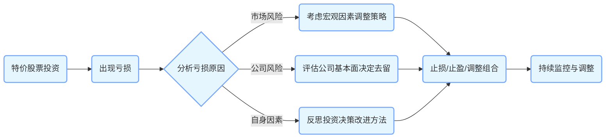

# 如何处理特价股票投资中的亏损

> 关键词：特价股票投资、亏损处理、风险管理、投资策略、止损止盈

> 摘要：本文围绕特价股票投资中亏损的处理展开深入探讨。首先介绍了特价股票投资及亏损处理的背景知识，包括目的、预期读者等。接着阐述了核心概念，分析了特价股票亏损的原因及相关联系。详细讲解了处理亏损的核心算法原理与具体操作步骤，并给出了数学模型和公式。通过实际项目案例，展示了代码实现及解读。探讨了亏损处理在不同场景下的实际应用，推荐了学习、开发等相关的工具和资源。最后总结了未来发展趋势与挑战，解答了常见问题，并提供了扩展阅读和参考资料，旨在为投资者提供全面、实用的处理特价股票投资亏损的方法和思路。

## 1. 背景介绍 
### 1.1 目的和范围
在股票投资领域，特价股票往往因其价格相对较低吸引众多投资者。然而，投资必然伴随着风险，特价股票投资也不例外，亏损情况时有发生。本文的目的在于为投资者提供一套系统、有效的处理特价股票投资中亏损的方法和策略。范围涵盖从亏损原因的分析到具体处理措施的制定，包括风险管理、投资组合调整等方面，旨在帮助投资者在面对亏损时做出明智的决策，降低损失并提高投资收益。

### 1.2 预期读者
本文预期读者主要包括对股票投资有一定了解，尤其是参与特价股票投资的个人投资者。同时，也适用于金融机构的投资顾问、分析师等专业人士，以及对股票投资风险管理感兴趣的研究人员。无论是初涉股市的新手，还是有一定经验的投资者，都能从本文中获取关于处理特价股票投资亏损的有价值信息。

### 1.3 文档结构概述
本文将按照以下结构进行阐述：首先介绍背景知识，包括目的、读者和文档结构等。接着深入探讨核心概念，分析特价股票投资亏损的原因及相关联系。详细讲解处理亏损的核心算法原理与具体操作步骤，并给出相应的数学模型和公式。通过实际项目案例，展示代码实现及解读。探讨亏损处理在不同场景下的实际应用，推荐学习、开发等相关的工具和资源。最后总结未来发展趋势与挑战，解答常见问题，并提供扩展阅读和参考资料。

### 1.4 术语表
#### 1.4.1 核心术语定义
- **特价股票**：指价格相对较低，通常低于其内在价值或市场平均价格的股票。这些股票可能由于公司业绩暂时不佳、行业周期波动或市场情绪等因素导致价格被低估。
- **投资亏损**：投资者在股票投资中，由于股票价格下跌或其他因素导致投资资产价值减少，实际收益低于预期收益的情况。
- **止损**：投资者为了避免损失进一步扩大，在股票价格下跌到一定程度时，设定一个价格点，当股票价格触及该点时，自动卖出股票的操作策略。
- **止盈**：投资者在股票价格上涨到一定程度时，为了锁定利润，设定一个价格点，当股票价格触及该点时，自动卖出股票的操作策略。
- **投资组合**：投资者将资金分散投资于不同的股票或其他资产，以降低单一资产波动带来的风险，实现资产的多元化配置。

#### 1.4.2 相关概念解释
- **价值投资**：一种投资理念，强调通过分析公司的基本面，如财务状况、盈利能力、行业前景等，寻找被低估的股票进行投资，长期持有以获取公司价值增长带来的收益。
- **技术分析**：通过研究股票价格、成交量等历史数据，运用各种技术指标和图表形态，预测股票价格未来走势的分析方法。
- **风险管理**：识别、评估和应对投资过程中可能面临的各种风险，采取相应的措施降低风险对投资收益的影响，确保投资目标的实现。

#### 1.4.3 缩略词列表
- **PE**：市盈率（Price-to-Earnings Ratio），指股票价格除以每股收益的比率，用于衡量股票的估值水平。
- **PB**：市净率（Price-to-Book Ratio），指股票价格除以每股净资产的比率，反映了股票价格相对于公司净资产的倍数。
- **MACD**：指数平滑异同移动平均线（Moving Average Convergence Divergence），一种常用的技术分析指标，用于判断股票价格的趋势和买卖信号。

## 2. 核心概念与联系 

### 核心概念原理
#### 特价股票的形成原理
特价股票的形成通常与多种因素有关。一方面，公司自身的问题可能导致其股票价格下跌。例如，公司业绩不佳，可能是由于产品竞争力下降、市场份额萎缩、管理不善等原因，使得投资者对其未来发展前景持悲观态度，从而抛售股票，导致价格下跌。另一方面，行业和市场因素也会影响股票价格。当整个行业处于衰退期，或者市场出现系统性风险时，即使是一些基本面较好的公司，其股票价格也可能受到拖累而下跌，从而形成特价股票。

#### 投资亏损的原因分析
投资亏损的原因主要包括市场风险、公司风险和投资者自身因素。市场风险是指由于宏观经济环境、政策变化、利率波动等因素导致整个股票市场下跌，从而使投资者持有的股票价格也随之下降。公司风险是指由于公司自身的经营问题、财务困境、法律纠纷等原因导致其股票价格下跌。投资者自身因素包括投资决策失误、缺乏风险意识、盲目跟风等，这些因素可能导致投资者在不恰当的时机买入或卖出股票，从而造成亏损。

#### 处理亏损的策略原理
处理亏损的策略主要基于风险管理和投资组合理论。风险管理的核心是通过识别、评估和控制风险，降低投资损失的可能性和程度。投资组合理论则强调通过分散投资，将资金分配到不同的资产或股票上，以降低单一资产波动对投资组合的影响。常见的处理亏损策略包括止损、止盈、调整投资组合等。止损可以帮助投资者及时止损，避免损失进一步扩大；止盈可以帮助投资者锁定利润，防止利润回吐；调整投资组合可以通过增加或减少某些股票的持仓比例，优化投资组合的风险收益特征。

### 架构的文本示意图
```plaintext
特价股票投资亏损处理架构
|-- 特价股票形成
|   |-- 公司自身问题
|   |   |-- 业绩不佳
|   |   |-- 管理不善
|   |-- 行业和市场因素
|       |-- 行业衰退
|       |-- 市场系统性风险
|-- 投资亏损原因
|   |-- 市场风险
|   |   |-- 宏观经济环境变化
|   |   |-- 政策调整
|   |-- 公司风险
|   |   |-- 经营问题
|   |   |-- 财务困境
|   |-- 投资者自身因素
|       |-- 投资决策失误
|       |-- 缺乏风险意识
|-- 处理亏损策略
|   |-- 止损
|   |-- 止盈
|   |-- 调整投资组合
```

### Mermaid 流程图


## 3. 核心算法原理 & 具体操作步骤 

### 核心算法原理
在处理特价股票投资亏损时，我们可以采用动态止损算法。该算法的核心思想是根据股票价格的波动动态调整止损点，以适应市场变化，最大限度地保护投资者的本金。具体来说，我们可以根据股票的历史价格数据计算出一个合理的止损比例，然后根据当前股票价格动态调整止损点。当股票价格下跌到止损点时，自动卖出股票，避免损失进一步扩大。

### Python 源代码实现
```python
import pandas as pd

def dynamic_stop_loss(prices, initial_stop_loss_ratio=0.1, trailing_stop_loss_ratio=0.05):
    """
    动态止损算法实现
    :param prices: 股票价格序列， pandas.Series 类型
    :param initial_stop_loss_ratio: 初始止损比例
    :param trailing_stop_loss_ratio: 跟踪止损比例
    :return: 止损点序列， pandas.Series 类型
    """
    stop_loss_points = []
    peak_price = prices[0]
    initial_stop_loss = peak_price * (1 - initial_stop_loss_ratio)
    stop_loss_points.append(initial_stop_loss)

    for i in range(1, len(prices)):
        current_price = prices[i]
        if current_price > peak_price:
            peak_price = current_price
            new_stop_loss = peak_price * (1 - trailing_stop_loss_ratio)
            stop_loss_points.append(max(new_stop_loss, stop_loss_points[i - 1]))
        else:
            stop_loss_points.append(stop_loss_points[i - 1])

    return pd.Series(stop_loss_points, index=prices.index)

# 示例数据
prices = pd.Series([100, 102, 105, 103, 101, 99, 98])
stop_loss_points = dynamic_stop_loss(prices)
print("股票价格序列:", prices)
print("止损点序列:", stop_loss_points)
```

### 具体操作步骤
1. **数据准备**：获取特价股票的历史价格数据，可以从金融数据提供商或证券交易所网站获取。将数据整理成 pandas.Series 类型，方便后续处理。
2. **设置参数**：根据自己的风险承受能力和投资目标，设置初始止损比例和跟踪止损比例。初始止损比例用于确定最初的止损点，跟踪止损比例用于动态调整止损点。
3. **调用动态止损算法**：将股票价格序列和参数传入 dynamic_stop_loss 函数，计算止损点序列。
4. **监控股票价格**：实时监控股票价格，当股票价格下跌到止损点时，及时卖出股票。
5. **调整参数**：根据市场情况和投资效果，适时调整初始止损比例和跟踪止损比例，以优化止损策略。

## 4. 数学模型和公式 & 详细讲解 & 举例说明 

### 数学模型和公式
#### 初始止损点计算公式
初始止损点 $S_0$ 的计算公式为：
$$S_0 = P_0 \times (1 - r_0)$$
其中，$P_0$ 为初始股票价格，$r_0$ 为初始止损比例。

#### 跟踪止损点计算公式
当股票价格上涨时，跟踪止损点 $S_i$ 的计算公式为：
$$S_i = \max(P_{peak} \times (1 - r_t), S_{i - 1})$$
其中，$P_{peak}$ 为股票价格的峰值，$r_t$ 为跟踪止损比例，$S_{i - 1}$ 为上一个止损点。

### 详细讲解
初始止损点是在投资开始时确定的，用于保护投资者的本金。当股票价格下跌到初始止损点时，投资者应该及时卖出股票，避免损失进一步扩大。跟踪止损点则是根据股票价格的波动动态调整的。当股票价格上涨时，峰值价格会不断更新，跟踪止损点也会相应提高。这样可以在股票价格上涨时锁定部分利润，同时在股票价格下跌时及时止损。

### 举例说明
假设投资者以 100 元的价格买入一只特价股票，初始止损比例 $r_0$ 为 0.1，跟踪止损比例 $r_t$ 为 0.05。
- 初始止损点 $S_0 = 100 \times (1 - 0.1) = 90$ 元。
- 如果股票价格上涨到 105 元，此时峰值价格 $P_{peak} = 105$ 元，新的跟踪止损点 $S_1 = 105 \times (1 - 0.05) = 99.75$ 元，由于 $99.75 > 90$，所以止损点更新为 99.75 元。
- 如果股票价格继续上涨到 110 元，峰值价格 $P_{peak} = 110$ 元，新的跟踪止损点 $S_2 = 110 \times (1 - 0.05) = 104.5$ 元，止损点更新为 104.5 元。
- 如果股票价格下跌到 102 元，由于 $102 > 104.5$ 不成立，所以止损点保持不变，仍为 104.5 元。
- 当股票价格继续下跌到 104.5 元时，触发止损，投资者卖出股票。

## 5. 项目实战：代码实际案例和详细解释说明 

### 5.1  开发环境搭建
#### 安装 Python
首先，确保你已经安装了 Python 环境。可以从 Python 官方网站（https://www.python.org/downloads/）下载适合你操作系统的 Python 安装包，并按照安装向导进行安装。建议安装 Python 3.7 及以上版本。

#### 安装必要的库
在命令行中使用以下命令安装 pandas 库，用于数据处理和分析：
```sh
pip install pandas
```

### 5.2  源代码详细实现和代码解读
```python
import pandas as pd

def dynamic_stop_loss(prices, initial_stop_loss_ratio=0.1, trailing_stop_loss_ratio=0.05):
    """
    动态止损算法实现
    :param prices: 股票价格序列， pandas.Series 类型
    :param initial_stop_loss_ratio: 初始止损比例
    :param trailing_stop_loss_ratio: 跟踪止损比例
    :return: 止损点序列， pandas.Series 类型
    """
    stop_loss_points = []
    peak_price = prices[0]
    initial_stop_loss = peak_price * (1 - initial_stop_loss_ratio)
    stop_loss_points.append(initial_stop_loss)

    for i in range(1, len(prices)):
        current_price = prices[i]
        if current_price > peak_price:
            peak_price = current_price
            new_stop_loss = peak_price * (1 - trailing_stop_loss_ratio)
            stop_loss_points.append(max(new_stop_loss, stop_loss_points[i - 1]))
        else:
            stop_loss_points.append(stop_loss_points[i - 1])

    return pd.Series(stop_loss_points, index=prices.index)

# 示例数据
prices = pd.Series([100, 102, 105, 103, 101, 99, 98])
stop_loss_points = dynamic_stop_loss(prices)
print("股票价格序列:", prices)
print("止损点序列:", stop_loss_points)
```
#### 代码解读
1. **导入必要的库**：导入 pandas 库，用于数据处理和分析。
2. **定义动态止损函数**：定义 `dynamic_stop_loss` 函数，接受股票价格序列、初始止损比例和跟踪止损比例作为参数。
3. **初始化变量**：初始化止损点列表 `stop_loss_points`，将初始峰值价格设置为股票价格序列的第一个元素，计算初始止损点并添加到列表中。
4. **循环遍历股票价格序列**：从第二个元素开始遍历股票价格序列，根据当前股票价格和峰值价格的关系动态调整止损点。
5. **返回止损点序列**：将止损点列表转换为 pandas.Series 类型，并返回。
6. **示例数据测试**：创建一个示例股票价格序列，调用 `dynamic_stop_loss` 函数计算止损点序列，并打印结果。

### 5.3  代码解读与分析
通过上述代码，我们实现了一个简单的动态止损算法。该算法可以根据股票价格的波动动态调整止损点，有效地保护投资者的本金。在实际应用中，我们可以将该算法集成到股票交易系统中，实现自动化止损。同时，我们还可以根据市场情况和投资目标，调整初始止损比例和跟踪止损比例，以优化止损策略。

## 6. 实际应用场景 
### 个人投资者场景
对于个人投资者来说，处理特价股票投资亏损是一项重要的投资技能。在投资过程中，个人投资者往往缺乏专业的投资知识和经验，容易受到市场情绪的影响，做出错误的投资决策。当投资的特价股票出现亏损时，个人投资者可以运用本文介绍的动态止损算法，及时止损，避免损失进一步扩大。同时，个人投资者还可以根据自己的风险承受能力和投资目标，调整投资组合，降低单一股票的风险。

### 金融机构场景
金融机构如基金公司、证券公司等，通常管理着大量的资金和投资组合。在投资特价股票时，金融机构需要更加严格地控制风险，确保投资组合的稳定性和收益性。金融机构可以利用动态止损算法，对投资组合中的特价股票进行实时监控和止损管理。同时，金融机构还可以通过多元化投资、资产配置等方式，降低投资组合的整体风险。

### 市场波动场景
在市场波动较大的情况下，特价股票的价格波动也会更加剧烈。此时，投资者需要更加谨慎地处理投资亏损。可以运用动态止损算法，根据市场波动情况动态调整止损点，及时锁定利润或止损。同时，投资者还可以关注市场宏观经济数据、政策变化等因素，调整投资策略，以适应市场变化。

## 7. 工具和资源推荐
### 7.1 学习资源推荐
#### 7.1.1 书籍推荐
- 《聪明的投资者》（The Intelligent Investor）：作者本杰明·格雷厄姆（Benjamin Graham），被誉为“价值投资之父”。这本书是价值投资领域的经典之作，详细介绍了价值投资的理念、方法和策略，对投资者处理投资亏损具有重要的指导意义。
- 《金融炼金术》（The Alchemy of Finance）：作者乔治·索罗斯（George Soros），是一位著名的投资家。这本书介绍了索罗斯的投资哲学和方法，包括反身性理论等，对投资者理解市场波动和处理投资亏损有很大的启发。
- 《股票大作手回忆录》（Reminiscences of a Stock Operator）：作者爱德温·勒菲弗（Edwin Lefèvre），以华尔街大空头杰西·利弗莫尔（Jesse Livermore）的交易生涯为蓝本创作。这本书通过生动的故事和案例，介绍了股票投资的技巧和经验，对投资者处理投资亏损有很大的帮助。

#### 7.1.2 在线课程
- Coursera 上的“投资学原理”（Principles of Investing）课程：由宾夕法尼亚大学沃顿商学院的教授授课，系统介绍了投资学的基本原理和方法，包括股票投资、风险管理等内容。
- edX 上的“金融市场”（Financial Markets）课程：由耶鲁大学的教授授课，深入探讨了金融市场的运作机制和投资策略，对投资者处理投资亏损有很大的帮助。
- 中国大学 MOOC 上的“证券投资学”课程：由国内知名高校的教授授课，结合中国证券市场的实际情况，介绍了证券投资的基本理论和方法，包括股票投资、技术分析等内容。

#### 7.1.3 技术博客和网站
- 雪球（https://xueqiu.com/）：国内知名的投资社区，提供股票、基金等投资品种的实时行情、资讯、分析等服务。投资者可以在雪球上与其他投资者交流经验，学习投资知识。
- 东方财富网（https://www.eastmoney.com/）：国内领先的财经网站，提供全面的金融资讯、行情数据、研究报告等服务。投资者可以在东方财富网上获取最新的股票市场信息，了解市场动态。
- Seeking Alpha（https://seekingalpha.com/）：国外知名的投资分析网站，提供全球股票市场的分析、评论、研究报告等服务。投资者可以在 Seeking Alpha 上获取国际市场的投资信息，拓宽投资视野。

### 7.2 开发工具框架推荐
#### 7.2.1 IDE和编辑器
- PyCharm：一款专业的 Python 集成开发环境（IDE），提供代码编辑、调试、版本控制等功能，适合开发 Python 程序。
- Jupyter Notebook：一种交互式的开发环境，支持多种编程语言，包括 Python。Jupyter Notebook 可以将代码、文本、图表等内容整合在一起，方便进行数据分析和可视化。
- Visual Studio Code：一款轻量级的代码编辑器，支持多种编程语言和插件。Visual Studio Code 具有丰富的扩展功能，可以满足不同的开发需求。

#### 7.2.2 调试和性能分析工具
- Py-Spy：一款用于 Python 程序性能分析的工具，可以实时监控 Python 程序的 CPU 使用率、函数调用时间等信息，帮助开发者找出性能瓶颈。
- pdb：Python 内置的调试器，可以在代码中设置断点，逐行执行代码，查看变量的值，帮助开发者调试程序。
- cProfile：Python 内置的性能分析模块，可以统计 Python 程序中各个函数的调用次数、执行时间等信息，帮助开发者优化程序性能。

#### 7.2.3 相关框架和库
- pandas：用于数据处理和分析的 Python 库，提供了高效的数据结构和数据分析工具，适合处理股票价格数据。
- numpy：用于科学计算的 Python 库，提供了高效的数组操作和数学函数，适合进行数值计算和算法实现。
- matplotlib：用于数据可视化的 Python 库，提供了丰富的绘图功能，适合绘制股票价格走势图、止损点走势图等。

### 7.3 相关论文著作推荐
#### 7.3.1 经典论文
- Fama, E. F., & French, K. R. (1992). The cross-section of expected stock returns. The Journal of Finance, 47(2), 427-465. 这篇论文提出了著名的 Fama-French 三因子模型，用于解释股票收益率的横截面差异，对股票投资和风险管理具有重要的理论意义。
- Markowitz, H. M. (1952). Portfolio selection. The Journal of Finance, 7(1), 77-91. 这篇论文是现代投资组合理论的奠基之作，提出了均值-方差模型，用于优化投资组合的风险收益特征，对投资组合管理和风险管理具有重要的指导意义。

#### 7.3.2 最新研究成果
- Barroso, P., & Santa-Clara, P. (2015). Momentum has its moments. Journal of Financial Economics, 116(1), 111-120. 这篇论文研究了动量策略在不同市场环境下的表现，发现动量策略在某些市场环境下具有显著的超额收益，对投资者制定投资策略具有一定的参考价值。
- Harvey, C. R., Liu, Y., & Zhu, H. (2016). … and the cross-section of expected returns. The Review of Financial Studies, 29(1), 5-68. 这篇论文对金融领域中大量的因子进行了研究和检验，发现很多因子的有效性存在问题，对投资者筛选有效的投资因子具有重要的启示作用。

#### 7.3.3 应用案例分析
- Lo, A. W., & MacKinlay, A. C. (1999). A non-random walk down Wall Street. Princeton University Press. 这本书通过实证研究和案例分析，探讨了股票市场的非随机行走特征，对投资者理解市场行为和制定投资策略具有重要的参考价值。
- Taleb, N. N. (2007). The black swan: The impact of the highly improbable. Random House. 这本书通过大量的案例分析，介绍了黑天鹅事件的特点和影响，对投资者认识投资风险和处理投资亏损具有重要的启示作用。

## 8. 总结：未来发展趋势与挑战
### 未来发展趋势
#### 智能化投资
随着人工智能和机器学习技术的不断发展，智能化投资将成为未来股票投资的发展趋势。智能化投资系统可以通过对大量的历史数据和实时数据进行分析和挖掘，自动生成投资策略，实现自动化交易。在处理特价股票投资亏损方面，智能化投资系统可以根据市场变化和投资组合的风险状况，实时调整止损点和投资组合，提高投资决策的准确性和效率。

#### 量化投资
量化投资是指通过数学模型和计算机算法，对股票市场进行量化分析和投资决策的一种投资方式。量化投资可以通过对大量的历史数据进行回测和优化，找出具有统计显著性的投资策略。在处理特价股票投资亏损方面，量化投资可以通过风险模型和止损策略，有效控制投资风险，降低亏损的可能性。

#### 绿色投资
随着全球对环境保护和可持续发展的关注度不断提高，绿色投资将成为未来股票投资的重要方向。绿色投资是指投资于具有环保、可持续发展等特征的企业和项目。在处理特价股票投资亏损方面，绿色投资可以通过关注企业的环境、社会和治理（ESG）因素，筛选出具有长期投资价值的企业，降低投资风险。

### 挑战
#### 数据质量和可靠性
智能化投资和量化投资都依赖于大量的历史数据和实时数据。然而，数据的质量和可靠性往往存在问题，例如数据缺失、数据错误、数据不一致等。这些问题会影响投资模型的准确性和可靠性，从而增加投资风险。因此，如何提高数据的质量和可靠性，是未来处理特价股票投资亏损面临的一个重要挑战。

#### 市场不确定性
股票市场是一个复杂的系统，受到宏观经济环境、政策变化、行业竞争等多种因素的影响，具有很大的不确定性。在市场不确定性增加的情况下，投资策略的有效性会受到影响，处理投资亏损的难度也会增加。因此，如何应对市场不确定性，是未来处理特价股票投资亏损面临的另一个重要挑战。

#### 技术创新和人才短缺
智能化投资和量化投资需要运用先进的人工智能、机器学习、大数据等技术。然而，这些技术的发展日新月异，需要不断进行技术创新和升级。同时，这些领域的专业人才相对短缺，如何培养和吸引优秀的技术人才，是未来处理特价股票投资亏损面临的又一个重要挑战。

## 9. 附录：常见问题与解答
### 问题 1：动态止损算法是否适用于所有类型的股票？
解答：动态止损算法适用于大多数类型的股票，包括特价股票。然而，不同类型的股票价格波动特征可能不同，因此在使用动态止损算法时，需要根据股票的具体情况调整初始止损比例和跟踪止损比例。例如，对于价格波动较大的股票，可以适当提高初始止损比例和跟踪止损比例；对于价格波动较小的股票，可以适当降低初始止损比例和跟踪止损比例。

### 问题 2：如何确定初始止损比例和跟踪止损比例？
解答：初始止损比例和跟踪止损比例的确定需要考虑多个因素，包括投资者的风险承受能力、投资目标、股票的价格波动特征等。一般来说，初始止损比例可以设置为 10% - 20%，跟踪止损比例可以设置为 5% - 10%。然而，这只是一个参考范围，具体的比例需要根据实际情况进行调整。投资者可以通过历史数据回测和模拟交易等方式，找到适合自己的止损比例。

### 问题 3：当股票价格触及止损点时，是否一定要立即卖出股票？
解答：当股票价格触及止损点时，一般建议立即卖出股票，以避免损失进一步扩大。然而，在某些情况下，投资者可以根据市场情况和股票的基本面进行综合判断，决定是否继续持有股票。例如，如果股票价格触及止损点是由于市场短期波动引起的，而股票的基本面仍然良好，投资者可以考虑继续持有股票。但是，这种决策需要投资者具备较强的市场分析能力和风险承受能力。

### 问题 4：除了动态止损算法，还有哪些处理投资亏损的方法？
解答：除了动态止损算法，还有以下几种处理投资亏损的方法：
- 平均成本法：当股票价格下跌时，投资者可以在适当的价位继续买入股票，降低平均成本。当股票价格反弹时，投资者可以获得更高的收益。
- 调整投资组合：投资者可以通过增加或减少某些股票的持仓比例，调整投资组合的风险收益特征。例如，当某只股票出现亏损时，投资者可以减少该股票的持仓比例，增加其他股票或资产的持仓比例。
- 长期投资：对于一些基本面良好的股票，投资者可以采用长期投资的策略，忽略短期价格波动，等待股票价值的回归。

## 10. 扩展阅读 & 参考资料
### 扩展阅读
- 《金融心理学：掌握市场波动的真谛》（The Psychology of Finance: Understanding Market Fluctuations）：这本书介绍了金融市场中的心理学现象和行为金融学理论，帮助投资者理解市场参与者的心理和行为，从而更好地处理投资亏损。
- 《交易心理分析》（Trading in the Zone）：作者马克道格拉斯（Mark Douglas），这本书深入探讨了交易中的心理问题和情绪管理，帮助投资者克服恐惧、贪婪等情绪，提高交易决策的质量。
- 《巴菲特致股东的信：股份公司教程》（The Essays of Warren Buffett: Lessons for Corporate America）：作者沃伦·巴菲特（Warren Buffett），这本书收录了巴菲特历年致股东的信，介绍了他的投资理念、方法和策略，对投资者处理投资亏损具有重要的启示作用。

### 参考资料
- Bloomberg：全球领先的金融信息服务提供商，提供实时的股票行情、财经新闻、研究报告等服务。
- Yahoo Finance：提供全球股票市场的行情数据、财经新闻、公司财报等信息，是投资者获取股票信息的重要来源之一。
- SEC（美国证券交易委员会）官网：提供美国证券市场的监管信息、公司披露文件、法规政策等内容，对投资者了解美国证券市场和上市公司情况具有重要的参考价值。

作者：AI天才研究院/AI Genius Institute & 禅与计算机程序设计艺术 /Zen And The Art of Computer Programming