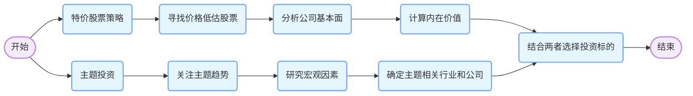

# 如何将特价股票策略与主题投资相结合

> 关键词：特价股票策略、主题投资、投资组合、市场分析、风险管理

> 摘要：本文旨在深入探讨如何将特价股票策略与主题投资相结合，以创造更具优势的投资组合。首先介绍了相关背景，包括目的、预期读者等。接着阐述了特价股票策略和主题投资的核心概念及两者的联系，通过文本示意图和 Mermaid 流程图进行直观展示。详细讲解了核心算法原理，用 Python 代码进行示例，并给出了相关数学模型和公式。通过项目实战，展示了代码的实际案例及详细解释。分析了实际应用场景，推荐了学习资源、开发工具框架和相关论文著作。最后总结了未来发展趋势与挑战，并对常见问题进行了解答。

## 1. 背景介绍 
### 1.1 目的和范围
本文章的目的是为投资者提供一种将特价股票策略与主题投资相结合的有效方法。随着金融市场的不断发展，单一的投资策略往往难以满足投资者多样化的需求和应对复杂多变的市场环境。将特价股票策略与主题投资相结合，可以充分发挥两者的优势，在挖掘被低估股票价值的同时，把握市场的主题趋势，从而提高投资的回报率和降低风险。

本文的范围涵盖了特价股票策略和主题投资的基本概念、核心算法原理、数学模型、实际应用案例以及相关的工具和资源推荐等方面。通过对这些内容的详细阐述，帮助读者全面了解如何将这两种策略有机结合，并应用到实际的投资决策中。

### 1.2 预期读者
本文预期读者主要包括以下几类人群：
- **个人投资者**：希望通过学习和应用专业的投资策略，提高自己的投资水平和收益的普通投资者。
- **金融从业者**：如股票分析师、投资顾问等，他们需要不断更新自己的知识体系，为客户提供更优质的投资建议。
- **金融专业学生**：正在学习金融投资相关课程的学生，通过阅读本文可以加深对投资策略的理解和应用能力。

### 1.3 文档结构概述
本文的文档结构如下：
- **核心概念与联系**：介绍特价股票策略和主题投资的核心概念，以及两者之间的联系，并通过文本示意图和 Mermaid 流程图进行展示。
- **核心算法原理 & 具体操作步骤**：详细讲解将特价股票策略与主题投资相结合的核心算法原理，并使用 Python 代码进行示例。
- **数学模型和公式 & 详细讲解 & 举例说明**：给出相关的数学模型和公式，并进行详细讲解和举例说明。
- **项目实战：代码实际案例和详细解释说明**：通过一个实际的项目案例，展示如何使用代码实现将特价股票策略与主题投资相结合，并对代码进行详细解释。
- **实际应用场景**：分析将特价股票策略与主题投资相结合在实际市场中的应用场景。
- **工具和资源推荐**：推荐相关的学习资源、开发工具框架和论文著作，帮助读者进一步深入学习和研究。
- **总结：未来发展趋势与挑战**：总结将特价股票策略与主题投资相结合的未来发展趋势和面临的挑战。
- **附录：常见问题与解答**：对读者可能遇到的常见问题进行解答。
- **扩展阅读 & 参考资料**：提供相关的扩展阅读材料和参考资料，方便读者进一步学习和研究。

### 1.4 术语表
#### 1.4.1 核心术语定义
- **特价股票策略**：一种基于股票价格被低估的投资策略，投资者通过分析股票的基本面和市场情况，寻找那些价格低于其内在价值的股票进行投资。
- **主题投资**：一种基于宏观经济趋势、政策导向、社会发展等主题因素进行投资的策略，投资者关注那些与特定主题相关的行业和公司，以获取主题发展带来的投资机会。
- **投资组合**：由多种不同的资产组成的集合，投资者通过合理配置资产，以实现风险分散和收益最大化的目标。
- **内在价值**：股票的真实价值，通常通过对公司的财务状况、盈利能力、行业前景等因素进行分析和评估得出。

#### 1.4.2 相关概念解释
- **价值投资**：一种强调股票内在价值的投资理念，与特价股票策略有相似之处，但价值投资更注重长期投资和对公司基本面的深入研究。
- **趋势投资**：一种基于市场趋势进行投资的策略，投资者跟随市场的上涨或下跌趋势进行买卖操作，与主题投资有一定的关联，因为主题投资往往会引发市场的趋势变化。
- **风险分散**：通过投资多种不同的资产，降低投资组合的整体风险。在将特价股票策略与主题投资相结合的过程中，合理选择不同主题和不同类型的特价股票可以实现风险分散。

#### 1.4.3 缩略词列表
- **PE**：市盈率（Price-to-Earnings Ratio），是衡量股票价格相对于公司盈利水平的指标。
- **PB**：市净率（Price-to-Book Ratio），是衡量股票价格相对于公司净资产的指标。
- **ROE**：净资产收益率（Return on Equity），是衡量公司盈利能力的指标。

## 2. 核心概念与联系 

### 特价股票策略
特价股票策略的核心思想是寻找那些价格被低估的股票。投资者通常会通过分析公司的财务报表、行业地位、竞争力等因素，计算出股票的内在价值，并将其与当前市场价格进行比较。如果市场价格低于内在价值，那么这只股票就被认为是特价股票，具有投资价值。

### 主题投资
主题投资则是关注宏观经济趋势、政策导向、社会发展等主题因素。例如，随着科技的不断进步，人工智能、新能源等主题成为了市场关注的热点。投资者会寻找与这些主题相关的行业和公司进行投资，以分享主题发展带来的红利。

### 两者的联系
特价股票策略和主题投资并不是相互独立的，而是可以相互结合的。一方面，在主题投资的过程中，可能会发现一些与主题相关的公司股票价格被低估，这就可以运用特价股票策略进行投资。另一方面，特价股票策略也可以通过关注主题投资的趋势，筛选出那些具有潜在主题发展潜力的特价股票。

### 文本示意图
```plaintext
特价股票策略 <--结合--> 主题投资
|                          |
|                          |
寻找价格低估股票        关注主题趋势
|                          |
|                          |
分析公司基本面            研究宏观因素
|                          |
|                          |
计算内在价值              确定主题相关行业和公司
```

### Mermaid 流程图


## 3. 核心算法原理 & 具体操作步骤 

### 核心算法原理
将特价股票策略与主题投资相结合的核心算法原理可以概括为以下几个步骤：
1. **主题筛选**：根据宏观经济趋势、政策导向、社会发展等因素，确定当前市场的热门主题。
2. **特价股票筛选**：在每个主题相关的行业和公司中，使用特价股票策略筛选出价格被低估的股票。
3. **综合评估**：对筛选出的特价股票进行综合评估，考虑其与主题的相关性、公司的基本面、行业前景等因素。
4. **投资组合构建**：根据综合评估的结果，构建投资组合，合理分配资金。

### 具体操作步骤
以下是使用 Python 代码实现上述步骤的示例：

```python
import pandas as pd
import yfinance as yf

# 步骤 1: 主题筛选
def select_themes():
    # 这里简单假设我们选择了人工智能和新能源两个主题
    themes = ['人工智能', '新能源']
    return themes

# 步骤 2: 特价股票筛选
def select_bargain_stocks(theme):
    # 假设我们有一个包含股票信息的 DataFrame
    stocks_data = pd.read_csv('stocks_data.csv')
    # 筛选出与主题相关的股票
    theme_stocks = stocks_data[stocks_data['主题'] == theme]
    # 这里简单使用市盈率（PE）和市净率（PB）来筛选特价股票
    bargain_stocks = theme_stocks[(theme_stocks['PE'] < 15) & (theme_stocks['PB'] < 1)]
    return bargain_stocks

# 步骤 3: 综合评估
def comprehensive_evaluation(bargain_stocks):
    # 这里简单假设我们根据净资产收益率（ROE）进行评估
    bargain_stocks['评估得分'] = bargain_stocks['ROE']
    sorted_stocks = bargain_stocks.sort_values(by='评估得分', ascending=False)
    return sorted_stocks

# 步骤 4: 投资组合构建
def build_portfolio(sorted_stocks):
    # 选择前 5 只股票构建投资组合
    portfolio = sorted_stocks.head(5)
    # 简单平均分配资金
    portfolio['资金分配比例'] = 1 / len(portfolio)
    return portfolio

# 主函数
def main():
    themes = select_themes()
    all_portfolios = []
    for theme in themes:
        bargain_stocks = select_bargain_stocks(theme)
        sorted_stocks = comprehensive_evaluation(bargain_stocks)
        portfolio = build_portfolio(sorted_stocks)
        all_portfolios.append(portfolio)
    final_portfolio = pd.concat(all_portfolios)
    return final_portfolio

if __name__ == "__main__":
    final_portfolio = main()
    print(final_portfolio)
```

### 代码解释
1. **select_themes 函数**：该函数用于选择当前市场的热门主题，这里简单假设选择了人工智能和新能源两个主题。
2. **select_bargain_stocks 函数**：该函数用于在每个主题相关的行业和公司中筛选出特价股票。使用市盈率（PE）和市净率（PB）作为筛选指标，筛选出 PE 小于 15 且 PB 小于 1 的股票。
3. **comprehensive_evaluation 函数**：该函数用于对筛选出的特价股票进行综合评估。这里简单使用净资产收益率（ROE）作为评估指标，对股票进行排序。
4. **build_portfolio 函数**：该函数用于构建投资组合。选择评估得分最高的前 5 只股票，并简单平均分配资金。
5. **main 函数**：主函数，依次调用上述函数，最终返回一个包含所有主题投资组合的 DataFrame。

## 4. 数学模型和公式 & 详细讲解 & 举例说明 

### 内在价值计算
在特价股票策略中，计算股票的内在价值是关键步骤之一。常用的方法是使用现金流折现模型（DCF），其公式如下：

$$V = \sum_{t=1}^{n} \frac{CF_t}{(1 + r)^t} + \frac{TV}{(1 + r)^n}$$

其中：
- $V$ 表示股票的内在价值
- $CF_t$ 表示第 $t$ 期的现金流
- $r$ 表示折现率
- $n$ 表示预测期数
- $TV$ 表示终值

### 详细讲解
现金流折现模型的基本思想是将未来的现金流折现到当前时刻，以反映其真实价值。具体步骤如下：
1. **预测现金流**：根据公司的历史财务数据和行业前景，预测未来各期的现金流。
2. **确定折现率**：折现率反映了投资者对投资风险的要求，通常可以使用资本资产定价模型（CAPM）来确定。
3. **计算终值**：在预测期结束后，假设公司进入稳定增长阶段，使用戈登增长模型计算终值。
4. **折现现金流和终值**：将各期的现金流和终值按照折现率折现到当前时刻，然后求和得到股票的内在价值。

### 举例说明
假设一家公司未来 3 年的现金流分别为 100 万元、120 万元和 150 万元，预测期结束后公司进入稳定增长阶段，增长率为 5%。折现率为 10%。则该公司股票的内在价值计算如下：

1. 计算各期现金流的折现值：
   - 第 1 年：$PV_1 = \frac{100}{(1 + 0.1)^1} = 90.91$（万元）
   - 第 2 年：$PV_2 = \frac{120}{(1 + 0.1)^2} = 99.17$（万元）
   - 第 3 年：$PV_3 = \frac{150}{(1 + 0.1)^3} = 112.69$（万元）

2. 计算终值：
   - 终值公式为 $TV = \frac{CF_{n+1}}{r - g}$，其中 $CF_{n+1}$ 为预测期结束后第 1 期的现金流，$g$ 为增长率。
   - $CF_{n+1} = 150 \times (1 + 0.05) = 157.5$（万元）
   - $TV = \frac{157.5}{0.1 - 0.05} = 3150$（万元）
   - 终值的折现值：$PV_{TV} = \frac{3150}{(1 + 0.1)^3} = 2361.93$（万元）

3. 计算内在价值：
   - $V = PV_1 + PV_2 + PV_3 + PV_{TV} = 90.91 + 99.17 + 112.69 + 2361.93 = 2664.7$（万元）

### 投资组合优化
在构建投资组合时，需要考虑风险和收益的平衡。常用的方法是使用马科维茨的现代投资组合理论（MPT），其目标是在给定风险水平下最大化预期收益，或在给定预期收益水平下最小化风险。

投资组合的预期收益率 $E(R_p)$ 和方差 $\sigma_p^2$ 的计算公式如下：

$$E(R_p) = \sum_{i=1}^{n} w_i E(R_i)$$

$$\sigma_p^2 = \sum_{i=1}^{n} \sum_{j=1}^{n} w_i w_j \sigma_{ij}$$

其中：
- $w_i$ 和 $w_j$ 分别表示第 $i$ 只和第 $j$ 只股票的权重
- $E(R_i)$ 表示第 $i$ 只股票的预期收益率
- $\sigma_{ij}$ 表示第 $i$ 只和第 $j$ 只股票的协方差

### 详细讲解
现代投资组合理论的核心思想是通过分散投资来降低风险。具体步骤如下：
1. **确定投资标的**：选择一组股票作为投资组合的候选标的。
2. **计算预期收益率和协方差矩阵**：根据历史数据计算每只股票的预期收益率和协方差矩阵。
3. **构建有效前沿**：通过优化算法，在给定风险水平下找到最大化预期收益的投资组合，或在给定预期收益水平下找到最小化风险的投资组合，这些投资组合构成了有效前沿。
4. **选择最优投资组合**：根据投资者的风险偏好，在有效前沿上选择一个最优的投资组合。

### 举例说明
假设我们有 3 只股票 A、B、C，其预期收益率分别为 10%、15% 和 20%，权重分别为 0.3、0.4 和 0.3。协方差矩阵如下：

|  | A | B | C |
| --- | --- | --- | --- |
| A | 0.04 | 0.02 | 0.01 |
| B | 0.02 | 0.06 | 0.03 |
| C | 0.01 | 0.03 | 0.08 |

则投资组合的预期收益率和方差计算如下：

1. 计算预期收益率：
   - $E(R_p) = 0.3 \times 0.1 + 0.4 \times 0.15 + 0.3 \times 0.2 = 0.15$（即 15%）

2. 计算方差：
   - $\sigma_p^2 = 0.3^2 \times 0.04 + 0.4^2 \times 0.06 + 0.3^2 \times 0.08 + 2 \times 0.3 \times 0.4 \times 0.02 + 2 \times 0.3 \times 0.3 \times 0.01 + 2 \times 0.4 \times 0.3 \times 0.03$
   - $\sigma_p^2 = 0.0036 + 0.0096 + 0.0072 + 0.0048 + 0.0018 + 0.0072 = 0.0342$

## 5. 项目实战：代码实际案例和详细解释说明 

### 5.1  开发环境搭建
在进行项目实战之前，需要搭建好开发环境。以下是具体步骤：
1. **安装 Python**：从 Python 官方网站（https://www.python.org/downloads/）下载并安装 Python 3.x 版本。
2. **安装必要的库**：使用以下命令安装所需的库：
```sh
pip install pandas yfinance numpy scipy
```
- `pandas`：用于数据处理和分析。
- `yfinance`：用于获取股票数据。
- `numpy`：用于数值计算。
- `scipy`：用于优化算法。

### 5.2  源代码详细实现和代码解读
以下是一个完整的项目实战代码示例，实现了将特价股票策略与主题投资相结合，并进行投资组合优化的功能：

```python
import pandas as pd
import yfinance as yf
import numpy as np
from scipy.optimize import minimize

# 步骤 1: 主题筛选
def select_themes():
    themes = ['人工智能', '新能源']
    return themes

# 步骤 2: 特价股票筛选
def select_bargain_stocks(theme):
    # 假设我们有一个包含股票信息的 DataFrame
    stocks_data = pd.read_csv('stocks_data.csv')
    theme_stocks = stocks_data[stocks_data['主题'] == theme]
    bargain_stocks = theme_stocks[(theme_stocks['PE'] < 15) & (theme_stocks['PB'] < 1)]
    return bargain_stocks

# 步骤 3: 综合评估
def comprehensive_evaluation(bargain_stocks):
    bargain_stocks['评估得分'] = bargain_stocks['ROE']
    sorted_stocks = bargain_stocks.sort_values(by='评估得分', ascending=False)
    return sorted_stocks

# 步骤 4: 获取股票历史数据
def get_stock_data(symbols, start_date, end_date):
    data = yf.download(symbols, start=start_date, end=end_date)['AdjClose']
    return data

# 步骤 5: 计算预期收益率和协方差矩阵
def calculate_returns_and_covariance(data):
    returns = data.pct_change().dropna()
    expected_returns = returns.mean()
    covariance_matrix = returns.cov()
    return expected_returns, covariance_matrix

# 步骤 6: 投资组合优化
def portfolio_optimization(expected_returns, covariance_matrix, risk_aversion):
    num_assets = len(expected_returns)
    initial_weights = np.ones(num_assets) / num_assets

    def portfolio_utility(weights):
        portfolio_return = np.dot(weights, expected_returns)
        portfolio_variance = np.dot(weights.T, np.dot(covariance_matrix, weights))
        utility = portfolio_return - 0.5 * risk_aversion * portfolio_variance
        return -utility

    constraints = [{'type': 'eq', 'fun': lambda x: np.sum(x) - 1}]
    bounds = [(0, 1) for _ in range(num_assets)]

    result = minimize(portfolio_utility, initial_weights, method='SLSQP', bounds=bounds, constraints=constraints)
    optimal_weights = result.x
    return optimal_weights

# 主函数
def main():
    themes = select_themes()
    all_portfolios = []
    start_date = '2020-01-01'
    end_date = '2023-01-01'
    risk_aversion = 2

    for theme in themes:
        bargain_stocks = select_bargain_stocks(theme)
        sorted_stocks = comprehensive_evaluation(bargain_stocks)
        symbols = sorted_stocks['股票代码'].tolist()
        data = get_stock_data(symbols, start_date, end_date)
        expected_returns, covariance_matrix = calculate_returns_and_covariance(data)
        optimal_weights = portfolio_optimization(expected_returns, covariance_matrix, risk_aversion)
        portfolio = pd.DataFrame({
            '股票代码': symbols,
            '权重': optimal_weights
        })
        all_portfolios.append(portfolio)
    final_portfolio = pd.concat(all_portfolios)
    return final_portfolio

if __name__ == "__main__":
    final_portfolio = main()
    print(final_portfolio)
```

### 代码解读与分析
1. **主题筛选**：`select_themes` 函数选择了人工智能和新能源两个主题。
2. **特价股票筛选**：`select_bargain_stocks` 函数根据市盈率（PE）和市净率（PB）筛选出每个主题下的特价股票。
3. **综合评估**：`comprehensive_evaluation` 函数根据净资产收益率（ROE）对特价股票进行排序。
4. **获取股票历史数据**：`get_stock_data` 函数使用 `yfinance` 库获取股票的历史调整收盘价数据。
5. **计算预期收益率和协方差矩阵**：`calculate_returns_and_covariance` 函数计算股票的预期收益率和协方差矩阵。
6. **投资组合优化**：`portfolio_optimization` 函数使用 `scipy.optimize.minimize` 函数进行投资组合优化，目标是最大化投资组合的效用。
7. **主函数**：`main` 函数依次调用上述函数，最终返回一个包含所有主题投资组合的 DataFrame。

## 6. 实际应用场景 
### 长期投资
将特价股票策略与主题投资相结合适合长期投资。投资者可以通过深入研究宏观经济趋势和主题发展方向，选择具有潜力的主题，并在主题相关的行业中寻找被低估的股票进行长期持有。例如，随着全球对环境保护的重视，新能源主题具有长期的发展潜力。投资者可以关注新能源行业中的特价股票，如一些具有先进技术但股价暂时被低估的光伏企业，长期持有有望获得丰厚的回报。

### 资产配置
在资产配置中，将特价股票策略与主题投资相结合可以提高投资组合的多样性和收益风险比。投资者可以将一部分资金分配到不同主题的特价股票上，以分散风险。例如，同时投资人工智能、新能源、消费升级等不同主题的特价股票，避免因单一主题或行业的波动而导致投资组合大幅下跌。

### 市场波动应对
在市场波动较大的情况下，特价股票策略与主题投资相结合可以帮助投资者把握市场机会。当市场下跌时，一些优质的主题相关股票可能会被错杀，价格出现低估。此时，投资者可以运用特价股票策略筛选出这些股票进行投资。当市场反弹时，这些股票有望获得较高的涨幅。例如，在疫情期间，旅游、航空等行业受到严重冲击，股价大幅下跌。但从长期来看，这些行业仍然具有发展潜力。投资者可以在股价低估时选择一些具有竞争力的旅游和航空企业股票进行投资，等待市场复苏。

## 7. 工具和资源推荐
### 7.1 学习资源推荐
#### 7.1.1 书籍推荐
- 《聪明的投资者》（The Intelligent Investor）：本杰明·格雷厄姆（Benjamin Graham）著，被誉为投资界的圣经，详细介绍了价值投资的理念和方法，对特价股票策略有很大的指导意义。
- 《漫步华尔街》（A Random Walk Down Wall Street）：伯顿·马尔基尔（Burton Malkiel）著，介绍了各种投资策略和市场理论，包括主题投资的相关内容。
- 《投资中最简单的事》：邱国鹭著，结合中国市场的实际情况，讲解了投资的基本原理和方法，对投资者有很大的启发。

#### 7.1.2 在线课程
- Coursera 上的“投资学原理”（Principles of Investments）：由知名大学教授授课，系统介绍了投资学的基本理论和方法，包括投资组合理论、资产定价模型等。
- edX 上的“金融市场”（Financial Markets）：耶鲁大学教授罗伯特·席勒（Robert Shiller）授课，深入讲解了金融市场的运行机制和投资策略。
- 中国大学 MOOC 上的“证券投资学”：国内多所高校联合开设的课程，结合中国证券市场的实际情况，介绍了证券投资的基本知识和技巧。

#### 7.1.3 技术博客和网站
- 雪球网（https://xueqiu.com/）：国内知名的投资社区，提供股票、基金等投资产品的信息和分析，投资者可以在上面交流投资经验和观点。
- 东方财富网（https://www.eastmoney.com/）：提供全面的金融信息和数据，包括股票行情、财经新闻、研究报告等，是投资者获取信息的重要渠道。
- Seeking Alpha（https://seekingalpha.com/）：国外知名的投资分析网站，提供专业的股票分析和投资建议，有很多关于特价股票策略和主题投资的文章。

### 7.2 开发工具框架推荐
#### 7.2.1 IDE和编辑器
- PyCharm：功能强大的 Python 集成开发环境，提供代码编辑、调试、版本控制等功能，适合开发复杂的投资分析程序。
- Jupyter Notebook：交互式的开发环境，支持 Python、R 等多种编程语言，方便进行数据探索和分析，适合快速验证投资策略。
- Visual Studio Code：轻量级的代码编辑器，支持多种编程语言和插件扩展，可用于开发和调试投资分析代码。

#### 7.2.2 调试和性能分析工具
- pdb：Python 自带的调试工具，可用于调试 Python 代码，定位程序中的错误。
- cProfile：Python 标准库中的性能分析工具，可用于分析 Python 程序的性能瓶颈。
- Py-Spy：一个用于分析 Python 程序性能的第三方工具，可实时显示程序的 CPU 使用率和函数调用情况。

#### 7.2.3 相关框架和库
- pandas：强大的数据处理和分析库，提供了 DataFrame 等数据结构，方便进行数据清洗、转换和分析。
- numpy：用于数值计算的基础库，提供了高效的数组和矩阵运算功能。
- scipy：包含了许多科学计算和优化算法的库，可用于投资组合优化等问题。
- yfinance：用于获取股票历史数据的库，简单易用。

### 7.3 相关论文著作推荐
#### 7.3.1 经典论文
- “Portfolio Selection”（《投资组合选择》）：哈里·马科维茨（Harry Markowitz）著，提出了现代投资组合理论，为投资组合优化提供了理论基础。
- “The Capital Asset Pricing Model: Theory and Evidence”（《资本资产定价模型：理论与实证》）：威廉·夏普（William Sharpe）等著，介绍了资本资产定价模型（CAPM），用于计算资产的预期收益率。
- “Value Investing: The Use of Historical Financial Statement Information to Separate Winners from Losers”（《价值投资：利用历史财务报表信息区分赢家和输家》）：约瑟夫·皮奥特罗夫斯基（Joseph Piotroski）著，提出了一种基于财务指标筛选特价股票的方法。

#### 7.3.2 最新研究成果
- 定期关注《金融研究》、《经济研究》等国内权威金融经济期刊，以及 The Journal of Finance、The Review of Financial Studies 等国际知名金融期刊，了解最新的投资策略和理论研究成果。
- 关注知名金融研究机构的研究报告，如摩根士丹利、高盛等投资银行的研究报告，获取最新的市场分析和投资建议。

#### 7.3.3 应用案例分析
- 可以参考一些专业的投资研究机构和咨询公司发布的投资案例分析报告，了解如何将特价股票策略与主题投资相结合应用到实际投资中。例如，清科研究中心、艾瑞咨询等机构会发布一些关于行业投资和主题投资的案例分析报告。

## 8. 总结：未来发展趋势与挑战
### 未来发展趋势
- **智能化和自动化**：随着人工智能和机器学习技术的不断发展，投资决策将越来越智能化和自动化。未来，投资者可以利用智能算法筛选特价股票和确定主题投资方向，提高投资效率和准确性。
- **多元化主题投资**：随着社会的不断发展和变化，主题投资的范围将不断扩大。除了传统的科技、新能源等主题，还将出现更多新兴主题，如人工智能伦理、太空探索、基因编辑等。投资者需要不断关注市场动态，挖掘新的主题投资机会。
- **全球一体化投资**：随着全球经济一体化的加深，投资者将更加关注全球市场的投资机会。将特价股票策略与主题投资相结合的方法可以应用到全球不同市场，寻找具有潜力的国际主题和特价股票。

### 挑战
- **数据质量和可靠性**：在进行特价股票筛选和主题投资分析时，需要大量的高质量数据。然而，数据的质量和可靠性可能存在问题，如数据缺失、错误等。投资者需要花费更多的时间和精力来处理和验证数据。
- **市场不确定性**：金融市场充满了不确定性，宏观经济环境、政策变化、突发事件等都可能对市场产生重大影响。即使采用了特价股票策略和主题投资方法，也无法完全避免市场风险。投资者需要具备较强的风险意识和应对能力。
- **技术更新换代快**：人工智能和机器学习等技术发展迅速，新的算法和模型不断涌现。投资者需要不断学习和更新自己的知识和技能，以适应技术的发展变化。

## 9. 附录：常见问题与解答
### 问题 1：如何确定股票的内在价值？
答：确定股票的内在价值可以使用多种方法，如现金流折现模型（DCF）、相对估值法（如市盈率、市净率等）。现金流折现模型通过预测未来现金流并折现到当前时刻来计算内在价值；相对估值法则通过与同行业其他公司进行比较来评估股票的价值。

### 问题 2：如何选择合适的主题进行投资？
答：选择合适的主题需要关注宏观经济趋势、政策导向、社会发展等因素。可以关注政府的产业政策、科技发展动态、社会热点问题等，从中寻找具有长期发展潜力的主题。同时，要对主题相关的行业和公司进行深入研究，评估其市场前景和竞争力。

### 问题 3：投资组合优化的目标是什么？
答：投资组合优化的目标是在给定风险水平下最大化预期收益，或在给定预期收益水平下最小化风险。通过合理分配资金到不同的资产上，实现风险分散和收益最大化的平衡。

### 问题 4：如何应对市场波动？
答：应对市场波动可以采取以下措施：一是合理配置资产，分散投资风险；二是长期投资，避免短期市场波动的影响；三是定期调整投资组合，根据市场变化及时调整资产配置；四是保持冷静，避免情绪化决策。

## 10. 扩展阅读 & 参考资料
- 格雷厄姆, 多德. 证券分析[M]. 海南出版社, 2006.
- 罗伯特·希勒. 非理性繁荣[M]. 中国人民大学出版社, 2016.
- 邱国鹭. 投资中最简单的事[M]. 中国经济出版社, 2014.
- Markowitz, H. M. (1952). Portfolio selection. The journal of finance, 7(1), 77-91.
- Sharpe, W. F. (1964). Capital asset prices: A theory of market equilibrium under conditions of risk. The journal of finance, 19(3), 425-442.
- Piotroski, J. D. (2000). Value investing: The use of historical financial statement information to separate winners from losers. The Journal of Accounting Research, 38(s1), 1-41.

作者：AI天才研究院/AI Genius Institute & 禅与计算机程序设计艺术 /Zen And The Art of Computer Programming