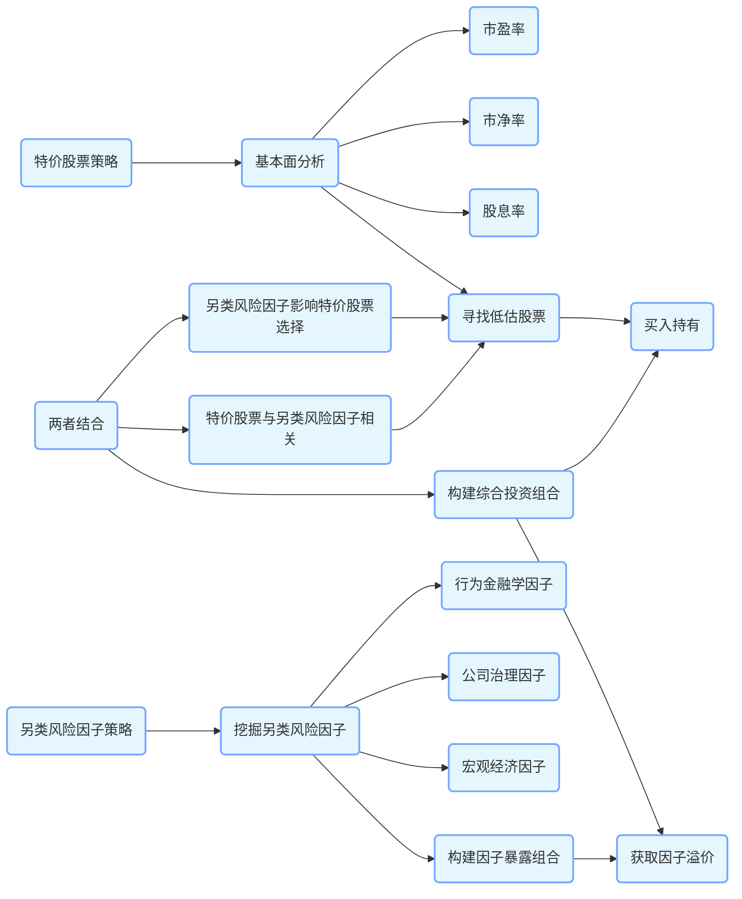

# 如何将特价股票策略与另类风险因子策略相结合

> 关键词：特价股票策略、另类风险因子策略、策略结合、量化投资、风险管理

> 摘要：本文深入探讨了如何将特价股票策略与另类风险因子策略相结合。首先介绍了相关背景知识，包括目的范围、预期读者等。接着阐述了核心概念及其联系，通过示意图和流程图进行清晰展示。详细讲解了核心算法原理及操作步骤，并用 Python 代码实现。分析了相关数学模型和公式，并举例说明。通过项目实战展示代码案例及详细解释。探讨了实际应用场景，推荐了学习、开发相关的工具和资源。最后总结了未来发展趋势与挑战，解答常见问题并提供扩展阅读和参考资料，旨在为投资者和量化分析师提供全面的策略结合指导。

## 1. 背景介绍 
### 1.1 目的和范围
在当今复杂多变的金融市场中，投资者一直在寻求更有效的投资策略以获取超额收益并降低风险。特价股票策略专注于寻找被市场低估的股票，期望通过股票价格的回归来实现盈利；而另类风险因子策略则通过挖掘传统风险因子之外的因素，如行为金融学、公司治理等方面的因子，来构建投资组合。本文章的目的是探讨如何将这两种策略有机结合，以发挥它们各自的优势，提高投资组合的绩效。

本文的范围涵盖了从理论层面的核心概念和算法原理，到实际操作层面的项目实战和应用场景，同时还会推荐相关的学习资源、开发工具以及论文著作，为读者提供一个全面的关于特价股票策略与另类风险因子策略结合的知识体系。

### 1.2 预期读者
本文主要面向以下几类读者：
- 量化投资领域的专业人士，如量化分析师、投资经理等，他们可以从本文中获取新的投资策略思路，丰富自己的投资工具包。
- 金融科技开发者，希望通过学习本文中的算法原理和代码实现，开发相关的量化投资软件和平台。
- 对金融投资感兴趣的学生和爱好者，他们可以通过本文了解量化投资的基本概念和方法，为进一步深入学习打下基础。

### 1.3 文档结构概述
本文将按照以下结构进行阐述：
1. **核心概念与联系**：介绍特价股票策略和另类风险因子策略的核心概念，以及它们之间的联系，并通过示意图和流程图进行展示。
2. **核心算法原理 & 具体操作步骤**：详细讲解将两种策略结合的核心算法原理，并给出具体的操作步骤，同时用 Python 代码进行实现。
3. **数学模型和公式 & 详细讲解 & 举例说明**：分析相关的数学模型和公式，对其进行详细讲解，并通过实际例子进行说明。
4. **项目实战：代码实际案例和详细解释说明**：通过一个实际的项目案例，展示如何将两种策略结合的代码实现，并对代码进行详细解释。
5. **实际应用场景**：探讨两种策略结合在实际金融市场中的应用场景。
6. **工具和资源推荐**：推荐相关的学习资源、开发工具和论文著作。
7. **总结：未来发展趋势与挑战**：总结两种策略结合的未来发展趋势，并分析可能面临的挑战。
8. **附录：常见问题与解答**：解答读者在学习和应用过程中可能遇到的常见问题。
9. **扩展阅读 & 参考资料**：提供相关的扩展阅读材料和参考资料，方便读者进一步深入学习。

### 1.4 术语表
#### 1.4.1 核心术语定义
- **特价股票策略**：一种投资策略，通过分析股票的基本面指标，如市盈率、市净率等，寻找被市场低估的股票，买入并持有，期望在股票价格回归合理价值时获得收益。
- **另类风险因子策略**：基于传统风险因子（如市场风险、规模风险等）之外的因素构建的投资策略，这些因素可以是行为金融学、公司治理、宏观经济等方面的因子。
- **风险因子**：影响资产价格波动的因素，如市场利率、通货膨胀率、公司盈利等。
- **投资组合**：由多种资产组成的集合，投资者通过合理配置资产来实现风险分散和收益最大化。

#### 1.4.2 相关概念解释
- **因子暴露**：投资组合对某个风险因子的敏感度，通常用回归系数来表示。
- **因子溢价**：承担某个风险因子所获得的额外收益。
- **多因子模型**：一种用于解释资产收益的模型，认为资产的收益可以由多个风险因子共同解释。

#### 1.4.3 缩略词列表
- **CAPM**：Capital Asset Pricing Model，资本资产定价模型
- **Fama - French 三因子模型**：一种经典的多因子模型，考虑了市场风险、规模风险和价值风险三个因子。
- **IC**：Information Coefficient，信息系数，用于衡量因子预测能力的指标。

## 2. 核心概念与联系 

### 2.1 特价股票策略核心概念
特价股票策略的核心思想是基于价值投资理念，认为市场有时会对股票定价错误，导致某些股票的价格低于其内在价值。投资者可以通过分析公司的财务报表、行业前景等基本面信息，找出这些被低估的股票。常见的用于评估股票是否被低估的指标包括市盈率（P/E）、市净率（P/B）、股息率等。

例如，如果一家公司的市盈率明显低于同行业其他公司，且其盈利状况良好，那么该股票可能被市场低估，具有投资价值。

### 2.2 另类风险因子策略核心概念
另类风险因子策略则是在传统风险因子的基础上，挖掘一些新的、能够解释资产收益的因素。这些因素可以来自多个领域，如行为金融学中的投资者情绪、公司治理中的董事会独立性等。

通过研究这些另类风险因子，投资者可以构建投资组合，使其对这些因子具有特定的暴露，从而获取因子溢价。例如，如果研究发现投资者情绪因子与股票收益存在显著的正相关关系，那么投资者可以构建一个对投资者情绪因子有较高暴露的投资组合，以期望获得额外的收益。

### 2.3 两者联系
特价股票策略和另类风险因子策略并不是相互独立的，而是存在一定的联系。一方面，另类风险因子可以影响股票的定价，从而影响特价股票的选择。例如，一个具有良好公司治理结构的公司，可能会被市场给予更高的估值，从而降低其成为特价股票的可能性。另一方面，特价股票的存在也可能与某些另类风险因子相关。例如，市场对某些股票的低估可能是由于投资者的过度悲观情绪导致的，而投资者情绪就是一个典型的另类风险因子。

### 2.4 文本示意图
```plaintext
特价股票策略
|-- 基本面分析
|   |-- 市盈率
|   |-- 市净率
|   |-- 股息率
|-- 寻找低估股票
|-- 买入持有

另类风险因子策略
|-- 挖掘另类风险因子
|   |-- 行为金融学因子
|   |-- 公司治理因子
|   |-- 宏观经济因子
|-- 构建因子暴露组合
|-- 获取因子溢价

两者结合
|-- 另类风险因子影响特价股票选择
|-- 特价股票与另类风险因子相关
|-- 构建综合投资组合
```

### 2.5 Mermaid 流程图


## 3. 核心算法原理 & 具体操作步骤 

### 3.1 核心算法原理
将特价股票策略与另类风险因子策略相结合的核心算法原理是通过综合考虑股票的基本面价值和另类风险因子暴露，来构建投资组合。具体步骤如下：
1. **特价股票筛选**：使用基本面指标筛选出被低估的股票。
2. **另类风险因子计算**：计算每只股票对各个另类风险因子的暴露程度。
3. **综合评分**：根据特价股票的基本面评分和另类风险因子暴露评分，计算每只股票的综合评分。
4. **投资组合构建**：根据综合评分，选择得分较高的股票构建投资组合。

### 3.2 具体操作步骤

#### 3.2.1 特价股票筛选
使用 Python 代码实现特价股票筛选，以下是一个简单的示例：
```python
import pandas as pd

# 假设我们有一个包含股票代码、市盈率、市净率等信息的 DataFrame
data = {
    'stock_code': ['A', 'B', 'C', 'D'],
    'pe_ratio': [10, 20, 15, 5],
    'pb_ratio': [1.2, 2.0, 1.5, 0.8]
}
df = pd.DataFrame(data)

# 筛选出市盈率低于 12 且市净率低于 1.5 的股票
cheap_stocks = df[(df['pe_ratio'] < 12) & (df['pb_ratio'] < 1.5)]
print(cheap_stocks)
```

#### 3.2.2 另类风险因子计算
假设我们选择投资者情绪因子作为另类风险因子，我们可以使用一些公开数据或通过情绪分析算法来计算每只股票的投资者情绪得分。以下是一个简单的示例：
```python
# 假设我们有一个包含股票代码和投资者情绪得分的 DataFrame
sentiment_data = {
    'stock_code': ['A', 'B', 'C', 'D'],
    'sentiment_score': [0.8, 0.6, 0.7, 0.9]
}
sentiment_df = pd.DataFrame(sentiment_data)

# 将投资者情绪得分合并到特价股票 DataFrame 中
merged_df = pd.merge(cheap_stocks, sentiment_df, on='stock_code')
print(merged_df)
```

#### 3.2.3 综合评分
假设我们给基本面评分（市盈率和市净率的综合评分）和投资者情绪得分分别赋予 0.6 和 0.4 的权重，计算每只股票的综合评分。
```python
# 计算基本面评分，这里简单假设市盈率和市净率的权重相同
merged_df['fundamental_score'] = (1 / merged_df['pe_ratio'] + 1 / merged_df['pb_ratio']) / 2

# 计算综合评分
merged_df['composite_score'] = 0.6 * merged_df['fundamental_score'] + 0.4 * merged_df['sentiment_score']
print(merged_df)
```

#### 3.2.4 投资组合构建
根据综合评分，选择得分较高的股票构建投资组合。
```python
# 选择综合评分前两名的股票构建投资组合
portfolio = merged_df.nlargest(2, 'composite_score')
print(portfolio)
```

## 4. 数学模型和公式 & 详细讲解 & 举例说明 

### 4.1 特价股票筛选的数学模型
在特价股票筛选中，我们通常使用一些基本面指标来评估股票的价值。以市盈率和市净率为例，我们可以定义一个基本面评分函数 $F$：

$$F = \frac{1}{P/E} + \frac{1}{P/B}$$

其中，$P/E$ 是市盈率，$P/B$ 是市净率。该函数的原理是，市盈率和市净率越低，说明股票越被低估，其倒数越大，基本面评分越高。

例如，对于一只股票，其市盈率为 10，市净率为 1.2，则其基本面评分 $F$ 为：

$$F = \frac{1}{10} + \frac{1}{1.2} \approx 0.933$$

### 4.2 另类风险因子暴露的计算
假设我们选择一个另类风险因子 $X$，对于每只股票 $i$，我们可以通过回归分析来计算其对该因子的暴露 $\beta_i$。具体来说，我们可以使用以下线性回归模型：

$$R_i = \alpha_i + \beta_i X + \epsilon_i$$

其中，$R_i$ 是股票 $i$ 的收益率，$\alpha_i$ 是截距项，$\epsilon_i$ 是误差项。通过最小二乘法估计回归系数 $\beta_i$，就可以得到股票 $i$ 对因子 $X$ 的暴露程度。

例如，我们有 10 只股票的收益率数据和一个另类风险因子 $X$ 的数据，使用 Python 的 `statsmodels` 库进行回归分析：
```python
import numpy as np
import statsmodels.api as sm

# 模拟股票收益率数据
np.random.seed(0)
n_stocks = 10
n_periods = 20
returns = np.random.randn(n_stocks, n_periods)

# 模拟另类风险因子数据
factor = np.random.randn(n_periods)

# 计算每只股票对因子的暴露
betas = []
for i in range(n_stocks):
    X = sm.add_constant(factor)
    model = sm.OLS(returns[i], X)
    results = model.fit()
    betas.append(results.params[1])

print(betas)
```

### 4.3 综合评分的计算
综合评分 $S$ 是基本面评分 $F$ 和另类风险因子暴露评分 $E$ 的加权和：

$$S = w_F F + w_E E$$

其中，$w_F$ 和 $w_E$ 分别是基本面评分和另类风险因子暴露评分的权重，且 $w_F + w_E = 1$。

例如，假设基本面评分的权重 $w_F = 0.6$，另类风险因子暴露评分的权重 $w_E = 0.4$，某只股票的基本面评分 $F = 0.933$，另类风险因子暴露评分 $E = 0.8$，则其综合评分 $S$ 为：

$$S = 0.6 \times 0.933 + 0.4 \times 0.8 = 0.88$$

## 5. 项目实战：代码实际案例和详细解释说明 

### 5.1  开发环境搭建
为了实现将特价股票策略与另类风险因子策略相结合的项目，我们需要搭建以下开发环境：
- **Python 环境**：建议使用 Python 3.7 及以上版本。
- **开发工具**：可以使用 Jupyter Notebook 或 PyCharm 等开发工具。
- **必要的 Python 库**：`pandas`、`numpy`、`statsmodels`、`matplotlib` 等。

可以使用以下命令安装必要的 Python 库：
```sh
pip install pandas numpy statsmodels matplotlib
```

### 5.2  源代码详细实现和代码解读
以下是一个完整的项目代码示例，包括特价股票筛选、另类风险因子计算、综合评分计算和投资组合构建：
```python
import pandas as pd
import numpy as np
import statsmodels.api as sm
import matplotlib.pyplot as plt

# 模拟股票数据
data = {
    'stock_code': ['A', 'B', 'C', 'D', 'E', 'F', 'G', 'H', 'I', 'J'],
    'pe_ratio': [10, 20, 15, 5, 12, 18, 8, 16, 9, 14],
    'pb_ratio': [1.2, 2.0, 1.5, 0.8, 1.3, 1.7, 1.0, 1.6, 1.1, 1.4],
    'returns': [np.random.randn(20) for _ in range(10)]
}
df = pd.DataFrame(data)

# 模拟另类风险因子数据
factor = np.random.randn(20)

# 特价股票筛选
cheap_stocks = df[(df['pe_ratio'] < 12) & (df['pb_ratio'] < 1.5)]

# 计算每只股票对另类风险因子的暴露
betas = []
for i in range(len(cheap_stocks)):
    X = sm.add_constant(factor)
    model = sm.OLS(cheap_stocks.iloc[i]['returns'], X)
    results = model.fit()
    betas.append(results.params[1])

cheap_stocks['beta'] = betas

# 计算基本面评分
cheap_stocks['fundamental_score'] = (1 / cheap_stocks['pe_ratio'] + 1 / cheap_stocks['pb_ratio']) / 2

# 计算另类风险因子暴露评分
# 这里简单假设另类风险因子暴露评分与 beta 成正比
cheap_stocks['exposure_score'] = cheap_stocks['beta']

# 计算综合评分
w_f = 0.6
w_e = 0.4
cheap_stocks['composite_score'] = w_f * cheap_stocks['fundamental_score'] + w_e * cheap_stocks['exposure_score']

# 构建投资组合
portfolio = cheap_stocks.nlargest(3, 'composite_score')

# 打印投资组合
print(portfolio)

# 可视化综合评分
plt.bar(portfolio['stock_code'], portfolio['composite_score'])
plt.xlabel('Stock Code')
plt.ylabel('Composite Score')
plt.title('Composite Score of Portfolio Stocks')
plt.show()
```

### 5.3  代码解读与分析
1. **数据模拟**：使用 `pandas` 库创建一个包含股票代码、市盈率、市净率和收益率的 DataFrame，同时模拟一个另类风险因子数据。
2. **特价股票筛选**：根据市盈率和市净率的条件筛选出被低估的股票。
3. **另类风险因子暴露计算**：使用 `statsmodels` 库进行线性回归分析，计算每只特价股票对另类风险因子的暴露程度。
4. **基本面评分计算**：根据市盈率和市净率计算每只特价股票的基本面评分。
5. **另类风险因子暴露评分计算**：这里简单假设另类风险因子暴露评分与回归系数 $\beta$ 成正比。
6. **综合评分计算**：根据基本面评分和另类风险因子暴露评分的权重，计算每只特价股票的综合评分。
7. **投资组合构建**：选择综合评分最高的三只股票构建投资组合。
8. **可视化**：使用 `matplotlib` 库绘制投资组合中股票的综合评分柱状图，直观展示各股票的综合评分情况。

## 6. 实际应用场景 
### 6.1 对冲基金
对冲基金通常追求绝对收益，通过将特价股票策略与另类风险因子策略相结合，可以构建更具多样性和风险分散性的投资组合。例如，对冲基金可以利用特价股票策略挖掘被低估的股票，同时通过另类风险因子策略来对冲市场风险或获取额外的收益。在市场波动较大时，另类风险因子策略可以帮助对冲基金降低投资组合的波动性，提高风险调整后的收益。

### 6.2 养老金管理
养老金管理机构通常注重长期稳健的投资回报，同时需要控制风险。将特价股票策略与另类风险因子策略相结合，可以为养老金投资提供更丰富的选择。特价股票策略可以提供长期的价值增长潜力，而另类风险因子策略可以帮助养老金管理机构更好地应对市场不确定性。例如，通过关注公司治理等另类风险因子，养老金管理机构可以选择具有良好治理结构的公司股票，降低投资风险。

### 6.3 个人投资者
对于个人投资者来说，将特价股票策略与另类风险因子策略相结合可以帮助他们优化投资组合。个人投资者可以利用基本面分析筛选出被低估的股票，同时关注一些容易获取的另类风险因子，如投资者情绪、行业趋势等。通过这种方式，个人投资者可以在控制风险的前提下，提高投资组合的收益。例如，个人投资者可以在市场情绪低迷时，选择一些被低估且具有良好发展前景的股票进行投资。

## 7. 工具和资源推荐
### 7.1 学习资源推荐
#### 7.1.1 书籍推荐
- 《聪明的投资者》（The Intelligent Investor）：本杰明·格雷厄姆（Benjamin Graham）的经典著作，介绍了价值投资的基本理念和方法，对特价股票策略有深入的阐述。
- 《因子投资：方法与实践》：全面介绍了因子投资的理论和实践，包括另类风险因子的挖掘和应用。
- 《行为金融学》：探讨了投资者的行为偏差对金融市场的影响，为理解另类风险因子提供了理论基础。

#### 7.1.2 在线课程
- Coursera 上的“Quantitative Investing Specialization”：提供了量化投资的系统学习课程，包括因子模型、风险分析等内容。
- edX 上的“Financial Markets”：由耶鲁大学教授罗伯特·席勒（Robert Shiller）授课，介绍了金融市场的基本原理和投资策略。

#### 7.1.3 技术博客和网站
- Seeking Alpha：提供了丰富的金融市场分析和投资策略文章，包括特价股票和因子投资的相关内容。
- Alpha Architect：专注于因子投资和量化策略的研究，发布了许多有价值的研究报告和文章。

### 7.2 开发工具框架推荐
#### 7.2.1 IDE和编辑器
- Jupyter Notebook：交互式的开发环境，适合进行数据分析和模型开发。
- PyCharm：功能强大的 Python 集成开发环境，提供了代码编辑、调试、版本控制等功能。

#### 7.2.2 调试和性能分析工具
- `pdb`：Python 内置的调试器，可以帮助开发者定位代码中的错误。
- `cProfile`：Python 标准库中的性能分析工具，可以分析代码的运行时间和函数调用情况。

#### 7.2.3 相关框架和库
- `pandas`：用于数据处理和分析的 Python 库，提供了高效的数据结构和数据操作方法。
- `numpy`：Python 的数值计算库，提供了高性能的多维数组和数学函数。
- `statsmodels`：用于统计建模和数据分析的 Python 库，支持线性回归、时间序列分析等多种模型。

### 7.3 相关论文著作推荐
#### 7.3.1 经典论文
- Fama, E. F., & French, K. R. (1992). The cross - section of expected stock returns. The Journal of Finance, 47(2), 427 - 465. 提出了 Fama - French 三因子模型，为多因子投资奠定了基础。
- Carhart, M. M. (1997). On persistence in mutual fund performance. The Journal of Finance, 52(1), 57 - 82. 在 Fama - French 三因子模型的基础上加入了动量因子，提出了四因子模型。

#### 7.3.2 最新研究成果
- 关注顶级金融学术期刊，如 The Journal of Finance、The Review of Financial Studies 等，这些期刊会发表关于因子投资和量化策略的最新研究成果。

#### 7.3.3 应用案例分析
- 可以参考一些知名金融机构的研究报告，如高盛、摩根大通等，这些报告通常会包含因子投资策略的实际应用案例和分析。

## 8. 总结：未来发展趋势与挑战
### 8.1 未来发展趋势
- **因子挖掘的深化**：随着金融市场的不断发展和数据技术的进步，未来将有更多的另类风险因子被挖掘出来。这些因子可能来自于新的数据源，如社交媒体数据、卫星图像数据等，为投资策略的构建提供更多的选择。
- **策略的智能化**：人工智能和机器学习技术将在投资策略中得到更广泛的应用。通过机器学习算法，可以对大量的金融数据进行分析和建模，自动识别特价股票和另类风险因子之间的复杂关系，提高投资策略的效率和准确性。
- **全球市场的融合**：随着全球金融市场的一体化程度不断提高，投资者将更加关注全球范围内的投资机会。将特价股票策略与另类风险因子策略相结合的方法也将应用于全球市场，以实现更广泛的风险分散和收益最大化。

### 8.2 挑战
- **数据质量和可靠性**：另类风险因子的挖掘通常需要大量的数据支持，数据的质量和可靠性直接影响到策略的有效性。例如，社交媒体数据可能存在噪音和偏差，需要进行有效的清洗和处理。
- **因子的稳定性**：某些另类风险因子可能在特定的市场环境下有效，但在其他环境下可能失效。因此，需要对因子的稳定性进行深入研究，确保投资策略的长期有效性。
- **监管和合规问题**：随着量化投资策略的不断发展，监管机构对其监管也将更加严格。投资者需要遵守相关的法律法规，确保投资策略的合规性。

## 9. 附录：常见问题与解答
### 9.1 如何选择合适的另类风险因子？
选择合适的另类风险因子需要考虑多个因素，包括因子的经济逻辑、数据可得性、因子的预测能力等。首先，因子应该具有合理的经济解释，能够反映市场中的某种风险或机会。其次，因子的数据应该容易获取，并且具有较高的质量。最后，可以通过历史数据回测和信息系数（IC）等指标来评估因子的预测能力，选择预测能力较强的因子。

### 9.2 如何确定基本面评分和另类风险因子暴露评分的权重？
确定权重的方法有多种，可以根据历史数据进行优化，也可以根据投资者的风险偏好和投资目标来主观设定。一种常见的方法是使用历史数据进行回测，通过调整权重来最大化投资组合的风险调整后收益，如夏普比率。另外，投资者也可以根据自己对基本面分析和因子投资的信心程度来分配权重。

### 9.3 如何处理因子之间的相关性？
当因子之间存在较高的相关性时，可能会导致投资组合的风险集中和因子溢价的重叠。可以通过主成分分析（PCA）等方法对因子进行降维处理，提取相互独立的主成分因子。另外，也可以通过因子正交化的方法，将相关的因子转化为相互独立的因子，从而降低因子之间的相关性。

## 10. 扩展阅读 & 参考资料
### 10.1 扩展阅读
- 《量化投资：策略与技术》：详细介绍了量化投资的各种策略和技术，包括因子投资、机器学习在投资中的应用等内容。
- 《金融数据分析导论：基于R语言》：通过 R 语言介绍了金融数据分析的方法和技巧，对理解和应用量化投资策略有很大帮助。

### 10.2 参考资料
- Yahoo Finance：提供了丰富的金融市场数据，包括股票价格、财务报表等信息，可以用于特价股票筛选和因子计算。
- Bloomberg Terminal：专业的金融信息服务平台，提供了全球金融市场的实时数据和分析工具，适合专业投资者和研究人员使用。

作者：AI天才研究院/AI Genius Institute & 禅与计算机程序设计艺术 /Zen And The Art of Computer Programming