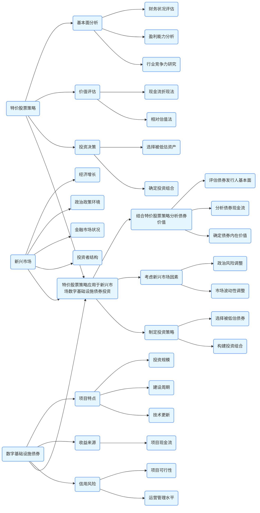

# 如何将特价股票策略应用于新兴市场数字基础设施债券投资

> 关键词：特价股票策略、新兴市场、数字基础设施债券、投资应用、风险评估

> 摘要：本文旨在探讨如何将特价股票策略应用于新兴市场数字基础设施债券投资。首先介绍了相关背景，包括目的、预期读者、文档结构和术语表。接着阐述了核心概念及其联系，通过文本示意图和 Mermaid 流程图进行清晰展示。详细讲解了核心算法原理和具体操作步骤，并用 Python 源代码进行说明。给出了相关数学模型和公式，并举例解释。通过项目实战，从开发环境搭建到源代码实现与解读进行了深入分析。探讨了实际应用场景，推荐了学习资源、开发工具框架和相关论文著作。最后总结了未来发展趋势与挑战，提供了常见问题解答和扩展阅读参考资料，为投资者在新兴市场数字基础设施债券投资中运用特价股票策略提供全面的指导。

## 1. 背景介绍 
### 1.1 目的和范围
在当今全球化的金融市场中，新兴市场的数字基础设施建设正处于快速发展阶段，相关债券投资也日益受到关注。特价股票策略作为一种经过实践检验的投资策略，其核心在于寻找被市场低估的资产以获取超额收益。本研究的目的是探索如何将特价股票策略应用于新兴市场数字基础设施债券投资，为投资者提供新的投资思路和方法。研究范围涵盖了新兴市场的界定、数字基础设施债券的特点以及特价股票策略的关键要素，旨在分析两者结合的可行性、方法和潜在风险。

### 1.2 预期读者
本文的预期读者主要包括专业的金融投资者、投资机构的研究人员、金融分析师以及对新兴市场投资和债券市场感兴趣的学者和学生。对于专业投资者，希望能为他们在资产配置和投资决策中提供新的视角和策略；对于研究人员和分析师，有助于他们深入了解新兴市场数字基础设施债券投资的创新方法；对于学者和学生，则可以作为学习金融投资理论与实践结合的案例参考。

### 1.3 文档结构概述
本文将按照以下结构展开：首先介绍核心概念与联系，明确特价股票策略、新兴市场和数字基础设施债券的定义和相互关系；接着阐述核心算法原理和具体操作步骤，并用 Python 代码进行详细说明；然后给出相关的数学模型和公式，并通过实际例子进行解释；通过项目实战部分，展示如何在实际中应用该策略，包括开发环境搭建、源代码实现和代码解读；探讨实际应用场景，分析该策略在不同情况下的适用性；推荐相关的学习资源、开发工具框架和论文著作；最后总结未来发展趋势与挑战，提供常见问题解答和扩展阅读参考资料。

### 1.4 术语表
#### 1.4.1 核心术语定义
- **特价股票策略**：一种投资策略，通过分析股票的基本面和市场价格，寻找那些被市场低估的股票进行投资，期望在股票价格回归其内在价值时获得收益。
- **新兴市场**：指那些经济发展较快、市场潜力较大但尚未达到发达市场水平的国家和地区的金融市场。这些市场通常具有较高的波动性和增长潜力。
- **数字基础设施债券**：为支持数字基础设施建设项目而发行的债券，包括通信网络、数据中心、云计算等领域的建设。债券发行人通常是政府机构、企业或项目公司。

#### 1.4.2 相关概念解释
- **债券定价**：债券的价格由其未来现金流的现值决定，受到市场利率、债券信用评级、到期时间等因素的影响。在新兴市场，由于市场的不确定性和信息不对称，债券定价可能更加复杂。
- **资产低估**：指资产的市场价格低于其内在价值。内在价值可以通过多种方法进行评估，如现金流折现法、相对估值法等。在特价股票策略中，寻找被低估的资产是关键。
- **风险溢价**：投资者为承担额外风险而要求的额外回报。在新兴市场投资中，由于政治、经济、市场等方面的风险较高，投资者通常要求更高的风险溢价。

#### 1.4.3 缩略词列表
- **EM**：新兴市场（Emerging Markets）
- **DIB**：数字基础设施债券（Digital Infrastructure Bonds）
- **NPV**：净现值（Net Present Value）
- **IRR**：内部收益率（Internal Rate of Return）

## 2. 核心概念与联系 

### 核心概念原理
#### 特价股票策略原理
特价股票策略基于价值投资理念，认为市场有时会出现定价错误，导致某些股票的价格低于其内在价值。投资者通过深入研究公司的基本面，如财务状况、盈利能力、行业竞争力等，找出被低估的股票。当市场逐渐认识到这些股票的真实价值时，价格会上涨，投资者从而获得收益。

#### 新兴市场特点
新兴市场通常具有以下特点：经济增长速度较快，但经济结构相对单一；政治和政策环境不稳定；金融市场发展不完善，信息透明度较低；投资者结构以散户为主，市场波动性较大。这些特点使得新兴市场的投资机会与风险并存。

#### 数字基础设施债券特点
数字基础设施债券的发行目的是为数字基础设施项目筹集资金。这些项目通常具有投资规模大、建设周期长、技术更新快等特点。债券的收益主要来自项目的现金流，其信用风险与项目的可行性、运营管理水平等因素密切相关。

### 架构的文本示意图
```plaintext
特价股票策略
|-- 基本面分析
|   |-- 财务状况评估
|   |-- 盈利能力分析
|   |-- 行业竞争力研究
|-- 价值评估
|   |-- 现金流折现法
|   |-- 相对估值法
|-- 投资决策
|   |-- 选择被低估资产
|   |-- 确定投资组合

新兴市场
|-- 经济增长
|-- 政治政策环境
|-- 金融市场状况
|-- 投资者结构

数字基础设施债券
|-- 项目特点
|   |-- 投资规模
|   |-- 建设周期
|   |-- 技术更新
|-- 收益来源
|   |-- 项目现金流
|-- 信用风险
|   |-- 项目可行性
|   |-- 运营管理水平

特价股票策略应用于新兴市场数字基础设施债券投资
|-- 结合特价股票策略分析债券价值
|   |-- 评估债券发行人基本面
|   |-- 分析债券现金流
|   |-- 确定债券内在价值
|-- 考虑新兴市场因素
|   |-- 政治风险调整
|   |-- 市场波动性调整
|-- 制定投资策略
|   |-- 选择被低估债券
|   |-- 构建投资组合
```

### Mermaid 流程图


## 3. 核心算法原理 & 具体操作步骤 

### 核心算法原理
在将特价股票策略应用于新兴市场数字基础设施债券投资中，核心算法主要围绕债券价值评估和风险调整。以下是主要的算法原理：

#### 现金流折现法评估债券价值
现金流折现法是一种常用的资产估值方法，其基本原理是将债券未来的现金流按照一定的折现率折现到当前时刻，得到债券的内在价值。债券的现金流包括定期支付的利息和到期时偿还的本金。

假设债券每年支付利息 $C$，本金为 $F$，到期年限为 $n$，折现率为 $r$，则债券的内在价值 $V$ 可以用以下公式表示：

$$V = \sum_{t=1}^{n} \frac{C}{(1 + r)^t} + \frac{F}{(1 + r)^n}$$

#### 风险调整折现率
在新兴市场投资中，由于存在较高的风险，需要对折现率进行调整。风险调整折现率 $r_{adj}$ 可以表示为：

$$r_{adj} = r_f + \beta \times (r_m - r_f) + \alpha$$

其中，$r_f$ 是无风险利率，$r_m$ 是市场平均收益率，$\beta$ 是债券的系统性风险系数，$\alpha$ 是新兴市场的额外风险溢价。

### 具体操作步骤
#### 步骤 1：收集数据
收集新兴市场数字基础设施债券的相关信息，包括债券的票面利率、本金、到期时间、发行人的财务报表、行业数据等。同时，收集新兴市场的宏观经济数据、政治风险指标、市场收益率等信息。

#### 步骤 2：评估债券发行人基本面
分析债券发行人的财务状况，包括资产负债表、利润表和现金流量表。评估发行人的盈利能力、偿债能力和运营效率。同时，研究发行人所处的行业竞争地位和发展前景。

#### 步骤 3：分析债券现金流
根据债券的票面利率和本金，计算债券未来的现金流。考虑到数字基础设施项目的特点，可能需要对现金流进行调整，如考虑项目的建设周期、运营阶段的现金流变化等。

#### 步骤 4：确定折现率
根据无风险利率、市场平均收益率、债券的系统性风险系数和新兴市场的额外风险溢价，确定风险调整折现率。

#### 步骤 5：计算债券内在价值
使用现金流折现法，将债券未来的现金流按照风险调整折现率折现到当前时刻，得到债券的内在价值。

#### 步骤 6：比较市场价格和内在价值
将计算得到的债券内在价值与市场价格进行比较。如果内在价值高于市场价格，则认为债券被低估，可以考虑投资。

#### 步骤 7：构建投资组合
根据债券的估值结果和投资者的风险偏好，选择被低估的债券构建投资组合。同时，考虑投资组合的分散化，降低风险。

### Python 源代码实现
```python
import numpy as np

def bond_value(coupon, face_value, maturity, discount_rate):
    """
    计算债券的内在价值
    :param coupon: 每年支付的利息
    :param face_value: 债券本金
    :param maturity: 到期年限
    :param discount_rate: 折现率
    :return: 债券的内在价值
    """
    cash_flows = [coupon] * (maturity - 1) + [coupon + face_value]
    present_values = [cf / (1 + discount_rate) ** (i + 1) for i, cf in enumerate(cash_flows)]
    return sum(present_values)

def risk_adjusted_discount_rate(rf, rm, beta, alpha):
    """
    计算风险调整折现率
    :param rf: 无风险利率
    :param rm: 市场平均收益率
    :param beta: 债券的系统性风险系数
    :param alpha: 新兴市场的额外风险溢价
    :return: 风险调整折现率
    """
    return rf + beta * (rm - rf) + alpha

# 示例数据
coupon = 50  # 每年支付的利息
face_value = 1000  # 债券本金
maturity = 10  # 到期年限
rf = 0.03  # 无风险利率
rm = 0.08  # 市场平均收益率
beta = 1.2  # 债券的系统性风险系数
alpha = 0.02  # 新兴市场的额外风险溢价

# 计算风险调整折现率
r_adj = risk_adjusted_discount_rate(rf, rm, beta, alpha)

# 计算债券内在价值
bond_v = bond_value(coupon, face_value, maturity, r_adj)

print(f"风险调整折现率: {r_adj:.4f}")
print(f"债券内在价值: {bond_v:.2f}")
```

## 4. 数学模型和公式 & 详细讲解 & 举例说明 

### 现金流折现法详细讲解
现金流折现法的核心思想是将未来的现金流按照一定的折现率折现到当前时刻，以反映货币的时间价值。货币具有时间价值，即同样数量的货币在不同时间点的价值是不同的。例如，今天的 100 元钱比一年后的 100 元钱更有价值，因为今天的 100 元钱可以进行投资，获得一定的收益。

在债券投资中，债券的未来现金流包括定期支付的利息和到期时偿还的本金。通过将这些现金流折现到当前时刻，可以得到债券的内在价值。折现率反映了投资者对资金的时间价值和风险的要求。折现率越高，未来现金流的现值越低；折现率越低，未来现金流的现值越高。

### 风险调整折现率详细讲解
风险调整折现率是在无风险利率的基础上，考虑了债券的系统性风险和新兴市场的额外风险溢价。无风险利率通常可以用国债收益率来表示，它反映了资金的基本时间价值。系统性风险系数 $\beta$ 衡量了债券的收益率与市场平均收益率之间的相关性。$\beta$ 值大于 1 表示债券的收益率波动比市场平均收益率波动更大；$\beta$ 值小于 1 表示债券的收益率波动比市场平均收益率波动更小。新兴市场的额外风险溢价 $\alpha$ 是为了补偿投资者在新兴市场投资所面临的政治、经济、市场等方面的额外风险。

### 举例说明
假设某新兴市场数字基础设施债券的票面利率为 5%，本金为 1000 元，到期年限为 5 年。无风险利率为 3%，市场平均收益率为 8%，债券的系统性风险系数 $\beta$ 为 1.1，新兴市场的额外风险溢价 $\alpha$ 为 2%。

#### 步骤 1：计算风险调整折现率
根据风险调整折现率公式：

$$r_{adj} = r_f + \beta \times (r_m - r_f) + \alpha$$

将数据代入公式得：

$$r_{adj} = 0.03 + 1.1 \times (0.08 - 0.03) + 0.02 = 0.03 + 1.1 \times 0.05 + 0.02 = 0.03 + 0.055 + 0.02 = 0.105$$

#### 步骤 2：计算债券每年的利息
债券每年的利息 $C$ 为：

$$C = 1000 \times 0.05 = 50$$

#### 步骤 3：计算债券的内在价值
根据现金流折现法公式：

$$V = \sum_{t=1}^{n} \frac{C}{(1 + r)^t} + \frac{F}{(1 + r)^n}$$

将数据代入公式得：

$$V = \sum_{t=1}^{5} \frac{50}{(1 + 0.105)^t} + \frac{1000}{(1 + 0.105)^5}$$

计算过程如下：

第 1 年利息的现值：$\frac{50}{(1 + 0.105)^1} \approx 45.25$

第 2 年利息的现值：$\frac{50}{(1 + 0.105)^2} \approx 40.95$

第 3 年利息的现值：$\frac{50}{(1 + 0.105)^3} \approx 37.06$

第 4 年利息的现值：$\frac{50}{(1 + 0.105)^4} \approx 33.54$

第 5 年利息和本金的现值：$\frac{50 + 1000}{(1 + 0.105)^5} \approx 641.08$

债券的内在价值 $V$ 为：

$$V \approx 45.25 + 40.95 + 37.06 + 33.54 + 641.08 = 807.88$$

如果该债券的市场价格低于 807.88 元，则认为该债券被低估，可以考虑投资。

## 5. 项目实战：代码实际案例和详细解释说明 

### 5.1  开发环境搭建
#### 安装 Python
首先，需要安装 Python 编程语言。可以从 Python 官方网站（https://www.python.org/downloads/）下载适合自己操作系统的 Python 版本。建议安装 Python 3.7 及以上版本。

#### 安装必要的库
在本项目中，需要使用到 `numpy` 库进行数值计算。可以使用以下命令安装 `numpy` 库：

```sh
pip install numpy
```

#### 选择开发工具
可以选择使用集成开发环境（IDE）如 PyCharm 或 Jupyter Notebook 进行代码开发。PyCharm 提供了丰富的代码编辑、调试和项目管理功能；Jupyter Notebook 则适合进行交互式编程和数据分析。

### 5.2  源代码详细实现和代码解读
以下是一个完整的 Python 代码示例，用于将特价股票策略应用于新兴市场数字基础设施债券投资：

```python
import numpy as np

def bond_value(coupon, face_value, maturity, discount_rate):
    """
    计算债券的内在价值
    :param coupon: 每年支付的利息
    :param face_value: 债券本金
    :param maturity: 到期年限
    :param discount_rate: 折现率
    :return: 债券的内在价值
    """
    cash_flows = [coupon] * (maturity - 1) + [coupon + face_value]
    present_values = [cf / (1 + discount_rate) ** (i + 1) for i, cf in enumerate(cash_flows)]
    return sum(present_values)

def risk_adjusted_discount_rate(rf, rm, beta, alpha):
    """
    计算风险调整折现率
    :param rf: 无风险利率
    :param rm: 市场平均收益率
    :param beta: 债券的系统性风险系数
    :param alpha: 新兴市场的额外风险溢价
    :return: 风险调整折现率
    """
    return rf + beta * (rm - rf) + alpha

def evaluate_bond(coupon, face_value, maturity, rf, rm, beta, alpha):
    """
    评估债券是否被低估
    :param coupon: 每年支付的利息
    :param face_value: 债券本金
    :param maturity: 到期年限
    :param rf: 无风险利率
    :param rm: 市场平均收益率
    :param beta: 债券的系统性风险系数
    :param alpha: 新兴市场的额外风险溢价
    :return: 债券的内在价值
    """
    r_adj = risk_adjusted_discount_rate(rf, rm, beta, alpha)
    bond_v = bond_value(coupon, face_value, maturity, r_adj)
    return bond_v

# 示例数据
coupon = 50  # 每年支付的利息
face_value = 1000  # 债券本金
maturity = 10  # 到期年限
rf = 0.03  # 无风险利率
rm = 0.08  # 市场平均收益率
beta = 1.2  # 债券的系统性风险系数
alpha = 0.02  # 新兴市场的额外风险溢价

# 评估债券
bond_value_result = evaluate_bond(coupon, face_value, maturity, rf, rm, beta, alpha)
print(f"债券内在价值: {bond_value_result:.2f}")
```

### 代码解读与分析
#### `bond_value` 函数
该函数用于计算债券的内在价值。首先，根据债券的票面利率和本金，生成债券未来的现金流列表 `cash_flows`。然后，使用列表推导式将每个现金流按照折现率折现到当前时刻，得到现值列表 `present_values`。最后，将现值列表中的所有元素相加，得到债券的内在价值。

#### `risk_adjusted_discount_rate` 函数
该函数用于计算风险调整折现率。根据无风险利率、市场平均收益率、债券的系统性风险系数和新兴市场的额外风险溢价，使用风险调整折现率公式计算出最终的折现率。

#### `evaluate_bond` 函数
该函数用于评估债券是否被低估。首先调用 `risk_adjusted_discount_rate` 函数计算风险调整折现率，然后调用 `bond_value` 函数计算债券的内在价值。最后返回债券的内在价值。

#### 主程序部分
定义了示例数据，包括债券的票面利率、本金、到期年限、无风险利率、市场平均收益率、债券的系统性风险系数和新兴市场的额外风险溢价。调用 `evaluate_bond` 函数评估债券，并打印出债券的内在价值。

## 6. 实际应用场景 
### 专业投资机构资产配置
专业投资机构如基金公司、保险公司等，通常需要进行多元化的资产配置以降低风险并提高收益。将特价股票策略应用于新兴市场数字基础设施债券投资，可以为投资机构提供新的投资选择。投资机构可以通过深入研究新兴市场数字基础设施债券的基本面和市场情况，寻找被低估的债券，将其纳入投资组合中。例如，某基金公司可以根据债券的内在价值评估结果，调整投资组合中不同债券的权重，以实现投资组合的优化。

### 个人投资者长期投资
对于个人投资者来说，新兴市场数字基础设施债券投资可以作为长期投资的一部分。个人投资者可以利用特价股票策略，选择那些被低估的债券进行投资，分享新兴市场数字基础设施建设带来的长期收益。例如，一位个人投资者可以关注新兴市场国家的 5G 网络建设债券，通过分析债券发行人的基本面和项目前景，选择合适的债券进行投资。

### 政府引导资金投资
政府可以设立引导资金，将其投资于新兴市场数字基础设施债券，以支持数字基础设施建设。政府引导资金可以利用特价股票策略，选择那些具有良好发展前景但暂时被市场低估的债券进行投资。这样既可以为数字基础设施项目提供资金支持，又可以在一定程度上实现资金的保值增值。例如，某新兴市场国家政府设立了数字基础设施发展基金，通过专业的投资团队运用特价股票策略，投资于本国的通信网络建设债券。

## 7. 工具和资源推荐
### 7.1 学习资源推荐
#### 7.1.1 书籍推荐
- 《债券分析与投资》：本书系统介绍了债券的基本概念、定价原理、风险分析和投资策略，是学习债券投资的经典教材。
- 《新兴市场投资》：深入探讨了新兴市场的投资机会和风险，提供了在新兴市场进行投资的方法和案例。
- 《价值投资：从格雷厄姆到巴菲特》：详细介绍了价值投资的理论和实践，包括特价股票策略的核心思想和应用方法。

#### 7.1.2 在线课程
- Coursera 上的“Financial Markets”：由耶鲁大学教授罗伯特·席勒（Robert Shiller）授课，介绍了金融市场的基本原理和投资策略。
- edX 上的“Investment Management”：提供了投资管理的全面知识，包括资产配置、投资组合管理等内容。
- Udemy 上的“Bond Investing for Beginners”：专门针对债券投资初学者，讲解了债券的基本知识和投资技巧。

#### 7.1.3 技术博客和网站
- Seeking Alpha：提供了大量的金融市场分析和投资研究文章，包括新兴市场债券投资的相关内容。
- Bloomberg：全球知名的金融资讯网站，提供实时的金融市场数据和分析报告。
- Investopedia：一个专业的金融知识学习网站，提供了丰富的金融术语解释和投资教程。

### 7.2 开发工具框架推荐
#### 7.2.1 IDE和编辑器
- PyCharm：一款功能强大的 Python 集成开发环境，提供了代码编辑、调试、版本控制等全面的功能。
- Jupyter Notebook：适合进行交互式编程和数据分析，方便用户进行代码的编写、运行和结果展示。
- Visual Studio Code：一款轻量级的代码编辑器，支持多种编程语言，并且有丰富的扩展插件可供选择。

#### 7.2.2 调试和性能分析工具
- pdb：Python 自带的调试工具，可以帮助用户定位代码中的错误。
- cProfile：Python 标准库中的性能分析工具，可以分析代码的运行时间和函数调用情况。
- Py-Spy：一个轻量级的 Python 性能分析工具，可以实时监控 Python 程序的运行情况。

#### 7.2.3 相关框架和库
- numpy：用于进行高效的数值计算，提供了多维数组对象和各种数学函数。
- pandas：用于数据处理和分析，提供了数据结构和数据操作方法。
- scikit-learn：一个强大的机器学习库，可用于构建投资模型和进行风险评估。

### 7.3 相关论文著作推荐
#### 7.3.1 经典论文
- “The Arbitrage Pricing Theory of Capital Asset Pricing” by Stephen A. Ross：提出了套利定价理论，为资产定价提供了新的思路。
- “Efficient Capital Markets: A Review of Theory and Empirical Work” by Eugene F. Fama：对有效市场假说进行了系统的阐述和实证研究。
- “Value Investing: The Use of Historical Financial Statement Information to Separate Winners from Losers” by Joseph D. Piotroski：介绍了如何利用财务报表信息进行价值投资。

#### 7.3.2 最新研究成果
- 关注 SSRN（Social Science Research Network）网站，该网站上有大量最新的金融研究论文，包括新兴市场投资和债券定价的相关研究。
- 阅读顶尖金融学术期刊如《Journal of Finance》、《Journal of Financial Economics》等，了解最新的研究成果和趋势。

#### 7.3.3 应用案例分析
- 一些知名投资机构的研究报告中会包含新兴市场债券投资的应用案例分析，可以参考这些报告了解实际投资中的策略和方法。
- 国际金融组织如世界银行、国际货币基金组织等发布的研究报告和工作论文，也会提供新兴市场投资的案例和经验教训。

## 8. 总结：未来发展趋势与挑战
### 未来发展趋势
#### 新兴市场数字基础设施建设加速
随着全球数字化进程的推进，新兴市场国家对数字基础设施的需求将不断增加。政府和企业将加大对通信网络、数据中心、云计算等领域的投资，这将为数字基础设施债券市场带来更多的发行机会。

#### 特价股票策略应用更加广泛
随着投资者对价值投资理念的认识不断加深，特价股票策略在新兴市场数字基础设施债券投资中的应用将更加广泛。投资者将更加注重债券的基本面分析和内在价值评估，寻找被低估的投资机会。

#### 技术创新推动投资决策优化
人工智能、大数据、机器学习等技术的发展将为新兴市场数字基础设施债券投资带来新的机遇。通过运用这些技术，可以更准确地分析债券的风险和价值，优化投资决策过程。

### 挑战
#### 新兴市场风险较高
新兴市场面临着政治不稳定、经济波动、汇率风险等多种挑战，这些风险会增加数字基础设施债券投资的不确定性。投资者需要更加谨慎地评估风险，并采取有效的风险控制措施。

#### 信息不对称问题
新兴市场的金融市场发展相对不完善，信息透明度较低。投资者可能难以获取准确、及时的债券发行人信息和市场数据，这给债券价值评估和投资决策带来了困难。

#### 市场流动性不足
新兴市场数字基础设施债券市场的流动性可能相对不足，投资者在买卖债券时可能面临较大的交易成本和价格波动风险。这需要投资者在投资前充分考虑市场流动性因素。

## 9. 附录：常见问题与解答
### 问题 1：特价股票策略是否适用于所有新兴市场数字基础设施债券？
解答：特价股票策略并不适用于所有新兴市场数字基础设施债券。该策略主要适用于那些被市场低估的债券。在实际应用中，需要对债券的基本面进行深入分析，包括发行人的财务状况、项目前景、信用评级等，以确定债券是否具有投资价值。

### 问题 2：如何确定新兴市场的额外风险溢价？
解答：新兴市场的额外风险溢价可以通过多种方法确定。一种常见的方法是参考历史数据，分析新兴市场与发达市场之间的收益率差异。另一种方法是考虑新兴市场的政治、经济、市场等方面的风险因素，通过专家评估或模型计算得出额外风险溢价。

### 问题 3：在新兴市场投资数字基础设施债券需要注意哪些风险？
解答：在新兴市场投资数字基础设施债券需要注意以下风险：政治风险，如政府政策变化、政治不稳定等；经济风险，如经济衰退、通货膨胀等；市场风险，如利率波动、汇率波动等；信用风险，如债券发行人违约等。投资者需要对这些风险进行充分评估，并采取相应的风险控制措施。

### 问题 4：如何构建新兴市场数字基础设施债券投资组合？
解答：构建新兴市场数字基础设施债券投资组合需要考虑以下因素：债券的估值情况，选择被低估的债券；债券的信用评级，分散投资于不同信用等级的债券；债券的到期时间，合理搭配不同到期期限的债券；投资者的风险偏好，根据自己的风险承受能力确定投资组合的风险水平。

## 10. 扩展阅读 & 参考资料
### 扩展阅读
- 《金融炼金术》：乔治·索罗斯（George Soros）的著作，探讨了金融市场的运作机制和投资哲学。
- 《聪明的投资者》：本杰明·格雷厄姆（Benjamin Graham）的经典著作，介绍了价值投资的基本原则和方法。
- 《黑天鹅：如何应对不可预知的未来》：纳西姆·尼古拉斯·塔勒布（Nassim Nicholas Taleb）的作品，强调了在投资中要考虑到极端事件的影响。

### 参考资料
- 各国央行和金融监管机构发布的统计数据和研究报告。
- 国际金融组织如世界银行、国际货币基金组织等发布的相关文件和报告。
- 金融学术期刊和研究机构的研究论文。

作者：AI天才研究院/AI Genius Institute & 禅与计算机程序设计艺术 /Zen And The Art of Computer Programming