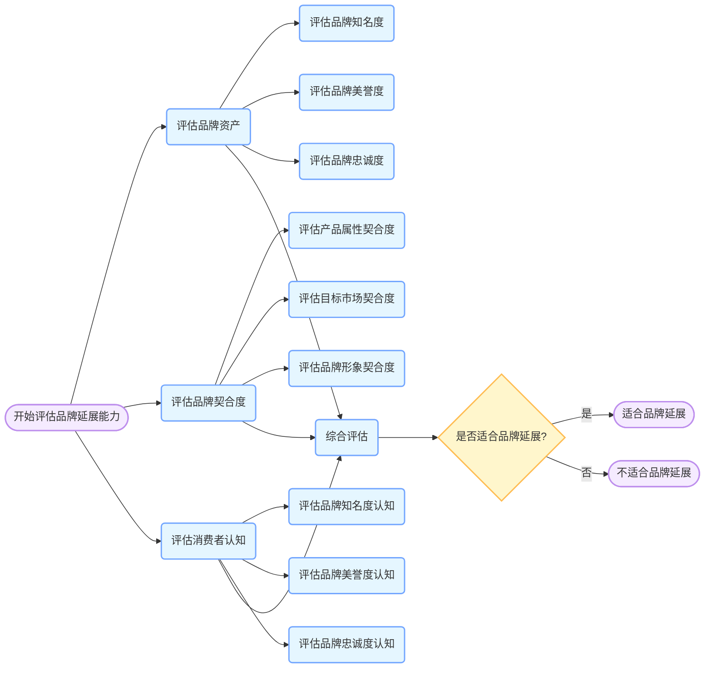

# 如何评估企业的品牌延展能力

> 关键词：企业品牌延展能力、评估指标、品牌资产、市场契合度、消费者认知

> 摘要：本文围绕如何评估企业的品牌延展能力展开深入探讨。首先介绍了评估品牌延展能力的背景和相关概念，包括目的、预期读者、文档结构等。接着阐述了品牌延展的核心概念及联系，通过文本示意图和Mermaid流程图进行直观展示。详细讲解了评估的核心算法原理和具体操作步骤，并结合Python代码进行说明。同时给出了相关的数学模型和公式，辅以举例加深理解。通过项目实战，从开发环境搭建到源代码实现和解读，展示了评估的实际操作。分析了品牌延展能力在不同场景下的实际应用，推荐了学习资源、开发工具框架以及相关论文著作。最后总结了未来发展趋势与挑战，提供常见问题解答和扩展阅读参考资料，旨在为企业准确评估品牌延展能力提供全面且专业的指导。

## 1. 背景介绍 
### 1.1 目的和范围
在当今竞争激烈的市场环境中，企业的品牌延展能力对于其长期发展至关重要。品牌延展是指企业利用已有的品牌资产，将品牌应用到新的产品或服务领域，以实现品牌价值的最大化和业务的多元化增长。本文章的目的在于为企业提供一套系统、科学的方法来评估其品牌延展能力，帮助企业在进行品牌延展决策时做出更明智的选择，降低风险，提高成功率。

本文的范围涵盖了品牌延展能力评估的各个方面，包括核心概念、评估算法、数学模型、实际案例分析以及相关工具和资源推荐等。通过对这些内容的详细阐述，旨在为企业管理者、市场营销人员以及相关研究人员提供全面而深入的参考。

### 1.2 预期读者
本文的预期读者主要包括以下几类人群：
- **企业管理者**：负责企业战略规划和决策的高级管理人员，他们需要了解企业的品牌延展能力，以便制定合理的品牌发展战略，拓展业务领域，提升企业的市场竞争力。
- **市场营销人员**：从事品牌推广、市场调研和产品策划的专业人员，他们需要掌握品牌延展能力的评估方法，为品牌营销活动提供有力支持，确保品牌在新的市场领域中获得成功。
- **投资者**：关注企业发展潜力和投资价值的投资者，他们希望通过评估企业的品牌延展能力，判断企业的未来发展前景，做出更明智的投资决策。
- **研究人员**：从事品牌管理、市场营销等领域研究的学者和专家，他们可以从本文中获取相关的理论和实践经验，为进一步的学术研究提供参考。

### 1.3 文档结构概述
本文将按照以下结构进行组织：
- **核心概念与联系**：介绍品牌延展的核心概念、原理和架构，通过文本示意图和Mermaid流程图直观展示品牌延展的过程和相关要素之间的联系。
- **核心算法原理 & 具体操作步骤**：详细讲解评估品牌延展能力的核心算法原理，并给出具体的操作步骤，同时使用Python代码进行实现和说明。
- **数学模型和公式 & 详细讲解 & 举例说明**：建立评估品牌延展能力的数学模型，给出相关公式，并通过具体的例子进行详细讲解，帮助读者更好地理解和应用这些模型和公式。
- **项目实战：代码实际案例和详细解释说明**：通过一个实际的项目案例，展示如何使用前面介绍的方法和技术来评估企业的品牌延展能力，包括开发环境搭建、源代码实现和代码解读等。
- **实际应用场景**：分析品牌延展能力在不同行业和领域的实际应用场景，探讨企业如何根据自身情况选择合适的品牌延展策略。
- **工具和资源推荐**：推荐一些学习品牌管理和评估品牌延展能力的相关资源，包括书籍、在线课程、技术博客和网站等，同时介绍一些开发工具框架和相关论文著作。
- **总结：未来发展趋势与挑战**：总结品牌延展能力评估的关键要点，分析未来品牌延展的发展趋势和面临的挑战，为企业的品牌发展提供前瞻性的建议。
- **附录：常见问题与解答**：收集并解答一些关于品牌延展能力评估的常见问题，帮助读者更好地理解和应用本文介绍的方法和技术。
- **扩展阅读 & 参考资料**：提供一些相关的扩展阅读材料和参考资料，方便读者进一步深入研究品牌延展能力评估的相关问题。

### 1.4 术语表
#### 1.4.1 核心术语定义
- **品牌延展**：指企业利用已有的品牌资产，将品牌名称、标识、形象等应用到新的产品或服务领域，以借助品牌的知名度、美誉度和忠诚度，快速进入新市场，降低营销成本，提高市场占有率的一种品牌发展战略。
- **品牌资产**：是指品牌所拥有的一系列资产和负债，包括品牌知名度、品牌美誉度、品牌忠诚度、品牌联想等，这些资产和负债会影响消费者对品牌的认知、态度和行为，进而影响品牌的市场价值和盈利能力。
- **品牌契合度**：是指品牌与新的产品或服务之间的匹配程度，包括产品属性契合度、目标市场契合度、品牌形象契合度等。品牌契合度越高，品牌延展的成功率就越高。
- **消费者认知**：是指消费者对品牌的认识、理解和评价，包括品牌的知名度、美誉度、忠诚度、品牌联想等方面。消费者认知是品牌资产的重要组成部分，对品牌延展的成功与否起着关键作用。

#### 1.4.2 相关概念解释
- **品牌定位**：是指企业根据目标市场的需求和竞争状况，为品牌确定一个独特的市场位置，塑造品牌的独特形象，使品牌在消费者心目中占据一个特殊的位置。品牌定位是品牌延展的基础，品牌延展必须与品牌定位保持一致。
- **品牌形象**：是指消费者对品牌的总体印象和评价，包括品牌的个性、价值观、文化内涵等方面。品牌形象是品牌资产的重要组成部分，对品牌延展的成功与否起着重要作用。
- **品牌忠诚度**：是指消费者对品牌的重复购买意愿和行为，是品牌资产的重要组成部分。品牌忠诚度越高，品牌延展的成功率就越高。

#### 1.4.3 缩略词列表
- **USP**：Unique Selling Proposition，独特销售主张
- **SWOT**：Strengths, Weaknesses, Opportunities, Threats，优势、劣势、机会、威胁
- **ROI**：Return on Investment，投资回报率

## 2. 核心概念与联系 
品牌延展的核心概念涉及多个方面，包括品牌资产、品牌契合度和消费者认知等。这些概念相互关联，共同影响着企业的品牌延展能力。

### 核心概念原理
- **品牌资产**：品牌资产是品牌延展的基础，它代表了品牌在消费者心目中的价值和地位。品牌资产越高，品牌的影响力就越大，品牌延展的成功率也就越高。品牌资产可以通过品牌知名度、品牌美誉度、品牌忠诚度等指标来衡量。
- **品牌契合度**：品牌契合度是指品牌与新的产品或服务之间的匹配程度。品牌契合度越高，消费者就越容易接受品牌延展，品牌延展的成功率也就越高。品牌契合度可以从产品属性、目标市场、品牌形象等方面进行评估。
- **消费者认知**：消费者认知是指消费者对品牌的认识、理解和评价。消费者认知是品牌资产的重要组成部分，对品牌延展的成功与否起着关键作用。消费者认知可以通过品牌知名度、品牌美誉度、品牌忠诚度等指标来衡量。

### 架构的文本示意图
```plaintext
品牌延展能力评估
|-- 品牌资产
|   |-- 品牌知名度
|   |-- 品牌美誉度
|   |-- 品牌忠诚度
|-- 品牌契合度
|   |-- 产品属性契合度
|   |-- 目标市场契合度
|   |-- 品牌形象契合度
|-- 消费者认知
|   |-- 品牌知名度认知
|   |-- 品牌美誉度认知
|   |-- 品牌忠诚度认知
```

### Mermaid 流程图


## 3. 核心算法原理 & 具体操作步骤 
### 核心算法原理
评估企业的品牌延展能力可以采用综合评价法，即将品牌资产、品牌契合度和消费者认知等多个指标进行量化，然后根据一定的权重进行加权求和，得到一个综合得分，以此来评估企业的品牌延展能力。

设品牌资产的得分为 $S_1$，品牌契合度的得分为 $S_2$，消费者认知的得分为 $S_3$，品牌延展能力的综合得分为 $S$，各指标的权重分别为 $w_1$、$w_2$、$w_3$，且 $w_1 + w_2 + w_3 = 1$，则综合得分的计算公式为：

$$S = w_1S_1 + w_2S_2 + w_3S_3$$

### 具体操作步骤
1. **确定评估指标和权重**：根据企业的实际情况和评估目的，确定品牌资产、品牌契合度和消费者认知等评估指标，并为每个指标分配相应的权重。
2. **收集数据**：通过市场调研、问卷调查、数据分析等方式，收集品牌资产、品牌契合度和消费者认知等方面的数据。
3. **量化指标得分**：根据收集到的数据，对每个评估指标进行量化，得到相应的得分。
4. **计算综合得分**：根据上述公式，将各指标的得分和权重代入，计算品牌延展能力的综合得分。
5. **评估结果分析**：根据综合得分，对企业的品牌延展能力进行评估和分析，判断企业是否适合进行品牌延展，并提出相应的建议和措施。

### Python 代码实现
```python
# 定义评估指标的权重
w1 = 0.4  # 品牌资产的权重
w2 = 0.3  # 品牌契合度的权重
w3 = 0.3  # 消费者认知的权重

# 定义各指标的得分
S1 = 80  # 品牌资产的得分
S2 = 70  # 品牌契合度的得分
S3 = 75  # 消费者认知的得分

# 计算综合得分
S = w1 * S1 + w2 * S2 + w3 * S3

# 输出结果
print(f"品牌延展能力的综合得分为: {S}")
```

## 4. 数学模型和公式 & 详细讲解 & 举例说明 
### 数学模型和公式
如前所述，评估企业品牌延展能力的数学模型为：

$$S = w_1S_1 + w_2S_2 + w_3S_3$$

其中，$S$ 表示品牌延展能力的综合得分，$S_1$ 表示品牌资产的得分，$S_2$ 表示品牌契合度的得分，$S_3$ 表示消费者认知的得分，$w_1$、$w_2$、$w_3$ 分别表示各指标的权重，且 $w_1 + w_2 + w_3 = 1$。

### 详细讲解
- **品牌资产得分 $S_1$**：品牌资产得分可以通过对品牌知名度、品牌美誉度、品牌忠诚度等指标进行量化得到。例如，可以采用市场调研的方式，让消费者对品牌的知名度、美誉度和忠诚度进行打分，然后根据一定的权重进行加权求和，得到品牌资产的得分。
- **品牌契合度得分 $S_2$**：品牌契合度得分可以通过对产品属性契合度、目标市场契合度、品牌形象契合度等指标进行量化得到。例如，可以采用专家评估的方式，让专家对品牌与新的产品或服务之间的契合度进行打分，然后根据一定的权重进行加权求和，得到品牌契合度的得分。
- **消费者认知得分 $S_3$**：消费者认知得分可以通过对品牌知名度认知、品牌美誉度认知、品牌忠诚度认知等指标进行量化得到。例如，可以采用问卷调查的方式，让消费者对品牌的知名度、美誉度和忠诚度进行评价，然后根据一定的权重进行加权求和，得到消费者认知的得分。
- **权重 $w_1$、$w_2$、$w_3$**：权重的确定需要根据企业的实际情况和评估目的进行合理分配。一般来说，品牌资产的权重可以相对较高，因为品牌资产是品牌延展的基础；品牌契合度和消费者认知的权重可以根据具体情况进行调整。

### 举例说明
假设某企业要评估其品牌延展能力，经过市场调研和专家评估，得到以下数据：
- 品牌资产得分 $S_1 = 85$
- 品牌契合度得分 $S_2 = 75$
- 消费者认知得分 $S_3 = 80$
- 品牌资产的权重 $w_1 = 0.4$
- 品牌契合度的权重 $w_2 = 0.3$
- 消费者认知的权重 $w_3 = 0.3$

将上述数据代入公式 $S = w_1S_1 + w_2S_2 + w_3S_3$，可得：

$$S = 0.4 \times 85 + 0.3 \times 75 + 0.3 \times 80 = 34 + 22.5 + 24 = 80.5$$

因此，该企业的品牌延展能力综合得分为 80.5 分，说明该企业具有较强的品牌延展能力，可以考虑进行品牌延展。

## 5. 项目实战：代码实际案例和详细解释说明 
### 5.1  开发环境搭建
为了实现品牌延展能力评估的代码，我们需要搭建以下开发环境：
- **Python 环境**：建议使用 Python 3.7 及以上版本，可以从 Python 官方网站（https://www.python.org/downloads/）下载并安装。
- **开发工具**：可以使用 PyCharm、VS Code 等集成开发环境（IDE），也可以使用 Jupyter Notebook 进行交互式开发。
- **相关库**：需要安装 `pandas`、`numpy` 等库，用于数据处理和分析。可以使用以下命令进行安装：

```bash
pip install pandas numpy
```

### 5.2  源代码详细实现和代码解读
以下是一个完整的 Python 代码示例，用于评估企业的品牌延展能力：

```python
import pandas as pd
import numpy as np

# 定义评估指标的权重
weights = {
    '品牌资产': 0.4,
    '品牌契合度': 0.3,
    '消费者认知': 0.3
}

# 定义各指标的子指标和权重
sub_weights = {
    '品牌资产': {
        '品牌知名度': 0.4,
        '品牌美誉度': 0.3,
        '品牌忠诚度': 0.3
    },
    '品牌契合度': {
        '产品属性契合度': 0.4,
        '目标市场契合度': 0.3,
        '品牌形象契合度': 0.3
    },
    '消费者认知': {
        '品牌知名度认知': 0.4,
        '品牌美誉度认知': 0.3,
        '品牌忠诚度认知': 0.3
    }
}

# 模拟收集到的数据
data = {
    '品牌资产': {
        '品牌知名度': 80,
        '品牌美誉度': 75,
        '品牌忠诚度': 85
    },
    '品牌契合度': {
        '产品属性契合度': 70,
        '目标市场契合度': 75,
        '品牌形象契合度': 80
    },
    '消费者认知': {
        '品牌知名度认知': 75,
        '品牌美誉度认知': 80,
        '品牌忠诚度认知': 85
    }
}

# 计算各指标的得分
scores = {}
for key in data:
    score = 0
    for sub_key in data[key]:
        score += data[key][sub_key] * sub_weights[key][sub_key]
    scores[key] = score

# 计算综合得分
total_score = 0
for key in scores:
    total_score += scores[key] * weights[key]

# 输出结果
print("各指标得分:")
for key in scores:
    print(f"{key}: {scores[key]}")
print(f"品牌延展能力综合得分: {total_score}")
```

### 5.3  代码解读与分析
- **定义评估指标的权重**：通过字典 `weights` 定义了品牌资产、品牌契合度和消费者认知三个评估指标的权重。
- **定义各指标的子指标和权重**：通过字典 `sub_weights` 定义了每个评估指标的子指标和权重，用于计算各指标的得分。
- **模拟收集到的数据**：通过字典 `data` 模拟了收集到的品牌资产、品牌契合度和消费者认知等方面的数据。
- **计算各指标的得分**：通过嵌套循环遍历 `data` 和 `sub_weights` 字典，计算每个评估指标的得分，并将结果存储在字典 `scores` 中。
- **计算综合得分**：通过遍历 `scores` 字典，根据 `weights` 字典中定义的权重，计算品牌延展能力的综合得分。
- **输出结果**：输出各指标的得分和品牌延展能力的综合得分。

通过以上代码，我们可以方便地评估企业的品牌延展能力，并根据评估结果做出相应的决策。

## 6. 实际应用场景 
品牌延展能力的评估在企业的实际运营中具有广泛的应用场景，以下是一些常见的应用场景：
- **新产品开发**：在企业开发新产品时，可以通过评估品牌延展能力，判断是否可以利用现有的品牌资产推出新产品。如果品牌延展能力较强，可以考虑将品牌应用到新的产品领域，以降低新产品的市场推广成本，提高新产品的市场成功率。
- **市场拓展**：当企业计划进入新的市场时，可以评估品牌在新市场的延展能力。如果品牌在新市场具有较高的知名度、美誉度和忠诚度，且与新市场的目标消费者具有较高的契合度，则可以考虑利用品牌延展的方式进入新市场，以快速打开市场局面。
- **品牌收购与合并**：在企业进行品牌收购或合并时，可以评估被收购或合并品牌的延展能力。如果被收购或合并品牌具有较强的品牌延展能力，可以将其纳入企业的品牌体系，实现品牌资源的整合和优化，提升企业的品牌竞争力。
- **品牌战略规划**：企业在制定品牌战略时，可以通过评估品牌延展能力，确定品牌的发展方向和重点。如果品牌延展能力较强，可以考虑采取品牌多元化战略，拓展品牌的产品线和市场领域；如果品牌延展能力较弱，则可以考虑采取品牌专业化战略，专注于核心产品和市场，提升品牌的核心竞争力。

## 7. 工具和资源推荐
### 7.1 学习资源推荐
#### 7.1.1 书籍推荐
- 《品牌资产管理》：作者大卫·阿克，本书系统地介绍了品牌资产的概念、构成要素和管理方法，是品牌管理领域的经典著作。
- 《定位》：作者艾·里斯和杰克·特劳特，本书提出了“定位”的营销理论，强调品牌要在消费者心目中占据一个独特的位置，是营销领域的经典之作。
- 《市场营销原理》：作者菲利普·科特勒，本书是市场营销领域的权威教材，全面介绍了市场营销的基本原理、策略和方法，对于学习品牌管理和品牌延展具有重要的参考价值。

#### 7.1.2 在线课程
- Coursera 上的“品牌管理”课程：由知名大学的教授授课，系统地介绍了品牌管理的理论和实践，包括品牌定位、品牌传播、品牌延伸等内容。
- edX 上的“市场营销分析”课程：通过案例分析和实践项目，帮助学员掌握市场营销分析的方法和工具，提高品牌管理和决策能力。
- 网易云课堂上的“品牌营销实战训练营”：由实战经验丰富的营销专家授课，分享品牌营销的实战技巧和案例，适合有一定营销基础的学员学习。

#### 7.1.3 技术博客和网站
- 品牌营销网（https://www.brandcn.com/）：提供品牌营销领域的最新资讯、案例分析和研究报告，是了解品牌营销动态的重要渠道。
- 营销智库（https://www.emkt.com.cn/）：专注于市场营销领域的研究和实践，提供营销策划、品牌管理、市场调研等方面的知识和资源。
- 梅花网（https://www.meihua.info/）：汇聚了大量的营销案例和创意作品，为品牌营销人员提供灵感和借鉴。

### 7.2 开发工具框架推荐
#### 7.2.1 IDE和编辑器
- PyCharm：一款专业的 Python 集成开发环境，提供了丰富的代码编辑、调试、版本控制等功能，适合开发 Python 项目。
- VS Code：一款轻量级的代码编辑器，支持多种编程语言和插件扩展，具有强大的代码编辑和调试功能，适合快速开发和调试代码。
- Jupyter Notebook：一种交互式的开发环境，支持 Python、R 等多种编程语言，适合进行数据分析和可视化展示。

#### 7.2.2 调试和性能分析工具
- pdb：Python 自带的调试工具，可以帮助开发者在代码中设置断点、单步执行代码、查看变量值等，方便调试代码。
- cProfile：Python 自带的性能分析工具，可以帮助开发者分析代码的性能瓶颈，找出耗时较长的代码段，进行优化。
- Py-Spy：一款轻量级的 Python 性能分析工具，可以实时监测 Python 程序的性能，找出性能瓶颈，进行优化。

#### 7.2.3 相关框架和库
- pandas：一款用于数据处理和分析的 Python 库，提供了丰富的数据结构和数据操作方法，适合处理和分析品牌延展能力评估中收集到的数据。
- numpy：一款用于科学计算的 Python 库，提供了高效的数组操作和数学函数，适合进行数学模型的计算和实现。
- scikit-learn：一款用于机器学习的 Python 库，提供了丰富的机器学习算法和工具，适合进行品牌延展能力评估中的数据分析和建模。

### 7.3 相关论文著作推荐
#### 7.3.1 经典论文
- Aaker, D. A. (1990). Brand extensions: The good, the bad, and the ugly. Sloan Management Review, 31(4), 47-56.
- Keller, K. L. (1993). Conceptualizing, measuring, and managing customer-based brand equity. Journal of Marketing, 57(1), 1-22.
- Tauber, E. M. (1981). Brand leverage: Strategy for growth in the 1980s. Journal of Advertising Research, 21(2), 26-34.

#### 7.3.2 最新研究成果
- Hsu, C. L., & Chen, C. H. (2020). The impact of brand extension on brand equity: A meta-analysis. Journal of Business Research, 112, 112-123.
- Kim, J. W., & Lavack, A. M. (2021). Brand extension success: The role of brand image congruence and perceived quality. Journal of Product & Brand Management, 30(3), 247-260.
- Zhang, Y., & Ding, X. (2022). The moderating effect of brand familiarity on the relationship between brand extension and brand attitude. Journal of Business & Industrial Marketing, 37(6), 1123-1134.

#### 7.3.3 应用案例分析
- Kotler, P., & Armstrong, G. (2019). Principles of marketing (17th ed.). Pearson.
- Ries, A., & Trout, J. (2001). Positioning: The battle for your mind. McGraw-Hill.
- Aaker, D. A., & Joachimsthaler, E. (2000). Brand leadership. Free Press.

## 8. 总结：未来发展趋势与挑战
### 总结
本文围绕如何评估企业的品牌延展能力展开了全面而深入的探讨。通过介绍品牌延展的核心概念、评估算法、数学模型和实际案例，为企业提供了一套系统、科学的评估方法。同时，推荐了相关的学习资源、开发工具框架和论文著作，帮助读者进一步深入学习和研究品牌延展能力评估的相关问题。

### 未来发展趋势
- **数字化和智能化**：随着信息技术的不断发展，品牌延展能力评估将越来越依赖于数字化和智能化的手段。例如，利用大数据分析、人工智能算法等技术，可以更准确地收集和分析品牌相关的数据，提高评估的准确性和效率。
- **跨行业和跨界融合**：未来，品牌延展将不再局限于同一行业或领域，而是呈现出跨行业和跨界融合的趋势。企业将更加注重品牌的多元化发展，通过品牌延展进入新的行业和领域，实现品牌价值的最大化。
- **消费者体验至上**：消费者体验将成为品牌延展的核心竞争力。企业将更加注重消费者的需求和感受，通过提供优质的产品和服务，提升消费者的满意度和忠诚度，从而为品牌延展打下坚实的基础。

### 挑战
- **品牌形象维护**：在品牌延展过程中，企业需要确保新的产品或服务与品牌形象保持一致，避免对品牌形象造成损害。如果品牌延展不当，可能会导致消费者对品牌的认知和评价发生变化，影响品牌的市场价值和竞争力。
- **市场竞争加剧**：随着品牌延展的普及，市场竞争将越来越激烈。企业需要不断提升品牌的核心竞争力，寻找差异化的竞争优势，才能在市场中脱颖而出。
- **消费者需求变化快速**：消费者需求变化快速，企业需要及时了解和把握消费者的需求变化趋势，调整品牌延展策略，以适应市场的变化。如果企业不能及时跟上消费者需求的变化，可能会导致品牌延展失败。

## 9. 附录：常见问题与解答
### 问题 1：如何确定评估指标的权重？
答：评估指标的权重需要根据企业的实际情况和评估目的进行合理分配。一般来说，可以采用专家评估法、层次分析法等方法来确定权重。在确定权重时，需要考虑各指标对品牌延展能力的影响程度，以及企业的战略重点和发展方向。

### 问题 2：品牌延展失败的原因有哪些？
答：品牌延展失败的原因主要包括以下几个方面：
- 品牌契合度低：品牌与新的产品或服务之间的契合度低，消费者难以接受品牌的延伸。
- 品牌形象受损：品牌延展过程中，新的产品或服务质量不佳，导致消费者对品牌的认知和评价发生变化，损害了品牌形象。
- 市场竞争激烈：市场竞争激烈，新的产品或服务难以在市场中脱颖而出，导致品牌延展失败。
- 消费者需求变化：消费者需求变化快速，品牌延展策略不能及时适应市场的变化，导致品牌延展失败。

### 问题 3：如何提高品牌延展能力？
答：提高品牌延展能力可以从以下几个方面入手：
- 提升品牌资产：通过加强品牌建设，提高品牌的知名度、美誉度和忠诚度，提升品牌资产。
- 增强品牌契合度：在进行品牌延展时，要选择与品牌形象、产品属性、目标市场等方面契合度高的新的产品或服务。
- 关注消费者需求：及时了解和把握消费者的需求变化趋势，根据消费者的需求调整品牌延展策略。
- 加强市场调研：在进行品牌延展之前，要进行充分的市场调研，了解市场需求、竞争状况等信息，为品牌延展决策提供依据。

## 10. 扩展阅读 & 参考资料
### 扩展阅读
- 《品牌的起源》：作者艾·里斯，本书从商业史的角度出发，探讨了品牌的起源和发展规律，为品牌管理提供了新的视角和思路。
- 《营销革命》：作者艾·里斯和杰克·特劳特，本书提出了“营销革命”的理念，强调营销要从消费者的角度出发，寻找差异化的竞争优势，是营销领域的经典之作。
- 《影响力》：作者罗伯特·西奥迪尼，本书介绍了影响人类决策和行为的六大原则，对于品牌营销和品牌传播具有重要的启示作用。

### 参考资料
- Aaker, D. A. (1991). Managing brand equity: Capitalizing on the value of a brand name. Free Press.
- Keller, K. L. (2003). Strategic brand management: Building, measuring, and managing brand equity (2nd ed.). Prentice Hall.
- Kotler, P., & Armstrong, G. (2019). Principles of marketing (17th ed.). Pearson.

作者：AI天才研究院/AI Genius Institute & 禅与计算机程序设计艺术 /Zen And The Art of Computer Programming