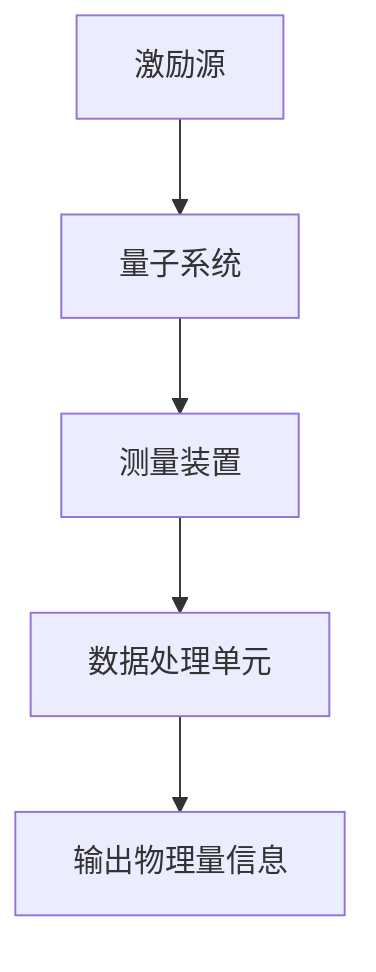

# 如何评估企业的量子传感器地质勘探应用

> 关键词：量子传感器、地质勘探、企业评估、应用效果、技术指标

> 摘要：本文围绕如何评估企业的量子传感器地质勘探应用展开，详细阐述了量子传感器在地质勘探领域的相关背景知识，包括目的范围、预期读者等。深入分析了量子传感器的核心概念与联系，介绍了其核心算法原理及操作步骤，给出了相应的数学模型和公式。通过项目实战案例展示了量子传感器在地质勘探中的具体应用及代码实现。探讨了其实际应用场景，推荐了相关的工具和资源。最后总结了未来发展趋势与挑战，并对常见问题进行了解答，为企业评估量子传感器地质勘探应用提供全面且深入的参考。

## 1. 背景介绍 
### 1.1 目的和范围
量子传感器作为一种新兴的高精度探测技术，在地质勘探领域具有巨大的应用潜力。本评估的目的在于全面、客观地分析企业在地质勘探中应用量子传感器的效果、效益、技术水平等方面的情况，以帮助企业更好地了解自身的优势与不足，为进一步优化应用策略、提高勘探效率和质量提供依据。评估范围涵盖量子传感器的技术性能、地质勘探的实际应用效果、企业的管理与运营能力、经济与社会效益等多个维度。

### 1.2 预期读者
本文的预期读者包括地质勘探企业的管理人员、技术人员，对量子传感器技术感兴趣的科研人员，以及相关行业的投资者等。这些读者希望通过本文深入了解如何评估企业的量子传感器地质勘探应用，从而在决策、技术研发、投资等方面做出更明智的选择。

### 1.3 文档结构概述
本文首先介绍量子传感器地质勘探应用的背景知识，包括目的、读者和文档结构等。接着阐述量子传感器的核心概念与联系，展示其原理和架构。然后讲解核心算法原理和具体操作步骤，给出相关数学模型和公式。通过项目实战案例详细说明代码实现和解读。探讨量子传感器在地质勘探中的实际应用场景。推荐相关的工具和资源，包括学习资源、开发工具框架和论文著作等。最后总结未来发展趋势与挑战，解答常见问题，并提供扩展阅读和参考资料。

### 1.4 术语表
#### 1.4.1 核心术语定义
- **量子传感器**：基于量子力学原理工作的传感器，利用量子态的特性实现对物理量的高精度测量。
- **地质勘探**：是指为了寻找和查明矿产资源，对一定地区内的岩石、地层、构造、矿产、地下水、地貌等地质情况进行调查研究工作。
- **量子态**：量子系统的状态，具有叠加、纠缠等特性。
- **灵敏度**：传感器对被测量变化的响应能力。

#### 1.4.2 相关概念解释
- **量子纠缠**：是指两个或多个量子系统之间存在的一种特殊的关联状态，即使它们在空间上相隔很远，一个系统的状态变化也会瞬间影响另一个系统的状态。
- **量子叠加**：量子系统可以同时处于多个不同的状态的叠加态，直到被测量时才会塌缩到某个确定的状态。

#### 1.4.3 缩略词列表
- **SQUID**：Superconducting Quantum Interference Device，超导量子干涉仪
- **MEMS**：Micro - Electro - Mechanical Systems，微机电系统

## 2. 核心概念与联系 

### 量子传感器的工作原理
量子传感器利用量子态的特性来实现对物理量的测量。例如，利用原子的能级跃迁来测量磁场、重力等物理量。当外界物理量发生变化时，会影响量子系统的状态，通过对量子态的测量和分析，就可以得到外界物理量的信息。

### 量子传感器与地质勘探的联系
地质勘探需要高精度的测量设备来获取地下地质结构、矿产资源等信息。量子传感器具有高灵敏度、高精度等优点，能够检测到微弱的物理信号，如微弱的磁场变化、重力异常等，从而为地质勘探提供更准确的数据，帮助地质学家更好地了解地下地质情况。

### 核心概念原理和架构的文本示意图
量子传感器的基本架构包括量子系统、激励源、测量装置和数据处理单元。激励源用于激发量子系统进入特定的量子态，测量装置对量子态进行测量，得到相应的信号，数据处理单元对测量信号进行分析和处理，最终得到所需的物理量信息。

### Mermaid 流程图


## 3. 核心算法原理 & 具体操作步骤 

### 核心算法原理
以基于原子干涉的量子重力仪为例，其核心算法原理涉及到原子的量子态演化和干涉效应。原子在重力场中会发生量子态的变化，通过对原子的相干操纵和干涉测量，可以得到与重力加速度相关的信号。

### Python 源代码详细阐述
```python
import numpy as np

# 定义一些常量
hbar = 1.0545718e-34  # 约化普朗克常数
m = 1.6726219e-27  # 原子质量

# 模拟原子的量子态演化
def quantum_state_evolution(t, g):
    """
    计算原子在时间 t 内，在重力加速度 g 作用下的量子态演化
    :param t: 时间
    :param g: 重力加速度
    :return: 量子态的相位变化
    """
    phase = m * g * t ** 2 / hbar
    return phase

# 模拟干涉测量
def interference_measurement(t, g1, g2):
    """
    模拟干涉测量，计算两个不同重力加速度下的干涉信号
    :param t: 时间
    :param g1: 第一个重力加速度
    :param g2: 第二个重力加速度
    :return: 干涉信号强度
    """
    phase1 = quantum_state_evolution(t, g1)
    phase2 = quantum_state_evolution(t, g2)
    signal = np.cos(phase1 - phase2)
    return signal

# 示例使用
t = 1e-3  # 时间为 1 毫秒
g1 = 9.8  # 重力加速度 1
g2 = 9.81  # 重力加速度 2
signal = interference_measurement(t, g1, g2)
print(f"干涉信号强度: {signal}")
```

### 具体操作步骤
1. **系统初始化**：将量子系统准备到初始量子态，例如将原子冷却到超冷状态。
2. **激励与演化**：使用激励源对量子系统进行操作，使其在外界物理量的作用下发生量子态的演化。
3. **干涉测量**：对演化后的量子态进行干涉测量，得到干涉信号。
4. **数据处理**：对干涉信号进行分析和处理，提取出所需的物理量信息。

## 4. 数学模型和公式 & 详细讲解 & 举例说明 

### 基于原子干涉的量子重力仪数学模型
在基于原子干涉的量子重力仪中，原子的量子态演化可以用薛定谔方程来描述。对于一个在重力场中自由下落的原子，其哈密顿量可以表示为：

$$H = \frac{p^2}{2m}+m g z$$

其中，$p$ 是原子的动量，$m$ 是原子的质量，$g$ 是重力加速度，$z$ 是原子的位置。

通过求解薛定谔方程，可以得到原子在时间 $t$ 内的量子态相位变化：

$$\Delta\phi = \frac{m g t^2}{\hbar}$$

### 详细讲解
这个公式表明，原子的量子态相位变化与重力加速度 $g$、时间 $t$ 和原子质量 $m$ 成正比，与约化普朗克常数 $\hbar$ 成反比。通过测量原子的相位变化，就可以计算出重力加速度的值。

### 举例说明
假设我们使用一个原子质量 $m = 1.6726219\times10^{-27}\ kg$ 的原子，测量时间 $t = 1\times10^{-3}\ s$，测量得到的相位变化 $\Delta\phi = 1$ 弧度。根据上述公式，可以计算出重力加速度 $g$ 的值：

$$g=\frac{\Delta\phi\hbar}{m t^2}$$

将数值代入公式可得：

$$g=\frac{1\times1.0545718\times10^{-34}}{1.6726219\times10^{-27}\times(1\times10^{-3})^2}\approx6.31\times10^{-5}\ m/s^2$$

## 5. 项目实战：代码实际案例和详细解释说明 

### 5.1  开发环境搭建
- **操作系统**：推荐使用 Linux 或 macOS 系统，因为这些系统对科学计算和开发环境的支持较好。
- **Python 环境**：安装 Python 3.7 及以上版本，可以使用 Anaconda 来管理 Python 环境。
- **相关库**：安装 `numpy`、`scipy` 等科学计算库，用于数值计算和数据处理。

### 5.2  源代码详细实现和代码解读
```python
import numpy as np
import matplotlib.pyplot as plt

# 定义常量
hbar = 1.0545718e-34  # 约化普朗克常数
m = 1.6726219e-27  # 原子质量
t = 1e-3  # 测量时间

# 定义重力加速度范围
g_range = np.linspace(9.7, 9.9, 100)

# 计算干涉信号强度
signals = []
for g in g_range:
    phase = m * g * t ** 2 / hbar
    signal = np.cos(phase)
    signals.append(signal)

# 绘制干涉信号强度随重力加速度变化的曲线
plt.plot(g_range, signals)
plt.xlabel('重力加速度 (m/s^2)')
plt.ylabel('干涉信号强度')
plt.title('干涉信号强度随重力加速度变化曲线')
plt.grid(True)
plt.show()
```

### 代码解读与分析
1. **导入库**：导入 `numpy` 用于数值计算，`matplotlib.pyplot` 用于绘图。
2. **定义常量**：定义约化普朗克常数、原子质量和测量时间。
3. **定义重力加速度范围**：使用 `np.linspace` 生成一个从 9.7 到 9.9 的 100 个点的数组，表示不同的重力加速度值。
4. **计算干涉信号强度**：遍历重力加速度范围，计算每个重力加速度下的量子态相位变化和干涉信号强度。
5. **绘制曲线**：使用 `plt.plot` 绘制干涉信号强度随重力加速度变化的曲线，并添加标签和标题，最后显示图形。

## 6. 实际应用场景 
### 矿产资源勘探
量子传感器可以检测到地下矿产资源引起的微弱重力异常和磁场变化，帮助地质学家更准确地定位矿产资源的位置和范围，提高勘探效率和准确性。

### 地质构造研究
通过测量地球重力场和磁场的微小变化，量子传感器可以揭示地下地质构造的信息，如断层、褶皱等，对于研究地球的演化和地质灾害的预测具有重要意义。

### 地下水探测
量子传感器可以检测到地下水引起的重力变化，从而帮助确定地下水的分布和储量，为水资源的合理开发和利用提供依据。

## 7. 工具和资源推荐
### 7.1 学习资源推荐
#### 7.1.1 书籍推荐
- 《量子力学原理》：介绍量子力学的基本原理和概念，是学习量子传感器的基础书籍。
- 《地质勘探技术》：全面介绍地质勘探的方法和技术，帮助了解地质勘探的需求和应用场景。

#### 7.1.2 在线课程
- Coursera 上的“量子物理学基础”：由知名高校的教授授课，系统讲解量子物理学的基础知识。
- edX 上的“地质勘探与地球物理”：介绍地质勘探的相关理论和技术，包括地球物理方法的应用。

#### 7.1.3 技术博客和网站
- 量子计算技术博客：分享量子计算和量子传感器的最新研究成果和技术进展。
- 地质勘探在线：提供地质勘探领域的行业资讯、技术文章和案例分析。

### 7.2 开发工具框架推荐
#### 7.2.1 IDE和编辑器
- PyCharm：功能强大的 Python 集成开发环境，提供代码编辑、调试、版本控制等功能。
- Jupyter Notebook：交互式的开发环境，适合进行数据分析和可视化。

#### 7.2.2 调试和性能分析工具
- Py-Spy：用于分析 Python 代码的性能，找出性能瓶颈。
- gdb：通用的调试工具，可以用于调试 Python 程序和 C/C++ 扩展模块。

#### 7.2.3 相关框架和库
- Qiskit：IBM 开发的量子计算框架，提供量子算法的实现和模拟功能。
- Geopandas：用于地理空间数据处理和分析的 Python 库，可用于地质勘探数据的处理。

### 7.3 相关论文著作推荐
#### 7.3.1 经典论文
- “Quantum Sensors”：介绍量子传感器的基本原理和应用前景的经典论文。
- “Gravity Gradiometry for Mineral Exploration”：探讨重力梯度测量在矿产勘探中的应用的经典论文。

#### 7.3.2 最新研究成果
- 关注 Nature、Science 等顶级学术期刊上关于量子传感器和地质勘探的最新研究论文。
- 参加相关的国际学术会议，如量子传感器会议、地质勘探年会等，了解最新的研究动态。

#### 7.3.3 应用案例分析
- 分析国内外企业在量子传感器地质勘探应用方面的成功案例，学习其经验和做法。
- 参考相关的行业报告和研究机构的分析，了解量子传感器在地质勘探领域的应用现状和发展趋势。

## 8. 总结：未来发展趋势与挑战
### 未来发展趋势
- **更高的精度和灵敏度**：随着量子技术的不断发展，量子传感器的精度和灵敏度将不断提高，能够检测到更微弱的物理信号，为地质勘探提供更准确的数据。
- **小型化和集成化**：量子传感器将朝着小型化和集成化的方向发展，便于携带和部署，提高勘探效率。
- **多传感器融合**：将量子传感器与其他类型的传感器（如光学传感器、声学传感器等）进行融合，实现多信息融合和互补，提高地质勘探的准确性和可靠性。

### 挑战
- **技术成本高**：量子传感器的研发和制造成本较高，限制了其大规模应用。需要不断降低成本，提高性价比。
- **环境适应性差**：量子传感器对环境条件要求较高，容易受到外界干扰。需要提高其环境适应性，确保在复杂环境下能够正常工作。
- **人才短缺**：量子传感器技术是一门新兴的交叉学科，需要具备量子物理、电子工程、计算机科学等多学科知识的专业人才。目前相关人才短缺，需要加强人才培养。

## 9. 附录：常见问题与解答
### 量子传感器在地质勘探中的精度有多高？
量子传感器具有很高的精度，例如量子重力仪的精度可以达到微伽（$1\ \mu Gal = 10^{-8}\ m/s^2$）级别，能够检测到非常微弱的重力变化。

### 量子传感器的成本高吗？
目前量子传感器的成本相对较高，主要原因是其技术复杂，研发和制造成本较大。但随着技术的不断发展和规模的扩大，成本有望逐渐降低。

### 量子传感器对环境有什么要求？
量子传感器对环境条件要求较高，需要在低温、低噪声、稳定的环境中工作，以减少外界干扰对测量结果的影响。

## 10. 扩展阅读 & 参考资料
- [1] Nielsen, M. A., & Chuang, I. L. (2010). Quantum Computation and Quantum Information. Cambridge University Press.
- [2] Telford, W. M., Geldart, L. P., & Sheriff, R. E. (1990). Applied Geophysics. Cambridge University Press.
- [3] 相关行业标准和技术规范

作者：AI天才研究院/AI Genius Institute & 禅与计算机程序设计艺术 /Zen And The Art of Computer Programming