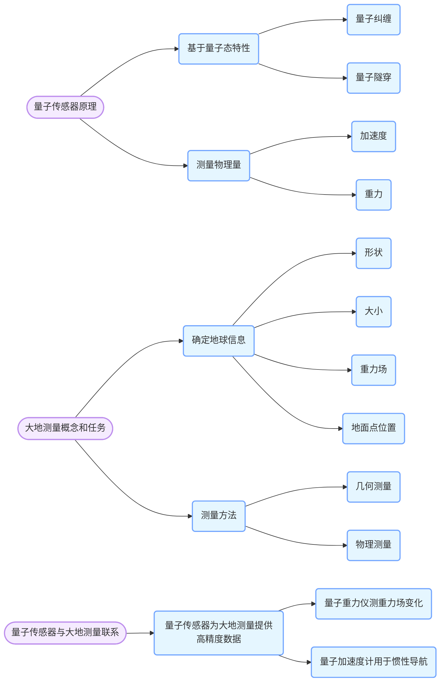

# 如何评估企业的量子传感器大地测量应用

> 关键词：量子传感器、大地测量、企业评估、应用价值、性能指标

> 摘要：本文旨在探讨如何对企业的量子传感器大地测量应用进行全面评估。首先介绍了评估的背景，包括目的、范围、预期读者等内容。接着阐述了量子传感器和大地测量的核心概念及其联系，详细讲解了相关核心算法原理和具体操作步骤，给出了数学模型和公式并举例说明。通过项目实战，展示了代码实际案例并进行详细解释。分析了量子传感器大地测量在实际中的应用场景，推荐了学习、开发工具及相关论文著作。最后总结了未来发展趋势与挑战，还提供了常见问题解答和扩展阅读参考资料，帮助企业更科学地评估量子传感器在大地测量方面的应用。

## 1. 背景介绍 
### 1.1 目的和范围
在当今科技飞速发展的时代，量子传感器在大地测量领域展现出了巨大的潜力。企业对于引入量子传感器进行大地测量应用时，需要进行全面而准确的评估。本评估的目的在于帮助企业判断量子传感器在其大地测量业务中的适用性、可行性和潜在价值，为企业的决策提供科学依据。评估的范围涵盖了量子传感器的技术性能、应用效果、成本效益、市场前景等多个方面，同时考虑企业自身的业务需求、技术实力和资源状况。

### 1.2 预期读者
本文的预期读者主要包括企业的高层管理人员，如CTO、CEO等，他们需要从战略层面做出关于是否引入量子传感器进行大地测量的决策；技术研发人员，他们关注量子传感器的技术细节和实现方式；以及市场和业务拓展人员，他们需要了解量子传感器大地测量应用的市场潜力和商业价值。

### 1.3 文档结构概述
本文将按照以下结构进行阐述：首先介绍量子传感器和大地测量的核心概念及其联系，为后续的评估奠定理论基础；接着详细讲解核心算法原理和具体操作步骤，以及相关的数学模型和公式；通过项目实战展示量子传感器大地测量的代码实现和详细解释；分析实际应用场景，明确其应用价值；推荐相关的学习资源、开发工具和论文著作；最后总结未来发展趋势与挑战，提供常见问题解答和扩展阅读参考资料。

### 1.4 术语表
#### 1.4.1 核心术语定义
- **量子传感器**：基于量子力学原理设计的传感器，利用量子态的特性（如量子纠缠、量子隧穿等）来实现对物理量的高精度测量。
- **大地测量**：对地球形状、大小、重力场以及地面点的几何位置进行精确测定的学科和技术。
- **量子态**：量子系统的状态，描述了量子粒子的各种物理性质，如位置、动量、自旋等。
- **灵敏度**：传感器对被测量变化的响应能力，通常用输出变化量与输入变化量的比值来表示。
- **分辨率**：传感器能够检测到的被测量的最小变化量。

#### 1.4.2 相关概念解释
- **量子纠缠**：是一种量子力学现象，指两个或多个量子系统之间存在一种特殊的关联，使得一个系统的状态变化会立即影响到其他系统的状态，无论它们之间的距离有多远。
- **量子隧穿**：量子粒子能够穿过经典力学中认为不可能穿过的势垒的现象，这是量子力学的一种独特效应。
- **大地水准面**：与平均海水面重合并向大陆、岛屿延伸而形成的闭合曲面，是大地测量中重要的参考面。

#### 1.4.3 缩略词列表
- **GPS**：Global Positioning System，全球定位系统
- **IMU**：Inertial Measurement Unit，惯性测量单元
- **LIDAR**：Light Detection and Ranging，激光雷达

## 2. 核心概念与联系 

### 量子传感器的原理
量子传感器利用量子态的特性来实现对物理量的测量。以基于原子干涉的量子加速度计为例，其基本原理是利用激光将原子冷却到极低温度，形成超冷原子云。然后通过一系列激光脉冲对原子进行操作，使原子处于不同的量子态并发生干涉。当存在加速度时，原子的干涉图样会发生变化，通过检测干涉图样的变化就可以测量出加速度的大小。

### 大地测量的概念和任务
大地测量的主要任务是确定地球的形状、大小和重力场，以及地面点的精确位置。它包括几何大地测量和物理大地测量两个方面。几何大地测量主要通过测量角度、距离等几何量来确定地面点的位置；物理大地测量则通过测量重力场等物理量来研究地球的形状和内部结构。

### 量子传感器与大地测量的联系
量子传感器具有高精度、高灵敏度等优点，能够为大地测量提供更精确的数据。例如，量子重力仪可以测量地球重力场的微小变化，有助于研究地球的内部结构和地壳运动；量子加速度计可以用于高精度的惯性导航，提高大地测量中移动测量设备的定位精度。

### 文本示意图
```plaintext
量子传感器
|--基于量子态特性
|   |--量子纠缠
|   |--量子隧穿
|--测量物理量
|   |--加速度
|   |--重力
|
大地测量
|--确定地球信息
|   |--形状
|   |--大小
|   |--重力场
|   |--地面点位置
|--测量方法
|   |--几何测量
|   |--物理测量
|
联系
|--量子传感器为大地测量提供高精度数据
|   |--量子重力仪测重力场变化
|   |--量子加速度计用于惯性导航
```

### Mermaid 流程图


## 3. 核心算法原理 & 具体操作步骤 

### 量子加速度计的核心算法原理
以基于原子干涉的量子加速度计为例，其核心算法基于原子的量子干涉理论。假设原子的初始波函数为 $\psi_0$，经过一系列激光脉冲操作后，原子会分裂成两个路径，其波函数分别为 $\psi_1$ 和 $\psi_2$。在存在加速度 $a$ 的情况下，两个路径的相位差 $\Delta\phi$ 与加速度 $a$ 有关。

根据量子力学原理，相位差 $\Delta\phi$ 可以表示为：
$$\Delta\phi = k \cdot a \cdot T^2$$
其中 $k$ 是波矢，$T$ 是原子在两个路径上的飞行时间。

通过检测干涉图样的强度 $I$，可以得到相位差 $\Delta\phi$ 与干涉强度的关系：
$$I = I_0 (1 + \cos(\Delta\phi))$$
其中 $I_0$ 是最大干涉强度。

### 具体操作步骤
#### 原子冷却
使用激光冷却技术将原子冷却到极低温度，形成超冷原子云。这一步骤的目的是减小原子的热运动，提高测量的精度。

#### 原子干涉操作
通过一系列激光脉冲对超冷原子云进行操作，使原子处于不同的量子态并发生干涉。具体的激光脉冲序列根据不同的设计而有所不同。

#### 干涉图样检测
使用探测器检测原子的干涉图样，记录干涉强度 $I$。

#### 加速度计算
根据干涉强度 $I$ 计算相位差 $\Delta\phi$，再根据相位差 $\Delta\phi$ 计算加速度 $a$。

### Python 源代码实现
```python
import numpy as np

# 定义参数
k = 1.0  # 波矢
T = 1.0  # 飞行时间
I0 = 1.0  # 最大干涉强度

def calculate_phase_difference(I):
    """
    根据干涉强度计算相位差
    :param I: 干涉强度
    :return: 相位差
    """
    return np.arccos((I / I0) - 1)

def calculate_acceleration(phase_difference):
    """
    根据相位差计算加速度
    :param phase_difference: 相位差
    :return: 加速度
    """
    return phase_difference / (k * T**2)

# 模拟测量的干涉强度
measured_I = 0.5

# 计算相位差
phase_diff = calculate_phase_difference(measured_I)

# 计算加速度
acceleration = calculate_acceleration(phase_diff)

print(f"测量的干涉强度: {measured_I}")
print(f"计算得到的相位差: {phase_diff}")
print(f"计算得到的加速度: {acceleration}")
```

## 4. 数学模型和公式 & 详细讲解 & 举例说明 

### 量子重力仪的数学模型和公式
量子重力仪基于原子的量子态受重力影响而发生变化的原理。考虑一个处于超冷状态的原子，其能量本征值 $E_n$ 与重力场 $g$ 有关。

根据量子力学的薛定谔方程：
$$\hat{H}\psi_n = E_n\psi_n$$
其中 $\hat{H}$ 是哈密顿算符，$\psi_n$ 是原子的波函数。

在重力场中，哈密顿算符可以表示为：
$$\hat{H} = \frac{\hat{p}^2}{2m} + m g z$$
其中 $\hat{p}$ 是动量算符，$m$ 是原子的质量，$z$ 是原子的位置坐标。

通过求解薛定谔方程，可以得到原子的能量本征值 $E_n$ 与重力场 $g$ 的关系。假设原子的两个能级之间的能量差 $\Delta E$ 与重力场 $g$ 成正比：
$$\Delta E = \alpha g$$
其中 $\alpha$ 是一个与原子特性有关的常数。

通过测量两个能级之间的跃迁频率 $\nu$，可以得到能量差 $\Delta E$：
$$\Delta E = h \nu$$
其中 $h$ 是普朗克常数。

将上述两个公式联立，可以得到重力场 $g$ 的计算公式：
$$g = \frac{h \nu}{\alpha}$$

### 详细讲解
上述数学模型描述了量子重力仪的基本工作原理。在实际应用中，通过激光激发原子，使其在两个能级之间发生跃迁，然后测量跃迁频率 $\nu$。根据已知的常数 $\alpha$ 和普朗克常数 $h$，就可以计算出重力场 $g$ 的大小。

### 举例说明
假设已知某个量子重力仪中原子的常数 $\alpha = 1.0 \times 10^{-30} \text{ J}/(\text{m/s}^2)$，测量得到的跃迁频率 $\nu = 1.0 \times 10^{15} \text{ Hz}$，普朗克常数 $h = 6.63 \times 10^{-34} \text{ J}\cdot\text{s}$。

将这些值代入公式 $g = \frac{h \nu}{\alpha}$ 中，可以计算出重力场 $g$ 的大小：
$$g = \frac{6.63 \times 10^{-34} \text{ J}\cdot\text{s} \times 1.0 \times 10^{15} \text{ Hz}}{1.0 \times 10^{-30} \text{ J}/(\text{m/s}^2)} = 6.63 \times 10^{11} \text{ m/s}^2$$

## 5. 项目实战：代码实际案例和详细解释说明 

### 5.1  开发环境搭建
#### 硬件环境
- 计算机：建议使用性能较好的台式机或笔记本电脑，具有足够的内存和处理器性能。
- 量子传感器设备：根据具体的项目需求选择合适的量子传感器，如量子加速度计、量子重力仪等，并确保设备与计算机能够正常连接。

#### 软件环境
- 操作系统：推荐使用 Linux 或 Windows 操作系统。
- Python 环境：安装 Python 3.x 版本，并安装必要的科学计算库，如 NumPy、SciPy 等。可以使用 Anaconda 来管理 Python 环境和安装相关库。

### 5.2  源代码详细实现和代码解读
以下是一个使用量子加速度计进行大地测量的示例代码：

```python
import numpy as np
import matplotlib.pyplot as plt

# 模拟量子加速度计测量数据
def simulate_accelerometer_data(num_samples, acceleration, noise_std=0.1):
    """
    模拟量子加速度计测量数据
    :param num_samples: 样本数量
    :param acceleration: 真实加速度
    :param noise_std: 噪声标准差
    :return: 模拟测量数据
    """
    time = np.linspace(0, 10, num_samples)
    noise = np.random.normal(0, noise_std, num_samples)
    measured_acceleration = acceleration + noise
    return time, measured_acceleration

# 积分计算位移
def integrate_acceleration(time, acceleration):
    """
    积分计算位移
    :param time: 时间序列
    :param acceleration: 加速度序列
    :return: 位移序列
    """
    velocity = np.cumsum(acceleration) * (time[1] - time[0])
    displacement = np.cumsum(velocity) * (time[1] - time[0])
    return displacement

# 主程序
if __name__ == "__main__":
    # 真实加速度
    true_acceleration = 1.0
    
    # 模拟测量数据
    num_samples = 1000
    time, measured_acceleration = simulate_accelerometer_data(num_samples, true_acceleration)
    
    # 积分计算位移
    displacement = integrate_acceleration(time, measured_acceleration)
    
    # 绘制结果
    plt.figure(figsize=(12, 6))
    
    plt.subplot(2, 1, 1)
    plt.plot(time, measured_acceleration, label='Measured Acceleration')
    plt.axhline(y=true_acceleration, color='r', linestyle='--', label='True Acceleration')
    plt.xlabel('Time (s)')
    plt.ylabel('Acceleration (m/s^2)')
    plt.legend()
    
    plt.subplot(2, 1, 2)
    plt.plot(time, displacement, label='Displacement')
    plt.xlabel('Time (s)')
    plt.ylabel('Displacement (m)')
    plt.legend()
    
    plt.tight_layout()
    plt.show()
```

### 5.3  代码解读与分析
#### 模拟量子加速度计测量数据
`simulate_accelerometer_data` 函数用于模拟量子加速度计的测量数据。它接受样本数量、真实加速度和噪声标准差作为输入，生成包含噪声的测量加速度数据。噪声是通过高斯分布随机生成的，模拟了实际测量中的误差。

#### 积分计算位移
`integrate_acceleration` 函数用于对加速度数据进行积分，计算位移。首先对加速度数据进行一次积分得到速度数据，然后再对速度数据进行一次积分得到位移数据。

#### 主程序
在主程序中，首先定义了真实加速度，然后调用 `simulate_accelerometer_data` 函数模拟测量数据。接着调用 `integrate_acceleration` 函数计算位移。最后使用 `matplotlib` 库绘制测量加速度和位移随时间的变化曲线。

通过这个示例代码，可以直观地看到量子加速度计测量数据的特点以及如何利用这些数据进行大地测量中的位移计算。

## 6. 实际应用场景 
### 地质勘探
量子传感器在地质勘探中具有重要的应用价值。量子重力仪可以高精度地测量地球重力场的微小变化，通过分析重力场的异常分布，可以推断地下地质结构的变化，如断层、矿体等的存在。量子加速度计可以用于地质勘探中的地震监测，提高地震波信号的检测精度，有助于提前预警地震灾害。

### 工程测量
在大型工程建设中，如桥梁、隧道、高楼大厦等的建设，需要高精度的大地测量数据来确保工程的安全和质量。量子传感器可以提供更精确的位置、位移和重力等数据，用于工程的选址、设计和施工监测。例如，量子加速度计可以实时监测建筑物的振动情况，及时发现潜在的安全隐患。

### 海洋测绘
海洋测绘对于海洋资源开发、海洋环境保护和海上交通等具有重要意义。量子传感器可以用于海洋重力测量、海洋深度测量和海洋地形测绘等方面。量子重力仪可以测量海洋重力场的变化，有助于研究海洋地壳结构和海底地形；量子加速度计可以提高海洋测量船的定位精度，确保海洋测绘数据的准确性。

### 国防安全
在国防安全领域，量子传感器可以用于军事导航、目标定位和战场监测等方面。量子加速度计和量子陀螺仪可以组成高精度的惯性导航系统，不受外界干扰，为军事装备提供精确的导航信息。量子重力仪可以用于探测地下军事设施和潜艇等目标，提高国防安全的监测能力。

## 7. 工具和资源推荐
### 7.1 学习资源推荐
#### 7.1.1 书籍推荐
- 《量子力学导论》：这本书系统地介绍了量子力学的基本原理和概念，是学习量子传感器原理的基础书籍。
- 《大地测量学基础》：详细阐述了大地测量的基本理论和方法，对于理解量子传感器在大地测量中的应用有很大帮助。
- 《量子传感器技术》：专门介绍了量子传感器的原理、设计和应用，是深入学习量子传感器的重要参考书籍。

#### 7.1.2 在线课程
- Coursera 上的“量子力学基础”课程：由知名高校的教授授课，讲解了量子力学的基本原理和数学方法。
- edX 上的“大地测量与地球物理”课程：涵盖了大地测量的各个方面，包括几何大地测量、物理大地测量和地球物理等内容。
- Udemy 上的“量子传感器应用开发”课程：结合实际案例，介绍了量子传感器在不同领域的应用开发方法。

#### 7.1.3 技术博客和网站
- Quantum Computing Report：提供了量子计算和量子传感器领域的最新技术动态和研究成果。
- Geomatics World：专注于大地测量和地理信息科学领域，发布了大量的技术文章和行业资讯。
- arXiv：一个预印本数据库，包含了量子物理、大地测量等领域的最新研究论文。

### 7.2 开发工具框架推荐
#### 7.2.1 IDE和编辑器
- PyCharm：一款功能强大的 Python 集成开发环境，提供了代码编辑、调试、版本控制等一系列功能，适合开发量子传感器相关的 Python 代码。
- Visual Studio Code：轻量级的代码编辑器，支持多种编程语言和插件扩展，可用于快速开发和调试代码。

#### 7.2.2 调试和性能分析工具
- NumPy 和 SciPy 的内置函数：可以用于调试和分析量子传感器数据处理过程中的数值计算问题。
- Profiler 工具：如 Python 的 `cProfile` 模块，可以分析代码的性能瓶颈，帮助优化代码。

#### 7.2.3 相关框架和库
- Qiskit：IBM 开发的开源量子计算框架，提供了量子算法开发和模拟的工具，可用于量子传感器算法的研究和验证。
- GeoPy：一个 Python 库，提供了地理坐标计算、距离计算等功能，可用于大地测量中的数据处理。

### 7.3 相关论文著作推荐
#### 7.3.1 经典论文
- “Quantum sensors” by M. Aspelmeyer, T. J. Kippenberg, and F. Marquardt：这篇论文全面介绍了量子传感器的原理、技术和应用，是量子传感器领域的经典文献。
- “Geodesy: The Challenge of the 21st Century” by B. Hofmann-Wellenhof and H. Moritz：该论文探讨了大地测量学在 21 世纪面临的挑战和发展方向，具有重要的指导意义。

#### 7.3.2 最新研究成果
- 关注 Nature、Science、Physical Review Letters 等顶级学术期刊上关于量子传感器和大地测量的最新研究论文，了解该领域的前沿动态。

#### 7.3.3 应用案例分析
- 可以参考一些行业报告和学术论文中的应用案例分析，了解量子传感器在实际大地测量项目中的应用效果和经验教训。

## 8. 总结：未来发展趋势与挑战
### 未来发展趋势
- **更高的精度和灵敏度**：随着量子技术的不断发展，量子传感器的精度和灵敏度将不断提高，能够检测到更小的物理量变化，为大地测量提供更精确的数据。
- **小型化和集成化**：量子传感器将朝着小型化和集成化的方向发展，便于携带和安装，降低使用成本，扩大应用范围。
- **多传感器融合**：将量子传感器与其他传统传感器（如 GPS、IMU、LIDAR 等）进行融合，充分发挥各自的优势，提高大地测量的准确性和可靠性。
- **智能化和自动化**：引入人工智能和机器学习技术，实现量子传感器大地测量数据的自动处理和分析，提高工作效率和决策的科学性。

### 挑战
- **技术难度大**：量子传感器的研发和应用涉及到量子力学、光学、电子学等多个领域的知识和技术，技术难度较大，需要投入大量的研发资源。
- **成本高昂**：目前量子传感器的制造成本较高，限制了其大规模应用。降低成本是推广量子传感器在大地测量中应用的关键问题之一。
- **环境适应性差**：量子传感器对环境条件要求较高，如温度、磁场、振动等因素都会影响其测量精度。提高量子传感器的环境适应性是需要解决的重要问题。
- **人才短缺**：量子传感器和大地测量领域的交叉学科人才短缺，制约了该领域的发展。培养高素质的专业人才是推动量子传感器大地测量应用的重要保障。

## 9. 附录：常见问题与解答
### 量子传感器与传统传感器相比有哪些优势？
量子传感器具有更高的精度、灵敏度和分辨率，能够检测到传统传感器无法检测到的微小物理量变化。此外，量子传感器还具有抗干扰能力强、测量范围广等优点。

### 企业引入量子传感器进行大地测量需要具备哪些条件？
企业需要具备一定的技术实力和研发能力，能够理解和应用量子传感器的相关技术。同时，企业还需要有足够的资金投入，用于购买量子传感器设备和进行相关的研发和测试工作。此外，企业还需要有专业的技术人员进行操作和维护。

### 量子传感器在大地测量中的应用前景如何？
量子传感器在大地测量中的应用前景非常广阔。随着量子技术的不断发展和成本的不断降低，量子传感器将逐渐取代传统传感器，成为大地测量领域的主流技术。量子传感器可以为地质勘探、工程测量、海洋测绘、国防安全等领域提供更精确的数据，推动这些领域的发展。

### 如何评估量子传感器的性能？
评估量子传感器的性能可以从多个方面进行，如精度、灵敏度、分辨率、稳定性、重复性等。可以通过实验测试和数据分析来评估量子传感器的各项性能指标，并与其他同类传感器进行比较。

## 10. 扩展阅读 & 参考资料
### 扩展阅读
- 《量子计算与量子信息》：深入介绍了量子计算和量子信息的理论和技术，对于理解量子传感器的原理有很大帮助。
- 《现代大地测量学》：涵盖了大地测量学的最新理论和技术，包括卫星大地测量、重力测量、惯性测量等方面的内容。
- 《传感器技术与应用》：介绍了各种传感器的原理、设计和应用，包括量子传感器和传统传感器。

### 参考资料
- [1] Aspelmeyer, M., Kippenberg, T. J., & Marquardt, F. (2014). Quantum sensors. Reviews of Modern Physics, 86(4), 1391-1452.
- [2] Hofmann-Wellenhof, B., & Moritz, H. (2006). Physical Geodesy (2nd ed.). Springer.
- [3] Nielsen, M. A., & Chuang, I. L. (2010). Quantum Computation and Quantum Information: 10th Anniversary Edition. Cambridge University Press.

作者：AI天才研究院/AI Genius Institute & 禅与计算机程序设计艺术 /Zen And The Art of Computer Programming