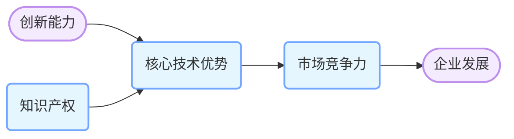

# 如何识别企业的核心技术优势

> 关键词：企业核心技术优势、技术识别、创新能力、知识产权、市场竞争力

> 摘要：本文围绕如何识别企业的核心技术优势展开，深入探讨了核心技术优势的相关概念、识别方法和实际应用场景等内容。通过对核心技术优势的原理、算法、数学模型的分析，结合项目实战案例，为读者提供全面且深入的了解。同时，推荐了相关的学习资源、开发工具和论文著作，最后总结了未来发展趋势与挑战，并对常见问题进行了解答。旨在帮助读者准确识别企业的核心技术优势，为投资决策、合作选择等提供有力依据。

## 1. 背景介绍 
### 1.1 目的和范围
在当今竞争激烈的商业环境中，企业的核心技术优势是其在市场中立足和发展的关键因素。准确识别企业的核心技术优势，有助于投资者做出明智的投资决策，合作伙伴选择合适的合作对象，企业自身也能更好地评估自身实力，制定合理的发展战略。本文的范围涵盖了识别企业核心技术优势的各个方面，包括相关概念、识别方法、实际应用以及未来发展趋势等。

### 1.2 预期读者
本文预期读者包括投资者、企业管理者、行业分析师、科研人员以及对企业技术优势感兴趣的人士。投资者可以通过本文了解如何筛选具有核心技术优势的企业，提高投资回报率；企业管理者可以借鉴本文的方法，评估自身企业的技术实力，发现优势与不足，从而制定更有效的发展策略；行业分析师可以利用本文的内容进行行业研究和企业评估；科研人员可以从中获取相关的研究思路和方法；对企业技术优势感兴趣的人士则可以增加对这一领域的了解。

### 1.3 文档结构概述
本文首先介绍了核心技术优势的背景信息，包括目的、预期读者和文档结构。接着阐述了核心技术优势的核心概念与联系，通过文本示意图和 Mermaid 流程图进行直观展示。然后详细讲解了核心算法原理和具体操作步骤，结合 Python 源代码进行说明。随后介绍了相关的数学模型和公式，并举例说明。在项目实战部分，给出了开发环境搭建、源代码详细实现和代码解读。接着探讨了实际应用场景，推荐了相关的工具和资源。最后总结了未来发展趋势与挑战，解答了常见问题，并提供了扩展阅读和参考资料。

### 1.4 术语表
#### 1.4.1 核心术语定义
- **核心技术优势**：企业在特定领域中所拥有的、能够为其带来独特竞争优势的技术能力。这种技术优势通常具有创新性、领先性、难以模仿性等特点，是企业核心竞争力的重要组成部分。
- **知识产权**：人们对其智力劳动成果所享有的法定权利，包括专利、商标、著作权等。在识别企业核心技术优势中，知识产权是重要的衡量指标之一。
- **创新能力**：企业在技术研发、产品创新、管理创新等方面的能力，是形成核心技术优势的关键因素。
- **市场竞争力**：企业在市场中与其他竞争对手相比所具有的优势和能力，核心技术优势是提升市场竞争力的重要手段。

#### 1.4.2 相关概念解释
- **技术壁垒**：企业凭借其先进的技术、专利等形成的阻止其他企业进入市场的障碍。具有核心技术优势的企业往往能够建立较高的技术壁垒。
- **技术研发投入**：企业为了开展技术研发活动而投入的资金、人力、物力等资源。研发投入的多少在一定程度上反映了企业对技术创新的重视程度和实力。
- **技术转化能力**：企业将研发成果转化为实际产品或服务，并推向市场的能力。即使企业拥有先进的技术，如果不能有效转化，也难以形成核心技术优势。

#### 1.4.3 缩略词列表
- **R&D**：Research and Development，即研究与开发。
- **IP**：Intellectual Property，即知识产权。

## 2. 核心概念与联系 
核心技术优势是企业在市场竞争中脱颖而出的关键因素，它与多个概念密切相关。下面通过文本示意图和 Mermaid 流程图来展示这些核心概念及其联系。

### 文本示意图
核心技术优势处于中心位置，它与创新能力、知识产权、市场竞争力等概念相互关联。创新能力是形成核心技术优势的源泉，企业通过不断的创新研发出具有领先性的技术。知识产权是对核心技术的法律保护，企业通过申请专利、商标等知识产权，确保其技术优势不被轻易模仿。市场竞争力则是核心技术优势的外在表现，具有核心技术优势的企业能够在市场中获得更高的市场份额和利润。

### Mermaid 流程图

该流程图展示了创新能力、知识产权、核心技术优势、市场竞争力和企业发展之间的关系。创新能力和知识产权是形成核心技术优势的重要因素，核心技术优势提升了市场竞争力，而市场竞争力又促进了企业的发展。

## 3. 核心算法原理 & 具体操作步骤 
### 核心算法原理
在识别企业的核心技术优势时，可以采用多指标综合评估算法。该算法通过对多个相关指标进行量化评估，然后综合这些指标的得分来判断企业的核心技术优势。以下是一个简化的多指标综合评估算法的 Python 代码示例：

```python
# 定义指标权重
weights = {
    "研发投入占比": 0.3,
    "专利数量": 0.2,
    "技术团队实力": 0.2,
    "市场份额增长": 0.1,
    "产品创新性": 0.2
}

# 定义企业指标得分
company_scores = {
    "研发投入占比": 80,
    "专利数量": 70,
    "技术团队实力": 85,
    "市场份额增长": 60,
    "产品创新性": 90
}

# 计算综合得分
total_score = 0
for key in weights:
    total_score += weights[key] * company_scores[key]

print(f"企业的综合得分: {total_score}")
```

### 具体操作步骤
1. **确定评估指标**：根据企业的特点和行业情况，确定影响企业核心技术优势的关键指标，如研发投入占比、专利数量、技术团队实力等。
2. **收集数据**：通过企业公开报表、行业报告、专利数据库等渠道收集相关指标的数据。
3. **量化指标得分**：根据数据对每个指标进行量化评分，例如研发投入占比可以根据行业平均水平进行评分。
4. **确定指标权重**：根据各指标对核心技术优势的重要程度，确定每个指标的权重。
5. **计算综合得分**：将每个指标的得分乘以其权重，然后相加得到企业的综合得分。
6. **评估核心技术优势**：根据综合得分的高低，评估企业的核心技术优势。得分越高，说明企业的核心技术优势越明显。

## 4. 数学模型和公式 & 详细讲解 & 举例说明 
### 数学模型和公式
多指标综合评估的数学模型可以表示为：

$$S = \sum_{i=1}^{n} w_i \times s_i$$

其中，$S$ 表示企业的综合得分，$w_i$ 表示第 $i$ 个指标的权重，$s_i$ 表示第 $i$ 个指标的得分，$n$ 表示指标的数量。

### 详细讲解
这个公式的含义是将每个指标的得分乘以其对应的权重，然后将所有指标的乘积相加，得到企业的综合得分。权重的确定是根据各指标对核心技术优势的重要程度，重要程度越高，权重越大。指标得分则是根据实际数据进行量化评估得到的。

### 举例说明
假设有一家企业，其各项指标得分和权重如下表所示：

| 指标 | 权重 | 得分 |
| ---- | ---- | ---- |
| 研发投入占比 | 0.3 | 80 |
| 专利数量 | 0.2 | 70 |
| 技术团队实力 | 0.2 | 85 |
| 市场份额增长 | 0.1 | 60 |
| 产品创新性 | 0.2 | 90 |

根据上述公式计算综合得分：

$$S = 0.3 \times 80 + 0.2 \times 70 + 0.2 \times 85 + 0.1 \times 60 + 0.2 \times 90$$

$$S = 24 + 14 + 17 + 6 + 18$$

$$S = 79$$

因此，该企业的综合得分是 79 分。通过与其他企业的综合得分进行比较，可以评估该企业的核心技术优势。

## 5. 项目实战：代码实际案例和详细解释说明 
### 5.1  开发环境搭建
在进行项目实战时，我们需要搭建相应的开发环境。以下是具体的步骤：
1. **安装 Python**：从 Python 官方网站（https://www.python.org/downloads/）下载并安装 Python 3.x 版本。
2. **安装必要的库**：在命令行中使用以下命令安装所需的库：
```sh
pip install pandas numpy matplotlib
```
这些库将用于数据处理、数值计算和数据可视化。

### 5.2  源代码详细实现和代码解读
以下是一个完整的 Python 代码示例，用于识别企业的核心技术优势：

```python
import pandas as pd
import numpy as np
import matplotlib.pyplot as plt

# 定义指标权重
weights = {
    "研发投入占比": 0.3,
    "专利数量": 0.2,
    "技术团队实力": 0.2,
    "市场份额增长": 0.1,
    "产品创新性": 0.2
}

# 读取企业数据
data = pd.read_csv('company_data.csv')

# 计算综合得分
def calculate_score(row):
    total_score = 0
    for key in weights:
        total_score += weights[key] * row[key]
    return total_score

data['综合得分'] = data.apply(calculate_score, axis=1)

# 按综合得分排序
sorted_data = data.sort_values(by='综合得分', ascending=False)

# 输出排名前 5 的企业
top_5_companies = sorted_data.head(5)
print(top_5_companies)

# 可视化综合得分
plt.bar(top_5_companies['企业名称'], top_5_companies['综合得分'])
plt.xlabel('企业名称')
plt.ylabel('综合得分')
plt.title('排名前 5 的企业综合得分')
plt.xticks(rotation=45)
plt.show()
```

### 5.3  代码解读与分析
1. **导入必要的库**：导入 `pandas`、`numpy` 和 `matplotlib.pyplot` 库，分别用于数据处理、数值计算和数据可视化。
2. **定义指标权重**：定义了五个指标的权重，用于计算综合得分。
3. **读取企业数据**：使用 `pandas` 的 `read_csv` 函数读取存储企业数据的 CSV 文件。
4. **计算综合得分**：定义了一个 `calculate_score` 函数，用于计算每个企业的综合得分。使用 `apply` 方法将该函数应用到每一行数据上。
5. **按综合得分排序**：使用 `sort_values` 方法对数据按综合得分进行降序排序。
6. **输出排名前 5 的企业**：使用 `head` 方法选取排名前 5 的企业，并打印输出。
7. **可视化综合得分**：使用 `matplotlib` 绘制柱状图，展示排名前 5 的企业的综合得分。

通过这个代码示例，我们可以对多个企业的核心技术优势进行评估和比较，找出具有较强核心技术优势的企业。

## 6. 实际应用场景 
### 投资决策
投资者在选择投资对象时，识别企业的核心技术优势是非常重要的。具有核心技术优势的企业往往具有更高的成长潜力和市场竞争力，能够为投资者带来更高的回报。通过对企业核心技术优势的评估，投资者可以筛选出具有投资价值的企业，降低投资风险。

### 合作伙伴选择
企业在选择合作伙伴时，也需要考虑对方的核心技术优势。与具有核心技术优势的企业合作，可以实现资源共享、优势互补，共同推动技术创新和业务发展。例如，一家技术研发型企业可以与一家具有强大市场渠道的企业合作，将研发成果快速推向市场。

### 企业战略规划
企业自身也需要识别自身的核心技术优势，以便制定合理的发展战略。如果企业具有某方面的核心技术优势，可以加大在该领域的研发投入，进一步巩固和扩大优势。如果企业发现自身在某些关键技术上存在不足，可以通过合作、并购等方式获取相关技术，提升自身的核心技术优势。

### 行业研究和分析
行业分析师在进行行业研究和分析时，需要了解企业的核心技术优势。通过对行业内企业核心技术优势的比较和分析，可以了解行业的技术发展趋势、竞争格局等信息，为行业发展提供参考。

## 7. 工具和资源推荐
### 7.1 学习资源推荐
#### 7.1.1 书籍推荐
- 《创新者的窘境》：该书探讨了创新对企业发展的影响，以及企业如何应对创新带来的挑战，对于理解企业核心技术优势的形成和发展具有重要意义。
- 《技术创新管理》：系统介绍了技术创新的理论、方法和实践，帮助读者深入了解企业的创新过程和技术管理。
- 《竞争优势》：阐述了企业竞争优势的来源和构建方法，其中包括核心技术优势的相关内容。

#### 7.1.2 在线课程
- Coursera 上的“技术创新与创业”课程：由知名教授授课，内容涵盖技术创新的各个方面，包括技术战略、创新管理等。
- edX 上的“创新管理与创业”课程：提供了丰富的案例分析和实践项目，帮助学员掌握创新管理的方法和技巧。
- 中国大学 MOOC 上的“企业技术创新管理”课程：结合中国企业的实际情况，讲解企业技术创新的理论和实践。

#### 7.1.3 技术博客和网站
- 36氪：提供科技、商业等领域的最新资讯和深度分析，包括企业的技术创新动态。
- 虎嗅网：聚焦于创新、创业等领域，分享企业的技术创新案例和经验。
- 艾瑞网：专注于互联网行业研究，发布行业报告和分析文章，有助于了解行业的技术发展趋势。

### 7.2 开发工具框架推荐
#### 7.2.1 IDE和编辑器
- PyCharm：一款专业的 Python 集成开发环境，具有强大的代码编辑、调试和项目管理功能。
- Visual Studio Code：一款轻量级的代码编辑器，支持多种编程语言，具有丰富的插件生态系统。
- Jupyter Notebook：一个交互式的编程环境，适合进行数据探索和分析，非常适合用于处理企业数据。

#### 7.2.2 调试和性能分析工具
- PySnooper：一个简单易用的 Python 调试工具，可以自动记录函数的执行过程和变量的值。
- cProfile：Python 内置的性能分析工具，可以帮助开发者找出代码中的性能瓶颈。
- Memory Profiler：用于分析 Python 代码的内存使用情况，帮助开发者优化内存占用。

#### 7.2.3 相关框架和库
- Pandas：一个强大的数据处理和分析库，提供了高效的数据结构和数据操作方法。
- NumPy：用于科学计算的基础库，提供了高效的数组操作和数学函数。
- Matplotlib：一个常用的数据可视化库，可以绘制各种类型的图表，如柱状图、折线图等。

### 7.3 相关论文著作推荐
#### 7.3.1 经典论文
- “The Resource-Based View of the Firm”：该论文提出了企业资源基础理论，强调企业的资源和能力是其竞争优势的来源，对于理解企业核心技术优势具有重要的理论基础。
- “Technological Innovation and Economic Performance”：探讨了技术创新与经济绩效之间的关系，为企业通过技术创新提升核心技术优势提供了理论支持。
- “The Nature of the Firm”：虽然主要讨论企业的性质，但其中关于企业边界和资源配置的观点对理解企业的技术优势有一定的启示。

#### 7.3.2 最新研究成果
- 可以通过学术数据库（如知网、万方、Web of Science 等）搜索关于企业核心技术优势、技术创新等方面的最新研究论文，了解该领域的前沿动态。
- 关注国际知名学术期刊，如《Management Science》《Strategic Management Journal》等，这些期刊上发表的研究成果具有较高的学术水平和参考价值。

#### 7.3.3 应用案例分析
- 各大咨询公司（如麦肯锡、波士顿咨询、贝恩等）发布的行业研究报告和企业案例分析，提供了丰富的实践经验和案例参考。
- 企业自身发布的年报、技术白皮书等资料，也可以作为了解企业核心技术优势和应用案例的重要来源。

## 8. 总结：未来发展趋势与挑战
### 未来发展趋势
1. **技术融合加速**：随着科技的发展，不同领域的技术将加速融合，如人工智能与生物技术、物联网与制造业等。企业需要具备跨领域的技术整合能力