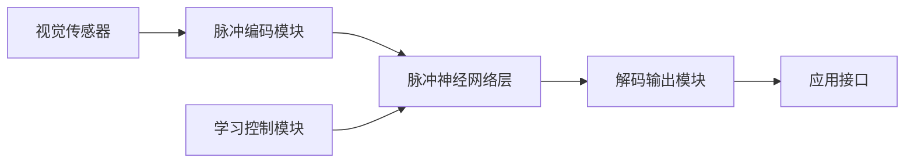

# 如何识别企业的神经形态视觉处理器优势

> 关键词：神经形态视觉处理器、企业优势识别、视觉处理技术、人工智能芯片、性能评估

> 摘要：本文聚焦于如何识别企业的神经形态视觉处理器优势。首先介绍了相关背景，包括目的范围、预期读者等内容。接着阐述了神经形态视觉处理器的核心概念与联系，详细讲解了其核心算法原理及操作步骤，并给出了数学模型和公式。通过项目实战，展示了代码实现及解读。分析了实际应用场景，推荐了学习、开发等相关工具和资源。最后总结了未来发展趋势与挑战，提供了常见问题解答和扩展阅读参考资料，旨在帮助读者全面了解并准确识别企业在神经形态视觉处理器方面的优势。

## 1. 背景介绍 
### 1.1 目的和范围
随着人工智能和计算机视觉技术的飞速发展，神经形态视觉处理器逐渐成为研究和应用的热点。企业在该领域的投入和发展成果各异，准确识别企业的神经形态视觉处理器优势具有重要意义。本文的目的在于为读者提供一套系统的方法和思路，帮助其判断企业在神经形态视觉处理器方面的竞争力。范围涵盖神经形态视觉处理器的技术原理、性能评估、应用场景等多个方面，涉及相关的算法、数学模型以及实际项目开发。

### 1.2 预期读者
本文预期读者包括人工智能领域的研究者、芯片设计工程师、对新兴技术感兴趣的投资者、企业技术决策者以及相关专业的学生等。这些读者希望了解神经形态视觉处理器的技术细节和企业优势，以便在研究、投资、决策等方面做出更明智的选择。

### 1.3 文档结构概述
本文将按照以下结构展开：首先介绍核心概念与联系，帮助读者建立对神经形态视觉处理器的基本认识；接着阐述核心算法原理和具体操作步骤，通过Python代码进行详细说明；然后给出数学模型和公式，并举例说明；之后通过项目实战展示代码实现和详细解读；分析实际应用场景，为读者提供应用参考；推荐相关的工具和资源，方便读者深入学习和研究；最后总结未来发展趋势与挑战，解答常见问题，并提供扩展阅读和参考资料。

### 1.4 术语表
#### 1.4.1 核心术语定义
- **神经形态视觉处理器**：一种模拟生物神经系统工作原理的视觉处理芯片，旨在高效处理视觉信息，具有低功耗、高并行性等特点。
- **突触可塑性**：生物神经系统中突触连接强度随时间和活动而变化的特性，在神经形态视觉处理器中用于模拟信息的学习和存储。
- **脉冲神经网络（SNN）**：一种基于脉冲信号进行信息处理的神经网络，更接近生物神经系统的工作方式，常用于神经形态视觉处理器的算法设计。

#### 1.4.2 相关概念解释
- **视觉处理**：对图像或视频等视觉信息进行采集、分析、理解和处理的过程，神经形态视觉处理器专注于高效实现这一过程。
- **人工智能芯片**：专门用于加速人工智能算法的芯片，神经形态视觉处理器是其中一种具有独特优势的类型。

#### 1.4.3 缩略词列表
- **SNN**：脉冲神经网络（Spiking Neural Network）
- **ASIC**：专用集成电路（Application-Specific Integrated Circuit）
- **FPGA**：现场可编程门阵列（Field-Programmable Gate Array）

## 2. 核心概念与联系 
神经形态视觉处理器的核心思想是模拟生物神经系统的视觉处理机制。生物视觉系统具有高度的并行性、低功耗和自适应学习能力，神经形态视觉处理器试图在硬件层面复制这些特性。

### 核心概念原理
神经形态视觉处理器主要基于脉冲神经网络（SNN）。SNN中的神经元通过脉冲信号进行通信，脉冲的时间和频率携带了信息。与传统的人工神经网络（ANN）不同，SNN更接近生物神经系统的工作方式，能够更高效地处理动态视觉信息。

突触可塑性是神经形态视觉处理器的另一个重要概念。在生物神经系统中，突触连接的强度可以根据神经元的活动而改变，这使得神经系统能够学习和适应环境。在神经形态视觉处理器中，通过模拟突触可塑性，可以实现信息的学习和存储。

### 架构示意图
以下是神经形态视觉处理器的基本架构示意图：



解释如下：
- 视觉传感器负责采集图像或视频信息。
- 脉冲编码模块将视觉传感器采集到的连续信号转换为脉冲信号。
- 脉冲神经网络层对脉冲信号进行处理和分析，通过突触可塑性进行学习。
- 解码输出模块将处理后的脉冲信号转换为连续的输出信号。
- 应用接口将输出信号提供给具体的应用程序。
- 学习控制模块负责控制脉冲神经网络层的学习过程。

## 3. 核心算法原理 & 具体操作步骤 
### 核心算法原理
神经形态视觉处理器的核心算法基于脉冲神经网络（SNN）。下面以简单的泄漏积分发放（LIF）神经元模型为例，介绍SNN的基本原理。

LIF神经元模型的数学描述如下：

$$
\frac{dV(t)}{dt} = \frac{-(V(t) - V_{rest})}{\tau} + \frac{I(t)}{C}
$$

其中，$V(t)$ 是神经元的膜电位，$V_{rest}$ 是静息电位，$\tau$ 是膜时间常数，$I(t)$ 是输入电流，$C$ 是膜电容。当 $V(t)$ 超过阈值 $V_{th}$ 时，神经元发放一个脉冲，并将膜电位重置为 $V_{reset}$。

### Python代码实现
```python
import numpy as np

class LIFNeuron:
    def __init__(self, tau=10, V_rest=-70, V_th=-50, V_reset=-70, C=1):
        self.tau = tau
        self.V_rest = V_rest
        self.V_th = V_th
        self.V_reset = V_reset
        self.C = C
        self.V = V_rest

    def update(self, I, dt):
        dV = (-(self.V - self.V_rest) / self.tau + I / self.C) * dt
        self.V += dV
        if self.V >= self.V_th:
            spike = 1
            self.V = self.V_reset
        else:
            spike = 0
        return spike

# 模拟神经元活动
dt = 0.1
T = 100
neuron = LIFNeuron()
spikes = []
for t in np.arange(0, T, dt):
    I = 10  # 固定输入电流
    spike = neuron.update(I, dt)
    spikes.append(spike)

import matplotlib.pyplot as plt
plt.plot(np.arange(0, T, dt), spikes)
plt.xlabel('Time (ms)')
plt.ylabel('Spike')
plt.title('LIF Neuron Spiking Activity')
plt.show()
```

### 具体操作步骤
1. **初始化神经元参数**：设置膜时间常数 $\tau$、静息电位 $V_{rest}$、阈值 $V_{th}$、重置电位 $V_{reset}$ 和膜电容 $C$。
2. **输入电流**：在每个时间步 $t$，提供输入电流 $I(t)$。
3. **更新膜电位**：根据LIF模型的微分方程更新神经元的膜电位 $V(t)$。
4. **判断是否发放脉冲**：如果膜电位 $V(t)$ 超过阈值 $V_{th}$，则神经元发放一个脉冲，并将膜电位重置为 $V_{reset}$。
5. **重复步骤2 - 4**：直到模拟结束。

## 4. 数学模型和公式 & 详细讲解 & 举例说明 
### LIF神经元模型公式
$$
\frac{dV(t)}{dt} = \frac{-(V(t) - V_{rest})}{\tau} + \frac{I(t)}{C}
$$

详细讲解：
- 等式左边 $\frac{dV(t)}{dt}$ 表示神经元膜电位 $V(t)$ 随时间的变化率。
- 等式右边第一项 $\frac{-(V(t) - V_{rest})}{\tau}$ 表示膜电位向静息电位 $V_{rest}$ 恢复的趋势，$\tau$ 是膜时间常数，控制恢复的速度。
- 等式右边第二项 $\frac{I(t)}{C}$ 表示输入电流 $I(t)$ 对膜电位的影响，$C$ 是膜电容。

### 举例说明
假设一个LIF神经元的参数如下：$\tau = 10$ ms，$V_{rest} = -70$ mV，$V_{th} = -50$ mV，$V_{reset} = -70$ mV，$C = 1$ nF。输入电流 $I(t)$ 为一个恒定的 10 nA。

我们可以使用Python代码模拟该神经元的活动：
```python
import numpy as np
import matplotlib.pyplot as plt

tau = 10
V_rest = -70
V_th = -50
V_reset = -70
C = 1
I = 10

dt = 0.1
T = 100
V = V_rest
Vs = []

for t in np.arange(0, T, dt):
    dV = (-(V - V_rest) / tau + I / C) * dt
    V += dV
    if V >= V_th:
        V = V_reset
    Vs.append(V)

plt.plot(np.arange(0, T, dt), Vs)
plt.xlabel('Time (ms)')
plt.ylabel('Membrane Potential (mV)')
plt.title('LIF Neuron Membrane Potential')
plt.show()
```

通过这个例子，我们可以看到神经元的膜电位在输入电流的作用下逐渐上升，当超过阈值时发放脉冲，然后膜电位重置。

## 5. 项目实战：代码实际案例和详细解释说明 
### 5.1  开发环境搭建
#### 硬件环境
- 选择合适的开发板，如基于FPGA或ASIC的神经形态视觉处理器开发板。
- 连接视觉传感器，如摄像头，用于采集视觉信息。

#### 软件环境
- 安装Python开发环境，推荐使用Anaconda。
- 安装相关的Python库，如NumPy、Matplotlib等，用于数据处理和可视化。
- 如果使用FPGA开发，需要安装相应的开发工具，如Vivado。

### 5.2  源代码详细实现和代码解读
以下是一个简单的基于Python的神经形态视觉处理项目示例，用于识别图像中的物体边缘。

```python
import numpy as np
import cv2
import matplotlib.pyplot as plt

# 读取图像
image = cv2.imread('test_image.jpg', 0)

# 定义Sobel算子
sobel_x = np.array([[-1, 0, 1], [-2, 0, 2], [-1, 0, 1]])
sobel_y = np.array([[-1, -2, -1], [0, 0, 0], [1, 2, 1]])

# 卷积操作
edges_x = cv2.filter2D(image, -1, sobel_x)
edges_y = cv2.filter2D(image, -1, sobel_y)

# 计算梯度幅值
edges = np.sqrt(edges_x**2 + edges_y**2)

# 显示结果
plt.subplot(121), plt.imshow(image, cmap='gray')
plt.title('Original Image'), plt.xticks([]), plt.yticks([])
plt.subplot(122), plt.imshow(edges, cmap='gray')
plt.title('Edge Detection'), plt.xticks([]), plt.yticks([])
plt.show()
```

代码解读：
1. **读取图像**：使用OpenCV的 `imread` 函数读取一张灰度图像。
2. **定义Sobel算子**：Sobel算子是一种常用的边缘检测算子，分别定义了 $x$ 方向和 $y$ 方向的算子。
3. **卷积操作**：使用OpenCV的 `filter2D` 函数对图像进行卷积操作，得到 $x$ 方向和 $y$ 方向的边缘信息。
4. **计算梯度幅值**：将 $x$ 方向和 $y$ 方向的边缘信息进行平方和开方运算，得到最终的边缘图像。
5. **显示结果**：使用Matplotlib库将原始图像和边缘检测结果显示出来。

### 5.3  代码解读与分析
这个项目通过Sobel算子实现了简单的图像边缘检测。Sobel算子的原理是通过卷积操作计算图像在 $x$ 方向和 $y$ 方向的梯度，梯度幅值较大的地方即为图像的边缘。在神经形态视觉处理器中，可以将这种边缘检测算法进行优化和加速，利用其并行计算能力提高处理效率。

## 6. 实际应用场景 
### 智能安防
神经形态视觉处理器可以用于智能安防系统中的视频监控和目标检测。通过实时处理监控视频，快速准确地识别人员、车辆等目标，实现异常行为预警和跟踪。由于其低功耗的特点，适合长时间连续运行的安防设备。

### 自动驾驶
在自动驾驶领域，神经形态视觉处理器可以处理车载摄像头采集的视觉信息，进行道路识别、障碍物检测和行人识别等任务。其高并行性和快速响应能力能够满足自动驾驶系统对实时性的要求。

### 工业检测
在工业生产中，神经形态视觉处理器可以用于产品质量检测。通过对产品图像的分析，检测产品表面的缺陷、尺寸偏差等问题，提高生产效率和产品质量。

### 智能家居
在智能家居系统中，神经形态视觉处理器可以实现智能摄像头的功能，如人体检测、动作识别等。用户可以通过手势控制智能家居设备，提高家居的智能化程度。

## 7. 工具和资源推荐
### 7.1 学习资源推荐
#### 7.1.1 书籍推荐
- 《神经计算原理》：介绍了神经计算的基本原理和方法，包括神经网络、脉冲神经网络等内容。
- 《深度学习》：全面介绍了深度学习的理论和应用，对于理解神经形态视觉处理器的算法基础有很大帮助。
- 《计算机视觉：算法与应用》：详细讲解了计算机视觉的各种算法和应用，涉及图像预处理、特征提取、目标检测等方面。

#### 7.1.2 在线课程
- Coursera上的“深度学习专项课程”：由深度学习领域的知名专家授课，涵盖了深度学习的各个方面。
- edX上的“计算机视觉基础”：介绍了计算机视觉的基本概念和算法，通过实践项目帮助学习者掌握相关技能。
- Udemy上的“脉冲神经网络入门”：专门针对脉冲神经网络进行讲解，适合对神经形态视觉处理器感兴趣的学习者。

#### 7.1.3 技术博客和网站
- Medium上的人工智能相关博客：有很多关于神经形态视觉处理器和人工智能的最新研究成果和技术分享。
- arXiv.org：提供了大量的学术论文，包括神经形态计算、计算机视觉等领域的最新研究。
- IEEE Xplore：电气和电子工程师协会的数字图书馆，包含了众多与神经形态视觉处理器相关的学术论文和会议记录。

### 7.2 开发工具框架推荐
#### 7.2.1 IDE和编辑器
- PyCharm：一款专业的Python集成开发环境，提供了丰富的代码编辑、调试和分析功能。
- Visual Studio Code：一款轻量级的代码编辑器，支持多种编程语言，通过安装插件可以实现Python开发的高效编程。
- Vivado：赛灵思公司的FPGA开发工具，用于设计和开发基于FPGA的神经形态视觉处理器。

#### 7.2.2 调试和性能分析工具
- TensorBoard：TensorFlow的可视化工具，可以用于调试和分析深度学习模型的训练过程和性能。
- NVIDIA Nsight Compute：用于分析GPU代码的性能，对于使用GPU加速的神经形态视觉处理应用有很大帮助。
- FPGA调试工具：如ChipScope等，用于调试FPGA设计中的信号和逻辑。

#### 7.2.3 相关框架和库
- PyTorch：一个开源的深度学习框架，支持脉冲神经网络的开发和训练。
- Brian2：专门用于模拟脉冲神经网络的Python库，提供了简单易用的接口。
- OpenCV：一个广泛使用的计算机视觉库，包含了各种图像处理和分析的算法。

### 7.3 相关论文著作推荐
#### 7.3.1 经典论文
- “Spiking Neuron Models: Single Neurons, Populations, Plasticity”：介绍了脉冲神经元模型的基本原理和数学描述，是脉冲神经网络领域的经典著作。
- “A Tutorial on Spiking Neural Networks: Modeling, Analysis and Applications”：对脉冲神经网络进行了全面的介绍，包括模型、分析和应用等方面。
- “Neuromorphic Computing”：阐述了神经形态计算的概念、原理和发展趋势。

#### 7.3.2 最新研究成果
- 在IEEE Transactions on Neural Networks and Learning Systems、Neuron等期刊上可以找到神经形态视觉处理器领域的最新研究成果。
- 每年的神经信息处理系统大会（NeurIPS）、计算机视觉与模式识别会议（CVPR）等学术会议上也有很多相关的研究报告。

#### 7.3.3 应用案例分析
- 一些企业和研究机构会发布神经形态视觉处理器在实际应用中的案例分析报告，如英特尔、IBM等公司的相关技术文档。
- 学术数据库中的应用案例研究论文，如ACM Digital Library中的相关文献。

## 8. 总结：未来发展趋势与挑战
### 未来发展趋势
- **更高的性能和更低的功耗**：随着技术的不断进步，神经形态视觉处理器将不断提高处理性能，同时降低功耗，以满足更多应用场景的需求。
- **与其他技术的融合**：神经形态视觉处理器将与人工智能、物联网、5G等技术深度融合，创造出更多的创新应用。
- **硬件与软件的协同设计**：未来的神经形态视觉处理器将更加注重硬件与软件的协同设计，提高系统的整体性能和灵活性。

### 挑战
- **技术难题**：目前神经形态视觉处理器的技术还不够成熟，存在一些技术难题，如脉冲神经网络的训练算法、硬件实现的精度和可靠性等。
- **应用推广**：由于神经形态视觉处理器是一种新兴技术，市场认知度和接受度较低，需要加强应用推广和市场培育。
- **标准和规范**：缺乏统一的标准和规范，不利于神经形态视觉处理器的大规模生产和应用。

## 9. 附录：常见问题与解答
### 问题1：神经形态视觉处理器与传统视觉处理器有什么区别？
解答：神经形态视觉处理器模拟生物神经系统的工作原理，具有低功耗、高并行性和自适应学习能力等特点。而传统视觉处理器通常基于传统的数字电路设计，处理方式较为固定，功耗相对较高。

### 问题2：如何评估神经形态视觉处理器的性能？
解答：可以从处理速度、功耗、精度、可扩展性等多个方面进行评估。例如，通过测试其在特定视觉任务上的处理时间和准确率，以及在不同负载下的功耗情况来评估性能。

### 问题3：神经形态视觉处理器的应用前景如何？
解答：神经形态视觉处理器在智能安防、自动驾驶、工业检测、智能家居等领域具有广阔的应用前景。随着技术的不断发展和成熟，其应用范围将不断扩大。

### 问题4：开发神经形态视觉处理器需要具备哪些知识和技能？
解答：需要具备计算机科学、电子工程、神经科学等多学科的知识。具体技能包括深度学习算法设计、硬件设计与开发、编程语言（如Python、Verilog等）的掌握。

## 10. 扩展阅读 & 参考资料
### 扩展阅读
- 《神经形态工程：从生物神经系统到人工神经系统》：深入探讨了神经形态工程的理论和实践，对于理解神经形态视觉处理器的原理和应用有很大帮助。
- 《人工智能芯片技术与应用》：介绍了人工智能芯片的发展现状和技术趋势，包括神经形态视觉处理器在内的各种类型芯片。

### 参考资料
- 相关学术论文和研究报告，如IEEE、ACM等学术组织发表的文献。
- 企业的技术文档和产品手册，如英特尔、IBM等公司关于神经形态视觉处理器的资料。
- 在线技术论坛和社区，如Stack Overflow、GitHub等，上面有很多开发者分享的经验和代码。

作者：AI天才研究院/AI Genius Institute & 禅与计算机程序设计艺术 /Zen And The Art of Computer Programming