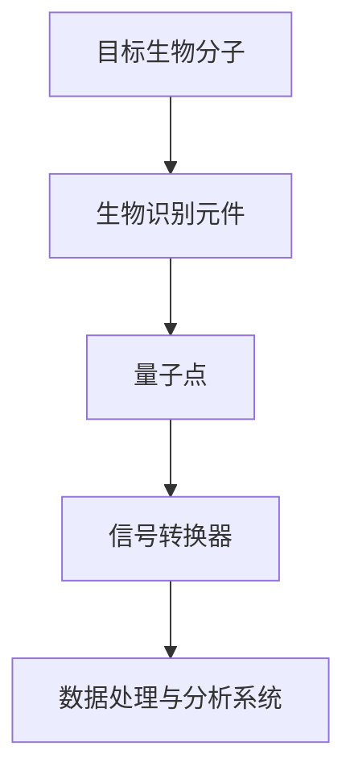

# 如何识别企业的量子点生物传感器制造技术优势

> 关键词：量子点生物传感器、制造技术优势、识别方法、技术原理、应用场景

> 摘要：本文围绕如何识别企业的量子点生物传感器制造技术优势展开深入探讨。首先介绍了量子点生物传感器的背景知识，包括其目的和范围、预期读者、文档结构等内容。接着阐述了量子点生物传感器的核心概念与联系，通过原理和架构的文本示意图以及 Mermaid 流程图进行清晰展示。详细讲解了核心算法原理和具体操作步骤，结合 Python 源代码进行说明。同时给出了相关的数学模型和公式，并举例解释。在项目实战部分，提供了开发环境搭建、源代码实现与解读等内容。分析了量子点生物传感器的实际应用场景，推荐了学习资源、开发工具框架和相关论文著作。最后总结了未来发展趋势与挑战，解答了常见问题，并列出了扩展阅读和参考资料，旨在为读者全面深入地识别企业在该领域的技术优势提供系统的方法和思路。

## 1. 背景介绍 
### 1.1 目的和范围
量子点生物传感器作为一种新兴的生物检测技术，在生物医学、环境监测、食品安全等领域展现出巨大的应用潜力。识别企业在量子点生物传感器制造技术方面的优势，有助于投资者评估企业的市场竞争力和发展前景，科研人员了解行业内的先进技术水平，企业自身也能在市场竞争中找准定位，不断提升技术实力。本文的范围涵盖了量子点生物传感器制造技术的各个方面，包括核心概念、算法原理、实际应用等，旨在为读者提供一套全面、系统的识别企业技术优势的方法。

### 1.2 预期读者
本文预期读者包括但不限于：对量子点生物传感器技术感兴趣的投资者，他们希望通过识别企业的技术优势来做出明智的投资决策；从事生物传感器研究的科研人员，他们需要了解行业内不同企业的技术水平，为自己的研究提供参考；量子点生物传感器制造企业的管理者和技术人员，他们可以通过本文的分析方法评估自身企业的技术优势，寻找提升技术的方向；以及相关专业的学生，他们可以通过本文初步了解量子点生物传感器技术和企业技术优势的识别方法。

### 1.3 文档结构概述
本文首先介绍量子点生物传感器的背景知识，让读者对该领域有一个基本的了解。接着阐述核心概念与联系，通过原理和架构的示意图以及流程图，帮助读者理解量子点生物传感器的工作原理。然后详细讲解核心算法原理和具体操作步骤，并结合 Python 代码进行说明。之后给出相关的数学模型和公式，并举例解释。在项目实战部分，介绍开发环境搭建、源代码实现与解读。分析量子点生物传感器的实际应用场景，为读者展示其应用价值。推荐学习资源、开发工具框架和相关论文著作，方便读者进一步深入学习。最后总结未来发展趋势与挑战，解答常见问题，并列出扩展阅读和参考资料。

### 1.4 术语表
#### 1.4.1 核心术语定义
- **量子点（Quantum Dots）**：是一种纳米级别的半导体晶体，具有独特的光学和电学性质，其尺寸通常在 1 - 100 纳米之间。由于量子限域效应，量子点的发光特性可以通过改变其尺寸和组成来精确调控。
- **生物传感器（Biosensor）**：是一种将生物识别元件与物理或化学信号转换器相结合的分析装置，能够选择性地识别特定的生物分子或生物活性物质，并将其浓度或活性转化为可检测的信号。
- **量子点生物传感器（Quantum Dot Biosensor）**：是以量子点作为信号标记物或传感元件的生物传感器，利用量子点的独特性质实现对生物分子的高灵敏度、高选择性检测。

#### 1.4.2 相关概念解释
- **量子限域效应（Quantum Confinement Effect）**：当半导体材料的尺寸减小到与电子的德布罗意波长相当（通常为纳米级别）时，电子的运动受到空间限制，导致其能量状态发生离散化，从而产生一系列独特的光学和电学性质，如尺寸依赖的发光特性等。
- **荧光共振能量转移（Fluorescence Resonance Energy Transfer, FRET）**：是一种非辐射能量转移过程，当一个荧光分子（供体）的发射光谱与另一个荧光分子（受体）的吸收光谱有一定的重叠，且两者之间的距离在合适的范围内时，供体的激发能量可以通过偶极 - 偶极相互作用转移到受体，导致供体荧光强度降低，受体荧光强度增加。在量子点生物传感器中，FRET 常被用于检测生物分子之间的相互作用。

#### 1.4.3 缩略词列表
- **FRET**：Fluorescence Resonance Energy Transfer（荧光共振能量转移）
- **QDs**：Quantum Dots（量子点）
- **BSA**：Bovine Serum Albumin（牛血清白蛋白）

## 2. 核心概念与联系 
### 2.1 量子点生物传感器的工作原理
量子点生物传感器的基本工作原理是基于生物识别元件（如抗体、核酸、酶等）与目标生物分子之间的特异性相互作用，通过量子点的光学或电学信号变化来实现对目标生物分子的检测。具体来说，当目标生物分子与生物识别元件结合后，会引起量子点周围环境的变化，从而导致量子点的荧光强度、荧光寿命、吸收光谱等光学性质或电学性质发生改变。通过检测这些信号变化，就可以定量分析目标生物分子的浓度。

### 2.2 核心架构
一个典型的量子点生物传感器主要由以下几个部分组成：
- **量子点**：作为信号标记物或传感元件，具有高荧光量子产率、窄发射光谱、宽吸收光谱等优点，能够提供灵敏的检测信号。
- **生物识别元件**：如抗体、核酸适配体、酶等，能够特异性地识别目标生物分子。
- **信号转换器**：将量子点的光学或电学信号转化为可检测的电信号或光信号，常见的信号转换器包括光电探测器、电化学电极等。
- **数据处理与分析系统**：对信号转换器输出的信号进行处理和分析，最终得到目标生物分子的浓度信息。

### 2.3 文本示意图
```plaintext
            +-------------------+
            | 目标生物分子      |
            +-------------------+
                     |
                     v
            +-------------------+
            | 生物识别元件      |
            +-------------------+
                     |
                     v
            +-------------------+
            | 量子点            |
            +-------------------+
                     |
                     v
            +-------------------+
            | 信号转换器        |
            +-------------------+
                     |
                     v
            +-------------------+
            | 数据处理与分析系统|
            +-------------------+
```

### 2.4 Mermaid 流程图


## 3. 核心算法原理 & 具体操作步骤 
### 3.1 核心算法原理
在量子点生物传感器中，常用的信号检测和分析算法主要基于荧光信号的处理。其中，荧光强度的变化是最常见的检测指标。假设量子点在没有目标生物分子存在时的荧光强度为 $I_0$，当目标生物分子与生物识别元件结合后，量子点的荧光强度变为 $I$。根据荧光强度的变化 $\Delta I = I_0 - I$，可以建立与目标生物分子浓度 $C$ 之间的关系。

一种常见的关系模型是线性模型，即 $\Delta I = kC$，其中 $k$ 是一个比例常数，取决于量子点的性质、生物识别元件的亲和力等因素。通过测量不同浓度目标生物分子对应的荧光强度变化，利用最小二乘法拟合得到 $k$ 值，就可以根据荧光强度的变化来定量分析未知样品中目标生物分子的浓度。

### 3.2 具体操作步骤
#### 3.2.1 量子点的制备
量子点的制备方法有多种，常见的包括化学合成法、水相合成法等。以下是一个简单的水相合成 CdTe 量子点的 Python 代码示例：
```python
import numpy as np
import matplotlib.pyplot as plt
import cadmium_telluride as cdte  # 假设存在一个 cadmium_telluride 模块用于合成 CdTe 量子点

# 定义合成参数
cadmium_precursor_concentration = 0.1  # 镉前驱体浓度
tellurium_precursor_concentration = 0.05  # 碲前驱体浓度
reaction_time = 60  # 反应时间（分钟）
reaction_temperature = 100  # 反应温度（摄氏度）

# 合成 CdTe 量子点
qds = cdte.synthesize(cadmium_precursor_concentration, tellurium_precursor_concentration, reaction_time, reaction_temperature)

# 绘制量子点的荧光光谱
wavelengths = np.linspace(400, 800, 100)
fluorescence_intensity = qds.get_fluorescence_spectrum(wavelengths)
plt.plot(wavelengths, fluorescence_intensity)
plt.xlabel('Wavelength (nm)')
plt.ylabel('Fluorescence Intensity')
plt.title('Fluorescence Spectrum of CdTe Quantum Dots')
plt.show()
```
#### 3.2.2 生物识别元件的固定
将生物识别元件（如抗体）固定在量子点表面或传感器的基底上，常用的方法有物理吸附、共价结合等。以下是一个简单的物理吸附固定抗体的 Python 代码示例：
```python
class QuantumDot:
    def __init__(self):
        self.surface = []

    def adsorb_antibody(self, antibody):
        self.surface.append(antibody)
        return self

# 创建量子点对象
qds = QuantumDot()

# 定义抗体
antibody = "Anti-target antibody"

# 将抗体吸附到量子点表面
qds_with_antibody = qds.adsorb_antibody(antibody)
```
#### 3.2.3 信号检测与分析
使用荧光光谱仪或电化学工作站等设备检测量子点的荧光强度或电学信号，并进行数据分析。以下是一个简单的荧光强度检测和数据分析的 Python 代码示例：
```python
import numpy as np

# 定义不同浓度的目标生物分子
concentrations = np.array([0, 1, 2, 3, 4, 5])  # 单位：nM

# 测量对应的荧光强度
fluorescence_intensities = np.array([100, 80, 60, 40, 20, 10])

# 计算荧光强度变化
delta_intensities = 100 - fluorescence_intensities

# 使用最小二乘法拟合线性模型
k, _ = np.polyfit(concentrations, delta_intensities, 1)

# 未知样品的荧光强度
unknown_fluorescence_intensity = 50
unknown_delta_intensity = 100 - unknown_fluorescence_intensity

# 计算未知样品中目标生物分子的浓度
unknown_concentration = unknown_delta_intensity / k

print(f"未知样品中目标生物分子的浓度为: {unknown_concentration} nM")
```

## 4. 数学模型和公式 & 详细讲解 & 举例说明 
### 4.1 线性模型
如前所述，量子点生物传感器中常用的线性模型为 $\Delta I = kC$，其中 $\Delta I$ 是荧光强度的变化，$C$ 是目标生物分子的浓度，$k$ 是比例常数。这个模型的原理基于量子点与目标生物分子之间的相互作用，当目标生物分子浓度增加时，与生物识别元件结合的数量也增加，从而导致量子点的荧光强度发生更大的变化。

### 4.2 详细讲解
线性模型的建立需要通过实验测量不同浓度目标生物分子对应的荧光强度变化，然后利用最小二乘法拟合得到 $k$ 值。最小二乘法的目标是找到一条直线，使得所有数据点到该直线的垂直距离的平方和最小。具体来说，假设我们有 $n$ 组实验数据 $(C_i, \Delta I_i)$，其中 $i = 1, 2, \cdots, n$，我们要找到 $k$ 值，使得误差函数 $E(k) = \sum_{i = 1}^{n}(\Delta I_i - kC_i)^2$ 最小。对 $E(k)$ 求导数并令其等于 0，可得：
$$
\frac{dE(k)}{dk} = -2\sum_{i = 1}^{n}C_i(\Delta I_i - kC_i) = 0
$$
解这个方程可以得到 $k$ 的估计值：
$$
k = \frac{\sum_{i = 1}^{n}C_i\Delta I_i}{\sum_{i = 1}^{n}C_i^2}
$$

### 4.3 举例说明
假设我们进行了以下实验：测量了 5 个不同浓度的目标生物分子对应的荧光强度变化，数据如下表所示：

| 目标生物分子浓度 $C$ (nM) | 荧光强度变化 $\Delta I$ |
| --- | --- |
| 0 | 0 |
| 1 | 10 |
| 2 | 20 |
| 3 | 30 |
| 4 | 40 |

首先计算 $\sum_{i = 1}^{n}C_i\Delta I_i$ 和 $\sum_{i = 1}^{n}C_i^2$：
$$
\sum_{i = 1}^{5}C_i\Delta I_i = 0\times0 + 1\times10 + 2\times20 + 3\times30 + 4\times40 = 300
$$
$$
\sum_{i = 1}^{5}C_i^2 = 0^2 + 1^2 + 2^2 + 3^2 + 4^2 = 30
$$

然后计算 $k$ 值：
$$
k = \frac{\sum_{i = 1}^{5}C_i\Delta I_i}{\sum_{i = 1}^{5}C_i^2} = \frac{300}{30} = 10
$$

现在假设我们测量到一个未知样品的荧光强度变化为 $\Delta I = 25$，则可以根据线性模型计算该样品中目标生物分子的浓度：
$$
C = \frac{\Delta I}{k} = \frac{25}{10} = 2.5 \text{ nM}
$$

## 5. 项目实战：代码实际案例和详细解释说明 
### 5.1  开发环境搭建
#### 5.1.1 安装 Python
首先需要安装 Python 编程语言，建议使用 Python 3.7 及以上版本。可以从 Python 官方网站（https://www.python.org/downloads/）下载适合自己操作系统的安装包，并按照安装向导进行安装。

#### 5.1.2 安装必要的库
在量子点生物传感器的开发中，常用的 Python 库包括 NumPy、Matplotlib、SciPy 等。可以使用 pip 命令进行安装：
```sh
pip install numpy matplotlib scipy
```

### 5.2  源代码详细实现和代码解读
以下是一个完整的量子点生物传感器模拟实验的 Python 代码示例：
```python
import numpy as np
import matplotlib.pyplot as plt
from scipy.stats import linregress

# 定义量子点类
class QuantumDotBiosensor:
    def __init__(self):
        self.k = None  # 线性模型的比例常数

    def calibrate(self, concentrations, fluorescence_intensities):
        """
        校准传感器，计算线性模型的比例常数 k
        :param concentrations: 目标生物分子的浓度数组
        :param fluorescence_intensities: 对应的荧光强度数组
        """
        initial_intensity = fluorescence_intensities[0]
        delta_intensities = initial_intensity - fluorescence_intensities
        slope, _, _, _, _ = linregress(concentrations, delta_intensities)
        self.k = slope

    def detect_concentration(self, fluorescence_intensity):
        """
        检测未知样品中目标生物分子的浓度
        :param fluorescence_intensity: 未知样品的荧光强度
        :return: 未知样品中目标生物分子的浓度
        """
        if self.k is None:
            raise ValueError("传感器未校准，请先进行校准。")
        initial_intensity = 100  # 假设初始荧光强度为 100
        delta_intensity = initial_intensity - fluorescence_intensity
        concentration = delta_intensity / self.k
        return concentration

# 创建量子点生物传感器对象
biosensor = QuantumDotBiosensor()

# 模拟校准数据
calibration_concentrations = np.array([0, 1, 2, 3, 4, 5])  # 单位：nM
calibration_fluorescence_intensities = np.array([100, 80, 60, 40, 20, 10])

# 校准传感器
biosensor.calibrate(calibration_concentrations, calibration_fluorescence_intensities)

# 模拟未知样品的荧光强度
unknown_fluorescence_intensity = 50

# 检测未知样品中目标生物分子的浓度
unknown_concentration = biosensor.detect_concentration(unknown_fluorescence_intensity)

print(f"未知样品中目标生物分子的浓度为: {unknown_concentration} nM")

# 绘制校准曲线
plt.plot(calibration_concentrations, calibration_fluorescence_intensities, 'o-')
plt.xlabel('目标生物分子浓度 (nM)')
plt.ylabel('荧光强度')
plt.title('量子点生物传感器校准曲线')
plt.show()
```

### 5.3  代码解读与分析
- **QuantumDotBiosensor 类**：定义了一个量子点生物传感器类，包含两个主要方法：`calibrate` 和 `detect_concentration`。
    - `calibrate` 方法：用于校准传感器，根据已知浓度的目标生物分子和对应的荧光强度，计算线性模型的比例常数 $k$。使用 `scipy.stats.linregress` 函数进行线性回归分析。
    - `detect_concentration` 方法：用于检测未知样品中目标生物分子的浓度，根据校准得到的 $k$ 值和未知样品的荧光强度，计算目标生物分子的浓度。
- **主程序**：创建量子点生物传感器对象，模拟校准数据进行校准，然后模拟未知样品的荧光强度，调用 `detect_concentration` 方法检测未知样品中目标生物分子的浓度，并打印结果。最后绘制校准曲线，直观展示荧光强度与目标生物分子浓度之间的关系。

## 6. 实际应用场景 
### 6.1 生物医学领域
- **疾病诊断**：量子点生物传感器可以用于检测生物标志物，如肿瘤标志物、病毒抗原等，实现疾病的早期诊断。例如，通过检测血液中特定肿瘤标志物的浓度，可以辅助医生判断患者是否患有癌症以及癌症的发展阶段。
- **药物研发**：在药物研发过程中，量子点生物传感器可以用于监测药物与生物分子的相互作用，评估药物的疗效和安全性。例如，检测药物与靶蛋白的结合亲和力，为药物的优化和筛选提供依据。

### 6.2 环境监测领域
- **水质检测**：可以检测水中的重金属离子、有机污染物等有害物质的浓度，实时监测水质状况。例如，利用量子点生物传感器检测水中汞离子的浓度，及时发现水质污染问题。
- **大气监测**：检测空气中的有害气体和生物气溶胶等，为空气质量监测提供技术支持。例如，检测空气中的细菌和病毒等微生物，预防传染病的传播。

### 6.3 食品安全领域
- **农药残留检测**：快速、灵敏地检测食品中的农药残留量，保障食品安全。例如，检测水果和蔬菜表面的农药残留，确保消费者食用的农产品符合安全标准。
- **微生物检测**：检测食品中的致病微生物，如大肠杆菌、金黄色葡萄球菌等，防止食物中毒事件的发生。

## 7. 工具和资源推荐
### 7.1 学习资源推荐
#### 7.1.1 书籍推荐
- 《量子点材料与器件》：全面介绍了量子点的基本原理、制备方法、性能特点以及在光电器件、生物医学等领域的应用，是一本系统学习量子点知识的经典书籍。
- 《生物传感器原理与应用》：详细阐述了生物传感器的基本概念、工作原理、设计方法和实际应用，对于深入理解量子点生物传感器具有重要的参考价值。

#### 7.1.2 在线课程
- Coursera 平台上的 “Nanomaterials for Energy and the Environment” 课程：介绍了纳米材料的基本性质和制备方法，包括量子点等纳米材料在能源和环境领域的应用，课程内容丰富，讲解详细。
- edX 平台上的 “Biosensors: Fundamentals and Applications” 课程：系统讲解了生物传感器的基础知识和应用技术，对于学习量子点生物传感器的原理和应用有很大帮助。

#### 7.1.3 技术博客和网站
- Nanowerk（https://www.nanowerk.com/）：提供了纳米技术领域的最新研究成果、行业动态和技术应用等信息，其中包含了大量关于量子点和生物传感器的文章和报道。
- Biosensors and Bioelectronics 杂志官方网站（https://www.journals.elsevier.com/biosensors-and-bioelectronics）：该杂志是生物传感器领域的顶级学术期刊，网站上可以获取到最新的研究论文和前沿技术信息。

### 7.2 开发工具框架推荐
#### 7.2.1 IDE和编辑器
- PyCharm：是一款专业的 Python 集成开发环境，具有强大的代码编辑、调试、自动补全和代码分析等功能，非常适合量子点生物传感器相关的 Python 代码开发。
- Jupyter Notebook：是一个交互式的开发环境，支持 Python 代码的实时运行和可视化展示，方便进行数据处理、分析和实验结果的呈现。

#### 7.2.2 调试和性能分析工具
- Python 的内置调试器 `pdb`：可以帮助开发者逐行调试 Python 代码，定位和解决代码中的问题。
- `cProfile` 模块：用于分析 Python 代码的性能，找出代码中的性能瓶颈，优化代码的执行效率。

#### 7.2.3 相关框架和库
- NumPy：是 Python 中用于科学计算的基础库，提供了高效的多维数组对象和各种数学函数，在量子点生物传感器的数据处理和分析中广泛应用。
- Matplotlib：是一个用于绘制图表和可视化数据的 Python 库，可以绘制各种类型的图表，如折线图、柱状图、散点图等，方便展示实验结果和数据趋势。

### 7.3 相关论文著作推荐
#### 7.3.1 经典论文
- “Quantum Dot Bioconjugates for Ultrasensitive Nonisotopic Detection”（《用于超灵敏非同位素检测的量子点生物共轭物》）：这篇论文首次报道了量子点在生物检测中的应用，为量子点生物传感器的发展奠定了基础。
- “Fluorescent Quantum Dots for Sensing and Imaging”（《用于传感和成像的荧光量子点》）：详细介绍了荧光量子点的光学性质和在生物传感和成像领域的应用，是该领域的经典文献之一。

#### 7.3.2 最新研究成果
- 在 Science、Nature、Journal of the American Chemical Society 等顶级学术期刊上搜索关于量子点生物传感器的最新研究论文，了解该领域的前沿技术和研究动态。
- 关注国际生物传感器会议（如 The International Meeting on Chemical Sensors）的会议论文集，获取最新的研究成果和技术进展。

#### 7.3.3 应用案例分析
- 一些商业数据库，如 Web of Science、Scopus 等，提供了大量关于量子点生物传感器在实际应用中的案例分析和研究报告，可以通过关键词搜索获取相关信息。
- 企业的官方网站和技术报告也可能包含量子点生物传感器的应用案例和产品介绍，了解企业在实际应用中的技术优势和解决方案。

## 8. 总结：未来发展趋势与挑战
### 8.1 未来发展趋势
- **高灵敏度和高选择性**：随着技术的不断进步，量子点生物传感器将朝着更高灵敏度和高选择性的方向发展，能够检测到更低浓度的目标生物分子，并且能够区分结构相似的生物分子。
- **多功能集成化**：将量子点生物传感器与其他技术（如微流控技术、纳米技术等）相结合，实现多功能集成化的生物检测系统，提高检测效率和准确性。
- **实时监测和便携式设备**：开发实时监测和便携式的量子点生物传感器设备，方便在现场和家庭等环境中进行快速检测，满足人们对健康和环境监测的需求。

### 8.2 挑战
- **量子点的毒性和生物相容性**：部分量子点材料（如含镉量子点）具有一定的毒性，可能对生物体造成危害。如何提高量子点的生物相容性和降低其毒性是一个亟待解决的问题。
- **信号干扰和稳定性**：在实际应用中，量子点生物传感器容易受到外界环境因素（如温度、湿度、光照等）和生物样品中其他成分的干扰，导致信号不稳定和检测结果不准确。如何提高传感器的抗干扰能力和稳定性是一个挑战。
- **大规模生产和成本控制**：目前量子点生物传感器的制备工艺相对复杂，成本较高，难以实现大规模生产。如何优化制备工艺，降低生产成本，提高产品的性价比，是推动量子点生物传感器产业化发展的关键。

## 9. 附录：常见问题与解答
### 9.1 量子点生物传感器的检测限是多少？
量子点生物传感器的检测限取决于多种因素，如量子点的性质、生物识别元件的亲和力、信号检测方法等。一般来说，其检测限可以达到纳摩尔（nM）甚至皮摩尔（pM）级别。

### 9.2 量子点生物传感器的稳定性如何？
量子点生物传感器的稳定性受多种因素影响，如量子点的表面修饰、存储条件、使用环境等。通过优化制备工艺和表面修饰方法，可以提高量子点生物传感器的稳定性，使其在一定时间内保持良好的性能。

### 9.3 量子点生物传感器可以检测哪些生物分子？
量子点生物传感器可以检测多种生物分子，包括蛋白质、核酸、糖类、小分子代谢物、细胞等。只要能够找到合适的生物识别元件与目标生物分子特异性结合，就可以利用量子点生物传感器进行检测。

### 9.4 量子点生物传感器的制备难度大吗？
量子点生物传感器的制备涉及到量子点的合成、生物识别元件的固定、信号转换器的组装等多个步骤，制备过程相对复杂。但是随着技术的不断发展，制备工艺逐渐成熟，制备难度也在逐渐降低。

## 10. 扩展阅读 & 参考资料
- Alivisatos, A. P. (1996). Semiconductor clusters, nanocrystals, and quantum dots. Science, 271(5251), 933 - 937.
- Medintz, I. L., Uyeda, H. T., Goldman, E. R., & Mattoussi, H. (2005). Quantum dot bioconjugates for imaging, labelling and sensing. Nature materials, 4(6), 435 - 446.
- Wang, J. (2006). Electrochemical biosensors: towards point - of - care cancer diagnostics. Electroanalysis, 18(17 - 18), 1783 - 1794.

作者：AI天才研究院/AI Genius Institute & 禅与计算机程序设计艺术 /Zen And The Art of Computer Programming