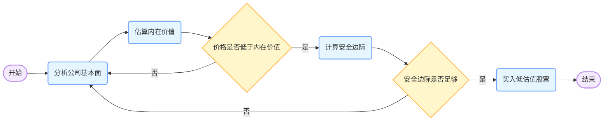

# 如何运用格雷厄姆理念寻找低估值股票

> 关键词：格雷厄姆理念、低估值股票、价值投资、财务分析、安全边际

> 摘要：本文围绕如何运用格雷厄姆理念寻找低估值股票展开。详细介绍了格雷厄姆理念的核心概念及其联系，深入剖析其核心算法原理和具体操作步骤，通过数学模型和公式进一步阐释其理论依据。同时结合项目实战，给出实际案例及详细解释说明，探讨了该理念的实际应用场景。此外，还推荐了相关的学习资源、开发工具框架以及论文著作，最后总结了未来发展趋势与挑战，并提供常见问题解答和扩展阅读参考资料，旨在帮助投资者系统地理解和运用格雷厄姆理念进行低估值股票的寻找。

## 1. 背景介绍 
### 1.1 目的和范围
本文章的目的在于向投资者系统地介绍如何运用格雷厄姆理念来寻找低估值股票。通过详细阐述格雷厄姆理念的核心思想、分析方法和实际应用，帮助投资者掌握一种科学、理性的投资策略，从而在股票市场中发现具有潜在投资价值的股票。文章的范围涵盖了格雷厄姆理念的理论基础、具体操作步骤、实际案例分析以及相关的学习资源和工具推荐等方面，旨在为投资者提供一个全面、深入的学习和实践指南。

### 1.2 预期读者
本文预期读者主要包括对股票投资有兴趣的初学者、希望提升投资技能的中级投资者以及想要深入研究价值投资理论的专业人士。无论你是刚刚接触股票市场，对投资知识了解有限，还是已经有一定投资经验，但希望寻找更有效的投资方法，本文都将为你提供有价值的信息和指导。

### 1.3 文档结构概述
本文将按照以下结构进行阐述：首先介绍格雷厄姆理念的背景和相关术语；接着深入探讨其核心概念与联系，通过文本示意图和 Mermaid 流程图进行清晰展示；然后详细讲解核心算法原理和具体操作步骤，并使用 Python 源代码进行阐述；再介绍相关的数学模型和公式，并举例说明；之后通过项目实战，给出实际案例和详细解释；探讨该理念的实际应用场景；推荐相关的学习资源、开发工具框架和论文著作；最后总结未来发展趋势与挑战，提供常见问题解答和扩展阅读参考资料。

### 1.4 术语表
#### 1.4.1 核心术语定义
- **格雷厄姆理念**：由投资大师本杰明·格雷厄姆（Benjamin Graham）提出的价值投资理论，强调通过对公司基本面的分析，寻找价格低于内在价值的股票进行投资，注重安全边际和长期投资。
- **低估值股票**：指股票价格相对于其内在价值被低估的股票，即股票价格低于其实际价值，具有较大的投资潜力。
- **内在价值**：公司在其存续期间所产生的未来现金流量的现值，是评估股票价值的重要依据。
- **安全边际**：股票的内在价值与市场价格之间的差值，安全边际越大，投资风险越低。

#### 1.4.2 相关概念解释
- **价值投资**：一种基于公司基本面分析，寻找被市场低估的股票进行投资的策略，注重股票的内在价值和长期投资回报。
- **基本面分析**：通过对公司的财务状况、经营业绩、行业前景等方面进行分析，评估公司的内在价值和投资价值。
- **财务报表**：反映公司财务状况和经营成果的文件，主要包括资产负债表、利润表和现金流量表。

#### 1.4.3 缩略词列表
- **PE**：市盈率（Price Earnings Ratio），指股票价格与每股收益的比率，用于衡量股票的估值水平。
- **PB**：市净率（Price to Book Ratio），指股票价格与每股净资产的比率，反映股票价格相对于每股净资产的倍数。
- **ROE**：净资产收益率（Return on Equity），指净利润与平均股东权益的百分比，反映公司运用自有资本的效率。

## 2. 核心概念与联系 

### 格雷厄姆理念的核心概念
格雷厄姆理念的核心在于价值投资，其主要围绕以下几个关键概念展开：
- **内在价值**：格雷厄姆认为，股票的价值是由公司的基本面决定的，包括公司的资产、盈利能力、现金流等因素。通过对这些因素的分析，可以估算出公司的内在价值。
- **安全边际**：为了降低投资风险，格雷厄姆强调在投资时要留有足够的安全边际。即只有当股票价格低于其内在价值一定幅度时，才考虑买入。
- **市场先生**：格雷厄姆将市场比喻为“市场先生”，市场先生每天都会给出不同的股票报价，但这些报价并不一定反映股票的真实价值。投资者应该利用市场先生的情绪波动，寻找被低估的股票。

### 核心概念的联系
这些核心概念之间相互关联，共同构成了格雷厄姆理念的价值投资体系。内在价值是评估股票投资价值的基础，安全边际是保障投资安全的关键，而市场先生的情绪波动则为投资者提供了寻找低估值股票的机会。投资者通过对公司内在价值的分析，结合市场先生给出的价格，判断是否存在足够的安全边际，从而做出投资决策。

### 文本示意图
```plaintext
              格雷厄姆理念
                  |
       +---------------------+
       |                     |
  内在价值              市场先生
       |                     |
       +---------------------+
                  |
              安全边际
                  |
            低估值股票
```

### Mermaid 流程图


## 3. 核心算法原理 & 具体操作步骤 

### 核心算法原理
格雷厄姆理念的核心算法原理在于通过对公司财务数据的分析，估算公司的内在价值，并与市场价格进行比较，判断股票是否被低估。以下是一种简化的内在价值估算方法：

假设公司的未来盈利以固定增长率 $g$ 增长，且公司的股息支付率为 $d$，则公司的内在价值 $V$ 可以通过以下公式估算：

$V = \frac{D_1}{r - g}$

其中，$D_1$ 为下一期的股息，$r$ 为投资者要求的必要收益率。

### 具体操作步骤
1. **收集公司财务数据**：收集公司的财务报表，包括资产负债表、利润表和现金流量表，以及相关的行业数据和宏观经济数据。
2. **分析公司基本面**：对公司的财务状况、经营业绩、行业前景等方面进行分析，评估公司的竞争力和发展潜力。
3. **估算公司内在价值**：根据公司的财务数据和行业数据，选择合适的估值方法，估算公司的内在价值。
4. **比较内在价值和市场价格**：将估算的内在价值与当前的市场价格进行比较，判断股票是否被低估。
5. **计算安全边际**：如果股票被低估，计算安全边际，即内在价值与市场价格之间的差值。
6. **做出投资决策**：根据安全边际的大小和个人的投资风险偏好，做出投资决策。

### Python 源代码实现
```python
# 定义计算内在价值的函数
def calculate_intrinsic_value(D1, r, g):
    """
    计算公司的内在价值
    :param D1: 下一期的股息
    :param r: 投资者要求的必要收益率
    :param g: 公司的盈利增长率
    :return: 公司的内在价值
    """
    if r <= g:
        raise ValueError("必要收益率必须大于盈利增长率")
    return D1 / (r - g)

# 示例数据
D1 = 2  # 下一期的股息
r = 0.1  # 投资者要求的必要收益率
g = 0.05  # 公司的盈利增长率

# 计算内在价值
intrinsic_value = calculate_intrinsic_value(D1, r, g)
print(f"公司的内在价值为: {intrinsic_value}")
```

## 4. 数学模型和公式 & 详细讲解 & 举例说明 

### 数学模型和公式
#### 股息贴现模型（Dividend Discount Model, DDM）
股息贴现模型是估算公司内在价值的一种常用方法，其基本公式为：

$V = \sum_{t=1}^{\infty} \frac{D_t}{(1 + r)^t}$

其中，$V$ 为公司的内在价值，$D_t$ 为第 $t$ 期的股息，$r$ 为投资者要求的必要收益率。

在实际应用中，为了简化计算，通常假设公司的股息以固定增长率 $g$ 增长，即 $D_t = D_{t-1}(1 + g)$，则股息贴现模型可以简化为：

$V = \frac{D_1}{r - g}$

其中，$D_1$ 为下一期的股息。

#### 市盈率模型（Price Earnings Ratio, PE）
市盈率模型是另一种常用的估值方法，其基本公式为：

$V = EPS \times PE$

其中，$V$ 为公司的内在价值，$EPS$ 为每股收益，$PE$ 为市盈率。

### 详细讲解
- **股息贴现模型**：股息贴现模型的基本思想是将公司未来的股息现金流折现到当前，得到公司的内在价值。该模型适用于那些股息稳定增长的公司。
- **市盈率模型**：市盈率模型的基本思想是通过比较公司的市盈率与同行业其他公司的市盈率，来判断公司的估值水平。该模型适用于那些盈利稳定的公司。

### 举例说明
假设某公司的下一期股息为 $2$ 元，投资者要求的必要收益率为 $10\%$，公司的盈利增长率为 $5\%$，则根据股息贴现模型，该公司的内在价值为：

$V = \frac{D_1}{r - g} = \frac{2}{0.1 - 0.05} = 40$（元）

假设该公司的每股收益为 $4$ 元，同行业公司的平均市盈率为 $10$ 倍，则根据市盈率模型，该公司的内在价值为：

$V = EPS \times PE = 4 \times 10 = 40$（元）

## 5. 项目实战：代码实际案例和详细解释说明 

### 5.1  开发环境搭建
- **编程语言**：Python 3.x
- **开发工具**：PyCharm、Jupyter Notebook 等
- **相关库**：pandas、numpy、matplotlib、yfinance 等

### 5.2  源代码详细实现和代码解读
```python
import yfinance as yf
import pandas as pd
import numpy as np

# 定义获取股票数据的函数
def get_stock_data(ticker, start_date, end_date):
    """
    获取股票数据
    :param ticker: 股票代码
    :param start_date: 开始日期
    :param end_date: 结束日期
    :return: 股票数据
    """
    stock_data = yf.download(ticker, start=start_date, end=end_date)
    return stock_data

# 定义计算市盈率的函数
def calculate_pe(stock_data, eps):
    """
    计算市盈率
    :param stock_data: 股票数据
    :param eps: 每股收益
    :return: 市盈率
    """
    pe = stock_data['Close'] / eps
    return pe

# 定义计算市净率的函数
def calculate_pb(stock_data, book_value_per_share):
    """
    计算市净率
    :param stock_data: 股票数据
    :param book_value_per_share: 每股净资产
    :return: 市净率
    """
    pb = stock_data['Close'] / book_value_per_share
    return pb

# 示例数据
ticker = 'AAPL'  # 苹果公司股票代码
start_date = '2020-01-01'
end_date = '2021-01-01'
eps = 3.28  # 苹果公司每股收益
book_value_per_share = 3.5  # 苹果公司每股净资产

# 获取股票数据
stock_data = get_stock_data(ticker, start_date, end_date)

# 计算市盈率和市净率
pe = calculate_pe(stock_data, eps)
pb = calculate_pb(stock_data, book_value_per_share)

# 打印结果
print("市盈率:")
print(pe)
print("市净率:")
print(pb)
```

### 5.3  代码解读与分析
- **获取股票数据**：使用 `yfinance` 库从雅虎财经获取指定股票在指定日期范围内的历史数据。
- **计算市盈率**：通过将股票的收盘价除以每股收益，计算出股票的市盈率。
- **计算市净率**：通过将股票的收盘价除以每股净资产，计算出股票的市净率。
- **打印结果**：将计算得到的市盈率和市净率打印输出，方便分析和比较。

通过分析市盈率和市净率，可以初步判断股票的估值水平。一般来说，市盈率和市净率较低的股票可能被低估，具有一定的投资价值。

## 6. 实际应用场景 
### 个人投资者
对于个人投资者来说，运用格雷厄姆理念寻找低估值股票可以帮助他们在股票市场中做出更理性的投资决策。个人投资者可以通过分析公司的基本面和财务数据，寻找被市场低估的股票，以较低的价格买入，等待股票价格回归其内在价值，从而获得投资收益。

### 机构投资者
机构投资者，如基金公司、保险公司等，也可以运用格雷厄姆理念进行资产配置和投资组合管理。机构投资者可以通过大规模的数据分析和研究，筛选出具有投资价值的低估值股票，构建投资组合，降低投资风险，提高投资收益。

### 价值投资基金
价值投资基金通常遵循格雷厄姆理念，以寻找低估值股票为主要投资策略。价值投资基金经理通过深入研究公司的基本面和财务数据，挖掘被市场忽视的价值，为基金投资者创造长期稳定的投资回报。

## 7. 工具和资源推荐
### 7.1 学习资源推荐
#### 7.1.1 书籍推荐
- 《聪明的投资者》（The Intelligent Investor）：本杰明·格雷厄姆的经典著作，被誉为价值投资的圣经，详细阐述了格雷厄姆的投资理念和方法。
- 《证券分析》（Security Analysis）：同样是本杰明·格雷厄姆的著作，是价值投资领域的权威教材，对公司基本面分析和估值方法进行了深入探讨。
- 《怎样选择成长股》（Common Stocks and Uncommon Profits）：菲利普·费雪（Philip Fisher）的著作，介绍了如何寻找具有成长潜力的股票，与格雷厄姆的价值投资理念相互补充。

#### 7.1.2 在线课程
- Coursera 上的“投资学原理”（Principles of Investing）：由知名教授授课，系统介绍了投资学的基本原理和方法，包括价值投资理念。
- edX 上的“金融市场”（Financial Markets）：耶鲁大学教授罗伯特·席勒（Robert Shiller）的课程，对金融市场和投资策略进行了深入分析。

#### 7.1.3 技术博客和网站
- 雪球网（xueqiu.com）：国内知名的投资社区，提供股票行情、公司财报、投资分析等信息，投资者可以在上面交流和分享投资经验。
- Seeking Alpha（seekingalpha.com）：国外知名的投资分析网站，提供大量的股票分析报告和投资观点，有助于投资者了解市场动态和公司基本面。

### 7.2 开发工具框架推荐
#### 7.2.1 IDE和编辑器
- PyCharm：一款专业的 Python 集成开发环境，提供代码编辑、调试、版本控制等功能，适合开发复杂的 Python 程序。
- Jupyter Notebook：一种交互式的开发环境，支持 Python、R 等多种编程语言，适合进行数据分析和可视化。

#### 7.2.2 调试和性能分析工具
- pdb：Python 内置的调试工具，可以帮助开发者定位和解决代码中的问题。
- cProfile：Python 内置的性能分析工具，可以分析代码的执行时间和性能瓶颈。

#### 7.2.3 相关框架和库
- pandas：Python 中用于数据处理和分析的库，提供了高效的数据结构和数据操作方法。
- numpy：Python 中用于科学计算的库，提供了高效的数组操作和数学函数。
- matplotlib：Python 中用于数据可视化的库，可以绘制各种类型的图表和图形。

### 7.3 相关论文著作推荐
#### 7.3.1 经典论文
- “The Theory of Investment Value” by John Burr Williams：该论文提出了股息贴现模型，为价值投资提供了重要的理论基础。
- “Security Analysis” by Benjamin Graham and David Dodd：格雷厄姆和多德的经典著作，对价值投资理论进行了系统阐述。

#### 7.3.2 最新研究成果
- 可以关注《金融研究》《经济研究》等学术期刊，以及 SSRN（Social Science Research Network）等学术平台，获取价值投资领域的最新研究成果。

#### 7.3.3 应用案例分析
- 可以参考一些投资机构的研究报告和案例分析，了解他们如何运用格雷厄姆理念进行投资决策和风险管理。

## 8. 总结：未来发展趋势与挑战
### 未来发展趋势
- **量化投资与价值投资的结合**：随着信息技术的发展，量化投资越来越受到关注。未来，量化投资技术可能会与格雷厄姆的价值投资理念相结合，通过大数据分析和机器学习算法，更高效地筛选出低估值股票。
- **全球投资视野**：随着经济全球化的发展，投资者的投资视野将更加全球化。格雷厄姆理念可能会在全球范围内得到更广泛的应用，投资者将有更多机会寻找全球范围内的低估值股票。
- **社会责任投资的融合**：未来，投资者可能会更加关注公司的社会责任和可持续发展。格雷厄姆理念可能会与社会责任投资相结合，寻找那些既具有低估值又具有良好社会责任表现的公司。

### 挑战
- **市场有效性的挑战**：随着市场信息的传播速度越来越快，市场的有效性可能会不断提高。这意味着寻找低估值股票的难度可能会增加，投资者需要更加深入地研究公司基本面和市场动态。
- **宏观经济环境的不确定性**：宏观经济环境的不确定性，如经济衰退、通货膨胀、利率波动等，可能会对公司的经营业绩和股票价格产生影响。投资者需要更加关注宏观经济环境的变化，及时调整投资策略。
- **新兴行业的估值难题**：随着科技的不断发展，新兴行业不断涌现。这些新兴行业的公司往往具有较高的成长性，但也面临着较大的不确定性。传统的估值方法可能不适用于这些新兴行业的公司，投资者需要探索新的估值方法和投资策略。

## 9. 附录：常见问题与解答
### 问题 1：如何准确估算公司的内在价值？
答：估算公司的内在价值是一个复杂的过程，需要综合考虑公司的财务状况、经营业绩、行业前景等多个因素。可以采用多种估值方法，如股息贴现模型、市盈率模型、市净率模型等，并结合定性分析，对公司的内在价值进行合理估算。

### 问题 2：安全边际的大小应该如何确定？
答：安全边际的大小取决于个人的投资风险偏好和市场环境。一般来说，安全边际越大，投资风险越低。投资者可以根据自己的风险承受能力和市场情况，确定一个合适的安全边际水平。

### 问题 3：格雷厄姆理念是否适用于所有类型的股票？
答：格雷厄姆理念主要适用于那些具有稳定现金流、盈利相对稳定的成熟公司。对于一些新兴行业的成长型公司，由于其未来的发展具有较大的不确定性，传统的格雷厄姆理念可能不太适用。投资者需要根据不同类型的股票，灵活运用投资策略。

### 问题 4：如何判断股票是否被低估？
答：可以通过比较股票的市场价格与内在价值来判断股票是否被低估。如果股票的市场价格低于其内在价值，则股票可能被低估。此外，还可以参考市盈率、市净率等估值指标，与同行业其他公司进行比较，来判断股票的估值水平。

## 10. 扩展阅读 & 参考资料
- 本杰明·格雷厄姆. 《聪明的投资者》. 人民邮电出版社.
- 本杰明·格雷厄姆, 大卫·多德. 《证券分析》. 中国人民大学出版社.
- 菲利普·费雪. 《怎样选择成长股》. 地震出版社.
- 雅虎财经（finance.yahoo.com）
- 雪球网（xueqiu.com）
- Seeking Alpha（seekingalpha.com）

作者：AI天才研究院/AI Genius Institute & 禅与计算机程序设计艺术 /Zen And The Art of Computer Programming