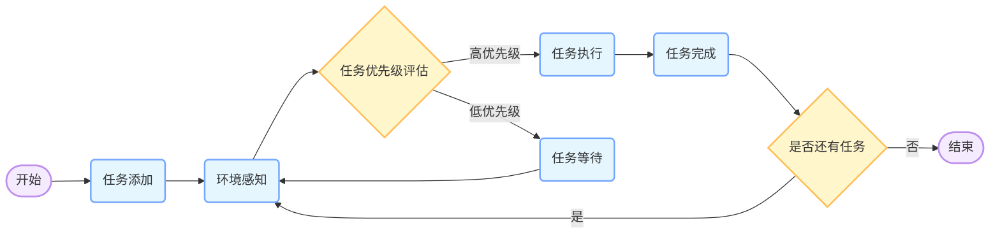

# 实现AI Agent的动态任务优先级调度

> 关键词：AI Agent、动态任务优先级调度、任务管理、智能决策、算法原理

> 摘要：本文围绕实现AI Agent的动态任务优先级调度展开深入探讨。首先介绍了相关背景知识，包括目的、预期读者、文档结构和术语表。接着阐述了核心概念与联系，给出了原理和架构的文本示意图以及Mermaid流程图。详细讲解了核心算法原理，并使用Python源代码进行说明，同时介绍了相关数学模型和公式。通过项目实战，展示了开发环境搭建、源代码实现与解读。分析了实际应用场景，推荐了学习资源、开发工具框架以及相关论文著作。最后总结了未来发展趋势与挑战，提供了常见问题解答和扩展阅读参考资料，旨在为开发者和研究者提供全面的技术指导。

## 1. 背景介绍 
### 1.1 目的和范围
在复杂的应用场景中，AI Agent需要处理多个不同的任务。这些任务可能具有不同的紧急程度、重要性和资源需求。动态任务优先级调度的目的是根据任务的实时状态和环境信息，智能地调整任务的优先级，以提高AI Agent的工作效率和响应能力。本文的范围涵盖了从基本概念到具体实现的全过程，包括核心算法原理、数学模型、项目实战以及实际应用场景等方面。

### 1.2 预期读者
本文预期读者包括人工智能开发者、软件工程师、研究人员以及对AI Agent任务调度感兴趣的技术爱好者。对于有一定编程基础和人工智能知识的读者，能够通过本文深入了解动态任务优先级调度的实现方法；对于初学者，也可以作为入门学习的参考资料。

### 1.3 文档结构概述
本文将按照以下结构进行组织：首先介绍背景知识，包括目的、读者和文档结构等；接着阐述核心概念与联系，给出相关的示意图和流程图；然后详细讲解核心算法原理和具体操作步骤，并使用Python代码进行说明；介绍数学模型和公式，并举例说明；通过项目实战展示代码的实际应用和详细解释；分析实际应用场景；推荐相关的学习资源、开发工具框架和论文著作；最后总结未来发展趋势与挑战，提供常见问题解答和扩展阅读参考资料。

### 1.4 术语表
#### 1.4.1 核心术语定义
- **AI Agent**：能够感知环境、做出决策并执行动作的智能实体。
- **动态任务优先级调度**：根据任务的实时状态和环境信息，动态地调整任务的优先级，以确定任务的执行顺序。
- **任务**：AI Agent需要完成的具体工作单元。
- **优先级**：表示任务的重要性和紧急程度，用于确定任务的执行顺序。

#### 1.4.2 相关概念解释
- **任务状态**：任务在执行过程中的不同阶段，如待执行、执行中、已完成等。
- **环境信息**：AI Agent所处环境的相关信息，如资源可用性、时间限制等。
- **调度算法**：用于确定任务优先级和执行顺序的算法。

#### 1.4.3 缩略词列表
- **AI**：Artificial Intelligence（人工智能）
- **CPU**：Central Processing Unit（中央处理器）

## 2. 核心概念与联系 

### 核心概念原理
AI Agent的动态任务优先级调度的核心原理是根据任务的实时状态和环境信息，动态地评估任务的优先级。任务的优先级不是固定不变的，而是随着时间和环境的变化而变化。例如，一个原本优先级较低的任务，如果其截止时间临近，或者所需的资源变得可用，其优先级可能会提高。

### 架构的文本示意图
AI Agent的动态任务优先级调度系统主要由以下几个部分组成：
- **任务管理器**：负责管理所有的任务，包括任务的添加、删除、状态更新等。
- **优先级评估模块**：根据任务的实时状态和环境信息，评估任务的优先级。
- **调度器**：根据任务的优先级，确定任务的执行顺序，并将任务分配给AI Agent执行。
- **环境感知模块**：感知AI Agent所处环境的相关信息，如资源可用性、时间限制等，并将这些信息提供给优先级评估模块。

### Mermaid流程图


## 3. 核心算法原理 & 具体操作步骤 

### 核心算法原理
常用的动态任务优先级调度算法有多种，这里以基于时间和资源的优先级评估算法为例进行介绍。该算法的核心思想是综合考虑任务的截止时间和所需资源，计算任务的优先级。具体来说，任务的优先级 $P$ 可以通过以下公式计算：

$$P = \alpha \times \frac{T_d - T_c}{T_d} + \beta \times \frac{R_a}{R_r}$$

其中，$T_d$ 是任务的截止时间，$T_c$ 是当前时间，$R_a$ 是当前可用资源，$R_r$ 是任务所需资源，$\alpha$ 和 $\beta$ 是权重系数，用于调整时间和资源对优先级的影响程度。

### 具体操作步骤
1. **任务添加**：将新的任务添加到任务管理器中，并记录任务的相关信息，如截止时间、所需资源等。
2. **环境感知**：通过环境感知模块获取当前环境的相关信息，如可用资源、当前时间等。
3. **任务优先级评估**：根据上述公式，计算每个任务的优先级。
4. **任务调度**：根据任务的优先级，确定任务的执行顺序，并将任务分配给AI Agent执行。
5. **任务执行**：AI Agent执行分配的任务，并更新任务的状态。
6. **任务完成**：任务执行完成后，更新任务管理器中的任务状态，并释放任务占用的资源。
7. **循环调度**：重复步骤2 - 6，直到所有任务都执行完成。

### Python源代码实现
```python
import time

class Task:
    def __init__(self, id, deadline, required_resources):
        self.id = id
        self.deadline = deadline
        self.required_resources = required_resources
        self.status = "待执行"

    def __str__(self):
        return f"任务ID: {self.id}, 截止时间: {self.deadline}, 所需资源: {self.required_resources}, 状态: {self.status}"

class TaskManager:
    def __init__(self):
        self.tasks = []

    def add_task(self, task):
        self.tasks.append(task)

    def get_tasks(self):
        return self.tasks

    def update_task_status(self, task_id, status):
        for task in self.tasks:
            if task.id == task_id:
                task.status = status
                break

class Environment:
    def __init__(self, available_resources):
        self.available_resources = available_resources

    def get_available_resources(self):
        return self.available_resources

    def update_available_resources(self, change):
        self.available_resources += change

class PriorityEvaluator:
    def __init__(self, alpha=0.6, beta=0.4):
        self.alpha = alpha
        self.beta = beta

    def evaluate_priority(self, task, current_time, available_resources):
        time_factor = (task.deadline - current_time) / task.deadline
        resource_factor = available_resources / task.required_resources
        priority = self.alpha * time_factor + self.beta * resource_factor
        return priority

class Scheduler:
    def __init__(self, task_manager, environment, priority_evaluator):
        self.task_manager = task_manager
        self.environment = environment
        self.priority_evaluator = priority_evaluator

    def schedule_tasks(self):
        current_time = time.time()
        available_resources = self.environment.get_available_resources()
        tasks = self.task_manager.get_tasks()
        priorities = []
        for task in tasks:
            if task.status == "待执行":
                priority = self.priority_evaluator.evaluate_priority(task, current_time, available_resources)
                priorities.append((task, priority))
        priorities.sort(key=lambda x: x[1], reverse=True)
        for task, _ in priorities:
            if task.required_resources <= available_resources:
                print(f"开始执行任务: {task.id}")
                self.task_manager.update_task_status(task.id, "执行中")
                self.environment.update_available_resources(-task.required_resources)
                # 模拟任务执行
                time.sleep(2)
                self.task_manager.update_task_status(task.id, "已完成")
                self.environment.update_available_resources(task.required_resources)
                print(f"任务 {task.id} 执行完成")

# 示例使用
if __name__ == "__main__":
    task_manager = TaskManager()
    environment = Environment(10)
    priority_evaluator = PriorityEvaluator()
    scheduler = Scheduler(task_manager, environment, priority_evaluator)

    # 添加任务
    task1 = Task(1, time.time() + 10, 3)
    task2 = Task(2, time.time() + 5, 5)
    task3 = Task(3, time.time() + 15, 2)
    task_manager.add_task(task1)
    task_manager.add_task(task2)
    task_manager.add_task(task3)

    # 开始调度
    scheduler.schedule_tasks()
```

## 4. 数学模型和公式 & 详细讲解 & 举例说明 

### 数学模型和公式
如前面所述，任务的优先级 $P$ 可以通过以下公式计算：

$$P = \alpha \times \frac{T_d - T_c}{T_d} + \beta \times \frac{R_a}{R_r}$$

### 详细讲解
- $\alpha$ 和 $\beta$ 是权重系数，且 $\alpha + \beta = 1$。$\alpha$ 表示时间因素对优先级的影响程度，$\beta$ 表示资源因素对优先级的影响程度。通过调整 $\alpha$ 和 $\beta$ 的值，可以根据具体的应用场景，灵活地平衡时间和资源对任务优先级的影响。
- $\frac{T_d - T_c}{T_d}$ 表示时间因素的影响。$T_d - T_c$ 是任务的剩余时间，$T_d$ 是任务的截止时间。随着任务截止时间的临近，该值会逐渐减小，从而导致任务的优先级提高。
- $\frac{R_a}{R_r}$ 表示资源因素的影响。$R_a$ 是当前可用资源，$R_r$ 是任务所需资源。当可用资源充足时，该值较大，任务的优先级相对较高；当可用资源不足时，该值较小，任务的优先级相对较低。

### 举例说明
假设 $\alpha = 0.6$，$\beta = 0.4$，有两个任务：
- 任务A：截止时间 $T_{dA} = 10$ 秒，当前时间 $T_{c} = 2$ 秒，所需资源 $R_{rA} = 3$，当前可用资源 $R_a = 5$。
- 任务B：截止时间 $T_{dB} = 5$ 秒，当前时间 $T_{c} = 2$ 秒，所需资源 $R_{rB} = 5$，当前可用资源 $R_a = 5$。

计算任务A的优先级：
$$P_A = 0.6 \times \frac{10 - 2}{10} + 0.4 \times \frac{5}{3} \approx 0.6 \times 0.8 + 0.4 \times 1.67 = 0.48 + 0.67 = 1.15$$

计算任务B的优先级：
$$P_B = 0.6 \times \frac{5 - 2}{5} + 0.4 \times \frac{5}{5} = 0.6 \times 0.6 + 0.4 \times 1 = 0.36 + 0.4 = 0.76$$

由于 $P_A > P_B$，所以任务A的优先级高于任务B，在调度时任务A会先被执行。

## 5. 项目实战：代码实际案例和详细解释说明 

### 5.1  开发环境搭建
为了运行上述Python代码，需要搭建以下开发环境：
1. **Python安装**：确保已经安装了Python 3.x版本。可以从Python官方网站（https://www.python.org/downloads/）下载并安装。
2. **开发工具**：可以使用任何文本编辑器或集成开发环境（IDE），如PyCharm、VS Code等。

### 5.2  源代码详细实现和代码解读
#### 代码实现
```python
import time

class Task:
    def __init__(self, id, deadline, required_resources):
        self.id = id
        self.deadline = deadline
        self.required_resources = required_resources
        self.status = "待执行"

    def __str__(self):
        return f"任务ID: {self.id}, 截止时间: {self.deadline}, 所需资源: {self.required_resources}, 状态: {self.status}"

class TaskManager:
    def __init__(self):
        self.tasks = []

    def add_task(self, task):
        self.tasks.append(task)

    def get_tasks(self):
        return self.tasks

    def update_task_status(self, task_id, status):
        for task in self.tasks:
            if task.id == task_id:
                task.status = status
                break

class Environment:
    def __init__(self, available_resources):
        self.available_resources = available_resources

    def get_available_resources(self):
        return self.available_resources

    def update_available_resources(self, change):
        self.available_resources += change

class PriorityEvaluator:
    def __init__(self, alpha=0.6, beta=0.4):
        self.alpha = alpha
        self.beta = beta

    def evaluate_priority(self, task, current_time, available_resources):
        time_factor = (task.deadline - current_time) / task.deadline
        resource_factor = available_resources / task.required_resources
        priority = self.alpha * time_factor + self.beta * resource_factor
        return priority

class Scheduler:
    def __init__(self, task_manager, environment, priority_evaluator):
        self.task_manager = task_manager
        self.environment = environment
        self.priority_evaluator = priority_evaluator

    def schedule_tasks(self):
        current_time = time.time()
        available_resources = self.environment.get_available_resources()
        tasks = self.task_manager.get_tasks()
        priorities = []
        for task in tasks:
            if task.status == "待执行":
                priority = self.priority_evaluator.evaluate_priority(task, current_time, available_resources)
                priorities.append((task, priority))
        priorities.sort(key=lambda x: x[1], reverse=True)
        for task, _ in priorities:
            if task.required_resources <= available_resources:
                print(f"开始执行任务: {task.id}")
                self.task_manager.update_task_status(task.id, "执行中")
                self.environment.update_available_resources(-task.required_resources)
                # 模拟任务执行
                time.sleep(2)
                self.task_manager.update_task_status(task.id, "已完成")
                self.environment.update_available_resources(task.required_resources)
                print(f"任务 {task.id} 执行完成")

# 示例使用
if __name__ == "__main__":
    task_manager = TaskManager()
    environment = Environment(10)
    priority_evaluator = PriorityEvaluator()
    scheduler = Scheduler(task_manager, environment, priority_evaluator)

    # 添加任务
    task1 = Task(1, time.time() + 10, 3)
    task2 = Task(2, time.time() + 5, 5)
    task3 = Task(3, time.time() + 15, 2)
    task_manager.add_task(task1)
    task_manager.add_task(task2)
    task_manager.add_task(task3)

    # 开始调度
    scheduler.schedule_tasks()
```

#### 代码解读
1. **Task类**：表示一个任务，包含任务的ID、截止时间、所需资源和状态。`__init__` 方法用于初始化任务的属性，`__str__` 方法用于方便打印任务信息。
2. **TaskManager类**：负责管理所有的任务。`add_task` 方法用于添加任务，`get_tasks` 方法用于获取所有任务，`update_task_status` 方法用于更新任务的状态。
3. **Environment类**：表示AI Agent所处的环境，包含可用资源。`get_available_resources` 方法用于获取当前可用资源，`update_available_resources` 方法用于更新可用资源。
4. **PriorityEvaluator类**：用于评估任务的优先级。`evaluate_priority` 方法根据任务的截止时间、当前时间和可用资源，计算任务的优先级。
5. **Scheduler类**：负责任务的调度。`schedule_tasks` 方法首先获取当前时间和可用资源，然后计算每个待执行任务的优先级，将任务按优先级排序，最后依次执行优先级高且资源满足的任务。
6. **主程序**：创建任务管理器、环境、优先级评估器和调度器，添加任务并开始调度。

### 5.3  代码解读与分析
通过上述代码，我们可以看到动态任务优先级调度的实现过程。首先，任务被添加到任务管理器中，环境信息被初始化。然后，调度器根据当前时间和可用资源，评估每个任务的优先级，并按照优先级顺序执行任务。在任务执行过程中，可用资源会相应地减少和增加，以模拟资源的占用和释放。

这种实现方式的优点是可以根据任务的实时状态和环境信息，动态地调整任务的优先级，提高任务执行的效率。缺点是需要不断地评估任务的优先级，会增加一定的计算开销。

## 6. 实际应用场景 
AI Agent的动态任务优先级调度在许多实际应用场景中都有重要的作用，以下是一些常见的应用场景：
1. **智能客服系统**：在智能客服系统中，AI Agent需要处理大量的客户咨询任务。不同的咨询任务可能具有不同的紧急程度和重要性，例如，涉及到客户投诉的任务可能比一般的咨询任务更紧急。通过动态任务优先级调度，可以根据任务的紧急程度和重要性，优先处理高优先级的任务，提高客户满意度。
2. **物流配送系统**：在物流配送系统中，AI Agent需要调度多个配送任务。不同的配送任务可能有不同的截止时间和货物重量，通过动态任务优先级调度，可以根据任务的截止时间和货物重量，合理安排配送顺序，提高物流效率。
3. **智能家居系统**：在智能家居系统中，AI Agent需要管理多个设备的任务，如控制灯光、调节温度等。不同的任务可能有不同的优先级，例如，当发生火灾等紧急情况时，报警任务的优先级应该最高。通过动态任务优先级调度，可以确保高优先级的任务及时得到处理，保障家居安全。
4. **工业自动化系统**：在工业自动化系统中，AI Agent需要控制多个生产设备的任务。不同的生产任务可能有不同的生产周期和资源需求，通过动态任务优先级调度，可以根据任务的生产周期和资源需求，合理安排生产顺序，提高生产效率。

## 7. 工具和资源推荐
### 7.1 学习资源推荐
#### 7.1.1 书籍推荐
- 《人工智能：一种现代的方法》：这是一本经典的人工智能教材，涵盖了人工智能的各个方面，包括搜索、知识表示、推理、机器学习等。书中也介绍了一些任务调度的相关知识。
- 《Python人工智能编程》：本书通过Python语言介绍了人工智能的基本概念和算法，包括任务调度算法的实现。

#### 7.1.2 在线课程
- Coursera上的“人工智能基础”课程：由知名大学的教授授课，系统地介绍了人工智能的基础知识和算法。
- edX上的“Python数据科学与人工智能”课程：通过Python语言学习数据科学和人工智能的相关知识，包括任务调度的实现。

#### 7.1.3 技术博客和网站
- Medium：上面有很多关于人工智能和任务调度的技术文章，作者来自不同的领域和背景，可以提供不同的视角和思路。
- Towards Data Science：专注于数据科学和人工智能领域的技术博客，有很多关于任务调度算法的详细介绍和实践案例。

### 7.2 开发工具框架推荐
#### 7.2.1 IDE和编辑器
- PyCharm：一款专业的Python集成开发环境，提供了丰富的代码编辑、调试和测试功能，适合开发Python项目。
- VS Code：一款轻量级的代码编辑器，支持多种编程语言，通过安装Python扩展可以实现Python代码的开发和调试。

#### 7.2.2 调试和性能分析工具
- pdb：Python自带的调试工具，可以帮助开发者在代码中设置断点，逐步执行代码，查看变量的值。
- cProfile：Python的性能分析工具，可以分析代码的运行时间和函数调用情况，帮助开发者找出性能瓶颈。

#### 7.2.3 相关框架和库
- NumPy：一个用于科学计算的Python库，提供了高效的数组操作和数学函数，在任务调度算法中可以用于数值计算。
- Pandas：一个用于数据处理和分析的Python库，提供了数据结构和数据操作方法，在任务调度中可以用于处理任务信息和环境信息。

### 7.3 相关论文著作推荐
#### 7.3.1 经典论文
- “A Survey of Task Scheduling Algorithms for Parallel Systems”：这篇论文对并行系统中的任务调度算法进行了全面的综述，介绍了各种调度算法的原理和优缺点。
- “Dynamic Task Scheduling in Distributed Computing Systems”：该论文研究了分布式计算系统中的动态任务调度问题，提出了一些有效的调度策略。

#### 7.3.2 最新研究成果
- 可以通过IEEE Xplore、ACM Digital Library等学术数据库搜索最新的关于AI Agent任务调度的研究论文，了解该领域的最新研究动态和技术趋势。

#### 7.3.3 应用案例分析
- 一些知名企业的技术博客和研究报告中会分享他们在AI Agent任务调度方面的应用案例和实践经验，可以从中学习到实际应用中的技巧和方法。

## 8. 总结：未来发展趋势与挑战
### 未来发展趋势
1. **与机器学习的深度融合**：未来，AI Agent的动态任务优先级调度将与机器学习技术深度融合。通过机器学习算法，可以根据历史任务数据和环境信息，自动学习任务的优先级评估模型，提高调度的智能性和准确性。
2. **多智能体协同调度**：在复杂的应用场景中，可能会存在多个AI Agent协同工作的情况。未来的研究将关注多智能体之间的任务优先级调度问题，实现多个智能体之间的高效协作。
3. **适应复杂环境**：随着应用场景的不断复杂化，AI Agent需要在更复杂的环境中进行任务调度。未来的调度算法将更加注重对环境不确定性的处理，提高调度的鲁棒性和适应性。

### 挑战
1. **计算复杂度**：动态任务优先级调度需要不断地评估任务的优先级，随着任务数量的增加，计算复杂度会显著提高。如何在保证调度效果的前提下，降低计算复杂度是一个挑战。
2. **数据质量和隐私**：机器学习算法需要大量的高质量数据来训练模型，同时在实际应用中还需要考虑数据的隐私问题。如何获取高质量的数据并保护数据隐私是一个需要解决的问题。
3. **多目标优化**：在实际应用中，任务调度可能需要同时考虑多个目标，如任务完成时间、资源利用率、成本等。如何在多个目标之间进行权衡和优化是一个挑战。

## 9. 附录：常见问题与解答
### 问题1：如何选择合适的权重系数 $\alpha$ 和 $\beta$？
解答：权重系数 $\alpha$ 和 $\beta$ 的选择需要根据具体的应用场景和需求来确定。如果任务的截止时间比较重要，可以适当增大 $\alpha$ 的值；如果资源的利用率比较重要，可以适当增大 $\beta$ 的值。可以通过实验和调优的方法，找到最合适的权重系数。

### 问题2：如果任务的截止时间和所需资源发生变化，如何处理？
解答：当任务的截止时间和所需资源发生变化时，需要重新评估任务的优先级。可以在任务信息更新时，调用优先级评估模块重新计算任务的优先级，并更新任务的调度顺序。

### 问题3：如何处理任务的依赖关系？
解答：如果任务之间存在依赖关系，需要在调度时考虑这些依赖关系。可以在任务管理器中记录任务的依赖关系，在调度时，只有当任务的所有前置任务都完成后，才将该任务纳入优先级评估和调度范围。

## 10. 扩展阅读 & 参考资料
- 《人工智能：复杂问题求解的结构和策略》
- 《Python机器学习实战》
- IEEE Transactions on Parallel and Distributed Systems
- ACM SIGPLAN Notices

作者：AI天才研究院/AI Genius Institute & 禅与计算机程序设计艺术 /Zen And The Art of Computer Programming