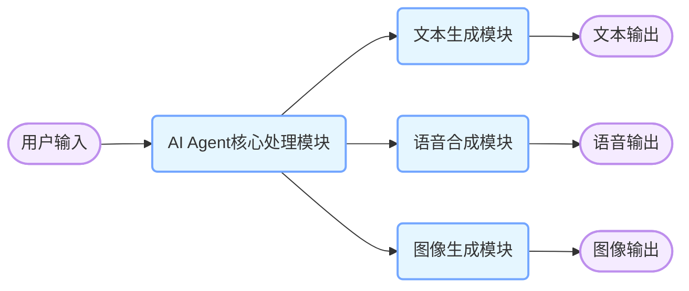

# 实现AI Agent的多模态输出：文本、语音、图像协同

> 关键词：AI Agent、多模态输出、文本、语音、图像、协同

> 摘要：本文聚焦于实现AI Agent的多模态输出，即文本、语音和图像的协同。详细阐述了相关核心概念、算法原理、数学模型，通过实际项目案例展示了如何开发一个具备多模态输出能力的AI Agent。同时，探讨了其实际应用场景，推荐了学习资源、开发工具和相关论文，最后总结了未来发展趋势与挑战，并提供常见问题解答和参考资料。旨在为开发者和研究者提供全面深入的指导，推动AI Agent多模态输出技术的发展。

## 1. 背景介绍 
### 1.1 目的和范围
随着人工智能技术的飞速发展，单一模态的输出已经难以满足用户日益多样化的需求。实现AI Agent的多模态输出，将文本、语音和图像进行协同，能够为用户提供更加丰富、直观和高效的交互体验。本文的目的在于详细介绍实现AI Agent多模态输出的原理、方法和技术，范围涵盖从核心概念的理解到实际项目的开发，以及对未来发展趋势的探讨。

### 1.2 预期读者
本文预期读者包括人工智能领域的开发者、研究人员、对AI Agent多模态输出技术感兴趣的技术爱好者，以及希望将该技术应用于实际业务的企业技术人员。

### 1.3 文档结构概述
本文首先介绍了实现AI Agent多模态输出的背景信息，包括目的、预期读者和文档结构。接着阐述了核心概念与联系，通过文本示意图和Mermaid流程图进行直观展示。然后详细讲解了核心算法原理和具体操作步骤，使用Python源代码进行说明。随后介绍了相关的数学模型和公式，并举例说明。通过实际项目案例，展示了开发环境搭建、源代码实现和代码解读。探讨了该技术的实际应用场景，推荐了学习资源、开发工具和相关论文。最后总结了未来发展趋势与挑战，提供常见问题解答和参考资料。

### 1.4 术语表
#### 1.4.1 核心术语定义
- **AI Agent**：即人工智能代理，是一种能够感知环境、进行决策并采取行动以实现特定目标的软件实体。
- **多模态输出**：指AI Agent同时以多种不同的模态（如文本、语音、图像等）向用户提供信息的能力。
- **文本生成**：AI Agent根据输入信息生成自然语言文本的过程。
- **语音合成**：将文本转换为语音信号的技术。
- **图像生成**：利用算法生成图像的过程。

#### 1.4.2 相关概念解释
- **模态协同**：在多模态输出中，不同模态之间相互配合、补充，以提供更加全面和准确的信息。例如，语音可以对图像进行解说，文本可以对语音和图像进行总结和补充。
- **上下文感知**：AI Agent能够根据当前的交互上下文理解用户的意图，并生成合适的多模态输出。例如，在不同的对话场景中，选择不同的文本、语音和图像表达方式。

#### 1.4.3 缩略词列表
- **TTS**：Text-to-Speech，文本转语音。
- **GAN**：Generative Adversarial Networks，生成对抗网络，常用于图像生成。
- **LLM**：Large Language Model，大语言模型，常用于文本生成。

## 2. 核心概念与联系 
### 核心概念原理
AI Agent的多模态输出涉及到文本生成、语音合成和图像生成三个核心模块。文本生成模块通常基于大语言模型（LLM），如GPT系列、BERT等，通过对输入信息的理解和处理，生成自然语言文本。语音合成模块（TTS）将生成的文本转换为语音信号，常用的技术包括基于深度学习的端到端语音合成模型，如Tacotron、WaveNet等。图像生成模块可以使用生成对抗网络（GAN）、变分自编码器（VAE）等技术，根据文本描述或特定需求生成相应的图像。

这三个模块之间相互协作，实现多模态输出的协同。例如，文本生成模块可以为图像生成模块提供描述信息，图像生成模块生成的图像可以作为补充信息与文本和语音一起输出。语音合成模块将文本转换为语音，增强信息的传达效果。

### 架构的文本示意图
```plaintext
用户输入 --> AI Agent核心处理模块
                      |
                      |-- 文本生成模块 --> 文本输出
                      |
                      |-- 语音合成模块 --> 语音输出
                      |
                      |-- 图像生成模块 --> 图像输出
```

### Mermaid流程图


## 3. 核心算法原理 & 具体操作步骤 
### 文本生成算法原理及Python代码实现
文本生成通常基于大语言模型，这里以Hugging Face的Transformers库为例，使用GPT-2模型进行文本生成。

```python
from transformers import GPT2LMHeadModel, GPT2Tokenizer

# 加载预训练的GPT-2模型和分词器
tokenizer = GPT2Tokenizer.from_pretrained('gpt2')
model = GPT2LMHeadModel.from_pretrained('gpt2')

# 输入文本
input_text = "今天天气不错，"

# 将输入文本转换为模型可接受的输入格式
input_ids = tokenizer.encode(input_text, return_tensors='pt')

# 生成文本
output = model.generate(input_ids, max_length=50, num_beams=5, no_repeat_ngram_size=2, early_stopping=True)

# 将生成的输出转换为文本
generated_text = tokenizer.decode(output[0], skip_special_tokens=True)

print(generated_text)
```
上述代码的具体步骤如下：
1. 加载预训练的GPT-2模型和分词器。
2. 定义输入文本。
3. 使用分词器将输入文本转换为模型可接受的输入格式（张量）。
4. 调用模型的`generate`方法生成文本，设置生成的最大长度、束搜索的束数等参数。
5. 使用分词器将生成的输出转换为自然语言文本。

### 语音合成算法原理及Python代码实现
语音合成可以使用`gTTS`（Google Text-to-Speech）库，它是一个简单易用的Python库，可以将文本转换为语音。

```python
from gtts import gTTS
import os

# 要转换为语音的文本
text = "今天天气不错，适合出门散步。"

# 创建gTTS对象
tts = gTTS(text=text, lang='zh-cn')

# 保存语音文件
tts.save("output.mp3")

# 播放语音文件（在Linux系统上）
os.system("mpg321 output.mp3")
```
上述代码的具体步骤如下：
1. 导入`gTTS`库和`os`模块。
2. 定义要转换为语音的文本。
3. 创建`gTTS`对象，指定文本和语言。
4. 调用`save`方法将语音保存为MP3文件。
5. 使用`os.system`方法播放生成的语音文件（不同操作系统的播放命令可能不同）。

### 图像生成算法原理及Python代码实现
图像生成可以使用`DALL-E Mini`模型，它是一个轻量级的图像生成模型。

```python
from dalle_mini import DalleBart, DalleBartProcessor
from vqgan_jax.modeling_flax_vqgan import VQModel
from transformers import CLIPProcessor, CLIPModel
import jax
import jax.numpy as jnp
from PIL import Image
import numpy as np

# 加载模型和处理器
model, params = DalleBart.from_pretrained("dalle-mini/dalle-mini", revision="v4", dtype=jnp.float16, _do_init=False)
vqgan, vqgan_params = VQModel.from_pretrained("dalle-mini/vqgan_imagenet_f16_16384", revision="e93a26e", dtype=jnp.float16, _do_init=False)
processor = DalleBartProcessor.from_pretrained("dalle-mini/dalle-mini")
clip = CLIPModel.from_pretrained("openai/clip-vit-base-patch32")
clip_processor = CLIPProcessor.from_pretrained("openai/clip-vit-base-patch32")

# 文本描述
text = "一只可爱的猫咪"

# 对文本进行编码
input_ids = processor([text], return_tensors="jax").input_ids

# 生成图像
n_predictions = 1
prng_key = jax.random.PRNGKey(0)
encoded_images = [model.generate(input_ids, params=params, prng_key=jax.random.PRNGKey(i))[0] for i in range(n_predictions)]

# 解码图像
decoded_images = [vqgan.decode_code(encoded_image, params=vqgan_params) for encoded_image in encoded_images]

# 转换为PIL图像
pil_images = [Image.fromarray(np.asarray(img).astype(np.uint8)) for img in decoded_images]

# 保存图像
pil_images[0].save("cat_image.png")
```
上述代码的具体步骤如下：
1. 加载`DALL-E Mini`模型、VQGAN模型、处理器和CLIP模型。
2. 定义图像的文本描述。
3. 使用处理器对文本进行编码。
4. 调用`DALL-E Mini`模型生成图像的编码表示。
5. 使用VQGAN模型对编码表示进行解码，得到图像的像素值。
6. 将像素值转换为PIL图像。
7. 保存生成的图像。

## 4. 数学模型和公式 & 详细讲解 & 举例说明 
### 文本生成的数学模型
在基于大语言模型的文本生成中，通常使用概率语言模型。给定一个输入序列 $x = (x_1, x_2, \cdots, x_n)$，模型的目标是预测下一个词 $x_{n+1}$ 的概率分布。可以使用链式法则将联合概率分解为条件概率的乘积：

$$P(x_1, x_2, \cdots, x_m) = \prod_{i=1}^{m} P(x_i | x_1, x_2, \cdots, x_{i-1})$$

在实际应用中，大语言模型通过神经网络（如Transformer）来学习这些条件概率。例如，在GPT-2模型中，Transformer的解码器部分用于计算每个位置的词的概率分布。

### 语音合成的数学模型
语音合成的目标是将文本转换为语音信号。基于深度学习的端到端语音合成模型通常使用编码器 - 解码器架构。编码器将输入的文本转换为隐藏表示，解码器根据隐藏表示生成语音的声学特征（如梅尔频谱）。

假设输入文本为 $x$，输出的声学特征为 $y$，模型的目标是最大化条件概率 $P(y | x)$。通常使用最大似然估计来训练模型，即最小化负对数似然损失：

$$L = -\sum_{i=1}^{N} \log P(y_i | x_i)$$

其中，$N$ 是训练样本的数量。

### 图像生成的数学模型
以生成对抗网络（GAN）为例，GAN由生成器 $G$ 和判别器 $D$ 组成。生成器的目标是生成逼真的图像，判别器的目标是区分生成的图像和真实的图像。

生成器接受一个随机噪声向量 $z$ 作为输入，生成图像 $G(z)$。判别器接受图像作为输入，输出一个概率值，表示该图像是真实图像的概率。

GAN的训练目标可以表示为一个极小极大博弈问题：

$$\min_G \max_D V(D, G) = \mathbb{E}_{x \sim p_{data}(x)} [\log D(x)] + \mathbb{E}_{z \sim p_z(z)} [\log (1 - D(G(z)))]$$

其中，$p_{data}(x)$ 是真实图像的分布，$p_z(z)$ 是随机噪声的分布。

### 举例说明
#### 文本生成
假设输入文本为“我喜欢”，模型根据之前学习到的语言模式，预测下一个词可能是“美食”“旅游”等。通过计算每个词的概率，选择概率最大的词作为下一个输出。

#### 语音合成
给定文本“你好”，语音合成模型将其转换为对应的声学特征，然后通过声码器将声学特征转换为语音信号。在训练过程中，模型通过最小化预测的声学特征和真实声学特征之间的损失来学习。

#### 图像生成
假设输入的文本描述为“一朵红色的玫瑰”，生成器接受随机噪声向量，尝试生成符合该描述的图像。判别器判断生成的图像是否逼真，并反馈给生成器进行调整。经过多次迭代训练，生成器能够生成越来越逼真的红色玫瑰图像。

## 5. 项目实战：代码实际案例和详细解释说明 
### 5.1  开发环境搭建
#### 安装Python
确保你的系统上已经安装了Python 3.6或更高版本。可以从Python官方网站（https://www.python.org/downloads/）下载并安装。

#### 创建虚拟环境
使用`venv`模块创建一个虚拟环境，避免不同项目之间的依赖冲突。

```bash
python -m venv myenv
source myenv/bin/activate  # 在Linux/Mac上激活虚拟环境
myenv\Scripts\activate  # 在Windows上激活虚拟环境
```

#### 安装依赖库
安装项目所需的依赖库，包括`transformers`、`gTTS`、`dalle-mini`等。

```bash
pip install transformers gTTS dalle-mini flax jax jaxlib pillow
```

### 5.2  源代码详细实现和代码解读
```python
from transformers import GPT2LMHeadModel, GPT2Tokenizer
from gtts import gTTS
import os
from dalle_mini import DalleBart, DalleBartProcessor
from vqgan_jax.modeling_flax_vqgan import VQModel
from transformers import CLIPProcessor, CLIPModel
import jax
import jax.numpy as jnp
from PIL import Image
import numpy as np

# 文本生成函数
def generate_text(input_text):
    tokenizer = GPT2Tokenizer.from_pretrained('gpt2')
    model = GPT2LMHeadModel.from_pretrained('gpt2')
    input_ids = tokenizer.encode(input_text, return_tensors='pt')
    output = model.generate(input_ids, max_length=50, num_beams=5, no_repeat_ngram_size=2, early_stopping=True)
    generated_text = tokenizer.decode(output[0], skip_special_tokens=True)
    return generated_text

# 语音合成函数
def text_to_speech(text):
    tts = gTTS(text=text, lang='zh-cn')
    tts.save("output.mp3")
    os.system("mpg321 output.mp3")

# 图像生成函数
def generate_image(text):
    model, params = DalleBart.from_pretrained("dalle-mini/dalle-mini", revision="v4", dtype=jnp.float16, _do_init=False)
    vqgan, vqgan_params = VQModel.from_pretrained("dalle-mini/vqgan_imagenet_f16_16384", revision="e93a26e", dtype=jnp.float16, _do_init=False)
    processor = DalleBartProcessor.from_pretrained("dalle-mini/dalle-mini")
    clip = CLIPModel.from_pretrained("openai/clip-vit-base-patch32")
    clip_processor = CLIPProcessor.from_pretrained("openai/clip-vit-base-patch32")
    input_ids = processor([text], return_tensors="jax").input_ids
    n_predictions = 1
    prng_key = jax.random.PRNGKey(0)
    encoded_images = [model.generate(input_ids, params=params, prng_key=jax.random.PRNGKey(i))[0] for i in range(n_predictions)]
    decoded_images = [vqgan.decode_code(encoded_image, params=vqgan_params) for encoded_image in encoded_images]
    pil_images = [Image.fromarray(np.asarray(img).astype(np.uint8)) for img in decoded_images]
    pil_images[0].save("generated_image.png")

# 主函数
def main():
    input_text = "今天的活动很有趣，"
    # 生成文本
    generated_text = generate_text(input_text)
    print("生成的文本:", generated_text)

    # 语音合成
    text_to_speech(generated_text)

    # 图像生成
    generate_image(generated_text)

if __name__ == "__main__":
    main()
```
### 5.3  代码解读与分析
#### 文本生成函数`generate_text`
- 该函数接受一个输入文本，使用GPT-2模型生成一段新的文本。
- 首先加载预训练的GPT-2模型和分词器。
- 将输入文本转换为模型可接受的输入格式。
- 调用模型的`generate`方法生成文本，设置生成的最大长度、束搜索的束数等参数。
- 最后将生成的输出转换为自然语言文本并返回。

#### 语音合成函数`text_to_speech`
- 该函数接受一个文本字符串，使用`gTTS`库将其转换为语音。
- 创建`gTTS`对象，指定文本和语言。
- 调用`save`方法将语音保存为MP3文件。
- 使用`os.system`方法播放生成的语音文件。

#### 图像生成函数`generate_image`
- 该函数接受一个文本描述，使用`DALL-E Mini`模型生成相应的图像。
- 加载`DALL-E Mini`模型、VQGAN模型、处理器和CLIP模型。
- 对文本进行编码，调用`DALL-E Mini`模型生成图像的编码表示。
- 使用VQGAN模型对编码表示进行解码，得到图像的像素值。
- 将像素值转换为PIL图像并保存。

#### 主函数`main`
- 定义输入文本。
- 调用`generate_text`函数生成文本。
- 调用`text_to_speech`函数将生成的文本转换为语音。
- 调用`generate_image`函数根据生成的文本生成图像。

## 6. 实际应用场景 
### 智能客服
在智能客服系统中，AI Agent可以根据用户的问题生成文本回复，并通过语音合成将回复内容以语音的形式播放给用户，同时可以根据问题的相关信息生成图像，如产品图片、操作流程图等，为用户提供更加直观的解答。

### 教育领域
在在线教育中，AI Agent可以作为虚拟教师，生成讲解文本，通过语音进行授课，同时展示相关的图像、图表等，帮助学生更好地理解知识。例如，在讲解数学公式时，可以生成公式的文本解释，语音朗读公式，同时展示公式的推导过程图像。

### 娱乐领域
在游戏、动漫等娱乐场景中，AI Agent可以生成剧情文本，通过语音配音增加剧情的沉浸感，同时生成角色、场景等图像，为用户带来更加丰富的娱乐体验。

### 智能家居
在智能家居系统中，AI Agent可以根据用户的语音指令生成文本反馈，通过语音合成回复用户，同时可以控制智能设备的状态，并生成设备状态的图像，如灯光的亮度、温度的变化等，方便用户直观地了解家居环境。

## 7. 工具和资源推荐
### 7.1 学习资源推荐
#### 7.1.1 书籍推荐
- 《深度学习》（Deep Learning）：由Ian Goodfellow、Yoshua Bengio和Aaron Courville撰写，是深度学习领域的经典教材，涵盖了神经网络、卷积神经网络、循环神经网络等基础知识，对于理解文本生成、图像生成等算法原理有很大帮助。
- 《自然语言处理入门》：介绍了自然语言处理的基本概念、算法和应用，包括文本分类、情感分析、机器翻译等，对于学习文本生成和处理有很好的指导作用。
- 《Python深度学习》（Deep Learning with Python）：由Francois Chollet撰写，结合Python和Keras框架，详细介绍了深度学习的实践应用，通过大量的代码示例帮助读者快速上手。

#### 7.1.2 在线课程
- Coursera上的“深度学习专项课程”（Deep Learning Specialization）：由Andrew Ng教授授课，包括神经网络和深度学习、改善深层神经网络、结构化机器学习项目、卷积神经网络和序列模型等五门课程，系统地介绍了深度学习的理论和实践。
- edX上的“自然语言处理基础”（Foundations of Natural Language Processing）：介绍了自然语言处理的基本概念、算法和技术，包括词法分析、句法分析、语义分析等。
- Udemy上的“图像生成和GANs实战”（Hands-On Image Generation with GANs）：通过实际项目案例，详细介绍了生成对抗网络（GAN）的原理和应用，包括图像生成、风格迁移等。

#### 7.1.3 技术博客和网站
- Hugging Face博客（https://huggingface.co/blog）：提供了关于自然语言处理、计算机视觉等领域的最新技术和研究成果，特别是关于Transformer模型和大语言模型的应用。
- OpenAI博客（https://openai.com/blog/）：发布了OpenAI的最新研究成果和技术进展，如GPT系列模型的介绍和应用。
- Medium上的AI相关博客：许多AI领域的专家和研究者在Medium上分享他们的经验和见解，如Towards Data Science、The AI Summer等。

### 7.2 开发工具框架推荐
#### 7.2.1 IDE和编辑器
- PyCharm：是一款专业的Python集成开发环境，提供了代码编辑、调试、代码分析等功能，支持多种Python框架和库，对于开发AI Agent的多模态输出项目非常方便。
- Visual Studio Code：是一款轻量级的代码编辑器，支持多种编程语言和插件扩展，通过安装Python相关插件，可以实现代码编辑、调试、版本控制等功能。
- Jupyter Notebook：是一个交互式的开发环境，适合进行数据探索、模型训练和代码演示。可以将代码、文本、图像等内容整合在一个文档中，方便分享和交流。

#### 7.2.2 调试和性能分析工具
- TensorBoard：是TensorFlow提供的可视化工具，可以用于监控模型的训练过程、可视化模型的结构、查看损失函数和准确率等指标的变化情况。
- Py-Spy：是一个用于分析Python程序性能的工具，可以实时查看程序的CPU使用率、函数调用时间等信息，帮助开发者找出性能瓶颈。
- PDB：是Python自带的调试器，可以在代码中设置断点，逐步执行代码，查看变量的值和程序的执行流程，方便调试程序。

#### 7.2.3 相关框架和库
- Transformers：是Hugging Face开发的一个自然语言处理框架，提供了大量预训练的模型，如GPT、BERT、T5等，方便开发者进行文本生成、文本分类、机器翻译等任务。
- TorchAudio：是PyTorch的音频处理库，提供了音频数据的加载、处理、特征提取等功能，对于语音合成和语音识别任务非常有用。
- Pillow：是Python的图像处理库，提供了图像的读取、保存、裁剪、缩放等基本操作，也支持图像的滤镜、特效等处理。

### 7.3 相关论文著作推荐
#### 7.3.1 经典论文
- “Attention Is All You Need”：提出了Transformer模型，是自然语言处理领域的里程碑式论文，为后续的大语言模型发展奠定了基础。
- “Generative Adversarial Nets”：首次提出了生成对抗网络（GAN）的概念，开创了图像生成和无监督学习的新方向。
- “Neural Machine Translation by Jointly Learning to Align and Translate”：提出了基于注意力机制的神经机器翻译模型，提高了机器翻译的性能。

#### 7.3.2 最新研究成果
- “GPT-3: Language Models are Few-Shot Learners”：介绍了GPT-3模型的原理和应用，展示了大语言模型在少样本学习和自然语言处理任务中的强大能力。
- “DALL-E: Creating Images from Text”：介绍了OpenAI的DALL-E模型，实现了根据文本描述生成图像的功能。
- “Tacotron 2: Natural TTS Synthesis by Conditioning WaveNet on Mel Spectrogram Predictions”：提出了Tacotron 2模型，是一种基于深度学习的端到端语音合成模型，提高了语音合成的质量。

#### 7.3.3 应用案例分析
- “Multi-modal AI in Healthcare: A Review”：综述了多模态人工智能在医疗领域的应用，包括医学图像分析、医疗文本处理、语音诊断等。
- “Using Multi-modal AI for Customer Service: A Case Study”：通过实际案例分析了多模态AI在客服系统中的应用，展示了如何提高客服效率和用户满意度。
- “Multi-modal Interaction in Smart Homes: A Survey”：介绍了多模态交互技术在智能家居中的应用现状和发展趋势，包括语音控制、手势识别、图像感知等。

## 8. 总结：未来发展趋势与挑战
### 未来发展趋势
- **更加智能的模态协同**：未来的AI Agent将能够更好地理解不同模态之间的语义关联，实现更加自然和高效的模态协同。例如，在输出文本、语音和图像时，能够根据上下文自动调整各模态的内容和表达方式，提供更加个性化的交互体验。
- **融合更多的模态**：除了文本、语音和图像，未来的AI Agent可能会融合更多的模态，如视频、触觉等。例如，在虚拟现实和增强现实场景中，AI Agent可以通过视频和触觉反馈为用户提供更加沉浸式的体验。
- **跨领域应用拓展**：多模态输出技术将在更多的领域得到应用，如金融、交通、工业制造等。例如，在金融领域，AI Agent可以通过文本、语音和图像为客户提供投资建议和风险评估；在交通领域，AI Agent可以通过视频和语音为驾驶员提供实时的路况信息和导航指引。

### 挑战
- **数据获取和标注困难**：多模态数据的获取和标注比单一模态数据更加困难，需要大量的人力和物力资源。例如，在图像生成任务中，需要标注大量的文本描述和对应的图像数据，以训练高质量的模型。
- **模型复杂度和计算资源需求高**：实现多模态输出需要集成多个复杂的模型，如大语言模型、语音合成模型和图像生成模型等，这些模型的训练和推理需要大量的计算资源和时间。如何在有限的计算资源下提高模型的性能和效率是一个挑战。
- **模态一致性和协调性问题**：在多模态输出中，如何保证不同模态之间的一致性和协调性是一个关键问题。例如，语音的内容和语调需要与文本和图像的信息相匹配，否则会给用户带来困惑和误解。

## 9. 附录：常见问题与解答
### 问题1：如何提高文本生成的质量？
解答：可以尝试以下方法提高文本生成的质量：
- 使用更大规模的预训练模型，如GPT-3、ChatGPT等。
- 调整生成参数，如最大长度、束搜索的束数、重复惩罚等。
- 进行微调训练，使用特定领域的数据集对模型进行微调。

### 问题2：语音合成的效果不理想怎么办？
解答：可以尝试以下方法改善语音合成的效果：
- 选择更合适的语音合成模型或库，如Tacotron 2、WaveNet等。
- 调整语音合成的参数，如语速、语调、音量等。
- 使用专业的语音合成服务，如百度语音合成、阿里云语音合成等。

### 问题3：图像生成的速度很慢怎么办？
解答：可以尝试以下方法提高图像生成的速度：
- 使用轻量级的图像生成模型，如DALL-E Mini。
- 减少生成图像的分辨率和尺寸。
- 使用GPU加速，将模型和数据迁移到GPU上进行计算。

### 问题4：如何保证多模态输出的一致性？
解答：可以采用以下方法保证多模态输出的一致性：
- 设计统一的语义表示，将不同模态的信息映射到相同的语义空间中。
- 建立模态之间的关联模型，学习不同模态之间的对应关系。
- 在生成过程中进行一致性检查和调整，确保各模态的输出信息一致。

## 10. 扩展阅读 & 参考资料
- 《人工智能：一种现代的方法》（Artificial Intelligence: A Modern Approach），作者：Stuart Russell、Peter Norvig
- 《深度学习实战》（Deep Learning in Practice），作者：Antoine Géron
- Hugging Face官方文档（https://huggingface.co/docs）
- OpenAI官方文档（https://platform.openai.com/docs）
- TensorFlow官方文档（https://www.tensorflow.org/api_docs）
- PyTorch官方文档（https://pytorch.org/docs/stable/index.html）

作者：AI天才研究院/AI Genius Institute & 禅与计算机程序设计艺术 /Zen And The Art of Computer Programming