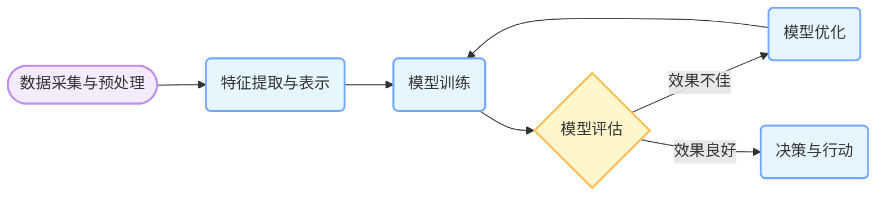

# 实现AI Agent的概念学习与泛化能力

> 关键词：AI Agent、概念学习、泛化能力、机器学习、深度学习

> 摘要：本文围绕实现AI Agent的概念学习与泛化能力展开深入探讨。首先介绍了相关背景，包括目的、预期读者、文档结构和术语表。接着阐述了核心概念及其联系，给出了原理和架构的文本示意图与Mermaid流程图。详细讲解了核心算法原理并结合Python源代码说明具体操作步骤，同时给出了相关数学模型和公式并举例。通过项目实战展示了代码实际案例及详细解释。分析了AI Agent概念学习与泛化能力的实际应用场景，推荐了学习资源、开发工具框架和相关论文著作。最后总结了未来发展趋势与挑战，提供了常见问题解答和扩展阅读参考资料，旨在帮助读者全面理解和实现AI Agent的概念学习与泛化能力。

## 1. 背景介绍 
### 1.1 目的和范围
本文章的目的是深入探讨如何实现AI Agent的概念学习与泛化能力。概念学习是AI Agent从数据中识别和理解抽象概念的过程，而泛化能力则是指AI Agent能够将所学概念应用到未见过的数据和场景中的能力。我们将涵盖从理论基础到实际应用的多个方面，包括核心概念的解释、算法原理的分析、代码实现的示例以及实际应用场景的探讨等，旨在为读者提供一个全面的关于实现AI Agent概念学习与泛化能力的知识体系。

### 1.2 预期读者
本文预期读者包括对人工智能、机器学习和深度学习感兴趣的初学者，希望进一步提升技术能力的程序员和数据科学家，以及从事相关领域研究的科研人员。无论你是刚刚接触AI Agent，还是已经有一定的实践经验，都能从本文中获取有价值的信息。

### 1.3 文档结构概述
本文将按照以下结构进行组织：首先介绍背景信息，包括目的、预期读者和文档结构等。接着阐述核心概念与联系，通过文本示意图和Mermaid流程图展示其原理和架构。然后详细讲解核心算法原理，并使用Python源代码说明具体操作步骤。之后给出相关数学模型和公式，并举例进行详细说明。通过项目实战展示代码实际案例及详细解释。分析实际应用场景，推荐学习资源、开发工具框架和相关论文著作。最后总结未来发展趋势与挑战，提供常见问题解答和扩展阅读参考资料。

### 1.4 术语表
#### 1.4.1 核心术语定义
- **AI Agent**：人工智能代理，是一种能够感知环境、根据感知信息做出决策并采取行动以实现特定目标的实体。
- **概念学习**：指AI Agent从数据中识别和理解抽象概念的过程，例如从图像数据中学习到“猫”和“狗”的概念。
- **泛化能力**：AI Agent将所学概念应用到未见过的数据和场景中的能力，例如训练好的图像分类模型能够正确分类新的、未在训练集中出现过的图像。
- **机器学习**：一门多领域交叉学科，涉及概率论、统计学、逼近论、凸分析、算法复杂度理论等多门学科。它专门研究计算机怎样模拟或实现人类的学习行为，以获取新的知识或技能，重新组织已有的知识结构使之不断改善自身的性能。
- **深度学习**：机器学习的一个分支领域，它是一种基于对数据进行表征学习的方法。深度学习通过构建具有很多层的神经网络模型，自动从数据中学习到复杂的特征和模式。

#### 1.4.2 相关概念解释
- **感知**：AI Agent通过传感器等设备获取环境信息的过程，例如机器人通过摄像头获取图像信息，通过麦克风获取声音信息等。
- **决策**：AI Agent根据感知到的信息，运用一定的算法和策略，选择合适的行动方案的过程。
- **行动**：AI Agent根据决策结果，通过执行器等设备对环境产生影响的过程，例如机器人移动、机械臂抓取物体等。

#### 1.4.3 缩略词列表
- **ML**：Machine Learning，机器学习
- **DL**：Deep Learning，深度学习
- **ANN**：Artificial Neural Network，人工神经网络
- **CNN**：Convolutional Neural Network，卷积神经网络
- **RNN**：Recurrent Neural Network，循环神经网络

## 2. 核心概念与联系 

### 核心概念原理
AI Agent的概念学习与泛化能力是人工智能领域的重要研究方向。概念学习是AI Agent通过对大量数据的学习，识别和理解其中蕴含的抽象概念的过程。例如，在图像识别任务中，AI Agent需要从大量的图像数据中学习到不同物体的特征，从而形成“猫”、“狗”等概念。

泛化能力则是概念学习的延伸和拓展。当AI Agent学习到某个概念后，它需要能够将这个概念应用到未见过的数据和场景中。例如，一个训练好的图像分类模型，不仅要能够正确分类训练集中的图像，还要能够对新的、未在训练集中出现过的图像进行正确分类。

### 架构的文本示意图
AI Agent的概念学习与泛化能力的实现通常涉及以下几个主要部分：
1. **数据采集与预处理**：通过各种传感器或数据源收集数据，并对数据进行清洗、转换和归一化等预处理操作，以提高数据的质量和可用性。
2. **特征提取与表示**：从预处理后的数据中提取有代表性的特征，并将其表示为适合机器学习算法处理的形式。
3. **模型训练**：使用提取的特征和标注好的标签数据，对机器学习或深度学习模型进行训练，使模型学习到数据中的概念和模式。
4. **模型评估与优化**：使用测试数据对训练好的模型进行评估，根据评估结果对模型进行优化，以提高模型的性能和泛化能力。
5. **决策与行动**：当模型训练好后，AI Agent可以根据输入的新数据，运用训练好的模型进行决策，并采取相应的行动。

### Mermaid流程图


## 3. 核心算法原理 & 具体操作步骤 

### 核心算法原理
在实现AI Agent的概念学习与泛化能力时，常用的算法包括机器学习算法和深度学习算法。下面以神经网络为例，介绍其核心算法原理。

神经网络是一种模仿人类神经系统的计算模型，由大量的神经元组成。每个神经元接收多个输入信号，对这些信号进行加权求和，并通过一个激活函数进行非线性变换，得到输出信号。多个神经元可以组成不同的层，常见的神经网络结构包括输入层、隐藏层和输出层。

在神经网络的训练过程中，通常使用反向传播算法来更新网络中的权重参数。反向传播算法的基本思想是：首先，将输入数据输入到神经网络中，通过前向传播计算得到输出结果；然后，计算输出结果与真实标签之间的误差；最后，根据误差反向传播，计算每个权重参数对误差的梯度，并使用梯度下降法更新权重参数，使得误差不断减小。

### 具体操作步骤（Python源代码）
以下是一个使用Python和PyTorch库实现简单神经网络进行图像分类的示例代码：

```python
import torch
import torch.nn as nn
import torch.optim as optim
from torchvision import datasets, transforms

# 数据预处理
transform = transforms.Compose([
    transforms.ToTensor(),
    transforms.Normalize((0.1307,), (0.3081,))
])

# 加载训练集和测试集
train_dataset = datasets.MNIST(root='./data', train=True,
                               download=True, transform=transform)
train_loader = torch.utils.data.DataLoader(train_dataset, batch_size=64, shuffle=True)

test_dataset = datasets.MNIST(root='./data', train=False,
                              download=True, transform=transform)
test_loader = torch.utils.data.DataLoader(test_dataset, batch_size=1000, shuffle=False)

# 定义神经网络模型
class Net(nn.Module):
    def __init__(self):
        super(Net, self).__init__()
        self.fc1 = nn.Linear(28 * 28, 128)
        self.fc2 = nn.Linear(128, 10)

    def forward(self, x):
        x = x.view(-1, 28 * 28)
        x = torch.relu(self.fc1(x))
        x = self.fc2(x)
        return x

model = Net()

# 定义损失函数和优化器
criterion = nn.CrossEntropyLoss()
optimizer = optim.SGD(model.parameters(), lr=0.01, momentum=0.5)

# 训练模型
def train(model, train_loader, criterion, optimizer, epoch):
    model.train()
    for batch_idx, (data, target) in enumerate(train_loader):
        optimizer.zero_grad()
        output = model(data)
        loss = criterion(output, target)
        loss.backward()
        optimizer.step()
        if batch_idx % 100 == 0:
            print('Train Epoch: {} [{}/{} ({:.0f}%)]\tLoss: {:.6f}'.format(
                epoch, batch_idx * len(data), len(train_loader.dataset),
                100. * batch_idx / len(train_loader), loss.item()))

# 测试模型
def test(model, test_loader):
    model.eval()
    test_loss = 0
    correct = 0
    with torch.no_grad():
        for data, target in test_loader:
            output = model(data)
            test_loss += criterion(output, target).item()
            pred = output.argmax(dim=1, keepdim=True)
            correct += pred.eq(target.view_as(pred)).sum().item()

    test_loss /= len(test_loader.dataset)

    print('\nTest set: Average loss: {:.4f}, Accuracy: {}/{} ({:.0f}%)\n'.format(
        test_loss, correct, len(test_loader.dataset),
        100. * correct / len(test_loader.dataset)))

# 训练和测试模型
for epoch in range(1, 11):
    train(model, train_loader, criterion, optimizer, epoch)
    test(model, test_loader)
```

### 代码解释
1. **数据预处理**：使用`transforms.Compose`函数定义了数据预处理的操作，包括将图像转换为张量和归一化处理。
2. **加载数据集**：使用`torchvision.datasets.MNIST`加载MNIST手写数字数据集，并使用`torch.utils.data.DataLoader`创建数据加载器。
3. **定义神经网络模型**：定义了一个简单的全连接神经网络模型`Net`，包含一个输入层、一个隐藏层和一个输出层。
4. **定义损失函数和优化器**：使用交叉熵损失函数`nn.CrossEntropyLoss`和随机梯度下降优化器`optim.SGD`。
5. **训练模型**：定义了`train`函数，在每个训练周期中，将输入数据输入到模型中，计算损失，反向传播并更新权重参数。
6. **测试模型**：定义了`test`函数，在每个训练周期结束后，使用测试集对模型进行评估，计算平均损失和准确率。

## 4. 数学模型和公式 & 详细讲解 & 举例说明 

### 神经网络的前向传播
假设一个简单的全连接神经网络，输入层有 $n$ 个神经元，隐藏层有 $m$ 个神经元，输出层有 $k$ 个神经元。输入向量为 $\mathbf{x} = [x_1, x_2, \cdots, x_n]^T$，隐藏层的权重矩阵为 $\mathbf{W}_1 \in \mathbb{R}^{m \times n}$，偏置向量为 $\mathbf{b}_1 \in \mathbb{R}^{m}$，输出层的权重矩阵为 $\mathbf{W}_2 \in \mathbb{R}^{k \times m}$，偏置向量为 $\mathbf{b}_2 \in \mathbb{R}^{k}$。

隐藏层的输入为：
$$
\mathbf{z}_1 = \mathbf{W}_1 \mathbf{x} + \mathbf{b}_1
$$

隐藏层的输出为：
$$
\mathbf{h} = f(\mathbf{z}_1)
$$
其中 $f$ 是激活函数，常用的激活函数有ReLU函数 $f(x) = \max(0, x)$。

输出层的输入为：
$$
\mathbf{z}_2 = \mathbf{W}_2 \mathbf{h} + \mathbf{b}_2
$$

输出层的输出为：
$$
\mathbf{y} = g(\mathbf{z}_2)
$$
其中 $g$ 是输出层的激活函数，对于分类问题，常用的激活函数是Softmax函数：
$$
g(z_i) = \frac{e^{z_i}}{\sum_{j=1}^{k} e^{z_j}}
$$

### 反向传播算法
反向传播算法的核心是计算每个权重参数对误差的梯度，然后使用梯度下降法更新权重参数。假设损失函数为 $L(\mathbf{y}, \mathbf{t})$，其中 $\mathbf{y}$ 是模型的输出，$\mathbf{t}$ 是真实标签。

首先，计算输出层的误差：
$$
\delta_2 = \frac{\partial L}{\partial \mathbf{z}_2}
$$

然后，计算隐藏层的误差：
$$
\delta_1 = \mathbf{W}_2^T \delta_2 \odot f'(\mathbf{z}_1)
$$
其中 $\odot$ 表示逐元素相乘，$f'$ 是激活函数 $f$ 的导数。

最后，计算权重参数的梯度：
$$
\frac{\partial L}{\partial \mathbf{W}_2} = \delta_2 \mathbf{h}^T
$$
$$
\frac{\partial L}{\partial \mathbf{b}_2} = \delta_2
$$
$$
\frac{\partial L}{\partial \mathbf{W}_1} = \delta_1 \mathbf{x}^T
$$
$$
\frac{\partial L}{\partial \mathbf{b}_1} = \delta_1
$$

使用梯度下降法更新权重参数：
$$
\mathbf{W}_2 \leftarrow \mathbf{W}_2 - \alpha \frac{\partial L}{\partial \mathbf{W}_2}
$$
$$
\mathbf{b}_2 \leftarrow \mathbf{b}_2 - \alpha \frac{\partial L}{\partial \mathbf{b}_2}
$$
$$
\mathbf{W}_1 \leftarrow \mathbf{W}_1 - \alpha \frac{\partial L}{\partial \mathbf{W}_1}
$$
$$
\mathbf{b}_1 \leftarrow \mathbf{b}_1 - \alpha \frac{\partial L}{\partial \mathbf{b}_1}
$$
其中 $\alpha$ 是学习率。

### 举例说明
假设我们有一个简单的二分类问题，输入向量 $\mathbf{x} = [0.5, 0.3]^T$，隐藏层有2个神经元，输出层有1个神经元。隐藏层的权重矩阵 $\mathbf{W}_1 = \begin{bmatrix} 0.2 & 0.4 \\ 0.1 & 0.3 \end{bmatrix}$，偏置向量 $\mathbf{b}_1 = [0.1, 0.2]^T$，输出层的权重矩阵 $\mathbf{W}_2 = [0.5, 0.6]$，偏置向量 $\mathbf{b}_2 = 0.3$。激活函数使用ReLU函数。

首先，计算隐藏层的输入：
$$
\mathbf{z}_1 = \mathbf{W}_1 \mathbf{x} + \mathbf{b}_1 = \begin{bmatrix} 0.2 & 0.4 \\ 0.1 & 0.3 \end{bmatrix} \begin{bmatrix} 0.5 \\ 0.3 \end{bmatrix} + \begin{bmatrix} 0.1 \\ 0.2 \end{bmatrix} = \begin{bmatrix} 0.2 \times 0.5 + 0.4 \times 0.3 + 0.1 \\ 0.1 \times 0.5 + 0.3 \times 0.3 + 0.2 \end{bmatrix} = \begin{bmatrix} 0.32 \\ 0.34 \end{bmatrix}
$$

隐藏层的输出：
$$
\mathbf{h} = f(\mathbf{z}_1) = \begin{bmatrix} \max(0, 0.32) \\ \max(0, 0.34) \end{bmatrix} = \begin{bmatrix} 0.32 \\ 0.34 \end{bmatrix}
$$

输出层的输入：
$$
\mathbf{z}_2 = \mathbf{W}_2 \mathbf{h} + \mathbf{b}_2 = [0.5, 0.6] \begin{bmatrix} 0.32 \\ 0.34 \end{bmatrix} + 0.3 = 0.5 \times 0.32 + 0.6 \times 0.34 + 0.3 = 0.664
$$

假设真实标签 $\mathbf{t} = 1$，损失函数使用均方误差损失函数 $L(\mathbf{y}, \mathbf{t}) = \frac{1}{2}(\mathbf{y} - \mathbf{t})^2$，则损失为：
$$
L = \frac{1}{2}(0.664 - 1)^2 = 0.059
$$

接下来，使用反向传播算法更新权重参数。首先，计算输出层的误差：
$$
\delta_2 = \frac{\partial L}{\partial \mathbf{z}_2} = \mathbf{y} - \mathbf{t} = 0.664 - 1 = -0.336
$$

隐藏层的误差：
$$
\delta_1 = \mathbf{W}_2^T \delta_2 \odot f'(\mathbf{z}_1) = \begin{bmatrix} 0.5 \\ 0.6 \end{bmatrix} \times (-0.336) \odot \begin{bmatrix} 1 \\ 1 \end{bmatrix} = \begin{bmatrix} -0.168 \\ -0.2016 \end{bmatrix}
$$

权重参数的梯度：
$$
\frac{\partial L}{\partial \mathbf{W}_2} = \delta_2 \mathbf{h}^T = -0.336 \times [0.32, 0.34] = [-0.10752, -0.11424]
$$
$$
\frac{\partial L}{\partial \mathbf{b}_2} = \delta_2 = -0.336
$$
$$
\frac{\partial L}{\partial \mathbf{W}_1} = \delta_1 \mathbf{x}^T = \begin{bmatrix} -0.168 \\ -0.2016 \end{bmatrix} \times [0.5, 0.3] = \begin{bmatrix} -0.084 & -0.0504 \\ -0.1008 & -0.06048 \end{bmatrix}
$$
$$
\frac{\partial L}{\partial \mathbf{b}_1} = \delta_1 = \begin{bmatrix} -0.168 \\ -0.2016 \end{bmatrix}
$$

假设学习率 $\alpha = 0.1$，则更新后的权重参数为：
$$
\mathbf{W}_2 \leftarrow \mathbf{W}_2 - \alpha \frac{\partial L}{\partial \mathbf{W}_2} = [0.5, 0.6] - 0.1 \times [-0.10752, -0.11424] = [0.510752, 0.611424]
$$
$$
\mathbf{b}_2 \leftarrow \mathbf{b}_2 - \alpha \frac{\partial L}{\partial \mathbf{b}_2} = 0.3 - 0.1 \times (-0.336) = 0.3336
$$
$$
\mathbf{W}_1 \leftarrow \mathbf{W}_1 - \alpha \frac{\partial L}{\partial \mathbf{W}_1} = \begin{bmatrix} 0.2 & 0.4 \\ 0.1 & 0.3 \end{bmatrix} - 0.1 \times \begin{bmatrix} -0.084 & -0.0504 \\ -0.1008 & -0.06048 \end{bmatrix} = \begin{bmatrix} 0.2084 & 0.40504 \\ 0.11008 & 0.306048 \end{bmatrix}
$$
$$
\mathbf{b}_1 \leftarrow \mathbf{b}_1 - \alpha \frac{\partial L}{\partial \mathbf{b}_1} = \begin{bmatrix} 0.1 \\ 0.2 \end{bmatrix} - 0.1 \times \begin{bmatrix} -0.168 \\ -0.2016 \end{bmatrix} = \begin{bmatrix} 0.1168 \\ 0.22016 \end{bmatrix}
$$

## 5. 项目实战：代码实际案例和详细解释说明 

### 5.1  开发环境搭建
#### 安装Python
首先，确保你已经安装了Python。建议使用Python 3.6及以上版本。你可以从Python官方网站（https://www.python.org/downloads/）下载并安装Python。

#### 安装PyTorch
PyTorch是一个开源的深度学习框架，我们可以使用它来实现AI Agent的概念学习与泛化能力。根据你的操作系统和CUDA版本，选择合适的安装命令。例如，如果你使用的是CPU版本的PyTorch，可以使用以下命令进行安装：
```bash
pip install torch torchvision
```
如果你使用的是GPU版本的PyTorch，需要根据你的CUDA版本选择合适的安装命令。具体安装方法可以参考PyTorch官方网站（https://pytorch.org/get-started/locally/）。

#### 安装其他依赖库
除了PyTorch，我们还需要安装一些其他的依赖库，如`numpy`、`matplotlib`等。可以使用以下命令进行安装：
```bash
pip install numpy matplotlib
```

### 5.2  源代码详细实现和代码解读
以下是一个使用PyTorch实现的图像分类项目的完整代码：

```python
import torch
import torch.nn as nn
import torch.optim as optim
from torchvision import datasets, transforms
import matplotlib.pyplot as plt

# 数据预处理
transform = transforms.Compose([
    transforms.ToTensor(),
    transforms.Normalize((0.5,), (0.5,))
])

# 加载训练集和测试集
train_dataset = datasets.FashionMNIST(root='./data', train=True,
                                      download=True, transform=transform)
train_loader = torch.utils.data.DataLoader(train_dataset, batch_size=64, shuffle=True)

test_dataset = datasets.FashionMNIST(root='./data', train=False,
                                     download=True, transform=transform)
test_loader = torch.utils.data.DataLoader(test_dataset, batch_size=1000, shuffle=False)

# 定义神经网络模型
class FashionNet(nn.Module):
    def __init__(self):
        super(FashionNet, self).__init__()
        self.fc1 = nn.Linear(28 * 28, 128)
        self.fc2 = nn.Linear(128, 64)
        self.fc3 = nn.Linear(64, 10)

    def forward(self, x):
        x = x.view(-1, 28 * 28)
        x = torch.relu(self.fc1(x))
        x = torch.relu(self.fc2(x))
        x = self.fc3(x)
        return x

model = FashionNet()

# 定义损失函数和优化器
criterion = nn.CrossEntropyLoss()
optimizer = optim.Adam(model.parameters(), lr=0.001)

# 训练模型
train_losses = []
train_accuracies = []
test_losses = []
test_accuracies = []

def train(model, train_loader, criterion, optimizer, epoch):
    model.train()
    train_loss = 0
    correct = 0
    total = 0
    for batch_idx, (data, target) in enumerate(train_loader):
        optimizer.zero_grad()
        output = model(data)
        loss = criterion(output, target)
        loss.backward()
        optimizer.step()

        train_loss += loss.item()
        _, predicted = output.max(1)
        total += target.size(0)
        correct += predicted.eq(target).sum().item()

    train_loss /= len(train_loader)
    accuracy = 100. * correct / total
    train_losses.append(train_loss)
    train_accuracies.append(accuracy)
    print('Train Epoch: {} \tLoss: {:.6f} \tAccuracy: {:.2f}%'.format(
        epoch, train_loss, accuracy))

# 测试模型
def test(model, test_loader, criterion):
    model.eval()
    test_loss = 0
    correct = 0
    total = 0
    with torch.no_grad():
        for data, target in test_loader:
            output = model(data)
            test_loss += criterion(output, target).item()
            _, predicted = output.max(1)
            total += target.size(0)
            correct += predicted.eq(target).sum().item()

    test_loss /= len(test_loader)
    accuracy = 100. * correct / total
    test_losses.append(test_loss)
    test_accuracies.append(accuracy)
    print('Test set: Average loss: {:.4f}, Accuracy: {}/{} ({:.2f}%)'.format(
        test_loss, correct, total, accuracy))

# 训练和测试模型
epochs = 10
for epoch in range(1, epochs + 1):
    train(model, train_loader, criterion, optimizer, epoch)
    test(model, test_loader, criterion)

# 绘制训练和测试损失曲线
plt.figure(figsize=(12, 4))
plt.subplot(1, 2, 1)
plt.plot(train_losses, label='Train Loss')
plt.plot(test_losses, label='Test Loss')
plt.xlabel('Epoch')
plt.ylabel('Loss')
plt.legend()

# 绘制训练和测试准确率曲线
plt.subplot(1, 2, 2)
plt.plot(train_accuracies, label='Train Accuracy')
plt.plot(test_accuracies, label='Test Accuracy')
plt.xlabel('Epoch')
plt.ylabel('Accuracy (%)')
plt.legend()

plt.show()
```

### 代码解读与分析
#### 数据预处理
使用`transforms.Compose`函数定义了数据预处理的操作，包括将图像转换为张量和归一化处理。归一化处理可以将图像数据的像素值缩放到 $[-1, 1]$ 之间，有助于提高模型的训练效果。

#### 加载数据集
使用`torchvision.datasets.FashionMNIST`加载FashionMNIST数据集，该数据集包含10个类别的时尚物品图像。使用`torch.utils.data.DataLoader`创建数据加载器，用于批量加载数据。

#### 定义神经网络模型
定义了一个简单的全连接神经网络模型`FashionNet`，包含一个输入层、两个隐藏层和一个输出层。输入层将28x28的图像数据展平为一维向量，隐藏层使用ReLU激活函数进行非线性变换，输出层使用Softmax函数进行分类。

#### 定义损失函数和优化器
使用交叉熵损失函数`nn.CrossEntropyLoss`和Adam优化器`optim.Adam`。交叉熵损失函数适用于分类问题，Adam优化器是一种自适应学习率的优化算法，可以更快地收敛。

#### 训练模型
定义了`train`函数，在每个训练周期中，将输入数据输入到模型中，计算损失，反向传播并更新权重参数。同时，记录训练损失和准确率。

#### 测试模型
定义了`test`函数，在每个训练周期结束后，使用测试集对模型进行评估，计算平均损失和准确率。同时，记录测试损失和准确率。

#### 绘制训练和测试曲线
使用`matplotlib`库绘制训练和测试损失曲线以及训练和测试准确率曲线，直观地展示模型的训练过程和性能。

## 6. 实际应用场景 
### 图像识别
在图像识别领域，AI Agent的概念学习与泛化能力可以用于识别各种物体和场景。例如，在安防监控系统中，AI Agent可以学习到不同类型的人物、车辆和行为的概念，并能够对监控视频中的新场景进行准确识别和预警。在医疗影像诊断中，AI Agent可以学习到各种疾病的特征和影像表现，对新的医学影像进行诊断和分析，辅助医生做出更准确的诊断。

### 自然语言处理
在自然语言处理领域，AI Agent的概念学习与泛化能力可以用于文本分类、情感分析、机器翻译等任务。例如，在新闻分类系统中，AI Agent可以学习到不同类型新闻的概念和特征，对新的新闻文章进行分类。在情感分析中，AI Agent可以学习到不同情感表达的概念，对用户的文本评论进行情感判断。在机器翻译中，AI Agent可以学习到不同语言之间的语义和语法概念，对新的文本进行准确翻译。

### 自动驾驶
在自动驾驶领域，AI Agent的概念学习与泛化能力至关重要。AI Agent需要学习到道路、交通标志、其他车辆和行人等概念，并能够在不同的驾驶场景中做出正确的决策。例如，在复杂的城市道路环境中，AI Agent需要识别各种交通标志和信号，预测其他车辆和行人的行为，从而安全地驾驶车辆。

### 智能客服
在智能客服领域，AI Agent的概念学习与泛化能力可以用于理解用户的问题，并提供准确的回答。AI Agent可以学习到各种常见问题和答案的概念，对用户的新问题进行匹配和解答。同时，AI Agent还可以学习到用户的语言习惯和情感状态，提供更加个性化的服务。

## 7. 工具和资源推荐
### 7.1 学习资源推荐
#### 7.1.1 书籍推荐
- 《深度学习》（Deep Learning）：由Ian Goodfellow、Yoshua Bengio和Aaron Courville撰写，是深度学习领域的经典教材，全面介绍了深度学习的理论和实践。
- 《Python机器学习》（Python Machine Learning）：由Sebastian Raschka和Vahid Mirjalili撰写，以Python为工具，详细介绍了机器学习的各种算法和应用。
- 《动手学深度学习》（Dive into Deep Learning）：由李沐、Aston Zhang等撰写，提供了丰富的代码示例和实践项目，适合初学者快速上手深度学习。

#### 7.1.2 在线课程
- Coursera上的“深度学习专项课程”（Deep Learning Specialization）：由Andrew Ng教授授课，包括深度学习的基础知识、卷积神经网络、循环神经网络等内容。
- edX上的“人工智能导论”（Introduction to Artificial Intelligence）：由麻省理工学院（MIT）的Patrick Winston教授授课，介绍了人工智能的基本概念和方法。
- 哔哩哔哩（B站）上有很多关于人工智能和机器学习的优质视频教程，例如“刘二大人的PyTorch深度学习入门教程”，讲解详细，适合初学者。

#### 7.1.3 技术博客和网站
- Medium：一个技术博客平台，有很多关于人工智能、机器学习和深度学习的优秀文章。
- Towards Data Science：专注于数据科学和机器学习领域的博客，提供了很多实用的技术文章和案例分析。
- AI开源社区：如GitHub上有很多开源的人工智能项目和代码库，可以学习和参考。

### 7.2 开发工具框架推荐
#### 7.2.1 IDE和编辑器
- PyCharm：一款专门为Python开发设计的集成开发环境（IDE），提供了丰富的代码编辑、调试和分析功能。
- Jupyter Notebook：一个基于网页的交互式开发环境，适合进行数据探索、模型训练和可视化展示。
- Visual Studio Code：一款轻量级的代码编辑器，支持多种编程语言和插件扩展，可用于Python开发。

#### 7.2.2 调试和性能分析工具
- PyTorch Profiler：PyTorch自带的性能分析工具，可以帮助用户分析模型的训练时间、内存使用等性能指标。
- TensorBoard：一个可视化工具，可用于监控模型的训练过程、可视化模型结构和分析性能指标。
- cProfile：Python标准库中的性能分析工具，可以分析Python代码的执行时间和函数调用情况。

#### 7.2.3 相关框架和库
- PyTorch：一个开源的深度学习框架，提供了丰富的神经网络层和优化算法，易于使用和扩展。
- TensorFlow：另一个广泛使用的深度学习框架，具有强大的分布式训练和部署能力。
- Scikit-learn：一个用于机器学习的Python库，提供了各种机器学习算法和工具，适合快速实现和验证机器学习模型。

### 7.3 相关论文著作推荐
#### 7.3.1 经典论文
- “Gradient-based learning applied to document recognition”：由Yann LeCun等人发表，介绍了卷积神经网络（CNN）的经典模型LeNet，为图像识别领域奠定了基础。
- “Long Short-Term Memory”：由Sepp Hochreiter和Jürgen Schmidhuber发表，提出了长短期记忆网络（LSTM），解决了循环神经网络（RNN）中的梯度消失问题。
- “Attention Is All You Need”：由Ashish Vaswani等人发表，提出了Transformer模型，在自然语言处理领域取得了巨大成功。

#### 7.3.2 最新研究成果
- arXiv：一个预印本平台，包含了大量关于人工智能、机器学习和深度学习的最新研究成果。
- NeurIPS、ICML、CVPR等顶级学术会议：每年都会发表很多关于人工智能领域的最新研究论文。

#### 7.3.3 应用案例分析
- 《人工智能：现代方法》（Artificial Intelligence: A Modern Approach）：书中包含了很多人工智能在不同领域的应用案例分析，有助于读者了解人工智能的实际应用。
- 各大科技公司的官方博客：如Google AI Blog、Facebook AI Research等，会分享一些他们在人工智能领域的研究和应用成果。

## 8. 总结：未来发展趋势与挑战
### 未来发展趋势
#### 更强的泛化能力
未来的AI Agent将具备更强的泛化能力，能够在更广泛的场景和任务中应用所学概念。例如，在多模态学习中，AI Agent可以同时处理图像、文本和语音等多种数据类型，实现更全面的概念学习和泛化。

#### 自主学习与终身学习
AI Agent将朝着自主学习和终身学习的方向发展。它们可以自动发现新的概念和知识，不断更新和扩展自己的知识体系，适应不断变化的环境和任务。

#### 与人类的深度协作
AI Agent将与人类进行更深度的协作，共同完成复杂的任务。例如，在医疗领域，AI Agent可以辅助医生进行诊断和治疗方案的制定；在教育领域，AI Agent可以为学生提供个性化的学习辅导。

### 挑战
#### 数据隐私和安全问题
随着AI Agent的广泛应用，数据隐私和安全问题变得越来越重要。AI Agent需要处理大量的个人和敏感数据，如果这些数据被泄露或滥用，将对用户造成严重的损失。

#### 可解释性和透明度
目前的很多AI Agent模型是黑盒模型，其决策过程和结果难以解释和理解。在一些关键领域，如医疗和金融，模型的可解释性和透明度是非常重要的，需要进一步研究和解决。

#### 对抗攻击
AI Agent容易受到对抗攻击的影响，攻击者可以通过微小的扰动来误导AI Agent的决策。如何提高AI Agent的鲁棒性和抗攻击能力是一个亟待解决的问题。

## 9. 附录：常见问题与解答
### 问题1：如何提高AI Agent的泛化能力？
解答：可以从以下几个方面提高AI Agent的泛化能力：
- **增加训练数据**：使用更多的、多样化的数据进行训练，使模型能够学习到更广泛的概念和模式。
- **正则化方法**：如L1和L2正则化、Dropout等，可以防止模型过拟合，提高泛化能力。
- **模型选择和调优**：选择合适的模型结构，并对模型的超参数进行调优，以找到最优的模型配置。

### 问题2：概念学习和泛化能力有什么区别和联系？
解答：概念学习是AI Agent从数据中识别和理解抽象概念的过程，而泛化能力是指AI Agent将所学概念应用到未见过的数据和场景中的能力。概念学习是泛化能力的基础，只有学习到准确的概念，才能在新的场景中进行正确的泛化。泛化能力是概念学习的目标和检验标准，通过泛化能力可以评估AI Agent是否真正理解了所学概念。

### 问题3：如何评估AI Agent的泛化能力？
解答：可以使用以下方法评估AI Agent的泛化能力：
- **交叉验证**：将数据集划分为训练集和验证集，使用验证集来评估模型在未见过的数据上的性能。
- **测试集评估**：使用独立的测试集来评估模型的泛化能力，测试集的数据应与训练集的数据分布相似，但不包含在训练集中。
- **泛化误差**：计算模型在训练集和测试集上的误差，泛化误差越小，说明模型的泛化能力越强。

## 10. 扩展阅读 & 参考资料
### 扩展阅读
- 《人工智能简史》：了解人工智能的发展历程和重要里程碑。
- 《智能时代》：探讨人工智能对社会和经济的影响。
- 《超级智能》：研究超级人工智能的可能性和影响。

### 参考资料
- Goodfellow, I., Bengio, Y., & Courville, A. (2016). Deep Learning. MIT Press.
- Raschka, S., & Mirjalili, V. (2017). Python Machine Learning. Packt Publishing.
- Zhang, A., Lipton, Z. C., Li, M., & Smola, A. J. (2020). Dive into Deep Learning.
- LeCun, Y., Bottou, L., Bengio, Y., & Haffner, P. (1998). Gradient-based learning applied to document recognition. Proceedings of the IEEE, 86(11), 2278-2324.
- Hochreiter, S., & Schmidhuber, J. (1997). Long short-term memory. Neural computation, 9(8), 1735-1780.
- Vaswani, A., Shazeer, N., Parmar, N., Uszkoreit, J., Jones, L., Gomez, A. N.,... & Polosukhin, I. (2017). Attention is all you need. Advances in neural information processing systems, 5998-6008.

作者：AI天才研究院/AI Genius Institute & 禅与计算机程序设计艺术 /Zen And The Art of Computer Programming