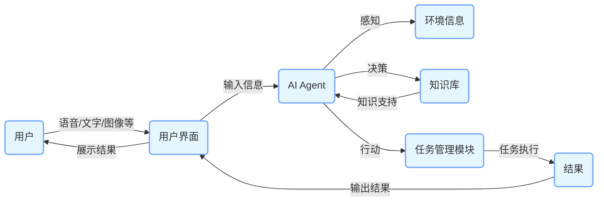

# 实现基于AI Agent的个人助理系统

> 关键词：AI Agent、个人助理系统、人工智能、自然语言处理、任务执行、多模态交互、智能决策

> 摘要：本文旨在深入探讨基于AI Agent的个人助理系统的实现。随着人工智能技术的飞速发展，个人助理系统的智能化程度不断提高，AI Agent作为核心技术，为个人助理系统带来了更强大的功能和更智能的交互体验。文章将从背景介绍入手，详细阐述AI Agent的核心概念与联系，深入剖析其核心算法原理及具体操作步骤，通过数学模型和公式进行理论支持，结合项目实战展示代码实现与解读，探讨实际应用场景，推荐相关工具和资源，最后总结未来发展趋势与挑战，并提供常见问题解答和扩展阅读参考资料，为开发者和研究者提供全面且深入的技术指导。

## 1. 背景介绍 
### 1.1 目的和范围
随着信息技术的不断进步，人们对于便捷、高效的个人助手需求日益增长。基于AI Agent的个人助理系统旨在利用人工智能技术，为用户提供智能、个性化的服务，帮助用户管理时间、处理任务、获取信息等。本文章的范围涵盖了从AI Agent的基本概念到个人助理系统的完整实现过程，包括算法原理、代码实现、应用场景等方面。

### 1.2 预期读者
本文预期读者包括人工智能领域的研究者、开发者、对智能个人助理系统感兴趣的技术爱好者，以及相关专业的学生。通过阅读本文，读者可以了解基于AI Agent的个人助理系统的技术原理和实现方法，掌握相关的编程技巧和开发经验。

### 1.3 文档结构概述
本文首先介绍基于AI Agent的个人助理系统的背景信息，包括目的、预期读者和文档结构。接着阐述AI Agent的核心概念与联系，通过文本示意图和Mermaid流程图展示其架构。然后详细讲解核心算法原理及具体操作步骤，使用Python源代码进行说明。之后介绍数学模型和公式，并举例说明。再通过项目实战展示代码实际案例和详细解释。接着探讨实际应用场景，推荐相关工具和资源。最后总结未来发展趋势与挑战，提供常见问题解答和扩展阅读参考资料。

### 1.4 术语表
#### 1.4.1 核心术语定义
- **AI Agent**：即人工智能智能体，是一个能够感知环境、进行决策并采取行动以实现特定目标的智能实体。
- **个人助理系统**：是一种利用人工智能技术，为用户提供个性化服务和帮助的软件系统。
- **自然语言处理（NLP）**：是人工智能的一个重要领域，旨在让计算机理解、处理和生成人类语言。
- **任务执行**：指个人助理系统根据用户的指令或需求，完成相应的任务。
- **多模态交互**：允许用户通过多种方式（如语音、文字、图像等）与个人助理系统进行交互。

#### 1.4.2 相关概念解释
- **智能决策**：AI Agent根据感知到的环境信息和自身的目标，运用一定的算法和策略做出最优决策的过程。
- **知识图谱**：一种用于表示实体之间关系的语义网络，可帮助个人助理系统更好地理解和处理知识。
- **强化学习**：一种机器学习方法，智能体通过与环境进行交互，根据环境反馈的奖励信号来学习最优策略。

#### 1.4.3 缩略词列表
- **NLP**：自然语言处理（Natural Language Processing）
- **API**：应用程序编程接口（Application Programming Interface）
- **ML**：机器学习（Machine Learning）
- **RL**：强化学习（Reinforcement Learning）

## 2. 核心概念与联系 

### 核心概念原理
AI Agent作为基于AI的个人助理系统的核心，其原理基于智能感知、决策和行动的循环过程。首先，AI Agent通过各种传感器（如麦克风、摄像头、键盘等）感知用户的输入和环境信息。然后，对这些信息进行处理和分析，利用自然语言处理、机器学习等技术理解用户的意图和需求。接着，根据用户的需求和自身的知识储备，AI Agent进行决策，选择合适的行动方案。最后，AI Agent执行决策结果，为用户提供相应的服务或执行相应的任务。

个人助理系统则是将AI Agent与用户界面、知识库、任务管理模块等相结合，形成一个完整的系统。用户界面负责与用户进行交互，接收用户的输入并展示系统的输出。知识库存储了各种知识和信息，为AI Agent的决策提供支持。任务管理模块负责管理用户的任务，包括任务的创建、分配、执行和监控等。

### 架构的文本示意图
```plaintext
用户界面
|
| 交互
v
AI Agent
|
| 感知、决策、行动
v
知识库
|
| 知识支持
v
任务管理模块
```

### Mermaid流程图


## 3. 核心算法原理 & 具体操作步骤 

### 核心算法原理
基于AI Agent的个人助理系统主要涉及以下几种核心算法：

#### 自然语言处理算法
自然语言处理算法用于理解用户的自然语言输入，包括词法分析、句法分析、语义分析等。常见的自然语言处理算法有基于规则的方法、统计机器学习方法和深度学习方法。例如，使用循环神经网络（RNN）及其变体（如LSTM、GRU）进行序列建模，以处理自然语言的上下文信息。

#### 机器学习算法
机器学习算法用于对用户的需求进行分类和预测，例如使用支持向量机（SVM）、决策树、随机森林等算法进行文本分类，以确定用户的意图。

#### 强化学习算法
强化学习算法用于智能决策，AI Agent通过与环境进行交互，根据环境反馈的奖励信号来学习最优策略。例如，使用Q-learning、深度Q网络（DQN）等算法进行决策优化。

### 具体操作步骤及Python源代码

#### 步骤1：自然语言处理
以下是一个使用Python的`nltk`库进行简单词法分析的示例代码：
```python
import nltk
from nltk.tokenize import word_tokenize
from nltk.corpus import stopwords
from nltk.stem import WordNetLemmatizer

# 下载必要的nltk数据
nltk.download('punkt')
nltk.download('stopwords')
nltk.download('wordnet')

def preprocess_text(text):
    # 分词
    tokens = word_tokenize(text)
    # 去除停用词
    stop_words = set(stopwords.words('english'))
    filtered_tokens = [token for token in tokens if token.lower() not in stop_words]
    # 词形还原
    lemmatizer = WordNetLemmatizer()
    lemmatized_tokens = [lemmatizer.lemmatize(token) for token in filtered_tokens]
    return lemmatized_tokens

# 示例文本
text = "I like playing football in the park."
processed_tokens = preprocess_text(text)
print(processed_tokens)
```

#### 步骤2：机器学习分类
以下是一个使用Python的`sklearn`库进行文本分类的示例代码：
```python
from sklearn.feature_extraction.text import TfidfVectorizer
from sklearn.svm import SVC
from sklearn.model_selection import train_test_split
from sklearn.metrics import accuracy_score

# 示例数据集
corpus = [
    "I want to book a hotel",
    "Show me some restaurants",
    "I need to buy a ticket",
    "Find me a good movie"
]
labels = ["hotel", "restaurant", "ticket", "movie"]

# 特征提取
vectorizer = TfidfVectorizer()
X = vectorizer.fit_transform(corpus)

# 划分训练集和测试集
X_train, X_test, y_train, y_test = train_test_split(X, labels, test_size=0.2, random_state=42)

# 训练模型
model = SVC()
model.fit(X_train, y_train)

# 预测
y_pred = model.predict(X_test)

# 评估模型
accuracy = accuracy_score(y_test, y_pred)
print(f"Accuracy: {accuracy}")
```

#### 步骤3：强化学习决策
以下是一个简单的Q-learning算法示例代码：
```python
import numpy as np

# 定义环境
states = 5
actions = 2
Q = np.zeros((states, actions))

# 定义参数
alpha = 0.1
gamma = 0.9
epsilon = 0.1
episodes = 100

# 定义奖励函数
rewards = np.array([
    [0, 1],
    [0, 0],
    [0, 0],
    [0, 0],
    [0, 0]
])

# Q-learning算法
for episode in range(episodes):
    state = 0
    done = False
    while not done:
        if np.random.uniform(0, 1) < epsilon:
            action = np.random.choice(actions)
        else:
            action = np.argmax(Q[state, :])
        
        next_state = state + 1 if action == 1 else state
        if next_state == states - 1:
            done = True
        
        reward = rewards[state, action]
        Q[state, action] = Q[state, action] + alpha * (reward + gamma * np.max(Q[next_state, :]) - Q[state, action])
        state = next_state

print(Q)
```

## 4. 数学模型和公式 & 详细讲解 & 举例说明 

### 自然语言处理中的数学模型和公式
#### TF-IDF模型
TF-IDF（Term Frequency-Inverse Document Frequency）是一种常用的文本特征提取方法，用于衡量一个词在文档中的重要性。其计算公式如下：

$$ TF(t,d) = \frac{f_{t,d}}{\max\{f_{w,d}: w \in d\}} $$

其中，$TF(t,d)$ 表示词 $t$ 在文档 $d$ 中的词频，$f_{t,d}$ 表示词 $t$ 在文档 $d$ 中出现的次数，$\max\{f_{w,d}: w \in d\}$ 表示文档 $d$ 中出现次数最多的词的词频。

$$ IDF(t,D) = \log\frac{|D|}{|\{d \in D: t \in d\}|} $$

其中，$IDF(t,D)$ 表示词 $t$ 在文档集合 $D$ 中的逆文档频率，$|D|$ 表示文档集合 $D$ 中的文档总数，$|\{d \in D: t \in d\}|$ 表示包含词 $t$ 的文档数。

$$ TF - IDF(t,d,D) = TF(t,d) \times IDF(t,D) $$

举例说明：假设有一个文档集合 $D$ 包含3个文档，分别为 $d_1$、$d_2$、$d_3$。词 $t$ 在 $d_1$ 中出现2次，$d_1$ 中总词数为10，$d_2$ 和 $d_3$ 中不包含词 $t$。则 $TF(t,d_1) = \frac{2}{10} = 0.2$，$IDF(t,D) = \log\frac{3}{1} \approx 1.0986$，$TF - IDF(t,d_1,D) = 0.2 \times 1.0986 \approx 0.2197$。

### 机器学习中的数学模型和公式
#### 支持向量机（SVM）
支持向量机的目标是找到一个最优的超平面，使得不同类别的样本能够被最大程度地分开。对于线性可分的情况，SVM的优化问题可以表示为：

$$ \min_{w,b} \frac{1}{2}||w||^2 $$

约束条件为：

$$ y_i(w^T x_i + b) \geq 1, i = 1,2,\cdots,n $$

其中，$w$ 是超平面的法向量，$b$ 是偏置，$x_i$ 是样本点，$y_i$ 是样本的标签（$y_i \in \{-1,1\}$），$n$ 是样本数量。

对于线性不可分的情况，可以引入松弛变量 $\xi_i$，优化问题变为：

$$ \min_{w,b,\xi} \frac{1}{2}||w||^2 + C\sum_{i=1}^{n}\xi_i $$

约束条件为：

$$ y_i(w^T x_i + b) \geq 1 - \xi_i, \xi_i \geq 0, i = 1,2,\cdots,n $$

其中，$C$ 是惩罚参数。

### 强化学习中的数学模型和公式
#### Q-learning算法
Q-learning算法的核心是更新Q值，其更新公式为：

$$ Q(s,a) \leftarrow Q(s,a) + \alpha[r + \gamma\max_{a'}Q(s',a') - Q(s,a)] $$

其中，$Q(s,a)$ 表示在状态 $s$ 下采取行动 $a$ 的Q值，$\alpha$ 是学习率，$r$ 是即时奖励，$\gamma$ 是折扣因子，$s'$ 是下一个状态，$\max_{a'}Q(s',a')$ 表示在下一个状态 $s'$ 下所有可能行动的最大Q值。

举例说明：假设在状态 $s_1$ 下采取行动 $a_1$，得到即时奖励 $r = 1$，下一个状态为 $s_2$，$Q(s_1,a_1) = 0.5$，$\max_{a'}Q(s_2,a') = 0.8$，$\alpha = 0.1$，$\gamma = 0.9$。则更新后的 $Q(s_1,a_1)$ 为：

$$ Q(s_1,a_1) = 0.5 + 0.1\times(1 + 0.9\times0.8 - 0.5) = 0.5 + 0.1\times(1 + 0.72 - 0.5) = 0.5 + 0.1\times1.22 = 0.622 $$

## 5. 项目实战：代码实际案例和详细解释说明 

### 5.1  开发环境搭建
#### 操作系统
可以选择Windows、Linux或macOS作为开发操作系统。

#### 编程语言
使用Python作为开发语言，推荐使用Python 3.7及以上版本。

#### 开发工具
- **IDE**：推荐使用PyCharm，它是一款功能强大的Python集成开发环境，提供代码编辑、调试、自动补全等功能。
- **文本编辑器**：也可以使用VS Code，它轻量级且支持丰富的插件扩展。

#### 依赖库安装
使用`pip`命令安装必要的依赖库，例如：
```sh
pip install nltk
pip install sklearn
pip install numpy
```

### 5.2  源代码详细实现和代码解读
以下是一个简单的基于AI Agent的个人助理系统的实现代码：
```python
import nltk
from nltk.tokenize import word_tokenize
from nltk.corpus import stopwords
from nltk.stem import WordNetLemmatizer
from sklearn.feature_extraction.text import TfidfVectorizer
from sklearn.svm import SVC
import numpy as np

# 下载必要的nltk数据
nltk.download('punkt')
nltk.download('stopwords')
nltk.download('wordnet')

# 自然语言预处理函数
def preprocess_text(text):
    tokens = word_tokenize(text)
    stop_words = set(stopwords.words('english'))
    filtered_tokens = [token for token in tokens if token.lower() not in stop_words]
    lemmatizer = WordNetLemmatizer()
    lemmatized_tokens = [lemmatizer.lemmatize(token) for token in filtered_tokens]
    return " ".join(lemmatized_tokens)

# 示例数据集
corpus = [
    "I want to book a hotel",
    "Show me some restaurants",
    "I need to buy a ticket",
    "Find me a good movie"
]
labels = ["hotel", "restaurant", "ticket", "movie"]

# 特征提取
vectorizer = TfidfVectorizer()
X = vectorizer.fit_transform([preprocess_text(text) for text in corpus])

# 训练模型
model = SVC()
model.fit(X, labels)

# 个人助理系统类
class PersonalAssistant:
    def __init__(self):
        self.vectorizer = vectorizer
        self.model = model

    def process_input(self, user_input):
        processed_input = preprocess_text(user_input)
        input_vector = self.vectorizer.transform([processed_input])
        intent = self.model.predict(input_vector)[0]
        return intent

# 主程序
if __name__ == "__main__":
    assistant = PersonalAssistant()
    while True:
        user_input = input("Please enter your request (or 'exit' to quit): ")
        if user_input.lower() == 'exit':
            break
        intent = assistant.process_input(user_input)
        print(f"Detected intent: {intent}")
```

### 5.3  代码解读与分析
- **自然语言预处理**：`preprocess_text`函数对用户输入的文本进行分词、去除停用词和词形还原处理，以提高文本处理的准确性。
- **特征提取**：使用`TfidfVectorizer`将文本转换为向量表示，便于机器学习模型处理。
- **模型训练**：使用支持向量机（SVM）对示例数据集进行训练，学习不同文本对应的意图标签。
- **个人助理系统类**：`PersonalAssistant`类封装了特征提取器和模型，提供`process_input`方法用于处理用户输入，预测用户的意图。
- **主程序**：在主程序中，创建`PersonalAssistant`对象，通过循环不断接收用户输入，调用`process_input`方法处理输入并输出预测的意图，直到用户输入`exit`退出程序。

## 6. 实际应用场景 
### 日常任务管理
基于AI Agent的个人助理系统可以帮助用户管理日常任务，如设置提醒、安排日程、管理待办事项等。用户可以通过语音或文字指令告诉个人助理系统需要完成的任务，系统会自动记录并在合适的时间提醒用户。

### 信息查询
个人助理系统可以作为用户的信息查询工具，帮助用户获取各种信息，如天气、新闻、股票行情等。用户只需提出查询请求，系统会通过网络接口获取相关信息并展示给用户。

### 智能客服
在企业客服场景中，基于AI Agent的个人助理系统可以作为智能客服，自动回答用户的常见问题，处理用户的咨询和投诉。系统可以通过自然语言处理技术理解用户的问题，根据知识库中的信息给出准确的回答。

### 智能家居控制
个人助理系统可以与智能家居设备集成，实现对智能家居设备的控制。用户可以通过语音指令控制灯光、空调、窗帘等设备的开关、调节亮度和温度等。

## 7. 工具和资源推荐
### 7.1 学习资源推荐
#### 7.1.1 书籍推荐
- 《Python自然语言处理》：介绍了Python在自然语言处理领域的应用，包括文本处理、词性标注、命名实体识别等内容。
- 《机器学习》：由周志华教授编写，系统地介绍了机器学习的基本概念、算法和应用。
- 《强化学习：原理与Python实现》：详细讲解了强化学习的理论和算法，并通过Python代码进行实现。

#### 7.1.2 在线课程
- Coursera上的“Natural Language Processing Specialization”：由斯坦福大学教授授课，全面介绍自然语言处理的相关知识和技术。
- edX上的“Artificial Intelligence”：提供了人工智能领域的基础知识和算法，包括机器学习、深度学习等内容。
- 网易云课堂上的“Python人工智能实战”：通过实际项目，讲解Python在人工智能领域的应用。

#### 7.1.3 技术博客和网站
- Medium：有很多关于人工智能、自然语言处理、强化学习等领域的技术文章和经验分享。
- 博客园：国内的技术博客平台，有很多开发者分享的人工智能相关的技术文章。
- 机器之心：专注于人工智能领域的资讯和技术报道，提供最新的研究成果和应用案例。

### 7.2 开发工具框架推荐
#### 7.2.1 IDE和编辑器
- PyCharm：功能强大的Python集成开发环境，提供代码编辑、调试、自动补全等功能。
- VS Code：轻量级的文本编辑器，支持丰富的插件扩展，适合Python开发。
- Jupyter Notebook：交互式的开发环境，适合进行数据分析和模型训练。

#### 7.2.2 调试和性能分析工具
- pdb：Python自带的调试器，可以帮助开发者调试代码。
- cProfile：Python的性能分析工具，可以分析代码的执行时间和函数调用情况。
- TensorBoard：用于可视化深度学习模型的训练过程和性能指标。

#### 7.2.3 相关框架和库
- NLTK：自然语言处理工具包，提供了丰富的文本处理功能和语料库。
- Scikit-learn：机器学习库，提供了各种机器学习算法和工具，如分类、回归、聚类等。
- PyTorch：深度学习框架，支持动态图和静态图，易于使用和扩展。
- OpenAI Gym：强化学习环境库，提供了各种模拟环境，用于训练和评估强化学习算法。

### 7.3 相关论文著作推荐
#### 7.3.1 经典论文
- “Attention Is All You Need”：提出了Transformer架构，在自然语言处理领域取得了巨大的成功。
- “Playing Atari with Deep Reinforcement Learning”：首次将深度强化学习应用于Atari游戏，开启了深度强化学习的新篇章。
- “A Neural Probabilistic Language Model”：提出了神经网络语言模型，为自然语言处理的发展奠定了基础。

#### 7.3.2 最新研究成果
- 关注顶级学术会议如NeurIPS、ICML、ACL等的最新论文，了解人工智能领域的最新研究动态和技术发展趋势。

#### 7.3.3 应用案例分析
- 参考一些实际应用案例的研究报告和论文，了解基于AI Agent的个人助理系统在不同领域的应用和实现方法。

## 8. 总结：未来发展趋势与挑战
### 未来发展趋势
- **多模态交互**：未来的个人助理系统将支持更多的交互方式，如语音、手势、表情等，实现更加自然和便捷的交互体验。
- **个性化服务**：通过对用户的行为和偏好进行分析，个人助理系统将提供更加个性化的服务，满足用户的特定需求。
- **跨领域融合**：个人助理系统将与更多的领域进行融合，如医疗、教育、金融等，为用户提供更加全面和专业的服务。
- **智能决策能力提升**：随着强化学习和深度学习技术的不断发展，个人助理系统的智能决策能力将不断提升，能够在复杂的环境中做出更加准确和合理的决策。

### 挑战
- **数据隐私和安全**：个人助理系统需要处理大量的用户数据，如何保障数据的隐私和安全是一个重要的挑战。
- **自然语言理解的准确性**：尽管自然语言处理技术取得了很大的进步，但在理解复杂的自然语言和上下文信息方面仍然存在一定的困难。
- **智能决策的可解释性**：深度学习和强化学习模型往往是黑盒模型，其决策过程难以解释，如何提高智能决策的可解释性是一个亟待解决的问题。
- **计算资源的需求**：训练和运行复杂的人工智能模型需要大量的计算资源，如何降低计算成本和提高计算效率是一个挑战。

## 9. 附录：常见问题与解答
### 问题1：如何提高个人助理系统的自然语言理解能力？
答：可以通过以下几种方法提高自然语言理解能力：1. 使用更大规模的数据集进行训练；2. 采用更先进的自然语言处理算法和模型，如Transformer架构；3. 结合知识图谱等技术，增强对语义信息的理解；4. 进行多轮对话和上下文处理，提高对上下文信息的利用。

### 问题2：个人助理系统如何处理不同语言的输入？
答：可以使用多语言的自然语言处理模型，如Multilingual BERT等，这些模型可以处理多种语言的文本。同时，需要对不同语言的文本进行相应的预处理和特征提取，以适应模型的输入要求。

### 问题3：如何保障个人助理系统的数据隐私和安全？
答：可以采取以下措施保障数据隐私和安全：1. 对用户数据进行加密处理，防止数据泄露；2. 采用安全的存储和传输协议，确保数据在存储和传输过程中的安全性；3. 遵循相关的法律法规和隐私政策，保护用户的合法权益；4. 对系统进行安全审计和漏洞修复，及时发现和解决安全问题。

### 问题4：个人助理系统的智能决策能力如何评估？
答：可以通过以下几种指标评估智能决策能力：1. 准确率：决策结果与实际最优结果的符合程度；2. 召回率：能够正确做出决策的比例；3. 效率：决策的速度和资源消耗；4. 可解释性：决策过程是否能够被理解和解释。

## 10. 扩展阅读 & 参考资料
- 《人工智能：一种现代的方法》
- 《深度学习》
- 相关的学术期刊和会议论文，如Journal of Artificial Intelligence Research、Proceedings of the Annual Meeting of the Association for Computational Linguistics等
- 相关的开源项目和代码库，如GitHub上的自然语言处理和人工智能相关项目

作者：AI天才研究院/AI Genius Institute & 禅与计算机程序设计艺术 /Zen And The Art of Computer Programming