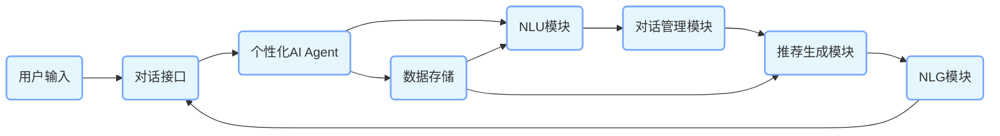

# 对话式推荐：个性化AI Agent的建议

> 关键词：对话式推荐、个性化AI Agent、推荐算法、用户交互、自然语言处理

> 摘要：本文围绕对话式推荐这一主题，深入探讨了个性化AI Agent在其中的应用和作用。首先介绍了对话式推荐的背景，包括其目的、预期读者和文档结构等信息。接着详细阐述了核心概念，通过文本示意图和Mermaid流程图展示其原理和架构。在核心算法原理部分，使用Python代码进行了详细讲解。还给出了相关的数学模型和公式，并举例说明。通过项目实战，展示了代码的实际案例和详细解释。分析了对话式推荐的实际应用场景，推荐了相关的学习资源、开发工具框架以及论文著作。最后总结了未来发展趋势与挑战，解答了常见问题，并提供了扩展阅读和参考资料，旨在为读者全面呈现对话式推荐及个性化AI Agent的相关知识。

## 1. 背景介绍 
### 1.1 目的和范围
随着互联网技术的飞速发展，信息呈现爆炸式增长，用户在海量信息中寻找自己真正需要的内容变得越来越困难。传统的推荐系统虽然在一定程度上能够为用户提供推荐信息，但往往缺乏与用户的深度交互，难以满足用户复杂多变的个性化需求。对话式推荐系统应运而生，它结合了自然语言处理和推荐算法，通过与用户进行对话的方式，更精准地理解用户的意图，为用户提供更加个性化、精准的推荐。

本文的范围主要涵盖对话式推荐系统的核心概念、算法原理、数学模型、项目实战、实际应用场景等方面，旨在为读者提供一个全面、深入的了解，帮助读者掌握对话式推荐系统的设计和实现方法。

### 1.2 预期读者
本文预期读者包括对人工智能、推荐系统、自然语言处理等领域感兴趣的技术爱好者，从事相关领域研究和开发的专业人员，以及希望了解如何利用对话式推荐系统提升业务效果的企业管理人员。

### 1.3 文档结构概述
本文将按照以下结构进行组织：
1. **背景介绍**：介绍对话式推荐的目的、范围、预期读者和文档结构，以及相关术语的定义和解释。
2. **核心概念与联系**：详细阐述对话式推荐和个性化AI Agent的核心概念，通过文本示意图和Mermaid流程图展示其原理和架构。
3. **核心算法原理 & 具体操作步骤**：使用Python代码详细讲解对话式推荐的核心算法原理和具体操作步骤。
4. **数学模型和公式 & 详细讲解 & 举例说明**：给出对话式推荐的数学模型和公式，并进行详细讲解和举例说明。
5. **项目实战：代码实际案例和详细解释说明**：通过一个实际的项目案例，展示对话式推荐系统的开发过程，包括开发环境搭建、源代码实现和代码解读。
6. **实际应用场景**：分析对话式推荐系统在不同领域的实际应用场景。
7. **工具和资源推荐**：推荐相关的学习资源、开发工具框架和论文著作。
8. **总结：未来发展趋势与挑战**：总结对话式推荐系统的未来发展趋势和面临的挑战。
9. **附录：常见问题与解答**：解答读者在学习和使用对话式推荐系统过程中常见的问题。
10. **扩展阅读 & 参考资料**：提供相关的扩展阅读材料和参考资料。

### 1.4 术语表
#### 1.4.1 核心术语定义
- **对话式推荐**：一种通过与用户进行自然语言对话，理解用户意图，为用户提供个性化推荐的系统。
- **个性化AI Agent**：具备智能对话能力，能够根据用户的个性化需求和偏好，为用户提供定制化建议的人工智能代理。
- **推荐算法**：用于根据用户的历史行为、偏好等信息，预测用户可能感兴趣的物品或内容的算法。
- **自然语言处理（NLP）**：研究如何让计算机理解和处理人类自然语言的技术。

#### 1.4.2 相关概念解释
- **用户画像**：对用户的基本信息、兴趣爱好、行为习惯等进行建模和描述，以便更好地了解用户需求。
- **上下文感知**：在对话过程中，考虑对话的上下文信息，更好地理解用户的意图。
- **多轮对话**：用户与系统之间进行多次交互，逐步明确用户需求的对话方式。

#### 1.4.3 缩略词列表
- **NLP**：Natural Language Processing（自然语言处理）
- **AI**：Artificial Intelligence（人工智能）
- **ML**：Machine Learning（机器学习）
- **DL**：Deep Learning（深度学习）

## 2. 核心概念与联系 

### 核心概念原理
对话式推荐系统的核心原理是通过与用户进行自然语言对话，收集用户的信息和需求，利用推荐算法为用户提供个性化的推荐。个性化AI Agent作为对话式推荐系统的核心组件，负责与用户进行交互，理解用户的意图，并根据用户的需求和偏好提供相应的建议。

在对话过程中，个性化AI Agent需要具备以下能力：
1. **自然语言理解（NLU）**：能够理解用户输入的自然语言文本，提取关键信息，分析用户的意图。
2. **对话管理**：能够管理对话的流程，根据用户的回复和上下文信息，决定下一步的对话策略。
3. **推荐生成**：根据用户的需求和偏好，利用推荐算法生成个性化的推荐列表。
4. **自然语言生成（NLG）**：将推荐结果以自然语言的形式呈现给用户。

### 架构的文本示意图
```plaintext
用户 <-> 对话接口 <-> 个性化AI Agent
                      |
                      |-> 自然语言理解模块
                      |-> 对话管理模块
                      |-> 推荐生成模块
                      |-> 自然语言生成模块
                      |
                      |-> 数据存储（用户画像、历史对话记录、物品信息等）
```

### Mermaid流程图


## 3. 核心算法原理 & 具体操作步骤 

### 核心算法原理
对话式推荐系统中常用的推荐算法包括基于内容的推荐算法、协同过滤算法和深度学习推荐算法等。下面以基于内容的推荐算法为例，介绍其核心原理。

基于内容的推荐算法的基本思想是根据物品的特征和用户的偏好，为用户推荐与用户偏好相似的物品。具体步骤如下：
1. **物品特征提取**：对物品的文本描述、标签等信息进行特征提取，将物品表示为向量形式。
2. **用户偏好建模**：根据用户的历史行为（如浏览记录、购买记录等），提取用户的偏好特征，将用户表示为向量形式。
3. **相似度计算**：计算物品向量和用户向量之间的相似度，选择相似度较高的物品作为推荐结果。

### 具体操作步骤及Python代码实现
```python
import numpy as np
from sklearn.feature_extraction.text import TfidfVectorizer
from sklearn.metrics.pairwise import cosine_similarity

# 物品特征提取
def extract_item_features(items):
    vectorizer = TfidfVectorizer()
    item_vectors = vectorizer.fit_transform(items)
    return item_vectors

# 用户偏好建模
def build_user_preference(user_history, item_vectors):
    user_vector = np.zeros(item_vectors.shape[1])
    for history in user_history:
        user_vector += item_vectors[history].toarray().flatten()
    user_vector /= len(user_history)
    return user_vector

# 相似度计算
def calculate_similarity(user_vector, item_vectors):
    similarities = cosine_similarity([user_vector], item_vectors)
    return similarities.flatten()

# 推荐生成
def generate_recommendations(similarities, top_k):
    top_indices = np.argsort(similarities)[::-1][:top_k]
    return top_indices

# 示例数据
items = [
    "苹果手机，性能强大，拍照清晰",
    "华为手机，信号好，续航长",
    "小米手机，性价比高，功能丰富",
    "三星手机，屏幕出色，外观时尚"
]
user_history = [0, 1]

# 提取物品特征
item_vectors = extract_item_features(items)

# 构建用户偏好
user_vector = build_user_preference(user_history, item_vectors)

# 计算相似度
similarities = calculate_similarity(user_vector, item_vectors)

# 生成推荐
top_k = 2
recommendations = generate_recommendations(similarities, top_k)

print("推荐的物品索引：", recommendations)
print("推荐的物品：", [items[i] for i in recommendations])
```

### 代码解释
1. **extract_item_features**：使用`TfidfVectorizer`对物品的文本描述进行特征提取，将物品表示为TF-IDF向量。
2. **build_user_preference**：根据用户的历史行为，将用户历史行为对应的物品向量进行平均，得到用户的偏好向量。
3. **calculate_similarity**：使用`cosine_similarity`计算用户向量和物品向量之间的余弦相似度。
4. **generate_recommendations**：根据相似度排序，选择相似度较高的前`top_k`个物品作为推荐结果。

## 4. 数学模型和公式 & 详细讲解 & 举例说明 

### 数学模型和公式
#### TF-IDF公式
TF-IDF（Term Frequency-Inverse Document Frequency）是一种常用的文本特征提取方法，用于衡量一个词在文档中的重要性。其计算公式如下：

$$TF-IDF(t, d) = TF(t, d) \times IDF(t)$$

其中，$TF(t, d)$ 表示词 $t$ 在文档 $d$ 中出现的频率，$IDF(t)$ 表示词 $t$ 的逆文档频率，计算公式为：

$$IDF(t) = \log\frac{N}{DF(t) + 1}$$

其中，$N$ 表示文档总数，$DF(t)$ 表示包含词 $t$ 的文档数。

#### 余弦相似度公式
余弦相似度用于衡量两个向量之间的相似度，其计算公式如下：

$$\cos(\vec{u}, \vec{v}) = \frac{\vec{u} \cdot \vec{v}}{\|\vec{u}\| \|\vec{v}\|}$$

其中，$\vec{u}$ 和 $\vec{v}$ 分别表示两个向量，$\vec{u} \cdot \vec{v}$ 表示两个向量的点积，$\|\vec{u}\|$ 和 $\|\vec{v}\|$ 分别表示两个向量的模。

### 详细讲解
#### TF-IDF
TF-IDF的核心思想是，如果一个词在某个文档中出现的频率较高，而在其他文档中出现的频率较低，那么这个词对该文档的重要性就较高。通过TF-IDF，可以将文本数据转换为数值向量，方便进行后续的计算和分析。

#### 余弦相似度
余弦相似度通过计算两个向量之间的夹角余弦值来衡量它们的相似度。余弦值越接近1，表示两个向量越相似；余弦值越接近-1，表示两个向量越不相似。在推荐系统中，余弦相似度常用于计算用户向量和物品向量之间的相似度，以确定推荐的物品。

### 举例说明
假设我们有以下三个文档：
- $d_1$: "苹果 手机 性能 强大"
- $d_2$: "华为 手机 信号 好"
- $d_3$: "小米 手机 性价比 高"

计算词 "手机" 的TF-IDF值：
- 文档总数 $N = 3$
- 包含词 "手机" 的文档数 $DF("手机") = 3$
- 词 "手机" 在文档 $d_1$ 中的频率 $TF("手机", d_1) = \frac{1}{4}$
- 词 "手机" 的逆文档频率 $IDF("手机") = \log\frac{3}{3 + 1} \approx -0.288$
- 词 "手机" 在文档 $d_1$ 中的TF-IDF值 $TF-IDF("手机", d_1) = \frac{1}{4} \times (-0.288) \approx -0.072$

假设用户向量 $\vec{u} = [0.1, 0.2, 0.3]$，物品向量 $\vec{v} = [0.2, 0.3, 0.4]$，计算它们的余弦相似度：
- $\vec{u} \cdot \vec{v} = 0.1 \times 0.2 + 0.2 \times 0.3 + 0.3 \times 0.4 = 0.2$
- $\|\vec{u}\| = \sqrt{0.1^2 + 0.2^2 + 0.3^2} \approx 0.374$
- $\|\vec{v}\| = \sqrt{0.2^2 + 0.3^2 + 0.4^2} \approx 0.539$
- $\cos(\vec{u}, \vec{v}) = \frac{0.2}{0.374 \times 0.539} \approx 0.99$

## 5. 项目实战：代码实际案例和详细解释说明 

### 5.1  开发环境搭建
#### 安装Python
首先，确保你已经安装了Python 3.x版本。可以从Python官方网站（https://www.python.org/downloads/）下载并安装。

#### 安装必要的库
使用以下命令安装项目所需的库：
```sh
pip install numpy scikit-learn
```

### 5.2  源代码详细实现和代码解读
以下是一个完整的对话式推荐系统的示例代码：
```python
import numpy as np
from sklearn.feature_extraction.text import TfidfVectorizer
from sklearn.metrics.pairwise import cosine_similarity

# 物品特征提取
def extract_item_features(items):
    vectorizer = TfidfVectorizer()
    item_vectors = vectorizer.fit_transform(items)
    return item_vectors, vectorizer

# 用户偏好建模
def build_user_preference(user_history, item_vectors):
    user_vector = np.zeros(item_vectors.shape[1])
    for history in user_history:
        user_vector += item_vectors[history].toarray().flatten()
    user_vector /= len(user_history)
    return user_vector

# 相似度计算
def calculate_similarity(user_vector, item_vectors):
    similarities = cosine_similarity([user_vector], item_vectors)
    return similarities.flatten()

# 推荐生成
def generate_recommendations(similarities, top_k):
    top_indices = np.argsort(similarities)[::-1][:top_k]
    return top_indices

# 对话式推荐系统
def conversational_recommendation_system(items):
    item_vectors, vectorizer = extract_item_features(items)
    user_history = []
    while True:
        user_input = input("请输入你感兴趣的物品描述（输入 '结束' 退出）：")
        if user_input == "结束":
            break
        new_item_vector = vectorizer.transform([user_input])
        item_vectors = np.vstack((item_vectors.toarray(), new_item_vector.toarray()))
        user_history.append(len(item_vectors) - 1)
        user_vector = build_user_preference(user_history, item_vectors)
        similarities = calculate_similarity(user_vector, item_vectors)
        top_k = 2
        recommendations = generate_recommendations(similarities, top_k)
        print("推荐的物品索引：", recommendations)
        print("推荐的物品：", [items[i] if i < len(items) else user_input for i in recommendations])

# 示例数据
items = [
    "苹果手机，性能强大，拍照清晰",
    "华为手机，信号好，续航长",
    "小米手机，性价比高，功能丰富",
    "三星手机，屏幕出色，外观时尚"
]

conversational_recommendation_system(items)
```

### 5.3  代码解读与分析
1. **extract_item_features**：使用`TfidfVectorizer`对物品的文本描述进行特征提取，返回物品向量和向量化器。
2. **build_user_preference**：根据用户的历史行为，将用户历史行为对应的物品向量进行平均，得到用户的偏好向量。
3. **calculate_similarity**：使用`cosine_similarity`计算用户向量和物品向量之间的余弦相似度。
4. **generate_recommendations**：根据相似度排序，选择相似度较高的前`top_k`个物品作为推荐结果。
5. **conversational_recommendation_system**：实现了一个简单的对话式推荐系统，用户可以输入感兴趣的物品描述，系统会根据用户的输入更新用户偏好，并生成推荐结果。

## 6. 实际应用场景 
### 电商领域
在电商平台中，对话式推荐系统可以通过与用户的对话，了解用户的需求和偏好，为用户推荐符合其需求的商品。例如，用户可以与AI Agent进行对话，描述自己想要购买的商品的特征，如品牌、价格、功能等，AI Agent根据用户的描述为用户推荐合适的商品。

### 娱乐领域
在音乐、电影、游戏等娱乐领域，对话式推荐系统可以根据用户的喜好和历史行为，为用户推荐符合其口味的音乐、电影、游戏等内容。例如，用户可以与AI Agent交流自己喜欢的音乐风格、演员、游戏类型等信息，AI Agent为用户推荐相关的娱乐内容。

### 旅游领域
在旅游领域，对话式推荐系统可以帮助用户规划旅游行程，推荐旅游景点、酒店、餐厅等。用户可以与AI Agent沟通自己的旅游目的地、预算、旅游时间等信息，AI Agent根据用户的需求为用户提供个性化的旅游建议。

### 金融领域
在金融领域，对话式推荐系统可以为用户提供投资建议、理财产品推荐等服务。用户可以与AI Agent交流自己的投资目标、风险承受能力等信息，AI Agent根据用户的情况为用户推荐合适的投资产品和策略。

## 7. 工具和资源推荐
### 7.1 学习资源推荐
#### 7.1.1 书籍推荐
- 《Python自然语言处理实战》：本书介绍了使用Python进行自然语言处理的基本方法和技术，包括文本预处理、词法分析、句法分析、语义分析等内容。
- 《推荐系统实践》：本书详细介绍了推荐系统的基本原理、算法和应用，通过实际案例展示了如何构建一个完整的推荐系统。
- 《深度学习》：本书是深度学习领域的经典教材，介绍了深度学习的基本概念、模型和算法，对理解深度学习在对话式推荐系统中的应用有很大帮助。

#### 7.1.2 在线课程
- Coursera上的“Natural Language Processing Specialization”：该课程由斯坦福大学的教授授课，介绍了自然语言处理的基本概念、算法和应用。
- edX上的“Recommender Systems”：该课程由哥伦比亚大学的教授授课，详细介绍了推荐系统的原理、算法和实践。
- 网易云课堂上的“Python人工智能实战教程”：该课程结合实际案例，介绍了Python在人工智能领域的应用，包括自然语言处理和推荐系统。

#### 7.1.3 技术博客和网站
- Medium：Medium上有很多关于人工智能、自然语言处理和推荐系统的技术博客，作者们分享了自己的研究成果和实践经验。
- Towards Data Science：该网站专注于数据科学和人工智能领域的技术文章，提供了很多有价值的学习资源。
- arXiv：arXiv是一个预印本服务器，上面有很多关于人工智能、机器学习和自然语言处理的最新研究论文。

### 7.2 开发工具框架推荐
#### 7.2.1 IDE和编辑器
- PyCharm：PyCharm是一款专门为Python开发设计的集成开发环境（IDE），提供了丰富的功能和工具，方便开发人员进行代码编写、调试和测试。
- Jupyter Notebook：Jupyter Notebook是一个交互式的开发环境，支持多种编程语言，特别适合进行数据分析和机器学习实验。
- Visual Studio Code：Visual Studio Code是一款轻量级的代码编辑器，支持多种编程语言和插件，具有丰富的扩展功能。

#### 7.2.2 调试和性能分析工具
- PDB：PDB是Python自带的调试工具，可以帮助开发人员在代码中设置断点、单步执行代码、查看变量值等。
- cProfile：cProfile是Python的性能分析工具，可以分析代码的执行时间和函数调用情况，帮助开发人员找出代码中的性能瓶颈。
- TensorBoard：TensorBoard是TensorFlow的可视化工具，可以帮助开发人员可视化模型的训练过程、参数分布等信息。

#### 7.2.3 相关框架和库
- NLTK：NLTK是Python的自然语言处理工具包，提供了丰富的文本处理功能，包括词法分析、句法分析、语义分析等。
- Scikit-learn：Scikit-learn是Python的机器学习工具包，提供了多种机器学习算法和工具，方便开发人员进行数据挖掘和机器学习任务。
- PyTorch：PyTorch是一个开源的深度学习框架，具有动态图机制，方便开发人员进行模型的构建和训练。

### 7.3 相关论文著作推荐
#### 7.3.1 经典论文
- "Item-Based Collaborative Filtering Recommendation Algorithms"：该论文介绍了基于物品的协同过滤推荐算法，是推荐系统领域的经典论文之一。
- "Efficient Estimation of Word Representations in Vector Space"：该论文提出了Word2Vec模型，用于将词语表示为向量形式，在自然语言处理领域有广泛的应用。
- "Attention Is All You Need"：该论文提出了Transformer模型，是自然语言处理领域的重大突破，在机器翻译、文本生成等任务中取得了很好的效果。

#### 7.3.2 最新研究成果
- "Conversational Recommender Systems: A Survey"：该论文对对话式推荐系统的研究现状进行了全面的综述，介绍了对话式推荐系统的基本概念、算法和应用。
- "Personalized Conversational Recommender Systems with Deep Reinforcement Learning"：该论文提出了一种基于深度强化学习的个性化对话式推荐系统，通过强化学习优化推荐策略，提高推荐的准确性和用户满意度。

#### 7.3.3 应用案例分析
- "Applying Conversational Recommender Systems in E-commerce: A Case Study"：该论文介绍了对话式推荐系统在电商领域的应用案例，分析了对话式推荐系统在提高用户转化率和购买意愿方面的效果。
- "Conversational Recommender Systems for Music Streaming Services"：该论文研究了对话式推荐系统在音乐流媒体服务中的应用，通过与用户的对话推荐符合用户口味的音乐。

## 8. 总结：未来发展趋势与挑战
### 未来发展趋势
#### 多模态融合
未来的对话式推荐系统将不仅仅局限于文本对话，还将融合语音、图像、视频等多种模态信息，提供更加丰富、直观的交互体验。例如，用户可以通过语音描述自己的需求，系统可以通过图像识别技术展示相关的物品图片，提高推荐的准确性和用户满意度。

#### 强化学习和元学习的应用
强化学习和元学习可以帮助对话式推荐系统更好地适应不同用户的需求和环境变化，提高推荐的灵活性和适应性。通过强化学习，系统可以根据用户的反馈不断优化推荐策略；通过元学习，系统可以快速学习新的任务和领域，提高推荐的效率和效果。

#### 与其他技术的集成
对话式推荐系统将与物联网、区块链、云计算等技术进行深度集成，拓展其应用场景和功能。例如，与物联网技术结合，系统可以获取用户的实时环境信息和设备使用情况，为用户提供更加个性化的推荐；与区块链技术结合，系统可以保证用户数据的安全性和隐私性。

### 面临的挑战
#### 自然语言理解的准确性
自然语言具有多样性和歧义性，如何准确理解用户的意图是对话式推荐系统面临的主要挑战之一。虽然现有的自然语言处理技术取得了很大的进展，但在处理复杂的语义和语境信息时仍然存在一定的困难。

#### 数据隐私和安全
对话式推荐系统需要收集和处理大量的用户数据，如何保证用户数据的隐私和安全是一个重要的问题。在数据收集、存储和使用过程中，需要采取有效的措施保护用户数据不被泄露和滥用。

#### 可解释性和透明度
对话式推荐系统的推荐结果往往是基于复杂的算法和模型生成的，用户很难理解推荐的依据和原理。如何提高推荐系统的可解释性和透明度，让用户更好地理解和信任推荐结果，是未来需要解决的问题之一。

## 9. 附录：常见问题与解答
### 问题1：对话式推荐系统和传统推荐系统有什么区别？
答：传统推荐系统主要基于用户的历史行为数据进行推荐，缺乏与用户的交互，难以满足用户复杂多变的个性化需求。对话式推荐系统通过与用户进行自然语言对话，能够更深入地了解用户的意图和需求，为用户提供更加个性化、精准的推荐。

### 问题2：如何提高对话式推荐系统的自然语言理解能力？
答：可以通过以下方法提高对话式推荐系统的自然语言理解能力：
1. 使用更先进的自然语言处理技术，如深度学习模型（如Transformer）。
2. 增加训练数据的规模和多样性，提高模型的泛化能力。
3. 引入上下文信息和知识图谱，更好地理解用户的意图。

### 问题3：对话式推荐系统在实际应用中会遇到哪些问题？
答：对话式推荐系统在实际应用中可能会遇到以下问题：
1. 自然语言理解不准确，导致误解用户的意图。
2. 对话流程管理不当，导致对话不流畅或无法满足用户的需求。
3. 推荐结果不准确，无法满足用户的个性化需求。
4. 数据隐私和安全问题，如用户数据泄露等。

### 问题4：如何评估对话式推荐系统的性能？
答：可以从以下几个方面评估对话式推荐系统的性能：
1. 推荐准确性：通过计算推荐结果与用户实际兴趣的匹配程度来评估。
2. 用户满意度：通过用户反馈、问卷调查等方式收集用户对推荐结果的满意度。
3. 对话流畅性：评估对话过程是否自然、流畅，是否能够有效地引导用户表达需求。
4. 系统效率：评估系统的响应时间、处理能力等指标。

## 10. 扩展阅读 & 参考资料
### 扩展阅读
- 《人工智能：现代方法》：本书是人工智能领域的经典教材，全面介绍了人工智能的基本概念、算法和应用。
- 《自然语言处理入门》：本书适合初学者阅读，介绍了自然语言处理的基本方法和技术，通过实际案例展示了如何使用Python进行自然语言处理。
- 《深度学习实战》：本书结合实际案例，介绍了深度学习在图像识别、语音识别、自然语言处理等领域的应用。

### 参考资料
- [Natural Language Toolkit (NLTK)](https://www.nltk.org/)
- [Scikit-learn: Machine Learning in Python](https://scikit-learn.org/stable/)
- [PyTorch: An open source machine learning framework](https://pytorch.org/)

作者：AI天才研究院/AI Genius Institute & 禅与计算机程序设计艺术 /Zen And The Art of Computer Programming