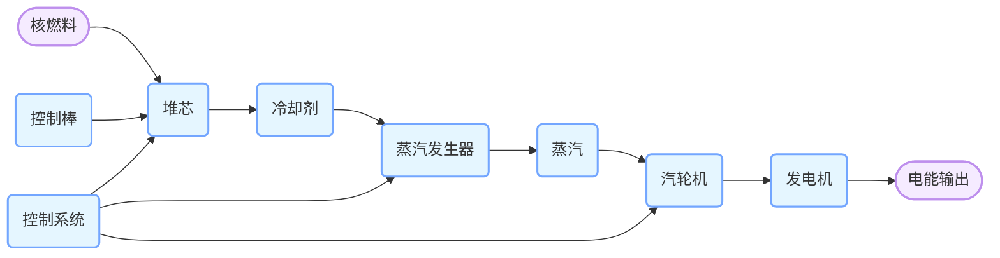

# 小型核反应堆技术的发展与能源投资策略

> 关键词：小型核反应堆技术、能源投资策略、核能发展、技术原理、应用场景

> 摘要：本文围绕小型核反应堆技术的发展以及与之相关的能源投资策略展开深入探讨。首先介绍了小型核反应堆技术的背景，包括其目的、预期读者、文档结构和相关术语。接着详细阐述了小型核反应堆的核心概念、算法原理、数学模型。通过项目实战，展示了相关代码实现和解读。分析了小型核反应堆的实际应用场景，推荐了学习资源、开发工具和相关论文著作。最后总结了小型核反应堆技术的未来发展趋势与挑战，并提供常见问题解答和扩展阅读参考资料，旨在为能源领域投资者和技术研究者提供全面的参考。

## 1. 背景介绍 
### 1.1 目的和范围
小型核反应堆技术作为核能领域的新兴方向，具有广阔的发展前景。本文章的目的在于全面剖析小型核反应堆技术的原理、发展现状以及与之匹配的能源投资策略。范围涵盖小型核反应堆的技术原理、数学模型、实际应用场景，以及在能源投资领域的风险评估、收益预测等方面。通过对这些内容的深入研究，为投资者和相关从业者提供决策依据。

### 1.2 预期读者
本文预期读者包括能源领域的投资者，他们希望了解小型核反应堆技术的投资价值和潜在风险；核能技术研究者，期望获取小型核反应堆技术的最新进展和研究方向；政策制定者，需要根据技术发展情况制定合理的能源政策；以及对核能感兴趣的普通读者，旨在增加对小型核反应堆技术的认识和理解。

### 1.3 文档结构概述
本文共分为十个部分。第一部分为背景介绍，阐述文章的目的、预期读者、文档结构和术语表。第二部分介绍小型核反应堆的核心概念与联系，包括原理和架构的文本示意图及 Mermaid 流程图。第三部分讲解核心算法原理和具体操作步骤，使用 Python 源代码进行详细阐述。第四部分给出数学模型和公式，并进行详细讲解和举例说明。第五部分是项目实战，包括开发环境搭建、源代码详细实现和代码解读。第六部分分析小型核反应堆的实际应用场景。第七部分推荐学习资源、开发工具和相关论文著作。第八部分总结未来发展趋势与挑战。第九部分为附录，提供常见问题与解答。第十部分给出扩展阅读和参考资料。

### 1.4 术语表
#### 1.4.1 核心术语定义
- **小型核反应堆（Small Modular Reactor, SMR）**：是一种功率相对较小、模块化设计的核反应堆，通常热功率小于 300 兆瓦，具有可在工厂预制、运输方便、建设周期短等特点。
- **核裂变**：是指重原子核（如铀 - 235、钚 - 239 等）在吸收一个中子后分裂成两个或多个质量较小的原子核，并释放出大量能量和中子的过程。
- **堆芯**：是核反应堆的核心部分，包含核燃料、慢化剂、冷却剂等，是核裂变反应发生的场所。
- **增殖比**：指在核反应堆中，新生易裂变核素的产生率与消耗率之比，反映了反应堆生产核燃料的能力。

#### 1.4.2 相关概念解释
- **模块化设计**：将核反应堆的各个部件设计成标准模块，在工厂中进行预制生产，然后运输到现场进行组装。这种设计方式可以提高生产效率、降低成本、保证质量。
- **固有安全性**：是指核反应堆依靠自身的物理特性，在不依赖外部系统干预的情况下，能够自动防止事故发生或减轻事故后果的特性。例如，一些小型核反应堆采用自然循环冷却方式，当反应堆功率升高时，冷却剂的热膨胀会自动减少流量，从而降低功率，保证安全。

#### 1.4.3 缩略词列表
- **SMR**：Small Modular Reactor，小型核反应堆
- **IAEA**：International Atomic Energy Agency，国际原子能机构
- **NRC**：Nuclear Regulatory Commission，美国核管理委员会

## 2. 核心概念与联系 
### 核心概念原理
小型核反应堆的核心原理基于核裂变反应。以铀 - 235 为例，当一个铀 - 235 原子核吸收一个中子后，会发生裂变反应，生成两个或多个质量较小的原子核，同时释放出 2 - 3 个中子和大量能量。这些释放出的中子又可以继续引发其他铀 - 235 原子核的裂变，形成链式反应。

为了控制链式反应的速率，需要使用控制棒。控制棒通常由能够吸收中子的材料（如硼、镉等）制成，通过插入或抽出控制棒，可以调节堆芯内中子的数量，从而控制反应的强度。

冷却剂也是小型核反应堆的重要组成部分，它的作用是将核裂变产生的热量带出堆芯，传递给蒸汽发生器，产生蒸汽驱动汽轮机发电。常见的冷却剂有轻水（普通水）、重水、液态金属（如钠、铅等）和气体（如氦气）等。

### 架构的文本示意图
小型核反应堆主要由堆芯、蒸汽发生器、汽轮机、发电机、冷却系统和控制系统等部分组成。其架构示意图如下：

堆芯是核裂变反应的核心区域，核燃料在堆芯中发生裂变反应释放出热量。冷却剂在堆芯中吸收热量后，将热量传递给蒸汽发生器。在蒸汽发生器中，冷却剂的热量使水变成蒸汽，蒸汽驱动汽轮机旋转，汽轮机带动发电机发电。控制系统负责监测和调节反应堆的运行参数，确保反应堆的安全稳定运行。

### Mermaid 流程图


该流程图展示了小型核反应堆的工作流程。核燃料在堆芯中发生裂变反应，冷却剂将堆芯产生的热量传递给蒸汽发生器，产生蒸汽驱动汽轮机和发电机发电。控制棒和控制系统对反应堆的运行进行监测和调节。

## 3. 核心算法原理 & 具体操作步骤 
### 核心算法原理
在小型核反应堆的设计和运行中，需要对核裂变反应的速率、堆芯温度、冷却剂流量等参数进行精确计算和控制。下面以点堆动力学方程为例，介绍核心算法原理。

点堆动力学方程是描述核反应堆内中子密度随时间变化的基本方程，其形式如下：

$\frac{dN(t)}{dt}=\frac{\rho(t)-\beta}{\Lambda}N(t)+\sum_{i=1}^{6}\lambda_{i}C_{i}(t)$

$\frac{dC_{i}(t)}{dt}=\frac{\beta_{i}}{\Lambda}N(t)-\lambda_{i}C_{i}(t)$

其中，$N(t)$ 是中子密度，$\rho(t)$ 是反应性，$\beta$ 是缓发中子份额，$\Lambda$ 是中子代时间，$C_{i}(t)$ 是第 $i$ 组缓发中子先驱核浓度，$\lambda_{i}$ 是第 $i$ 组缓发中子先驱核的衰变常数，$\beta_{i}$ 是第 $i$ 组缓发中子份额。

### 具体操作步骤
以下是使用 Python 实现点堆动力学方程数值求解的具体步骤：

```python
import numpy as np
import matplotlib.pyplot as plt

# 定义参数
beta = 0.0065  # 缓发中子份额
Lambda = 1e-4  # 中子代时间
lambda_i = np.array([0.0124, 0.0305, 0.111, 0.301, 1.14, 3.01])  # 缓发中子先驱核衰变常数
beta_i = np.array([0.000215, 0.001424, 0.001274, 0.002568, 0.000748, 0.000273])  # 缓发中子份额

# 初始条件
N0 = 1.0  # 初始中子密度
C0 = beta_i / (lambda_i * Lambda) * N0  # 初始缓发中子先驱核浓度

# 时间步长和总时间
dt = 0.01
t_total = 10.0
t = np.arange(0, t_total, dt)
n_steps = len(t)

# 初始化数组
N = np.zeros(n_steps)
C = np.zeros((6, n_steps))
N[0] = N0
C[:, 0] = C0

# 反应性函数
def reactivity(t):
    if t < 1.0:
        return 0.0
    else:
        return 0.001

# 数值求解
for i in range(1, n_steps):
    rho = reactivity(t[i-1])
    dNdt = ((rho - beta) / Lambda) * N[i-1] + np.sum(lambda_i * C[:, i-1])
    dCdt = (beta_i / Lambda) * N[i-1] - lambda_i * C[:, i-1]
    N[i] = N[i-1] + dNdt * dt
    C[:, i] = C[:, i-1] + dCdt * dt

# 绘制结果
plt.plot(t, N)
plt.xlabel('Time (s)')
plt.ylabel('Neutron density')
plt.title('Point kinetics equation solution')
plt.show()
```

### 代码解释
1. **参数定义**：定义了缓发中子份额 $\beta$、中子代时间 $\Lambda$、缓发中子先驱核衰变常数 $\lambda_i$ 和缓发中子份额 $\beta_i$ 等参数。
2. **初始条件**：设置了初始中子密度 $N_0$ 和初始缓发中子先驱核浓度 $C_0$。
3. **时间步长和总时间**：确定了时间步长 $dt$ 和总时间 $t_{total}$，并生成时间数组 $t$。
4. **初始化数组**：初始化中子密度数组 $N$ 和缓发中子先驱核浓度数组 $C$。
5. **反应性函数**：定义了反应性随时间变化的函数 $\rho(t)$。
6. **数值求解**：使用欧拉法对微分方程组进行数值求解，更新中子密度和缓发中子先驱核浓度。
7. **绘制结果**：使用 `matplotlib` 库绘制中子密度随时间变化的曲线。

## 4. 数学模型和公式 & 详细讲解 & 举例说明 
### 点堆动力学方程
点堆动力学方程是描述核反应堆内中子密度随时间变化的基本数学模型，其详细推导基于中子的产生、吸收和泄漏过程。

#### 详细讲解
- **中子产生**：核裂变反应会产生瞬发中子和缓发中子。瞬发中子是在核裂变瞬间产生的，而缓发中子是由裂变产物（缓发中子先驱核）衰变产生的。
- **中子吸收**：中子会被核燃料、慢化剂、结构材料等吸收。
- **中子泄漏**：部分中子会从堆芯泄漏出去。

点堆动力学方程将这些过程进行简化，用反应性 $\rho(t)$ 来综合考虑中子的产生、吸收和泄漏情况。反应性的定义为：

$\rho(t)=\frac{k_{eff}(t)-1}{k_{eff}(t)}$

其中，$k_{eff}(t)$ 是有效增殖系数，表示堆芯内中子的增殖能力。当 $k_{eff}(t)=1$ 时，反应堆处于临界状态，中子密度保持稳定；当 $k_{eff}(t)>1$ 时，反应堆处于超临界状态，中子密度会增加；当 $k_{eff}(t)<1$ 时，反应堆处于次临界状态，中子密度会减少。

#### 举例说明
假设一个小型核反应堆在初始时刻处于临界状态，$k_{eff}(0)=1$，反应性 $\rho(0)=0$。在 $t = 1$ 秒时，插入一根控制棒，使反应性 $\rho(t)= - 0.001$。我们可以使用点堆动力学方程来计算中子密度随时间的变化。

### 热传导方程
在小型核反应堆中，堆芯内的热量传递过程可以用热传导方程来描述。热传导方程的一般形式为：

$\rho c_p\frac{\partial T}{\partial t}=\nabla\cdot(k\nabla T)+Q$

其中，$\rho$ 是材料的密度，$c_p$ 是材料的比热容，$T$ 是温度，$k$ 是热导率，$Q$ 是内热源强度。

#### 详细讲解
- **方程左边**：$\rho c_p\frac{\partial T}{\partial t}$ 表示单位体积内材料的热容量与温度随时间变化率的乘积，反映了材料温度的变化情况。
- **方程右边第一项**：$\nabla\cdot(k\nabla T)$ 表示热传导项，描述了热量在材料中的传导过程。热导率 $k$ 越大，热量传导越快。
- **方程右边第二项**：$Q$ 表示内热源强度，在核反应堆中，内热源主要是核裂变产生的热量。

#### 举例说明
考虑一个圆柱形堆芯，假设堆芯材料的密度 $\rho = 1000\ kg/m^3$，比热容 $c_p = 1000\ J/(kg\cdot K)$，热导率 $k = 10\ W/(m\cdot K)$，内热源强度 $Q = 1\times10^6\ W/m^3$。初始时刻堆芯温度均匀分布，$T(t = 0)=300\ K$。我们可以使用有限差分法求解热传导方程，得到堆芯温度随时间和空间的分布。

## 5. 项目实战：代码实际案例和详细解释说明 
### 5.1  开发环境搭建
#### 操作系统
建议使用 Linux 操作系统，如 Ubuntu 18.04 或更高版本，因为 Linux 系统对科学计算和开发工具的支持较好。

#### 编程语言
使用 Python 作为开发语言，Python 具有丰富的科学计算库，如 `numpy`、`scipy`、`matplotlib` 等，方便进行数值计算和数据可视化。

#### 安装 Python 和相关库
可以使用 Anaconda 来管理 Python 环境和安装相关库。以下是安装步骤：
1. 下载 Anaconda 安装包：从 Anaconda 官方网站（https://www.anaconda.com/products/individual）下载适合自己操作系统的安装包。
2. 安装 Anaconda：运行安装包，按照提示进行安装。
3. 创建虚拟环境：打开终端，运行以下命令创建一个新的虚拟环境：
```bash
conda create -n nuclear python=3.8
```
4. 激活虚拟环境：运行以下命令激活虚拟环境：
```bash
conda activate nuclear
```
5. 安装相关库：运行以下命令安装 `numpy`、`scipy`、`matplotlib` 等库：
```bash
conda install numpy scipy matplotlib
```

### 5.2  源代码详细实现和代码解读
以下是一个使用 Python 实现小型核反应堆堆芯温度分布模拟的代码示例：

```python
import numpy as np
import matplotlib.pyplot as plt
from scipy.sparse import diags
from scipy.sparse.linalg import spsolve

# 定义参数
L = 1.0  # 堆芯长度
N = 100  # 空间网格点数
dx = L / N  # 空间步长
T0 = 300  # 初始温度
Q = 1e6  # 内热源强度
rho = 1000  # 材料密度
cp = 1000  # 比热容
k = 10  # 热导率
dt = 0.1  # 时间步长
t_total = 10.0  # 总时间
n_steps = int(t_total / dt)  # 时间步数

# 初始化温度数组
T = np.full(N, T0)

# 构建系数矩阵
main_diag = 1 + 2 * k * dt / (rho * cp * dx**2)
off_diag = -k * dt / (rho * cp * dx**2)
diagonals = [main_diag, off_diag, off_diag]
positions = [0, -1, 1]
A = diags(diagonals, positions, shape=(N, N))
A = A.tocsr()

# 时间迭代
for n in range(n_steps):
    # 构建右端项
    b = T + Q * dt / (rho * cp)
    # 边界条件
    b[0] = T0
    b[-1] = T0
    # 求解线性方程组
    T = spsolve(A, b)

# 绘制温度分布曲线
x = np.linspace(0, L, N)
plt.plot(x, T)
plt.xlabel('Position (m)')
plt.ylabel('Temperature (K)')
plt.title('Temperature distribution in the reactor core')
plt.show()
```

### 5.3  代码解读与分析
1. **参数定义**：定义了堆芯长度 $L$、空间网格点数 $N$、初始温度 $T_0$、内热源强度 $Q$、材料密度 $\rho$、比热容 $c_p$、热导率 $k$、时间步长 $dt$ 和总时间 $t_{total}$ 等参数。
2. **初始化温度数组**：将温度数组 $T$ 初始化为初始温度 $T_0$。
3. **构建系数矩阵**：使用 `scipy.sparse.diags` 函数构建系数矩阵 $A$，该矩阵用于求解热传导方程的离散形式。
4. **时间迭代**：在每个时间步长内，构建右端项 $b$，考虑边界条件，然后使用 `scipy.sparse.linalg.spsolve` 函数求解线性方程组，更新温度数组 $T$。
5. **绘制温度分布曲线**：使用 `matplotlib` 库绘制堆芯温度随空间位置的分布曲线。

通过这个代码示例，我们可以模拟小型核反应堆堆芯内的温度分布随时间的变化情况，为反应堆的设计和运行提供参考。

## 6. 实际应用场景 
### 偏远地区供电
小型核反应堆具有体积小、运输方便的特点，适合为偏远地区提供电力。例如，在一些远离电网的岛屿、山区或极地地区，传统的发电方式（如火力发电、水力发电）受到地理条件和资源限制，而小型核反应堆可以独立运行，为当地居民和企业提供稳定的电力供应。

### 工业供热
许多工业生产过程需要大量的热能，如化工、冶金、造纸等行业。小型核反应堆可以提供高温蒸汽或热水，满足工业供热需求。与传统的化石燃料供热方式相比，小型核反应堆具有清洁、高效、稳定等优点，可以减少碳排放和环境污染。

### 海水淡化
在一些水资源短缺的地区，海水淡化是解决用水问题的重要途径。小型核反应堆可以为海水淡化装置提供能源，驱动反渗透膜或蒸馏设备进行海水淡化。这种方式不仅可以解决当地的用水问题，还可以减少对传统能源的依赖。

### 移动电源
小型核反应堆可以作为移动电源，为船舶、潜艇、航天器等提供动力。例如，一些小型核反应堆可以安装在破冰船上，为破冰作业提供强大的动力支持；在航天器中，小型核反应堆可以为电子设备和推进系统提供电力，延长航天器的使用寿命和工作范围。

## 7. 工具和资源推荐
### 7.1 学习资源推荐
#### 7.1.1 书籍推荐
- 《核反应堆物理分析》：本书系统地介绍了核反应堆物理的基本概念、理论和方法，包括中子输运理论、核裂变反应、堆芯物理计算等内容，是核反应堆物理领域的经典教材。
- 《核能工程概论》：全面介绍了核能的基本原理、核反应堆的类型和设计、核燃料循环、核安全等方面的知识，适合初学者了解核能工程的全貌。
- 《小型模块化反应堆技术》：专门针对小型核反应堆技术进行了深入探讨，包括小型核反应堆的设计特点、安全性能、应用前景等内容，是研究小型核反应堆技术的重要参考书籍。

#### 7.1.2 在线课程
- Coursera 平台上的“Nuclear Energy: Concepts, Systems, and Sustainability”课程：由美国宾夕法尼亚州立大学的教授授课，介绍了核能的基本概念、核反应堆系统、核燃料循环、核安全和环境影响等方面的知识。
- edX 平台上的“Introduction to Nuclear Power”课程：由法国巴黎综合理工学院的教授授课，讲解了核能的原理、核反应堆的设计和运行、核安全法规等内容。

#### 7.1.3 技术博客和网站
- 国际原子能机构（IAEA）官方网站（https://www.iaea.org/）：提供了关于核能发展、核安全、核技术应用等方面的最新信息和研究报告。
- 美国核管理委员会（NRC）官方网站（https://www.nrc.gov/）：发布了核反应堆的安全法规、监管信息和技术报告。
- 中国核能行业协会官方网站（https://www.cnnea.org.cn/）：提供了中国核能行业的发展动态、政策法规和技术交流信息。

### 7.2 开发工具框架推荐
#### 7.2.1 IDE和编辑器
- PyCharm：是一款专门为 Python 开发设计的集成开发环境（IDE），具有代码编辑、调试、版本控制等功能，适合进行小型核反应堆技术的 Python 代码开发。
- Visual Studio Code：是一款轻量级的代码编辑器，支持多种编程语言，具有丰富的插件扩展功能，可以方便地进行代码编写和调试。

#### 7.2.2 调试和性能分析工具
- gdb：是一款强大的开源调试工具，支持多种编程语言，可以用于调试 Python 代码和 C/C++ 代码。
- cProfile：是 Python 内置的性能分析工具，可以分析 Python 代码的运行时间和函数调用情况，帮助优化代码性能。

#### 7.2.3 相关框架和库
- OpenMC：是一个开源的蒙特卡罗中子输运模拟软件，可用于小型核反应堆的堆芯物理计算和设计。
- MOOSE：是一个多物理场模拟框架，可用于模拟小型核反应堆的热 - 力学、流体力学等多物理场耦合问题。

### 7.3 相关论文著作推荐
#### 7.3.1 经典论文
- “The Physical Principles of Thermonuclear Reactions” by Hans Bethe：该论文阐述了恒星内部的热核反应原理，为核能的研究奠定了理论基础。
- “Neutron Transport Theory” by G. I. Bell and S. Glasstone：系统地介绍了中子输运理论的基本概念和方法，是核反应堆物理领域的经典论文。

#### 7.3.2 最新研究成果
- 可以通过 IEEE Xplore、ACM Digital Library、ScienceDirect 等学术数据库搜索关于小型核反应堆技术的最新研究论文，了解该领域的前沿动态和研究热点。

#### 7.3.3 应用案例分析
- 可以参考国际原子能机构（IAEA）发布的关于小型核反应堆应用案例的报告，了解小型核反应堆在不同领域的实际应用情况和效果。

## 8. 总结：未来发展趋势与挑战
### 未来发展趋势
#### 技术创新
未来，小型核反应堆技术将不断创新，包括采用新型核燃料、改进堆芯设计、提高固有安全性等方面。例如，一些研究机构正在探索使用钍基核燃料，钍资源丰富，且具有较好的安全性和可持续性。

#### 模块化生产
模块化生产将成为小型核反应堆的主要生产方式。通过在工厂中预制标准化的模块，可以提高生产效率、降低成本、保证质量。同时，模块化设计也便于运输和安装，缩短建设周期。

#### 多用途应用
小型核反应堆将不仅仅用于发电，还将在工业供热、海水淡化、移动电源等领域得到更广泛的应用。这种多用途应用可以提高能源利用效率，满足不同领域的能源需求。

#### 国际合作
小型核反应堆技术的发展需要国际合作。各国可以在技术研发、标准制定、安全监管等方面进行合作，共同推动小型核反应堆技术的发展和应用。

### 挑战
#### 安全问题
核安全始终是小型核反应堆发展面临的重要挑战。尽管小型核反应堆具有较高的固有安全性，但仍需要建立完善的安全监管体系，确保反应堆的设计、建造、运行和退役过程符合安全标准。

#### 公众接受度
由于核能具有一定的潜在风险，公众对小型核反应堆的接受度是一个关键问题。需要加强公众宣传和教育，提高公众对核能的认识和理解，增强公众对小型核反应堆的信任。

#### 成本问题
目前，小型核反应堆的建设成本相对较高。需要通过技术创新、规模化生产和优化设计等方式，降低小型核反应堆的成本，提高其市场竞争力。

#### 核废料处理
核废料处理是核能发展面临的共性问题。小型核反应堆产生的核废料虽然相对较少，但仍需要妥善处理。需要研发先进的核废料处理技术，确保核废料的安全处置。

## 9. 附录：常见问题与解答
### 小型核反应堆与大型核反应堆有什么区别？
小型核反应堆的功率相对较小，通常热功率小于 300 兆瓦，而大型核反应堆的热功率一般在 1000 兆瓦以上。小型核反应堆具有模块化设计、可在工厂预制、运输方便、建设周期短等优点，适合为偏远地区或对电力需求较小的用户提供电力。

### 小型核反应堆安全吗？
小型核反应堆采用了多种安全设计理念和技术，具有较高的固有安全性。例如，一些小型核反应堆采用自然循环冷却方式，当反应堆功率升高时，冷却剂的热膨胀会自动减少流量，从而降低功率，保证安全。此外，小型核反应堆还配备了完善的安全保护系统，能够在事故发生时及时采取措施，防止事故扩大。

### 小型核反应堆的建设成本高吗？
目前，小型核反应堆的建设成本相对较高。但随着技术的不断进步和规模化生产的实现，小型核反应堆的成本有望逐渐降低。同时，小型核反应堆的模块化设计和较短的建设周期可以减少建设期间的资金占用，降低资金成本。

### 小型核反应堆会产生核废料吗？
小型核反应堆在运行过程中会产生核废料。但与大型核反应堆相比，小型核反应堆产生的核废料相对较少。目前，核废料处理技术正在不断发展，如核燃料后处理技术可以回收核废料中的有用成分，减少核废料的体积和放射性。

## 10. 扩展阅读 & 参考资料
### 扩展阅读
- 《核电技术创新与发展》：介绍了全球核电技术的创新趋势和发展动态，对小型核反应堆技术的发展有一定的参考价值。
- 《能源转型与可持续发展》：探讨了能源转型的必要性和途径，分析了核能在能源转型中的作用和地位。

### 参考资料
- 国际原子能机构（IAEA）发布的相关报告和技术文件。
- 美国核管理委员会（NRC）发布的核反应堆安全法规和监管信息。
- 相关学术期刊上发表的关于小型核反应堆技术的研究论文。

作者：AI天才研究院/AI Genius Institute & 禅与计算机程序设计艺术 /Zen And The Art of Computer Programming