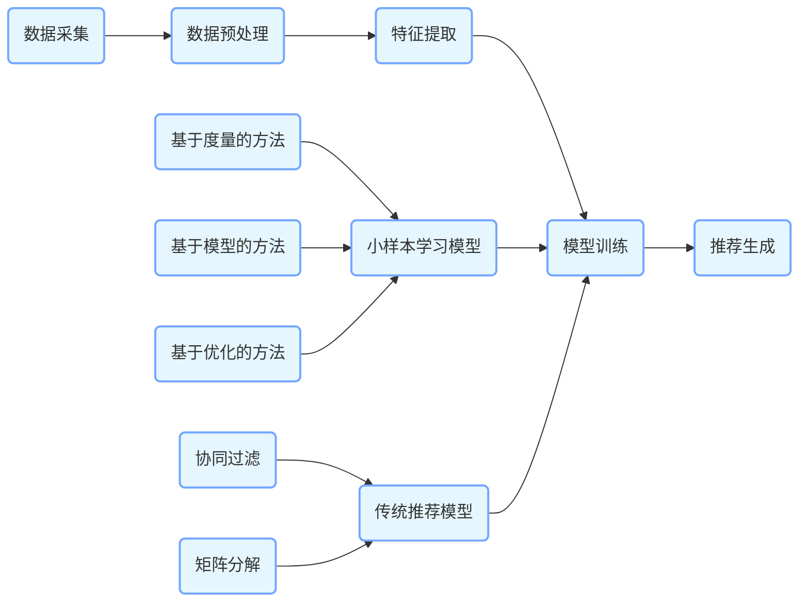

# 小样本学习在个性化推荐系统中的应用

> 关键词：小样本学习、个性化推荐系统、机器学习、深度学习、特征提取、模型泛化

> 摘要：本文深入探讨了小样本学习在个性化推荐系统中的应用。首先介绍了小样本学习和个性化推荐系统的背景知识，明确了研究的目的、范围、预期读者以及文档结构。接着阐述了小样本学习和个性化推荐系统的核心概念与联系，给出了相应的原理和架构示意图。详细讲解了核心算法原理及具体操作步骤，通过Python源代码进行了说明。还介绍了相关的数学模型和公式，并举例说明。在项目实战部分，给出了开发环境搭建、源代码实现和解读。探讨了小样本学习在个性化推荐系统中的实际应用场景，推荐了相关的学习资源、开发工具框架以及论文著作。最后总结了未来发展趋势与挑战，提供了常见问题解答和扩展阅读参考资料。

## 1. 背景介绍 
### 1.1 目的和范围
个性化推荐系统旨在根据用户的历史行为、偏好等信息，为用户提供个性化的推荐内容，以提高用户的满意度和平台的转化率。然而，在实际应用中，常常会面临数据稀缺的问题，即小样本情况。小样本学习旨在解决在少量样本数据下进行有效学习和预测的问题。本文的目的是研究如何将小样本学习技术应用于个性化推荐系统，以提高推荐系统在小样本数据下的性能。范围涵盖了小样本学习的主要方法、个性化推荐系统的常见架构，以及两者结合的具体应用和实现。

### 1.2 预期读者
本文预期读者包括从事个性化推荐系统开发、研究的工程师和科研人员，对小样本学习和机器学习感兴趣的学生和爱好者，以及关注人工智能技术在商业应用中的企业管理人员。

### 1.3 文档结构概述
本文首先介绍小样本学习和个性化推荐系统的核心概念与联系，接着详细讲解核心算法原理和具体操作步骤，然后介绍相关的数学模型和公式，通过项目实战展示代码实现和解读，探讨实际应用场景，推荐相关的工具和资源，最后总结未来发展趋势与挑战，提供常见问题解答和扩展阅读参考资料。

### 1.4 术语表
#### 1.4.1 核心术语定义
- **小样本学习（Few-Shot Learning）**：指在只有少量样本数据的情况下，模型能够快速学习并进行准确预测的机器学习方法。
- **个性化推荐系统（Personalized Recommendation System）**：根据用户的个人特征和历史行为，为用户提供个性化的物品、服务或信息推荐的系统。
- **元学习（Meta-Learning）**：一种学习如何学习的方法，旨在通过在多个任务上的学习，使模型能够快速适应新的任务，是小样本学习的一种重要方法。
- **特征提取（Feature Extraction）**：从原始数据中提取出能够代表数据本质特征的过程，在小样本学习和个性化推荐系统中都起着关键作用。

#### 1.4.2 相关概念解释
- **支持集（Support Set）**：在小样本学习中，用于训练模型的少量样本集合。
- **查询集（Query Set）**：用于测试模型性能的样本集合。
- **冷启动问题（Cold Start Problem）**：在个性化推荐系统中，当新用户或新物品加入系统时，由于缺乏足够的历史数据，导致推荐效果不佳的问题，小样本学习可以用于解决冷启动问题。

#### 1.4.3 缩略词列表
- **CNN（Convolutional Neural Network）**：卷积神经网络
- **RNN（Recurrent Neural Network）**：循环神经网络
- **LSTM（Long Short-Term Memory）**：长短期记忆网络
- **MAML（Model-Agnostic Meta-Learning）**：模型无关元学习

## 2. 核心概念与联系 
### 2.1 小样本学习核心概念
小样本学习的核心目标是在少量样本数据的情况下，使模型能够快速学习并具有良好的泛化能力。常见的小样本学习方法包括基于度量的方法、基于模型的方法和基于优化的方法。

基于度量的方法通过学习样本之间的距离度量，来判断样本的类别。例如，Siamese网络通过学习样本对之间的相似度，来进行分类任务。基于模型的方法则是通过设计特殊的模型结构，使模型能够在少量样本下快速学习。例如，Matching Networks通过记忆网络来存储和检索样本信息。基于优化的方法则是通过优化模型的学习过程，使模型能够快速适应新的任务。例如，MAML通过在多个任务上进行元学习，来优化模型的初始化参数。

### 2.2 个性化推荐系统核心概念
个性化推荐系统主要由数据采集、数据预处理、特征提取、模型训练和推荐生成等部分组成。数据采集负责收集用户的历史行为数据，如浏览记录、购买记录等。数据预处理对采集到的数据进行清洗、转换和归一化等操作。特征提取从预处理后的数据中提取出能够代表用户和物品特征的向量。模型训练使用提取的特征向量来训练推荐模型，常见的推荐模型包括协同过滤、矩阵分解、深度学习模型等。推荐生成根据训练好的模型，为用户生成个性化的推荐列表。

### 2.3 小样本学习与个性化推荐系统的联系
小样本学习可以为个性化推荐系统提供解决方案，特别是在解决冷启动问题和处理稀疏数据方面。在冷启动场景下，新用户或新物品的样本数据非常少，传统的推荐方法往往无法取得良好的效果。小样本学习可以通过元学习等方法，利用已有的数据和知识，快速适应新用户或新物品的推荐任务。在处理稀疏数据时，小样本学习可以通过学习样本之间的相似性，提高模型的泛化能力，从而在少量样本数据下也能进行准确的推荐。

### 2.4 核心概念原理和架构的文本示意图
```plaintext
个性化推荐系统
|-- 数据采集
|   |-- 用户历史行为数据
|   |-- 物品信息数据
|-- 数据预处理
|   |-- 数据清洗
|   |-- 数据转换
|   |-- 数据归一化
|-- 特征提取
|   |-- 用户特征提取
|   |-- 物品特征提取
|-- 模型训练
|   |-- 小样本学习模型
|   |   |-- 基于度量的方法
|   |   |-- 基于模型的方法
|   |   |-- 基于优化的方法
|   |-- 传统推荐模型
|       |-- 协同过滤
|       |-- 矩阵分解
|-- 推荐生成
|   |-- 个性化推荐列表
```

### 2.5 Mermaid 流程图


## 3. 核心算法原理 & 具体操作步骤 
### 3.1 基于度量的小样本学习算法：Siamese网络
#### 3.1.1 算法原理
Siamese网络由两个相同的神经网络组成，这两个网络共享参数。输入是一对样本，网络的输出是这对样本的相似度得分。通过训练Siamese网络，使其能够学习到样本之间的相似度度量。在小样本学习中，可以使用Siamese网络来判断查询集中的样本与支持集中的样本是否属于同一类别。

#### 3.1.2 具体操作步骤
1. **数据准备**：准备支持集和查询集，每个样本都有对应的标签。
2. **模型构建**：构建Siamese网络，包括输入层、隐藏层和输出层。
3. **损失函数定义**：使用对比损失函数（Contrastive Loss）来训练Siamese网络，对比损失函数的定义如下：
   - 当两个样本属于同一类别时，损失函数的值应该尽可能小。
   - 当两个样本属于不同类别时，损失函数的值应该尽可能大。
4. **模型训练**：使用支持集对Siamese网络进行训练，调整网络的参数，使损失函数的值最小化。
5. **预测**：对于查询集中的样本，计算其与支持集中每个样本的相似度得分，根据相似度得分进行分类预测。

#### 3.1.3 Python源代码实现
```python
import torch
import torch.nn as nn
import torch.optim as optim
from torch.utils.data import DataLoader, Dataset

# 定义Siamese网络
class SiameseNetwork(nn.Module):
    def __init__(self):
        super(SiameseNetwork, self).__init__()
        self.fc1 = nn.Linear(10, 20)
        self.relu = nn.ReLU()
        self.fc2 = nn.Linear(20, 1)

    def forward_once(self, x):
        x = self.fc1(x)
        x = self.relu(x)
        x = self.fc2(x)
        return x

    def forward(self, input1, input2):
        output1 = self.forward_once(input1)
        output2 = self.forward_once(input2)
        return output1, output2

# 定义对比损失函数
class ContrastiveLoss(nn.Module):
    def __init__(self, margin=2.0):
        super(ContrastiveLoss, self).__init__()
        self.margin = margin

    def forward(self, output1, output2, label):
        euclidean_distance = nn.functional.pairwise_distance(output1, output2)
        loss_contrastive = torch.mean((1 - label) * torch.pow(euclidean_distance, 2) +
                                      (label) * torch.pow(torch.clamp(self.margin - euclidean_distance, min=0.0), 2))
        return loss_contrastive

# 定义数据集
class SiameseDataset(Dataset):
    def __init__(self, data, labels):
        self.data = data
        self.labels = labels

    def __getitem__(self, index):
        img0_index = index
        img0 = self.data[img0_index]
        label0 = self.labels[img0_index]

        # 随机选择一个正样本或负样本
        should_get_same_class = torch.randint(0, 2, (1,)).item()
        if should_get_same_class:
            while True:
                img1_index = torch.randint(0, len(self.data), (1,)).item()
                if self.labels[img1_index] == label0:
                    break
        else:
            while True:
                img1_index = torch.randint(0, len(self.data), (1,)).item()
                if self.labels[img1_index]!= label0:
                    break

        img1 = self.data[img1_index]
        label = torch.tensor(int(label0!= self.labels[img1_index]))

        return img0, img1, label

    def __len__(self):
        return len(self.data)

# 数据准备
data = torch.randn(100, 10)
labels = torch.randint(0, 2, (100,))
dataset = SiameseDataset(data, labels)
dataloader = DataLoader(dataset, batch_size=10, shuffle=True)

# 模型构建
model = SiameseNetwork()

# 损失函数和优化器
criterion = ContrastiveLoss()
optimizer = optim.Adam(model.parameters(), lr=0.001)

# 模型训练
num_epochs = 10
for epoch in range(num_epochs):
    for img0, img1, label in dataloader:
        optimizer.zero_grad()
        output1, output2 = model(img0, img1)
        loss = criterion(output1, output2, label)
        loss.backward()
        optimizer.step()
    print(f'Epoch {epoch + 1}/{num_epochs}, Loss: {loss.item()}')
```

### 3.2 基于优化的小样本学习算法：MAML
#### 3.2.1 算法原理
MAML的核心思想是通过在多个任务上进行元学习，找到一个通用的模型初始化参数，使得模型在新的任务上只需要进行少量的梯度更新，就能够快速适应新的任务。具体来说，MAML在每个训练步骤中，首先在支持集上进行一次或多次梯度更新，得到一个临时的模型参数，然后在查询集上计算损失函数，根据查询集上的损失函数对原始的模型参数进行更新。

#### 3.2.2 具体操作步骤
1. **数据准备**：准备多个任务的支持集和查询集。
2. **模型构建**：构建一个通用的模型，如神经网络。
3. **元训练**：
   - 随机选择一个任务。
   - 在支持集上进行一次或多次梯度更新，得到临时的模型参数。
   - 在查询集上计算损失函数。
   - 根据查询集上的损失函数对原始的模型参数进行更新。
4. **元测试**：在新的任务上，使用元训练得到的模型参数，在支持集上进行少量的梯度更新，然后在查询集上进行测试。

#### 3.2.3 Python源代码实现
```python
import torch
import torch.nn as nn
import torch.optim as optim

# 定义模型
class SimpleModel(nn.Module):
    def __init__(self):
        super(SimpleModel, self).__init__()
        self.fc1 = nn.Linear(10, 20)
        self.relu = nn.ReLU()
        self.fc2 = nn.Linear(20, 1)

    def forward(self, x):
        x = self.fc1(x)
        x = self.relu(x)
        x = self.fc2(x)
        return x

# 定义元训练函数
def meta_train(model, tasks, num_inner_steps=1, inner_lr=0.01, meta_lr=0.001):
    meta_optimizer = optim.Adam(model.parameters(), lr=meta_lr)
    for task in tasks:
        support_x, support_y, query_x, query_y = task
        # 保存原始参数
        original_params = [p.clone() for p in model.parameters()]

        # 内循环更新
        for _ in range(num_inner_steps):
            output = model(support_x)
            loss = nn.MSELoss()(output, support_y)
            grads = torch.autograd.grad(loss, model.parameters())
            for p, g in zip(model.parameters(), grads):
                p.data -= inner_lr * g

        # 外循环更新
        output = model(query_x)
        meta_loss = nn.MSELoss()(output, query_y)
        meta_optimizer.zero_grad()
        meta_loss.backward()
        meta_optimizer.step()

        # 恢复原始参数
        for p, original_p in zip(model.parameters(), original_params):
            p.data = original_p.data

    return model

# 生成一些示例任务
tasks = []
for _ in range(10):
    support_x = torch.randn(20, 10)
    support_y = torch.randn(20, 1)
    query_x = torch.randn(10, 10)
    query_y = torch.randn(10, 1)
    tasks.append((support_x, support_y, query_x, query_y))

# 模型初始化
model = SimpleModel()

# 元训练
model = meta_train(model, tasks)
```

## 4. 数学模型和公式 & 详细讲解 & 举例说明 
### 4.1 对比损失函数
#### 4.1.1 公式定义
对比损失函数（Contrastive Loss）用于训练Siamese网络，其公式定义如下：
$$
L_{contrastive} = (1 - Y) \cdot D^2 + Y \cdot \max(0, m - D)^2
$$
其中，$Y$ 是样本对的标签，当样本对属于同一类别时，$Y = 0$；当样本对属于不同类别时，$Y = 1$。$D$ 是样本对的欧几里得距离，$m$ 是一个正的阈值，称为边距（Margin）。

#### 4.1.2 详细讲解
当样本对属于同一类别时，即 $Y = 0$，损失函数的值为 $D^2$，这意味着我们希望样本对的距离尽可能小。当样本对属于不同类别时，即 $Y = 1$，损失函数的值为 $\max(0, m - D)^2$，这意味着我们希望样本对的距离大于边距 $m$，如果距离小于 $m$，则会产生损失。

#### 4.1.3 举例说明
假设我们有两个样本对 $(x_1, x_2)$ 和 $(x_3, x_4)$，其中 $(x_1, x_2)$ 属于同一类别，$(x_3, x_4)$ 属于不同类别。边距 $m = 2$。样本对的欧几里得距离分别为 $D_1 = 0.5$ 和 $D_2 = 1.5$。
- 对于样本对 $(x_1, x_2)$，$Y = 0$，损失函数的值为 $L_1 = (1 - 0) \cdot 0.5^2 = 0.25$。
- 对于样本对 $(x_3, x_4)$，$Y = 1$，损失函数的值为 $L_2 = 1 \cdot \max(0, 2 - 1.5)^2 = 0.25$。

### 4.2 MAML的优化目标
#### 4.2.1 公式定义
MAML的优化目标是找到一个通用的模型初始化参数 $\theta$，使得模型在新的任务上只需要进行少量的梯度更新，就能够快速适应新的任务。具体来说，MAML的优化目标可以表示为：
$$
\min_{\theta} \sum_{T \in \mathcal{T}} \mathcal{L}_{T}(\theta'_T)
$$
其中，$\mathcal{T}$ 是任务集合，$T$ 是一个任务，$\theta'_T$ 是在任务 $T$ 的支持集上进行一次或多次梯度更新后得到的临时模型参数，$\mathcal{L}_{T}$ 是任务 $T$ 的查询集上的损失函数。

#### 4.2.2 详细讲解
MAML的优化过程分为内循环和外循环。在内循环中，对于每个任务 $T$，使用支持集上的数据对模型进行一次或多次梯度更新，得到临时的模型参数 $\theta'_T$。在外循环中，使用查询集上的数据计算损失函数 $\mathcal{L}_{T}(\theta'_T)$，并根据这个损失函数对原始的模型参数 $\theta$ 进行更新。

#### 4.2.3 举例说明
假设我们有两个任务 $T_1$ 和 $T_2$。模型的初始参数为 $\theta$。
- 对于任务 $T_1$，在支持集上进行一次梯度更新后得到临时参数 $\theta'_{T_1}$，在查询集上的损失函数为 $\mathcal{L}_{T_1}(\theta'_{T_1})$。
- 对于任务 $T_2$，在支持集上进行一次梯度更新后得到临时参数 $\theta'_{T_2}$，在查询集上的损失函数为 $\mathcal{L}_{T_2}(\theta'_{T_2})$。
MAML的优化目标是最小化 $\mathcal{L}_{T_1}(\theta'_{T_1}) + \mathcal{L}_{T_2}(\theta'_{T_2})$。

## 5. 项目实战：代码实际案例和详细解释说明 
### 5.1  开发环境搭建
#### 5.1.1 操作系统
建议使用Linux或Windows操作系统，推荐使用Ubuntu 18.04或更高版本。

#### 5.1.2 编程语言和版本
使用Python 3.7或更高版本。

#### 5.1.3 深度学习框架
使用PyTorch 1.7或更高版本，可以通过以下命令安装：
```sh
pip install torch torchvision
```

#### 5.1.4 其他依赖库
安装numpy、pandas、matplotlib等常用库：
```sh
pip install numpy pandas matplotlib
```

### 5.2  源代码详细实现和代码解读
#### 5.2.1 数据准备
```python
import torch
import numpy as np

# 生成一些示例数据
num_users = 100
num_items = 50
num_features = 10

# 用户特征
user_features = torch.randn(num_users, num_features)

# 物品特征
item_features = torch.randn(num_items, num_features)

# 生成用户-物品交互矩阵
interaction_matrix = torch.randint(0, 2, (num_users, num_items))
```
代码解读：
- 首先定义了用户数量、物品数量和特征维度。
- 然后随机生成用户特征和物品特征。
- 最后生成用户-物品交互矩阵，表示用户是否与物品有交互。

#### 5.2.2 小样本学习模型构建
```python
import torch.nn as nn

class SmallSampleRecommender(nn.Module):
    def __init__(self, num_features):
        super(SmallSampleRecommender, self).__init__()
        self.fc1 = nn.Linear(num_features * 2, 20)
        self.relu = nn.ReLU()
        self.fc2 = nn.Linear(20, 1)

    def forward(self, user_feature, item_feature):
        combined_feature = torch.cat((user_feature, item_feature), dim=1)
        x = self.fc1(combined_feature)
        x = self.relu(x)
        x = self.fc2(x)
        return x
```
代码解读：
- 定义了一个简单的小样本学习推荐模型，该模型将用户特征和物品特征拼接在一起，经过两层全连接层，最后输出一个预测值。

#### 5.2.3 模型训练
```python
import torch.optim as optim

# 初始化模型
model = SmallSampleRecommender(num_features)

# 定义损失函数和优化器
criterion = nn.BCEWithLogitsLoss()
optimizer = optim.Adam(model.parameters(), lr=0.001)

# 训练模型
num_epochs = 10
for epoch in range(num_epochs):
    total_loss = 0
    for user_idx in range(num_users):
        for item_idx in range(num_items):
            user_feature = user_features[user_idx].unsqueeze(0)
            item_feature = item_features[item_idx].unsqueeze(0)
            label = interaction_matrix[user_idx, item_idx].unsqueeze(0).float()

            optimizer.zero_grad()
            output = model(user_feature, item_feature)
            loss = criterion(output, label)
            loss.backward()
            optimizer.step()

            total_loss += loss.item()

    print(f'Epoch {epoch + 1}/{num_epochs}, Loss: {total_loss / (num_users * num_items)}')
```
代码解读：
- 初始化模型、损失函数和优化器。
- 进行多个epoch的训练，每个epoch中遍历所有的用户-物品对。
- 对于每个用户-物品对，计算模型的输出和损失，然后进行反向传播和参数更新。

### 5.3  代码解读与分析
#### 5.3.1 数据准备部分
数据准备部分主要是生成示例数据，包括用户特征、物品特征和用户-物品交互矩阵。在实际应用中，这些数据可以从实际的业务系统中采集得到，并且需要进行预处理，如数据清洗、归一化等操作。

#### 5.3.2 模型构建部分
模型构建部分定义了一个简单的小样本学习推荐模型，该模型将用户特征和物品特征拼接在一起，经过两层全连接层，最后输出一个预测值。在实际应用中，可以根据具体的需求和数据特点，选择更复杂的模型结构，如深度学习模型（如CNN、RNN等）。

#### 5.3.3 模型训练部分
模型训练部分使用二元交叉熵损失函数（BCEWithLogitsLoss）和Adam优化器进行训练。在每个epoch中，遍历所有的用户-物品对，计算模型的输出和损失，然后进行反向传播和参数更新。在实际应用中，可以根据数据的规模和计算资源，选择合适的训练方法，如批量训练、随机梯度下降等。

## 6. 实际应用场景 
### 6.1 冷启动场景
在个性化推荐系统中，冷启动问题是一个常见的挑战。当新用户或新物品加入系统时，由于缺乏足够的历史数据，传统的推荐方法往往无法取得良好的效果。小样本学习可以通过元学习等方法，利用已有的数据和知识，快速适应新用户或新物品的推荐任务。例如，在电商平台中，当有新的商品上架时，可以使用小样本学习模型，根据商品的特征和少量的用户反馈数据，快速为用户推荐这些新商品。

### 6.2 小众领域推荐
在一些小众领域，如小众音乐、小众电影等，用户和物品的数据量相对较少。小样本学习可以在这些少量数据的情况下，学习到用户的偏好和物品的特征，从而为用户提供个性化的推荐。例如，在一个小众音乐推荐平台中，用户数量和音乐作品数量都比较少，使用小样本学习可以提高推荐的准确性。

### 6.3 实时推荐场景
在实时推荐场景中，如新闻推荐、广告推荐等，需要快速地根据用户的实时行为进行推荐。小样本学习可以在少量的实时数据下，快速调整推荐模型，为用户提供及时的推荐。例如，在新闻推荐系统中，当用户浏览了一篇新闻后，系统可以使用小样本学习模型，根据用户的历史浏览记录和这篇新闻的特征，快速为用户推荐相关的新闻。

## 7. 工具和资源推荐
### 7.1 学习资源推荐
#### 7.1.1 书籍推荐
- 《深度学习》（Deep Learning）：由Ian Goodfellow、Yoshua Bengio和Aaron Courville撰写，是深度学习领域的经典教材，涵盖了深度学习的基本原理、算法和应用。
- 《机器学习》（Machine Learning）：由Tom Mitchell撰写，是机器学习领域的经典教材，介绍了机器学习的基本概念、算法和应用。
- 《小样本学习》（Few-Shot Learning）：由Yonglong Tian等人撰写，专门介绍了小样本学习的方法和应用。

#### 7.1.2 在线课程
- Coursera上的“深度学习专项课程”（Deep Learning Specialization）：由Andrew Ng教授授课，包括深度学习的基础知识、卷积神经网络、循环神经网络等内容。
- edX上的“人工智能基础”（Introduction to Artificial Intelligence）：介绍了人工智能的基本概念、算法和应用。
- B站等平台上有许多关于小样本学习和个性化推荐系统的教程和讲解视频，可以作为辅助学习资源。

#### 7.1.3 技术博客和网站
- arXiv.org：是一个预印本服务器，提供了大量的学术论文，包括小样本学习和个性化推荐系统的最新研究成果。
- Medium：有许多技术博客文章，涵盖了小样本学习、个性化推荐系统等领域的最新技术和应用案例。
- GitHub：可以找到许多开源的小样本学习和个性化推荐系统的代码实现和项目。

### 7.2 开发工具框架推荐
#### 7.2.1 IDE和编辑器
- PyCharm：是一款专业的Python集成开发环境，提供了丰富的代码编辑、调试、测试等功能，适合开发小样本学习和个性化推荐系统的Python代码。
- Jupyter Notebook：是一个交互式的开发环境，适合进行数据探索、模型实验和代码演示。

#### 7.2.2 调试和性能分析工具
- PyTorch Profiler：是PyTorch提供的性能分析工具，可以帮助开发者分析模型的运行时间、内存使用等情况，优化模型的性能。
- TensorBoard：是TensorFlow提供的可视化工具，也可以用于PyTorch项目，用于可视化模型的训练过程、损失函数曲线等。

#### 7.2.3 相关框架和库
- PyTorch：是一个开源的深度学习框架，提供了丰富的神经网络层、优化器、损失函数等，适合开发小样本学习和个性化推荐系统的深度学习模型。
- scikit-learn：是一个开源的机器学习库，提供了许多常用的机器学习算法，如分类、回归、聚类等，适合开发传统的个性化推荐系统。
- Pandas：是一个用于数据处理和分析的Python库，提供了数据结构（如DataFrame）和数据操作方法，适合进行数据预处理和特征工程。

### 7.3 相关论文著作推荐
#### 7.3.1 经典论文
- “Siamese Neural Networks for One-Shot Image Recognition”：介绍了Siamese网络的原理和应用，是基于度量的小样本学习的经典论文。
- “Model-Agnostic Meta-Learning for Fast Adaptation of Deep Networks”：提出了MAML算法，是基于优化的小样本学习的经典论文。
- “Item-Based Collaborative Filtering Recommendation Algorithms”：介绍了基于物品的协同过滤推荐算法，是个性化推荐系统的经典论文。

#### 7.3.2 最新研究成果
可以通过arXiv.org等平台查找小样本学习和个性化推荐系统的最新研究成果，关注该领域的前沿动态。

#### 7.3.3 应用案例分析
一些学术会议（如KDD、WWW等）和技术博客上会有小样本学习和个性化推荐系统的应用案例分析，可以从中学习实际应用中的经验和技巧。

## 8. 总结：未来发展趋势与挑战
### 8.1 未来发展趋势
#### 8.1.1 多模态小样本学习
随着数据的多样化，多模态数据（如图像、文本、音频等）在个性化推荐系统中的应用越来越广泛。未来的小样本学习方法将更加注重多模态数据的融合，以提高推荐的准确性和多样性。

#### 8.1.2 强化学习与小样本学习的结合
强化学习可以在动态环境中进行决策和优化，将强化学习与小样本学习相结合，可以使个性化推荐系统在实时推荐场景中更加智能和高效。

#### 8.1.3 跨领域小样本学习
在实际应用中，不同领域的数据和任务之间可能存在一定的关联。跨领域小样本学习可以利用其他领域的知识和数据，提高在目标领域的小样本学习性能，为个性化推荐系统提供更广泛的应用场景。

### 8.2 挑战
#### 8.2.1 数据质量和标注问题
小样本学习对数据质量和标注的要求较高。在实际应用中，可能会存在数据噪声、标注错误等问题，这些问题会影响小样本学习模型的性能。因此，如何提高数据质量和标注的准确性是一个挑战。

#### 8.2.2 模型泛化能力
虽然小样本学习的目标是在少量样本数据下具有良好的泛化能力，但在实际应用中，模型的泛化能力仍然是一个挑战。如何设计更加有效的小样本学习算法，提高模型的泛化能力，是未来需要解决的问题。

#### 8.2.3 计算资源和时间成本
一些小样本学习算法（如MAML）的计算复杂度较高，需要大量的计算资源和时间。在实际应用中，如何优化算法的计算效率，降低计算资源和时间成本，是一个需要解决的问题。

## 9. 附录：常见问题与解答
### 9.1 小样本学习在个性化推荐系统中的效果如何？
小样本学习在个性化推荐系统中可以有效解决冷启动问题和处理稀疏数据，提高推荐系统在小样本数据下的性能。但具体的效果还取决于数据的质量、模型的选择和训练方法等因素。

### 9.2 如何选择适合的小样本学习算法？
选择适合的小样本学习算法需要考虑数据的特点、任务的要求和计算资源等因素。如果数据具有明显的相似度结构，可以选择基于度量的方法；如果需要快速适应新的任务，可以选择基于优化的方法；如果需要设计特殊的模型结构，可以选择基于模型的方法。

### 9.3 小样本学习需要多少样本数据？
小样本学习通常指的是样本数量较少的情况，但具体需要多少样本数据并没有一个固定的标准。一般来说，样本数量越多，模型的性能可能会越好，但小样本学习的优势在于能够在少量样本数据下进行有效的学习。在实际应用中，可以通过实验来确定合适的样本数量。

### 9.4 小样本学习模型的训练时间长吗？
小样本学习模型的训练时间取决于模型的复杂度、数据的规模和计算资源等因素。一些小样本学习算法（如MAML）的计算复杂度较高，训练时间可能会较长。可以通过优化算法、使用并行计算等方法来缩短训练时间。

## 10. 扩展阅读 & 参考资料
### 10.1 扩展阅读
- 《深度学习进阶：自然语言处理》：深入介绍了深度学习在自然语言处理中的应用，其中涉及到一些小样本学习和个性化推荐的相关技术。
- 《人工智能：现代方法》：全面介绍了人工智能的各个领域，包括机器学习、小样本学习、个性化推荐等。

### 10.2 参考资料
- Goodfellow, I., Bengio, Y., & Courville, A. (2016). Deep Learning. MIT Press.
- Mitchell, T. M. (1997). Machine Learning. McGraw-Hill.
- Tian, Y., Wang, Y., Krishnan, D., & Isola, P. (2020). Few-Shot Learning. arXiv preprint arXiv:2003.11539.
- Koch, G., Zemel, R., & Salakhutdinov, R. (2015). Siamese Neural Networks for One-Shot Image Recognition. ICML Deep Learning Workshop.
- Finn, C., Abbeel, P., & Levine, S. (2017). Model-Agnostic Meta-Learning for Fast Adaptation of Deep Networks. Proceedings of the 34th International Conference on Machine Learning-Volume 70.
- Sarwar, B., Karypis, G., Konstan, J., & Riedl, J. (2001). Item-Based Collaborative Filtering Recommendation Algorithms. Proceedings of the 10th international conference on World Wide Web.

作者：AI天才研究院/AI Genius Institute & 禅与计算机程序设计艺术 /Zen And The Art of Computer Programming