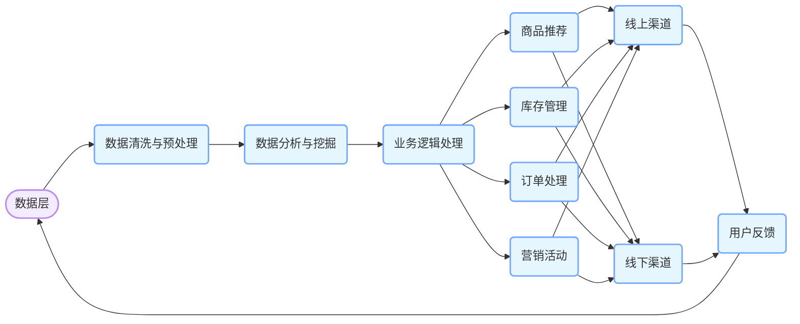

# 巴菲特 - 芒格的新零售投资：线上线下融合的商业模式

> 关键词：巴菲特、芒格、新零售、线上线下融合、商业模式、投资策略、零售变革

> 摘要：本文聚焦于巴菲特 - 芒格的新零售投资理念及线上线下融合的商业模式。首先介绍相关背景，包括目的、预期读者等。接着阐述新零售及线上线下融合的核心概念与联系，通过流程图呈现其架构。深入剖析核心算法原理，以 Python 代码详细说明。给出数学模型和公式并举例。通过项目实战展示代码案例及解读。探讨新零售模式的实际应用场景，推荐相关工具和资源。最后总结未来发展趋势与挑战，解答常见问题并提供扩展阅读与参考资料，旨在全面解析巴菲特 - 芒格在新零售领域投资所涉及的线上线下融合商业模式的各个方面。

## 1. 背景介绍 
### 1.1 目的和范围
本文章的目的在于深入探讨巴菲特 - 芒格在新零售领域的投资策略，以及线上线下融合这一商业模式的具体内涵、运作原理和发展前景。范围涵盖新零售概念的起源与发展、线上线下融合模式的核心要素、相关算法和数学模型、实际应用案例分析，以及对未来趋势的展望等方面。通过对这些内容的研究，帮助读者全面理解巴菲特 - 芒格投资新零售背后的逻辑，以及线上线下融合商业模式在当今零售行业的重要性和应用价值。

### 1.2 预期读者
本文预期读者包括对投资领域感兴趣的人士，尤其是关注巴菲特 - 芒格投资理念和策略的投资者；零售行业的从业者，如零售商、品牌商、供应链管理者等，希望从中获取关于新零售模式的新思路和实践经验；以及对商业创新、商业模式研究有兴趣的学者、研究人员和学生，旨在为他们提供关于新零售线上线下融合模式的理论和实践参考。

### 1.3 文档结构概述
本文共分为十个部分。第一部分为背景介绍，阐述文章的目的、预期读者、文档结构概述和术语表；第二部分讲解核心概念与联系，介绍新零售和线上线下融合的原理及架构；第三部分剖析核心算法原理和具体操作步骤，并用 Python 代码详细说明；第四部分给出数学模型和公式，并进行详细讲解和举例；第五部分通过项目实战展示代码案例和详细解释；第六部分探讨实际应用场景；第七部分推荐相关工具和资源，包括学习资源、开发工具框架和相关论文著作；第八部分总结未来发展趋势与挑战；第九部分为附录，解答常见问题；第十部分提供扩展阅读和参考资料。

### 1.4 术语表
#### 1.4.1 核心术语定义
- **新零售**：是企业以互联网为依托，通过运用大数据、人工智能等先进技术手段，对商品的生产、流通与销售过程进行升级改造，进而重塑业态结构与生态圈，并对线上服务、线下体验以及现代物流进行深度融合的零售新模式。
- **线上线下融合**：指将线上的虚拟渠道与线下的实体渠道进行有机结合，实现资源共享、优势互补，为消费者提供无缝衔接的购物体验。

#### 1.4.2 相关概念解释
- **大数据**：指无法在一定时间范围内用常规软件工具进行捕捉、管理和处理的数据集合，是需要新处理模式才能具有更强的决策力、洞察发现力和流程优化能力的海量、高增长率和多样化的信息资产。在新零售中，大数据可用于分析消费者行为、预测市场趋势等。
- **人工智能**：是研究、开发用于模拟、延伸和扩展人的智能的理论、方法、技术及应用系统的一门新的技术科学。在新零售中，人工智能可应用于智能客服、智能推荐等方面。

#### 1.4.3 缩略词列表
- **O2O**：Online to Offline，即线上到线下，是指将线下的商务机会与互联网结合，让互联网成为线下交易的平台。
- **B2C**：Business - to - Consumer，即企业对消费者的电子商务模式。
- **C2C**：Consumer - to - Consumer，即消费者对消费者的电子商务模式。

## 2. 核心概念与联系 
### 新零售的概念原理
新零售的核心在于打破传统零售线上与线下的界限，通过数据驱动实现全渠道的无缝连接。传统零售模式下，线上和线下是相对独立的渠道，消费者在不同渠道的购物体验存在差异。而新零售模式借助大数据、人工智能等技术，整合线上线下的商品、库存、会员、营销等信息，实现信息的实时共享和互通。

例如，消费者在线上浏览商品时，系统可以根据其地理位置推荐附近的线下门店，提供到店自提或体验的服务；在线下门店购物时，消费者可以通过扫码等方式获取商品的详细信息、用户评价等线上资源。同时，企业可以根据消费者在不同渠道的行为数据，进行精准的营销和个性化推荐，提高消费者的购物满意度和忠诚度。

### 线上线下融合的架构
线上线下融合的架构主要包括以下几个层次：
1. **数据层**：收集和整合线上线下的各种数据，如消费者的基本信息、购物记录、浏览行为、地理位置等。这些数据是实现线上线下融合的基础，通过对数据的分析和挖掘，可以深入了解消费者的需求和行为模式。
2. **业务逻辑层**：根据数据层的分析结果，实现各种业务逻辑的处理，如商品推荐、库存管理、订单处理、营销活动等。例如，根据消费者的历史购物记录和偏好，为其推荐相关的商品；根据不同门店的库存情况，合理分配订单，实现就近配送。
3. **渠道层**：包括线上渠道（如电商平台、移动应用等）和线下渠道（如实体门店、专柜等）。通过统一的接口和标准，实现线上线下渠道的互联互通，让消费者可以在不同渠道之间自由切换，享受一致的购物体验。
4. **用户层**：即消费者，是线上线下融合模式的最终服务对象。消费者可以根据自己的需求和偏好，选择合适的购物渠道和方式，如线上购买、线下自提；线下体验、线上购买等。

### 文本示意图
新零售线上线下融合的架构可以用以下文本描述：

数据层收集线上线下的多源数据，经过清洗和预处理后，传输到业务逻辑层。业务逻辑层根据数据进行分析和决策，生成相应的业务指令，如商品推荐策略、库存调配方案等。这些指令通过接口传递到渠道层，线上渠道和线下渠道根据指令进行相应的业务操作，如在电商平台上展示推荐商品、在实体门店调整库存布局等。最终，用户在不同渠道的操作和反馈又会产生新的数据，回流到数据层，形成一个闭环的业务流程。

### Mermaid 流程图


## 3. 核心算法原理 & 具体操作步骤 
### 商品推荐算法原理
在新零售的线上线下融合模式中，商品推荐算法起着至关重要的作用。它可以根据消费者的历史行为数据，如浏览记录、购买记录、收藏记录等，为消费者推荐个性化的商品，提高消费者的购物转化率和满意度。

常见的商品推荐算法有基于内容的推荐算法、协同过滤推荐算法等。这里我们以协同过滤推荐算法为例进行详细讲解。

协同过滤推荐算法的核心思想是基于用户之间的相似性或物品之间的相似性进行推荐。具体分为用户协同过滤和物品协同过滤两种。

#### 用户协同过滤
用户协同过滤是通过计算用户之间的相似度，找到与目标用户相似的其他用户，然后根据这些相似用户的购买行为，为目标用户推荐他们感兴趣的商品。

具体步骤如下：
1. **计算用户相似度**：常用的相似度计算方法有余弦相似度、皮尔逊相关系数等。以余弦相似度为例，假设有两个用户 $u$ 和 $v$，他们对商品的评分向量分别为 $\mathbf{r}_u$ 和 $\mathbf{r}_v$，则他们之间的余弦相似度 $sim(u, v)$ 计算公式为：
$sim(u, v)=\frac{\mathbf{r}_u\cdot\mathbf{r}_v}{\|\mathbf{r}_u\|\|\mathbf{r}_v\|}$
其中，$\mathbf{r}_u\cdot\mathbf{r}_v$ 表示向量的点积，$\|\mathbf{r}_u\|$ 和 $\|\mathbf{r}_v\|$ 分别表示向量的模。
2. **找到相似用户**：根据计算得到的用户相似度，选择与目标用户相似度较高的 $k$ 个用户作为邻居。
3. **生成推荐列表**：根据邻居用户的购买行为，统计他们购买过但目标用户未购买的商品，按照一定的规则进行排序，生成推荐列表。

#### 物品协同过滤
物品协同过滤是通过计算物品之间的相似度，找到与目标物品相似的其他物品，然后根据用户对目标物品的行为，为用户推荐相似的物品。

具体步骤如下：
1. **计算物品相似度**：同样可以使用余弦相似度等方法计算物品之间的相似度。假设有两个物品 $i$ 和 $j$，它们的用户评分向量分别为 $\mathbf{r}_i$ 和 $\mathbf{r}_j$，则它们之间的余弦相似度 $sim(i, j)$ 计算公式与用户相似度计算相同。
2. **找到相似物品**：根据计算得到的物品相似度，选择与目标物品相似度较高的 $k$ 个物品作为邻居。
3. **生成推荐列表**：根据用户对目标物品的行为（如购买、浏览等），为用户推荐相似的物品。

### Python 代码实现
以下是一个简单的用户协同过滤推荐算法的 Python 实现：

```python
import numpy as np

# 定义用户 - 商品评分矩阵
ratings = np.array([
    [5, 3, 0, 1],
    [4, 0, 0, 1],
    [1, 1, 0, 5],
    [1, 0, 0, 4],
    [0, 1, 5, 4]
])

# 计算余弦相似度
def cosine_similarity(vec1, vec2):
    dot_product = np.dot(vec1, vec2)
    norm_vec1 = np.linalg.norm(vec1)
    norm_vec2 = np.linalg.norm(vec2)
    if norm_vec1 == 0 or norm_vec2 == 0:
        return 0
    return dot_product / (norm_vec1 * norm_vec2)

# 计算用户之间的相似度矩阵
def user_similarity(ratings):
    num_users = ratings.shape[0]
    similarity_matrix = np.zeros((num_users, num_users))
    for i in range(num_users):
        for j in range(num_users):
            similarity_matrix[i][j] = cosine_similarity(ratings[i], ratings[j])
    return similarity_matrix

# 找到与目标用户最相似的 k 个用户
def find_k_similar_users(user_id, similarity_matrix, k):
    num_users = similarity_matrix.shape[0]
    user_similarities = similarity_matrix[user_id]
    similar_user_indices = np.argsort(user_similarities)[::-1][1:k + 1]
    return similar_user_indices

# 生成推荐列表
def recommend_items(user_id, ratings, similarity_matrix, k):
    similar_user_indices = find_k_similar_users(user_id, similarity_matrix, k)
    num_items = ratings.shape[1]
    item_scores = np.zeros(num_items)
    for item_id in range(num_items):
        if ratings[user_id][item_id] == 0:
            score = 0
            similarity_sum = 0
            for similar_user_id in similar_user_indices:
                if ratings[similar_user_id][item_id] != 0:
                    score += similarity_matrix[user_id][similar_user_id] * ratings[similar_user_id][item_id]
                    similarity_sum += similarity_matrix[user_id][similar_user_id]
            if similarity_sum != 0:
                item_scores[item_id] = score / similarity_sum
    recommended_item_indices = np.argsort(item_scores)[::-1]
    return recommended_item_indices

# 示例：为用户 0 推荐商品
user_id = 0
k = 2
similarity_matrix = user_similarity(ratings)
recommended_item_indices = recommend_items(user_id, ratings, similarity_matrix, k)
print("为用户", user_id, "推荐的商品索引：", recommended_item_indices)
```

### 具体操作步骤
1. **数据收集**：收集用户的历史行为数据，如浏览记录、购买记录、收藏记录等，并整理成用户 - 商品评分矩阵。
2. **相似度计算**：使用上述代码中的 `user_similarity` 函数计算用户之间的相似度矩阵。
3. **找到相似用户**：使用 `find_k_similar_users` 函数找到与目标用户最相似的 $k$ 个用户。
4. **生成推荐列表**：使用 `recommend_items` 函数根据相似用户的购买行为，为目标用户生成推荐列表。

## 4. 数学模型和公式 & 详细讲解 & 举例说明 
### 库存管理的数学模型
在新零售的线上线下融合模式中，库存管理是一个关键问题。合理的库存管理可以降低库存成本，提高客户满意度。下面我们介绍一个简单的库存管理数学模型——经济订货量（EOQ）模型。

#### 经济订货量（EOQ）模型原理
经济订货量模型的基本假设是：
1. 需求是已知且恒定的，即单位时间内的需求量是固定的。
2. 订货提前期是固定的，即从发出订单到收到货物的时间是固定的。
3. 每次订货的成本是固定的，与订货数量无关。
4. 单位商品的持有成本是固定的，与库存水平成正比。

在这些假设下，经济订货量模型的目标是找到一个最优的订货数量，使得总库存成本最小。总库存成本包括订货成本和持有成本两部分。

#### 数学公式
设 $D$ 为年需求量，$S$ 为每次订货的成本，$H$ 为单位商品的年持有成本，$Q$ 为订货数量，则：
- 年订货次数 $n=\frac{D}{Q}$
- 年订货成本 $C_{order}=n\times S=\frac{D}{Q}\times S$
- 平均库存水平 $\overline{I}=\frac{Q}{2}$
- 年持有成本 $C_{hold}=\overline{I}\times H=\frac{Q}{2}\times H$
- 总库存成本 $C(Q)=C_{order}+C_{hold}=\frac{D}{Q}\times S+\frac{Q}{2}\times H$

为了找到使总库存成本最小的订货数量 $Q^*$，我们对 $C(Q)$ 求导，并令导数为 0：
$\frac{dC(Q)}{dQ}=-\frac{D}{Q^2}\times S+\frac{H}{2}=0$
解得：
$Q^*=\sqrt{\frac{2DS}{H}}$

#### 详细讲解
经济订货量 $Q^*$ 是使总库存成本最小的订货数量。当订货数量小于 $Q^*$ 时，订货次数增加，订货成本增加；当订货数量大于 $Q^*$ 时，平均库存水平增加，持有成本增加。因此，$Q^*$ 是一个平衡点，使得订货成本和持有成本之和最小。

#### 举例说明
假设某商品的年需求量 $D = 1000$ 件，每次订货的成本 $S = 50$ 元，单位商品的年持有成本 $H = 10$ 元。则根据经济订货量公式：
$Q^*=\sqrt{\frac{2\times1000\times50}{10}}=\sqrt{10000}=100$（件）

即该商品的经济订货量为 100 件。此时，年订货次数 $n=\frac{D}{Q^*}=\frac{1000}{100}=10$ 次，年订货成本 $C_{order}=n\times S=10\times50 = 500$ 元，平均库存水平 $\overline{I}=\frac{Q^*}{2}=\frac{100}{2}=50$ 件，年持有成本 $C_{hold}=\overline{I}\times H=50\times10 = 500$ 元，总库存成本 $C(Q^*)=C_{order}+C_{hold}=500 + 500 = 1000$ 元。

### 营销效果评估的数学模型
在新零售的营销活动中，需要对营销效果进行评估，以确定营销活动的投入产出比。下面我们介绍一个简单的营销效果评估数学模型——投资回报率（ROI）模型。

#### 投资回报率（ROI）模型原理
投资回报率是指通过投资而应返回的价值，即企业从一项投资活动中得到的经济回报。在营销活动中，投资回报率可以用来衡量营销投入所带来的收益。

#### 数学公式
设 $R$ 为营销活动带来的收益，$C$ 为营销活动的成本，则投资回报率 $ROI$ 的计算公式为：
$ROI=\frac{R - C}{C}\times100\%$

#### 详细讲解
投资回报率反映了营销活动的盈利能力。当 $ROI>0$ 时，说明营销活动带来了正的收益，投资是有效的；当 $ROI<0$ 时，说明营销活动亏损，投资是无效的。$ROI$ 的值越大，说明营销活动的效果越好。

#### 举例说明
假设某企业开展了一次营销活动，投入成本 $C = 10000$ 元，活动结束后带来的收益 $R = 15000$ 元。则该营销活动的投资回报率为：
$ROI=\frac{15000 - 10000}{10000}\times100\%=\frac{5000}{10000}\times100\% = 50\%$

这表明该营销活动的投资回报率为 50%，投资效果较好。

## 5. 项目实战：代码实际案例和详细解释说明 
### 5.1  开发环境搭建
#### 硬件环境
- 服务器：可以选择云服务器（如阿里云、腾讯云等）或本地服务器，建议配置 CPU 为 Intel Xeon 系列，内存 8GB 以上，硬盘容量 500GB 以上。
- 客户端：普通 PC 或移动设备，操作系统可以是 Windows、Mac OS 或 Android、iOS 等。

#### 软件环境
- 操作系统：服务器端可以选择 Linux 系统（如 Ubuntu、CentOS 等），客户端根据设备类型选择相应的操作系统。
- 编程语言：Python 3.x，建议使用 Anaconda 进行 Python 环境的管理。
- 数据库：MySQL 或 PostgreSQL 等关系型数据库，用于存储用户信息、商品信息、订单信息等。
- Web 框架：Flask 或 Django 等，用于开发 Web 应用程序。
- 前端框架：Vue.js 或 React.js 等，用于开发前端页面。

#### 开发工具
- 集成开发环境（IDE）：PyCharm 或 Visual Studio Code 等，用于编写 Python 代码。
- 数据库管理工具：Navicat 或 DBeaver 等，用于管理数据库。

### 5.2  源代码详细实现和代码解读
以下是一个简单的基于 Flask 和 MySQL 的新零售线上线下融合项目的代码实现：

#### 数据库设计
首先，我们设计数据库表结构，包括用户表、商品表、订单表等。以下是使用 MySQL 语句创建表的示例：

```sql
-- 用户表
CREATE TABLE users (
    user_id INT AUTO_INCREMENT PRIMARY KEY,
    username VARCHAR(50) NOT NULL,
    password VARCHAR(50) NOT NULL,
    email VARCHAR(100) NOT NULL
);

-- 商品表
CREATE TABLE products (
    product_id INT AUTO_INCREMENT PRIMARY KEY,
    product_name VARCHAR(100) NOT NULL,
    price DECIMAL(10, 2) NOT NULL,
    stock INT NOT NULL
);

-- 订单表
CREATE TABLE orders (
    order_id INT AUTO_INCREMENT PRIMARY KEY,
    user_id INT NOT NULL,
    product_id INT NOT NULL,
    quantity INT NOT NULL,
    order_date TIMESTAMP DEFAULT CURRENT_TIMESTAMP,
    FOREIGN KEY (user_id) REFERENCES users(user_id),
    FOREIGN KEY (product_id) REFERENCES products(product_id)
);
```

#### Python 代码实现
```python
from flask import Flask, request, jsonify
import mysql.connector

app = Flask(__name__)

# 数据库连接配置
db_config = {
    'user': 'your_username',
    'password': 'your_password',
    'host': 'your_host',
    'database': 'your_database'
}

# 获取商品列表
@app.route('/products', methods=['GET'])
def get_products():
    try:
        conn = mysql.connector.connect(**db_config)
        cursor = conn.cursor(dictionary=True)
        cursor.execute('SELECT * FROM products')
        products = cursor.fetchall()
        conn.close()
        return jsonify(products)
    except Exception as e:
        return jsonify({'error': str(e)}), 500

# 创建订单
@app.route('/orders', methods=['POST'])
def create_order():
    try:
        data = request.get_json()
        user_id = data.get('user_id')
        product_id = data.get('product_id')
        quantity = data.get('quantity')

        conn = mysql.connector.connect(**db_config)
        cursor = conn.cursor()

        # 检查库存是否充足
        cursor.execute('SELECT stock FROM products WHERE product_id = %s', (product_id,))
        result = cursor.fetchone()
        if result is None or result[0] < quantity:
            conn.close()
            return jsonify({'error': '库存不足'}), 400

        # 插入订单记录
        cursor.execute('INSERT INTO orders (user_id, product_id, quantity) VALUES (%s, %s, %s)', (user_id, product_id, quantity))
        # 更新库存
        new_stock = result[0] - quantity
        cursor.execute('UPDATE products SET stock = %s WHERE product_id = %s', (new_stock, product_id))
        conn.commit()
        conn.close()
        return jsonify({'message': '订单创建成功'}), 201
    except Exception as e:
        return jsonify({'error': str(e)}), 500

if __name__ == '__main__':
    app.run(debug=True)
```

### 5.3  代码解读与分析
#### 数据库设计解读
- **用户表（users）**：用于存储用户的基本信息，包括用户 ID、用户名、密码和邮箱。用户 ID 作为主键，唯一标识每个用户。
- **商品表（products）**：用于存储商品的信息，包括商品 ID、商品名称、价格和库存。商品 ID 作为主键，唯一标识每个商品。
- **订单表（orders）**：用于存储订单的信息，包括订单 ID、用户 ID、商品 ID、数量和订单日期。订单 ID 作为主键，用户 ID 和商品 ID 作为外键，分别关联用户表和商品表，确保数据的一致性和完整性。

#### Python 代码解读
- **`get_products` 函数**：用于获取商品列表。通过连接数据库，执行 SQL 查询语句，获取所有商品的信息，并以 JSON 格式返回给客户端。
- **`create_order` 函数**：用于创建订单。首先从请求中获取用户 ID、商品 ID 和数量，然后检查库存是否充足。如果库存充足，则插入订单记录，并更新商品的库存。最后返回订单创建成功的消息。

#### 代码分析
- **优点**：代码结构清晰，易于理解和维护。使用 Flask 框架可以快速搭建 Web 应用程序，使用 MySQL 数据库可以保证数据的持久化和一致性。
- **缺点**：代码缺乏错误处理和安全验证，如输入验证、密码加密等。在实际应用中，需要对代码进行进一步的完善和优化。

## 6. 实际应用场景 
### 连锁零售企业
连锁零售企业可以通过线上线下融合的商业模式，实现各门店之间的库存共享和商品调配。消费者可以在网上下单，选择附近的门店自提商品，也可以享受门店的配送服务。同时，企业可以根据线上线下的销售数据，进行精准的商品采购和库存管理，提高运营效率和盈利能力。

例如，某连锁超市通过建立线上购物平台，将各门店的库存信息实时同步到平台上。消费者可以在平台上浏览商品、下单，选择到店自提或配送到家。超市根据订单信息，合理安排配送路线和人员，提高配送效率。此外，超市还可以根据线上线下的销售数据，分析消费者的需求和偏好，调整商品的采购策略，优化商品陈列，提高销售额。

### 品牌商
品牌商可以通过线上线下融合的模式，提升品牌形象和消费者体验。在线上，品牌商可以通过官网、电商平台等渠道展示品牌文化和产品信息，吸引消费者关注；在线下，品牌商可以开设品牌体验店，让消费者亲身体验产品的品质和功能。同时，品牌商可以通过线上线下的互动活动，增强消费者的参与感和忠诚度。

例如，某服装品牌通过建立线上官网和电商平台，展示品牌的最新款式和时尚理念。消费者可以在网上浏览商品、下单购买。同时，品牌商在各大城市开设品牌体验店，店内设置了智能试衣镜、虚拟搭配等设备，让消费者可以更加直观地感受产品的效果。品牌商还会定期举办线上线下的互动活动，如线上投票评选最佳搭配、线下时尚派对等，吸引消费者参与，提升品牌的知名度和美誉度。

### 生鲜电商
生鲜电商可以通过线上线下融合的模式，解决生鲜产品的配送时效性和品质保障问题。在线上，消费者可以通过电商平台下单购买生鲜产品；在线下，生鲜电商可以建立前置仓或社区门店，实现快速配送。同时，消费者可以到线下门店挑选新鲜的生鲜产品，享受现场加工和品尝服务。

例如，某生鲜电商通过在社区附近建立前置仓，将生鲜产品存储在前置仓中。当消费者在网上下单后，前置仓的工作人员可以在短时间内将商品配送到消费者手中。此外，生鲜电商还在部分社区开设了线下门店，消费者可以到门店挑选新鲜的水果、蔬菜、肉类等生鲜产品，并可以在门店的加工区现场加工和品尝。门店还会定期举办生鲜烹饪讲座和品鉴活动，吸引消费者参与，提高消费者的满意度和忠诚度。

## 7. 工具和资源推荐
### 7.1 学习资源推荐
#### 7.1.1 书籍推荐
- 《新零售：低价高效的数据赋能之路》：本书由阿里研究院和波士顿咨询公司联合编写，深入探讨了新零售的概念、发展趋势和实践案例，是了解新零售的必读之书。
- 《智能商业》：作者曾鸣是阿里巴巴集团学术委员会主席，本书介绍了智能商业的发展趋势和商业模式，对理解新零售的技术驱动和数据应用有很大帮助。
- 《零售的哲学》：作者铃木敏文是 7 - 11 便利店的创始人，本书分享了他在零售行业的经营理念和实践经验，对零售从业者有很大的启发。

#### 7.1.2 在线课程
- 网易云课堂的“新零售实战特训营”：该课程由行业专家授课，涵盖了新零售的各个方面，包括商业模式、运营策略、技术应用等，通过案例分析和实践操作，帮助学员掌握新零售的核心知识和技能。
- Coursera 上的“Data Science and Machine Learning in Retail”：该课程介绍了数据科学和机器学习在零售行业的应用，包括客户细分、商品推荐、库存管理等，适合对数据分析和人工智能感兴趣的学员。

#### 7.1.3 技术博客和网站
- 阿里研究院官网：提供了大量关于新零售的研究报告、行业动态和专家观点，是了解新零售前沿信息的重要渠道。
- 亿邦动力网：专注于电商和零售行业的资讯和研究，提供了丰富的行业新闻、分析文章和案例分享，对零售从业者有很大的参考价值。

### 7.2 开发工具框架推荐
#### 7.2.1 IDE和编辑器
- PyCharm：是一款专业的 Python 集成开发环境，提供了代码编辑、调试、版本控制等功能，适合开发 Python 项目。
- Visual Studio Code：是一款轻量级的代码编辑器，支持多种编程语言，具有丰富的插件和扩展功能，适合快速开发和调试。

#### 7.2.2 调试和性能分析工具
- PDB：是 Python 自带的调试工具，可以帮助开发者在代码中设置断点、单步执行、查看变量值等，方便调试代码。
- Pyflame：是一个用于分析 Python 代码性能的工具，可以生成火焰图，直观地展示代码的性能瓶颈。

#### 7.2.3 相关框架和库
- Flask：是一个轻量级的 Python Web 框架，适合快速开发 Web 应用程序。
- Django：是一个功能强大的 Python Web 框架，提供了丰富的组件和工具，适合开发大型的 Web 应用程序。
- Pandas：是一个用于数据处理和分析的 Python 库，提供了高效的数据结构和数据分析工具，适合处理和分析零售数据。

### 7.3 相关论文著作推荐
#### 7.3.1 经典论文
- “The Impact of Omni - Channel Retailing on Consumer Behavior”：该论文研究了线上线下融合的零售模式对消费者行为的影响，通过实证分析得出了一些有价值的结论。
- “Inventory Management in Omni - Channel Retail Systems”：该论文探讨了线上线下融合的零售系统中的库存管理问题，提出了一些优化策略和模型。

#### 7.3.2 最新研究成果
- 关注国际知名学术期刊，如《Management Science》《Marketing Science》等，这些期刊经常发表关于零售、营销、运营管理等领域的最新研究成果。
- 参加国际学术会议，如 INFORMS Annual Meeting、POMS Annual Conference 等，这些会议汇聚了全球顶尖的学者和研究人员，分享最新的研究成果和实践经验。

#### 7.3.3 应用案例分析
- 艾瑞咨询的《中国新零售行业研究报告》：该报告对中国新零售行业的发展现状、趋势和典型案例进行了深入分析，具有很高的参考价值。
- 德勤的《全球零售力量》报告：该报告对全球零售行业的发展趋势和领先企业的实践经验进行了研究和总结，为零售企业的战略决策提供了参考。

## 8. 总结：未来发展趋势与挑战
### 未来发展趋势
#### 技术创新驱动
随着人工智能、大数据、物联网、区块链等技术的不断发展，新零售将迎来更多的创新应用。例如，人工智能可以实现更精准的商品推荐和智能客服；大数据可以帮助企业深入了解消费者需求和行为，优化运营策略；物联网可以实现商品的实时跟踪和库存管理；区块链可以保障供应链的透明和可信。

#### 全渠道融合深化
未来，线上线下的融合将更加深入，消费者可以在不同渠道之间自由切换，享受无缝衔接的购物体验。例如，消费者可以在线上浏览商品，到线下门店体验和购买；也可以在线下门店扫码下单，享受线上的优惠和配送服务。同时，企业将实现全渠道的库存管理、订单处理和客户服务，提高运营效率和消费者满意度。

#### 个性化定制服务
消费者对个性化的需求越来越高，未来新零售将更加注重个性化定制服务。企业可以根据消费者的偏好和需求，提供定制化的产品和服务。例如，服装品牌可以根据消费者的身材尺寸和喜好，定制个性化的服装；食品企业可以根据消费者的口味和健康需求，定制个性化的食品。

#### 绿色可持续发展
随着消费者环保意识的提高，绿色可持续发展将成为新零售的重要发展趋势。企业将更加注重产品的环保性和可持续性，推广绿色包装、节能减排等措施。同时，消费者也将更加倾向于购买环保、可持续的产品，推动零售行业的绿色转型。

### 挑战
#### 技术应用难题
虽然技术创新为新零售带来了机遇，但也带来了技术应用难题。例如，人工智能和大数据技术需要大量的数据支持和专业的技术人才，企业在数据收集、存储、分析和应用方面面临着挑战；物联网技术需要解决设备的互联互通和安全问题；区块链技术需要解决性能和成本问题。

#### 运营管理挑战
线上线下融合的商业模式对企业的运营管理提出了更高的要求。企业需要整合线上线下的资源，实现全渠道的协同运营；需要优化供应链管理，提高库存周转率和配送效率；需要加强客户服务管理，提高消费者满意度和忠诚度。

#### 竞争加剧
新零售市场的竞争日益激烈，不仅有传统零售企业的转型竞争，还有互联网巨头的跨界竞争。企业需要不断创新和提升竞争力，才能在市场中立足。同时，消费者的选择也越来越多，对企业的品牌形象、产品质量和服务水平提出了更高的要求。

#### 法律法规和政策风险
新零售的发展涉及到多个领域的法律法规和政策，如电子商务法、消费者权益保护法、数据安全法等。企业需要遵守相关法律法规和政策，否则将面临法律风险和政策风险。同时，政策的变化也可能对新零售的发展产生影响，企业需要密切关注政策动态，及时调整发展策略。

## 9. 附录：常见问题与解答
### 1. 新零售与传统零售有什么区别？
新零售与传统零售的主要区别在于：
- **技术应用**：新零售借助大数据、人工智能等先进技术，实现对商品的生产、流通与销售过程的升级改造；而传统零售主要依靠人工经验进行运营管理。
- **渠道融合**：新零售强调线上线下的深度融合，为消费者提供无缝衔接的购物体验；而传统零售的线上和线下渠道相对独立。
- **消费者体验**：新零售更加注重消费者体验，通过个性化推荐、智能客服等方式，提高消费者的满意度和忠诚度；而传统零售的消费者体验相对单一。

### 2. 线上线下融合的商业模式如何实现盈利？
线上线下融合的商业模式可以通过以下方式实现盈利：
- **提高销售额**：通过线上线下的融合，扩大销售渠道，吸引更多的消费者，提高销售额。
- **降低成本**：通过整合线上线下的资源，优化供应链管理，降低采购成本、库存成本和物流成本。
- **增加附加值**：通过提供个性化服务、增值服务等方式，增加产品的附加值，提高利润空间。
- **数据变现**：通过收集和分析消费者的行为数据，为企业提供精准的营销和决策支持，同时也可以将数据进行变现，如出售用户画像等。

### 3. 企业实施线上线下融合的商业模式需要具备哪些条件？
企业实施线上线下融合的商业模式需要具备以下条件：
- **技术能力**：企业需要具备一定的技术能力，如大数据分析、人工智能、物联网等技术，以支持线上线下的融合。
- **数据管理能力**：企业需要建立完善的数据管理体系，收集、存储和分析线上线下的各种数据，为运营决策提供支持。
- **组织架构和团队**：企业需要调整组织架构，建立跨部门的团队，以实现线上线下的协同运营。
- **供应链管理能力**：企业需要优化供应链管理，实现全渠道的库存管理、订单处理和物流配送，提高运营效率。
- **品牌和客户基础**：企业需要有一定的品牌知名度和客户基础，以吸引消费者参与线上线下的融合。

### 4. 如何衡量线上线下融合的商业模式的效果？
可以从以下几个方面衡量线上线下融合的商业模式的效果：
- **销售指标**：如销售额、销售量、客单价等，反映企业的销售业绩。
- **客户指标**：如客户满意度、客户忠诚度、客户复购率等，反映消费者对企业的认可和信任程度。
- **运营指标**：如库存周转率、物流配送效率、订单处理时间等，反映企业的运营效率。
- **数据指标**：如线上线下流量转化率、用户活跃度、数据准确率等，反映线上线下融合的效果和数据的质量。

## 10. 扩展阅读 & 参考资料
### 扩展阅读
- 《第四次零售革命》：作者是刘强东和李大学，本书探讨了零售行业的发展趋势和未来方向，对理解新零售的发展脉络有很大帮助。
- 《场景革命》：作者是吴声，本书介绍了场景思维在商业中的应用，对新零售的场景化营销有一定的启示作用。

### 参考资料
- 阿里研究院. 新零售研究报告[R]. 20XX.
- 艾瑞咨询. 中国新零售行业研究报告[R]. 20XX.
- 德勤. 全球零售力量报告[R]. 20XX.

作者：AI天才研究院/AI Genius Institute & 禅与计算机程序设计艺术 /Zen And The Art of Computer Programming