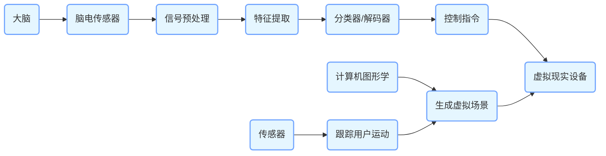

# 巴菲特 - 芒格的脑机接口虚拟现实投资：意识沉浸的新境界

> 关键词：巴菲特、芒格、脑机接口、虚拟现实、投资、意识沉浸、新境界

> 摘要：本文围绕巴菲特 - 芒格的脑机接口虚拟现实投资展开探讨。首先介绍了相关背景信息，包括投资目的、预期读者等内容。接着深入剖析脑机接口与虚拟现实的核心概念及其联系，阐述其核心算法原理与操作步骤，通过数学模型和公式进行理论支撑并举例说明。然后以项目实战呈现代码案例及详细解读，探讨其实际应用场景。同时推荐了相关学习资源、开发工具框架以及论文著作。最后总结了该领域未来发展趋势与挑战，并对常见问题进行解答，提供扩展阅读和参考资料，旨在全面深入地分析这一极具前瞻性的投资所带来的意识沉浸新境界。

## 1. 背景介绍 
### 1.1 目的和范围
巴菲特和芒格作为投资界的传奇人物，他们的投资决策往往具有风向标意义。他们对脑机接口虚拟现实领域的投资，目的可能是看到了该领域巨大的发展潜力和商业价值。本文章的范围将涵盖脑机接口和虚拟现实的基本概念、技术原理、投资背后的逻辑、实际应用场景以及未来发展趋势等方面，旨在深入剖析这一投资行为所涉及的技术和商业层面的内容。

### 1.2 预期读者
预期读者包括对投资领域感兴趣的投资者，希望了解投资界前沿动态和潜在机会；对脑机接口和虚拟现实技术有探索欲望的技术爱好者，想要深入学习相关技术原理和发展方向；以及关注科技发展趋势的研究人员，以便在学术研究中获取更多有价值的信息。

### 1.3 文档结构概述
本文将按照以下结构展开：首先介绍相关背景知识，让读者对主题有初步了解；接着阐述脑机接口和虚拟现实的核心概念及其联系，构建理论基础；然后详细讲解核心算法原理和具体操作步骤，结合数学模型和公式进行理论分析；通过项目实战展示代码案例并进行解读；探讨实际应用场景，体现技术的实际价值；推荐相关工具和资源，为读者提供学习和研究的途径；最后总结未来发展趋势与挑战，解答常见问题并提供扩展阅读和参考资料。

### 1.4 术语表
#### 1.4.1 核心术语定义
- **脑机接口（Brain - Computer Interface，BCI）**：是在人或动物脑（或者脑细胞的培养物）与外部设备间建立的直接连接通路。通过对脑电信号的采集、处理和分析，实现大脑与外部设备之间的信息交互。
- **虚拟现实（Virtual Reality，VR）**：是利用计算机模拟产生一个三维空间的虚拟世界，提供使用者关于视觉、听觉、触觉等感官的模拟，让使用者如同身临其境一般，可以及时、没有限制地观察三度空间内的事物。

#### 1.4.2 相关概念解释
- **意识沉浸**：指用户在使用脑机接口和虚拟现实技术时，能够全身心地投入到虚拟环境中，其意识仿佛完全融入到虚拟世界，产生强烈的真实感和存在感。
- **神经信号**：是神经系统中传递信息的电信号或化学信号，脑机接口技术主要是对大脑产生的神经电信号进行采集和分析。

#### 1.4.3 缩略词列表
- **BCI**：Brain - Computer Interface（脑机接口）
- **VR**：Virtual Reality（虚拟现实）

## 2. 核心概念与联系 

### 脑机接口原理
脑机接口的基本原理是通过脑电传感器采集大脑产生的神经电信号，这些信号包含了大脑的活动信息。然后对采集到的信号进行预处理，去除噪声和干扰，接着进行特征提取，提取出能够反映大脑意图的特征。最后通过分类器或解码器将这些特征转化为具体的控制指令，实现大脑与外部设备的交互。

以下是脑机接口原理的文本示意图：
大脑产生神经电信号 -> 脑电传感器采集信号 -> 信号预处理（去除噪声等） -> 特征提取 -> 分类器/解码器 -> 控制指令 -> 外部设备

### 虚拟现实原理
虚拟现实利用计算机图形学技术生成虚拟场景，通过头戴式显示器等设备将虚拟场景呈现给用户，同时利用传感器跟踪用户的头部运动、身体姿势等信息，实时调整虚拟场景的视角和内容，让用户感受到身临其境的效果。

以下是虚拟现实原理的文本示意图：
计算机图形学生成虚拟场景 -> 头戴式显示器呈现场景 -> 传感器跟踪用户运动 -> 实时调整虚拟场景

### 脑机接口与虚拟现实的联系
脑机接口和虚拟现实的结合可以实现更加自然和高效的交互方式。传统的虚拟现实交互主要通过手柄等外部设备，而脑机接口可以直接读取大脑的意图，无需手动操作，让用户在虚拟世界中的交互更加直观和流畅。例如，用户可以通过大脑的想法直接控制虚拟角色的动作、选择虚拟物品等。

### Mermaid 流程图


## 3. 核心算法原理 & 具体操作步骤 

### 脑机接口核心算法原理
脑机接口中常用的算法包括信号处理算法和模式识别算法。信号处理算法用于对采集到的脑电信号进行预处理和特征提取，模式识别算法用于对提取的特征进行分类和识别。

#### 信号处理算法 - 快速傅里叶变换（FFT）
快速傅里叶变换是一种高效的计算离散傅里叶变换（DFT）的算法，用于将时域信号转换为频域信号。在脑机接口中，可以通过FFT分析脑电信号的频率成分，提取出与大脑活动相关的特征。

以下是使用Python实现FFT的代码示例：
```python
import numpy as np
import matplotlib.pyplot as plt

# 生成模拟脑电信号
t = np.linspace(0, 1, 1000, endpoint=False)
signal = np.sin(2 * np.pi * 10 * t) + 0.5 * np.sin(2 * np.pi * 20 * t)

# 进行FFT变换
fft_result = np.fft.fft(signal)
frequencies = np.fft.fftfreq(len(signal), t[1] - t[0])

# 取单边频谱
n = len(signal)
single_sided_fft = 2.0 / n * np.abs(fft_result[:n // 2])
single_sided_frequencies = frequencies[:n // 2]

# 绘制频谱图
plt.plot(single_sided_frequencies, single_sided_fft)
plt.xlabel('Frequency (Hz)')
plt.ylabel('Amplitude')
plt.title('Single - Sided Amplitude Spectrum of Signal')
plt.grid()
plt.show()
```
#### 模式识别算法 - 支持向量机（SVM）
支持向量机是一种常用的分类算法，在脑机接口中可以用于对不同大脑状态的分类。例如，根据脑电信号的特征判断用户是处于放松状态还是集中注意力状态。

以下是使用Python实现SVM分类的代码示例：
```python
from sklearn import svm
from sklearn.model_selection import train_test_split
from sklearn.datasets import make_classification

# 生成模拟数据集
X, y = make_classification(n_samples=1000, n_features=10, n_informative=5, n_redundant=0, random_state=42)

# 划分训练集和测试集
X_train, X_test, y_train, y_test = train_test_split(X, y, test_size=0.2, random_state=42)

# 创建SVM分类器
clf = svm.SVC(kernel='linear')

# 训练模型
clf.fit(X_train, y_train)

# 预测
y_pred = clf.predict(X_test)

# 计算准确率
accuracy = sum(y_pred == y_test) / len(y_test)
print(f"Accuracy: {accuracy}")
```

### 具体操作步骤
1. **脑电信号采集**：使用脑电传感器（如电极帽）采集大脑产生的神经电信号。
2. **信号预处理**：对采集到的信号进行滤波、去噪等处理，提高信号质量。
3. **特征提取**：使用信号处理算法提取与大脑活动相关的特征。
4. **模式识别**：使用分类算法对提取的特征进行分类，判断大脑的状态或意图。
5. **指令生成与交互**：根据分类结果生成相应的控制指令，实现与虚拟现实设备的交互。

## 4. 数学模型和公式 & 详细讲解 & 举例说明 

### 快速傅里叶变换（FFT）数学模型和公式
离散傅里叶变换（DFT）的定义为：
$$X[k]=\sum_{n = 0}^{N - 1}x[n]e^{-j\frac{2\pi}{N}kn}, \quad k = 0,1,\cdots,N - 1$$
其中，$x[n]$ 是时域信号，$X[k]$ 是频域信号，$N$ 是信号的长度。

快速傅里叶变换（FFT）是对DFT的一种高效计算方法，其时间复杂度为 $O(N\log N)$，而直接计算DFT的时间复杂度为 $O(N^2)$。

举例说明：假设有一个长度为 $N = 8$ 的时域信号 $x[n] = [1, 2, 3, 4, 5, 6, 7, 8]$，使用FFT计算其频域信号。
```python
import numpy as np

x = np.array([1, 2, 3, 4, 5, 6, 7, 8])
X = np.fft.fft(x)
print(X)
```

### 支持向量机（SVM）数学模型和公式
支持向量机的目标是找到一个最优的超平面，将不同类别的样本分开。对于线性可分的情况，超平面的方程为：
$$w^T x + b = 0$$
其中，$w$ 是超平面的法向量，$b$ 是偏置项。

SVM的优化目标是最大化间隔，即：
$$\max_{\omega,b}\frac{2}{\|\omega\|}$$
$$\text{s.t. } y_i(\omega^T x_i + b)\geq 1, \quad i = 1,\cdots,n$$
其中，$x_i$ 是样本点，$y_i$ 是样本的标签（$y_i\in\{- 1,1\}$）。

通过引入拉格朗日乘子，可以将上述优化问题转化为对偶问题进行求解。

举例说明：假设有一个二维数据集，包含两个类别，使用SVM进行分类。
```python
from sklearn import svm
import numpy as np
import matplotlib.pyplot as plt

# 生成数据集
X = np.array([[3, 4], [1, 4], [2, 3], [6, -1], [7, -1], [5, -3]])
y = np.array([-1, -1, -1, 1, 1, 1])

# 创建SVM分类器
clf = svm.SVC(kernel='linear')

# 训练模型
clf.fit(X, y)

# 绘制决策边界
plt.scatter(X[:, 0], X[:, 1], c=y, cmap=plt.cm.Paired)
ax = plt.gca()
xlim = ax.get_xlim()
ylim = ax.get_ylim()

# 创建网格点
xx = np.linspace(xlim[0], xlim[1], 30)
yy = np.linspace(ylim[0], ylim[1], 30)
YY, XX = np.meshgrid(yy, xx)
xy = np.vstack([XX.ravel(), YY.ravel()]).T
Z = clf.decision_function(xy).reshape(XX.shape)

# 绘制决策边界和间隔边界
ax.contour(XX, YY, Z, colors='k', levels=[-1, 0, 1], alpha=0.5, linestyles=['--', '-', '--'])

plt.show()
```

## 5. 项目实战：代码实际案例和详细解释说明 

### 5.1  开发环境搭建
1. **安装Python**：可以从Python官方网站（https://www.python.org/downloads/）下载并安装Python 3.x版本。
2. **安装必要的库**：使用pip命令安装所需的库，如numpy、matplotlib、scikit - learn等。
```sh
pip install numpy matplotlib scikit-learn
```
3. **安装脑电信号采集设备驱动（如果需要）**：根据所使用的脑电传感器型号，安装相应的驱动程序和开发库。

### 5.2  源代码详细实现和代码解读
以下是一个简单的脑机接口与虚拟现实交互的模拟代码示例：
```python
import numpy as np
from sklearn.svm import SVC

# 模拟脑电信号采集
def collect_eeg_signal():
    # 这里简单生成随机信号作为示例
    signal = np.random.rand(100)
    return signal

# 信号预处理
def preprocess_signal(signal):
    # 简单的滤波处理，去除高频噪声
    filtered_signal = np.convolve(signal, np.ones(5) / 5, mode='same')
    return filtered_signal

# 特征提取
def extract_features(signal):
    # 计算信号的均值和方差作为特征
    mean_value = np.mean(signal)
    var_value = np.var(signal)
    features = [mean_value, var_value]
    return features

# 模式识别
def classify_features(features, model):
    prediction = model.predict([features])
    return prediction

# 虚拟现实交互
def vr_interaction(prediction):
    if prediction == 0:
        print("用户处于放松状态，虚拟场景切换为宁静的风景")
    else:
        print("用户处于集中注意力状态，虚拟场景切换为紧张的游戏场景")

# 训练SVM模型
X_train = np.array([[1, 2], [3, 4], [5, 6], [7, 8]])
y_train = np.array([0, 1, 0, 1])
model = SVC(kernel='linear')
model.fit(X_train, y_train)

# 主循环
while True:
    # 采集脑电信号
    eeg_signal = collect_eeg_signal()
    # 信号预处理
    preprocessed_signal = preprocess_signal(eeg_signal)
    # 特征提取
    features = extract_features(preprocessed_signal)
    # 模式识别
    prediction = classify_features(features, model)
    # 虚拟现实交互
    vr_interaction(prediction)
```
### 5.3  代码解读与分析
1. **collect_eeg_signal函数**：模拟脑电信号的采集过程，这里简单地生成随机信号作为示例。在实际应用中，需要使用脑电传感器采集真实的脑电信号。
2. **preprocess_signal函数**：对采集到的信号进行预处理，这里使用简单的卷积滤波去除高频噪声。实际应用中可能需要更复杂的滤波算法。
3. **extract_features函数**：提取信号的特征，这里计算信号的均值和方差作为特征。不同的应用场景可能需要提取不同的特征。
4. **classify_features函数**：使用训练好的SVM模型对提取的特征进行分类，判断用户的状态。
5. **vr_interaction函数**：根据分类结果进行虚拟现实交互，切换不同的虚拟场景。
6. **主循环**：不断采集脑电信号，进行预处理、特征提取、模式识别和虚拟现实交互。

## 6. 实际应用场景 
### 游戏领域
在游戏中，脑机接口和虚拟现实的结合可以提供更加沉浸式的游戏体验。玩家可以通过大脑的想法直接控制游戏角色的动作，无需使用手柄等传统设备。例如，在赛车游戏中，玩家可以通过大脑的注意力集中程度控制赛车的加速和刹车；在角色扮演游戏中，玩家可以通过大脑的情绪状态影响游戏角色的行为和决策。

### 医疗康复领域
在医疗康复中，脑机接口可以帮助瘫痪患者恢复运动功能。通过采集患者大脑的神经电信号，将其转化为控制指令，驱动外部辅助设备（如机械臂、轮椅等）运动，实现患者的自主行动。虚拟现实技术可以为患者提供沉浸式的康复训练环境，提高康复训练的效果。例如，患者可以在虚拟环境中进行模拟的运动训练，增强大脑与肢体之间的神经连接。

### 教育领域
在教育中，脑机接口和虚拟现实可以提供更加生动和有效的学习体验。学生可以通过虚拟现实设备进入虚拟的学习场景，如历史事件的现场、科学实验的实验室等，增强学习的趣味性和记忆效果。脑机接口可以实时监测学生的学习状态，如注意力、兴趣等，教师可以根据这些信息调整教学内容和方法，提高教学质量。

### 娱乐领域
在娱乐表演中，脑机接口和虚拟现实可以创造出全新的表演形式。演员可以通过大脑的控制与虚拟场景进行互动，观众可以通过虚拟现实设备身临其境地观看表演，获得更加震撼的视觉和听觉体验。例如，在音乐表演中，歌手可以通过大脑的情感状态控制虚拟舞台的灯光和特效，为观众带来独特的音乐盛宴。

## 7. 工具和资源推荐
### 7.1 学习资源推荐
#### 7.1.1 书籍推荐
- 《脑机接口技术原理与应用》：全面介绍了脑机接口的基本原理、技术方法和应用领域，适合初学者和专业人士阅读。
- 《虚拟现实技术与应用》：系统阐述了虚拟现实的相关技术，包括图形学、传感器技术、交互技术等，对深入理解虚拟现实有很大帮助。

#### 7.1.2 在线课程
- Coursera上的“Brain - Computer Interfaces”课程：由知名高校的教授授课，讲解脑机接口的前沿知识和研究成果。
- edX上的“Virtual Reality: Design and Development”课程：介绍虚拟现实的设计和开发方法，通过实际案例进行教学。

#### 7.1.3 技术博客和网站
- BCI Society（https://bcisociety.org/）：是一个专注于脑机接口研究的专业组织，其网站上提供了大量的研究论文、会议信息和技术博客。
- Road to VR（https://www.roadtovr.com/）：是一个虚拟现实领域的专业网站，提供虚拟现实技术的最新动态、产品评测和技术分析。

### 7.2 开发工具框架推荐
#### 7.2.1 IDE和编辑器
- PyCharm：是一款功能强大的Python集成开发环境，适合开发脑机接口和虚拟现实相关的Python代码。
- Unity：是一个跨平台的游戏开发引擎，广泛应用于虚拟现实和增强现实应用的开发，提供丰富的工具和资源。

#### 7.2.2 调试和性能分析工具
- EEGLAB：是一个用于脑电信号处理和分析的开源工具箱，提供了丰富的信号处理算法和可视化工具。
- Profiler in Unity：是Unity引擎自带的性能分析工具，可以帮助开发者优化虚拟现实应用的性能。

#### 7.2.3 相关框架和库
- OpenBCI：是一个开源的脑机接口平台，提供了脑电信号采集设备和相关的软件开发工具包。
- OpenVR：是一个开源的虚拟现实运行时和开发框架，支持多种虚拟现实设备。

### 7.3 相关论文著作推荐
#### 7.3.1 经典论文
- “Brain - Computer Interfaces: Past, Present and Future”：该论文回顾了脑机接口的发展历程，分析了其现状和未来发展趋势。
- “Virtual Reality: A New Medium for Human - Computer Interaction”：探讨了虚拟现实作为一种新型人机交互媒介的特点和应用前景。

#### 7.3.2 最新研究成果
- 可以通过IEEE Xplore、ACM Digital Library等学术数据库搜索脑机接口和虚拟现实领域的最新研究论文，了解该领域的前沿技术和研究进展。

#### 7.3.3 应用案例分析
- 一些知名科技公司（如Facebook、Google等）的官方博客和研究报告中会分享脑机接口和虚拟现实的应用案例，可以从中学习到实际应用中的经验和方法。

## 8. 总结：未来发展趋势与挑战
### 未来发展趋势
1. **技术融合**：脑机接口和虚拟现实技术将与其他技术（如人工智能、物联网等）深度融合，创造出更加智能和便捷的应用场景。例如，结合人工智能的深度学习算法，可以提高脑机接口的信号处理和模式识别能力；结合物联网技术，可以实现虚拟世界与现实世界的互联互通。
2. **应用拓展**：脑机接口和虚拟现实的应用领域将不断拓展，除了游戏、医疗、教育等领域，还将在工业制造、军事、金融等领域得到广泛应用。例如，在工业制造中，工人可以通过脑机接口和虚拟现实技术远程控制机器人进行生产操作；在军事领域，士兵可以通过虚拟现实设备进行模拟训练，提高作战能力。
3. **设备小型化和便携化**：随着技术的不断进步，脑机接口和虚拟现实设备将越来越小型化和便携化，方便用户随时随地使用。例如，未来可能会出现可穿戴的脑机接口设备和轻便的虚拟现实眼镜。

### 挑战
1. **技术难题**：目前脑机接口技术在信号采集的精度、信号处理的效率和模式识别的准确率等方面还存在一定的问题，需要进一步提高技术水平。虚拟现实技术在图形渲染的质量、设备的舒适性和交互的自然性等方面也有待改进。
2. **伦理和法律问题**：脑机接口和虚拟现实技术涉及到人类的意识和隐私等问题，需要建立相应的伦理和法律规范。例如，如何保护用户的大脑数据隐私，如何防止脑机接口技术被滥用等。
3. **社会接受度**：由于脑机接口和虚拟现实技术的新奇性和复杂性，部分人群可能对其存在恐惧和不信任的态度，需要加强科普宣传，提高社会接受度。

## 9. 附录：常见问题与解答
### 问题1：脑机接口技术是否安全？
解答：目前脑机接口技术在不断发展和完善，大部分非侵入式脑机接口设备是安全的。非侵入式脑机接口通过电极帽等设备采集大脑的神经电信号，不会对大脑造成物理损伤。但一些侵入式脑机接口需要将电极植入大脑，存在一定的手术风险和感染风险。

### 问题2：虚拟现实设备对眼睛有伤害吗？
解答：长时间使用虚拟现实设备可能会对眼睛造成一定的疲劳和不适，但只要合理使用，一般不会对眼睛造成永久性伤害。建议使用虚拟现实设备时保持适当的距离和时间，注意休息和眼部保健。

### 问题3：脑机接口和虚拟现实技术的发展前景如何？
解答：脑机接口和虚拟现实技术具有广阔的发展前景。它们在游戏、医疗、教育等领域已经有了一定的应用，未来随着技术的不断进步和成本的降低，将得到更广泛的应用。同时，它们也将为人类带来更加沉浸式和智能化的体验，推动人机交互技术的发展。

## 10. 扩展阅读 & 参考资料
### 扩展阅读
- 《人类简史：从动物到上帝》：虽然不是专门关于脑机接口和虚拟现实的书籍，但书中探讨了人类的进化和未来发展，对思考脑机接口和虚拟现实技术对人类社会的影响有一定的启发。
- 《失控：全人类的最终命运和结局》：书中介绍了一些前沿的科技概念和趋势，对理解脑机接口和虚拟现实技术的发展方向有一定的帮助。

### 参考资料
- 相关学术论文和研究报告，如IEEE Transactions on Biomedical Engineering、ACM Transactions on Graphics等期刊上的文章。
- 脑机接口和虚拟现实设备制造商的官方文档和技术资料，如OpenBCI、HTC Vive等。
- 新闻媒体和科技博客的报道，如TechCrunch、Wired等。

作者：AI天才研究院/AI Genius Institute & 禅与计算机程序设计艺术 /Zen And The Art of Computer Programming