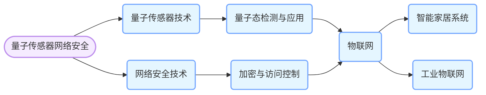

# 巴菲特 - 芒格的量子传感器网络安全投资：物联网的防护盾

> 关键词：巴菲特 - 芒格、量子传感器、网络安全、物联网、投资、防护技术

> 摘要：本文深入探讨了巴菲特 - 芒格在量子传感器网络安全领域的投资意义及其对物联网安全防护的重要性。通过介绍相关核心概念、算法原理、数学模型，结合实际项目案例分析，阐述了量子传感器网络安全技术在物联网中的应用场景和价值。同时，推荐了学习该领域知识的工具和资源，最后总结了未来发展趋势与挑战，并对常见问题进行了解答。

## 1. 背景介绍 
### 1.1 目的和范围
本文章旨在全面剖析巴菲特 - 芒格投资量子传感器网络安全领域这一行为背后的战略意义，以及量子传感器网络安全技术在物联网安全防护方面的具体应用。我们将深入探讨该技术的核心概念、算法原理、数学模型，并通过实际项目案例展示其在实际场景中的应用。同时，为对该领域感兴趣的读者提供学习资源和工具推荐，帮助他们进一步了解和研究这一前沿领域。

### 1.2 预期读者
本文适合对投资领域、网络安全技术、物联网技术等方面感兴趣的人群，包括专业的投资者、网络安全工程师、物联网开发者、科研人员以及相关专业的学生等。无论您是希望了解投资趋势，还是深入研究技术原理，都能从本文中获取有价值的信息。

### 1.3 文档结构概述
本文将按照以下结构展开：首先介绍核心概念与联系，让读者对量子传感器、网络安全和物联网等关键概念有清晰的认识；接着阐述核心算法原理和具体操作步骤，通过 Python 代码进行详细说明；然后讲解数学模型和公式，并举例说明其应用；再通过项目实战部分展示实际案例和代码解读；之后探讨该技术的实际应用场景；推荐学习该领域的工具和资源；总结未来发展趋势与挑战；最后解答常见问题并提供扩展阅读和参考资料。

### 1.4 术语表
#### 1.4.1 核心术语定义
- **量子传感器**：基于量子力学原理工作的传感器，利用量子态的特性（如量子纠缠、量子隧穿等）来实现高精度的物理量测量，具有极高的灵敏度和准确性。
- **网络安全**：通过采取必要措施，防范对网络的攻击、侵入、干扰、破坏和非法使用以及意外事故，使网络处于稳定可靠运行的状态，以及保障网络数据的完整性、保密性、可用性的能力。
- **物联网（IoT）**：通过各种信息传感器、射频识别技术、全球定位系统、红外感应器、激光扫描器等各种装置与技术，实时采集任何需要监控、连接、互动的物体或过程，采集其声、光、热、电、力学、化学、生物、位置等各种需要的信息，通过各类可能的网络接入，实现物与物、物与人的泛在连接，实现对物品和过程的智能化感知、识别和管理。

#### 1.4.2 相关概念解释
- **量子纠缠**：是指在量子力学中，两个或多个粒子之间存在一种特殊的关联，使得一个粒子的状态发生变化时，另一个粒子的状态会立即相应地发生变化，无论它们之间的距离有多远。
- **量子隧穿**：是指微观粒子有一定概率穿过高于自身能量的势垒的量子现象，这一现象在经典物理学中是不可能发生的。

#### 1.4.3 缩略词列表
- **IoT**：Internet of Things，物联网
- **QKD**：Quantum Key Distribution，量子密钥分发

## 2. 核心概念与联系 
### 核心概念原理
#### 量子传感器原理
量子传感器利用量子态的特性来检测物理量。例如，在基于量子纠缠的传感器中，两个纠缠的粒子被分别放置在不同的位置。当一个粒子受到外界物理量（如磁场、电场等）的影响时，其量子态会发生变化，由于量子纠缠的特性，另一个粒子的量子态也会立即发生相应的变化。通过检测第二个粒子的量子态变化，就可以间接测量出外界物理量的大小。

#### 网络安全原理
网络安全的核心是保护网络系统中的硬件、软件和数据不受未经授权的访问、破坏、更改或泄露。常见的网络安全技术包括加密技术、访问控制技术、入侵检测技术等。加密技术通过对数据进行加密，使得只有授权的用户才能解密和访问数据；访问控制技术则通过设置权限和规则，限制用户对网络资源的访问；入侵检测技术则实时监测网络中的异常活动，及时发现并防范潜在的攻击。

#### 物联网原理
物联网通过各种传感器和设备采集物理世界中的数据，并将这些数据通过网络传输到云端或其他处理中心。在云端，数据经过分析和处理后，可以实现对物理世界的智能化管理和控制。例如，智能家居系统可以通过传感器采集室内温度、湿度、光照等数据，根据用户的设定自动调节空调、灯光等设备的运行状态。

### 架构的文本示意图
```plaintext
                 +----------------------+
                 |  量子传感器网络安全  |
                 +----------------------+
                        |        |
                        |        |
                        v        v
         +----------------+   +----------------+
         |  量子传感器技术  |   |  网络安全技术  |
         +----------------+   +----------------+
                        |        |
                        |        |
                        v        v
         +----------------+   +----------------+
         |  量子态检测与应用 |   |  加密与访问控制 |
         +----------------+   +----------------+
                        |        |
                        |        |
                        v        v
                 +----------------------+
                 |        物联网        |
                 +----------------------+
                        |        |
                        |        |
                        v        v
         +----------------+   +----------------+
         |  智能家居系统  |   |  工业物联网  |
         +----------------+   +----------------+
```

### Mermaid 流程图


## 3. 核心算法原理 & 具体操作步骤 
### 量子密钥分发算法原理
量子密钥分发（QKD）是量子传感器网络安全中的核心算法之一，它利用量子态的特性来实现安全的密钥分发。其中最著名的是 BB84 协议，下面我们通过 Python 代码来详细阐述其原理。

```python
import random

# 定义量子比特的基
BASIS = ['+', 'x']

# 生成随机的基序列
def generate_basis(length):
    return [random.choice(BASIS) for _ in range(length)]

# 生成随机的比特序列
def generate_bits(length):
    return [random.randint(0, 1) for _ in range(length)]

# 根据基和比特生成量子态
def encode_quantum_state(basis, bit):
    if basis == '+':
        if bit == 0:
            return '|0>'
        else:
            return '|1>'
    else:
        if bit == 0:
            return '|+>'
        else:
            return '|->'

# 根据基测量量子态
def measure_quantum_state(basis, state):
    if basis == '+':
        if state == '|0>':
            return 0
        elif state == '|1>':
            return 1
        else:
            # 随机测量结果
            return random.randint(0, 1)
    else:
        if state == '|+>':
            return 0
        elif state == '|->':
            return 1
        else:
            # 随机测量结果
            return random.randint(0, 1)

# 执行 BB84 协议
def bb84_protocol(length):
    # 发送方生成基和比特序列
    sender_basis = generate_basis(length)
    sender_bits = generate_bits(length)

    # 生成量子态序列
    quantum_states = [encode_quantum_state(sender_basis[i], sender_bits[i]) for i in range(length)]

    # 接收方生成基序列
    receiver_basis = generate_basis(length)

    # 接收方测量量子态
    receiver_bits = [measure_quantum_state(receiver_basis[i], quantum_states[i]) for i in range(length)]

    # 双方公开基序列，筛选出相同基对应的比特
    shared_key = []
    for i in range(length):
        if sender_basis[i] == receiver_basis[i]:
            shared_key.append(sender_bits[i])

    return shared_key

# 示例运行
key_length = 100
shared_key = bb84_protocol(key_length)
print("Shared key length:", len(shared_key))
print("Shared key:", shared_key)
```

### 具体操作步骤
1. **发送方操作**：
    - 生成随机的基序列和比特序列。
    - 根据基和比特生成量子态序列。
    - 将量子态序列发送给接收方。
2. **接收方操作**：
    - 生成随机的基序列。
    - 使用自己的基序列测量接收到的量子态，得到比特序列。
3. **密钥筛选**：
    - 双方公开自己的基序列。
    - 筛选出双方基序列相同的位置对应的比特，这些比特组成共享密钥。

## 4. 数学模型和公式 & 详细讲解 & 举例说明 
### 量子态的数学表示
在量子力学中，量子态可以用向量来表示。例如，一个量子比特的状态可以用二维向量空间中的向量来表示：
$$
|0\rangle = \begin{pmatrix} 1 \\ 0 \end{pmatrix}, \quad |1\rangle = \begin{pmatrix} 0 \\ 1 \end{pmatrix}
$$
这两个向量构成了量子比特的标准基。另外，还有一组基称为 Hadamard 基：
$$
|+\rangle = \frac{1}{\sqrt{2}}(|0\rangle + |1\rangle), \quad |-\rangle = \frac{1}{\sqrt{2}}(|0\rangle - |1\rangle)
$$

### 量子测量的数学模型
量子测量是量子力学中的一个重要概念。当对一个量子态进行测量时，会得到一个确定的结果，并且量子态会塌缩到与测量结果对应的本征态。例如，当对处于 $|+\rangle$ 态的量子比特进行 $|0\rangle$ 和 $|1\rangle$ 基的测量时，得到 $|0\rangle$ 态的概率为：
$$
P(|0\rangle) = |\langle 0| + \rangle|^2 = \left|\frac{1}{\sqrt{2}}\langle 0| (|0\rangle + |1\rangle)\right|^2 = \frac{1}{2}
$$
得到 $|1\rangle$ 态的概率也为 $\frac{1}{2}$。

### 举例说明
假设发送方要发送一个量子比特，其状态为 $|+\rangle$，接收方使用 $|0\rangle$ 和 $|1\rangle$ 基进行测量。根据上述概率公式，接收方得到 $|0\rangle$ 态的概率为 $\frac{1}{2}$，得到 $|1\rangle$ 态的概率也为 $\frac{1}{2}$。这意味着接收方测量的结果是随机的，并且每次测量后量子态会塌缩到测量结果对应的本征态。

## 5. 项目实战：代码实际案例和详细解释说明 
### 5.1  开发环境搭建
为了实现量子传感器网络安全相关的项目，我们需要搭建以下开发环境：
- **Python 环境**：建议使用 Python 3.7 及以上版本。可以从 Python 官方网站（https://www.python.org/downloads/）下载并安装。
- **开发工具**：推荐使用 PyCharm 作为集成开发环境（IDE），它提供了丰富的代码编辑、调试和管理功能。可以从 JetBrains 官方网站（https://www.jetbrains.com/pycharm/download/）下载并安装。
- **相关库**：在量子计算和网络安全领域，常用的库包括 `qiskit`（用于量子计算模拟）、`cryptography`（用于加密和解密操作）等。可以使用以下命令进行安装：
```bash
pip install qiskit cryptography
```

### 5.2  源代码详细实现和代码解读
下面我们实现一个简单的基于量子密钥分发的加密通信示例。

```python
from qiskit import QuantumCircuit, Aer, execute
from cryptography.fernet import Fernet
import base64

# 执行量子密钥分发
def quantum_key_distribution(length):
    backend = Aer.get_backend('qasm_simulator')
    sender_basis = [random.randint(0, 1) for _ in range(length)]
    sender_bits = [random.randint(0, 1) for _ in range(length)]

    circuit = QuantumCircuit(length, length)
    for i in range(length):
        if sender_bits[i] == 1:
            circuit.x(i)
        if sender_basis[i] == 1:
            circuit.h(i)

    circuit.barrier()

    receiver_basis = [random.randint(0, 1) for _ in range(length)]
    for i in range(length):
        if receiver_basis[i] == 1:
            circuit.h(i)
        circuit.measure(i, i)

    job = execute(circuit, backend, shots=1)
    result = job.result()
    counts = result.get_counts(circuit)
    receiver_bits = [int(bit) for bit in list(counts.keys())[0][::-1]]

    shared_key = []
    for i in range(length):
        if sender_basis[i] == receiver_basis[i]:
            shared_key.append(sender_bits[i])

    return shared_key

# 将二进制密钥转换为可用于加密的密钥
def convert_key_to_fernet_key(shared_key):
    binary_key = ''.join(str(bit) for bit in shared_key)
    # 截取 256 位
    binary_key = binary_key[:256]
    # 转换为字节
    byte_key = int(binary_key, 2).to_bytes(32, byteorder='big')
    fernet_key = base64.urlsafe_b64encode(byte_key)
    return fernet_key

# 加密消息
def encrypt_message(message, key):
    f = Fernet(key)
    encrypted_message = f.encrypt(message.encode())
    return encrypted_message

# 解密消息
def decrypt_message(encrypted_message, key):
    f = Fernet(key)
    decrypted_message = f.decrypt(encrypted_message).decode()
    return decrypted_message

# 示例运行
key_length = 256
shared_key = quantum_key_distribution(key_length)
fernet_key = convert_key_to_fernet_key(shared_key)

message = "Hello, Quantum World!"
encrypted_message = encrypt_message(message, fernet_key)
decrypted_message = decrypt_message(encrypted_message, fernet_key)

print("Original message:", message)
print("Encrypted message:", encrypted_message)
print("Decrypted message:", decrypted_message)
```

### 5.3  代码解读与分析
1. **量子密钥分发部分**：
    - 发送方生成随机的基序列和比特序列，并根据这些序列构建量子电路。
    - 接收方生成随机的基序列，并对量子态进行测量。
    - 双方筛选出相同基对应的比特，组成共享密钥。
2. **密钥转换部分**：
    - 将二进制的共享密钥转换为可用于 `Fernet` 加密算法的密钥。
3. **加密和解密部分**：
    - 使用 `Fernet` 加密算法对消息进行加密和解密操作。

## 6. 实际应用场景 
### 智能家居系统
在智能家居系统中，量子传感器可以用于检测各种环境参数，如温度、湿度、光照等。同时，量子传感器网络安全技术可以保障这些传感器与智能家居控制中心之间的通信安全，防止黑客攻击和数据泄露。例如，通过量子密钥分发技术，可以为智能家居设备之间的通信提供安全的密钥，确保数据在传输过程中的保密性和完整性。

### 工业物联网
在工业物联网中，大量的传感器和设备需要实时采集和传输数据。量子传感器网络安全技术可以保障这些数据的安全传输，防止工业控制系统受到攻击。例如，在智能制造工厂中，量子传感器可以用于监测设备的运行状态，而量子密钥分发技术可以为设备之间的通信提供安全保障，确保生产过程的稳定性和可靠性。

### 医疗物联网
在医疗物联网中，量子传感器可以用于监测患者的生命体征，如心率、血压、血糖等。量子传感器网络安全技术可以保障这些医疗数据的安全传输和存储，防止患者隐私泄露。例如，医院可以使用量子密钥分发技术为医疗设备与医疗信息系统之间的通信提供安全的密钥，确保患者的医疗数据得到妥善保护。

## 7. 工具和资源推荐
### 7.1 学习资源推荐
#### 7.1.1 书籍推荐
- 《量子计算与量子信息》（*Quantum Computation and Quantum Information*）：由 Michael A. Nielsen 和 Isaac L. Chuang 所著，是量子计算领域的经典教材，详细介绍了量子力学基础、量子算法、量子信息处理等方面的知识。
- 《网络安全基础教程：应用与标准》（*Foundations of Network Security: Applications and Standards*）：由 Douglas A. Comer 所著，全面介绍了网络安全的基本概念、技术和标准，包括加密技术、访问控制、入侵检测等方面的内容。
- 《物联网：技术、应用与标准》（*Internet of Things: Technologies, Applications and Standards*）：由 Krishna M. Sivalingam 等所著，详细介绍了物联网的体系结构、传感器技术、通信技术、数据处理等方面的知识。

#### 7.1.2 在线课程
- Coursera 上的 “量子计算基础”（*Quantum Computing for Everyone*）课程：由密歇根大学提供，适合初学者了解量子计算的基本概念和原理。
- edX 上的 “网络安全基础”（*Fundamentals of Cybersecurity*）课程：由 IBM 提供，系统介绍了网络安全的基础知识和技能。
- Udemy 上的 “物联网开发实战”（*Internet of Things (IoT) Development from Scratch*）课程：通过实际项目案例，教授物联网开发的技术和方法。

#### 7.1.3 技术博客和网站
- Quantum Computing Report（https://www.quantumcomputingreport.com/）：提供量子计算领域的最新新闻、技术文章和市场分析。
- The Hacker News（https://thehackernews.com/）：专注于网络安全领域的新闻和技术文章，涵盖了各种网络安全事件和漏洞分析。
- IoT For All（https://www.iotforall.com/）：提供物联网领域的最新技术、应用案例和行业动态。

### 7.2 开发工具框架推荐
#### 7.2.1 IDE和编辑器
- PyCharm：功能强大的 Python 集成开发环境，提供了代码编辑、调试、版本控制等丰富的功能。
- Visual Studio Code：轻量级的代码编辑器，支持多种编程语言和插件扩展，适合快速开发和调试。

#### 7.2.2 调试和性能分析工具
- Qiskit 自带的调试工具：可以帮助开发者调试量子电路和模拟量子计算过程。
- Wireshark：网络协议分析工具，可以用于捕获和分析网络数据包，帮助开发者调试网络通信问题。

#### 7.2.3 相关框架和库
- Qiskit：IBM 开发的开源量子计算框架，提供了量子电路设计、模拟和执行等功能。
- Cryptography：Python 中的加密库，提供了各种加密算法和工具，方便开发者实现加密和解密操作。
- MQTT：轻量级的消息传输协议，广泛应用于物联网设备之间的通信。

### 7.3 相关论文著作推荐
#### 7.3.1 经典论文
- Bennett, C. H., & Brassard, G. (1984). Quantum cryptography: Public key distribution and coin tossing. In Proceedings of the IEEE International Conference on Computers, Systems, and Signal Processing (pp. 175-179). 该论文提出了著名的 BB84 量子密钥分发协议。
- Shor, P. W. (1994). Algorithms for quantum computation: Discrete logarithms and factoring. In Proceedings of the 35th Annual Symposium on Foundations of Computer Science (pp. 124-134). 该论文提出了 Shor 算法，证明了量子计算机在某些问题上具有比经典计算机更高的计算效率。

#### 7.3.2 最新研究成果
- 可以关注 Quantum Science and Technology、IEEE Transactions on Information Forensics and Security 等学术期刊，获取量子计算和网络安全领域的最新研究成果。

#### 7.3.3 应用案例分析
- 可以参考一些行业报告和案例研究，了解量子传感器网络安全技术在实际应用中的效果和经验教训。例如，一些知名咨询公司发布的关于物联网安全和量子技术应用的报告。

## 8. 总结：未来发展趋势与挑战
### 未来发展趋势
- **技术融合**：量子传感器网络安全技术将与人工智能、大数据等技术深度融合，实现更智能、更高效的物联网安全防护。例如，利用人工智能算法对量子传感器采集的数据进行分析，及时发现潜在的安全威胁。
- **应用拓展**：该技术将在更多领域得到应用，如智能交通、能源管理、金融服务等。随着物联网的不断发展，对网络安全的需求也将越来越高，量子传感器网络安全技术将为这些领域提供可靠的安全保障。
- **产业发展**：量子传感器网络安全领域将形成完整的产业链，包括量子传感器制造、量子密钥分发设备研发、网络安全服务等环节。这将带动相关产业的发展，创造更多的就业机会和经济效益。

### 挑战
- **技术难题**：量子传感器的制造和量子密钥分发技术仍然面临一些技术难题，如量子态的稳定性、量子信号的传输损耗等。这些问题需要进一步的研究和技术突破来解决。
- **成本问题**：目前，量子传感器和量子密钥分发设备的成本较高，限制了其大规模应用。未来需要通过技术创新和产业规模化来降低成本，提高该技术的性价比。
- **标准和法规**：量子传感器网络安全领域缺乏统一的标准和法规，这给技术的推广和应用带来了一定的困难。需要相关部门和行业组织加强合作，制定统一的标准和法规，规范市场秩序。

## 9. 附录：常见问题与解答
### 问题 1：量子传感器网络安全技术与传统网络安全技术有什么区别？
答：传统网络安全技术主要基于数学算法和加密技术，其安全性依赖于计算复杂度。而量子传感器网络安全技术利用量子力学原理，如量子纠缠和量子不可克隆定理，提供了更高的安全性。量子密钥分发技术可以实现无条件安全的密钥分发，即使攻击者拥有无限的计算能力，也无法破解密钥。

### 问题 2：量子传感器网络安全技术在实际应用中面临哪些挑战？
答：主要面临技术难题、成本问题和标准法规等方面的挑战。技术上，量子态的稳定性和量子信号的传输损耗是需要解决的关键问题；成本方面，量子传感器和量子密钥分发设备的价格较高，限制了其大规模应用；标准法规方面，目前缺乏统一的标准和法规，影响了技术的推广和应用。

### 问题 3：如何学习量子传感器网络安全技术？
答：可以通过阅读相关的书籍和论文、参加在线课程、关注技术博客和网站等方式来学习。同时，建议结合实际项目进行实践，加深对该技术的理解和掌握。可以使用 Qiskit 等开源框架进行量子计算模拟和开发，使用 Cryptography 等库进行加密和解密操作。

## 10. 扩展阅读 & 参考资料
- Nielsen, M. A., & Chuang, I. L. (2000). Quantum Computation and Quantum Information. Cambridge University Press.
- Comer, D. A. (2013). Foundations of Network Security: Applications and Standards. Pearson.
- Sivalingam, K. M., et al. (2018). Internet of Things: Technologies, Applications and Standards. CRC Press.
- Bennett, C. H., & Brassard, G. (1984). Quantum cryptography: Public key distribution and coin tossing. In Proceedings of the IEEE International Conference on Computers, Systems, and Signal Processing (pp. 175-179).
- Shor, P. W. (1994). Algorithms for quantum computation: Discrete logarithms and factoring. In Proceedings of the 35th Annual Symposium on Foundations of Computer Science (pp. 124-134).

作者：AI天才研究院/AI Genius Institute & 禅与计算机程序设计艺术 /Zen And The Art of Computer Programming