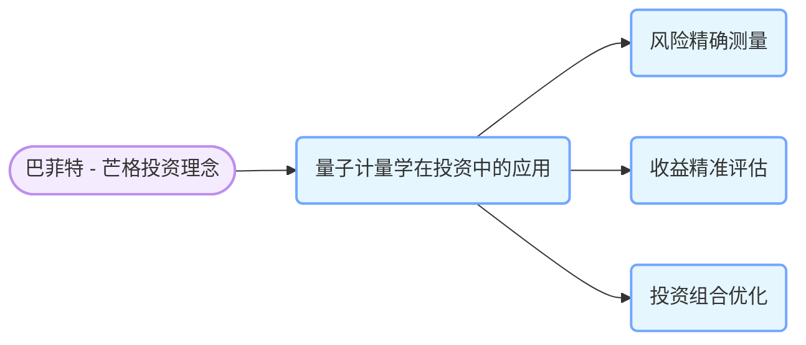

# 巴菲特 - 芒格的量子计量学投资：精密测量的新时代

> 关键词：巴菲特 - 芒格、量子计量学、投资、精密测量、新时代金融

> 摘要：本文深入探讨了巴菲特 - 芒格投资理念与量子计量学相结合所开启的精密测量新时代。通过对量子计量学核心概念、算法原理、数学模型的详细剖析，结合项目实战案例展示其在投资领域的具体应用。同时，介绍了相关的实际应用场景、工具和资源，并对未来发展趋势与挑战进行了总结。旨在为投资者和相关领域研究者提供全面且深入的视角，以更好地理解和运用这一新兴投资模式。

## 1. 背景介绍 

### 1.1 目的和范围
本文章旨在深入剖析巴菲特 - 芒格的投资理念与量子计量学的融合，探讨这种融合如何开启投资领域精密测量的新时代。研究范围涵盖量子计量学的基本原理、相关算法、数学模型，以及其在实际投资项目中的应用。通过全面的分析，为投资者和金融从业者提供新的投资思路和方法，同时为相关领域的研究者提供理论和实践参考。

### 1.2 预期读者
本文的预期读者包括对投资领域有深入研究的专业投资者、金融分析师、基金经理等，他们希望通过引入新的技术和理念来优化投资策略。同时，也适合对量子计量学在金融领域应用感兴趣的科研人员和学者，以及对新兴投资模式有探索欲望的金融爱好者。

### 1.3 文档结构概述
本文将按照以下结构展开：首先介绍核心概念与联系，明确量子计量学在投资中的关键概念和架构；接着详细阐述核心算法原理和具体操作步骤，通过 Python 代码进行说明；然后讲解数学模型和公式，并举例说明其在投资中的应用；随后通过项目实战案例展示代码实现和详细解读；之后探讨实际应用场景；再推荐相关的工具和资源；最后总结未来发展趋势与挑战，并提供常见问题解答和扩展阅读参考资料。

### 1.4 术语表
#### 1.4.1 核心术语定义
- **巴菲特 - 芒格投资理念**：以沃伦·巴菲特和查理·芒格为代表的价值投资理念，强调寻找具有长期竞争优势、稳定现金流和合理估值的企业进行投资。
- **量子计量学**：利用量子力学原理进行高精度测量的学科，通过对量子系统的观测和控制，实现对物理量的精确测量。
- **精密测量**：在投资领域中，指通过精确的数据分析和模型计算，对投资标的的价值、风险等因素进行准确评估。

#### 1.4.2 相关概念解释
- **量子态**：量子系统的状态，是量子计量学中进行测量的基础。不同的量子态具有不同的物理性质，可以用于表示和测量各种物理量。
- **投资组合优化**：根据投资者的风险偏好和投资目标，通过合理配置不同的投资标的，实现投资组合的风险最小化和收益最大化。

#### 1.4.3 缩略词列表
- **QIP**：Quantum Information Processing（量子信息处理）
- **MVO**：Mean - Variance Optimization（均值 - 方差优化）

## 2. 核心概念与联系 

### 核心概念原理
量子计量学的核心原理基于量子力学的特性，如量子叠加和量子纠缠。在量子叠加中，一个量子系统可以同时处于多个状态的叠加态，这使得量子系统能够在同一时间处理多个信息。例如，一个量子比特（qubit）可以同时表示 0 和 1 的叠加态，而传统的比特只能表示 0 或 1。

在投资领域，量子计量学的应用可以帮助投资者更精确地测量投资标的的各种参数，如风险、收益、相关性等。通过量子态的制备和测量，可以获取比传统方法更准确的数据，从而优化投资决策。

### 架构的文本示意图
```plaintext
                巴菲特 - 芒格投资理念
                        |
                        |  融合
                        v
            量子计量学在投资中的应用
            /             |             \
风险精确测量      收益精准评估      投资组合优化
```

### Mermaid 流程图


## 3. 核心算法原理 & 具体操作步骤 

### 算法原理
在量子计量学投资中，一个重要的算法是基于量子态估计的参数测量算法。该算法的基本思想是通过制备特定的量子态，对投资标的的相关参数进行测量。例如，对于股票的收益率，可以通过量子态的演化和测量来获取更精确的估计值。

### Python 源代码阐述
以下是一个简单的示例代码，模拟基于量子态估计的收益率测量过程：

```python
import numpy as np

# 定义量子态
def create_quantum_state():
    # 假设一个简单的两能级量子系统
    state = np.array([1, 0])  # 初始态为 |0>
    return state

# 模拟量子态演化
def quantum_evolution(state, time):
    # 简单的旋转演化
    theta = 0.1 * time
    rotation_matrix = np.array([[np.cos(theta), -np.sin(theta)],
                                [np.sin(theta), np.cos(theta)]])
    new_state = np.dot(rotation_matrix, state)
    return new_state

# 模拟测量过程
def measure_state(state):
    probabilities = np.abs(state) ** 2
    measurement_result = np.random.choice([0, 1], p=probabilities)
    return measurement_result

# 模拟多次测量获取收益率估计
def estimate_return(num_measurements, time):
    returns = []
    for _ in range(num_measurements):
        state = create_quantum_state()
        evolved_state = quantum_evolution(state, time)
        result = measure_state(evolved_state)
        # 简单假设测量结果为 0 表示负收益，1 表示正收益
        if result == 0:
            returns.append(-0.01)
        else:
            returns.append(0.01)
    average_return = np.mean(returns)
    return average_return

# 进行测量
num_measurements = 1000
time = 10
estimated_return = estimate_return(num_measurements, time)
print(f"Estimated return: {estimated_return}")
```

### 具体操作步骤
1. **量子态制备**：根据投资标的的特点和需要测量的参数，制备合适的量子态。例如，对于多个股票的投资组合，可以制备多量子比特的量子态。
2. **量子态演化**：让制备好的量子态按照一定的规则进行演化，这个规则可以根据投资模型和物理规律来确定。
3. **测量过程**：对演化后的量子态进行测量，得到测量结果。测量结果可以用于估计投资标的的参数，如收益率、风险等。
4. **多次测量和统计分析**：为了提高测量的准确性，需要进行多次测量，并对测量结果进行统计分析，得到更精确的参数估计值。

## 4. 数学模型和公式 & 详细讲解 & 举例说明 

### 数学模型
在量子计量学投资中，常用的数学模型是基于量子态的密度矩阵和测量算符。设 $\rho$ 为量子系统的密度矩阵，表示系统的状态，$M$ 为测量算符。测量结果的期望值可以表示为：

$$\langle M\rangle = \text{Tr}(\rho M)$$

其中 $\text{Tr}$ 表示矩阵的迹运算。

### 详细讲解
密度矩阵 $\rho$ 是一个半正定的矩阵，其对角元素表示系统处于各个本征态的概率。测量算符 $M$ 是一个厄米矩阵，其本征值对应着测量的可能结果。通过计算 $\text{Tr}(\rho M)$，可以得到测量结果的期望值。

在投资领域，我们可以将不同的投资参数（如收益率、风险等）与不同的测量算符相对应，通过测量量子系统的状态来获取这些参数的估计值。

### 举例说明
假设我们有一个两能级的量子系统，其密度矩阵为：

$$\rho = \begin{pmatrix}
0.6 & 0.2 \\
0.2 & 0.4
\end{pmatrix}$$

测量算符为：

$$M = \begin{pmatrix}
1 & 0 \\
0 & -1
\end{pmatrix}$$

则测量结果的期望值为：

$$\langle M\rangle = \text{Tr}(\rho M) = 0.6\times1 + 0.4\times(-1) = 0.2$$

这个期望值可以对应着投资标的的某种参数，如预期收益率。

## 5. 项目实战：代码实际案例和详细解释说明 

### 5.1 开发环境搭建
- **Python 环境**：建议使用 Python 3.7 及以上版本，可以通过 Anaconda 或官方 Python 网站进行安装。
- **相关库安装**：需要安装 NumPy、SciPy 等科学计算库，以及 Matplotlib 用于数据可视化。可以使用以下命令进行安装：
```bash
pip install numpy scipy matplotlib
```

### 5.2 源代码详细实现和代码解读
以下是一个更完整的项目实战代码，用于基于量子计量学的投资组合优化：

```python
import numpy as np
import matplotlib.pyplot as plt

# 定义量子态制备函数
def create_quantum_state(num_assets):
    # 初始态为均匀叠加态
    state = np.ones(2**num_assets) / np.sqrt(2**num_assets)
    return state

# 模拟量子态演化
def quantum_evolution(state, time, correlation_matrix):
    # 简单的演化模型，与相关性矩阵有关
    theta = 0.1 * time
    evolution_matrix = np.eye(2**num_assets)
    for i in range(num_assets):
        for j in range(i + 1, num_assets):
            factor = correlation_matrix[i, j]
            rotation_matrix = np.array([[np.cos(theta * factor), -np.sin(theta * factor)],
                                        [np.sin(theta * factor), np.cos(theta * factor)]])
            # 扩展到多量子比特空间
            gate_matrix = np.eye(2**num_assets)
            gate_matrix[i * 2:(i + 1) * 2, i * 2:(i + 1) * 2] = rotation_matrix
            evolution_matrix = np.dot(gate_matrix, evolution_matrix)
    new_state = np.dot(evolution_matrix, state)
    return new_state

# 模拟测量过程
def measure_state(state):
    probabilities = np.abs(state) ** 2
    measurement_result = np.random.choice(2**num_assets, p=probabilities)
    # 将测量结果转换为投资组合权重
    binary_result = np.binary_repr(measurement_result, width=num_assets)
    weights = np.array([int(bit) for bit in binary_result]) / num_assets
    return weights

# 计算投资组合的收益和风险
def calculate_portfolio_metrics(weights, returns, covariance_matrix):
    portfolio_return = np.dot(weights, returns)
    portfolio_risk = np.sqrt(np.dot(weights.T, np.dot(covariance_matrix, weights)))
    return portfolio_return, portfolio_risk

# 主函数
def main(num_assets, num_measurements, time, returns, covariance_matrix):
    all_returns = []
    all_risks = []
    for _ in range(num_measurements):
        state = create_quantum_state(num_assets)
        evolved_state = quantum_evolution(state, time, covariance_matrix)
        weights = measure_state(evolved_state)
        portfolio_return, portfolio_risk = calculate_portfolio_metrics(weights, returns, covariance_matrix)
        all_returns.append(portfolio_return)
        all_risks.append(portfolio_risk)
    return all_returns, all_risks

# 示例数据
num_assets = 3
num_measurements = 1000
time = 10
returns = np.array([0.1, 0.15, 0.08])
covariance_matrix = np.array([[0.1, 0.05, 0.02],
                              [0.05, 0.12, 0.03],
                              [0.02, 0.03, 0.09]])

# 运行主函数
all_returns, all_risks = main(num_assets, num_measurements, time, returns, covariance_matrix)

# 绘制风险 - 收益图
plt.scatter(all_risks, all_returns)
plt.xlabel('Risk')
plt.ylabel('Return')
plt.title('Quantum - based Portfolio Optimization')
plt.show()
```

### 代码解读与分析
1. **量子态制备**：`create_quantum_state` 函数创建了一个均匀叠加态的量子态，用于表示投资组合的初始状态。
2. **量子态演化**：`quantum_evolution` 函数根据投资标的之间的相关性矩阵对量子态进行演化，模拟投资过程中的动态变化。
3. **测量过程**：`measure_state` 函数对演化后的量子态进行测量，并将测量结果转换为投资组合的权重。
4. **投资组合指标计算**：`calculate_portfolio_metrics` 函数根据投资组合的权重、预期收益率和协方差矩阵计算投资组合的收益和风险。
5. **主函数**：`main` 函数多次运行量子态制备、演化和测量过程，得到多个投资组合的收益和风险数据，并通过绘图展示结果。

通过这个项目实战，我们可以看到如何利用量子计量学的思想进行投资组合优化，通过模拟量子态的演化和测量，得到不同的投资组合方案，并分析其收益和风险特征。

## 6. 实际应用场景 
### 股票投资
在股票投资中，量子计量学可以帮助投资者更精确地评估股票的风险和收益。通过对股票市场中各种因素的量子态建模和测量，可以获取更准确的股票价格走势预测，从而优化投资组合的配置。例如，对于不同行业的股票，可以通过量子计量学方法分析它们之间的相关性，避免过度集中投资于相关性较高的股票，降低投资风险。

### 基金投资
对于基金投资，量子计量学可以用于评估基金经理的投资能力和基金的业绩表现。通过对基金的持仓数据、历史收益率等信息进行量子态分析，可以更准确地判断基金的风险调整后收益，帮助投资者选择更合适的基金产品。同时，也可以利用量子计量学优化基金的资产配置，提高基金的整体绩效。

### 风险管理
在金融机构的风险管理中，量子计量学可以用于精确测量各种风险因素，如市场风险、信用风险等。通过建立量子风险模型，对风险因素进行量子态表示和测量，可以更及时地发现潜在的风险，并采取相应的风险控制措施。例如，在银行的信贷风险管理中，可以利用量子计量学评估借款人的信用风险，提高信贷决策的准确性。

## 7. 工具和资源推荐

### 7.1 学习资源推荐
#### 7.1.1 书籍推荐
- 《量子力学导论》：全面介绍量子力学的基本原理和概念，为理解量子计量学提供坚实的理论基础。
- 《价值投资：从格雷厄姆到巴菲特》：深入阐述巴菲特 - 芒格的价值投资理念，帮助读者了解投资的基本逻辑。
- 《金融计量学》：讲解金融领域中常用的计量方法和模型，与量子计量学在投资中的应用有一定的关联。

#### 7.1.2 在线课程
- Coursera 上的“Quantum Computing for Everyone”：该课程从基础开始介绍量子计算的原理和应用，适合初学者了解量子相关知识。
- edX 上的“Value Investing Principles”：由知名教授授课，详细讲解价值投资的原则和方法。

#### 7.1.3 技术博客和网站
- Quantum Computing Report：提供量子计算领域的最新技术动态和研究成果，包括量子计量学的相关进展。
- Seeking Alpha：专注于金融投资领域的博客平台，有许多关于价值投资和量化投资的文章。

### 7.2 开发工具框架推荐
#### 7.2.1 IDE和编辑器
- PyCharm：功能强大的 Python 集成开发环境，提供代码编辑、调试、版本控制等一系列功能，适合开发基于 Python 的量子计量学投资项目。
- Jupyter Notebook：交互式的开发环境，方便进行代码编写、数据分析和可视化，对于快速验证量子计量学算法和模型非常有用。

#### 7.2.2 调试和性能分析工具
- Py-Spy：用于分析 Python 程序的性能瓶颈，帮助优化量子计量学算法的运行效率。
- PDB（Python Debugger）：Python 内置的调试工具，可以帮助开发者定位和解决代码中的问题。

#### 7.2.3 相关框架和库
- Qiskit：IBM 开发的开源量子计算框架，提供了量子电路构建、模拟和运行的功能，可用于实现量子计量学算法。
- NumPy 和 SciPy：Python 中常用的科学计算库，提供了丰富的数学函数和数据处理工具，在量子计量学的数值计算中非常有用。

### 7.3 相关论文著作推荐
#### 7.3.1 经典论文
- “Quantum Metrology”：该论文全面介绍了量子计量学的基本原理和方法，是该领域的经典之作。
- “The Superinvestors of Graham - and - Doddsville”：巴菲特的经典论文，阐述了价值投资的理念和成功案例。

#### 7.3.2 最新研究成果
- 关注《Physical Review Letters》《Nature》《Science》等顶级学术期刊，这些期刊经常发表量子计量学和金融投资领域的最新研究成果。
- 参加相关的学术会议，如量子计算与金融应用研讨会，获取最新的研究动态和前沿技术。

#### 7.3.3 应用案例分析
- 一些金融机构和研究机构会发布关于量子计量学在投资领域应用的案例分析报告，可以通过其官方网站或相关金融数据库获取这些报告，了解实际应用中的经验和教训。

## 8. 总结：未来发展趋势与挑战 

### 未来发展趋势
- **更广泛的应用**：随着量子技术的不断发展，量子计量学在投资领域的应用将越来越广泛。不仅会在股票、基金等传统投资领域得到更深入的应用，还可能拓展到新兴的金融市场，如加密货币市场。
- **与人工智能的融合**：量子计量学与人工智能技术的融合将成为未来的一个重要趋势。通过结合量子计算的强大计算能力和人工智能的机器学习算法，可以更高效地处理复杂的投资数据，提高投资决策的准确性和效率。
- **跨学科研究的加强**：量子计量学投资涉及量子物理、金融数学、计算机科学等多个学科领域，未来跨学科研究将不断加强，促进各学科之间的知识交流和技术融合，推动该领域的快速发展。

### 挑战
- **技术成熟度**：目前量子技术仍处于发展阶段，量子计算机的稳定性、可扩展性等方面还存在一定的问题。在实际应用中，需要克服这些技术难题，确保量子计量学算法的准确运行。
- **数据安全**：量子计量学投资需要处理大量的金融数据，这些数据涉及投资者的隐私和金融安全。在量子计算环境下，传统的数据加密方法可能面临挑战，需要开发新的数据安全技术来保障数据的安全。
- **人才短缺**：量子计量学投资是一个新兴领域，需要具备量子物理、金融投资和计算机编程等多方面知识的复合型人才。目前这类人才相对短缺，限制了该领域的发展速度。

## 9. 附录：常见问题与解答 

### 问题 1：量子计量学投资是否适合所有投资者？
解答：量子计量学投资目前仍处于探索和发展阶段，技术和应用还不够成熟。对于普通投资者来说，可能面临较高的门槛和风险。它更适合有一定专业知识和风险承受能力的机构投资者和专业投资者，他们能够更好地理解和应用量子计量学的方法和技术。

### 问题 2：量子计量学投资与传统投资方法有何区别？
解答：传统投资方法主要基于经典的金融理论和统计分析，对投资标的的评估和决策相对较为宏观和粗略。而量子计量学投资利用量子力学的原理进行高精度测量，能够获取更精确的投资数据，从而实现更精准的投资决策。例如，在风险测量方面，量子计量学可以考虑更多的微观因素，提供更细致的风险评估。

### 问题 3：量子计算机的发展对量子计量学投资有何影响？
解答：量子计算机的发展是量子计量学投资的关键驱动力。随着量子计算机性能的不断提升，量子计量学算法的计算速度和准确性将得到显著提高，能够处理更复杂的投资模型和数据。同时，量子计算机的普及也将降低量子计量学投资的成本，使其更易于应用和推广。

### 问题 4：如何学习量子计量学投资？
解答：学习量子计量学投资需要具备一定的量子物理、金融投资和计算机编程基础。可以通过阅读相关的书籍和论文、参加在线课程和学术会议等方式系统学习。同时，结合实际项目进行实践操作，加深对量子计量学投资的理解和应用能力。

## 10. 扩展阅读 & 参考资料
- Nielsen, M. A., & Chuang, I. L. (2010). Quantum Computation and Quantum Information. Cambridge University Press.
- Buffett, W. E. (1984). The Superinvestors of Graham - and - Doddsville. Hermes.
- Giedke, G., & Cirac, J. I. (2003). Quantum Metrology. arXiv preprint quant - ph/0304166.

作者：AI天才研究院/AI Genius Institute & 禅与计算机程序设计艺术 /Zen And The Art of Computer Programming