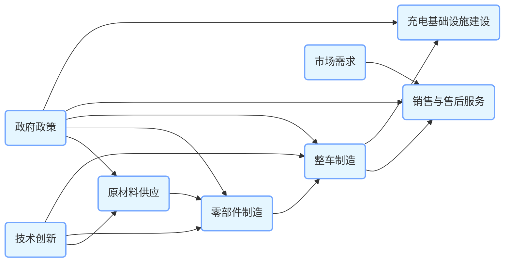

# 巴菲特如何看待电动汽车行业的投资前景

> 关键词：巴菲特、电动汽车行业、投资前景、价值投资、行业趋势

> 摘要：本文围绕巴菲特对电动汽车行业投资前景的看法展开深入探讨。首先介绍了研究该话题的背景和目的，明确预期读者和文档结构。接着阐述了电动汽车行业相关的核心概念及其联系，包括行业架构等内容。详细分析了评估投资前景可能涉及的核心算法原理和操作步骤，结合数学模型和公式进行说明。通过项目实战案例展示了电动汽车企业的实际情况和投资分析过程。探讨了电动汽车行业的实际应用场景，推荐了学习该领域投资的工具和资源。最后总结了电动汽车行业的未来发展趋势与挑战，解答常见问题并提供扩展阅读和参考资料，旨在帮助读者全面了解巴菲特视角下电动汽车行业的投资前景。

## 1. 背景介绍 
### 1.1 目的和范围
巴菲特作为全球著名的投资大师，其投资理念和决策对金融市场有着深远的影响。电动汽车行业作为近年来快速发展的新兴领域，吸引了大量的资本和关注。研究巴菲特如何看待电动汽车行业的投资前景，不仅有助于投资者了解行业的投资价值和潜在风险，还能学习到巴菲特的投资分析方法和决策逻辑。本文的范围主要聚焦于巴菲特公开的言论、投资行为以及电动汽车行业的发展现状和趋势，分析他对该行业投资前景的看法。

### 1.2 预期读者
本文预期读者包括对投资领域感兴趣的个人投资者、金融从业者、电动汽车行业的研究者和从业者，以及关注巴菲特投资理念的人群。通过阅读本文，他们可以获取关于电动汽车行业投资的专业分析和见解，为自己的投资决策或行业研究提供参考。

### 1.3 文档结构概述
本文将按照以下结构进行阐述：首先介绍相关核心概念和联系，让读者对电动汽车行业有基本的了解；接着讲解评估投资前景可能涉及的核心算法原理和具体操作步骤，并结合数学模型和公式进行详细说明；通过项目实战案例，展示如何分析电动汽车企业的投资价值；探讨电动汽车行业的实际应用场景，了解行业的市场需求和发展潜力；推荐学习该领域投资的工具和资源；最后总结行业的未来发展趋势与挑战，解答常见问题并提供扩展阅读和参考资料。

### 1.4 术语表
#### 1.4.1 核心术语定义
- **电动汽车**：是指以车载电源为动力，用电机驱动车轮行驶，符合道路交通、安全法规各项要求的车辆。一般可分为纯电动汽车（BEV）、混合动力汽车（HEV）和插电式混合动力汽车（PHEV）等类型。
- **投资前景**：指某个行业或企业在未来一段时间内的投资价值和潜在回报情况，受到行业发展趋势、市场需求、竞争格局、企业财务状况等多种因素的影响。
- **价值投资**：是一种投资策略，由巴菲特的导师本杰明·格雷厄姆提出，强调通过分析企业的内在价值，以低于其内在价值的价格买入股票，并长期持有，等待企业价值回归和增长。

#### 1.4.2 相关概念解释
- **电动汽车产业链**：包括上游的原材料供应（如锂、钴、镍等金属矿产）、中游的零部件制造（如电池、电机、电控系统等）和整车制造，以及下游的销售、售后服务和充电基础设施建设等环节。
- **行业壁垒**：指新企业进入某个行业时面临的各种障碍，如技术门槛、资金需求、政策法规限制、品牌认知度等。在电动汽车行业，电池技术、研发投入和生产资质等都构成了一定的行业壁垒。

#### 1.4.3 缩略词列表
- **BEV**：Battery Electric Vehicle，纯电动汽车
- **HEV**：Hybrid Electric Vehicle，混合动力汽车
- **PHEV**：Plug-in Hybrid Electric Vehicle，插电式混合动力汽车
- **OEM**：Original Equipment Manufacturer，原始设备制造商

## 2. 核心概念与联系 

### 电动汽车行业架构
电动汽车行业是一个复杂的生态系统，涉及多个环节和参与主体。其架构可以用以下示意图表示：



从图中可以看出，电动汽车行业的核心环节包括原材料供应、零部件制造、整车制造、销售与售后服务以及充电基础设施建设。政府政策、市场需求和技术创新等因素对整个行业的发展起着重要的推动和影响作用。

### 核心概念联系
- **原材料供应与零部件制造**：原材料的供应状况直接影响零部件的生产成本和生产规模。例如，锂、钴等金属是动力电池的重要原材料，如果原材料价格波动或供应短缺，将导致电池成本上升，影响零部件制造商的盈利能力。
- **零部件制造与整车制造**：零部件的质量和性能直接决定了整车的品质和竞争力。优质的电池、电机和电控系统可以提高电动汽车的续航里程、动力性能和安全性，从而提升整车的市场认可度。
- **整车制造与销售、售后服务**：整车的品牌形象和产品质量会影响销售业绩，而完善的售后服务可以提高客户满意度和忠诚度，促进二次销售和品牌口碑传播。
- **充电基础设施建设与市场需求**：充电基础设施的完善程度是影响消费者购买电动汽车的重要因素之一。如果充电不方便，将限制电动汽车的市场普及，反之，良好的充电网络可以刺激市场需求的增长。

## 3. 核心算法原理 & 具体操作步骤 

### 评估企业内在价值的算法原理
在价值投资中，评估企业的内在价值是关键。一种常用的方法是现金流折现法（Discounted Cash Flow，DCF）。其基本原理是将企业未来预期的现金流按照一定的折现率折现到当前，得到企业的内在价值。

Python 代码实现如下：

```python
def dcf_analysis(cash_flows, discount_rate):
    """
    现金流折现法计算企业内在价值
    :param cash_flows: 未来各期的现金流列表
    :param discount_rate: 折现率
    :return: 企业内在价值
    """
    present_value = 0
    for i, cash_flow in enumerate(cash_flows):
        present_value += cash_flow / ((1 + discount_rate) ** (i + 1))
    return present_value

# 示例
cash_flows = [100, 120, 150, 180, 200]  # 未来五年的现金流
discount_rate = 0.1  # 折现率为 10%
intrinsic_value = dcf_analysis(cash_flows, discount_rate)
print(f"企业内在价值: {intrinsic_value}")
```

### 具体操作步骤
1. **预测未来现金流**：分析企业的历史财务数据、行业发展趋势和市场竞争状况，预测企业未来若干年的现金流。这需要考虑企业的营业收入、成本费用、资本支出等因素。
2. **确定折现率**：折现率反映了资金的时间价值和投资风险。一般可以使用加权平均资本成本（WACC）作为折现率，其计算公式为：

$$WACC = E/V \times Re + D/V \times Rd \times (1 - Tc)$$

其中，$E$ 是股权价值，$V$ 是企业总价值（股权价值 + 债务价值），$Re$ 是股权成本，$D$ 是债务价值，$Rd$ 是债务成本，$Tc$ 是企业所得税税率。

3. **计算内在价值**：将预测的未来现金流按照确定的折现率折现到当前，得到企业的内在价值。
4. **比较内在价值和市场价格**：如果企业的内在价值高于市场价格，说明该股票被低估，具有投资价值；反之，如果内在价值低于市场价格，则股票可能被高估，需要谨慎投资。

## 4. 数学模型和公式 & 详细讲解 & 举例说明 

### 现金流折现模型
现金流折现模型的基本公式为：

$$V = \sum_{t=1}^{n} \frac{CF_t}{(1 + r)^t} + \frac{TV}{(1 + r)^n}$$

其中，$V$ 是企业的内在价值，$CF_t$ 是第 $t$ 期的现金流，$r$ 是折现率，$n$ 是预测期数，$TV$ 是终值。

终值可以使用永续增长模型计算：

$$TV = \frac{CF_{n+1}}{r - g}$$

其中，$CF_{n+1}$ 是预测期最后一期下一期的现金流，$g$ 是永续增长率。

### 详细讲解
- **预测期现金流**：在预测期内，需要对企业的营业收入、成本费用等进行详细分析，以确定各期的现金流。一般可以根据企业的历史数据和行业发展趋势进行预测。
- **折现率**：折现率的选择至关重要，它反映了投资的风险和机会成本。较高的折现率意味着投资者对风险的要求较高，会降低企业的内在价值；反之，较低的折现率会提高企业的内在价值。
- **终值**：终值是预测期结束后企业的持续价值。永续增长模型假设企业在预测期结束后将以一个固定的增长率持续增长。永续增长率的选择需要谨慎，一般应根据行业的长期平均增长率和企业的竞争优势来确定。

### 举例说明
假设一家电动汽车企业未来五年的预测现金流分别为 100 万元、120 万元、150 万元、180 万元和 200 万元，折现率为 10%，预测期结束后企业的永续增长率为 3%。则该企业的内在价值计算如下：

1. 计算预测期现金流的现值：

$$PV_{CF} = \frac{100}{(1 + 0.1)^1} + \frac{120}{(1 + 0.1)^2} + \frac{150}{(1 + 0.1)^3} + \frac{180}{(1 + 0.1)^4} + \frac{200}{(1 + 0.1)^5} \approx 593.68$$（万元）

2. 计算终值：

首先计算预测期最后一期下一期的现金流 $CF_{6} = 200 \times (1 + 0.03) = 206$（万元）

$$TV = \frac{206}{0.1 - 0.03} \approx 2942.86$$（万元）

终值的现值为：

$$PV_{TV} = \frac{2942.86}{(1 + 0.1)^5} \approx 1824.47$$（万元）

3. 计算企业的内在价值：

$$V = PV_{CF} + PV_{TV} \approx 593.68 + 1824.47 = 2418.15$$（万元）

## 5. 项目实战：代码实际案例和详细解释说明 

### 5.1  开发环境搭建
- **操作系统**：可以选择 Windows、Linux 或 macOS 等常见操作系统。
- **编程语言**：Python，建议使用 Python 3.7 及以上版本。
- **开发工具**：推荐使用 PyCharm 作为集成开发环境（IDE），它提供了丰富的代码编辑、调试和管理功能。
- **所需库**：需要安装 Pandas、Numpy 等数据处理库，以及 Matplotlib 等可视化库。可以使用以下命令进行安装：

```sh
pip install pandas numpy matplotlib
```

### 5.2  源代码详细实现和代码解读
以下是一个简单的电动汽车企业财务数据分析和投资评估的 Python 代码示例：

```python
import pandas as pd
import numpy as np
import matplotlib.pyplot as plt

# 读取电动汽车企业财务数据
data = pd.read_csv('electric_vehicle_company.csv')

# 数据预处理
# 假设数据包含年份、营业收入、净利润等列
data['Year'] = pd.to_datetime(data['Year'])
data.set_index('Year', inplace=True)

# 计算营业收入和净利润的增长率
data['Revenue_Growth'] = data['Revenue'].pct_change()
data['Profit_Growth'] = data['Profit'].pct_change()

# 可视化营业收入和净利润的变化趋势
plt.figure(figsize=(12, 6))
plt.subplot(2, 1, 1)
plt.plot(data['Revenue'], label='Revenue')
plt.title('Revenue Trend')
plt.xlabel('Year')
plt.ylabel('Revenue')
plt.legend()

plt.subplot(2, 1, 2)
plt.plot(data['Profit'], label='Profit')
plt.title('Profit Trend')
plt.xlabel('Year')
plt.ylabel('Profit')
plt.legend()

plt.tight_layout()
plt.show()

# 计算简单的估值指标：市盈率（PE）
pe_ratio = data['Market_Cap'] / data['Profit']
print(f"平均市盈率: {pe_ratio.mean()}")

# 假设使用现金流折现法评估企业价值
# 这里简单假设未来五年的现金流等于最近一年的净利润，并以 10% 的增长率增长
last_profit = data['Profit'].iloc[-1]
cash_flows = [last_profit * (1 + 0.1) ** i for i in range(5)]
discount_rate = 0.1
intrinsic_value = dcf_analysis(cash_flows, discount_rate)
print(f"企业内在价值: {intrinsic_value}")
```

### 代码解读与分析
1. **数据读取和预处理**：使用 Pandas 库读取电动汽车企业的财务数据，并将年份列转换为日期类型，设置为索引。
2. **增长率计算**：计算营业收入和净利润的增长率，以了解企业的增长趋势。
3. **可视化分析**：使用 Matplotlib 库绘制营业收入和净利润的变化趋势图，直观展示企业的财务状况。
4. **估值指标计算**：计算市盈率（PE），作为一个简单的估值指标。市盈率反映了市场对企业盈利的预期。
5. **现金流折现法评估**：假设未来五年的现金流等于最近一年的净利润，并以 10% 的增长率增长，使用之前定义的 `dcf_analysis` 函数计算企业的内在价值。

通过以上代码，可以对电动汽车企业的财务状况进行初步分析和投资评估。

## 6. 实际应用场景 
### 个人出行
电动汽车在个人出行领域具有广阔的应用前景。随着技术的不断进步，电动汽车的续航里程不断提高，充电时间逐渐缩短，驾驶体验也越来越好。同时，电动汽车的使用成本相对较低，特别是在城市通勤中，具有明显的优势。例如，一些上班族选择购买电动汽车作为日常通勤工具，既环保又经济。

### 公共交通
在公共交通领域，电动汽车也得到了广泛的应用。许多城市已经开始推广电动公交车、电动出租车等，以减少尾气排放，改善城市空气质量。电动公交车具有噪音小、无污染等优点，并且可以通过合理规划充电设施，满足日常运营需求。

### 物流运输
物流运输行业对能源的需求较大，电动汽车的应用可以有效降低物流企业的运营成本。一些快递企业和物流公司已经开始使用电动货车进行货物配送，特别是在城市内的短途配送中，电动汽车的优势更加明显。

### 共享出行
共享出行模式的兴起为电动汽车的应用提供了新的机遇。共享单车、共享汽车等平台纷纷引入电动汽车，为用户提供更加便捷、环保的出行选择。电动汽车的智能化和联网功能也为共享出行的管理和运营提供了便利。

## 7. 工具和资源推荐
### 7.1 学习资源推荐
#### 7.1.1 书籍推荐
- 《聪明的投资者》（The Intelligent Investor）：本杰明·格雷厄姆著，被誉为价值投资的圣经，介绍了价值投资的基本理念和方法。
- 《巴菲特致股东的信：投资者和公司高管教程》（Letters to Shareholders of Berkshire Hathaway）：沃伦·巴菲特著，收录了巴菲特多年来致股东的信，包含了他的投资哲学、企业管理经验等内容。
- 《电动汽车：技术、政策与市场》：详细介绍了电动汽车的技术原理、发展政策和市场趋势，适合对电动汽车行业感兴趣的读者。

#### 7.1.2 在线课程
- Coursera 上的“投资学原理”课程：由知名教授授课，涵盖了投资分析、资产定价等方面的知识。
- edX 上的“电动汽车技术与应用”课程：介绍了电动汽车的关键技术、发展现状和应用前景。

#### 7.1.3 技术博客和网站
- Seeking Alpha：提供了大量的投资分析文章和研究报告，包括对电动汽车行业的深入分析。
- CleanTechnica：专注于清洁能源和电动汽车领域的新闻和分析，及时报道行业的最新动态。

### 7.2 开发工具框架推荐
#### 7.2.1 IDE和编辑器
- PyCharm：功能强大的 Python 集成开发环境，提供了代码编辑、调试、版本控制等一系列功能。
- Jupyter Notebook：交互式的开发环境，适合进行数据分析和模型验证，方便代码的展示和分享。

#### 7.2.2 调试和性能分析工具
- PDB：Python 自带的调试工具，可以帮助开发者定位代码中的问题。
- cProfile：Python 的性能分析工具，可以分析代码的运行时间和函数调用情况，帮助优化代码性能。

#### 7.2.3 相关框架和库
- Pandas：用于数据处理和分析的 Python 库，提供了丰富的数据结构和数据操作方法。
- Numpy：用于科学计算的 Python 库，支持多维数组和矩阵运算。
- Scikit-learn：机器学习库，提供了各种机器学习算法和工具，可用于数据建模和预测。

### 7.3 相关论文著作推荐
#### 7.3.1 经典论文
- “The Capital Asset Pricing Model: Theory and Evidence”：介绍了资本资产定价模型（CAPM），是投资学领域的经典论文。
- “Efficient Capital Markets: A Review of Theory and Empirical Work”：对有效市场假说进行了全面的综述和分析。

#### 7.3.2 最新研究成果
- 可以关注《Journal of Financial Economics》、《Review of Financial Studies》等金融领域的顶级期刊，获取关于电动汽车行业投资的最新研究成果。

#### 7.3.3 应用案例分析
- 一些咨询公司和研究机构会发布关于电动汽车行业的应用案例分析报告，如麦肯锡、波士顿咨询等，这些报告可以帮助读者了解行业内企业的实际运营情况和投资策略。

## 8. 总结：未来发展趋势与挑战
### 未来发展趋势
- **技术创新持续推进**：电动汽车的电池技术、电机技术和电控系统等将不断创新，续航里程将进一步提高，充电时间将大幅缩短。同时，自动驾驶、智能互联等技术也将与电动汽车深度融合，提升用户体验。
- **市场规模不断扩大**：随着消费者环保意识的提高和政府对新能源汽车的支持力度加大，电动汽车的市场需求将持续增长。预计未来几年，全球电动汽车的销量将保持较高的增长率。
- **产业生态逐渐完善**：电动汽车产业链将不断完善，包括原材料供应、零部件制造、整车制造、销售与售后服务、充电基础设施建设等环节将更加协同发展。同时，共享出行、车电分离等新模式也将为行业发展带来新的机遇。

### 挑战
- **电池成本和安全性**：电池是电动汽车的核心部件，其成本和安全性直接影响电动汽车的市场竞争力。目前，电池成本仍然较高，需要进一步降低成本。同时，电池的安全性也是一个重要问题，需要加强技术研发和质量管控。
- **充电基础设施不足**：充电基础设施的不完善是制约电动汽车普及的重要因素之一。虽然近年来充电设施建设取得了一定的进展，但仍然存在分布不均、充电速度慢等问题。需要加大充电基础设施的建设力度，提高充电的便利性和效率。
- **市场竞争加剧**：随着电动汽车市场的不断扩大，越来越多的企业进入该领域，市场竞争将日益激烈。企业需要不断提升自身的技术实力、产品质量和品牌影响力，以在竞争中脱颖而出。

## 9. 附录：常见问题与解答
### 问题 1：巴菲特是否投资了电动汽车行业？
巴菲特旗下的伯克希尔·哈撒韦公司投资了比亚迪。比亚迪是一家中国的电动汽车制造商，在电池技术和电动汽车领域具有较强的实力。巴菲特对比亚迪的投资表明他对电动汽车行业的部分认可。

### 问题 2：如何判断电动汽车企业的投资价值？
可以从多个方面判断电动汽车企业的投资价值，包括企业的财务状况（如营业收入、净利润、现金流等）、技术实力（如电池技术、自动驾驶技术等）、市场份额、品牌影响力、发展战略等。同时，可以使用现金流折现法等估值方法计算企业的内在价值，与市场价格进行比较。

### 问题 3：电动汽车行业的发展对传统燃油汽车行业有什么影响？
电动汽车行业的发展将对传统燃油汽车行业产生巨大的冲击。随着电动汽车技术的不断进步和市场份额的扩大，传统燃油汽车的需求将逐渐减少。传统燃油汽车企业需要加快转型，加大在电动汽车领域的研发和投入，以适应市场的变化。

## 10. 扩展阅读 & 参考资料
- 比亚迪公司官网：获取比亚迪公司的最新产品信息和财务报告。
- 中国汽车工业协会官网：了解中国电动汽车行业的发展动态和统计数据。
- 《金融时报》、《华尔街日报》等财经媒体：获取关于电动汽车行业投资的最新报道和分析。

作者：AI天才研究院/AI Genius Institute & 禅与计算机程序设计艺术 /Zen And The Art of Computer Programming