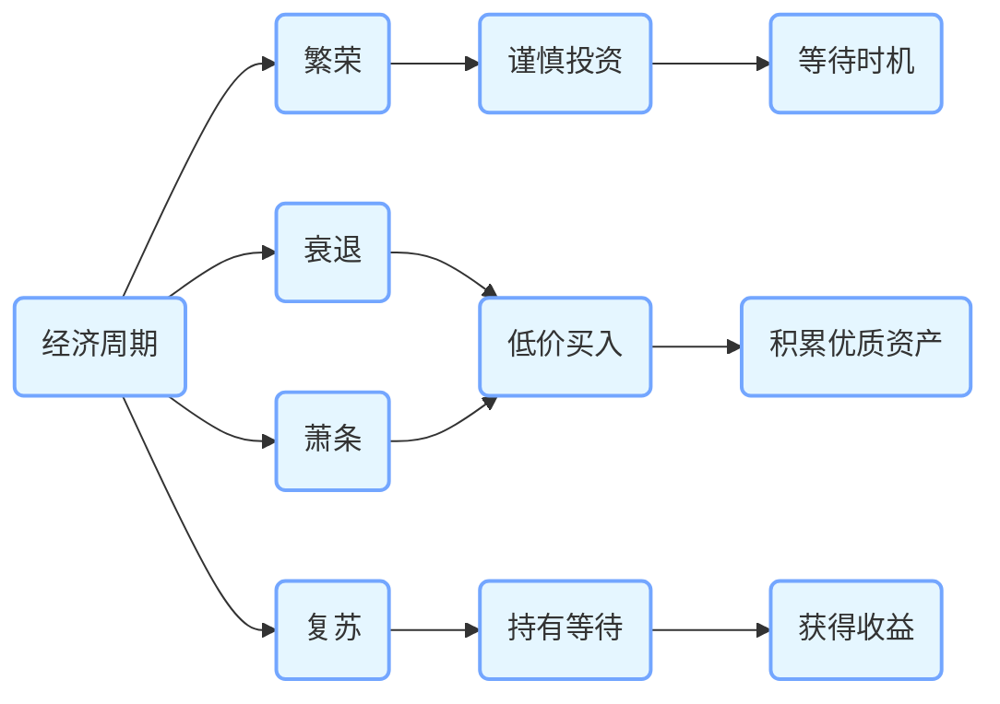

# 巴菲特如何看待经济周期与投资

> 关键词：巴菲特、经济周期、投资理念、价值投资、长期投资

> 摘要：本文深入探讨了股神巴菲特对于经济周期与投资的独特见解。通过对巴菲特投资思想的系统分析，阐述了经济周期的基本概念和特点，以及巴菲特如何在不同经济周期中运用价值投资、长期投资等策略进行决策。文章还结合实际案例，详细解读了巴菲特的投资操作，并对其投资理念在不同应用场景中的效果进行了探讨。此外，提供了学习巴菲特投资思想的相关资源和工具，最后对巴菲特投资理念的未来发展趋势与挑战进行了总结与展望。

## 1. 背景介绍 
### 1.1 目的和范围
本文的目的在于全面剖析巴菲特对于经济周期和投资的看法。通过研究巴菲特的投资哲学、公开言论、投资案例等，深入理解他是如何将经济周期的规律运用到投资决策过程中，以及这种投资理念所带来的实际效果。研究范围涵盖了巴菲特的整个投资生涯，涉及股票、企业并购等多种投资领域，旨在为投资者提供全面且深入的学习和借鉴。

### 1.2 预期读者
本文预期读者包括对投资领域感兴趣的初学者、有一定投资经验但希望提升投资水平的投资者、金融专业的学生以及研究投资理论和实践的学者。无论您是刚刚踏入投资领域，还是已经在市场中摸爬滚打多年，都能从本文中获取有价值的信息和启示。

### 1.3 文档结构概述
本文将按照以下结构展开：首先介绍核心概念，包括经济周期和巴菲特投资理念的相关内容；接着阐述核心算法原理（虽然巴菲特的投资并非严格意义上的算法，但有其内在逻辑）和具体操作步骤；然后通过数学模型和公式对其投资理念进行量化分析；之后结合实际项目案例，详细解读巴菲特的投资操作；再探讨巴菲特投资理念在不同实际场景中的应用；推荐学习巴菲特投资思想的相关工具和资源；最后总结巴菲特投资理念的未来发展趋势与挑战，并提供常见问题解答和扩展阅读参考资料。

### 1.4 术语表
#### 1.4.1 核心术语定义
- **经济周期**：指经济活动沿着经济发展的总体趋势所经历的有规律的扩张和收缩。一般分为繁荣、衰退、萧条和复苏四个阶段。
- **价值投资**：一种寻找被低估股票的投资策略，投资者通过分析公司的基本面，如财务状况、盈利能力、行业地位等，以低于其内在价值的价格买入股票，并长期持有。
- **内在价值**：公司未来现金流的折现值，是价值投资者评估股票是否被低估的重要指标。
- **安全边际**：指股票的市场价格低于其内在价值的差额，是价值投资的重要原则之一，用于降低投资风险。

#### 1.4.2 相关概念解释
- **长期投资**：指投资者买入并持有资产较长时间，通常为数年甚至数十年，以获取资产的长期增值。巴菲特认为长期投资可以避免短期市场波动的影响，更好地实现投资目标。
- **护城河**：巴菲特用来形容企业具有的可持续竞争优势，如品牌优势、成本优势、技术优势等，能够保护企业在市场中持续获得利润。

#### 1.4.3 缩略词列表
- **ROE**：净资产收益率（Return on Equity），反映股东权益的收益水平，用以衡量公司运用自有资本的效率。
- **PEG**：市盈率相对盈利增长比率（Price/Earnings to Growth Ratio），是用公司的市盈率除以公司的盈利增长速度，用于评估股票的估值是否合理。

## 2. 核心概念与联系 

### 2.1 经济周期的概念和特点
经济周期是经济活动中常见的现象，它反映了宏观经济的波动情况。经济周期一般可以分为四个阶段：
- **繁荣阶段**：经济增长迅速，就业充分，企业盈利增加，市场信心高涨，股票市场和房地产市场等资产价格通常会上涨。
- **衰退阶段**：经济增长放缓，企业盈利开始下降，失业率上升，消费者信心下降，资产价格可能会出现回调。
- **萧条阶段**：经济陷入严重衰退，失业率大幅上升，企业大量倒闭，市场需求极度疲软，资产价格大幅下跌。
- **复苏阶段**：经济开始逐渐恢复，企业盈利改善，就业情况好转，消费者信心增强，资产价格开始回升。

经济周期的特点包括周期性波动、不可预测性和不同行业的表现差异。不同行业在经济周期中的表现各不相同，例如，消费必需品行业在经济衰退时通常比较稳定，而周期性行业如钢铁、汽车等则对经济周期更为敏感。

### 2.2 巴菲特的投资理念
巴菲特是价值投资的代表人物，他的投资理念主要包括以下几个方面：
- **价值投资**：寻找被低估的股票，通过分析公司的基本面，评估其内在价值，并以低于内在价值的价格买入。巴菲特认为，股票不仅仅是一张纸，而是代表了公司的一部分所有权，投资者应该关注公司的实际价值而非短期市场波动。
- **长期投资**：巴菲特主张长期持有优质股票，他认为时间是优秀企业的朋友，长期投资可以充分享受企业成长带来的收益，同时避免短期市场波动的干扰。
- **集中投资**：巴菲特倾向于将资金集中投资于少数几家他认为具有竞争优势和长期增长潜力的公司，而不是分散投资于众多股票。他认为这样可以更好地了解和跟踪投资对象，提高投资回报率。
- **安全边际**：在买入股票时，巴菲特会要求有足够的安全边际，即股票的市场价格要显著低于其内在价值。这样可以降低投资风险，即使公司未来的发展不如预期，投资者也不会遭受重大损失。

### 2.3 经济周期与巴菲特投资理念的联系
经济周期对巴菲特的投资决策有着重要的影响。在不同的经济周期阶段，巴菲特会根据市场情况调整投资策略：
- **繁荣阶段**：在经济繁荣时期，市场估值普遍较高，巴菲特会更加谨慎地选择投资标的，避免买入高估的股票。他可能会持有较多的现金，等待更好的投资机会。
- **衰退阶段**：经济衰退时，市场恐慌情绪蔓延，股票价格大幅下跌。巴菲特认为这是寻找被低估股票的好时机，他会利用市场的恐慌情绪，以较低的价格买入那些具有长期竞争优势的公司股票。
- **萧条阶段**：在萧条时期，经济形势严峻，但巴菲特依然坚信优秀企业的价值。他会继续买入那些被市场过度抛售的优质股票，为未来的经济复苏做好准备。
- **复苏阶段**：随着经济的复苏，企业盈利逐渐改善，股票价格开始回升。巴菲特会持有之前买入的股票，享受企业成长带来的收益，同时也会寻找新的投资机会。

### 2.4 核心概念原理和架构的文本示意图
```plaintext
              经济周期
           /   |   |   \
      繁荣  衰退  萧条  复苏
        |       |       |
巴菲特投资策略  谨慎投资  低价买入  持有等待
        |       |       |
投资结果    等待时机  积累优质资产  获得收益
```

### 2.5 Mermaid 流程图


## 3. 核心算法原理 & 具体操作步骤 

### 3.1 核心算法原理
虽然巴菲特的投资并非基于严格的算法，但可以将其投资理念抽象为一个逻辑框架。其核心算法原理可以概括为：
- **评估公司内在价值**：通过分析公司的财务报表、行业地位、竞争优势等因素，估算公司的未来现金流，并将其折现为当前价值，得到公司的内在价值。
- **比较市场价格与内在价值**：将公司的市场价格与估算的内在价值进行比较，如果市场价格低于内在价值，且存在足够的安全边际，则考虑买入该股票。
- **长期持有**：一旦买入股票，只要公司的基本面没有发生重大变化，就长期持有，忽略短期市场波动。

### 3.2 具体操作步骤
#### 3.2.1 筛选投资标的
- **行业分析**：巴菲特会优先选择那些具有长期稳定发展前景的行业，如消费、金融、能源等。他认为这些行业受经济周期的影响相对较小，且具有较高的盈利能力。
- **公司筛选**：在选定的行业中，巴菲特会筛选出具有竞争优势的公司。他关注公司的品牌价值、市场份额、成本控制能力、管理层素质等因素。例如，可口可乐公司具有强大的品牌优势和全球市场份额，是巴菲特长期投资的对象之一。

#### 3.2.2 评估公司内在价值
以下是一个简化的使用 Python 代码评估公司内在价值的示例：
```python
import numpy as np

def calculate_intrinsic_value(free_cash_flow, growth_rate, discount_rate, years):
    """
    计算公司的内在价值
    :param free_cash_flow: 初始自由现金流
    :param growth_rate: 自由现金流的增长率
    :param discount_rate: 折现率
    :param years: 预测的年数
    :return: 公司的内在价值
    """
    cash_flows = []
    for i in range(years):
        if i == 0:
            cash_flows.append(free_cash_flow)
        else:
            cash_flows.append(cash_flows[i - 1] * (1 + growth_rate))
    
    discounted_cash_flows = []
    for i, cash_flow in enumerate(cash_flows):
        discounted_cash_flow = cash_flow / ((1 + discount_rate) ** i)
        discounted_cash_flows.append(discounted_cash_flow)
    
    intrinsic_value = np.sum(discounted_cash_flows)
    return intrinsic_value

# 示例参数
free_cash_flow = 100  # 初始自由现金流为 100 万元
growth_rate = 0.05  # 自由现金流每年增长 5%
discount_rate = 0.1  # 折现率为 10%
years = 10  # 预测 10 年

intrinsic_value = calculate_intrinsic_value(free_cash_flow, growth_rate, discount_rate, years)
print(f"公司的内在价值为: {intrinsic_value} 万元")
```
#### 3.2.3 比较市场价格与内在价值
在得到公司的内在价值后，需要将其与市场价格进行比较。如果市场价格低于内在价值，且安全边际足够大（例如，市场价格低于内在价值的 30% 以上），则可以考虑买入该股票。

#### 3.2.4 长期持有
一旦买入股票，巴菲特会长期持有，不受短期市场波动的影响。他相信优秀企业的价值会随着时间的推移不断增长，长期持有可以获得丰厚的回报。

## 4. 数学模型和公式 & 详细讲解 & 举例说明 

### 4.1 现金流折现模型（DCF）
现金流折现模型是巴菲特评估公司内在价值的核心模型之一。该模型的基本思想是，公司的价值等于其未来所有自由现金流的折现值之和。

#### 4.1.1 数学公式
$$V = \sum_{t=1}^{n} \frac{FCF_t}{(1 + r)^t}$$
其中：
- $V$ 表示公司的内在价值
- $FCF_t$ 表示第 $t$ 年的自由现金流
- $r$ 表示折现率
- $n$ 表示预测的年数

#### 4.1.2 详细讲解
- **自由现金流（FCF）**：指公司在满足了所有运营成本和资本支出后剩余的现金流量，是公司可以自由支配的现金。自由现金流反映了公司的实际盈利能力和财务健康状况。
- **折现率（r）**：是投资者要求的最低回报率，用于将未来的现金流量折现到当前价值。折现率的大小取决于投资的风险程度，风险越高，折现率越高。
- **预测的年数（n）**：通常根据公司的行业特点和发展前景来确定。对于一些稳定增长的公司，可以预测较长的时间；对于一些新兴行业或不确定性较大的公司，预测时间可以相对较短。

#### 4.1.3 举例说明
假设一家公司当前的自由现金流为 100 万元，预计未来每年的自由现金流增长率为 5%，投资者要求的折现率为 10%，预测时间为 10 年。则该公司的内在价值计算如下：

首先，计算每年的自由现金流：
| 年份 | 自由现金流（万元） |
|------|---------------------|
| 1    | 100                 |
| 2    | $100\times(1 + 0.05) = 105$ |
| 3    | $105\times(1 + 0.05) = 110.25$ |
|...  |...                 |
| 10   | $100\times(1 + 0.05)^{9} \approx 155.13$ |

然后，将每年的自由现金流折现到当前价值：
| 年份 | 自由现金流（万元） | 折现因子 | 折现后的现金流（万元） |
|------|---------------------|----------|------------------------|
| 1    | 100                 | $\frac{1}{(1 + 0.1)^1} = 0.9091$ | $100\times0.9091 = 90.91$ |
| 2    | 105                 | $\frac{1}{(1 + 0.1)^2} = 0.8264$ | $105\times0.8264 = 86.77$ |
| 3    | 110.25              | $\frac{1}{(1 + 0.1)^3} = 0.7513$ | $110.25\times0.7513 = 82.83$ |
|...  |...                 |...      |...                    |
| 10   | 155.13              | $\frac{1}{(1 + 0.1)^{10}} = 0.3855$ | $155.13\times0.3855 = 59.70$ |

最后，将所有折现后的现金流相加，得到公司的内在价值：
$$V = 90.91 + 86.77 + 82.83 + \cdots + 59.70 \approx 772.17 \text{（万元）}$$

### 4.2 净资产收益率（ROE）
净资产收益率是衡量公司盈利能力的重要指标，巴菲特非常关注这个指标。

#### 4.2.1 数学公式
$$ROE = \frac{净利润}{净资产} \times 100\%$$
其中：
- 净利润指公司在一定时期内的税后利润
- 净资产指公司的所有者权益

#### 4.2.2 详细讲解
ROE 反映了公司运用自有资本的效率，ROE 越高，说明公司的盈利能力越强。巴菲特认为，长期来看，优秀公司的 ROE 应该保持在较高水平（例如，15% 以上）。

#### 4.2.3 举例说明
假设一家公司的净利润为 1000 万元，净资产为 5000 万元，则该公司的 ROE 为：
$$ROE = \frac{1000}{5000} \times 100\% = 20\%$$
这表明该公司每投入 1 元的净资产，可以获得 0.2 元的净利润，盈利能力较强。

## 5. 项目实战：代码实际案例和详细解释说明 

### 5.1  开发环境搭建
为了实现上述投资分析的代码，需要搭建以下开发环境：
- **Python 环境**：建议使用 Python 3.7 及以上版本。可以从 Python 官方网站（https://www.python.org/downloads/）下载并安装。
- **开发工具**：可以使用 PyCharm、Jupyter Notebook 等开发工具。PyCharm 是一款功能强大的 Python IDE，适合专业开发者；Jupyter Notebook 则更适合交互式编程和数据分析，适合初学者和数据分析师。
- **必要的库**：需要安装 numpy 库，用于数值计算。可以使用以下命令进行安装：
```sh
pip install numpy
```

### 5.2  源代码详细实现和代码解读
以下是一个完整的 Python 代码示例，用于模拟巴菲特的投资决策过程：
```python
import numpy as np

def calculate_intrinsic_value(free_cash_flow, growth_rate, discount_rate, years):
    """
    计算公司的内在价值
    :param free_cash_flow: 初始自由现金流
    :param growth_rate: 自由现金流的增长率
    :param discount_rate: 折现率
    :param years: 预测的年数
    :return: 公司的内在价值
    """
    cash_flows = []
    for i in range(years):
        if i == 0:
            cash_flows.append(free_cash_flow)
        else:
            cash_flows.append(cash_flows[i - 1] * (1 + growth_rate))
    
    discounted_cash_flows = []
    for i, cash_flow in enumerate(cash_flows):
        discounted_cash_flow = cash_flow / ((1 + discount_rate) ** i)
        discounted_cash_flows.append(discounted_cash_flow)
    
    intrinsic_value = np.sum(discounted_cash_flows)
    return intrinsic_value

def evaluate_investment(free_cash_flow, growth_rate, discount_rate, years, market_price):
    """
    评估投资机会
    :param free_cash_flow: 初始自由现金流
    :param growth_rate: 自由现金流的增长率
    :param discount_rate: 折现率
    :param years: 预测的年数
    :param market_price: 股票的市场价格
    :return: 是否值得投资
    """
    intrinsic_value = calculate_intrinsic_value(free_cash_flow, growth_rate, discount_rate, years)
    safety_margin = (intrinsic_value - market_price) / intrinsic_value
    
    if safety_margin > 0.3:
        return True
    else:
        return False

# 示例参数
free_cash_flow = 100  # 初始自由现金流为 100 万元
growth_rate = 0.05  # 自由现金流每年增长 5%
discount_rate = 0.1  # 折现率为 10%
years = 10  # 预测 10 年
market_price = 500  # 股票的市场价格为 500 万元

is_worth_investing = evaluate_investment(free_cash_flow, growth_rate, discount_rate, years, market_price)
if is_worth_investing:
    print("该股票值得投资")
else:
    print("该股票不值得投资")
```
#### 代码解读：
- **calculate_intrinsic_value 函数**：该函数用于计算公司的内在价值。首先，根据初始自由现金流和增长率计算未来每年的自由现金流；然后，将每年的自由现金流折现到当前价值；最后，将所有折现后的现金流相加，得到公司的内在价值。
- **evaluate_investment 函数**：该函数用于评估投资机会。首先，调用 calculate_intrinsic_value 函数计算公司的内在价值；然后，计算安全边际，即内在价值与市场价格的差值占内在价值的比例；最后，如果安全边际大于 30%，则认为该股票值得投资，否则不值得投资。
- **主程序**：设置示例参数，调用 evaluate_investment 函数评估投资机会，并输出结果。

### 5.3  代码解读与分析
通过上述代码，我们可以看到如何运用巴菲特的投资理念进行投资决策。计算公司的内在价值是关键步骤，它需要对公司的未来现金流进行预测，并选择合适的折现率。安全边际的计算可以帮助我们判断股票是否被低估，从而降低投资风险。

需要注意的是，上述代码只是一个简化的示例，实际的投资决策需要考虑更多的因素，如行业竞争、宏观经济环境、公司管理层的能力等。此外，对未来现金流的预测和折现率的选择也存在一定的主观性，需要投资者具备丰富的经验和专业知识。

## 6. 实际应用场景 
### 6.1 股票投资
在股票投资中，巴菲特的投资理念被广泛应用。投资者可以通过分析公司的基本面，评估其内在价值，并寻找具有安全边际的股票进行投资。例如，在 2008 年金融危机期间，市场恐慌情绪蔓延，股票价格大幅下跌。巴菲特利用这一机会，大量买入被低估的股票，如富国银行、美国银行等。随着经济的复苏，这些股票的价格大幅上涨，为巴菲特带来了丰厚的回报。

### 6.2 企业并购
巴菲特在企业并购领域也有着丰富的经验。他会寻找那些具有长期竞争优势、盈利能力强且价格合理的企业进行收购。例如，伯克希尔·哈撒韦公司收购了喜诗糖果、可口可乐等知名企业。通过并购，巴菲特可以获得这些企业的控制权，并分享其未来的增长收益。

### 6.3 长期资产配置
对于个人投资者来说，巴菲特的投资理念也可以应用于长期资产配置。投资者可以将一部分资金长期投资于优质股票或基金，忽略短期市场波动，以实现资产的长期增值。同时，投资者可以根据经济周期的变化，适当调整资产配置比例，如在经济衰退时增加现金和债券的比例，在经济复苏时增加股票的比例。

## 7. 工具和资源推荐
### 7.1 学习资源推荐
#### 7.1.1 书籍推荐
- 《聪明的投资者》（The Intelligent Investor）：本杰明·格雷厄姆著，这本书是价值投资的经典之作，巴菲特称其为“有史以来最伟大的投资著作”。
- 《巴菲特致股东的信：股份公司教程》（Letters to Shareholders of Berkshire Hathaway Inc.）：沃伦·巴菲特著，这本书收录了巴菲特多年来致股东的信，从中可以深入了解他的投资理念和决策过程。
- 《穷查理宝典：查理·芒格的智慧箴言录》（Poor Charlie's Almanack: The Wit and Wisdom of Charles T. Munger）：彼得·考夫曼编著，查理·芒格是巴菲特的长期合作伙伴，这本书介绍了芒格的投资哲学和多元思维模型。

#### 7.1.2 在线课程
- Coursera 上的“投资学原理”（Principles of Investing）课程：由哥伦比亚大学教授授课，介绍了投资的基本原理和方法，包括价值投资、资产定价等内容。
- edX 上的“金融市场”（Financial Markets）课程：由耶鲁大学教授罗伯特·席勒授课，探讨了金融市场的运作机制和投资策略。

#### 7.1.3 技术博客和网站
- 伯克希尔·哈撒韦公司官方网站（https://www.berkshirehathaway.com/）：可以获取巴菲特致股东的信、公司年报等重要信息。
- 价值投资网（https://www.valueinvestorsclub.com/）：一个专注于价值投资的社区，提供投资分析、研究报告等内容。

### 7.2 开发工具框架推荐
#### 7.2.1 IDE和编辑器
- PyCharm：一款功能强大的 Python IDE，提供代码编辑、调试、版本控制等功能，适合专业开发者。
- Jupyter Notebook：一个交互式编程环境，适合数据分析和机器学习领域的开发，支持多种编程语言，如 Python、R 等。

#### 7.2.2 调试和性能分析工具
- PyCharm 的调试功能：可以帮助开发者逐行调试代码，查找和解决问题。
- cProfile：Python 自带的性能分析工具，可以分析代码的运行时间和函数调用次数，帮助开发者优化代码性能。

#### 7.2.3 相关框架和库
- numpy：用于数值计算的 Python 库，提供了高效的数组操作和数学函数。
- pandas：用于数据处理和分析的 Python 库，提供了数据结构和数据分析工具，方便处理和分析金融数据。

### 7.3 相关论文著作推荐
#### 7.3.1 经典论文
- 《证券分析》（Security Analysis）：本杰明·格雷厄姆和戴维·多德著，这本书奠定了价值投资的理论基础，对巴菲特的投资理念产生了深远影响。
- 《有效市场假说》（Efficient Markets Hypothesis）：尤金·法玛著，该论文提出了有效市场假说，探讨了市场效率与投资策略的关系。

#### 7.3.2 最新研究成果
- 近年来，学术界对巴菲特的投资理念进行了大量研究。可以通过学术数据库（如知网、万方、Web of Science 等）搜索相关论文，了解最新的研究成果。

#### 7.3.3 应用案例分析
- 《巴菲特的投资组合：掌握集中投资战略的秘诀》（The Warren Buffett Portfolio: Mastering the Power of the Focus Investment Strategy）：罗伯特·哈格斯特朗著，这本书通过分析巴菲特的投资案例，介绍了集中投资的策略和方法。

## 8. 总结：未来发展趋势与挑战
### 8.1 未来发展趋势
- **数字化转型**：随着科技的发展，金融市场也在不断数字化转型。巴菲特的投资理念可能会与数字化技术相结合，如利用大数据和人工智能技术进行公司基本面分析和投资决策。
- **可持续投资**：越来越多的投资者开始关注企业的社会责任和可持续发展。巴菲特的投资理念可能会更加注重企业的环境、社会和治理（ESG）因素，将可持续发展纳入投资决策的考虑范围。
- **全球化投资**：随着全球经济一体化的发展，投资机会也越来越全球化。巴菲特可能会更加关注国际市场，寻找具有潜力的海外投资标的。

### 8.2 挑战
- **市场变化**：金融市场不断变化，新的投资品种和投资策略不断涌现。巴菲特的传统投资理念可能需要不断适应市场变化，以保持其有效性。
- **竞争加剧**：随着价值投资理念的普及，越来越多的投资者开始采用类似的投资策略，市场竞争加剧。这可能会导致优质投资标的的估值上升，降低投资回报率。
- **宏观经济不确定性**：宏观经济环境的不确定性增加，如贸易摩擦、货币政策变化等，可能会对企业的盈利能力和市场表现产生影响。巴菲特需要更加准确地预测宏观经济走势，以做出合理的投资决策。

## 9. 附录：常见问题与解答
### 9.1 巴菲特的投资理念适合所有投资者吗？
巴菲特的投资理念强调价值投资和长期投资，需要投资者具备一定的耐心和专业知识。对于一些短期投资者或风险偏好较高的投资者来说，可能不太适合。此外，巴菲特的投资规模较大，其投资决策可能会受到市场流动性等因素的影响，对于小额投资者来说，可能需要进行适当的调整。

### 9.2 如何确定公司的内在价值？
确定公司的内在价值是一个复杂的过程，需要考虑多个因素，如公司的财务状况、盈利能力、行业地位、竞争优势等。常用的方法包括现金流折现模型、相对估值法等。但这些方法都存在一定的主观性和不确定性，需要投资者结合自己的经验和判断进行综合分析。

### 9.3 巴菲特如何应对市场波动？
巴菲特认为市场波动是正常现象，他不会因为短期市场波动而轻易卖出股票。相反，他会利用市场波动的机会，以较低的价格买入被低估的股票。他相信优秀企业的价值会随着时间的推移不断增长，长期持有可以获得丰厚的回报。

## 10. 扩展阅读 & 参考资料
- 本杰明·格雷厄姆. 《聪明的投资者》. 人民邮电出版社.
- 沃伦·巴菲特. 《巴菲特致股东的信：股份公司教程》. 机械工业出版社.
- 彼得·考夫曼. 《穷查理宝典：查理·芒格的智慧箴言录》. 中信出版社.
- 罗伯特·哈格斯特朗. 《巴菲特的投资组合：掌握集中投资战略的秘诀》. 机械工业出版社.
- Coursera 课程：“投资学原理”（Principles of Investing）
- edX 课程：“金融市场”（Financial Markets）
- 伯克希尔·哈撒韦公司官方网站：https://www.berkshirehathaway.com/
- 价值投资网：https://www.valueinvestorsclub.com/

作者：AI天才研究院/AI Genius Institute & 禅与计算机程序设计艺术 /Zen And The Art of Computer Programming