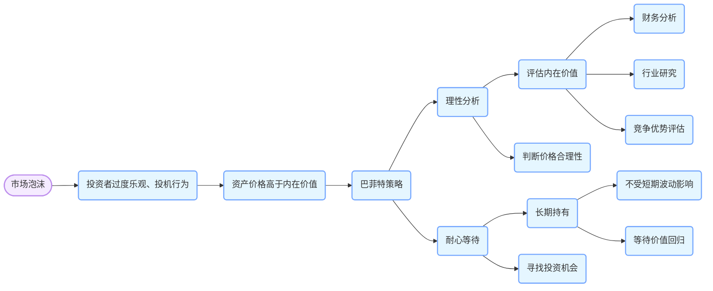

# 巴菲特应对市场泡沫的策略：保持理性和耐心

> 关键词：巴菲特、市场泡沫、理性、耐心、投资策略

> 摘要：本文围绕巴菲特应对市场泡沫的策略展开深入探讨。市场泡沫的存在是金融市场的常见现象，对投资者的决策和财富有着重大影响。巴菲特以其独特且成功的投资理念和策略在市场中脱颖而出，他强调在市场泡沫期间保持理性和耐心的重要性。通过对其策略的背景介绍、核心概念阐述、相关算法（虽投资并非严格算法但有逻辑可循）、数学模型（估值模型等）、项目实战案例、实际应用场景的分析，以及工具和资源的推荐，帮助读者全面理解并学习巴菲特的投资智慧，同时对未来市场投资的发展趋势与挑战进行展望，为投资者在复杂多变的市场环境中提供有价值的参考。

## 1. 背景介绍 
### 1.1 目的和范围
本文的目的在于深入剖析巴菲特应对市场泡沫的策略，详细阐述其策略背后的逻辑和原理，帮助投资者更好地理解在市场泡沫时期如何保持理性和耐心进行投资决策。范围涵盖了巴菲特投资理念的核心要点、相关的金融市场理论、实际投资案例分析，以及对未来市场趋势的探讨。通过对这些内容的研究，为投资者提供全面、系统的投资指导，使其在面对市场泡沫时能够做出更为明智的投资选择。

### 1.2 预期读者
本文预期读者包括广大的投资者群体，无论是初涉投资领域的新手，还是有一定投资经验的专业人士，都能从本文中获取有价值的信息。对于新手投资者，本文可以帮助他们建立正确的投资理念，了解应对市场泡沫的基本方法；对于专业投资者，本文提供的深入分析和案例研究可以为他们的投资决策提供新的思路和参考，有助于他们进一步优化投资策略。此外，金融专业的学生、研究人员以及对金融市场感兴趣的人士也可以从本文中获得相关的知识和启发。

### 1.3 文档结构概述
本文将按照以下结构进行阐述：首先介绍背景信息，包括目的、预期读者和文档结构概述以及相关术语表；接着深入探讨核心概念与联系，通过文本示意图和 Mermaid 流程图展示巴菲特投资策略的核心逻辑；然后详细讲解核心算法原理和具体操作步骤，结合 Python 源代码进行分析；再介绍数学模型和公式，并举例说明其在投资中的应用；通过项目实战部分展示实际案例和代码解读；分析实际应用场景；推荐相关的工具和资源；总结未来发展趋势与挑战；提供常见问题与解答的附录；最后列出扩展阅读和参考资料。

### 1.4 术语表
#### 1.4.1 核心术语定义
- **市场泡沫**：指资产价格显著高于其内在价值的现象，通常是由于投资者的过度乐观、投机行为或市场情绪的推动导致。当泡沫破裂时，资产价格会急剧下跌，给投资者带来巨大损失。
- **理性投资**：投资者在进行投资决策时，基于对资产的基本面分析、市场环境的客观评估和自身风险承受能力的考虑，做出合理、冷静的投资选择，而不是受到情绪或市场短期波动的影响。
- **耐心投资**：投资者在投资过程中，能够保持长期的视角，不被短期的市场波动所干扰，坚定地持有具有长期投资价值的资产，等待资产价值的逐步实现。

#### 1.4.2 相关概念解释
- **内在价值**：资产所具有的真实价值，是基于其未来预期现金流、盈利能力、行业前景等基本面因素进行评估的结果。内在价值是理性投资的重要依据，投资者通过分析资产的内在价值来判断其是否被低估或高估。
- **安全边际**：指投资者购买资产的价格与其内在价值之间的差额。安全边际越大，投资者面临的风险越小，潜在的投资回报越高。巴菲特非常重视安全边际，认为它是投资成功的关键因素之一。

#### 1.4.3 缩略词列表
- **PEG**：市盈率相对盈利增长比率（Price/Earnings to Growth Ratio），用于评估股票的估值是否合理，综合考虑了股票的市盈率和盈利增长率。

## 2. 核心概念与联系 

### 核心概念原理
巴菲特应对市场泡沫的核心策略基于其长期坚持的价值投资理念。价值投资的基本原理是寻找那些价格低于其内在价值的资产进行投资，通过长期持有来实现资产价值的增长。在市场泡沫期间，由于投资者的过度乐观和投机行为，资产价格往往会远远高于其内在价值，形成泡沫。此时，巴菲特强调保持理性和耐心，不被市场的狂热情绪所左右，坚守价值投资的原则。

理性是指投资者要对资产的基本面进行深入分析，准确评估其内在价值。这需要投资者具备扎实的财务知识、对行业的深入了解和独立思考的能力。通过对公司的财务报表、盈利能力、竞争优势等方面的分析，投资者可以判断公司的真实价值，避免被市场的短期波动和虚假信息所误导。

耐心则是指投资者在投资过程中要有长期的视角，不急于追求短期的收益。市场泡沫的形成和破裂往往需要一定的时间，投资者需要耐心等待泡沫破裂后资产价格回归其内在价值的时机。在等待的过程中，投资者要坚定地持有具有长期投资价值的资产，不受市场短期波动的影响。

### 架构的文本示意图
```plaintext
市场泡沫
|
|-- 投资者过度乐观、投机行为
|   |
|   |-- 资产价格高于内在价值
|       |
|       |-- 巴菲特策略
|           |
|           |-- 理性分析
|           |   |
|           |   |-- 评估内在价值
|           |   |   |
|           |   |   |-- 财务分析
|           |   |   |-- 行业研究
|           |   |   |-- 竞争优势评估
|           |   |
|           |   |-- 判断价格合理性
|           |
|           |-- 耐心等待
|               |
|               |-- 长期持有
|               |   |
|               |   |-- 不受短期波动影响
|               |   |-- 等待价值回归
|               |
|               |-- 寻找投资机会
```

### Mermaid 流程图


## 3. 核心算法原理 & 具体操作步骤 

### 核心算法原理
虽然投资并非严格意义上的算法，但巴菲特的投资策略有其内在的逻辑和方法。其中一个重要的方法是对公司内在价值的评估。一种常用的评估方法是现金流折现法（Discounted Cash Flow, DCF）。

现金流折现法的基本原理是将公司未来的预期现金流按照一定的折现率折现到当前，得到公司的内在价值。其计算公式为：

$$V = \sum_{t=1}^{n} \frac{CF_t}{(1 + r)^t}$$

其中，$V$ 表示公司的内在价值，$CF_t$ 表示第 $t$ 期的预期现金流，$r$ 表示折现率，$n$ 表示预期的期限。

### 具体操作步骤
1. **预测未来现金流**：通过对公司的历史财务数据、行业发展趋势、市场竞争状况等因素的分析，预测公司未来各期的现金流。这需要投资者具备丰富的财务知识和对行业的深入了解。
2. **确定折现率**：折现率反映了投资者对投资回报的要求，通常考虑无风险利率、市场风险溢价等因素。一般来说，折现率越高，未来现金流的现值越低。
3. **计算内在价值**：将预测的未来现金流按照确定的折现率折现到当前，得到公司的内在价值。
4. **比较内在价值和市场价格**：将计算得到的内在价值与公司的市场价格进行比较，如果市场价格低于内在价值，说明公司被低估，具有投资价值；反之，如果市场价格高于内在价值，说明公司被高估，需要谨慎投资。

### Python 源代码实现
```python
def dcf_valuation(cash_flows, discount_rate):
    """
    计算公司的内在价值
    :param cash_flows: 未来各期的现金流列表
    :param discount_rate: 折现率
    :return: 公司的内在价值
    """
    value = 0
    for t, cf in enumerate(cash_flows, start=1):
        value += cf / (1 + discount_rate) ** t
    return value

# 示例数据
cash_flows = [100, 120, 150, 180, 200]  # 未来 5 年的现金流
discount_rate = 0.1  # 折现率为 10%

# 计算内在价值
intrinsic_value = dcf_valuation(cash_flows, discount_rate)
print(f"公司的内在价值为: {intrinsic_value}")
```

### 代码解释
- `dcf_valuation` 函数接受两个参数：`cash_flows` 表示未来各期的现金流列表，`discount_rate` 表示折现率。
- 在函数内部，使用 `for` 循环遍历现金流列表，将每期的现金流按照折现率折现到当前，并累加到 `value` 变量中。
- 最后返回计算得到的内在价值。

## 4. 数学模型和公式 & 详细讲解 & 举例说明 

### 现金流折现法（DCF）公式
$$V = \sum_{t=1}^{n} \frac{CF_t}{(1 + r)^t}$$

### 详细讲解
- **$V$**：表示公司的内在价值，即公司未来预期现金流的现值总和。
- **$CF_t$**：表示第 $t$ 期的预期现金流。预期现金流是指公司在未来某一时期内预计能够产生的现金流入减去现金流出后的净额。它反映了公司的盈利能力和现金创造能力。
- **$r$**：表示折现率。折现率是投资者对投资回报的要求，它考虑了资金的时间价值、投资风险等因素。一般来说，折现率越高，未来现金流的现值越低，说明投资者对投资的风险要求越高。
- **$n$**：表示预期的期限。预期期限是指投资者预计公司能够产生现金流的时间段。通常，预期期限越长，公司的内在价值越高，但同时也增加了预测的不确定性。

### 举例说明
假设一家公司未来 5 年的预期现金流分别为 100 万元、120 万元、150 万元、180 万元和 200 万元，折现率为 10%。我们可以使用现金流折现法计算该公司的内在价值。

$$
\begin{align*}
V &= \frac{100}{(1 + 0.1)^1} + \frac{120}{(1 + 0.1)^2} + \frac{150}{(1 + 0.1)^3} + \frac{180}{(1 + 0.1)^4} + \frac{200}{(1 + 0.1)^5}\\
&= \frac{100}{1.1} + \frac{120}{1.21} + \frac{150}{1.331} + \frac{180}{1.4641} + \frac{200}{1.61051}\\
&\approx 90.91 + 99.17 + 112.70 + 122.94 + 124.18\\
&\approx 549.90
\end{align*}
$$

因此，该公司的内在价值约为 549.90 万元。如果该公司的市场价格低于 549.90 万元，说明公司被低估，具有投资价值；反之，如果市场价格高于 549.90 万元，说明公司被高估，需要谨慎投资。

### PEG 模型
PEG 模型是另一种常用的估值模型，它综合考虑了股票的市盈率（P/E）和盈利增长率（G）。其计算公式为：

$$PEG = \frac{P/E}{G}$$

其中，$P/E$ 表示股票的市盈率，$G$ 表示股票的盈利增长率。

一般来说，PEG 小于 1 表示股票被低估，具有投资价值；PEG 大于 1 表示股票被高估，需要谨慎投资。

### 举例说明
假设一只股票的市盈率为 20，盈利增长率为 30%。我们可以使用 PEG 模型计算该股票的 PEG 值。

$$PEG = \frac{20}{30} \approx 0.67$$

由于 PEG 值小于 1，说明该股票被低估，具有投资价值。

## 5. 项目实战：代码实际案例和详细解释说明 

### 5.1  开发环境搭建
在进行投资分析的项目实战中，我们可以使用 Python 进行数据处理和分析。以下是开发环境搭建的步骤：

1. **安装 Python**：从 Python 官方网站（https://www.python.org/downloads/）下载并安装 Python 3.x 版本。
2. **安装必要的库**：使用 `pip` 命令安装以下必要的库：
    - `pandas`：用于数据处理和分析。
    - `numpy`：用于数值计算。
    - `matplotlib`：用于数据可视化。

```bash
pip install pandas numpy matplotlib
```

### 5.2  源代码详细实现和代码解读
以下是一个使用 Python 进行股票估值分析的示例代码：

```python
import pandas as pd
import numpy as np
import matplotlib.pyplot as plt

# 示例数据：某股票的历史财务数据
data = {
    '年份': [2016, 2017, 2018, 2019, 2020],
    '净利润（万元）': [1000, 1200, 1500, 1800, 2000],
    '每股收益（元）': [1.0, 1.2, 1.5, 1.8, 2.0],
    '市盈率': [20, 18, 16, 14, 12]
}

df = pd.DataFrame(data)

# 计算盈利增长率
df['盈利增长率'] = df['净利润（万元）'].pct_change()

# 计算 PEG 值
df['PEG'] = df['市盈率'] / (df['盈利增长率'] * 100)

# 可视化分析
plt.figure(figsize=(10, 6))
plt.plot(df['年份'], df['PEG'], marker='o')
plt.xlabel('年份')
plt.ylabel('PEG 值')
plt.title('某股票 PEG 值变化趋势')
plt.grid(True)
plt.show()

# 筛选被低估的股票
undervalued_stocks = df[df['PEG'] < 1]
print("被低估的股票数据：")
print(undervalued_stocks)
```

### 代码解读
1. **数据导入**：使用 `pandas` 库创建一个包含某股票历史财务数据的 DataFrame。
2. **计算盈利增长率**：使用 `pct_change()` 方法计算净利润的增长率。
3. **计算 PEG 值**：根据 PEG 模型的计算公式，计算股票的 PEG 值。
4. **可视化分析**：使用 `matplotlib` 库绘制 PEG 值随年份变化的趋势图，帮助投资者直观地观察股票的估值变化情况。
5. **筛选被低估的股票**：根据 PEG 值小于 1 的条件筛选出被低估的股票数据，并打印输出。

### 5.3  代码解读与分析
通过上述代码，我们可以对股票的估值情况进行分析。PEG 值是一个综合考虑了市盈率和盈利增长率的指标，它可以帮助投资者更全面地评估股票的投资价值。当 PEG 值小于 1 时，说明股票被低估，具有投资潜力；当 PEG 值大于 1 时，说明股票被高估，需要谨慎投资。

在实际应用中，我们可以根据不同的投资策略和风险偏好，选择合适的 PEG 阈值进行股票筛选。同时，我们还可以结合其他指标和分析方法，对股票的投资价值进行更深入的评估。

## 6. 实际应用场景 
### 股票投资
在股票投资中，市场泡沫经常出现。例如，在科技股泡沫时期，许多科技公司的股价被大幅高估，但巴菲特并没有被市场的狂热情绪所左右。他坚持价值投资的原则，通过对公司内在价值的评估，选择那些具有长期投资价值的股票进行投资。在市场泡沫破裂后，那些被高估的股票价格大幅下跌，而巴菲特持有的股票则相对稳定，为投资者带来了长期的收益。

### 房地产投资
房地产市场也会出现泡沫现象。当房地产市场过热时，房价往往会远远高于其内在价值。巴菲特在房地产投资中同样保持理性和耐心，他会仔细分析房地产的地理位置、租金回报率、市场需求等因素，评估其内在价值。只有当房价低于其内在价值时，他才会考虑进行投资。

### 企业并购
在企业并购中，市场泡沫可能导致目标企业的估值过高。巴菲特在进行企业并购时，会对目标企业的财务状况、业务模式、竞争优势等方面进行深入分析，评估其内在价值。他会寻找那些具有长期增长潜力、被低估的企业进行并购，以实现企业的价值增值。

## 7. 工具和资源推荐
### 7.1 学习资源推荐
#### 7.1.1 书籍推荐
- 《聪明的投资者》（The Intelligent Investor）：作者本杰明·格雷厄姆（Benjamin Graham）是价值投资的创始人，这本书是价值投资领域的经典之作，对巴菲特的投资理念产生了深远影响。
- 《巴菲特致股东的信：股份公司教程》（Letters to Shareholders of Berkshire Hathaway）：这本书收录了巴菲特历年致股东的信，通过这些信件，读者可以深入了解巴菲特的投资思想、策略和方法。
- 《穷查理宝典：查理·芒格的智慧箴言录》（Poor Charlie's Almanack: The Wit and Wisdom of Charles T. Munger）：查理·芒格是巴菲特的长期合作伙伴，这本书介绍了芒格的投资哲学、思维方式和人生智慧，对投资者具有很高的参考价值。

#### 7.1.2 在线课程
- Coursera 上的“投资学原理”（Principles of Investing）课程：该课程由知名教授授课，系统地介绍了投资学的基本原理和方法，包括资产定价、投资组合理论、风险管理等内容。
- edX 上的“价值投资基础”（Foundations of Value Investing）课程：该课程专注于价值投资的理论和实践，通过案例分析和实际操作，帮助学员掌握价值投资的核心要点。

#### 7.1.3 技术博客和网站
- 雪球网（https://xueqiu.com/）：是一个专业的投资社区，提供股票、基金、债券等多种投资产品的信息和分析，用户可以在上面交流投资经验和观点。
- 东方财富网（https://www.eastmoney.com/）：是国内知名的财经网站，提供全面的财经资讯、行情数据、研究报告等内容，对投资者了解市场动态和进行投资决策具有重要参考价值。

### 7.2 开发工具框架推荐
#### 7.2.1 IDE和编辑器
- PyCharm：是一款专业的 Python 集成开发环境，具有强大的代码编辑、调试、自动补全、代码分析等功能，适合用于开发投资分析相关的 Python 程序。
- Jupyter Notebook：是一个交互式的开发环境，支持多种编程语言，特别适合用于数据探索、分析和可视化。在投资分析中，可以使用 Jupyter Notebook 进行数据处理、模型构建和结果展示。

#### 7.2.2 调试和性能分析工具
- `pdb`：是 Python 内置的调试工具，可以帮助开发者在程序运行过程中进行调试，查看变量的值、执行流程等信息。
- `cProfile`：是 Python 内置的性能分析工具，可以帮助开发者分析程序的性能瓶颈，找出耗时较长的代码段，进行优化。

#### 7.2.3 相关框架和库
- `pandas`：是一个强大的数据处理和分析库，提供了丰富的数据结构和数据操作方法，适合用于处理和分析金融数据。
- `numpy`：是一个用于数值计算的库，提供了高效的数组操作和数学函数，在投资分析中可以用于计算各种指标和模型。
- `matplotlib`：是一个用于数据可视化的库，可以绘制各种类型的图表，如折线图、柱状图、散点图等，帮助投资者直观地展示数据和分析结果。

### 7.3 相关论文著作推荐
#### 7.3.1 经典论文
- Eugene F. Fama 和 Kenneth R. French 的“Common Risk Factors in the Returns on Stocks and Bonds”：该论文提出了著名的 Fama-French 三因子模型，对资产定价理论的发展产生了重要影响。
- Harry Markowitz 的“Portfolio Selection”：该论文提出了现代投资组合理论，为投资者进行资产配置提供了理论基础。

#### 7.3.2 最新研究成果
- 关注顶级金融学术期刊，如《Journal of Finance》、《Review of Financial Studies》等，这些期刊发表了大量关于投资、金融市场等领域的最新研究成果。

#### 7.3.3 应用案例分析
- 可以参考一些专业的金融研究机构和咨询公司发布的投资案例分析报告，了解实际投资中的策略和方法，以及如何应对市场泡沫等问题。

## 8. 总结：未来发展趋势与挑战
### 未来发展趋势
- **数字化投资**：随着科技的不断发展，数字化投资将成为未来的发展趋势。投资者可以通过互联网平台、智能投顾等工具进行投资，提高投资效率和便利性。
- **可持续投资**：越来越多的投资者开始关注企业的社会责任和环境影响，可持续投资将成为未来投资的重要方向。投资者将更加注重投资的社会和环境效益，选择那些具有良好可持续发展前景的企业进行投资。
- **全球化投资**：随着全球经济的一体化，投资者将有更多的机会进行全球化投资。他们可以通过投资海外市场、跨国企业等方式，分散投资风险，获取更高的投资回报。

### 挑战
- **市场不确定性增加**：未来金融市场的不确定性将不断增加，市场波动更加频繁和剧烈。投资者需要更加具备应对市场风险的能力，保持理性和耐心，做出明智的投资决策。
- **信息过载**：在数字化时代，信息传播速度加快，投资者面临着信息过载的问题。如何从海量的信息中筛选出有价值的信息，进行准确的分析和判断，是投资者面临的一大挑战。
- **技术变革带来的挑战**：科技的快速发展带来了新的投资机会，但也带来了新的挑战。例如，人工智能、区块链等技术的应用，可能会改变金融市场的运行机制和投资模式，投资者需要不断学习和适应这些变化。

## 9. 附录：常见问题与解答
### 问题 1：如何准确评估公司的内在价值？
答：评估公司的内在价值需要综合考虑多个因素，包括公司的财务状况、盈利能力、行业前景、竞争优势等。常用的评估方法有现金流折现法、市盈率法、市净率法等。在实际应用中，需要根据公司的具体情况选择合适的评估方法，并结合自己的经验和判断进行分析。

### 问题 2：在市场泡沫期间，如何保持理性和耐心？
答：在市场泡沫期间，投资者容易受到市场情绪的影响，做出不理性的投资决策。为了保持理性和耐心，投资者可以制定明确的投资计划和策略，避免盲目跟风。同时，要加强对市场和公司的研究分析，提高自己的投资能力和判断水平。此外，还可以通过分散投资、控制仓位等方式降低投资风险。

### 问题 3：PEG 模型有哪些局限性？
答：PEG 模型虽然是一种常用的估值模型，但也存在一定的局限性。例如，PEG 模型假设盈利增长率是稳定的，但实际情况中，公司的盈利增长率可能会受到多种因素的影响，具有不确定性。此外，PEG 模型没有考虑到公司的债务水平、现金流状况等因素，可能会导致估值不准确。因此，在使用 PEG 模型进行估值时，需要结合其他指标和分析方法进行综合评估。

## 10. 扩展阅读 & 参考资料
- 格雷厄姆.《聪明的投资者》.人民邮电出版社.
- 巴菲特.《巴菲特致股东的信：股份公司教程》.机械工业出版社.
- 彼得·考夫曼.《穷查理宝典：查理·芒格的智慧箴言录》.中信出版社.
- Eugene F. Fama, Kenneth R. French. “Common Risk Factors in the Returns on Stocks and Bonds”. Journal of Financial Economics.
- Harry Markowitz. “Portfolio Selection”. The Journal of Finance.
- 雪球网、东方财富网等相关财经网站的文章和数据。

作者：AI天才研究院/AI Genius Institute & 禅与计算机程序设计艺术 /Zen And The Art of Computer Programming