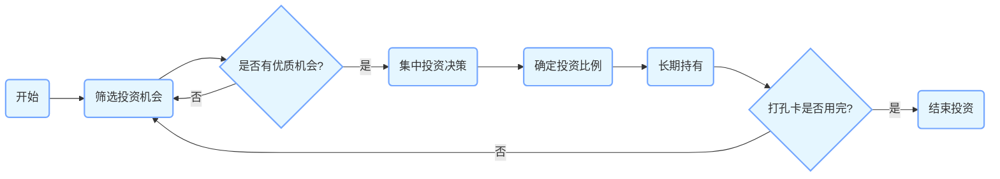

# 巴菲特的20格打孔卡：集中投资的艺术

> 关键词：巴菲特、20格打孔卡、集中投资、投资策略、价值投资

> 摘要：本文深入探讨了巴菲特提出的20格打孔卡这一集中投资理念。首先介绍了该理念提出的背景和适用范围，明确预期读者。接着阐述了打孔卡理念的核心概念及其内在联系，分析其核心算法原理并给出具体操作步骤，同时用数学模型和公式进行了详细讲解与举例说明。通过项目实战展示了如何在实际投资中运用这一理念，分析了其实际应用场景。还推荐了相关的学习资源、开发工具框架以及论文著作。最后总结了这一理念的未来发展趋势与挑战，并提供常见问题解答和扩展阅读参考资料，旨在帮助投资者理解和运用集中投资的艺术。

## 1. 背景介绍 
### 1.1 目的和范围
巴菲特的20格打孔卡概念是一种极具影响力的投资理念，其目的在于引导投资者以一种更为审慎、集中的方式进行投资决策。该理念鼓励投资者将投资视为一生仅有20次投资机会的游戏，每做出一次投资决策就相当于在打孔卡上打一个孔，打完20个孔后就不能再进行新的投资。这一理念的范围主要涵盖股票投资领域，但对于其他资产投资也具有一定的借鉴意义。它强调了深入研究、长期持有和集中投资的重要性，帮助投资者避免盲目跟风和频繁交易，从而实现长期的投资增值。

### 1.2 预期读者
本文的预期读者主要包括各类投资者，无论是个人投资者还是专业投资机构从业者。对于个人投资者而言，这一理念可以帮助他们树立正确的投资观念，避免因缺乏经验而做出冲动的投资决策。专业投资机构从业者则可以从这一理念中汲取灵感，优化投资组合管理策略，提高投资回报率。此外，金融专业的学生和研究人员也可以通过本文深入了解巴菲特的投资思想，为学术研究和实践操作提供参考。

### 1.3 文档结构概述
本文将按照以下结构展开：首先介绍20格打孔卡理念的背景信息，包括目的、预期读者和文档结构概述等内容。接着阐述核心概念与联系，通过文本示意图和Mermaid流程图直观展示其原理和架构。然后详细讲解核心算法原理和具体操作步骤，并给出Python源代码进行说明。再通过数学模型和公式对这一理念进行深入分析，并举例说明。之后进行项目实战，包括开发环境搭建、源代码实现和代码解读。随后探讨该理念的实际应用场景。接着推荐相关的工具和资源，包括学习资源、开发工具框架和论文著作。最后总结未来发展趋势与挑战，提供常见问题解答和扩展阅读参考资料。

### 1.4 术语表
#### 1.4.1 核心术语定义
- **20格打孔卡**：巴菲特提出的一种投资比喻，将投资者一生的投资机会比作一张只有20个孔的打孔卡，每进行一次投资就相当于打一个孔，打完后就不能再进行新的投资。
- **集中投资**：指投资者将大部分资金集中投资于少数几只经过深入研究和筛选的优质股票，而不是分散投资于大量股票。
- **价值投资**：一种投资策略，强调通过分析公司的基本面，如财务状况、盈利能力、竞争优势等，寻找被低估的股票进行投资，以获取长期的投资回报。

#### 1.4.2 相关概念解释
- **投资组合**：投资者持有的一系列不同资产的集合，包括股票、债券、基金等，目的是通过分散投资降低风险。
- **长期投资**：指投资者将资金投入到某项资产中，并持有较长时间，通常为数年甚至数十年，以获取资产的长期增值。
- **安全边际**：价值投资中的一个重要概念，指股票的市场价格低于其内在价值的幅度，安全边际越大，投资风险越低。

#### 1.4.3 缩略词列表
- **ROE**：Return on Equity，净资产收益率，反映公司运用自有资本的效率。
- **PE**：Price-to-Earnings Ratio，市盈率，衡量股票价格相对于每股盈利的指标。
- **PB**：Price-to-Book Ratio，市净率，衡量股票价格相对于每股净资产的指标。

## 2. 核心概念与联系 

### 核心概念原理
巴菲特的20格打孔卡理念基于价值投资和集中投资的思想。其核心原理在于，投资者一生的投资机会是有限的，因此每一次投资决策都应该经过深思熟虑。在这一理念下，投资者需要对每一个潜在的投资机会进行深入的研究和分析，评估其内在价值和投资风险。只有当发现具有显著投资价值的机会时，才应该果断出手，将资金集中投资于这些优质资产。通过这种方式，投资者可以避免过度分散投资导致的平均收益，提高投资回报率。

### 架构的文本示意图
```plaintext
20格打孔卡理念
|
|--投资机会筛选
|   |--基本面分析（财务状况、盈利能力、竞争优势等）
|   |--估值分析（PE、PB、DCF等）
|   |--风险评估（市场风险、行业风险、公司风险等）
|
|--集中投资决策
|   |--选择少数优质股票
|   |--确定投资比例
|
|--长期持有策略
|   |--忽略短期市场波动
|   |--享受公司成长带来的收益
```

### Mermaid流程图


## 3. 核心算法原理 & 具体操作步骤 

### 核心算法原理
20格打孔卡理念的核心算法原理可以概括为以下几个步骤：
1. **筛选投资机会**：通过对大量股票进行基本面分析和估值分析，筛选出具有潜在投资价值的股票。基本面分析包括分析公司的财务报表、行业地位、竞争优势等，估值分析则使用市盈率、市净率、现金流折现模型等方法评估股票的内在价值。
2. **评估投资风险**：对筛选出的股票进行风险评估，考虑市场风险、行业风险、公司风险等因素。可以使用风险评估模型，如夏普比率、贝塔系数等，来衡量股票的风险水平。
3. **集中投资决策**：在筛选出的具有投资价值且风险可控的股票中，选择少数几只优质股票进行集中投资。根据股票的内在价值和风险水平，确定每只股票的投资比例。
4. **长期持有策略**：一旦做出投资决策，就应该长期持有这些股票，忽略短期市场波动。通过长期持有，享受公司成长带来的收益。

### 具体操作步骤
以下是使用Python实现上述核心算法原理的具体操作步骤：

```python
import pandas as pd
import numpy as np
import yfinance as yf

# 步骤1：筛选投资机会
def screen_investment_opportunities(tickers):
    investment_opportunities = []
    for ticker in tickers:
        try:
            # 获取股票数据
            stock = yf.Ticker(ticker)
            # 获取财务数据
            financials = stock.financials
            # 计算关键指标
            roe = financials.loc['Net Income', :].mean() / financials.loc['Total Stockholder Equity', :].mean()
            pe_ratio = stock.info['trailingPE']
            pb_ratio = stock.info['priceToBook']
            # 筛选条件
            if roe > 0.15 and pe_ratio < 20 and pb_ratio < 2:
                investment_opportunities.append(ticker)
        except Exception as e:
            print(f"Error getting data for {ticker}: {e}")
    return investment_opportunities

# 步骤2：评估投资风险
def assess_investment_risk(tickers):
    risk_scores = {}
    for ticker in tickers:
        try:
            # 获取股票历史数据
            data = yf.download(ticker, start='2010-01-01', end='2023-01-01')
            returns = data['Close'].pct_change().dropna()
            # 计算夏普比率
            sharpe_ratio = (returns.mean() - 0.02) / returns.std()
            risk_scores[ticker] = sharpe_ratio
        except Exception as e:
            print(f"Error calculating risk for {ticker}: {e}")
    return risk_scores

# 步骤3：集中投资决策
def make_concentrated_investment_decision(investment_opportunities, risk_scores, available_funds):
    sorted_opportunities = sorted(risk_scores.items(), key=lambda x: x[1], reverse=True)
    top_opportunities = sorted_opportunities[:5]  # 选择前5只股票
    investment_decisions = {}
    total_risk_score = sum([score for _, score in top_opportunities])
    for ticker, score in top_opportunities:
        investment_ratio = score / total_risk_score
        investment_amount = investment_ratio * available_funds
        investment_decisions[ticker] = investment_amount
    return investment_decisions

# 步骤4：长期持有策略
def long_term_holding_strategy(investment_decisions, start_date, end_date):
    portfolio_returns = []
    for ticker, amount in investment_decisions.items():
        try:
            data = yf.download(ticker, start=start_date, end=end_date)
            initial_price = data['Close'].iloc[0]
            final_price = data['Close'].iloc[-1]
            stock_return = (final_price - initial_price) / initial_price
            portfolio_returns.append(stock_return * amount)
        except Exception as e:
            print(f"Error calculating return for {ticker}: {e}")
    total_return = sum(portfolio_returns)
    return total_return

# 示例使用
tickers = ['AAPL', 'MSFT', 'GOOG', 'AMZN', 'FB', 'BRK-A', 'JPM', 'V', 'PG', 'KO']
available_funds = 100000
start_date = '2020-01-01'
end_date = '2023-01-01'

# 步骤1
investment_opportunities = screen_investment_opportunities(tickers)
# 步骤2
risk_scores = assess_investment_risk(investment_opportunities)
# 步骤3
investment_decisions = make_concentrated_investment_decision(investment_opportunities, risk_scores, available_funds)
# 步骤4
total_return = long_term_holding_strategy(investment_decisions, start_date, end_date)

print(f"筛选出的投资机会: {investment_opportunities}")
print(f"投资决策: {investment_decisions}")
print(f"总回报率: {total_return}")
```

## 4. 数学模型和公式 & 详细讲解 & 举例说明 

### 关键指标计算
#### 净资产收益率（ROE）
净资产收益率是衡量公司运用自有资本效率的重要指标，计算公式为：
$$ROE = \frac{Net Income}{Total Stockholder Equity}$$
其中，$Net Income$ 为公司的净利润，$Total Stockholder Equity$ 为公司的股东权益总额。

例如，某公司的净利润为1000万元，股东权益总额为5000万元，则该公司的ROE为：
$$ROE = \frac{1000}{5000} = 0.2 = 20\%$$

#### 市盈率（PE）
市盈率是衡量股票价格相对于每股盈利的指标，计算公式为：
$$PE = \frac{Stock Price}{Earnings per Share}$$
其中，$Stock Price$ 为股票的市场价格，$Earnings per Share$ 为每股盈利。

例如，某股票的市场价格为50元，每股盈利为5元，则该股票的PE为：
$$PE = \frac{50}{5} = 10$$

#### 市净率（PB）
市净率是衡量股票价格相对于每股净资产的指标，计算公式为：
$$PB = \frac{Stock Price}{Book Value per Share}$$
其中，$Stock Price$ 为股票的市场价格，$Book Value per Share$ 为每股净资产。

例如，某股票的市场价格为30元，每股净资产为15元，则该股票的PB为：
$$PB = \frac{30}{15} = 2$$

### 风险评估指标
#### 夏普比率
夏普比率是衡量投资组合风险调整后收益的指标，计算公式为：
$$Sharpe Ratio = \frac{R_p - R_f}{\sigma_p}$$
其中，$R_p$ 为投资组合的预期收益率，$R_f$ 为无风险收益率，$\sigma_p$ 为投资组合的标准差。

例如，某投资组合的预期收益率为15%，无风险收益率为2%，标准差为10%，则该投资组合的夏普比率为：
$$Sharpe Ratio = \frac{0.15 - 0.02}{0.1} = 1.3$$

### 投资比例计算
在集中投资决策中，根据股票的风险水平确定投资比例。假设我们选择了 $n$ 只股票，第 $i$ 只股票的风险评分为 $s_i$，则第 $i$ 只股票的投资比例 $w_i$ 计算公式为：
$$w_i = \frac{s_i}{\sum_{j=1}^{n} s_j}$$

例如，我们选择了3只股票，它们的风险评分分别为0.8、1.2和1.0，则它们的投资比例分别为：
$$w_1 = \frac{0.8}{0.8 + 1.2 + 1.0} = \frac{0.8}{3} \approx 0.27$$
$$w_2 = \frac{1.2}{0.8 + 1.2 + 1.0} = \frac{1.2}{3} = 0.4$$
$$w_3 = \frac{1.0}{0.8 + 1.2 + 1.0} = \frac{1.0}{3} \approx 0.33$$

## 5. 项目实战：代码实际案例和详细解释说明 

### 5.1  开发环境搭建
为了运行上述Python代码，需要搭建以下开发环境：
1. **Python安装**：确保已经安装了Python 3.x版本，可以从Python官方网站（https://www.python.org/downloads/）下载并安装。
2. **库安装**：需要安装 `pandas`、`numpy` 和 `yfinance` 库。可以使用以下命令进行安装：
```sh
pip install pandas numpy yfinance
```

### 5.2  源代码详细实现和代码解读
以下是对上述Python代码的详细解读：
```python
import pandas as pd
import numpy as np
import yfinance as yf

# 步骤1：筛选投资机会
def screen_investment_opportunities(tickers):
    investment_opportunities = []
    for ticker in tickers:
        try:
            # 获取股票数据
            stock = yf.Ticker(ticker)
            # 获取财务数据
            financials = stock.financials
            # 计算关键指标
            roe = financials.loc['Net Income', :].mean() / financials.loc['Total Stockholder Equity', :].mean()
            pe_ratio = stock.info['trailingPE']
            pb_ratio = stock.info['priceToBook']
            # 筛选条件
            if roe > 0.15 and pe_ratio < 20 and pb_ratio < 2:
                investment_opportunities.append(ticker)
        except Exception as e:
            print(f"Error getting data for {ticker}: {e}")
    return investment_opportunities
```
- **功能**：筛选具有潜在投资价值的股票。
- **代码解释**：遍历输入的股票代码列表，使用 `yfinance` 库获取每只股票的财务数据和基本信息，计算ROE、PE和PB指标。如果这些指标满足筛选条件（ROE > 0.15，PE < 20，PB < 2），则将该股票添加到投资机会列表中。

```python
# 步骤2：评估投资风险
def assess_investment_risk(tickers):
    risk_scores = {}
    for ticker in tickers:
        try:
            # 获取股票历史数据
            data = yf.download(ticker, start='2010-01-01', end='2023-01-01')
            returns = data['Close'].pct_change().dropna()
            # 计算夏普比率
            sharpe_ratio = (returns.mean() - 0.02) / returns.std()
            risk_scores[ticker] = sharpe_ratio
        except Exception as e:
            print(f"Error calculating risk for {ticker}: {e}")
    return risk_scores
```
- **功能**：评估筛选出的股票的投资风险。
- **代码解释**：遍历投资机会列表，使用 `yfinance` 库获取每只股票的历史数据，计算每日收益率。然后根据夏普比率公式计算每只股票的风险评分，并将结果存储在字典中。

```python
# 步骤3：集中投资决策
def make_concentrated_investment_decision(investment_opportunities, risk_scores, available_funds):
    sorted_opportunities = sorted(risk_scores.items(), key=lambda x: x[1], reverse=True)
    top_opportunities = sorted_opportunities[:5]  # 选择前5只股票
    investment_decisions = {}
    total_risk_score = sum([score for _, score in top_opportunities])
    for ticker, score in top_opportunities:
        investment_ratio = score / total_risk_score
        investment_amount = investment_ratio * available_funds
        investment_decisions[ticker] = investment_amount
    return investment_decisions
```
- **功能**：根据股票的风险评分做出集中投资决策。
- **代码解释**：对风险评分字典进行排序，选择前5只股票。计算这5只股票的总风险评分，然后根据每只股票的风险评分占总风险评分的比例确定投资比例，最后根据投资比例和可用资金计算投资金额，并将结果存储在字典中。

```python
# 步骤4：长期持有策略
def long_term_holding_strategy(investment_decisions, start_date, end_date):
    portfolio_returns = []
    for ticker, amount in investment_decisions.items():
        try:
            data = yf.download(ticker, start=start_date, end=end_date)
            initial_price = data['Close'].iloc[0]
            final_price = data['Close'].iloc[-1]
            stock_return = (final_price - initial_price) / initial_price
            portfolio_returns.append(stock_return * amount)
        except Exception as e:
            print(f"Error calculating return for {ticker}: {e}")
    total_return = sum(portfolio_returns)
    return total_return
```
- **功能**：模拟长期持有投资组合的收益情况。
- **代码解释**：遍历投资决策字典，使用 `yfinance` 库获取每只股票在指定时间段内的历史数据，计算每只股票的收益率。然后根据投资金额计算每只股票的收益，并将结果存储在列表中。最后将所有股票的收益相加得到投资组合的总收益。

### 5.3  代码解读与分析
通过上述代码，我们实现了巴菲特20格打孔卡理念的核心算法。首先筛选出具有潜在投资价值的股票，然后评估这些股票的投资风险，根据风险评分做出集中投资决策，最后模拟长期持有这些股票的收益情况。代码中使用了 `yfinance` 库来获取股票数据，使用 `pandas` 和 `numpy` 库进行数据处理和计算。这种实现方式简洁明了，易于理解和扩展。

## 6. 实际应用场景 
### 个人投资者
对于个人投资者来说，20格打孔卡理念可以帮助他们避免盲目跟风和频繁交易。个人投资者通常资金有限，没有足够的时间和精力进行广泛的投资研究。通过运用这一理念，个人投资者可以集中精力研究少数几只优质股票，做出更加明智的投资决策。例如，一位个人投资者可以将自己的资金集中投资于几家具有长期竞争优势和稳定盈利能力的公司，如苹果、微软等，长期持有这些股票，享受公司成长带来的收益。

### 专业投资机构
专业投资机构也可以借鉴20格打孔卡理念来优化投资组合管理策略。投资机构通常管理着大量的资金，需要在风险和收益之间进行平衡。通过集中投资于少数几只经过深入研究的优质股票，投资机构可以提高投资组合的集中度，降低交易成本，提高投资回报率。例如，一些价值投资基金可能会选择少数几只被低估的股票进行集中投资，长期持有以获取超额收益。

### 投资教育
20格打孔卡理念也可以作为一种投资教育工具，帮助投资者树立正确的投资观念。在投资教育课程中，可以通过讲解这一理念，让投资者了解集中投资和长期投资的重要性，避免投资者陷入短期投机的陷阱。例如，在大学的金融课程中，可以将这一理念作为案例进行分析，让学生深入理解价值投资的原理和方法。

## 7. 工具和资源推荐
### 7.1 学习资源推荐
#### 7.1.1 书籍推荐
- 《聪明的投资者》（The Intelligent Investor）：本杰明·格雷厄姆（Benjamin Graham）著，这本书是价值投资的经典之作，巴菲特称其为“有史以来最伟大的投资著作”。书中详细阐述了价值投资的理念和方法，对巴菲特的投资思想产生了深远影响。
- 《巴菲特致股东的信：股份公司教程》（Letters to Shareholders of Berkshire Hathaway）：沃伦·巴菲特（Warren Buffett）著，这本书收录了巴菲特多年来致股东的信，通过这些信件可以深入了解巴菲特的投资哲学、管理理念和对市场的看法。
- 《穷查理宝典：查理·芒格的智慧箴言录》（Poor Charlie's Almanack: The Wit and Wisdom of Charles T. Munger）：查理·芒格（Charles Munger）著，芒格是巴菲特的长期合作伙伴，这本书汇集了芒格的演讲、文章和访谈，展示了他的多元思维模型和投资智慧。

#### 7.1.2 在线课程
- Coursera上的“投资学原理”（Principles of Investment）课程：该课程由知名大学的教授授课，涵盖了投资学的基本概念、理论和方法，包括股票投资、债券投资、投资组合管理等内容。
- edX上的“价值投资基础”（Foundations of Value Investing）课程：该课程深入讲解了价值投资的原理和实践，包括财务报表分析、估值方法、投资策略等方面的内容。

#### 7.1.3 技术博客和网站
- 雪球网（https://xueqiu.com/）：国内知名的投资社区，提供股票行情、财经新闻、投资分析等服务，投资者可以在上面交流投资经验和分享投资观点。
- Seeking Alpha（https://seekingalpha.com/）：国外知名的投资研究网站，提供大量的股票分析报告、投资策略文章和财经评论，有助于投资者了解市场动态和获取投资灵感。

### 7.2 开发工具框架推荐
#### 7.2.1 IDE和编辑器
- PyCharm：一款专业的Python集成开发环境，具有代码编辑、调试、代码分析等功能，适合Python开发者使用。
- Jupyter Notebook：一种交互式的开发环境，可以将代码、文本、图表等内容整合在一起，方便进行数据分析和实验。

#### 7.2.2 调试和性能分析工具
- PDB：Python自带的调试工具，可以帮助开发者调试Python代码，查找代码中的错误。
- cProfile：Python的性能分析工具，可以分析代码的运行时间和函数调用情况，帮助开发者优化代码性能。

#### 7.2.3 相关框架和库
- Pandas：一个强大的数据处理和分析库，提供了丰富的数据结构和数据操作方法，适用于金融数据处理和分析。
- Numpy：一个用于科学计算的Python库，提供了高效的数组操作和数学函数，在金融计算中经常使用。
- Scikit-learn：一个机器学习库，提供了各种机器学习算法和工具，可用于股票价格预测、风险评估等方面的研究。

### 7.3 相关论文著作推荐
#### 7.3.1 经典论文
- “The Superinvestors of Graham-and-Doddsville”：沃伦·巴菲特著，这篇论文是巴菲特在1984年为纪念本杰明·格雷厄姆和戴维·多德的《证券分析》出版50周年而发表的演讲，通过分析几位遵循格雷厄姆价值投资理念的投资者的业绩，证明了价值投资的有效性。
- “Common Stocks and Uncommon Profits”：菲利普·费雪（Philip Fisher）著，这篇论文提出了成长投资的理念，强调了寻找具有长期成长潜力的公司的重要性，对巴菲特的投资思想产生了一定的影响。

#### 7.3.2 最新研究成果
- 近年来，随着人工智能和大数据技术的发展，一些研究人员开始将这些技术应用于投资领域。例如，使用机器学习算法进行股票价格预测、风险评估和投资组合优化等方面的研究。可以关注相关的学术期刊，如《金融研究》、《Journal of Financial Economics》等，了解最新的研究成果。

#### 7.3.3 应用案例分析
- 可以参考一些投资机构的年度报告和研究报告，了解他们在实际投资中如何运用集中投资和价值投资理念。例如，伯克希尔·哈撒韦公司的年度报告详细披露了其投资组合和投资策略，是学习巴菲特投资思想的重要资料。

## 8. 总结：未来发展趋势与挑战
### 未来发展趋势
- **数字化和智能化**：随着科技的不断发展，投资领域将越来越数字化和智能化。人工智能、大数据、区块链等技术将被广泛应用于投资决策、风险评估和投资组合管理等方面。例如，使用机器学习算法可以对大量的金融数据进行分析和挖掘，帮助投资者更准确地预测股票价格和评估投资风险。
- **全球化**：全球经济一体化的趋势将继续加强，投资者将有更多的机会参与国际市场的投资。同时，不同国家和地区的投资机会和风险也将更加复杂多样。投资者需要具备全球视野，了解不同国家和地区的经济、政治和文化背景，以便做出更加明智的投资决策。
- **社会责任投资**：随着社会对环境保护、社会责任和公司治理（ESG）的关注度不断提高，社会责任投资将成为未来投资的一个重要趋势。投资者将更加注重投资标的的ESG表现，选择那些具有良好社会形象和可持续发展能力的公司进行投资。

### 挑战
- **市场不确定性**：金融市场充满了不确定性，股票价格受到多种因素的影响，如宏观经济环境、政策变化、公司业绩等。即使采用了集中投资和价值投资的策略，也无法完全避免市场风险。投资者需要具备较强的风险承受能力和应对市场波动的能力。
- **信息过载**：在数字化时代，投资者可以获取的信息越来越多，但同时也面临着信息过载的问题。如何从海量的信息中筛选出有价值的信息，并进行准确的分析和判断，是投资者面临的一个挑战。
- **竞争加剧**：随着投资市场的不断发展，投资者的数量不断增加，竞争也越来越激烈。在这种情况下，投资者需要不断提升自己的投资能力和专业水平，才能在市场中获得超额收益。

## 9. 附录：常见问题与解答
### 问题1：20格打孔卡理念是否适用于所有投资者？
解答：20格打孔卡理念并不是适用于所有投资者。该理念更适合那些有一定投资经验、能够进行深入研究和分析的投资者。对于缺乏投资知识和经验的投资者来说，可能难以准确筛选出优质的投资机会。此外，该理念强调集中投资，风险相对较高，投资者需要具备较强的风险承受能力。

### 问题2：如何确定打孔卡上的20次投资机会？
解答：确定打孔卡上的20次投资机会需要投资者进行深入的研究和分析。投资者可以从以下几个方面入手：
1. **基本面分析**：分析公司的财务状况、盈利能力、竞争优势等，选择具有长期投资价值的公司。
2. **估值分析**：使用市盈率、市净率、现金流折现模型等方法评估股票的内在价值，选择被低估的股票。
3. **行业分析**：了解不同行业的发展趋势和前景，选择具有发展潜力的行业。
4. **风险评估**：评估投资风险，选择风险可控的投资机会。

### 问题3：在长期持有过程中，如果股票出现重大不利变化怎么办？
解答：在长期持有过程中，如果股票出现重大不利变化，投资者需要及时评估该变化对公司的影响程度。如果该变化导致公司的基本面发生了根本性的改变，使得公司的投资价值大幅下降，投资者可以考虑卖出该股票。但在做出决策之前，投资者需要进行充分的研究和分析，避免因短期波动而做出错误的决策。

### 问题4：集中投资是否意味着只投资一只股票？
解答：集中投资并不意味着只投资一只股票。集中投资是指将大部分资金集中投资于少数几只经过深入研究和筛选的优质股票，通常建议投资3 - 5只股票。这样可以在降低投资风险的同时，提高投资回报率。

## 10. 扩展阅读 & 参考资料
- 《金融炼金术》（The Alchemy of Finance）：乔治·索罗斯（George Soros）著，这本书阐述了索罗斯的反身性理论，对理解金融市场的运行机制和投资决策具有重要的启示作用。
- 《漫步华尔街》（A Random Walk Down Wall Street）：伯顿·马尔基尔（Burton Malkiel）著，这本书介绍了有效市场假说和随机漫步理论，对投资组合管理和投资策略的选择提供了不同的视角。
- Bloomberg（https://www.bloomberg.com/）：全球知名的财经媒体，提供实时的金融市场数据、财经新闻和分析报告，是投资者获取市场信息的重要来源。

作者：AI天才研究院/AI Genius Institute & 禅与计算机程序设计艺术 /Zen And The Art of Computer Programming