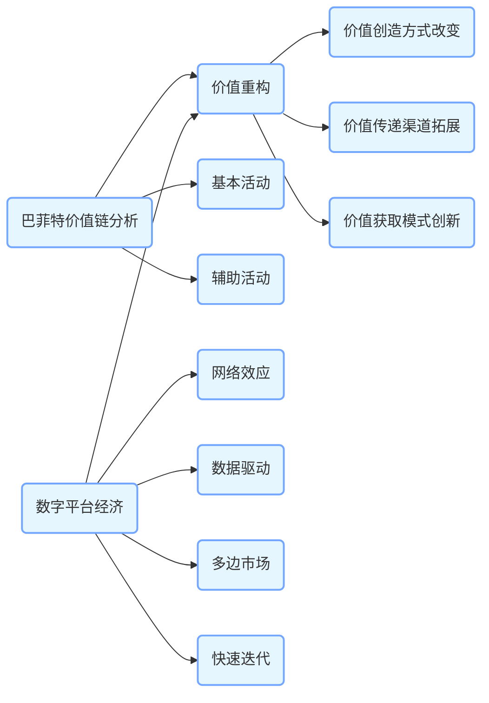

# 巴菲特的价值链分析：数字平台经济下的价值重构

> 关键词：巴菲特价值链分析、数字平台经济、价值重构、商业模式、竞争优势

> 摘要：本文旨在深入探讨巴菲特的价值链分析在数字平台经济背景下的应用与价值重构。通过对巴菲特传统价值链分析理念的回顾，结合数字平台经济的特点，剖析在新经济形态下企业价值创造、传递和获取方式的变化。文章详细阐述了核心概念、算法原理、数学模型，提供了项目实战案例，并探讨了实际应用场景、推荐了相关工具和资源，最后总结了未来发展趋势与挑战，为企业在数字平台经济中构建竞争优势提供理论和实践指导。

## 1. 背景介绍 
### 1.1 目的和范围
在当今数字平台经济蓬勃发展的时代，传统的企业价值分析方法面临着新的挑战和机遇。巴菲特的价值链分析作为一种经典的企业价值评估方法，如何适应数字平台经济的特点并实现价值重构，是本文研究的核心目的。本文的范围涵盖了对巴菲特价值链分析的基本原理、数字平台经济的特征、价值重构的具体方式以及相关的实战案例和应用场景的探讨。

### 1.2 预期读者
本文预期读者包括企业管理者、投资者、学术研究人员以及对数字经济和企业价值分析感兴趣的人士。企业管理者可以从中获取在数字平台经济下优化企业价值链、提升竞争力的思路；投资者可以借鉴价值重构的分析方法，做出更明智的投资决策；学术研究人员可以在本文的基础上开展进一步的理论研究；对相关领域感兴趣的人士可以通过本文了解数字平台经济下企业价值的变化和重构机制。

### 1.3 文档结构概述
本文共分为十个部分。第一部分为背景介绍，阐述了研究的目的、范围、预期读者和文档结构概述；第二部分介绍核心概念与联系，包括巴菲特价值链分析、数字平台经济和价值重构的概念及它们之间的联系；第三部分讲解核心算法原理与具体操作步骤，通过Python代码详细阐述如何进行相关分析；第四部分介绍数学模型和公式，并结合具体例子进行详细讲解；第五部分是项目实战，包括开发环境搭建、源代码详细实现和代码解读；第六部分探讨实际应用场景；第七部分推荐相关的工具和资源，包括学习资源、开发工具框架和相关论文著作；第八部分总结未来发展趋势与挑战；第九部分是附录，解答常见问题；第十部分提供扩展阅读和参考资料。

### 1.4 术语表
#### 1.4.1 核心术语定义
- **巴菲特价值链分析**：由巴菲特提出的一种通过分析企业内部各个环节的价值创造过程，来评估企业整体价值和竞争优势的方法。它关注企业从原材料采购、生产制造、销售到售后服务等一系列活动中，哪些环节能够为企业创造独特的价值。
- **数字平台经济**：基于数字技术构建的平台，通过连接供需双方或多方，实现资源的高效配置和价值的创造与交换的一种经济形态。数字平台具有网络效应、数据驱动、多边市场等特点。
- **价值重构**：在数字平台经济背景下，企业对其传统的价值链进行重新审视和调整，改变价值创造、传递和获取的方式，以适应新的市场环境和竞争格局，实现企业价值的提升。

#### 1.4.2 相关概念解释
- **网络效应**：指在数字平台中，随着用户数量的增加，平台的价值会呈指数级增长。因为更多的用户意味着更多的交易机会、更丰富的内容和更高的用户粘性。
- **数据驱动**：数字平台通过收集、分析大量的数据，来了解用户需求、优化平台运营、提供个性化服务，从而实现价值的创造。
- **多边市场**：数字平台通常连接多个不同类型的用户群体，如买家和卖家、供应商和需求方等，通过满足不同群体的需求，实现多方共赢。

#### 1.4.3 缩略词列表
- **AI**：Artificial Intelligence，人工智能
- **IoT**：Internet of Things，物联网
- **API**：Application Programming Interface，应用程序编程接口

## 2. 核心概念与联系 

### 巴菲特价值链分析原理
巴菲特的价值链分析主要基于企业的核心竞争力和长期价值创造。他认为企业的价值不仅仅取决于其当前的财务状况，更重要的是其在产业链中的地位和独特的价值创造能力。企业的价值链可以分为基本活动和辅助活动。基本活动包括内部后勤、生产作业、外部后勤、市场和销售、服务等环节；辅助活动包括采购、技术开发、人力资源管理和企业基础设施等。通过对这些活动的分析，可以找出企业的优势和劣势，确定企业的核心竞争力所在。

### 数字平台经济的特征
数字平台经济具有以下几个显著特征：
1. **网络效应**：如前所述，随着用户数量的增加，平台的价值会不断提升。例如，社交平台上用户越多，信息传播越广泛，平台对新用户的吸引力就越大。
2. **数据驱动**：数字平台能够收集大量的用户数据，通过数据分析可以了解用户的行为、偏好和需求，从而提供个性化的服务和产品推荐。例如，电商平台根据用户的购买历史和浏览记录，为用户推荐符合其兴趣的商品。
3. **多边市场**：数字平台连接了多个不同类型的用户群体，形成了多边市场。例如，共享出行平台连接了乘客和司机，通过收取交易佣金实现盈利。
4. **快速迭代**：数字技术的发展日新月异，数字平台需要不断进行创新和迭代，以满足用户不断变化的需求。例如，移动应用程序会定期推出新版本，增加新功能和优化用户体验。

### 价值重构的概念
在数字平台经济下，价值重构是指企业通过利用数字技术和平台的优势，对传统的价值链进行重新设计和优化。具体表现为以下几个方面：
1. **价值创造方式的改变**：传统企业主要通过生产和销售产品来创造价值，而数字平台企业则通过提供平台服务、数据增值等方式创造价值。例如，云计算平台为企业提供计算资源和软件服务，通过收取服务费用实现价值创造。
2. **价值传递渠道的拓展**：数字平台打破了传统的地域和时间限制，企业可以通过平台直接将产品和服务传递给全球范围内的用户。例如，在线教育平台可以让学生随时随地学习课程，不受地域和时间的限制。
3. **价值获取模式的创新**：数字平台企业可以通过多种方式获取价值，如广告收入、交易佣金、会员费用等。例如，视频平台通过播放广告和收取会员费用实现盈利。

### 核心概念的联系
巴菲特的价值链分析为企业在数字平台经济下的价值重构提供了理论基础。通过对企业价值链的分析，可以找出哪些环节可以借助数字平台的优势进行优化和创新。数字平台经济的特征决定了企业在进行价值重构时需要关注网络效应、数据驱动等因素。而价值重构则是企业在数字平台经济下实现可持续发展和提升竞争力的关键。通过价值重构，企业可以更好地适应数字平台经济的发展趋势，创造更大的价值。

### 文本示意图
```plaintext
巴菲特价值链分析
|--基本活动
|   |--内部后勤
|   |--生产作业
|   |--外部后勤
|   |--市场和销售
|   |--服务
|--辅助活动
|   |--采购
|   |--技术开发
|   |--人力资源管理
|   |--企业基础设施

数字平台经济
|--网络效应
|--数据驱动
|--多边市场
|--快速迭代

价值重构
|--价值创造方式改变
|--价值传递渠道拓展
|--价值获取模式创新

联系：巴菲特价值链分析为价值重构提供理论基础，数字平台经济特征影响价值重构方式，价值重构适应数字平台经济发展
```

### Mermaid流程图


## 3. 核心算法原理 & 具体操作步骤 

### 核心算法原理
在数字平台经济下进行巴菲特价值链分析和价值重构，需要综合考虑多个因素，如用户数量、交易金额、数据质量等。以下是一个简化的算法原理，用于评估企业在数字平台经济下的价值：

1. **数据收集**：收集企业在数字平台上的相关数据，包括用户注册数、活跃用户数、交易订单数、交易金额、用户评价等。
2. **指标计算**：根据收集到的数据，计算一些关键指标，如用户增长率、用户留存率、交易转化率、平均交易金额等。
3. **价值评估**：基于计算得到的指标，使用一定的评估模型对企业在数字平台上的价值进行评估。评估模型可以是线性回归模型、神经网络模型等。
4. **价值重构策略制定**：根据价值评估结果，分析企业在价值链中的优势和劣势，制定相应的价值重构策略。例如，如果发现用户留存率较低，可以考虑优化平台的用户体验；如果发现交易转化率较低，可以考虑调整营销策略。

### 具体操作步骤

#### 步骤1：数据收集
以下是使用Python代码从数据库中收集用户注册数和交易订单数的示例：
```python
import sqlite3

# 连接到数据库
conn = sqlite3.connect('platform_data.db')
cursor = conn.cursor()

# 查询用户注册数
cursor.execute("SELECT COUNT(*) FROM users")
user_count = cursor.fetchone()[0]

# 查询交易订单数
cursor.execute("SELECT COUNT(*) FROM orders")
order_count = cursor.fetchone()[0]

# 关闭数据库连接
conn.close()

print(f"用户注册数: {user_count}")
print(f"交易订单数: {order_count}")
```

#### 步骤2：指标计算
以下是使用Python代码计算用户增长率和交易转化率的示例：
```python
# 假设上一时期的用户注册数和交易订单数
previous_user_count = 1000
previous_order_count = 500

# 计算用户增长率
user_growth_rate = (user_count - previous_user_count) / previous_user_count

# 计算交易转化率
conversion_rate = order_count / user_count

print(f"用户增长率: {user_growth_rate * 100:.2f}%")
print(f"交易转化率: {conversion_rate * 100:.2f}%")
```

#### 步骤3：价值评估
以下是使用线性回归模型对企业在数字平台上的价值进行评估的示例：
```python
import numpy as np
from sklearn.linear_model import LinearRegression

# 假设已经收集到多个时期的用户注册数、交易订单数和企业价值数据
X = np.array([[1000, 500], [1200, 600], [1500, 700]])  # 用户注册数和交易订单数
y = np.array([100000, 120000, 150000])  # 企业价值

# 创建线性回归模型
model = LinearRegression()

# 拟合模型
model.fit(X, y)

# 预测当前时期的企业价值
current_X = np.array([[user_count, order_count]])
predicted_value = model.predict(current_X)

print(f"预测的企业价值: {predicted_value[0]:.2f}")
```

#### 步骤4：价值重构策略制定
根据上述计算结果，如果用户增长率较低，可以考虑通过以下策略进行价值重构：
- 优化平台的推广渠道，提高平台的知名度。
- 提供更多的优惠活动和奖励，吸引新用户注册。
- 改善平台的用户体验，提高用户满意度。

如果交易转化率较低，可以考虑以下策略：
- 优化产品展示和推荐算法，提高用户的购买意愿。
- 提供个性化的营销方案，针对不同用户群体进行精准营销。
- 加强客户服务，提高用户的购买信心。

## 4. 数学模型和公式 & 详细讲解 & 举例说明 

### 数学模型和公式

#### 用户增长率公式
用户增长率 $r_{u}$ 可以用以下公式表示：
$$r_{u}=\frac{N_{u,t}-N_{u,t-1}}{N_{u,t-1}}$$
其中，$N_{u,t}$ 表示当前时期的用户注册数，$N_{u,t-1}$ 表示上一时期的用户注册数。

#### 交易转化率公式
交易转化率 $r_{c}$ 可以用以下公式表示：
$$r_{c}=\frac{N_{o}}{N_{u}}$$
其中，$N_{o}$ 表示交易订单数，$N_{u}$ 表示用户注册数。

#### 线性回归模型公式
线性回归模型可以用以下公式表示：
$$y = \beta_{0}+\beta_{1}x_{1}+\beta_{2}x_{2}+\cdots+\beta_{n}x_{n}+\epsilon$$
其中，$y$ 表示企业价值，$x_{1},x_{2},\cdots,x_{n}$ 表示影响企业价值的因素（如用户注册数、交易订单数等），$\beta_{0},\beta_{1},\cdots,\beta_{n}$ 表示模型的系数，$\epsilon$ 表示误差项。

### 详细讲解

#### 用户增长率
用户增长率反映了企业在数字平台上的用户扩张速度。如果用户增长率较高，说明企业的平台具有较强的吸引力，能够不断吸引新用户加入。反之，如果用户增长率较低，说明企业需要采取措施提高平台的吸引力，如优化推广策略、改善用户体验等。

#### 交易转化率
交易转化率反映了企业在数字平台上的销售效率。如果交易转化率较高，说明企业的平台能够有效地将用户转化为客户，实现价值创造。反之，如果交易转化率较低，说明企业需要优化产品展示、营销策略等，提高用户的购买意愿。

#### 线性回归模型
线性回归模型是一种常用的统计模型，用于分析自变量和因变量之间的线性关系。在数字平台经济下，我们可以使用线性回归模型来评估企业的价值与用户注册数、交易订单数等因素之间的关系。通过拟合模型，我们可以得到模型的系数，从而预测企业的价值。

### 举例说明

假设某数字平台企业在第 $t-1$ 时期的用户注册数为 $1000$，在第 $t$ 时期的用户注册数为 $1200$，交易订单数为 $600$。

#### 用户增长率计算
根据用户增长率公式，可得：
$$r_{u}=\frac{1200 - 1000}{1000}=0.2 = 20\%$$
这说明该企业在数字平台上的用户增长速度较快。

#### 交易转化率计算
根据交易转化率公式，可得：
$$r_{c}=\frac{600}{1200}=0.5 = 50\%$$
这说明该企业在数字平台上的交易转化率较高，能够有效地将用户转化为客户。

#### 线性回归模型应用
假设我们已经收集到该企业多个时期的用户注册数、交易订单数和企业价值数据，如下表所示：

| 时期 | 用户注册数 $x_{1}$ | 交易订单数 $x_{2}$ | 企业价值 $y$ |
| ---- | ---- | ---- | ---- |
| 1 | 1000 | 500 | 100000 |
| 2 | 1200 | 600 | 120000 |
| 3 | 1500 | 700 | 150000 |

使用Python代码进行线性回归分析：
```python
import numpy as np
from sklearn.linear_model import LinearRegression

X = np.array([[1000, 500], [1200, 600], [1500, 700]])
y = np.array([100000, 120000, 150000])

model = LinearRegression()
model.fit(X, y)

print(f"截距: {model.intercept_}")
print(f"系数: {model.coef_}")
```

运行上述代码，我们可以得到模型的截距和系数。假设截距为 $\beta_{0}=10000$，系数为 $\beta_{1}=50$，$\beta_{2}=100$，则线性回归模型为：
$$y = 10000 + 50x_{1}+100x_{2}$$

如果当前时期的用户注册数为 $1200$，交易订单数为 $600$，则预测的企业价值为：
$$y = 10000 + 50\times1200 + 100\times600 = 130000$$

## 5. 项目实战：代码实际案例和详细解释说明 

### 5.1  开发环境搭建
为了实现数字平台经济下的巴菲特价值链分析和价值重构项目，我们需要搭建以下开发环境：

#### 操作系统
推荐使用Windows、Linux或macOS操作系统。

#### 编程语言和开发工具
- **Python**：作为主要的编程语言，我们将使用Python进行数据处理、模型训练和预测等操作。推荐使用Python 3.7及以上版本。
- **Anaconda**：一个开源的Python发行版，包含了许多常用的科学计算和数据分析库，如NumPy、Pandas、Scikit-learn等。可以从Anaconda官方网站（https://www.anaconda.com/ ）下载并安装。
- **Jupyter Notebook**：一个基于Web的交互式计算环境，方便我们编写和运行Python代码。安装Anaconda后，Jupyter Notebook会自动安装。

#### 数据库
- **SQLite**：一个轻量级的嵌入式数据库，适合用于小型项目的数据存储。Python内置了对SQLite的支持，无需额外安装。

### 5.2  源代码详细实现和代码解读

#### 数据收集模块
```python
import sqlite3

def collect_data():
    # 连接到数据库
    conn = sqlite3.connect('platform_data.db')
    cursor = conn.cursor()

    # 查询用户注册数
    cursor.execute("SELECT COUNT(*) FROM users")
    user_count = cursor.fetchone()[0]

    # 查询交易订单数
    cursor.execute("SELECT COUNT(*) FROM orders")
    order_count = cursor.fetchone()[0]

    # 关闭数据库连接
    conn.close()

    return user_count, order_count

# 调用函数收集数据
user_count, order_count = collect_data()
print(f"用户注册数: {user_count}")
print(f"交易订单数: {order_count}")
```
**代码解读**：
- 首先，使用 `sqlite3.connect` 函数连接到名为 `platform_data.db` 的SQLite数据库。
- 然后，使用 `cursor.execute` 函数执行SQL查询语句，分别查询用户注册数和交易订单数。
- 最后，使用 `cursor.fetchone` 函数获取查询结果，并关闭数据库连接。

#### 指标计算模块
```python
def calculate_metrics(user_count, previous_user_count, order_count):
    # 计算用户增长率
    user_growth_rate = (user_count - previous_user_count) / previous_user_count

    # 计算交易转化率
    conversion_rate = order_count / user_count

    return user_growth_rate, conversion_rate

# 假设上一时期的用户注册数
previous_user_count = 1000

# 调用函数计算指标
user_growth_rate, conversion_rate = calculate_metrics(user_count, previous_user_count, order_count)
print(f"用户增长率: {user_growth_rate * 100:.2f}%")
print(f"交易转化率: {conversion_rate * 100:.2f}%")
```
**代码解读**：
- 定义 `calculate_metrics` 函数，接受当前用户注册数、上一时期用户注册数和交易订单数作为输入。
- 在函数内部，根据用户增长率和交易转化率的公式进行计算。
- 最后，返回计算得到的指标。

#### 价值评估模块
```python
import numpy as np
from sklearn.linear_model import LinearRegression

def evaluate_value(user_count, order_count):
    # 假设已经收集到多个时期的用户注册数、交易订单数和企业价值数据
    X = np.array([[1000, 500], [1200, 600], [1500, 700]])  # 用户注册数和交易订单数
    y = np.array([100000, 120000, 150000])  # 企业价值

    # 创建线性回归模型
    model = LinearRegression()

    # 拟合模型
    model.fit(X, y)

    # 预测当前时期的企业价值
    current_X = np.array([[user_count, order_count]])
    predicted_value = model.predict(current_X)

    return predicted_value[0]

# 调用函数评估价值
predicted_value = evaluate_value(user_count, order_count)
print(f"预测的企业价值: {predicted_value:.2f}")
```
**代码解读**：
- 导入 `numpy` 和 `sklearn.linear_model.LinearRegression` 模块。
- 定义 `evaluate_value` 函数，接受当前用户注册数和交易订单数作为输入。
- 在函数内部，创建一个线性回归模型，并使用历史数据进行拟合。
- 最后，使用拟合好的模型预测当前时期的企业价值。

### 5.3  代码解读与分析
通过以上代码，我们实现了数字平台经济下的巴菲特价值链分析和价值重构的基本流程。首先，从数据库中收集用户注册数和交易订单数等数据；然后，根据这些数据计算用户增长率和交易转化率等指标；最后，使用线性回归模型评估企业的价值。

在实际应用中，我们可以根据具体情况对代码进行扩展和优化。例如，可以收集更多的相关数据，如用户活跃度、用户留存率等，以提高价值评估的准确性；可以使用更复杂的模型，如神经网络模型、决策树模型等，来处理非线性关系；可以将代码封装成函数或类，提高代码的复用性和可维护性。

## 6. 实际应用场景 
### 电商平台
在电商平台中，巴菲特的价值链分析和价值重构可以帮助企业优化运营策略，提升竞争力。通过分析用户行为数据，企业可以了解用户的购买偏好和需求，优化商品推荐算法，提高交易转化率。例如，亚马逊通过对用户购买历史和浏览记录的分析，为用户提供个性化的商品推荐，大大提高了用户的购买意愿和平台的销售额。同时，电商平台可以通过与供应商建立更紧密的合作关系，优化采购环节，降低成本，提高利润空间。

### 社交平台
社交平台可以利用巴菲特的价值链分析和价值重构来提升用户体验和平台价值。通过分析用户的社交关系和互动数据，平台可以了解用户的兴趣和需求，提供更个性化的内容推荐和社交服务。例如，Facebook通过对用户的好友关系、点赞和评论等数据的分析，为用户推荐更感兴趣的内容和好友，提高了用户的活跃度和留存率。此外，社交平台可以通过广告投放和合作推广等方式，实现价值获取的多元化。

### 共享经济平台
共享经济平台如共享出行、共享住宿等，可以通过巴菲特的价值链分析和价值重构来优化资源配置，提高运营效率。通过分析用户的出行需求和车辆/房源分布情况，平台可以实现智能调度，提高资源利用率。例如，滴滴出行通过实时监测交通状况和用户需求，智能分配车辆，减少了用户的等待时间，提高了出行效率。同时，共享经济平台可以通过与合作伙伴的合作，拓展服务范围，提升平台的竞争力。

### 在线教育平台
在线教育平台可以利用巴菲特的价值链分析和价值重构来提升教学质量和用户满意度。通过分析学生的学习数据，平台可以了解学生的学习进度和困难，提供个性化的学习方案和辅导服务。例如，学而思网校通过对学生的作业完成情况、考试成绩等数据的分析，为学生提供针对性的学习建议和辅导课程，提高了学生的学习效果。此外，在线教育平台可以通过与教育机构和教师的合作，丰富课程资源，提升平台的吸引力。

## 7. 工具和资源推荐
### 7.1 学习资源推荐
#### 7.1.1 书籍推荐
- 《巴菲特致股东的信：投资者和公司高管教程》：这本书收录了巴菲特多年来致股东的信，详细阐述了他的投资理念和企业分析方法，是学习巴菲特价值链分析的经典读物。
- 《数字平台经济学》：该书系统介绍了数字平台经济的理论和实践，包括平台的商业模式、竞争策略、价值创造等方面的内容，对于理解数字平台经济下的价值重构具有重要的参考价值。
- 《大数据时代：生活、工作与思维的大变革》：这本书介绍了大数据的概念、技术和应用，强调了数据在当今经济社会中的重要性，为在数字平台经济下进行数据分析和价值评估提供了理论基础。

#### 7.1.2 在线课程
- Coursera上的“Data Science Specialization”：该课程涵盖了数据科学的各个方面，包括数据收集、清洗、分析和可视化等内容，对于学习如何在数字平台经济下进行数据处理和分析非常有帮助。
- edX上的“Artificial Intelligence for Business”：该课程介绍了人工智能在商业领域的应用，包括机器学习、深度学习等技术，对于利用人工智能进行价值评估和重构具有重要的指导意义。
- Udemy上的“Python for Data Science and Machine Learning Bootcamp”：该课程以Python为工具，介绍了数据科学和机器学习的基础知识和实践技巧，适合初学者学习。

#### 7.1.3 技术博客和网站
- Medium：一个知名的技术博客平台，上面有许多关于数字经济、数据分析和人工智能等领域的优秀文章，可以帮助我们了解最新的技术动态和行业趋势。
- Towards Data Science：专注于数据科学和机器学习领域的博客网站，提供了大量的技术文章和实践案例，对于学习和应用相关技术非常有帮助。
- Hacker News：一个科技新闻和社区网站，上面有许多关于创业、技术创新和数字经济等方面的讨论和分享，可以拓宽我们的视野和思维。

### 7.2 开发工具框架推荐
#### 7.2.1 IDE和编辑器
- PyCharm：一款专业的Python集成开发环境，具有代码编辑、调试、自动完成等功能，适合开发大型的Python项目。
- Jupyter Notebook：一个基于Web的交互式计算环境，方便我们编写和运行Python代码，同时可以将代码、文本和可视化结果整合在一起，适合进行数据分析和模型训练。
- Visual Studio Code：一款轻量级的代码编辑器，支持多种编程语言，具有丰富的插件和扩展功能，可以满足不同的开发需求。

#### 7.2.2 调试和性能分析工具
- Py-Spy：一个用于分析Python程序性能的工具，可以帮助我们找出程序中的性能瓶颈和优化点。
- cProfile：Python内置的性能分析模块，可以对Python程序的运行时间和函数调用情况进行分析。
- PDB：Python内置的调试器，可以帮助我们调试Python程序，找出程序中的错误和问题。

#### 7.2.3 相关框架和库
- NumPy：一个用于科学计算的Python库，提供了高效的数组操作和数学函数，是数据分析和机器学习的基础库。
- Pandas：一个用于数据处理和分析的Python库，提供了丰富的数据结构和数据操作方法，方便我们对数据进行清洗、转换和分析。
- Scikit-learn：一个用于机器学习的Python库，提供了各种机器学习算法和工具，如分类、回归、聚类等，适合进行模型训练和预测。

### 7.3 相关论文著作推荐
#### 7.3.1 经典论文
- “The Competitive Advantage of Nations” by Michael Porter：这篇论文提出了国家竞争优势理论，强调了企业在全球价值链中的地位和作用，对于理解企业的竞争优势和价值创造具有重要的启示意义。
- “Platform Competition in Two-Sided Markets” by Jean-Charles Rochet and Jean Tirole：该论文建立了双边市场的竞争模型，分析了平台企业的定价策略和竞争行为，为研究数字平台经济提供了重要的理论基础。
- “Big Data: The Next Frontier for Innovation, Competition, and Productivity” by McKinsey Global Institute：这篇报告介绍了大数据的发展趋势和应用前景，强调了大数据在创新、竞争和生产力提升方面的重要作用。

#### 7.3.2 最新研究成果
- “The Digital Economy and the Future of Work” by the World Economic Forum：该报告探讨了数字经济对未来工作的影响，包括就业结构、技能需求和工作模式的变化，对于企业在数字平台经济下的人力资源管理具有重要的参考价值。
- “Artificial Intelligence and the Future of Society” by the National Academies of Sciences, Engineering, and Medicine：这篇报告分析了人工智能对社会的影响，包括经济、法律、伦理等方面的问题，为企业在数字平台经济下的战略决策提供了重要的参考。
- “The Blockchain Revolution: How the Technology Behind Bitcoin Is Changing Money, Business, and the World” by Don Tapscott and Alex Tapscott：该书介绍了区块链技术的原理和应用，强调了区块链在数字经济中的重要作用，对于企业在数字平台经济下的价值重构具有重要的启示意义。

#### 7.3.3 应用案例分析
- “Case Studies in Digital Platform Strategy” by Geoffrey G. Parker, Marshall W. Van Alstyne, and Sangeet Paul Choudary：这本书收录了多个数字平台企业的案例，分析了它们的商业模式、竞争策略和价值创造方式，为企业在数字平台经济下的实践提供了借鉴和参考。
- “The Airbnb Story: How Three Ordinary Guys Disrupted an Industry, Made Billions... and Created Plenty of Controversy” by Leigh Gallagher：该书讲述了Airbnb的创业故事和发展历程，分析了其在共享经济领域的成功经验和面临的挑战，对于共享经济平台的价值重构具有重要的启示意义。
- “The Uber Story: How Uber Revolutionized Transportation and Changed the World” by Adam Lashinsky：这本书介绍了Uber的创业故事和发展模式，分析了其在出行领域的创新和变革，对于出行平台的价值重构具有重要的参考价值。

## 8. 总结：未来发展趋势与挑战
### 未来发展趋势
#### 智能化发展
随着人工智能、机器学习等技术的不断发展，数字平台将越来越智能化。平台将能够自动分析用户数据，提供更个性化的服务和产品推荐；能够实现智能调度和资源优化配置，提高运营效率；能够通过智能客服等方式提高用户满意度。

#### 融合化发展
数字平台经济将与实体经济、传统产业深度融合。例如，电商平台将与制造业、物流行业等合作，实现供应链的优化和协同发展；共享经济平台将与城市交通、旅游等行业融合，提供更便捷的服务。

#### 全球化发展
数字平台打破了地域和时间限制，使得企业可以更容易地开展全球化业务。未来，数字平台将进一步推动全球经济的一体化发展，促进资源的全球配置和价值的全球创造。

#### 绿色化发展
随着社会对环境保护的重视，数字平台经济也将朝着绿色化方向发展。例如，共享经济平台可以通过提高资源利用率，减少能源消耗和环境污染；电商平台可以推广绿色产品和可持续消费理念。

### 挑战
#### 数据安全和隐私保护
数字平台收集了大量的用户数据，数据安全和隐私保护成为了一个重要的问题。一旦数据泄露，将给用户带来巨大的损失，同时也会影响平台的声誉和信任度。因此，企业需要加强数据安全管理，采取有效的技术和管理措施，保护用户数据的安全和隐私。

#### 法律法规和监管
数字平台经济的发展带来了许多新的商业模式和业态，现有的法律法规和监管体系可能无法完全适应。例如，共享经济平台的监管问题、数据所有权和使用权的界定问题等。因此，需要加强法律法规的制定和完善，建立健全的监管体系，促进数字平台经济的健康发展。

#### 竞争加剧
数字平台经济的发展吸引了大量的企业进入市场，竞争日益激烈。企业需要不断创新和优化，提高自身的竞争力，才能在市场中立足。同时，平台之间的竞争也可能导致垄断和不正当竞争等问题，需要加强市场监管，维护市场秩序。

#### 技术创新压力
数字技术的发展日新月异，企业需要不断进行技术创新，才能跟上时代的步伐。例如，人工智能、区块链等技术的应用，将为数字平台经济带来新的机遇和挑战。企业需要加大研发投入，培养高素质的技术人才，不断探索新的技术应用场景。

## 9. 附录：常见问题与解答
### 问题1：巴菲特的价值链分析在数字平台经济下是否仍然适用？
答：巴菲特的价值链分析在数字平台经济下仍然具有重要的参考价值。虽然数字平台经济具有一些独特的特征，如网络效应、数据驱动等，但企业的价值创造仍然离不开一系列的活动和环节。通过对企业在数字平台上的价值链进行分析，可以找出企业的优势和劣势，确定企业的核心竞争力所在，从而制定相应的价值重构策略。

### 问题2：如何收集数字平台上的相关数据？
答：可以通过以下几种方式收集数字平台上的相关数据：
- 数据库查询：如果数字平台使用数据库存储数据，可以使用SQL语句从数据库中查询所需的数据。
- API接口：许多数字平台提供了API接口，允许开发者通过调用API获取平台上的数据。
- 网络爬虫：可以使用Python等编程语言编写网络爬虫程序，从数字平台的网页上抓取所需的数据。

### 问题3：线性回归模型在价值评估中的准确性如何？
答：线性回归模型是一种简单而有效的价值评估方法，但它的准确性受到多种因素的影响。例如，数据的质量和数量、模型的假设条件、自变量和因变量之间的线性关系等。在实际应用中，可以通过收集更多的相关数据、使用更复杂的模型、进行模型评估和优化等方式，提高线性回归模型的准确性。

### 问题4：如何制定价值重构策略？
答：制定价值重构策略需要综合考虑企业的现状、市场环境和数字平台经济的特点。可以按照以下步骤进行：
1. 进行价值链分析：找出企业在传统价值链中的优势和劣势。
2. 分析数字平台经济的影响：了解数字平台经济对企业价值链的影响，确定价值重构的方向。
3. 制定具体策略：根据分析结果，制定具体的价值重构策略，如优化价值创造方式、拓展价值传递渠道、创新价值获取模式等。
4. 实施和评估：实施价值重构策略，并定期进行评估和调整，确保策略的有效性。

## 10. 扩展阅读 & 参考资料
### 扩展阅读
- 《平台革命：改变世界的商业模式》
- 《人工智能时代：人类将何去何从》
- 《工业4.0：即将来袭的第四次工业革命》

### 参考资料
- 巴菲特致股东的信原文及翻译版本
- 相关学术期刊和会议论文，如《管理世界》、《经济学季刊》、ACM SIGKDD会议论文等
- 行业报告和统计数据，如麦肯锡全球研究院报告、Gartner报告等

作者：AI天才研究院/AI Genius Institute & 禅与计算机程序设计艺术 /Zen And The Art of Computer Programming