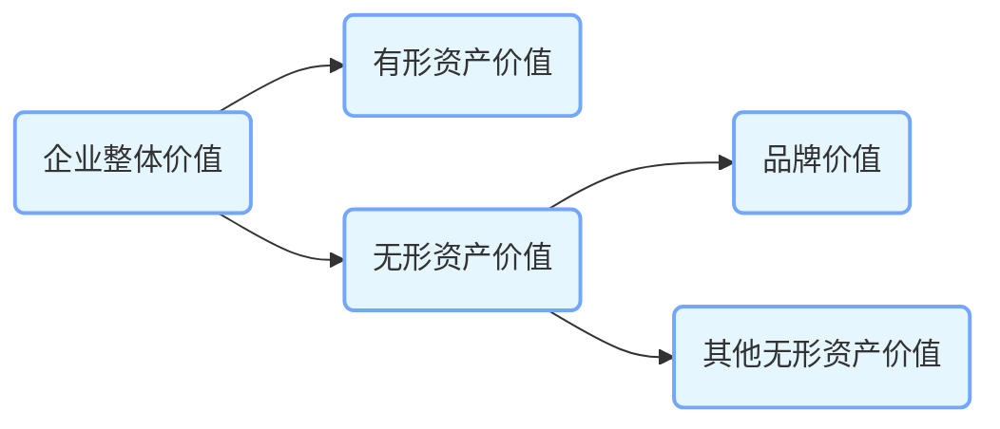

# 巴菲特的品牌价值理论：无形资产的重要性

> 关键词：巴菲特、品牌价值理论、无形资产、企业竞争力、投资策略

> 摘要：本文深入探讨了巴菲特的品牌价值理论，着重阐述无形资产在企业运营和投资领域的重要性。首先介绍了研究此理论的背景，包括目的、预期读者、文档结构和相关术语。接着详细剖析核心概念，展示品牌价值与无形资产的联系。通过Python代码讲解核心算法原理及操作步骤，用数学模型和公式进一步说明其原理。以实际项目案例展示理论的应用，分析开发环境搭建、代码实现与解读。探讨了品牌价值理论在不同场景的实际应用，推荐了学习、开发相关的工具和资源，最后总结未来发展趋势与挑战，解答常见问题并提供扩展阅读和参考资料。

## 1. 背景介绍 
### 1.1 目的和范围
本研究的目的在于全面解析巴菲特的品牌价值理论，深入探讨无形资产在企业经营和投资决策中的重要性。通过对该理论的研究，我们可以更好地理解企业的内在价值，为投资者提供更准确的投资依据，同时也为企业管理者提供提升企业竞争力的思路。研究范围涵盖了品牌价值理论的核心概念、算法原理、数学模型，以及在实际项目中的应用，还会探讨其在不同行业的实际应用场景。

### 1.2 预期读者
本文预期读者包括投资者、企业管理者、金融分析师、市场营销人员以及对巴菲特投资理念和品牌价值理论感兴趣的人士。投资者可以从中学习如何评估企业的无形资产价值，从而做出更明智的投资决策；企业管理者可以借鉴品牌价值理论来提升企业的品牌形象和竞争力；金融分析师可以将该理论应用到企业估值和行业研究中；市场营销人员可以更好地理解品牌建设的重要性；而对相关理论感兴趣的人士则可以深入了解巴菲特的投资智慧。

### 1.3 文档结构概述
本文将按照以下结构进行阐述：首先介绍品牌价值理论的背景信息，包括目的、读者群体和文档结构等；接着详细讲解核心概念和它们之间的联系，通过示意图和流程图进行直观展示；然后阐述核心算法原理和具体操作步骤，并用Python代码进行详细说明；再介绍相关的数学模型和公式，并举例说明；之后通过实际项目案例展示理论的应用，包括开发环境搭建、代码实现和解读；探讨该理论在不同实际场景中的应用；推荐学习和开发相关的工具和资源；最后总结未来发展趋势与挑战，解答常见问题并提供扩展阅读和参考资料。

### 1.4 术语表
#### 1.4.1 核心术语定义
- **品牌价值**：品牌在消费者心目中的形象、声誉和认知所带来的经济价值，是企业无形资产的重要组成部分。它反映了品牌在市场上的竞争力和影响力，能够为企业带来持续的收益。
- **无形资产**：企业拥有或控制的没有实物形态的可辨认非货币性资产，如品牌、专利、商标、著作权、商业秘密等。无形资产虽然不具有实物形态，但却能为企业创造巨大的价值。
- **企业内在价值**：企业在未来持续经营过程中所能产生的现金流量的现值，它是评估企业投资价值的重要依据。品牌价值作为无形资产的一部分，对企业内在价值有着重要的影响。

#### 1.4.2 相关概念解释
- **品牌忠诚度**：消费者对某一品牌的产品或服务产生的重复购买行为和情感依赖。高品牌忠诚度意味着消费者愿意长期选择该品牌的产品，为企业带来稳定的收入。品牌忠诚度的建立与品牌价值密切相关，良好的品牌形象和口碑有助于提高品牌忠诚度。
- **品牌溢价**：消费者愿意为某一品牌的产品支付高于同类产品的价格。品牌溢价是品牌价值的直接体现，它反映了品牌在市场上的差异化竞争优势。企业通过提升品牌价值，可以获得更高的品牌溢价，从而提高企业的盈利能力。

#### 1.4.3 缩略词列表
- **NPV**：Net Present Value，净现值，是指投资项目在未来各期现金净流量的现值与初始投资额现值之间的差额，用于评估投资项目的可行性和价值。
- **DCF**：Discounted Cash Flow，现金流折现法，是一种通过预测企业未来的现金流量，并将其折现到当前时刻来计算企业内在价值的方法。

## 2. 核心概念与联系 
### 核心概念原理
巴菲特认为，品牌价值是企业无形资产的核心部分，它能够为企业带来持续的竞争优势和超额利润。品牌作为一种无形资产，具有以下特点：
- **独特性**：每个品牌都有其独特的定位、形象和文化，能够在消费者心目中形成差异化的认知。例如，可口可乐的品牌形象与快乐、活力相关联，这种独特的品牌定位使其在饮料市场中脱颖而出。
- **长期性**：品牌价值的形成需要长期的积累和维护，它是企业在市场竞争中逐步建立起来的。一个知名品牌往往经历了多年甚至几十年的发展，才赢得了消费者的信任和认可。
- **增值性**：随着品牌知名度和美誉度的提高，品牌价值会不断增值。良好的品牌形象能够吸引更多的消费者，提高市场份额，从而为企业带来更多的利润。同时，品牌的增值也有助于企业进行品牌延伸和拓展新的业务领域。

### 架构的文本示意图
```plaintext
         企业整体价值
        /             \
 有形资产价值       无形资产价值
                    /            \
               品牌价值         其他无形资产价值
```

### Mermaid 流程图


从流程图可以看出，企业整体价值由有形资产价值和无形资产价值组成，而无形资产价值又包括品牌价值和其他无形资产价值。品牌价值在企业整体价值中占据着重要的地位，它与企业的竞争力和盈利能力密切相关。

## 3. 核心算法原理 & 具体操作步骤 
### 核心算法原理
评估品牌价值的一种常用方法是现金流折现法（DCF）。该方法的核心思想是将品牌在未来各期产生的现金流量折现到当前时刻，从而得到品牌的现值。具体步骤如下：
1. **预测品牌未来的现金流量**：通过分析品牌的市场份额、销售增长率、利润率等因素，预测品牌在未来若干年的现金流量。
2. **确定折现率**：折现率反映了资金的时间价值和投资风险。通常可以使用加权平均资本成本（WACC）作为折现率。
3. **计算品牌的现值**：将预测的未来现金流量按照折现率进行折现，然后求和得到品牌的现值。

### Python 源代码详细阐述
```python
import numpy as np

def calculate_brand_value(cash_flows, discount_rate):
    """
    计算品牌的现值
    :param cash_flows: 未来各期的现金流量列表
    :param discount_rate: 折现率
    :return: 品牌的现值
    """
    years = len(cash_flows)
    discounted_cash_flows = []
    for i in range(years):
        # 计算每期现金流量的现值
        discounted_cash_flow = cash_flows[i] / ((1 + discount_rate) ** (i + 1))
        discounted_cash_flows.append(discounted_cash_flow)
    # 求和得到品牌的现值
    brand_value = np.sum(discounted_cash_flows)
    return brand_value

# 示例数据
cash_flows = [100, 120, 140, 160, 180]  # 未来 5 年的现金流量
discount_rate = 0.1  # 折现率为 10%

# 计算品牌价值
brand_value = calculate_brand_value(cash_flows, discount_rate)
print(f"品牌的现值为: {brand_value}")
```
### 具体操作步骤
1. **数据收集**：收集品牌的历史销售数据、市场份额数据、成本数据等，以便预测未来的现金流量。
2. **现金流量预测**：根据历史数据和市场趋势，预测品牌在未来若干年的现金流量。可以采用趋势分析、市场调研等方法进行预测。
3. **折现率确定**：根据企业的资本结构、市场风险等因素，确定合适的折现率。通常可以参考同行业的平均折现率或使用资本资产定价模型（CAPM）进行计算。
4. **计算品牌价值**：将预测的未来现金流量代入上述 Python 代码中，计算品牌的现值。

## 4. 数学模型和公式 & 详细讲解 & 举例说明 
### 数学模型和公式
现金流折现法的数学模型可以表示为：
$$
NPV = \sum_{t=1}^{n} \frac{CF_t}{(1 + r)^t}
$$
其中：
- $NPV$ 表示品牌的净现值（即品牌价值）
- $CF_t$ 表示第 $t$ 期的现金流量
- $r$ 表示折现率
- $n$ 表示预测的期数

### 详细讲解
该公式的含义是将未来各期的现金流量按照折现率进行折现，然后求和得到品牌的现值。折现的目的是考虑资金的时间价值，因为未来的现金流量在当前时刻的价值要低于其实际金额。折现率 $r$ 反映了资金的时间价值和投资风险，折现率越高，未来现金流量的现值越低。

### 举例说明
假设某品牌预计在未来 3 年的现金流量分别为 200 万元、250 万元和 300 万元，折现率为 10%。则该品牌的价值计算如下：
第 1 年现金流量的现值：
$$
\frac{200}{(1 + 0.1)^1} = \frac{200}{1.1} \approx 181.82 \text{（万元）}
$$
第 2 年现金流量的现值：
$$
\frac{250}{(1 + 0.1)^2} = \frac{250}{1.21} \approx 206.61 \text{（万元）}
$$
第 3 年现金流量的现值：
$$
\frac{300}{(1 + 0.1)^3} = \frac{300}{1.331} \approx 225.39 \text{（万元）}
$$
品牌的价值：
$$
NPV = 181.82 + 206.61 + 225.39 = 613.82 \text{（万元）}
$$

通过以上计算可以看出，该品牌在考虑资金时间价值和投资风险后，其现值为 613.82 万元。

## 5. 项目实战：代码实际案例和详细解释说明 
### 5.1  开发环境搭建
为了运行上述 Python 代码，需要搭建以下开发环境：
1. **Python 安装**：从 Python 官方网站（https://www.python.org/downloads/）下载并安装 Python 3.x 版本。
2. **开发工具**：可以选择使用 PyCharm、Jupyter Notebook 等开发工具。这里以 PyCharm 为例，从 JetBrains 官方网站（https://www.jetbrains.com/pycharm/download/）下载并安装 PyCharm 社区版。
3. **依赖库安装**：上述代码使用了 `numpy` 库，在命令行中使用以下命令安装：
```sh
pip install numpy
```

### 5.2  源代码详细实现和代码解读
```python
import numpy as np

def calculate_brand_value(cash_flows, discount_rate):
    """
    计算品牌的现值
    :param cash_flows: 未来各期的现金流量列表
    :param discount_rate: 折现率
    :return: 品牌的现值
    """
    years = len(cash_flows)
    discounted_cash_flows = []
    for i in range(years):
        # 计算每期现金流量的现值
        discounted_cash_flow = cash_flows[i] / ((1 + discount_rate) ** (i + 1))
        discounted_cash_flows.append(discounted_cash_flow)
    # 求和得到品牌的现值
    brand_value = np.sum(discounted_cash_flows)
    return brand_value

# 示例数据
cash_flows = [100, 120, 140, 160, 180]  # 未来 5 年的现金流量
discount_rate = 0.1  # 折现率为 10%

# 计算品牌价值
brand_value = calculate_brand_value(cash_flows, discount_rate)
print(f"品牌的现值为: {brand_value}")
```
### 代码解读
1. **导入依赖库**：
```python
import numpy as np
```
导入 `numpy` 库，用于进行数值计算。

2. **定义计算品牌价值的函数**：
```python
def calculate_brand_value(cash_flows, discount_rate):
```
定义一个名为 `calculate_brand_value` 的函数，接受两个参数：`cash_flows` 表示未来各期的现金流量列表，`discount_rate` 表示折现率。

3. **计算每期现金流量的现值**：
```python
years = len(cash_flows)
discounted_cash_flows = []
for i in range(years):
    discounted_cash_flow = cash_flows[i] / ((1 + discount_rate) ** (i + 1))
    discounted_cash_flows.append(discounted_cash_flow)
```
通过循环遍历现金流量列表，计算每期现金流量的现值，并将其添加到 `discounted_cash_flows` 列表中。

4. **求和得到品牌的现值**：
```python
brand_value = np.sum(discounted_cash_flows)
```
使用 `numpy` 库的 `sum` 函数对 `discounted_cash_flows` 列表中的元素进行求和，得到品牌的现值。

5. **示例数据和计算**：
```python
cash_flows = [100, 120, 140, 160, 180]
discount_rate = 0.1
brand_value = calculate_brand_value(cash_flows, discount_rate)
print(f"品牌的现值为: {brand_value}")
```
定义示例数据，调用 `calculate_brand_value` 函数计算品牌价值，并将结果打印输出。

### 5.3  代码解读与分析
该代码实现了使用现金流折现法计算品牌价值的功能。通过输入未来各期的现金流量和折现率，函数可以计算出品牌的现值。代码的优点是简单易懂，易于实现。但也存在一些局限性，例如现金流量的预测可能存在误差，折现率的确定也具有一定的主观性。在实际应用中，需要结合更多的市场信息和专业知识，对现金流量和折现率进行更准确的估计。

## 6. 实际应用场景 
### 企业投资决策
在企业进行投资决策时，品牌价值是一个重要的考虑因素。具有高品牌价值的企业通常具有更强的市场竞争力和盈利能力，投资这样的企业可以获得更高的回报。例如，巴菲特在投资可口可乐时，看重的就是可口可乐强大的品牌价值。可口可乐作为全球知名品牌，具有广泛的消费者基础和高品牌忠诚度，能够为企业带来持续的现金流量。通过评估可口可乐的品牌价值，巴菲特认为该企业具有较高的投资价值，从而进行了长期投资并获得了丰厚的回报。

### 企业并购
在企业并购过程中，品牌价值也是评估目标企业价值的重要组成部分。收购具有高品牌价值的企业可以快速提升收购方的市场份额和品牌影响力。例如，雀巢收购惠氏婴儿奶粉业务，惠氏作为知名的婴儿奶粉品牌，具有较高的品牌价值。雀巢通过收购惠氏，不仅获得了其优质的产品线，还借助其品牌影响力进一步拓展了在婴儿奶粉市场的份额。

### 市场营销策略制定
品牌价值理论可以为企业的市场营销策略制定提供指导。企业可以通过提升品牌价值来提高产品的市场竞争力和价格优势。例如，苹果公司通过不断创新和提升产品品质，打造了高端、时尚的品牌形象，其产品具有较高的品牌溢价。消费者愿意为苹果产品支付更高的价格，这使得苹果公司在市场竞争中获得了巨大的优势。企业可以根据品牌价值的评估结果，制定针对性的市场营销策略，如品牌推广、产品差异化等，以提升品牌价值和市场份额。

### 品牌延伸和拓展
品牌价值高的企业可以利用品牌的影响力进行品牌延伸和拓展新的业务领域。例如，迪士尼公司凭借其强大的品牌价值，从动画电影业务延伸到主题公园、玩具、服装等多个领域。消费者由于对迪士尼品牌的信任和喜爱，更容易接受其推出的新产品和服务。通过品牌延伸，企业可以降低市场推广成本，提高新产品的成功率，进一步提升品牌价值和企业的盈利能力。

## 7. 工具和资源推荐
### 7.1 学习资源推荐
#### 7.1.1 书籍推荐
- 《巴菲特致股东的信：投资者和公司高管教程》：这本书收录了巴菲特多年来致股东的信，其中包含了他对投资理念、企业价值评估等方面的深刻见解，是学习巴菲特投资思想的经典书籍。
- 《品牌洗脑：世界著名品牌只做不说的营销秘密》：深入探讨了品牌营销的奥秘，揭示了品牌如何影响消费者的心理和行为，有助于理解品牌价值的形成和提升。
- 《市场营销原理》：全面介绍了市场营销的基本原理和方法，包括品牌建设、市场细分、目标市场选择等内容，是学习市场营销和品牌管理的基础教材。

#### 7.1.2 在线课程
- Coursera 上的“Investment Management Specialization”：由知名教授授课，涵盖了投资管理的各个方面，包括企业估值、投资策略等内容，对理解巴菲特的投资理念和品牌价值评估有很大帮助。
- edX 上的“Marketing Analytics”：该课程介绍了市场营销分析的方法和工具，包括品牌价值评估的相关技术，适合想要深入学习品牌管理和数据分析的人士。

#### 7.1.3 技术博客和网站
- Seeking Alpha：提供了大量的金融分析文章和投资研究报告，包括对企业品牌价值的分析和评估，是投资者获取市场信息和投资建议的重要平台。
- BrandFinance：专注于品牌价值评估和研究，发布全球品牌价值排行榜等权威报告，对了解品牌价值的动态和趋势有很大帮助。

### 7.2 开发工具框架推荐
#### 7.2.1 IDE和编辑器
- PyCharm：一款专业的 Python 集成开发环境，具有代码编辑、调试、自动补全、代码分析等功能，适合 Python 开发和数据分析。
- Jupyter Notebook：一种交互式的开发环境，支持 Python、R 等多种编程语言，方便进行数据可视化和代码演示，适合进行品牌价值评估的数据分析和建模。

#### 7.2.2 调试和性能分析工具
- PDB：Python 自带的调试工具，可以帮助开发者定位代码中的错误和问题，提高代码的质量和稳定性。
- cProfile：Python 标准库中的性能分析工具，可以分析代码的运行时间和函数调用情况，帮助开发者优化代码性能。

#### 7.2.3 相关框架和库
- NumPy：用于进行数值计算和科学计算的 Python 库，提供了高效的数组操作和数学函数，在品牌价值评估的数据分析中经常使用。
- Pandas：用于数据处理和分析的 Python 库，提供了数据结构和数据操作方法，方便进行数据清洗、整理和分析。

### 7.3 相关论文著作推荐
#### 7.3.1 经典论文
- “The Economic Value of Brands”：该论文深入探讨了品牌的经济价值，提出了品牌价值评估的方法和模型，对品牌价值理论的发展做出了重要贡献。
- “Brand Equity and Advertising: Measuring the Financial Impact”：研究了品牌资产与广告之间的关系，分析了广告对品牌价值的影响，为企业的广告策略制定提供了理论依据。

#### 7.3.2 最新研究成果
- 《Brand Value and Corporate Performance: An Empirical Analysis》：通过实证研究分析了品牌价值与企业绩效之间的关系，为企业提升品牌价值和经营绩效提供了参考。
- 《The Role of Brand Image in Consumer Decision-Making: A Review and Future Research Directions》：探讨了品牌形象在消费者决策中的作用，为企业塑造品牌形象和提升品牌价值提供了新的思路。

#### 7.3.3 应用案例分析
- 《Case Studies in Brand Management》：收录了多个知名品牌的管理案例，分析了这些品牌在品牌建设、品牌推广、品牌延伸等方面的成功经验和失败教训，对企业的品牌管理实践具有重要的借鉴意义。

## 8. 总结：未来发展趋势与挑战
### 未来发展趋势
- **数字化转型**：随着互联网和数字化技术的发展，品牌的传播和营销方式将发生深刻变化。企业将更加注重数字化品牌建设，通过社交媒体、电子商务等平台提升品牌的知名度和影响力。例如，一些新兴品牌通过直播带货、短视频营销等方式迅速崛起，扩大了品牌的市场份额。
- **可持续发展**：消费者对企业的社会责任和可持续发展越来越关注，具有良好社会形象和环保意识的品牌将更受消费者青睐。企业将把可持续发展纳入品牌战略，通过环保产品、公益活动等方式提升品牌价值。例如，一些快时尚品牌推出环保系列产品，受到了消费者的欢迎。
- **个性化定制**：消费者的需求越来越多样化和个性化，企业将通过提供个性化的产品和服务来满足消费者的需求，提升品牌的差异化竞争优势。例如，一些服装品牌提供个性化定制服务，让消费者可以根据自己的喜好选择款式、颜色和材质，增强了消费者对品牌的认同感。

### 挑战
- **品牌竞争加剧**：随着市场的全球化和竞争的加剧，品牌之间的竞争将更加激烈。企业需要不断创新和提升品牌价值，以在激烈的市场竞争中脱颖而出。同时，新品牌的不断涌现也给现有品牌带来了巨大的挑战。
- **品牌形象维护**：在信息传播迅速的时代，品牌形象容易受到负面事件的影响。企业需要加强品牌形象的维护和管理，及时应对负面舆情，避免品牌形象受损。例如，一些企业因产品质量问题、公关危机等事件导致品牌形象大幅下降，给企业带来了巨大的损失。
- **数据安全和隐私保护**：在数字化品牌建设过程中，企业需要收集和处理大量的消费者数据。如何保护消费者的数据安全和隐私，是企业面临的重要挑战。一旦发生数据泄露事件，不仅会损害消费者的利益，也会对品牌形象造成严重影响。

## 9. 附录：常见问题与解答
### 问题 1：品牌价值评估的准确性如何保证？
解答：品牌价值评估存在一定的主观性和不确定性，要保证评估的准确性，需要综合考虑多方面的因素。首先，要收集准确、全面的数据，包括市场数据、财务数据、消费者数据等。其次，选择合适的评估方法，如现金流折现法、市场比较法等，并根据实际情况进行调整。此外，还需要结合专业的知识和经验，对评估结果进行合理的分析和判断。

### 问题 2：品牌价值与企业市值之间有什么关系？
解答：品牌价值是企业市值的重要组成部分，但两者并不完全等同。品牌价值反映了品牌在市场上的竞争力和影响力，能够为企业带来持续的收益。而企业市值是市场对企业整体价值的评估，受到多种因素的影响，如宏观经济环境、行业发展趋势、企业的财务状况等。一般来说，具有高品牌价值的企业往往具有较高的市值，但市值还会受到其他因素的波动影响。

### 问题 3：如何提升品牌价值？
解答：提升品牌价值可以从多个方面入手。一是加强品牌建设，包括品牌定位、品牌形象塑造、品牌传播等方面。明确品牌的核心价值和定位，塑造独特的品牌形象，并通过有效的传播渠道将品牌信息传递给消费者。二是提高产品和服务质量，满足消费者的需求和期望，增强消费者的满意度和忠诚度。三是开展品牌创新，不断推出新产品、新服务，满足消费者的多样化需求，提升品牌的竞争力。四是积极履行社会责任，树立良好的企业社会形象，增强品牌的美誉度和公信力。

## 10. 扩展阅读 & 参考资料
### 扩展阅读
- 《竞争战略》：作者迈克尔·波特，该书介绍了企业竞争战略的基本理论和方法，对理解品牌在市场竞争中的地位和作用有很大帮助。
- 《影响力》：作者罗伯特·西奥迪尼，探讨了影响消费者行为的因素和原理，有助于企业更好地进行品牌营销和推广。

### 参考资料
- 巴菲特历年致股东的信
- BrandFinance 发布的品牌价值评估报告
- 相关学术期刊上发表的关于品牌价值和无形资产的研究论文

作者：AI天才研究院/AI Genius Institute & 禅与计算机程序设计艺术 /Zen And The Art of Computer Programming