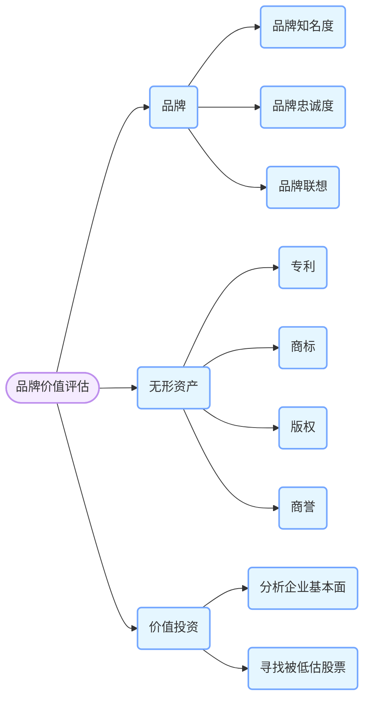

# 巴菲特的品牌价值评估：无形资产的重要性

> 关键词：巴菲特、品牌价值评估、无形资产、价值投资、企业评估

> 摘要：本文聚焦于巴菲特的品牌价值评估理念，深入探讨无形资产在企业价值中的重要性。通过对相关核心概念的剖析、算法原理的阐述、数学模型的解读以及实际案例的分析，揭示品牌等无形资产如何影响企业的长期竞争力和市场价值。同时，介绍了在评估过程中可使用的工具和资源，最后对品牌价值评估的未来发展趋势与挑战进行总结，旨在为投资者和企业管理者提供全面而深入的见解。

## 1. 背景介绍 
### 1.1 目的和范围
本文章的主要目的是深入探讨巴菲特在品牌价值评估方面的思想和方法，以及强调无形资产在企业整体价值中的关键作用。范围涵盖了品牌价值评估的核心概念、相关算法原理、数学模型，通过实际案例分析展示如何在现实中应用这些理念，还会介绍相关的工具和资源，并对未来的发展趋势和挑战进行展望。通过这些内容，帮助读者更好地理解无形资产的重要性，以及如何在投资和企业管理中运用品牌价值评估的方法。

### 1.2 预期读者
预期读者包括对价值投资感兴趣的投资者，无论是个人投资者还是专业投资机构的从业者。企业管理者也能从本文中获得关于品牌建设和无形资产管理的启示，以提升企业的市场竞争力和价值。此外，学术研究人员和学生在研究企业价值评估、市场营销等领域时，本文也可作为有价值的参考资料。

### 1.3 文档结构概述
本文将按照以下结构展开：首先介绍核心概念，包括品牌价值、无形资产等的定义和它们之间的联系，并通过文本示意图和 Mermaid 流程图进行直观展示。接着阐述核心算法原理，使用 Python 代码详细说明如何进行品牌价值评估。然后介绍相关的数学模型和公式，并结合具体例子进行讲解。之后通过项目实战，展示代码实际案例并进行详细解释。再探讨品牌价值评估在实际中的应用场景。随后推荐相关的学习资源、开发工具框架以及论文著作。最后进行总结，分析未来发展趋势与挑战，提供附录解答常见问题，并列出扩展阅读和参考资料。

### 1.4 术语表
#### 1.4.1 核心术语定义
- **品牌价值**：品牌价值是指品牌在消费者心目中的形象、声誉和认知所产生的经济价值。它是品牌能够为企业带来的额外收益的体现，包括品牌忠诚度、品牌知名度、品牌联想等因素综合作用的结果。
- **无形资产**：无形资产是指企业拥有或者控制的没有实物形态的可辨认非货币性资产，如专利、商标、版权、品牌、商誉等。与有形资产（如固定资产、存货等）不同，无形资产主要以知识、技术、声誉等形式存在。
- **价值投资**：价值投资是一种投资策略，由本杰明·格雷厄姆（Benjamin Graham）提出，巴菲特是其坚定的实践者。价值投资强调通过分析企业的基本面，寻找被市场低估的股票进行投资，注重企业的内在价值和长期发展潜力。

#### 1.4.2 相关概念解释
- **品牌忠诚度**：品牌忠诚度是指消费者在购买决策中，多次表现出对某一品牌有偏向性的（而非随意的）行为反应。它是一种行为过程，也是一种心理（决策和评估）过程。高品牌忠诚度意味着消费者更愿意重复购买该品牌的产品或服务，并且对价格波动的敏感度较低。
- **品牌知名度**：品牌知名度是指潜在购买者认识到或记起某一品牌是某类产品的能力。它反映了品牌在市场中的曝光度和被认知的程度，是品牌资产的重要组成部分。品牌知名度越高，消费者在购买决策时越容易想到该品牌。
- **商誉**：商誉是指企业在同等条件下，能获得高于正常投资报酬率所形成的价值。它是企业由于所处的地理位置优越，或由于信誉好而获得了客户的信任，或由于组织得当、生产经营效益高，或由于技术先进、掌握了生产诀窍等原因而形成的无形价值。

#### 1.4.3 缩略词列表
- **DCF**：Discounted Cash Flow，贴现现金流法，是一种常用的企业价值评估方法，通过预测企业未来的现金流量，并将其贴现到当前时刻来计算企业的内在价值。
- **ROE**：Return on Equity，净资产收益率，是衡量企业盈利能力的重要指标，反映了股东权益的收益水平，用以衡量公司运用自有资本的效率。

## 2. 核心概念与联系 
### 核心概念原理
品牌价值评估是对品牌在市场中所具有的经济价值进行量化的过程。品牌作为一种无形资产，其价值的形成源于消费者对品牌的认知、情感和行为。消费者对品牌的良好认知和积极情感会导致品牌忠诚度的提高，进而增加品牌的市场份额和盈利能力。品牌价值评估的目的是为了帮助企业管理者和投资者更好地了解品牌的价值，从而做出更明智的决策。

无形资产包括品牌、专利、商标、版权等，它们虽然没有实物形态，但对企业的发展和竞争力具有重要影响。以品牌为例，一个具有高知名度和良好声誉的品牌可以为企业带来以下优势：
- **价格优势**：消费者愿意为知名品牌支付更高的价格，从而提高企业的利润率。
- **市场份额优势**：品牌忠诚度高的消费者更倾向于选择该品牌的产品或服务，有助于企业扩大市场份额。
- **抗风险能力**：在市场波动或竞争激烈的情况下，知名品牌更容易保持消费者的信任，具有更强的抗风险能力。

### 文本示意图
```plaintext
品牌价值评估
|
|--品牌（无形资产）
|   |--品牌知名度
|   |--品牌忠诚度
|   |--品牌联想
|
|--无形资产
|   |--专利
|   |--商标
|   |--版权
|   |--商誉
|
|--价值投资
|   |--分析企业基本面
|   |--寻找被低估股票
```

### Mermaid 流程图


## 3. 核心算法原理 & 具体操作步骤 
### 核心算法原理
在品牌价值评估中，常用的方法之一是贴现现金流法（DCF）。DCF 法的基本原理是将品牌未来产生的现金流量贴现到当前时刻，以计算品牌的内在价值。其核心思想是，品牌的价值等于其未来所能带来的经济利益的现值。

具体来说，DCF 法的步骤如下：
1. **预测未来现金流量**：分析品牌在未来一段时间内（通常为 5 - 10 年）所能产生的现金流量。这需要考虑品牌的市场份额、销售增长率、利润率等因素。
2. **确定贴现率**：贴现率反映了资金的时间价值和投资的风险程度。通常可以使用加权平均资本成本（WACC）作为贴现率，它考虑了企业的债务成本和股权成本。
3. **计算现值**：将预测的未来现金流量按照贴现率贴现到当前时刻，得到品牌的现值。

### Python 代码实现
```python
import numpy as np

def dcf_brand_value(cash_flows, discount_rate):
    """
    计算品牌的贴现现金流价值
    :param cash_flows: 未来各期的现金流量列表
    :param discount_rate: 贴现率
    :return: 品牌的贴现现金流价值
    """
    n = len(cash_flows)
    present_values = []
    for i in range(n):
        present_value = cash_flows[i] / ((1 + discount_rate) ** (i + 1))
        present_values.append(present_value)
    brand_value = np.sum(present_values)
    return brand_value

# 示例数据
cash_flows = [100, 120, 130, 140, 150]  # 未来 5 年的现金流量
discount_rate = 0.1  # 贴现率为 10%

# 计算品牌价值
brand_value = dcf_brand_value(cash_flows, discount_rate)
print(f"品牌的贴现现金流价值为: {brand_value}")
```
### 代码解释
1. **函数定义**：`dcf_brand_value` 函数接受两个参数，`cash_flows` 是未来各期的现金流量列表，`discount_rate` 是贴现率。
2. **计算现值**：通过循环遍历现金流量列表，将每期的现金流量按照贴现率贴现到当前时刻，并将结果存储在 `present_values` 列表中。
3. **求和**：使用 `np.sum` 函数对 `present_values` 列表中的值进行求和，得到品牌的贴现现金流价值。
4. **示例数据和调用**：定义了未来 5 年的现金流量列表和贴现率，并调用 `dcf_brand_value` 函数计算品牌价值，最后将结果打印输出。

## 4. 数学模型和公式 & 详细讲解 & 举例说明 
### 数学模型和公式
DCF 法的数学模型可以表示为：
$$
V = \sum_{t=1}^{n} \frac{CF_t}{(1 + r)^t}
$$
其中：
- $V$ 表示品牌的价值
- $CF_t$ 表示第 $t$ 期的现金流量
- $r$ 表示贴现率
- $n$ 表示预测的期数

### 详细讲解
该公式的含义是，将品牌在未来 $n$ 期内产生的现金流量 $CF_t$ 分别贴现到当前时刻，然后将这些现值相加，得到品牌的总价值 $V$。贴现的过程是通过除以 $(1 + r)^t$ 来实现的，其中 $(1 + r)^t$ 表示资金在 $t$ 期内按照贴现率 $r$ 复利增长的倍数。

### 举例说明
假设某品牌预计在未来 3 年内分别产生现金流量 200 万元、250 万元和 300 万元，贴现率为 10%。则该品牌的价值计算如下：

第 1 年现金流量的现值：
$$
PV_1 = \frac{CF_1}{(1 + r)^1} = \frac{200}{(1 + 0.1)^1} \approx 181.82 \text{（万元）}
$$

第 2 年现金流量的现值：
$$
PV_2 = \frac{CF_2}{(1 + r)^2} = \frac{250}{(1 + 0.1)^2} \approx 206.61 \text{（万元）}
$$

第 3 年现金流量的现值：
$$
PV_3 = \frac{CF_3}{(1 + r)^3} = \frac{300}{(1 + 0.1)^3} \approx 225.39 \text{（万元）}
$$

品牌的总价值：
$$
V = PV_1 + PV_2 + PV_3 \approx 181.82 + 206.61 + 225.39 = 613.82 \text{（万元）}
$$

通过这个例子可以看出，DCF 法通过考虑资金的时间价值，将未来的现金流量转化为当前的价值，从而更准确地评估品牌的价值。

## 5. 项目实战：代码实际案例和详细解释说明 
### 5.1  开发环境搭建
为了运行上述的 Python 代码，需要搭建相应的开发环境。以下是具体步骤：

#### 安装 Python
首先，从 Python 官方网站（https://www.python.org/downloads/）下载并安装 Python。建议选择 Python 3.7 及以上版本。

#### 安装 NumPy
NumPy 是一个用于科学计算的 Python 库，在上述代码中用于数组操作和求和。可以使用以下命令通过 pip 安装 NumPy：
```sh
pip install numpy
```

#### 选择开发工具
可以选择使用集成开发环境（IDE）如 PyCharm，或者文本编辑器如 Visual Studio Code。这里以 Visual Studio Code 为例，安装并配置 Python 扩展，以便更好地编写和运行 Python 代码。

### 5.2  源代码详细实现和代码解读
以下是完整的代码示例，包含了对品牌价值评估的详细实现和注释：

```python
import numpy as np

def dcf_brand_value(cash_flows, discount_rate):
    """
    计算品牌的贴现现金流价值
    :param cash_flows: 未来各期的现金流量列表
    :param discount_rate: 贴现率
    :return: 品牌的贴现现金流价值
    """
    # 获取现金流量的期数
    n = len(cash_flows)
    # 初始化现值列表
    present_values = []
    # 遍历各期现金流量
    for i in range(n):
        # 计算每期现金流量的现值
        present_value = cash_flows[i] / ((1 + discount_rate) ** (i + 1))
        # 将现值添加到列表中
        present_values.append(present_value)
    # 计算品牌的贴现现金流价值
    brand_value = np.sum(present_values)
    return brand_value

# 示例数据
# 假设未来 5 年的现金流量分别为 100、120、130、140、150
cash_flows = [100, 120, 130, 140, 150]
# 贴现率为 10%
discount_rate = 0.1

# 计算品牌价值
brand_value = dcf_brand_value(cash_flows, discount_rate)
print(f"品牌的贴现现金流价值为: {brand_value}")
```

### 代码解读与分析
#### 函数定义部分
- `dcf_brand_value` 函数接受两个参数，`cash_flows` 是一个列表，包含了未来各期的现金流量；`discount_rate` 是贴现率。
- 在函数内部，首先使用 `len(cash_flows)` 获取现金流量的期数 `n`。
- 然后初始化一个空列表 `present_values`，用于存储每期现金流量的现值。

#### 现值计算部分
- 通过 `for` 循环遍历各期现金流量，使用公式 $\frac{CF_t}{(1 + r)^t}$ 计算每期现金流量的现值，并将结果添加到 `present_values` 列表中。

#### 品牌价值计算部分
- 使用 `np.sum(present_values)` 对 `present_values` 列表中的所有现值进行求和，得到品牌的贴现现金流价值。

#### 主程序部分
- 定义了示例数据 `cash_flows` 和 `discount_rate`。
- 调用 `dcf_brand_value` 函数计算品牌价值，并将结果存储在 `brand_value` 变量中。
- 最后使用 `print` 函数输出品牌的贴现现金流价值。

通过这个项目实战，我们可以看到如何使用 Python 代码实现品牌价值的评估，并且可以根据实际情况修改现金流量和贴现率，以评估不同品牌的价值。

## 6. 实际应用场景 
### 投资决策
在投资领域，品牌价值评估对于投资者来说至关重要。巴菲特等价值投资者在选择投资标的时，会非常关注企业的品牌价值。一个具有高品牌价值的企业通常具有更强的市场竞争力和盈利能力，能够为投资者带来长期稳定的回报。例如，可口可乐作为全球知名品牌，其品牌价值极高。投资者在评估可口可乐公司的投资价值时，品牌价值是一个重要的考虑因素。通过对可口可乐品牌未来现金流量的预测和贴现，投资者可以更准确地评估该公司的内在价值，从而做出更明智的投资决策。

### 企业并购
在企业并购过程中，品牌价值评估可以帮助并购方确定合理的并购价格。当一家企业收购另一家企业时，被收购企业的品牌价值是其无形资产的重要组成部分。如果并购方能够准确评估被收购企业的品牌价值，就可以避免过高或过低的出价。例如，当雀巢收购惠氏婴儿奶粉业务时，对惠氏品牌的价值评估是确定交易价格的重要依据。通过评估惠氏品牌在市场中的知名度、忠诚度和市场份额等因素，雀巢可以更合理地确定收购价格，确保并购交易的价值最大化。

### 企业战略规划
对于企业管理者来说，品牌价值评估有助于制定企业的战略规划。通过了解自身品牌的价值和市场地位，企业可以有针对性地进行品牌建设和市场推广。如果企业发现自己的品牌价值较低，可以采取措施提升品牌知名度和美誉度，如加大广告投入、改进产品质量等。例如，小米公司在发展过程中，通过不断提升品牌的科技感和性价比形象，提高了品牌价值，从而在智能手机市场中获得了更大的市场份额。同时，品牌价值评估也可以帮助企业确定品牌延伸的方向，评估进入新市场的可行性。

### 市场营销
在市场营销中，品牌价值评估可以为营销活动提供决策支持。企业可以根据品牌价值的评估结果，制定不同的营销策略。对于高品牌价值的产品，可以采取高端定位和差异化营销策略，提高产品的附加值和利润率。例如，苹果公司凭借其高品牌价值，将产品定位为高端市场，通过独特的设计和优质的服务，吸引了大量的忠实消费者。而对于品牌价值较低的产品，可以采取低价策略或促销活动，提高产品的市场份额。

## 7. 工具和资源推荐
### 7.1 学习资源推荐
#### 7.1.1 书籍推荐
- 《聪明的投资者》（The Intelligent Investor）：由本杰明·格雷厄姆（Benjamin Graham）所著，是价值投资领域的经典之作。书中介绍了价值投资的基本理念和方法，对品牌价值评估和企业价值分析具有重要的指导意义。
- 《巴菲特致股东的信：股份公司教程》（Letters to Shareholders of Berkshire Hathaway）：这本书收集了巴菲特历年致股东的信，从中可以了解到巴菲特的投资哲学和对企业价值评估的独特见解，包括对品牌等无形资产的重视。
- 《品牌洗脑》（Buyology）：作者是马丁·林斯特龙（Martin Lindstrom），该书深入探讨了品牌如何影响消费者的潜意识和购买行为，对于理解品牌价值的形成机制非常有帮助。

#### 7.1.2 在线课程
- Coursera 上的“企业估值与金融建模”（Corporate Valuation and Financial Modeling）课程：该课程由知名教授授课，详细介绍了企业估值的方法和模型，包括贴现现金流法等，对于学习品牌价值评估的算法原理很有帮助。
- edX 上的“市场营销分析”（Marketing Analytics）课程：课程涵盖了市场营销中的数据分析和决策方法，其中涉及到品牌价值评估在市场营销中的应用，通过实际案例分析帮助学员掌握相关知识和技能。

#### 7.1.3 技术博客和网站
- Seeking Alpha：这是一个知名的投资研究网站，提供了大量关于企业价值评估和投资分析的文章和研究报告，其中不乏对品牌价值评估的深入探讨。
- Brand Finance：该网站专注于品牌价值评估，定期发布全球品牌价值排行榜和相关研究报告，是了解品牌价值评估行业动态和方法的重要资源。

### 7.2 开发工具框架推荐
#### 7.2.1 IDE和编辑器
- PyCharm：是一款专业的 Python 集成开发环境，具有代码自动补全、调试、版本控制等功能，非常适合用于开发和调试品牌价值评估的 Python 代码。
- Visual Studio Code：是一款轻量级的代码编辑器，支持多种编程语言，通过安装 Python 扩展可以方便地进行 Python 开发。它具有丰富的插件生态系统，可以根据需要扩展功能。

#### 7.2.2 调试和性能分析工具
- PDB：是 Python 内置的调试器，可以帮助开发者在代码运行过程中进行单步调试、查看变量值等操作，方便排查代码中的问题。
- cProfile：是 Python 标准库中的性能分析工具，可以统计代码中各个函数的执行时间和调用次数，帮助开发者找出代码中的性能瓶颈。

#### 7.2.3 相关框架和库
- NumPy：是 Python 中用于科学计算的基础库，提供了高效的数组操作和数学函数，在品牌价值评估的代码中用于数组求和等操作。
- Pandas：是一个强大的数据处理和分析库，可以用于处理和分析品牌价值评估中的数据，如现金流量数据等。

### 7.3 相关论文著作推荐
#### 7.3.1 经典论文
- “The Theory of Investment Value” by John Burr Williams：该论文提出了贴现现金流法的基本思想，是企业价值评估领域的经典之作，对品牌价值评估的理论发展产生了重要影响。
- “Brand Equity as a Symbolic Construct” by David A. Aaker：论文深入探讨了品牌资产的概念和构成，从符号学的角度分析了品牌价值的形成机制，为品牌价值评估提供了理论基础。

#### 7.3.2 最新研究成果
- 近年来，随着大数据和人工智能技术的发展，一些研究开始将这些技术应用于品牌价值评估。例如，利用社交媒体数据和机器学习算法来预测品牌的未来现金流量和市场表现。可以关注学术期刊如《Journal of Marketing Research》《Marketing Science》等，获取相关的最新研究成果。

#### 7.3.3 应用案例分析
- 一些知名咨询公司如麦肯锡、波士顿咨询集团等会发布关于品牌价值评估和企业战略的应用案例分析报告。这些报告通过实际案例展示了品牌价值评估在企业决策中的应用和效果，具有很强的实践指导意义。

## 8. 总结：未来发展趋势与挑战
### 未来发展趋势
#### 数据驱动的评估方法
随着大数据技术的发展，品牌价值评估将越来越依赖于数据。企业可以收集更多关于消费者行为、市场趋势等方面的数据，利用机器学习和人工智能算法进行分析，从而更准确地预测品牌的未来现金流量和市场表现。例如，通过分析社交媒体数据可以了解消费者对品牌的评价和情感倾向，为品牌价值评估提供更全面的信息。

#### 跨学科融合
品牌价值评估将不再局限于经济学和市场营销领域，而是与心理学、社会学、计算机科学等多个学科进行融合。从心理学角度可以深入了解消费者的品牌认知和购买决策过程，为品牌价值的形成机制提供更深入的解释。计算机科学的发展则为数据处理和分析提供了更强大的工具和方法。

#### 可持续发展因素的纳入
未来的品牌价值评估将越来越重视企业的可持续发展因素，如环境保护、社会责任等。消费者对企业的社会责任意识越来越强，一个具有良好社会形象和可持续发展能力的品牌将更受消费者青睐，从而提升品牌价值。因此，在品牌价值评估中纳入可持续发展因素将成为未来的趋势。

### 挑战
#### 数据质量和隐私问题
虽然大数据为品牌价值评估提供了更多的数据来源，但数据质量和隐私问题也随之而来。数据可能存在不准确、不完整的情况，影响评估结果的准确性。同时，数据隐私问题也需要得到重视，企业在收集和使用消费者数据时需要遵守相关法律法规，保护消费者的隐私。

#### 模型的复杂性和不确定性
随着评估方法的不断发展，品牌价值评估模型越来越复杂。复杂的模型虽然可以考虑更多的因素，但也增加了模型的不确定性和解释难度。如何在保证模型准确性的前提下，提高模型的可解释性是一个挑战。

#### 市场变化的快速性
市场环境变化快速，消费者的需求和偏好也在不断变化。品牌价值评估需要及时反映这些变化，但由于评估方法和数据的滞后性，可能无法及时准确地评估品牌的价值。如何建立动态的品牌价值评估体系，以适应市场的快速变化是未来需要解决的问题。

## 9. 附录：常见问题与解答
### 问题 1：品牌价值评估的结果准确吗？
品牌价值评估的结果是基于一定的假设和模型得出的，存在一定的不确定性。评估结果的准确性受到多种因素的影响，如数据的质量、预测的准确性、模型的合理性等。虽然评估方法可以尽可能地考虑各种因素，但仍然无法完全准确地反映品牌的真实价值。因此，品牌价值评估结果可以作为参考，但不能作为绝对的依据。

### 问题 2：除了贴现现金流法，还有其他品牌价值评估方法吗？
除了贴现现金流法，还有以下几种常见的品牌价值评估方法：
- **市场法**：通过比较类似品牌在市场上的交易价格来评估品牌价值。这种方法的前提是市场上存在可比的品牌交易案例。
- **成本法**：考虑品牌的创建和维护成本，包括广告投入、研发费用等，来评估品牌价值。但这种方法没有充分考虑品牌的未来收益能力。
- **消费者偏好法**：通过调查消费者对品牌的偏好和购买意愿来评估品牌价值。这种方法更侧重于从消费者的角度来衡量品牌的价值。

### 问题 3：品牌价值评估对中小企业有意义吗？
品牌价值评估对中小企业同样具有重要意义。对于中小企业来说，了解自身品牌的价值可以帮助企业制定合理的品牌战略，提高品牌建设的效率。通过品牌价值评估，中小企业可以发现自身品牌的优势和不足，有针对性地进行改进和提升。同时，在融资、合作等方面，品牌价值评估结果也可以作为企业的重要资产证明，增加企业的竞争力。

## 10. 扩展阅读 & 参考资料
### 扩展阅读
- 《竞争战略》（Competitive Strategy）：作者是迈克尔·波特（Michael Porter），该书介绍了企业竞争战略的基本理论和方法，对于理解品牌在市场竞争中的地位和作用具有重要意义。
- 《影响力》（Influence: The Psychology of Persuasion）：作者是罗伯特·西奥迪尼（Robert Cialdini），书中探讨了影响消费者决策的心理因素，有助于深入理解品牌价值的形成机制。

### 参考资料
- 巴菲特历年致股东的信，可从伯克希尔·哈撒韦公司官方网站获取。
- 品牌价值评估相关的学术论文，可通过学术数据库如 Google Scholar、IEEE Xplore 等进行搜索。
- 咨询公司发布的品牌价值评估报告，如 Brand Finance、Interbrand 等公司的报告。

作者：AI天才研究院/AI Genius Institute & 禅与计算机程序设计艺术 /Zen And The Art of Computer Programming