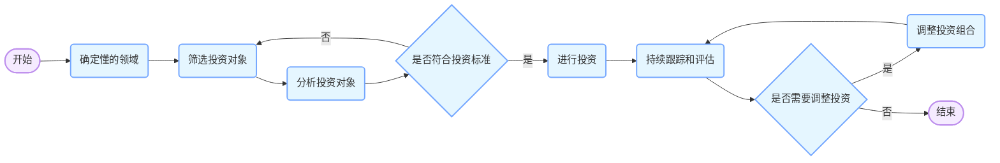

# 巴菲特的圈子理论：投资你懂的领域

> 关键词：巴菲特圈子理论、投资、懂的领域、价值投资、风险控制

> 摘要：本文深入探讨了巴菲特的圈子理论，即投资你懂的领域。从背景介绍入手，阐述该理论的目的、适用读者及文档结构。详细解析核心概念，通过流程图展示其原理架构。深入分析核心算法原理和具体操作步骤，结合数学模型和公式进行说明。通过项目实战案例展现理论的实际应用，探讨其在不同场景下的应用价值。推荐了相关的学习资源、开发工具框架和论文著作。最后总结未来发展趋势与挑战，解答常见问题并提供扩展阅读和参考资料，旨在帮助投资者更好地理解和运用这一重要的投资理论。

## 1. 背景介绍 
### 1.1 目的和范围
巴菲特的圈子理论“投资你懂的领域”是投资界的经典理念之一。本文的目的在于深入剖析这一理论，从多个角度探讨其原理、应用和价值。范围涵盖理论的核心概念、算法原理、数学模型、实际应用案例等方面，旨在为投资者提供全面、深入的理解，帮助他们在投资决策中更好地运用这一理论，提高投资的成功率和回报率。

### 1.2 预期读者
本文预期读者主要包括各类投资者，无论是个人投资者还是专业投资机构从业者。对于初涉投资领域的新手，本文可以帮助他们树立正确的投资观念，了解基本的投资原则；对于有一定投资经验的投资者，本文可以提供更深入的思考和新的视角，帮助他们优化投资策略。此外，金融专业的学生和研究人员也可以从本文中获取有价值的研究素材和理论依据。

### 1.3 文档结构概述
本文将按照以下结构进行阐述：首先介绍核心概念与联系，通过文本示意图和 Mermaid 流程图展示理论的原理架构；接着详细讲解核心算法原理和具体操作步骤，并使用 Python 源代码进行说明；然后介绍数学模型和公式，结合实际例子进行详细讲解；通过项目实战案例，包括开发环境搭建、源代码实现和代码解读，展示理论的实际应用；探讨该理论在不同实际场景下的应用；推荐相关的学习资源、开发工具框架和论文著作；最后总结未来发展趋势与挑战，解答常见问题并提供扩展阅读和参考资料。

### 1.4 术语表
#### 1.4.1 核心术语定义
- **巴菲特的圈子理论**：指投资者应该将投资范围限定在自己熟悉和理解的领域内，只投资那些自己能够真正理解其业务模式、财务状况和发展前景的公司或资产。
- **懂的领域**：指投资者对该领域的行业特点、市场规律、竞争格局、技术发展等方面有深入的了解和认识，能够对该领域内的投资对象进行准确的分析和评估。
- **价值投资**：一种投资策略，强调通过分析公司的内在价值，寻找被市场低估的股票或其他资产进行投资，以获取长期的投资回报。

#### 1.4.2 相关概念解释
- **投资能力圈**：与巴菲特的圈子理论相关，它是指投资者在投资过程中所具备的知识、经验和技能所覆盖的范围。投资者应该在自己的能力圈内进行投资，以提高投资的成功率。
- **风险控制**：在投资过程中，通过各种方法和手段来降低投资风险的过程。遵循巴菲特的圈子理论可以在一定程度上帮助投资者控制风险，因为对熟悉领域的投资更容易进行风险评估和管理。

#### 1.4.3 缩略词列表
- **PE**：市盈率（Price-to-Earnings Ratio），是指股票价格除以每股收益（EPS）的比率，用于评估股票的估值水平。
- **ROE**：净资产收益率（Return on Equity），是指净利润与平均股东权益的百分比，反映股东权益的收益水平。

## 2. 核心概念与联系 
### 核心概念原理
巴菲特的圈子理论基于一个简单而深刻的道理：投资者只有对所投资的领域有深入的了解，才能准确地评估投资对象的价值和风险，从而做出明智的投资决策。如果投资者涉足自己不熟悉的领域，就如同盲人摸象，很难全面、准确地了解投资对象的真实情况，容易受到市场波动和各种不确定性因素的影响，导致投资失败。

例如，一个熟悉科技行业的投资者，对科技公司的研发能力、市场竞争格局、技术发展趋势等方面有深入的了解。当他考虑投资一家科技公司时，能够根据自己的知识和经验，对该公司的未来发展前景进行合理的预测，评估其内在价值。相反，如果他盲目投资一家传统制造业公司，由于对该行业的了解有限，可能无法准确判断该公司的经营状况和市场竞争力，从而增加投资风险。

### 架构的文本示意图
```plaintext
巴菲特的圈子理论
|
|-- 懂的领域
|   |-- 行业知识
|   |   |-- 行业特点
|   |   |-- 市场规律
|   |   |-- 竞争格局
|   |-- 公司分析
|       |-- 业务模式
|       |-- 财务状况
|       |-- 发展前景
|
|-- 投资决策
|   |-- 价值评估
|   |   |-- 内在价值计算
|   |   |-- 估值比较
|   |-- 风险控制
|       |-- 风险评估
|       |-- 风险管理策略
```

### Mermaid 流程图


这个流程图展示了基于巴菲特的圈子理论进行投资的基本流程。首先，投资者需要确定自己懂的领域，然后在这个领域内筛选投资对象。对筛选出的投资对象进行分析，判断是否符合投资标准。如果符合，则进行投资，并持续跟踪和评估投资情况。根据评估结果，决定是否需要调整投资组合。整个过程不断循环，以适应市场的变化和投资对象的发展。

## 3. 核心算法原理 & 具体操作步骤 
### 核心算法原理
巴菲特的圈子理论虽然没有严格意义上的数学算法，但可以将其核心思想转化为一种决策算法。其核心在于通过对投资对象的评估，判断其是否在投资者的能力圈内，以及是否具有投资价值。具体可以通过以下几个步骤来实现：

1. **领域匹配**：判断投资对象所属的领域是否是投资者熟悉的领域。可以通过建立一个领域数据库，将投资者熟悉的领域进行分类和标记，然后将投资对象的领域信息与数据库进行比对。
2. **价值评估**：对投资对象的内在价值进行评估。可以使用一些常见的估值方法，如市盈率法、市净率法、现金流折现法等。通过计算投资对象的内在价值，并与市场价格进行比较，判断其是否被低估或高估。
3. **风险评估**：评估投资对象的风险水平。可以从财务风险、市场风险、行业风险等多个方面进行评估。通过建立风险评估模型，计算投资对象的风险得分，判断其是否在投资者可承受的风险范围内。

### 具体操作步骤
#### 步骤 1：确定自己懂的领域
投资者需要对自己的知识、经验和技能进行全面的评估，确定自己熟悉的领域。可以从自己的专业背景、工作经验、兴趣爱好等方面入手。例如，如果你是一名软件工程师，那么你可能对科技行业中的软件开发、互联网等领域比较熟悉；如果你喜欢研究消费市场，那么你可能对消费品行业比较了解。

#### 步骤 2：建立投资对象数据库
在确定自己懂的领域后，投资者需要收集该领域内的投资对象信息，建立一个投资对象数据库。可以通过各种渠道获取信息，如财经媒体、行业报告、公司年报等。数据库中应包含投资对象的基本信息、财务数据、市场表现等内容。

#### 步骤 3：进行领域匹配
将投资对象数据库中的投资对象所属领域与自己懂的领域进行匹配。对于不在自己懂的领域内的投资对象，可以暂时排除。对于在自己懂的领域内的投资对象，进行进一步的分析。

#### 步骤 4：价值评估
使用合适的估值方法对投资对象的内在价值进行评估。以下是一个使用市盈率法进行估值的 Python 示例代码：
```python
def calculate_intrinsic_value(eps, pe_ratio):
    """
    计算股票的内在价值
    :param eps: 每股收益
    :param pe_ratio: 市盈率
    :return: 内在价值
    """
    return eps * pe_ratio

# 示例数据
eps = 2.0  # 每股收益
pe_ratio = 15  # 市盈率

intrinsic_value = calculate_intrinsic_value(eps, pe_ratio)
print(f"股票的内在价值为: {intrinsic_value}")
```
在这个示例中，我们定义了一个 `calculate_intrinsic_value` 函数，用于计算股票的内在价值。通过输入每股收益和市盈率，函数返回股票的内在价值。

#### 步骤 5：风险评估
从多个方面对投资对象的风险进行评估。例如，可以分析投资对象的财务报表，计算负债率、流动比率等指标，评估其财务风险；可以关注行业的发展趋势和竞争格局，评估其市场风险。以下是一个简单的风险评估示例代码：
```python
def risk_assessment(debt_ratio, current_ratio):
    """
    风险评估函数
    :param debt_ratio: 负债率
    :param current_ratio: 流动比率
    :return: 风险得分
    """
    if debt_ratio > 0.5:
        debt_score = 2
    else:
        debt_score = 1
    
    if current_ratio < 1.0:
        current_score = 2
    else:
        current_score = 1
    
    total_score = debt_score + current_score
    return total_score

# 示例数据
debt_ratio = 0.6  # 负债率
current_ratio = 0.8  # 流动比率

risk_score = risk_assessment(debt_ratio, current_ratio)
print(f"投资对象的风险得分为: {risk_score}")
```
在这个示例中，我们定义了一个 `risk_assessment` 函数，根据负债率和流动比率对投资对象的风险进行评估，返回一个风险得分。

#### 步骤 6：做出投资决策
根据价值评估和风险评估的结果，做出投资决策。如果投资对象的内在价值被低估，且风险在可承受范围内，则可以考虑进行投资；否则，应谨慎投资或放弃该投资对象。

## 4. 数学模型和公式 & 详细讲解 & 举例说明 
### 市盈率估值模型
市盈率（PE）是一种常用的估值方法，其公式为：
$$PE = \frac{P}{EPS}$$
其中，$P$ 表示股票价格，$EPS$ 表示每股收益。

通过变形，可以得到股票的内在价值计算公式：
$$P = PE \times EPS$$

详细讲解：市盈率反映了市场对公司盈利的预期。一般来说，市盈率越高，说明市场对公司的未来发展前景越看好；市盈率越低，说明市场对公司的预期较低。在使用市盈率估值时，需要选择合适的市盈率作为参考。可以参考同行业其他公司的平均市盈率，或者根据公司的历史市盈率进行调整。

举例说明：假设一家公司的每股收益为 $2$ 元，同行业平均市盈率为 $15$ 倍。则该公司股票的内在价值为：
$$P = 15 \times 2 = 30$$（元）
如果该公司股票的市场价格低于 $30$ 元，则说明该股票可能被低估，具有投资价值；如果市场价格高于 $30$ 元，则说明该股票可能被高估，投资风险较大。

### 现金流折现模型
现金流折现模型（DCF）是一种更精确的估值方法，其基本思想是将公司未来的现金流折现到当前时刻，以计算公司的内在价值。公式为：
$$V = \sum_{t=1}^{n} \frac{CF_t}{(1 + r)^t}$$
其中，$V$ 表示公司的内在价值，$CF_t$ 表示第 $t$ 期的现金流，$r$ 表示折现率，$n$ 表示预测期数。

详细讲解：现金流折现模型考虑了公司未来的现金流情况和资金的时间价值。在使用该模型时，需要对公司未来的现金流进行预测，并选择合适的折现率。折现率反映了投资者对资金的时间价值和投资风险的要求。一般来说，折现率越高，说明投资者对风险的要求越高，公司的内在价值就越低。

举例说明：假设一家公司未来三年的现金流分别为 $100$ 万元、$120$ 万元和 $150$ 万元，折现率为 $10\%$。则该公司的内在价值为：
$$V = \frac{100}{(1 + 0.1)^1} + \frac{120}{(1 + 0.1)^2} + \frac{150}{(1 + 0.1)^3}$$
```python
import math

cash_flows = [100, 120, 150]
discount_rate = 0.1
intrinsic_value = 0

for t, cf in enumerate(cash_flows, start=1):
    intrinsic_value += cf / math.pow(1 + discount_rate, t)

print(f"公司的内在价值为: {intrinsic_value} 万元")
```
运行上述代码，即可计算出该公司的内在价值。

### 风险评估模型
风险评估可以使用多种指标和方法，这里介绍一种简单的综合风险评估模型。假设我们使用负债率（$DR$）和流动比率（$CR$）两个指标来评估公司的财务风险，公式为：
$$RiskScore = w_1 \times DR + w_2 \times (1 - CR)$$
其中，$w_1$ 和 $w_2$ 分别为负债率和流动比率的权重，且 $w_1 + w_2 = 1$。

详细讲解：负债率反映了公司的债务水平，负债率越高，说明公司的财务风险越大；流动比率反映了公司的短期偿债能力，流动比率越低，说明公司的短期偿债能力越弱，财务风险越大。通过加权平均的方式，可以综合考虑两个指标对公司财务风险的影响。

举例说明：假设负债率的权重 $w_1 = 0.6$，流动比率的权重 $w_2 = 0.4$，公司的负债率为 $0.6$，流动比率为 $0.8$。则该公司的风险得分为：
$$RiskScore = 0.6 \times 0.6 + 0.4 \times (1 - 0.8)$$
```python
w1 = 0.6
w2 = 0.4
dr = 0.6
cr = 0.8

risk_score = w1 * dr + w2 * (1 - cr)
print(f"公司的风险得分为: {risk_score}")
```
运行上述代码，即可计算出该公司的风险得分。根据风险得分的大小，可以判断公司的风险水平。

## 5. 项目实战：代码实际案例和详细解释说明 
### 5.1  开发环境搭建
为了实现基于巴菲特的圈子理论的投资分析项目，我们需要搭建一个合适的开发环境。以下是具体的搭建步骤：

#### 安装 Python
Python 是一种广泛使用的编程语言，具有丰富的科学计算和数据分析库。可以从 Python 官方网站（https://www.python.org/downloads/）下载并安装最新版本的 Python。

#### 安装必要的库
我们需要安装一些必要的 Python 库，如 `pandas`、`numpy`、`matplotlib` 等。可以使用 `pip` 命令进行安装：
```sh
pip install pandas numpy matplotlib
```

#### 选择开发工具
可以选择使用 Jupyter Notebook 或 PyCharm 等开发工具。Jupyter Notebook 是一个交互式的开发环境，适合进行数据分析和代码演示；PyCharm 是一个功能强大的 Python 集成开发环境，适合进行大型项目的开发。

### 5.2  源代码详细实现和代码解读
以下是一个基于 Python 的投资分析项目的示例代码，该代码实现了对股票的价值评估和风险评估：
```python
import pandas as pd
import numpy as np
import matplotlib.pyplot as plt

# 定义股票数据类
class StockData:
    def __init__(self, symbol, eps, pe_ratio, debt_ratio, current_ratio):
        self.symbol = symbol
        self.eps = eps
        self.pe_ratio = pe_ratio
        self.debt_ratio = debt_ratio
        self.current_ratio = current_ratio
    
    def calculate_intrinsic_value(self):
        """
        计算股票的内在价值
        """
        return self.eps * self.pe_ratio
    
    def risk_assessment(self):
        """
        风险评估
        """
        if self.debt_ratio > 0.5:
            debt_score = 2
        else:
            debt_score = 1
        
        if self.current_ratio < 1.0:
            current_score = 2
        else:
            current_score = 1
        
        total_score = debt_score + current_score
        return total_score

# 示例股票数据
stocks = [
    StockData("AAPL", 3.2, 20, 0.4, 1.2),
    StockData("GOOG", 5.0, 25, 0.3, 1.5),
    StockData("MSFT", 2.8, 18, 0.55, 0.9)
]

# 计算内在价值和风险得分
intrinsic_values = []
risk_scores = []
symbols = []

for stock in stocks:
    intrinsic_value = stock.calculate_intrinsic_value()
    risk_score = stock.risk_assessment()
    intrinsic_values.append(intrinsic_value)
    risk_scores.append(risk_score)
    symbols.append(stock.symbol)

# 可视化结果
plt.figure(figsize=(10, 6))
plt.subplot(1, 2, 1)
plt.bar(symbols, intrinsic_values)
plt.title("股票内在价值")
plt.xlabel("股票代码")
plt.ylabel("内在价值")

plt.subplot(1, 2, 2)
plt.bar(symbols, risk_scores)
plt.title("股票风险得分")
plt.xlabel("股票代码")
plt.ylabel("风险得分")

plt.tight_layout()
plt.show()
```
### 代码解读与分析
#### 代码结构
- **StockData 类**：定义了一个股票数据类，包含股票代码、每股收益、市盈率、负债率和流动比率等属性。该类还提供了计算内在价值和风险评估的方法。
- **示例股票数据**：创建了一个包含多个股票数据的列表，用于演示代码的功能。
- **计算内在价值和风险得分**：遍历股票数据列表，调用 `calculate_intrinsic_value` 和 `risk_assessment` 方法，计算每只股票的内在价值和风险得分。
- **可视化结果**：使用 `matplotlib` 库将计算结果进行可视化展示，方便用户直观地了解每只股票的内在价值和风险得分。

#### 代码分析
通过这个示例代码，我们可以看到如何使用 Python 实现基于巴菲特的圈子理论的投资分析。首先，我们定义了一个股票数据类，将股票的相关信息封装在一个对象中，方便进行操作和管理。然后，我们实现了计算内在价值和风险评估的方法，这是投资分析的核心步骤。最后，我们使用可视化工具将计算结果展示出来，使分析结果更加直观易懂。

在实际应用中，我们可以根据需要扩展代码的功能，如增加更多的估值方法和风险评估指标，从更广泛的数据源获取股票数据等。

## 6. 实际应用场景 
### 个人投资者
对于个人投资者来说，巴菲特的圈子理论具有重要的指导意义。个人投资者通常没有专业的投资知识和丰富的投资经验，容易受到市场情绪的影响而做出错误的投资决策。遵循巴菲特的圈子理论，个人投资者可以专注于自己熟悉的领域，如自己从事的行业、日常消费的领域等。例如，一个从事医疗行业的投资者，可以利用自己对医疗行业的了解，投资医疗相关的股票或基金。这样可以降低投资风险，提高投资的成功率。

### 专业投资机构
专业投资机构虽然拥有更专业的投资团队和更丰富的资源，但也面临着巨大的投资压力和风险。巴菲特的圈子理论可以帮助专业投资机构优化投资组合，提高投资效率。投资机构可以根据自身的研究能力和投资经验，确定自己的核心投资领域，然后在这些领域内深入挖掘投资机会。例如，一家专注于科技领域的投资机构，可以重点关注人工智能、半导体、新能源等科技细分领域的优质企业，通过深入研究和分析，选择具有投资价值的企业进行投资。

### 创业投资
在创业投资领域，巴菲特的圈子理论同样适用。创业投资者需要对创业项目的行业前景、商业模式、团队能力等方面进行深入的了解和评估。如果创业投资者对某个行业有深入的了解和丰富的经验，那么他就更容易发现该行业内的优质创业项目，并为其提供有价值的支持和指导。例如，一个曾经在互联网行业创业成功的投资者，对互联网行业的发展趋势和商业模式有深刻的理解，他在进行创业投资时，可以更准确地判断互联网创业项目的潜力和风险，提高投资的成功率。

## 7. 工具和资源推荐
### 7.1 学习资源推荐
#### 7.1.1 书籍推荐
- 《聪明的投资者》（The Intelligent Investor）：作者是本杰明·格雷厄姆（Benjamin Graham），这本书是价值投资领域的经典之作，被誉为投资者的圣经。书中介绍了价值投资的基本原理和方法，对巴菲特的投资理念产生了深远的影响。
- 《巴菲特致股东的信：股份公司教程》（Letters to Shareholders of Berkshire Hathaway）：这本书收录了巴菲特历年致股东的信，通过这些信件，读者可以深入了解巴菲特的投资思想、决策过程和管理理念。
- 《穷查理宝典：查理·芒格的智慧箴言录》（Poor Charlie's Almanack: The Wit and Wisdom of Charles T. Munger）：作者是查理·芒格（Charlie Munger），他是巴菲特的长期合作伙伴和挚友。这本书介绍了芒格的多元思维模型和投资哲学，对投资者拓宽思维视野和提高投资能力具有重要的启示作用。

#### 7.1.2 在线课程
- Coursera 上的“投资学原理”（Principles of Investing）：这门课程由哥伦比亚大学教授授课，介绍了投资学的基本原理和方法，包括资产定价、投资组合理论、风险管理等内容。
- edX 上的“价值投资基础”（Foundations of Value Investing）：这门课程由伦敦商学院教授授课，深入讲解了价值投资的理念和方法，通过实际案例分析帮助学员掌握价值投资的技巧。

#### 7.1.3 技术博客和网站
- 雪球网（https://xueqiu.com/）：国内知名的投资社区，提供股票、基金、债券等多种投资品种的信息和分析。用户可以在雪球网上关注投资达人的动态，学习他们的投资经验和策略。
- 价值线（https://www.valueline.com/）：美国著名的投资研究机构，提供股票、基金等投资产品的评级和分析报告。价值线的研究报告具有较高的权威性和参考价值。

### 7.2 开发工具框架推荐
#### 7.2.1 IDE和编辑器
- PyCharm：功能强大的 Python 集成开发环境，提供代码编辑、调试、版本控制等多种功能，适合进行大型 Python 项目的开发。
- Jupyter Notebook：交互式的开发环境，支持多种编程语言，适合进行数据分析和代码演示。用户可以在 Jupyter Notebook 中编写代码、运行代码、展示结果，并添加文字说明和注释。

#### 7.2.2 调试和性能分析工具
- PDB：Python 自带的调试工具，用于调试 Python 代码。通过设置断点、单步执行等操作，用户可以快速定位代码中的问题。
- cProfile：Python 自带的性能分析工具，用于分析 Python 代码的性能瓶颈。通过 cProfile 可以了解代码中各个函数的执行时间和调用次数，从而有针对性地进行优化。

#### 7.2.3 相关框架和库
- Pandas：强大的数据分析库，提供了数据结构和数据分析工具，方便用户进行数据处理和分析。
- NumPy：Python 的数值计算库，提供了高效的多维数组对象和数学函数，用于进行科学计算和数据分析。
- Matplotlib：Python 的绘图库，用于创建各种类型的图表和可视化效果，方便用户展示数据分析结果。

### 7.3 相关论文著作推荐
#### 7.3.1 经典论文
- “The Superinvestors of Graham-and-Doddsville”：作者是沃伦·巴菲特（Warren Buffett），这篇论文发表于 1984 年，介绍了价值投资的成功案例，论证了价值投资的有效性。
- “Efficient Capital Markets: A Review of Theory and Empirical Work”：作者是尤金·法玛（Eugene F. Fama），这篇论文发表于 1970 年，提出了有效市场假说，对投资理论和实践产生了深远的影响。

#### 7.3.2 最新研究成果
- 关注顶尖学术期刊，如《金融杂志》（Journal of Finance）、《金融经济学杂志》（Journal of Financial Economics）等，这些期刊发表了大量关于投资领域的最新研究成果。
- 参加国际学术会议，如美国金融协会年会（American Finance Association Annual Meeting）等，与国内外顶尖学者和研究人员交流最新的研究进展。

#### 7.3.3 应用案例分析
- 《金融炼金术》（The Alchemy of Finance）：作者是乔治·索罗斯（George Soros），这本书通过索罗斯的投资实践案例，介绍了他的反身性理论和投资策略。
- 《伟大的博弈：华尔街金融帝国的崛起（1653-2011）》（The Great Game: The Emergence of Wall Street as a World Power, 1653-2011）：作者是约翰·斯蒂尔·戈登（John Steele Gordon），这本书以华尔街的发展历程为主线，介绍了美国金融市场的发展和演变，通过大量的历史案例分析，展示了投资领域的各种现象和规律。

## 8. 总结：未来发展趋势与挑战
### 未来发展趋势
#### 科技与投资的融合
随着科技的不断发展，人工智能、大数据、区块链等技术将在投资领域得到更广泛的应用。例如，人工智能可以通过分析大量的市场数据和公司信息，帮助投资者更准确地评估投资对象的价值和风险；大数据可以为投资者提供更全面、及时的市场信息和行业动态；区块链技术可以提高投资交易的透明度和安全性。

#### 可持续投资的兴起
随着社会对环境保护、社会责任和公司治理（ESG）的关注度不断提高，可持续投资将成为未来投资的重要趋势。投资者将更加注重投资对象的 ESG 表现，选择那些具有良好社会形象和可持续发展能力的公司进行投资。

#### 全球投资的多元化
随着全球化的深入发展，投资者将有更多的机会参与全球市场的投资。除了传统的股票、债券等投资品种，投资者还可以关注新兴市场、另类投资等领域，实现投资组合的多元化。

### 挑战
#### 信息过载
在信息爆炸的时代，投资者面临着大量的市场信息和投资建议，如何从海量的信息中筛选出有价值的信息，成为投资者面临的一大挑战。

#### 市场不确定性增加
全球经济和政治形势的不确定性增加，如贸易摩擦、地缘政治冲突、疫情等因素，都会对市场产生重大影响，增加投资的风险和不确定性。

#### 技术更新换代快
科技的快速发展使得投资领域的技术更新换代速度加快，投资者需要不断学习和掌握新的技术和方法，以适应市场的变化。

## 9. 附录：常见问题与解答
### 问题 1：如何确定自己懂的领域？
答：可以从自己的专业背景、工作经验、兴趣爱好等方面入手。例如，如果你是一名医生，那么你可能对医疗行业比较熟悉；如果你喜欢研究科技产品，那么你可能对科技行业比较了解。此外，还可以通过学习和研究，不断扩大自己的知识范围，逐渐确定自己懂的领域。

### 问题 2：如果某个领域看起来很有投资机会，但自己不太懂，应该怎么办？
答：在这种情况下，建议谨慎投资。可以先通过学习和研究，了解该领域的基本情况和投资逻辑。可以阅读相关的书籍、报告，参加培训课程，与行业内的专家和从业者交流等。在对该领域有了一定的了解后，再考虑是否进行投资。如果仍然觉得自己对该领域把握不准，建议选择自己熟悉的领域进行投资。

### 问题 3：巴菲特的圈子理论是否适用于所有类型的投资？
答：巴菲特的圈子理论适用于大多数类型的投资，尤其是长期价值投资。但在某些情况下，如短期投机、量化投资等，可能需要结合其他的投资策略和方法。此外，随着市场环境的变化和投资工具的创新，投资者也需要不断调整和完善自己的投资理念和方法。

### 问题 4：如何评估投资对象的风险？
答：可以从多个方面评估投资对象的风险，如财务风险、市场风险、行业风险等。财务风险可以通过分析公司的财务报表，计算负债率、流动比率等指标来评估；市场风险可以关注市场的整体走势、宏观经济环境等因素；行业风险可以考虑行业的发展趋势、竞争格局等情况。此外，还可以使用一些风险评估模型和工具，如 VAR（Value at Risk）模型等，来量化投资对象的风险。

## 10. 扩展阅读 & 参考资料
### 扩展阅读
- 《金融市场与金融机构》（Financial Markets and Institutions）：作者是弗雷德里克·S·米什金（Frederic S. Mishkin），这本书介绍了金融市场和金融机构的基本原理和运作机制，对投资者了解金融市场的全貌具有重要的帮助。
- 《投资最重要的事》（The Most Important Thing Illuminated: Uncommon Sense for the Thoughtful Investor）：作者是霍华德·马克斯（Howard Marks），这本书介绍了投资的基本原则和方法，强调了投资者的思维方式和风险意识的重要性。

### 参考资料
- 沃伦·巴菲特历年致股东的信，可从伯克希尔·哈撒韦公司官方网站（https://www.berkshirehathaway.com/）获取。
- 相关财经媒体和网站，如新浪财经（https://finance.sina.com.cn/）、东方财富网（https://www.eastmoney.com/）等，提供了大量的市场信息和投资分析报告。

作者：AI天才研究院/AI Genius Institute & 禅与计算机程序设计艺术 /Zen And The Art of Computer Programming