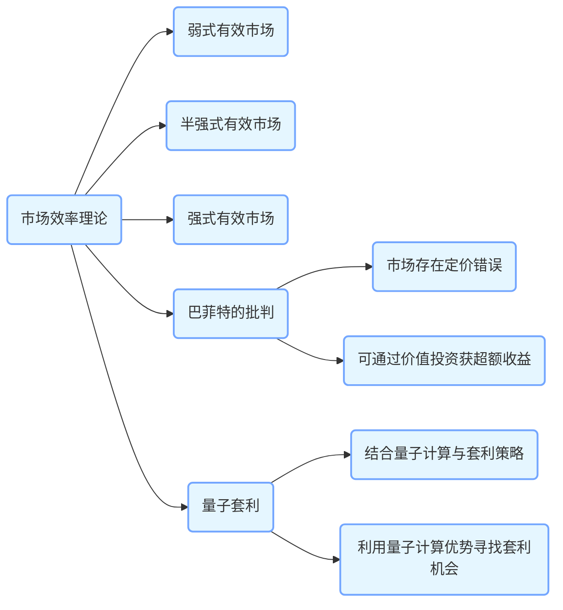

# 巴菲特的市场效率理论批判：量子套利对市场的影响

> 关键词：巴菲特、市场效率理论、量子套利、市场影响、金融市场

> 摘要：本文旨在深入探讨巴菲特对市场效率理论的批判，并着重分析量子套利这一新兴概念对市场的影响。首先介绍了市场效率理论的背景和巴菲特批判的出发点，接着阐述了量子套利的核心概念、原理及架构。通过详细的算法原理讲解、数学模型推导和实际案例分析，揭示了量子套利在金融市场中的具体运作方式。同时，探讨了量子套利在不同实际应用场景中的表现，并推荐了相关的学习资源、开发工具和研究论文。最后，总结了市场效率理论在面对量子套利时的未来发展趋势与挑战，并对常见问题进行了解答。

## 1. 背景介绍 
### 1.1 目的和范围
本研究的主要目的是全面剖析巴菲特对市场效率理论的批判观点，并深入探究量子套利这一新兴现象对金融市场的影响。研究范围涵盖了市场效率理论的基本原理、巴菲特批判的依据、量子套利的概念和运作机制，以及量子套利在实际市场中的应用和潜在影响。通过对这些方面的研究，旨在为投资者、金融从业者和研究人员提供一个更深入的理解视角，帮助他们更好地应对金融市场中的变化和挑战。

### 1.2 预期读者
本文预期读者包括金融市场投资者、金融分析师、经济学家、金融科技从业者以及对金融市场理论和实践感兴趣的研究人员。对于那些希望深入了解市场效率理论和新兴套利策略的人来说，本文将提供有价值的信息和分析。

### 1.3 文档结构概述
本文将按照以下结构进行阐述：首先介绍市场效率理论的背景和巴菲特批判的相关内容；接着详细讲解量子套利的核心概念、原理和架构；然后通过算法原理、数学模型和实际案例分析量子套利的具体运作；之后探讨量子套利在实际市场中的应用场景；再推荐相关的学习资源、开发工具和研究论文；最后总结市场效率理论在面对量子套利时的未来发展趋势与挑战，并解答常见问题。

### 1.4 术语表
#### 1.4.1 核心术语定义
- **市场效率理论**：认为金融市场中的资产价格能够迅速、准确地反映所有可用信息的理论。该理论分为弱式有效、半强式有效和强式有效三种形式。
- **巴菲特的市场效率理论批判**：巴菲特认为市场并非完全有效，存在投资者可以利用的定价错误，通过深入的基本面分析和价值投资策略可以获得超额收益。
- **量子套利**：结合量子计算技术和金融套利策略的一种新兴套利方式，利用量子计算的强大计算能力和量子特性来寻找和执行套利机会。

#### 1.4.2 相关概念解释
- **有效市场假说**：是市场效率理论的核心，认为在有效市场中，投资者无法通过分析历史价格、公开信息或内幕信息来获得持续的超额收益。
- **套利**：指在不同市场或同一市场的不同品种之间，利用价格差异进行买卖，以获取无风险利润的交易行为。
- **量子计算**：基于量子力学原理的计算方式，具有比传统计算机更强大的计算能力，能够在短时间内处理复杂的计算问题。

#### 1.4.3 缩略词列表
- **EMH**：有效市场假说（Efficient Market Hypothesis）
- **QC**：量子计算（Quantum Computing）

## 2. 核心概念与联系 
### 市场效率理论概述
市场效率理论是现代金融理论的重要基石之一。有效市场假说（EMH）由美国经济学家尤金·法玛（Eugene F. Fama）在 1970 年提出，该理论认为金融市场中的资产价格能够迅速、准确地反映所有可用信息。根据信息的不同类型，市场效率可以分为三种形式：
- **弱式有效市场**：资产价格反映了所有历史价格信息。在弱式有效市场中，技术分析方法无法帮助投资者获得超额收益，因为过去的价格走势已经完全反映在当前价格中。
- **半强式有效市场**：资产价格不仅反映了所有历史价格信息，还反映了所有公开可用的信息，如公司财务报表、宏观经济数据等。在半强式有效市场中，基本面分析也无法帮助投资者获得超额收益，因为所有公开信息已经被市场充分消化。
- **强式有效市场**：资产价格反映了所有信息，包括公开信息和内幕信息。在强式有效市场中，即使拥有内幕信息的投资者也无法获得超额收益，因为市场已经将所有信息反映在价格中。

### 巴菲特对市场效率理论的批判
巴菲特是价值投资的代表人物，他对市场效率理论提出了强烈的批判。巴菲特认为市场并非完全有效，存在许多定价错误的情况。他通过深入的基本面分析和对企业内在价值的评估，寻找那些被市场低估的股票，并长期持有，从而获得了显著的超额收益。巴菲特认为，市场效率理论忽略了投资者的心理因素和市场的非理性行为，这些因素会导致市场价格偏离企业的内在价值。

### 量子套利的核心概念
量子套利是结合量子计算技术和金融套利策略的一种新兴套利方式。量子计算具有比传统计算机更强大的计算能力，能够在短时间内处理复杂的计算问题。在金融市场中，量子套利利用量子计算的优势，快速分析大量的市场数据，寻找不同市场或同一市场的不同品种之间的价格差异，从而执行套利交易。

### 核心概念的联系
巴菲特对市场效率理论的批判为量子套利的出现提供了理论基础。因为市场并非完全有效，存在定价错误，所以才有可能通过套利策略获得超额收益。而量子计算技术的发展为量子套利提供了技术支持，使得投资者能够更快速、准确地寻找和执行套利机会。量子套利的出现又进一步挑战了市场效率理论，因为它可能会使市场价格更快地回归到合理水平，从而提高市场的有效性。

### 文本示意图
```plaintext
市场效率理论
    |
    |-- 弱式有效市场
    |-- 半强式有效市场
    |-- 强式有效市场
    |
    |-- 巴菲特的批判
    |       |
    |       |-- 市场存在定价错误
    |       |-- 可通过价值投资获超额收益
    |
    |-- 量子套利
            |
            |-- 结合量子计算与套利策略
            |-- 利用量子计算优势寻找套利机会
```

### Mermaid 流程图


## 3. 核心算法原理 & 具体操作步骤 
### 量子套利的算法原理
量子套利的核心算法原理是利用量子计算的强大计算能力，对大量的市场数据进行快速分析，寻找不同市场或同一市场的不同品种之间的价格差异。具体来说，量子套利算法可以分为以下几个步骤：
1. **数据收集**：收集不同市场或同一市场的不同品种的价格数据、交易量数据、基本面数据等。
2. **数据预处理**：对收集到的数据进行清洗、整理和归一化处理，以便后续的分析。
3. **特征提取**：从预处理后的数据中提取能够反映市场价格差异的特征，如价格比、收益率差等。
4. **量子计算优化**：利用量子算法对提取的特征进行优化，寻找最优的套利机会。
5. **套利决策**：根据量子计算的结果，做出套利决策，包括是否进行套利交易、交易的品种和数量等。
6. **交易执行**：根据套利决策，执行交易操作，实现套利收益。

### Python 源代码实现
以下是一个简单的量子套利算法的 Python 实现示例：
```python
import numpy as np
from qiskit import QuantumCircuit, Aer, execute

# 模拟市场数据收集
def collect_market_data():
    # 这里简单模拟两个市场的价格数据
    market1_prices = np.random.rand(10)
    market2_prices = np.random.rand(10)
    return market1_prices, market2_prices

# 数据预处理
def preprocess_data(market1_prices, market2_prices):
    # 简单的归一化处理
    market1_prices_normalized = (market1_prices - np.mean(market1_prices)) / np.std(market1_prices)
    market2_prices_normalized = (market2_prices - np.mean(market2_prices)) / np.std(market2_prices)
    return market1_prices_normalized, market2_prices_normalized

# 特征提取
def extract_features(market1_prices_normalized, market2_prices_normalized):
    # 计算价格比作为特征
    price_ratio = market1_prices_normalized / market2_prices_normalized
    return price_ratio

# 量子计算优化
def quantum_optimization(price_ratio):
    # 创建一个简单的量子电路
    num_qubits = len(price_ratio)
    qc = QuantumCircuit(num_qubits)
    
    # 初始化量子比特
    for i in range(num_qubits):
        if price_ratio[i] > 1:
            qc.x(i)
    
    # 执行量子计算
    backend = Aer.get_backend('statevector_simulator')
    job = execute(qc, backend)
    result = job.result()
    statevector = result.get_statevector(qc)
    
    # 找到最优的套利机会
    optimal_index = np.argmax(np.abs(statevector))
    return optimal_index

# 套利决策
def arbitrage_decision(optimal_index, market1_prices, market2_prices):
    if market1_prices[optimal_index] > market2_prices[optimal_index]:
        return 'Buy from market 2 and sell in market 1'
    else:
        return 'Buy from market 1 and sell in market 2'

# 主函数
def main():
    market1_prices, market2_prices = collect_market_data()
    market1_prices_normalized, market2_prices_normalized = preprocess_data(market1_prices, market2_prices)
    price_ratio = extract_features(market1_prices_normalized, market2_prices_normalized)
    optimal_index = quantum_optimization(price_ratio)
    decision = arbitrage_decision(optimal_index, market1_prices, market2_prices)
    print(f"Optimal arbitrage decision: {decision}")

if __name__ == "__main__":
    main()
```

### 具体操作步骤
1. **数据收集**：调用 `collect_market_data` 函数模拟收集两个市场的价格数据。
2. **数据预处理**：调用 `preprocess_data` 函数对收集到的价格数据进行归一化处理。
3. **特征提取**：调用 `extract_features` 函数从预处理后的数据中提取价格比作为特征。
4. **量子计算优化**：调用 `quantum_optimization` 函数利用量子电路对提取的特征进行优化，找到最优的套利机会。
5. **套利决策**：调用 `arbitrage_decision` 函数根据最优的套利机会做出套利决策。
6. **输出结果**：打印出最优的套利决策。

## 4. 数学模型和公式 & 详细讲解 & 举例说明 
### 市场价格差异模型
假设存在两个市场 $A$ 和 $B$，在时刻 $t$ 市场 $A$ 的资产价格为 $P_{A,t}$，市场 $B$ 的资产价格为 $P_{B,t}$。则两个市场的价格比为：
$$R_{t}=\frac{P_{A,t}}{P_{B,t}}$$
当 $R_{t}>1$ 时，说明市场 $A$ 的资产价格高于市场 $B$ 的资产价格，存在从市场 $B$ 买入资产并在市场 $A$ 卖出的套利机会；当 $R_{t}<1$ 时，说明市场 $A$ 的资产价格低于市场 $B$ 的资产价格，存在从市场 $A$ 买入资产并在市场 $B$ 卖出的套利机会。

### 量子优化模型
在量子套利中，我们可以将每个可能的套利机会看作一个量子比特。假设存在 $n$ 个可能的套利机会，我们可以用一个 $n$ 量子比特的量子态来表示这些机会。量子态可以表示为：
$$|\psi\rangle=\sum_{i=0}^{2^{n}-1} \alpha_{i}|i\rangle$$
其中，$\alpha_{i}$ 是量子态的振幅，$|i\rangle$ 是第 $i$ 个基态。我们的目标是找到一个最优的套利机会，即找到一个基态 $|i^{*}\rangle$，使得对应的振幅 $|\alpha_{i^{*}}|$ 最大。

### 举例说明
假设我们有两个市场 $A$ 和 $B$，在时刻 $t=1,2,3$ 的资产价格分别为：
| 时刻 $t$ | 市场 $A$ 价格 $P_{A,t}$ | 市场 $B$ 价格 $P_{B,t}$ |
| ---- | ---- | ---- |
| 1 | 100 | 90 |
| 2 | 110 | 100 |
| 3 | 120 | 110 |

则对应的价格比为：
$$R_{1}=\frac{100}{90}\approx1.11$$
$$R_{2}=\frac{110}{100}=1.1$$
$$R_{3}=\frac{120}{110}\approx1.09$$
由于 $R_{1}>R_{2}>R_{3}>1$，说明在时刻 $t=1$ 时，市场 $A$ 的资产价格相对市场 $B$ 的资产价格最高，存在最大的套利机会。在量子套利中，我们可以利用量子计算的优势，快速找到这个最优的套利机会。

## 5. 项目实战：代码实际案例和详细解释说明 
### 5.1  开发环境搭建
#### 安装 Python
首先，需要安装 Python 编程语言。可以从 Python 官方网站（https://www.python.org/downloads/）下载适合自己操作系统的 Python 版本，并按照安装向导进行安装。

#### 安装必要的库
在 Python 环境中，需要安装一些必要的库来实现量子套利算法。可以使用以下命令来安装这些库：
```bash
pip install numpy qiskit
```
- `numpy`：用于数值计算和数组操作。
- `qiskit`：IBM 开发的开源量子计算框架，用于创建和执行量子电路。

### 5.2  源代码详细实现和代码解读
以下是前面给出的量子套利算法的源代码详细实现和代码解读：
```python
import numpy as np
from qiskit import QuantumCircuit, Aer, execute

# 模拟市场数据收集
def collect_market_data():
    # 这里简单模拟两个市场的价格数据
    market1_prices = np.random.rand(10)
    market2_prices = np.random.rand(10)
    return market1_prices, market2_prices

# 数据预处理
def preprocess_data(market1_prices, market2_prices):
    # 简单的归一化处理
    market1_prices_normalized = (market1_prices - np.mean(market1_prices)) / np.std(market1_prices)
    market2_prices_normalized = (market2_prices - np.mean(market2_prices)) / np.std(market2_prices)
    return market1_prices_normalized, market2_prices_normalized

# 特征提取
def extract_features(market1_prices_normalized, market2_prices_normalized):
    # 计算价格比作为特征
    price_ratio = market1_prices_normalized / market2_prices_normalized
    return price_ratio

# 量子计算优化
def quantum_optimization(price_ratio):
    # 创建一个简单的量子电路
    num_qubits = len(price_ratio)
    qc = QuantumCircuit(num_qubits)
    
    # 初始化量子比特
    for i in range(num_qubits):
        if price_ratio[i] > 1:
            qc.x(i)
    
    # 执行量子计算
    backend = Aer.get_backend('statevector_simulator')
    job = execute(qc, backend)
    result = job.result()
    statevector = result.get_statevector(qc)
    
    # 找到最优的套利机会
    optimal_index = np.argmax(np.abs(statevector))
    return optimal_index

# 套利决策
def arbitrage_decision(optimal_index, market1_prices, market2_prices):
    if market1_prices[optimal_index] > market2_prices[optimal_index]:
        return 'Buy from market 2 and sell in market 1'
    else:
        return 'Buy from market 1 and sell in market 2'

# 主函数
def main():
    market1_prices, market2_prices = collect_market_data()
    market1_prices_normalized, market2_prices_normalized = preprocess_data(market1_prices, market2_prices)
    price_ratio = extract_features(market1_prices_normalized, market2_prices_normalized)
    optimal_index = quantum_optimization(price_ratio)
    decision = arbitrage_decision(optimal_index, market1_prices, market2_prices)
    print(f"Optimal arbitrage decision: {decision}")

if __name__ == "__main__":
    main()
```
### 代码解读
1. **数据收集**：`collect_market_data` 函数使用 `np.random.rand` 函数模拟收集两个市场的价格数据。
2. **数据预处理**：`preprocess_data` 函数对收集到的价格数据进行归一化处理，使得数据具有相同的尺度。
3. **特征提取**：`extract_features` 函数计算两个市场价格的比值作为特征。
4. **量子计算优化**：`quantum_optimization` 函数创建一个量子电路，根据价格比初始化量子比特，并执行量子计算。最后，通过 `np.argmax` 函数找到最优的套利机会。
5. **套利决策**：`arbitrage_decision` 函数根据最优的套利机会做出套利决策，即判断是从市场 1 买入并在市场 2 卖出，还是从市场 2 买入并在市场 1 卖出。
6. **主函数**：`main` 函数调用上述各个函数，完成整个量子套利算法的执行，并打印出最优的套利决策。

### 5.3  代码解读与分析
通过上述代码，我们可以看到量子套利算法的基本实现过程。在实际应用中，需要根据具体的市场情况和需求对代码进行优化和扩展。例如，可以收集更真实的市场数据，采用更复杂的数据预处理方法，设计更高效的量子算法等。同时，还需要考虑量子计算的误差和噪声对套利结果的影响，以及如何进行误差校正和噪声处理。

## 6. 实际应用场景 
### 跨市场套利
量子套利在跨市场套利中具有很大的应用潜力。不同国家或地区的金融市场之间可能存在价格差异，通过量子套利算法可以快速分析这些差异，找到最优的套利机会。例如，股票市场和期货市场之间、不同国家的外汇市场之间等都可能存在跨市场套利机会。

### 跨品种套利
在同一市场中，不同品种的金融资产之间也可能存在价格差异。量子套利可以利用这些差异进行跨品种套利。例如，在股票市场中，同一行业的不同股票之间、不同行业的股票之间等都可能存在跨品种套利机会。

### 高频交易
高频交易是指在极短的时间内进行大量的交易操作。量子套利的快速计算能力使得它非常适合用于高频交易。通过量子套利算法，可以在瞬间分析大量的市场数据，找到微小的价格差异，并及时执行交易操作，从而获得超额收益。

### 风险管理
量子套利还可以用于风险管理。通过分析不同市场或品种之间的价格相关性，量子套利算法可以帮助投资者制定合理的投资组合，降低投资风险。例如，当市场出现波动时，通过量子套利可以及时调整投资组合，减少损失。

## 7. 工具和资源推荐
### 7.1 学习资源推荐
#### 7.1.1 书籍推荐
- 《有效市场假说及其挑战》：详细介绍了市场效率理论的发展历程、主要内容和相关争议，对理解市场效率理论和巴菲特的批判观点有很大帮助。
- 《量子计算与量子信息》：全面介绍了量子计算的基本原理、算法和应用，是学习量子计算的经典教材。
- 《金融市场与金融机构》：系统介绍了金融市场的基本概念、运行机制和金融机构的主要业务，对理解金融市场和套利策略有重要作用。

#### 7.1.2 在线课程
- Coursera 上的“Quantum Computing for Everyone”：由著名学者讲授，深入浅出地介绍了量子计算的基本概念和应用，适合初学者学习。
- edX 上的“Financial Markets”：由耶鲁大学教授罗伯特·席勒（Robert Shiller）讲授，对金融市场的理论和实践进行了全面的讲解。
- Udemy 上的“Algorithmic Trading with Python”：介绍了如何使用 Python 进行算法交易，包括套利策略的实现。

#### 7.1.3 技术博客和网站
- IBM Quantum 博客：提供了关于量子计算的最新研究成果、技术进展和应用案例，是了解量子计算在金融领域应用的重要渠道。
- Seeking Alpha：一个金融市场分析和投资研究的网站，提供了大量的金融市场评论和分析文章，对理解市场效率理论和套利策略有很大帮助。
- QuantNet：一个量化交易社区，提供了量化交易的技术讨论、策略分享和职业发展等方面的内容。

### 7.2 开发工具框架推荐
#### 7.2.1 IDE和编辑器
- PyCharm：一款功能强大的 Python 集成开发环境，提供了代码编辑、调试、版本控制等功能，适合开发量子套利算法。
- Jupyter Notebook：一个交互式的开发环境，支持 Python 代码的编写、运行和可视化展示，方便进行数据分析和算法验证。
- Visual Studio Code：一款轻量级的代码编辑器，支持多种编程语言和插件扩展，可用于开发量子套利算法。

#### 7.2.2 调试和性能分析工具
- Qiskit Aer：IBM 开发的量子计算模拟器，可用于调试和验证量子套利算法的正确性。
- Numba：一个用于加速 Python 代码的工具，可提高量子套利算法的运行效率。
- cProfile：Python 内置的性能分析工具，可用于分析量子套利算法的性能瓶颈。

#### 7.2.3 相关框架和库
- Qiskit：IBM 开发的开源量子计算框架，提供了量子电路的创建、编译和执行等功能，可用于实现量子套利算法。
- PennyLane：一个跨平台的量子机器学习库，支持多种量子计算硬件和模拟器，可用于开发量子套利策略。
- numpy：Python 的数值计算库，提供了丰富的数组操作和数学函数，可用于市场数据的处理和分析。

### 7.3 相关论文著作推荐
#### 7.3.1 经典论文
- Fama, E. F. (1970). Efficient capital markets: A review of theory and empirical work. The Journal of Finance, 25(2), 383-417. 这是有效市场假说的经典论文，对市场效率理论的发展产生了深远影响。
- Buffett, W. E. (1984). The Superinvestors of Graham-and-Doddsville. Hermes, 17, 4-15. 巴菲特在这篇文章中阐述了他对市场效率理论的批判观点，并介绍了价值投资的成功案例。
- Shor, P. W. (1994). Algorithms for quantum computation: Discrete logarithms and factoring. In Proceedings 35th annual symposium on foundations of computer science (pp. 124-134). IEEE. 这篇论文提出了著名的 Shor 算法，为量子计算在密码学和金融领域的应用奠定了基础。

#### 7.3.2 最新研究成果
- “Quantum Arbitrage in Financial Markets”：该研究探讨了量子套利在金融市场中的应用潜力和挑战，提出了一些新的量子套利策略。
- “Quantum Computing for Portfolio Optimization”：研究了如何利用量子计算技术进行投资组合优化，提高投资收益和降低风险。
- “The Impact of Quantum Computing on Market Efficiency”：分析了量子计算技术对市场效率理论的影响，认为量子套利可能会改变市场的有效性。

#### 7.3.3 应用案例分析
- “Quantum Arbitrage in the Cryptocurrency Market”：介绍了量子套利在加密货币市场中的应用案例，分析了量子套利算法在该市场中的表现和效果。
- “Using Quantum Computing for High-Frequency Trading”：探讨了如何利用量子计算技术进行高频交易，通过实际案例展示了量子套利在高频交易中的优势。
- “Quantum Arbitrage Strategies in the Foreign Exchange Market”：研究了量子套利在外汇市场中的应用策略，分析了不同策略的风险和收益特征。

## 8. 总结：未来发展趋势与挑战
### 未来发展趋势
- **量子计算技术的不断进步**：随着量子计算技术的不断发展，量子计算机的计算能力将不断提高，误差和噪声将不断降低。这将使得量子套利算法的性能得到进一步提升，能够处理更复杂的市场数据和套利策略。
- **与人工智能的融合**：量子套利与人工智能技术的融合将成为未来的发展趋势。通过结合量子计算的强大计算能力和人工智能的机器学习和深度学习算法，可以更准确地预测市场价格走势，找到更优的套利机会。
- **应用领域的拓展**：量子套利的应用领域将不断拓展，除了金融市场外，还可能应用于能源市场、商品市场等其他领域。同时，量子套利也可能与区块链技术相结合，创造出更加安全、高效的交易模式。

### 挑战
- **量子计算技术的局限性**：目前，量子计算技术还处于发展阶段，存在计算能力有限、误差和噪声较大等问题。这些问题限制了量子套利算法的实际应用效果，需要进一步的技术突破来解决。
- **数据安全和隐私问题**：量子套利需要处理大量的市场数据，这些数据涉及到投资者的隐私和商业机密。因此，数据安全和隐私问题是量子套利面临的重要挑战之一。需要采用先进的加密技术和安全机制来保护数据的安全和隐私。
- **监管和合规问题**：量子套利作为一种新兴的套利方式，可能会对金融市场的稳定性和公平性产生影响。因此，需要建立相应的监管和合规机制，确保量子套利的合法、合规运行。

## 9. 附录：常见问题与解答
### 问题 1：量子套利是否真的能够获得超额收益？
解答：量子套利利用量子计算的强大计算能力，可以更快速、准确地寻找市场中的套利机会。然而，市场是复杂多变的，存在许多不确定性因素，如市场波动、政策变化等。因此，量子套利并不能保证一定能够获得超额收益，它只是提供了一种更有效的套利手段。

### 问题 2：量子套利与传统套利有什么区别？
解答：量子套利与传统套利的主要区别在于计算能力和效率。传统套利通常使用传统计算机进行数据分析和决策，计算速度较慢，难以处理大量的市场数据。而量子套利利用量子计算的优势，能够在短时间内处理复杂的计算问题，快速找到最优的套利机会。

### 问题 3：量子套利对市场效率有什么影响？
解答：量子套利可能会提高市场的有效性。因为量子套利能够快速发现市场中的定价错误，并通过交易操作使市场价格更快地回归到合理水平。然而，量子套利也可能会加剧市场的波动，因为它可能会引发更多的交易活动。

### 问题 4：学习量子套利需要具备哪些知识和技能？
解答：学习量子套利需要具备一定的金融知识、计算机编程知识和量子计算知识。具体来说，需要了解金融市场的基本概念、运行机制和套利策略，掌握 Python 等编程语言，熟悉量子计算的基本原理和算法。

## 10. 扩展阅读 & 参考资料
### 扩展阅读
- 《金融炼金术》：乔治·索罗斯（George Soros）的著作，探讨了金融市场的反身性原理和投资策略。
- 《黑天鹅》：纳西姆·尼古拉斯·塔勒布（Nassim Nicholas Taleb）的著作，分析了金融市场中的不确定性和黑天鹅事件。
- 《聪明的投资者》：本杰明·格雷厄姆（Benjamin Graham）的著作，是价值投资的经典之作，对理解巴菲特的投资理念有很大帮助。

### 参考资料
- Fama, E. F. (1970). Efficient capital markets: A review of theory and empirical work. The Journal of Finance, 25(2), 383-417.
- Buffett, W. E. (1984). The Superinvestors of Graham-and-Doddsville. Hermes, 17, 4-15.
- Shor, P. W. (1994). Algorithms for quantum computation: Discrete logarithms and factoring. In Proceedings 35th annual symposium on foundations of computer science (pp. 124-134). IEEE.
- Qiskit 官方文档：https://qiskit.org/documentation/
- IBM Quantum 官方网站：https://quantum-computing.ibm.com/

作者：AI天才研究院/AI Genius Institute & 禅与计算机程序设计艺术 /Zen And The Art of Computer Programming