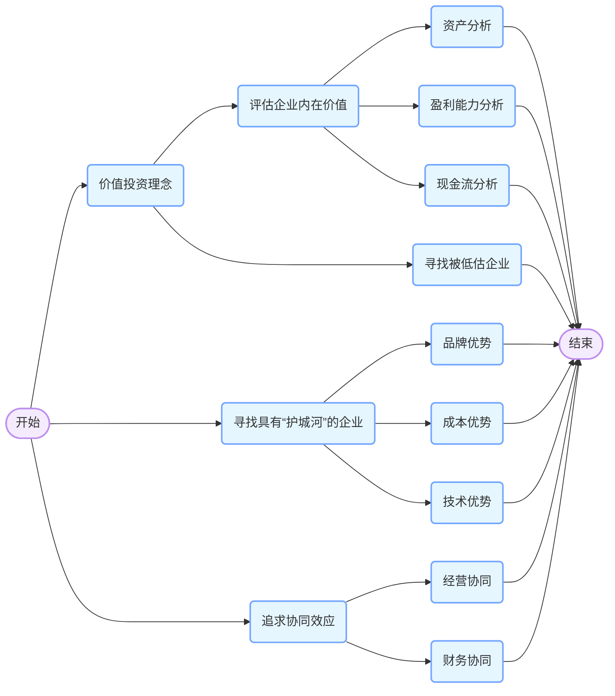

# 巴菲特的并购艺术：在全球化背景下的新策略

> 关键词：巴菲特、并购艺术、全球化背景、新策略、价值投资

> 摘要：本文深入探讨了巴菲特在全球化背景下的并购艺术及其新策略。通过分析巴菲特并购的核心概念、算法原理、数学模型等，结合实际案例展示其策略的应用。同时介绍了相关的工具和资源，最后总结了未来发展趋势与挑战，并对常见问题进行解答。旨在为投资者和企业管理者提供对巴菲特并购策略的全面理解和借鉴。

## 1. 背景介绍 
### 1.1 目的和范围
本文章的目的在于深入剖析巴菲特在全球化背景下的并购艺术及新策略。全球化使得市场环境、经济格局等发生了巨大变化，巴菲特的并购行为也必然受到影响并产生相应的调整。我们将研究范围聚焦于巴菲特在全球化进程中所采取的并购决策、评估标准、整合方式等方面，分析其如何在复杂多变的国际市场中实现价值创造。

### 1.2 预期读者
预期读者包括金融投资者，他们希望从巴菲特的并购策略中获取投资灵感和决策依据；企业管理者，期望借鉴其并购经验以提升企业的竞争力和市场地位；以及对金融和投资领域感兴趣的研究人员和学生，有助于他们深入了解并购理论和实践的前沿动态。

### 1.3 文档结构概述
本文首先介绍相关背景知识，包括目的、预期读者和文档结构等。接着阐述核心概念与联系，构建整体的理论框架。然后详细讲解核心算法原理和具体操作步骤，结合数学模型和公式进行深入分析。通过项目实战部分展示实际案例，说明策略的应用。之后探讨实际应用场景，推荐相关的工具和资源。最后总结未来发展趋势与挑战，解答常见问题，并提供扩展阅读和参考资料。

### 1.4 术语表
#### 1.4.1 核心术语定义
- **并购**：指企业之间的合并与收购行为，合并是指两个或多个企业组合成一个新的企业，收购则是指一家企业购买另一家企业的部分或全部股权，从而获得对该企业的控制权。
- **价值投资**：由本杰明·格雷厄姆提出，巴菲特进一步发展的投资理念，强调通过对企业内在价值的分析，寻找被低估的股票或企业进行投资，以获取长期稳定的收益。
- **协同效应**：指企业并购后，通过整合资源、优化业务流程等方式，使整体效益大于各部分效益之和的效应，包括经营协同、财务协同等。

#### 1.4.2 相关概念解释
- **全球化**：是指全球范围内的经济、政治、文化等方面的相互联系和融合不断加强的过程，在经济领域表现为贸易自由化、资本流动全球化、生产国际化等。
- **护城河**：巴菲特用来形容企业具有的可持续竞争优势，如品牌优势、成本优势、技术优势等，能够保护企业在市场竞争中获得稳定的利润。

#### 1.4.3 缩略词列表
- **ROE**：Return on Equity，净资产收益率，反映股东权益的收益水平，用以衡量公司运用自有资本的效率。
- **DCF**：Discounted Cash Flow，现金流折现法，是一种通过预测企业未来的现金流量，并将其折现到当前的价值评估方法。

## 2. 核心概念与联系 
### 核心概念原理
巴菲特的并购艺术建立在价值投资的基础之上。价值投资的核心原理是认为股票或企业的市场价格会围绕其内在价值波动，当市场价格低于内在价值时，就是投资的机会。在并购中，巴菲特会深入分析目标企业的内在价值，包括其资产状况、盈利能力、现金流等。

他强调寻找具有“护城河”的企业，即具有可持续竞争优势的企业。这种竞争优势可以帮助企业在市场中保持领先地位，抵御竞争对手的侵蚀，从而保证长期稳定的盈利。例如，可口可乐公司拥有强大的品牌优势，这就是其“护城河”的重要组成部分。

此外，协同效应也是巴菲特并购考虑的重要因素。通过并购，实现资源的优化配置和业务的整合，产生协同效应，提高企业的整体效益。比如，伯克希尔·哈撒韦公司并购一些企业后，可以利用自身的资金优势和管理经验，帮助被并购企业提升业绩。

### 架构的文本示意图
```plaintext
巴菲特并购艺术
|-- 价值投资理念
|   |-- 评估企业内在价值
|       |-- 资产分析
|       |-- 盈利能力分析
|       |-- 现金流分析
|   |-- 寻找被低估企业
|-- 寻找具有“护城河”的企业
|   |-- 品牌优势
|   |-- 成本优势
|   |-- 技术优势
|-- 追求协同效应
|   |-- 经营协同
|   |-- 财务协同
```

### Mermaid 流程图


## 3. 核心算法原理 & 具体操作步骤 
### 核心算法原理
在评估企业内在价值时，巴菲特常用的方法之一是现金流折现法（DCF）。其基本原理是将企业未来的现金流量折现到当前时刻，以确定企业的内在价值。假设企业未来 $n$ 年的现金流量分别为 $CF_1, CF_2, \cdots, CF_n$，折现率为 $r$，则企业的内在价值 $V$ 可以表示为：

$$V = \sum_{i=1}^{n} \frac{CF_i}{(1 + r)^i} + \frac{TV}{(1 + r)^n}$$

其中，$TV$ 为企业的终值，通常采用永续增长模型计算，即 $TV = \frac{CF_n(1 + g)}{r - g}$，$g$ 为永续增长率。

### 具体操作步骤
以下是使用 Python 实现现金流折现法评估企业内在价值的代码示例：

```python
def dcf_evaluation(cash_flows, discount_rate, growth_rate):
    """
    现金流折现法评估企业内在价值
    :param cash_flows: 未来各年的现金流量列表
    :param discount_rate: 折现率
    :param growth_rate: 永续增长率
    :return: 企业的内在价值
    """
    n = len(cash_flows)
    present_value = 0
    # 计算前 n 年现金流量的现值
    for i in range(n):
        present_value += cash_flows[i] / ((1 + discount_rate) ** (i + 1))
    # 计算终值
    terminal_value = cash_flows[-1] * (1 + growth_rate) / (discount_rate - growth_rate)
    # 计算终值的现值
    present_value_terminal = terminal_value / ((1 + discount_rate) ** n)
    # 计算企业的内在价值
    intrinsic_value = present_value + present_value_terminal
    return intrinsic_value

# 示例数据
cash_flows = [100, 120, 140, 160, 180]
discount_rate = 0.1
growth_rate = 0.03

# 调用函数进行评估
intrinsic_value = dcf_evaluation(cash_flows, discount_rate, growth_rate)
print(f"企业的内在价值为: {intrinsic_value}")
```

### 代码解释
1. **函数定义**：`dcf_evaluation` 函数接受三个参数：未来各年的现金流量列表 `cash_flows`、折现率 `discount_rate` 和永续增长率 `growth_rate`。
2. **计算前 n 年现金流量的现值**：使用 `for` 循环遍历现金流量列表，将每年的现金流量折现到当前时刻，并累加到 `present_value` 中。
3. **计算终值**：根据永续增长模型计算企业的终值 `terminal_value`。
4. **计算终值的现值**：将终值折现到当前时刻，得到 `present_value_terminal`。
5. **计算企业的内在价值**：将前 n 年现金流量的现值和终值的现值相加，得到企业的内在价值 `intrinsic_value`。

## 4. 数学模型和公式 & 详细讲解 & 举例说明 
### 现金流折现法公式详解
现金流折现法的核心公式为：

$$V = \sum_{i=1}^{n} \frac{CF_i}{(1 + r)^i} + \frac{TV}{(1 + r)^n}$$

其中：
- $V$ 表示企业的内在价值。
- $CF_i$ 表示第 $i$ 年的现金流量。
- $r$ 表示折现率，反映了资金的时间价值和投资的风险程度。
- $n$ 表示预测的年数。
- $TV$ 表示企业的终值。

终值的计算公式为：

$$TV = \frac{CF_n(1 + g)}{r - g}$$

其中：
- $CF_n$ 表示第 $n$ 年的现金流量。
- $g$ 表示永续增长率，假设企业在预测期结束后将以固定的增长率持续增长。

### 详细讲解
现金流折现法的基本思想是将企业未来的现金流量折现到当前时刻，因为未来的现金流量具有不确定性，而且资金具有时间价值，所以需要通过折现来反映其当前的价值。

在计算过程中，折现率的选择非常重要。折现率越高，未来现金流量的现值就越低，企业的内在价值也就越低；反之，折现率越低，企业的内在价值就越高。折现率通常根据市场利率、企业的风险水平等因素来确定。

永续增长率的假设也会对企业的内在价值产生影响。如果永续增长率过高，会导致终值过大，从而高估企业的内在价值；如果永续增长率过低，则会低估企业的内在价值。

### 举例说明
假设一家企业未来 5 年的现金流量分别为 100 万元、120 万元、140 万元、160 万元和 180 万元，折现率为 10%，永续增长率为 3%。

1. 计算前 5 年现金流量的现值：
    - 第 1 年现金流量的现值：$\frac{100}{(1 + 0.1)^1} \approx 90.91$（万元）
    - 第 2 年现金流量的现值：$\frac{120}{(1 + 0.1)^2} \approx 99.17$（万元）
    - 第 3 年现金流量的现值：$\frac{140}{(1 + 0.1)^3} \approx 105.18$（万元）
    - 第 4 年现金流量的现值：$\frac{160}{(1 + 0.1)^4} \approx 109.29$（万元）
    - 第 5 年现金流量的现值：$\frac{180}{(1 + 0.1)^5} \approx 111.73$（万元）
    - 前 5 年现金流量的现值总和：$90.91 + 99.17 + 105.18 + 109.29 + 111.73 = 516.28$（万元）

2. 计算终值：
    - $TV = \frac{180 \times (1 + 0.03)}{0.1 - 0.03} \approx 2657.14$（万元）

3. 计算终值的现值：
    - $\frac{2657.14}{(1 + 0.1)^5} \approx 1643.77$（万元）

4. 计算企业的内在价值：
    - $V = 516.28 + 1643.77 = 2160.05$（万元）

因此，该企业的内在价值约为 2160.05 万元。

## 5. 项目实战：代码实际案例和详细解释说明 
### 5.1  开发环境搭建
为了运行上述的 Python 代码，我们需要搭建相应的开发环境。以下是具体步骤：

1. **安装 Python**：从 Python 官方网站（https://www.python.org/downloads/）下载适合你操作系统的 Python 安装包，并按照安装向导进行安装。建议安装 Python 3.7 及以上版本。
2. **安装开发工具**：可以选择使用 PyCharm、VS Code 等集成开发环境（IDE），也可以使用 Jupyter Notebook 进行交互式编程。这里以 PyCharm 为例，从 JetBrains 官方网站（https://www.jetbrains.com/pycharm/download/）下载并安装 PyCharm 社区版。
3. **创建项目**：打开 PyCharm，选择 `File` -> `New Project`，选择项目的存储路径和 Python 解释器，点击 `Create` 创建项目。

### 5.2  源代码详细实现和代码解读
以下是完整的代码示例：

```python
def dcf_evaluation(cash_flows, discount_rate, growth_rate):
    """
    现金流折现法评估企业内在价值
    :param cash_flows: 未来各年的现金流量列表
    :param discount_rate: 折现率
    :param growth_rate: 永续增长率
    :return: 企业的内在价值
    """
    n = len(cash_flows)
    present_value = 0
    # 计算前 n 年现金流量的现值
    for i in range(n):
        present_value += cash_flows[i] / ((1 + discount_rate) ** (i + 1))
    # 计算终值
    terminal_value = cash_flows[-1] * (1 + growth_rate) / (discount_rate - growth_rate)
    # 计算终值的现值
    present_value_terminal = terminal_value / ((1 + discount_rate) ** n)
    # 计算企业的内在价值
    intrinsic_value = present_value + present_value_terminal
    return intrinsic_value

# 示例数据
cash_flows = [100, 120, 140, 160, 180]
discount_rate = 0.1
growth_rate = 0.03

# 调用函数进行评估
intrinsic_value = dcf_evaluation(cash_flows, discount_rate, growth_rate)
print(f"企业的内在价值为: {intrinsic_value}")
```

### 代码解读
1. **函数定义**：`dcf_evaluation` 函数实现了现金流折现法的核心逻辑。它接受三个参数：未来各年的现金流量列表 `cash_flows`、折现率 `discount_rate` 和永续增长率 `growth_rate`，并返回企业的内在价值。
2. **计算前 n 年现金流量的现值**：使用 `for` 循环遍历现金流量列表，将每年的现金流量折现到当前时刻，并累加到 `present_value` 中。
3. **计算终值**：根据永续增长模型计算企业的终值 `terminal_value`。
4. **计算终值的现值**：将终值折现到当前时刻，得到 `present_value_terminal`。
5. **计算企业的内在价值**：将前 n 年现金流量的现值和终值的现值相加，得到企业的内在价值 `intrinsic_value`。
6. **示例数据和函数调用**：定义了示例数据 `cash_flows`、`discount_rate` 和 `growth_rate`，并调用 `dcf_evaluation` 函数进行评估，最后打印出企业的内在价值。

### 5.3  代码解读与分析
通过上述代码，我们可以看到现金流折现法的具体实现过程。代码的核心在于准确计算前 n 年现金流量的现值和终值的现值，并将它们相加得到企业的内在价值。

在实际应用中，我们需要根据具体情况合理选择现金流量、折现率和永续增长率。现金流量的预测需要基于对企业业务的深入分析和市场趋势的判断；折现率的选择要考虑市场利率、企业的风险水平等因素；永续增长率的假设要合理，避免过高或过低的估计。

此外，代码的可扩展性也很重要。我们可以对代码进行改进，例如增加对不同现金流量预测模型的支持，或者将代码封装成类，方便在不同的项目中复用。

## 6. 实际应用场景 
### 企业并购决策
在企业并购中，巴菲特的并购策略可以帮助企业评估目标企业的价值，判断是否值得进行并购。通过现金流折现法等方法计算目标企业的内在价值，与市场价格进行比较，如果内在价值高于市场价格，则说明目标企业可能被低估，具有并购价值。同时，考虑目标企业的“护城河”和协同效应，评估并购后能否实现资源的优化配置和业绩的提升。

### 投资组合管理
投资者可以借鉴巴菲特的价值投资理念，构建投资组合。寻找具有“护城河”的企业，通过评估其内在价值，选择被低估的股票进行投资。在全球化背景下，投资者可以关注不同国家和地区的企业，扩大投资范围，分散投资风险。

### 企业战略规划
企业管理者可以学习巴菲特的并购策略，制定企业的战略规划。通过并购具有协同效应的企业，实现业务的拓展和升级，提升企业的竞争力。例如，一家科技企业可以并购一家具有先进技术的初创企业，获取新技术和人才，加速自身的发展。

## 7. 工具和资源推荐
### 7.1 学习资源推荐
#### 7.1.1 书籍推荐
- 《聪明的投资者》（The Intelligent Investor）：本杰明·格雷厄姆著，价值投资领域的经典之作，巴菲特称这本书是他投资生涯的启蒙读物。
- 《巴菲特致股东的信：股份公司教程》（Letters to Shareholders of Berkshire Hathaway）：沃伦·巴菲特著，收录了巴菲特多年来致股东的信，包含了他的投资理念、并购策略等重要思想。
- 《滚雪球：巴菲特和他的财富人生》（The Snowball: Warren Buffett and the Business of Life）：艾丽斯·施罗德著，详细介绍了巴菲特的生平事迹和投资历程。

#### 7.1.2 在线课程
- Coursera 上的“投资学原理”（Principles of Investment）课程，由知名教授授课，涵盖了价值投资、并购等方面的知识。
- edX 上的“金融市场”（Financial Markets）课程，耶鲁大学教授罗伯特·席勒主讲，讲解了金融市场的基本原理和投资策略。

#### 7.1.3 技术博客和网站
- 伯克希尔·哈撒韦公司官方网站（https://www.berkshirehathaway.com/）：可以获取巴菲特的年度报告、致股东的信等重要资料。
- Seeking Alpha（https://seekingalpha.com/）：提供股票分析、投资策略等方面的文章和评论。

### 7.2 开发工具框架推荐
#### 7.2.1 IDE和编辑器
- PyCharm：功能强大的 Python 集成开发环境，提供代码编辑、调试、版本控制等功能。
- VS Code：轻量级的代码编辑器，支持多种编程语言，有丰富的插件扩展。

#### 7.2.2 调试和性能分析工具
- pdb：Python 自带的调试工具，可以帮助开发者定位代码中的问题。
- cProfile：Python 的性能分析工具，可以分析代码的运行时间和函数调用情况。

#### 7.2.3 相关框架和库
- Pandas：用于数据处理和分析的 Python 库，提供了高效的数据结构和数据操作方法。
- NumPy：用于科学计算的 Python 库，支持多维数组和矩阵运算。

### 7.3 相关论文著作推荐
#### 7.3.1 经典论文
- 《证券分析》（Security Analysis）：本杰明·格雷厄姆和戴维·多德著，奠定了价值投资的理论基础。
- 《有效资本市场：理论与实证研究回顾》（Efficient Capital Markets: A Review of Theory and Empirical Work）：尤金·法玛著，提出了有效市场假说。

#### 7.3.2 最新研究成果
- 关注顶级金融学术期刊，如《金融杂志》（Journal of Finance）、《金融经济学杂志》（Journal of Financial Economics）等，了解关于并购、价值投资等方面的最新研究成果。

#### 7.3.3 应用案例分析
- 可以查阅一些商业杂志和研究报告，如《哈佛商业评论》（Harvard Business Review）、麦肯锡公司的研究报告等，获取企业并购的实际案例和分析。

## 8. 总结：未来发展趋势与挑战
### 未来发展趋势
- **全球化并购加速**：随着全球化的深入发展，企业之间的跨国并购将更加频繁。巴菲特可能会继续扩大其并购的范围，关注新兴市场和具有潜力的行业。
- **科技领域并购增加**：科技的快速发展使得科技企业的价值不断提升。巴菲特可能会加大对科技领域的并购力度，以获取新技术和创新能力。
- **可持续发展成为重要考量**：在全球关注可持续发展的背景下，企业的社会责任和环境影响将成为并购决策的重要因素。巴菲特可能会更加注重被并购企业的可持续发展能力。

### 挑战
- **市场不确定性增加**：全球化带来了更多的市场不确定性，如贸易摩擦、汇率波动等，这增加了并购的风险。巴菲特需要更加准确地评估市场风险，制定合理的并购策略。
- **竞争加剧**：随着并购市场的发展，竞争也越来越激烈。巴菲特需要面对更多的竞争对手，寻找具有独特价值的并购目标。
- **科技变革挑战**：科技的快速变革使得企业的生命周期缩短，技术更新换代加快。巴菲特需要不断学习和适应科技发展的趋势，避免被时代淘汰。

## 9. 附录：常见问题与解答
### 问题 1：现金流折现法中的折现率如何确定？
解答：折现率的确定需要综合考虑多个因素，包括市场利率、企业的风险水平、投资的机会成本等。一般来说，可以参考同行业类似企业的加权平均资本成本（WACC），也可以根据企业的具体情况进行调整。

### 问题 2：如何判断企业是否具有“护城河”？
解答：可以从以下几个方面判断企业是否具有“护城河”：品牌优势，如消费者对品牌的认可度和忠诚度；成本优势，如企业的生产成本低于竞争对手；技术优势，如拥有独特的技术或专利；转换成本，即消费者从一个产品或服务转换到另一个产品或服务的成本。

### 问题 3：巴菲特的并购策略是否适用于所有企业？
解答：巴菲特的并购策略是基于价值投资理念，强调寻找具有内在价值和可持续竞争优势的企业。虽然这些原则具有一定的普遍性，但并不是适用于所有企业。不同企业的情况不同，需要根据自身的战略目标、资源状况等因素来制定适合自己的并购策略。

## 10. 扩展阅读 & 参考资料
### 扩展阅读
- 《金融炼金术》（The Alchemy of Finance）：乔治·索罗斯著，探讨了金融市场的反身性原理。
- 《穷查理宝典：查理·芒格的智慧箴言录》（Poor Charlie's Almanack: The Wit and Wisdom of Charles T. Munger）：查理·芒格著，包含了芒格的投资理念和人生智慧。

### 参考资料
- Berkshire Hathaway Annual Reports.
- Financial Times.
- Wall Street Journal.

作者：AI天才研究院/AI Genius Institute & 禅与计算机程序设计艺术 /Zen And The Art of Computer Programming