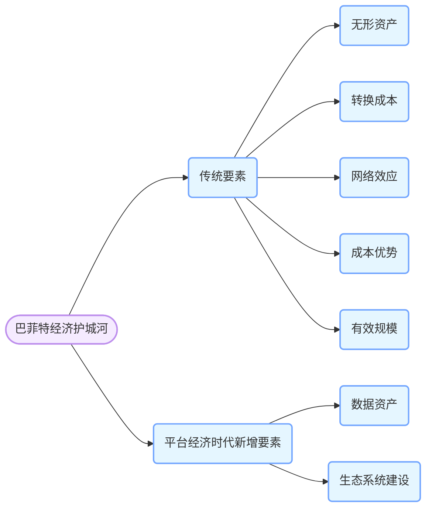

# 巴菲特的经济护城河更新：平台经济时代的竞争优势

> 关键词：巴菲特经济护城河、平台经济、竞争优势、网络效应、转换成本

> 摘要：本文聚焦于巴菲特提出的经济护城河理论在平台经济时代的更新与发展。首先介绍了经济护城河理论的背景及本文的目的、预期读者等信息。接着阐述了核心概念，包括经济护城河和平台经济的原理及联系，并给出了相应的文本示意图和 Mermaid 流程图。详细讲解了与平台经济竞争优势相关的核心算法原理，结合 Python 代码进行说明。深入探讨了其中涉及的数学模型和公式，并举例分析。通过项目实战，展示了代码的实际应用和解读。探讨了平台经济时代经济护城河理论在不同场景的实际应用，推荐了学习、开发等相关的工具和资源。最后总结了未来发展趋势与挑战，解答了常见问题，并提供了扩展阅读和参考资料，旨在为读者全面理解平台经济时代的竞争优势提供深入的视角和专业的分析。

## 1. 背景介绍 
### 1.1 目的和范围
在当今数字化快速发展的时代，平台经济异军突起，成为经济领域的重要力量。巴菲特的经济护城河理论自提出以来，一直是投资者评估企业竞争优势的重要框架。然而，传统的经济护城河理论在平台经济的浪潮下，需要进行更新和拓展。本文的目的在于深入探讨巴菲特经济护城河理论在平台经济时代的新内涵和新应用，分析平台经济企业所具备的独特竞争优势，为投资者、企业管理者以及相关研究人员提供理论支持和实践指导。范围涵盖了平台经济的基本概念、核心竞争优势的构成要素、相关算法原理、数学模型以及实际应用案例等方面。

### 1.2 预期读者
本文的预期读者包括但不限于：金融投资者，希望通过了解平台经济时代的竞争优势，更好地进行投资决策；企业管理者，尤其是从事平台经济相关业务的管理者，能够从中获取提升企业竞争力的思路和方法；学术研究人员，为其研究平台经济和企业竞争理论提供参考；以及对经济和科技发展感兴趣的普通读者，帮助他们理解平台经济的运行机制和竞争格局。

### 1.3 文档结构概述
本文共分为十个部分。第一部分为背景介绍，阐述了文章的目的、预期读者和文档结构概述，并给出了相关术语的定义和解释。第二部分介绍核心概念与联系，包括经济护城河和平台经济的原理，以及它们之间的关系，并通过文本示意图和 Mermaid 流程图进行直观展示。第三部分详细讲解核心算法原理和具体操作步骤，结合 Python 代码进行说明。第四部分深入探讨数学模型和公式，通过具体例子进行详细讲解。第五部分进行项目实战，包括开发环境搭建、源代码实现和代码解读。第六部分介绍平台经济时代经济护城河理论的实际应用场景。第七部分推荐学习、开发相关的工具和资源，包括书籍、在线课程、技术博客、IDE、调试工具、相关框架和库以及论文著作等。第八部分总结未来发展趋势与挑战。第九部分解答常见问题。第十部分提供扩展阅读和参考资料。

### 1.4 术语表
#### 1.4.1 核心术语定义
- **巴菲特经济护城河**：由沃伦·巴菲特提出的概念，指企业抵御竞争对手、保持长期竞争优势和超额利润的能力，如同城堡周围的护城河保护城堡一样保护企业。
- **平台经济**：一种基于数字技术，由数据驱动、平台支撑、网络协同的经济活动单元所构成的新经济系统，是基于数字平台的各种经济关系的总称。
- **网络效应**：指产品或服务的价值随着使用该产品或服务的用户数量增加而增加的现象。
- **转换成本**：指用户从一个产品或服务转换到另一个产品或服务时所需要付出的成本，包括时间、金钱、学习成本等。

#### 1.4.2 相关概念解释
- **双边市场**：平台经济中常见的一种市场结构，平台连接了两类或多类不同的用户群体，通过促进他们之间的交易或互动来创造价值。例如，电商平台连接了商家和消费者。
- **数据资产**：平台经济企业在运营过程中积累的大量用户数据，这些数据具有重要的商业价值，可以用于精准营销、产品优化、风险评估等方面。

#### 1.4.3 缩略词列表
- **API**：Application Programming Interface，应用程序编程接口，用于不同软件系统之间的交互和数据共享。
- **AI**：Artificial Intelligence，人工智能，通过计算机模拟人类智能的技术。
- **ML**：Machine Learning，机器学习，人工智能的一个分支，让计算机通过数据学习模式和规律。

## 2. 核心概念与联系 

### 经济护城河理论
巴菲特认为，具有经济护城河的企业能够在长期内保持高于行业平均水平的盈利能力。传统的经济护城河主要包括无形资产（如品牌、专利）、转换成本、网络效应、成本优势和有效规模等要素。这些要素使得企业能够抵御竞争对手的侵蚀，保护其市场份额和利润。

### 平台经济的特点
平台经济具有以下显著特点：
- **多边性**：平台通常连接多个不同类型的用户群体，形成复杂的生态系统。例如，共享出行平台连接了司机和乘客，社交平台连接了用户和广告商。
- **网络效应**：平台的价值随着用户数量的增加而呈指数级增长。更多的用户吸引更多的商家或服务提供者，反之亦然，形成正反馈循环。
- **数据驱动**：平台通过收集和分析用户数据，实现精准营销、个性化推荐和产品优化，提高用户体验和平台效率。

### 平台经济时代经济护城河的更新
在平台经济时代，经济护城河的要素发生了一些变化和拓展。网络效应成为平台经济企业最重要的竞争优势之一，强大的网络效应可以形成极高的进入壁垒。数据资产也成为新的护城河要素，拥有大量高质量数据的平台能够更好地满足用户需求，提升竞争力。此外，平台的生态系统建设和用户转换成本也在不断增强平台的护城河。

### 文本示意图
```plaintext
巴菲特经济护城河
|-- 传统要素
|   |-- 无形资产
|   |-- 转换成本
|   |-- 网络效应
|   |-- 成本优势
|   |-- 有效规模
|-- 平台经济时代新增要素
|   |-- 数据资产
|   |-- 生态系统建设
```

### Mermaid 流程图


## 3. 核心算法原理 & 具体操作步骤 

### 网络效应的量化算法
在平台经济中，网络效应是一个关键的竞争优势。可以通过以下算法来量化网络效应的强度。假设平台上有两类用户：用户 A 和用户 B，用户 A 的数量为 $n_A$，用户 B 的数量为 $n_B$。平台的价值 $V$ 可以通过以下公式来近似计算：

$V = k \times n_A \times n_B$

其中，$k$ 是一个常数，表示单位用户之间的交互价值。

### Python 代码实现
```python
# 定义计算平台价值的函数
def calculate_platform_value(n_A, n_B, k):
    """
    计算平台的价值
    :param n_A: 用户 A 的数量
    :param n_B: 用户 B 的数量
    :param k: 单位用户之间的交互价值
    :return: 平台的价值
    """
    return k * n_A * n_B

# 示例数据
n_A = 1000
n_B = 2000
k = 0.01

# 计算平台价值
platform_value = calculate_platform_value(n_A, n_B, k)
print(f"平台的价值为: {platform_value}")
```

### 具体操作步骤
1. **数据收集**：收集平台上不同类型用户的数量数据，例如电商平台上商家和消费者的数量。
2. **确定常数 $k$**：通过市场调研、历史数据分析等方法，确定单位用户之间的交互价值 $k$。
3. **计算平台价值**：使用上述 Python 代码，将收集到的数据代入函数中，计算平台的价值。
4. **分析结果**：根据计算结果，评估平台的网络效应强度。如果平台价值随着用户数量的增加而快速增长，说明网络效应较强。

### 转换成本的评估算法
转换成本可以通过以下几个方面来评估：
- **时间成本**：用户学习使用新平台所需的时间。
- **金钱成本**：用户在转换平台时需要支付的费用，如手续费、会员费等。
- **心理成本**：用户对原有平台的情感依赖和对新平台的不确定性所带来的心理负担。

可以通过以下公式来综合评估转换成本 $C$：

$C = w_1 \times T + w_2 \times M + w_3 \times P$

其中，$T$ 表示时间成本，$M$ 表示金钱成本，$P$ 表示心理成本，$w_1$、$w_2$、$w_3$ 分别是对应的权重，且 $w_1 + w_2 + w_3 = 1$。

### Python 代码实现
```python
# 定义计算转换成本的函数
def calculate_switching_cost(T, M, P, w_1, w_2, w_3):
    """
    计算转换成本
    :param T: 时间成本
    :param M: 金钱成本
    :param P: 心理成本
    :param w_1: 时间成本的权重
    :param w_2: 金钱成本的权重
    :param w_3: 心理成本的权重
    :return: 转换成本
    """
    return w_1 * T + w_2 * M + w_3 * P

# 示例数据
T = 10  # 时间成本，单位：小时
M = 50  # 金钱成本，单位：元
P = 0.8  # 心理成本，取值范围：0 - 1
w_1 = 0.3
w_2 = 0.5
w_3 = 0.2

# 计算转换成本
switching_cost = calculate_switching_cost(T, M, P, w_1, w_2, w_3)
print(f"转换成本为: {switching_cost}")
```

### 具体操作步骤
1. **数据收集**：通过用户调查、市场分析等方法，收集用户在转换平台时的时间成本、金钱成本和心理成本数据。
2. **确定权重**：根据不同成本在转换决策中的重要程度，确定相应的权重 $w_1$、$w_2$、$w_3$。
3. **计算转换成本**：使用上述 Python 代码，将收集到的数据代入函数中，计算转换成本。
4. **分析结果**：根据计算结果，评估用户转换平台的难度。如果转换成本较高，说明用户更倾向于留在原有平台，平台的竞争优势更强。

## 4. 数学模型和公式 & 详细讲解 & 举例说明 

### 网络效应的数学模型
如前文所述，网络效应可以用公式 $V = k \times n_A \times n_B$ 来描述。这个公式基于梅特卡夫定律的扩展，梅特卡夫定律指出，网络的价值与联网的用户数的平方成正比。在双边市场中，平台的价值不仅取决于同一类用户的数量，还取决于不同类型用户之间的交互。

#### 详细讲解
- $n_A$ 和 $n_B$ 分别表示平台上两类不同用户的数量。例如，在一个在线教育平台上，$n_A$ 可以表示学生的数量，$n_B$ 可以表示教师的数量。
- $k$ 是一个常数，它反映了单位用户之间的交互价值。$k$ 的大小取决于平台的性质、用户之间的互动方式等因素。例如，在一个社交平台上，用户之间的互动比较频繁，$k$ 值可能相对较大；而在一个专业的行业平台上，用户之间的互动相对较少，$k$ 值可能较小。

#### 举例说明
假设一个共享出行平台，司机的数量 $n_A = 500$，乘客的数量 $n_B = 1000$，单位用户之间的交互价值 $k = 0.02$。则平台的价值为：

$V = k \times n_A \times n_B = 0.02 \times 500 \times 1000 = 10000$

如果司机的数量增加到 600，乘客的数量增加到 1200，则平台的价值变为：

$V' = 0.02 \times 600 \times 1200 = 14400$

可以看到，随着用户数量的增加，平台的价值显著提高，体现了网络效应的强大力量。

### 转换成本的数学模型
转换成本的公式 $C = w_1 \times T + w_2 \times M + w_3 \times P$ 综合考虑了时间成本、金钱成本和心理成本。

#### 详细讲解
- $T$ 表示时间成本，通常可以用用户学习使用新平台所需的时间来衡量。例如，一个用户从一个电商平台转换到另一个电商平台，需要花费时间来熟悉新平台的界面、搜索功能、购物流程等。
- $M$ 表示金钱成本，包括用户在转换平台时需要支付的各种费用。例如，用户从一个付费音乐平台转换到另一个付费音乐平台，可能需要支付新平台的会员费。
- $P$ 表示心理成本，是一个主观的概念，通常取值范围在 0 - 1 之间。心理成本的大小取决于用户对原有平台的情感依赖和对新平台的不确定性。例如，一个用户使用某个社交平台多年，已经积累了大量的社交关系，对该平台有很强的情感依赖，那么他转换到新社交平台的心理成本就会比较高。
- $w_1$、$w_2$、$w_3$ 分别是时间成本、金钱成本和心理成本的权重，它们的和为 1。权重的确定需要根据具体情况进行分析，不同的用户群体和平台类型，权重可能会有所不同。

#### 举例说明
假设一个用户考虑从一个视频直播平台转换到另一个视频直播平台。经过调查和分析，得到以下数据：
- 时间成本 $T = 8$ 小时，假设用户每小时的时间价值为 20 元，则时间成本换算为金钱为 $8 \times 20 = 160$ 元。
- 金钱成本 $M = 30$ 元，主要是新平台的注册费用和一些初始道具费用。
- 心理成本 $P = 0.7$，表示用户对原有平台有较强的情感依赖。
- 权重 $w_1 = 0.4$，$w_2 = 0.3$，$w_3 = 0.3$。

则转换成本为：

$C = w_1 \times T + w_2 \times M + w_3 \times P$
$= 0.4 \times 160 + 0.3 \times 30 + 0.3 \times 0.7$
$= 64 + 9 + 0.21$
$= 73.21$ 元

这意味着用户如果要转换到新的视频直播平台，需要付出约 73.21 元的综合成本。如果新平台不能提供足够的价值来弥补这个成本，用户可能会选择留在原有平台。

## 5. 项目实战：代码实际案例和详细解释说明 

### 5.1  开发环境搭建
在进行项目实战之前，需要搭建相应的开发环境。以下是具体的步骤：

#### 安装 Python
Python 是一种广泛使用的编程语言，我们可以从 Python 官方网站（https://www.python.org/downloads/）下载并安装适合自己操作系统的 Python 版本。建议安装 Python 3.7 及以上版本。

#### 安装开发工具
可以选择使用集成开发环境（IDE）或文本编辑器来编写 Python 代码。以下是一些常用的开发工具：
- **PyCharm**：一款功能强大的 Python IDE，提供了代码编辑、调试、版本控制等丰富的功能。可以从 JetBrains 官方网站（https://www.jetbrains.com/pycharm/）下载安装。
- **Visual Studio Code**：一款轻量级的文本编辑器，支持多种编程语言，通过安装 Python 扩展可以实现 Python 代码的开发和调试。可以从 Visual Studio Code 官方网站（https://code.visualstudio.com/）下载安装。

#### 创建虚拟环境
为了避免不同项目之间的依赖冲突，建议使用虚拟环境来管理项目的依赖。可以使用 Python 内置的 `venv` 模块来创建虚拟环境。以下是创建和激活虚拟环境的步骤：

```bash
# 创建虚拟环境
python -m venv myenv

# 激活虚拟环境（Windows）
myenv\Scripts\activate

# 激活虚拟环境（Linux/Mac）
source myenv/bin/activate
```

#### 安装必要的库
在本项目中，我们只使用 Python 内置的库，不需要额外安装其他库。

### 5.2  源代码详细实现和代码解读

#### 网络效应计算代码
```python
# 定义计算平台价值的函数
def calculate_platform_value(n_A, n_B, k):
    """
    计算平台的价值
    :param n_A: 用户 A 的数量
    :param n_B: 用户 B 的数量
    :param k: 单位用户之间的交互价值
    :return: 平台的价值
    """
    return k * n_A * n_B

# 示例数据
n_A = 1000
n_B = 2000
k = 0.01

# 计算平台价值
platform_value = calculate_platform_value(n_A, n_B, k)
print(f"平台的价值为: {platform_value}")
```

#### 代码解读
- **函数定义**：`calculate_platform_value` 函数接受三个参数：`n_A`、`n_B` 和 `k`，分别表示用户 A 的数量、用户 B 的数量和单位用户之间的交互价值。函数内部使用公式 $V = k \times n_A \times n_B$ 计算平台的价值，并返回计算结果。
- **示例数据**：定义了示例数据 `n_A = 1000`、`n_B = 2000` 和 `k = 0.01`，表示平台上有 1000 个用户 A 和 2000 个用户 B，单位用户之间的交互价值为 0.01。
- **计算平台价值**：调用 `calculate_platform_value` 函数，将示例数据作为参数传入，计算平台的价值，并将结果存储在变量 `platform_value` 中。
- **输出结果**：使用 `print` 函数输出平台的价值。

#### 转换成本计算代码
```python
# 定义计算转换成本的函数
def calculate_switching_cost(T, M, P, w_1, w_2, w_3):
    """
    计算转换成本
    :param T: 时间成本
    :param M: 金钱成本
    :param P: 心理成本
    :param w_1: 时间成本的权重
    :param w_2: 金钱成本的权重
    :param w_3: 心理成本的权重
    :return: 转换成本
    """
    return w_1 * T + w_2 * M + w_3 * P

# 示例数据
T = 10  # 时间成本，单位：小时
M = 50  # 金钱成本，单位：元
P = 0.8  # 心理成本，取值范围：0 - 1
w_1 = 0.3
w_2 = 0.5
w_3 = 0.2

# 计算转换成本
switching_cost = calculate_switching_cost(T, M, P, w_1, w_2, w_3)
print(f"转换成本为: {switching_cost}")
```

#### 代码解读
- **函数定义**：`calculate_switching_cost` 函数接受六个参数：`T`、`M`、`P`、`w_1`、`w_2` 和 `w_3`，分别表示时间成本、金钱成本、心理成本、时间成本的权重、金钱成本的权重和心理成本的权重。函数内部使用公式 $C = w_1 \times T + w_2 \times M + w_3 \times P$ 计算转换成本，并返回计算结果。
- **示例数据**：定义了示例数据 `T = 10`、`M = 50`、`P = 0.8`、`w_1 = 0.3`、`w_2 = 0.5` 和 `w_3 = 0.2`，表示时间成本为 10 小时，金钱成本为 50 元，心理成本为 0.8，时间成本的权重为 0.3，金钱成本的权重为 0.5，心理成本的权重为 0.2。
- **计算转换成本**：调用 `calculate_switching_cost` 函数，将示例数据作为参数传入，计算转换成本，并将结果存储在变量 `switching_cost` 中。
- **输出结果**：使用 `print` 函数输出转换成本。

### 5.3  代码解读与分析
通过上述代码，我们可以看到如何使用 Python 实现网络效应和转换成本的计算。这些代码简单易懂，并且具有良好的可扩展性。例如，我们可以将这些函数封装成类，以便更好地管理和复用代码。

在实际应用中，我们可以根据具体的业务场景，收集真实的数据，并使用这些代码来评估平台的竞争优势。例如，对于一个电商平台，我们可以收集商家和消费者的数量数据，以及单位用户之间的交互价值，计算平台的价值，从而评估平台的网络效应强度。对于一个用户考虑转换平台的场景，我们可以收集用户的时间成本、金钱成本和心理成本数据，以及相应的权重，计算转换成本，从而评估用户转换平台的可能性。

此外，我们还可以对代码进行优化和扩展。例如，可以添加数据验证和错误处理机制，确保输入的数据合法；可以使用更复杂的算法来计算网络效应和转换成本，提高计算的准确性。

## 6. 实际应用场景 
### 电商平台
在电商平台领域，经济护城河理论有着重要的应用。强大的网络效应是电商平台的核心竞争优势之一。以阿里巴巴为例，淘宝和天猫平台上聚集了大量的商家和消费者。随着商家数量的增加，消费者可以在平台上找到更多种类的商品，从而吸引更多的消费者；而更多的消费者又会吸引更多的商家入驻，形成正反馈循环。同时，阿里巴巴通过多年的运营，积累了大量的用户数据，这些数据可以用于精准营销、个性化推荐等方面，提高用户体验和平台效率，进一步增强了平台的竞争优势。

此外，转换成本也是电商平台竞争的关键因素。消费者在一个电商平台上积累了购买历史、收货地址、支付信息等数据，转换到另一个平台需要重新录入这些信息，并且可能需要适应新平台的界面和操作方式，这会增加消费者的转换成本。因此，电商平台可以通过提供优质的服务、丰富的商品种类和良好的用户体验，提高用户的忠诚度，降低用户的转换意愿。

### 社交平台
社交平台的竞争也离不开经济护城河的保护。网络效应在社交平台中表现得尤为明显。以微信为例，其庞大的用户基数是其最大的竞争优势。用户的社交关系网络都建立在微信上，朋友、家人、同事等都在使用微信进行沟通和交流。如果一个用户想要转换到其他社交平台，他需要说服自己的社交圈子一起转换，这几乎是不可能的，因为转换成本非常高。

同时，社交平台也在不断挖掘数据资产的价值。通过分析用户的聊天记录、朋友圈内容、行为习惯等数据，社交平台可以为用户提供个性化的广告推荐、内容推送等服务，提高用户的参与度和平台的盈利能力。此外，社交平台还通过不断推出新的功能和服务，如支付、小程序、直播等，构建强大的生态系统，进一步增强用户的粘性和平台的竞争优势。

### 共享经济平台
共享经济平台如滴滴出行、共享单车等也受益于经济护城河理论。在共享出行领域，滴滴出行通过多年的市场推广和运营，积累了大量的司机和乘客资源。强大的网络效应使得乘客能够快速叫到车，司机能够更容易地接到订单，提高了平台的效率和用户体验。同时，滴滴出行还通过技术创新，如智能调度系统、动态定价策略等，提高了平台的运营效率和竞争力。

对于共享单车平台，虽然市场竞争激烈，但头部平台如哈啰、美团等通过品牌建设、用户体验优化和城市布局等方式，形成了一定的经济护城河。用户在使用共享单车时，往往会选择自己熟悉和信任的品牌，并且头部平台在城市中的车辆投放密度更大，用户更容易找到可用的车辆，这也增加了用户的转换成本。

### 在线教育平台
在线教育平台在近年来得到了快速发展，经济护城河理论也适用于该领域。网络效应体现在学生和教师之间的互动上。一个优质的在线教育平台会吸引更多的优秀教师入驻，而更多的优秀教师又会吸引更多的学生报名学习。同时，平台通过收集学生的学习数据，如学习进度、作业完成情况、考试成绩等，可以为学生提供个性化的学习方案和辅导，提高学习效果，增强学生的粘性。

此外，在线教育平台的品牌和口碑也是重要的竞争优势。知名的在线教育平台往往具有更高的信誉度和认可度，家长和学生更愿意选择这些平台进行学习。转换成本方面，学生在一个在线教育平台上已经适应了课程体系、教学方式和学习环境，转换到另一个平台需要重新适应，这会增加学生和家长的顾虑。

## 7. 工具和资源推荐
### 7.1 学习资源推荐
#### 7.1.1 书籍推荐
- 《巴菲特之道》：这本书详细介绍了巴菲特的投资理念和方法，包括经济护城河理论的阐述和应用案例分析，对于理解巴菲特的投资哲学和经济护城河的概念非常有帮助。
- 《平台战略：正在席卷全球的商业模式革命》：深入探讨了平台经济的商业模式、竞争策略和发展趋势，通过大量的案例分析，帮助读者了解平台经济的运作机制和核心竞争力。
- 《数据资产：数字化转型的核心驱动力》：介绍了数据资产的概念、价值评估和管理方法，对于理解平台经济时代数据资产的重要性和应用有很大的帮助。

#### 7.1.2 在线课程
- Coursera 上的《投资学原理》：由知名大学的教授授课，涵盖了投资的基本原理、估值方法和投资策略等内容，其中也包括对经济护城河理论的讲解。
- edX 上的《平台经济与创新》：该课程聚焦于平台经济的理论和实践，通过案例分析和小组讨论，帮助学员深入理解平台经济的商业模式和竞争优势。
- 网易云课堂上的《数据分析实战》：课程主要介绍数据分析的方法和工具，通过实际案例演示如何使用数据分析来评估企业的竞争优势和市场地位，对于理解平台经济时代的数据驱动决策有很大的帮助。

#### 7.1.3 技术博客和网站
- 36氪：关注新经济领域的动态和趋势，经常发布关于平台经济、创业创新等方面的深度报道和分析文章，是了解行业最新动态的重要渠道。
- 艾瑞咨询：提供专业的市场研究报告和分析服务，其网站上有大量关于平台经济、互联网金融等领域的研究成果和数据，对于了解行业发展趋势和竞争格局有很大的帮助。
- InfoQ：聚焦于软件开发、技术创新等领域，经常发布关于新兴技术和商业模式的文章和演讲视频，对于了解平台经济时代的技术应用和创新有很大的启发。

### 7.2 开发工具框架推荐
#### 7.2.1 IDE和编辑器
- PyCharm：如前文所述，是一款功能强大的 Python IDE，提供了丰富的代码编辑、调试和项目管理功能，适合专业的 Python 开发者使用。
- Visual Studio Code：轻量级的文本编辑器，支持多种编程语言，通过安装 Python 扩展可以实现 Python 代码的高效开发和调试，同时还可以集成各种开发工具和插件，提高开发效率。

#### 7.2.2 调试和性能分析工具
- PDB：Python 内置的调试器，可以帮助开发者在代码执行过程中进行调试，查看变量的值、执行流程等信息，定位和解决代码中的问题。
- cProfile：Python 标准库中的性能分析工具，可以统计代码中各个函数的执行时间和调用次数，帮助开发者找出代码中的性能瓶颈，进行优化。

#### 7.2.3 相关框架和库
- Pandas：一个强大的数据处理和分析库，提供了丰富的数据结构和数据操作方法，适合处理和分析平台经济中的用户数据、交易数据等。
- NumPy：Python 的数值计算库，提供了高效的多维数组对象和各种数学函数，用于进行数值计算和科学计算，在数据分析和机器学习中广泛应用。
- Scikit-learn：一个简单易用的机器学习库，提供了各种机器学习算法和工具，如分类、回归、聚类等，可用于构建和训练平台经济中的预测模型和推荐系统。

### 7.3 相关论文著作推荐
#### 7.3.1 经典论文
- 《The Economics of Two - Sided Markets》：由 Jean - Charles Rochet 和 Jean Tirole 撰写，该论文是双边市场理论的经典之作，深入探讨了双边市场的经济特征、定价策略和竞争机制，对于理解平台经济的本质和运行规律具有重要的指导意义。
- 《Network Externalities, Competition, and Compatibility》：由 Michael L. Katz 和 Carl Shapiro 撰写，论文研究了网络外部性对市场竞争和兼容性的影响，为理解平台经济中的网络效应提供了理论基础。

#### 7.3.2 最新研究成果
- 《Platform Competition in Two - Sided Markets》：该研究成果进一步探讨了双边市场中平台竞争的策略和影响因素，结合了最新的市场数据和案例分析，为平台经济企业的竞争决策提供了参考。
- 《Data - Driven Platform Strategy》：关注平台经济时代数据驱动的战略决策，研究如何利用数据资产来提升平台的竞争力和价值创造能力。

#### 7.3.3 应用案例分析
- 《Case Studies in Platform Economics》：收集了多个不同行业的平台经济应用案例，通过对这些案例的深入分析，总结了平台经济企业的成功经验和面临的挑战，为实际的商业决策提供了借鉴。
- 《Platform Business Models: Case Studies from Silicon Valley》：聚焦于硅谷的平台经济企业案例，分析了这些企业的商业模式、创新策略和竞争优势，对于了解全球领先的平台经济发展模式具有重要的参考价值。

## 8. 总结：未来发展趋势与挑战
### 未来发展趋势
#### 平台经济的多元化发展
未来，平台经济将呈现多元化的发展趋势。除了现有的电商、社交、共享经济等领域，平台经济将逐渐渗透到更多的传统行业，如医疗、教育、金融等。例如，在线医疗平台将整合医疗资源，提供远程诊断、在线预约挂号、健康管理等服务；金融科技平台将利用大数据和人工智能技术，提供个性化的金融产品和服务。

#### 数据资产的价值挖掘
数据资产将成为平台经济企业竞争的核心资源。未来，平台经济企业将更加注重数据的收集、整理和分析，通过挖掘数据资产的价值，实现精准营销、个性化推荐、风险管理等目标。同时，数据安全和隐私保护也将成为重要的关注点，企业需要建立完善的数据安全管理体系，保障用户数据的安全和隐私。

#### 平台生态系统的建设
平台经济企业将更加注重生态系统的建设，通过整合上下游产业链资源，打造开放、共享、共赢的生态系统。例如，电商平台将与物流、支付、金融等企业合作，提供一站式的购物服务；社交平台将与内容创作者、开发者等合作，提供丰富的内容和应用服务。平台生态系统的建设将增强平台的竞争力和用户粘性，实现可持续发展。

#### 人工智能和区块链技术的应用
人工智能和区块链技术将在平台经济中得到广泛应用。人工智能技术可以用于实现智能客服、智能推荐、智能风控等功能，提高平台的运营效率和服务质量；区块链技术可以用于实现数据共享、交易追溯、信用评估等功能，增强平台的信任机制和安全性。

### 挑战
#### 监管政策的不确定性
随着平台经济的快速发展，监管政策的制定和完善相对滞后，给平台经济企业带来了一定的不确定性。监管政策的变化可能会影响平台经济企业的商业模式和运营策略，增加企业的合规成本。因此，平台经济企业需要密切关注监管政策的动态，积极与监管部门沟通，确保企业的合规运营。

#### 市场竞争的加剧
平台经济市场竞争激烈，新的竞争对手不断涌现。头部平台企业凭借其强大的网络效应、数据资产和品牌优势，占据了大部分市场份额。对于新进入者来说，要在市场中立足并取得竞争优势，面临着巨大的挑战。同时，平台经济企业之间的竞争也不仅仅局限于国内市场，随着全球化的发展，国际竞争也日益激烈。

#### 数据安全和隐私保护
数据安全和隐私保护是平台经济面临的重要挑战之一。平台经济企业收集和处理大量的用户数据，如果数据安全管理不善，可能会导致用户数据泄露，给用户带来损失。此外，用户对个人隐私的保护意识也在不断提高，平台经济企业需要加强数据安全和隐私保护措施，遵守相关法律法规，保障用户的合法权益。

#### 技术创新的压力
平台经济是一个技术驱动的行业，技术创新是企业保持竞争优势的关键。随着科技的不断发展，新的技术和商业模式不断涌现，平台经济企业需要不断投入研发资源，进行技术创新和业务创新。否则，企业可能会被市场淘汰。

## 9. 附录：常见问题与解答
### 问题 1：如何判断一个平台经济企业是否具有经济护城河？
判断一个平台经济企业是否具有经济护城河可以从以下几个方面入手：
- **网络效应**：观察平台的用户数量是否持续增长，以及用户之间的互动是否频繁。如果平台的价值随着用户数量的增加而显著提高，说明网络效应较强，具有一定的经济护城河。
- **数据资产**：了解平台是否积累了大量的用户数据，以及是否能够有效地利用这些数据进行精准营销、个性化推荐等。数据资产丰富且能够有效利用的平台，具有更强的竞争力。
- **转换成本**：分析用户从该平台转换到其他平台的难度和成本。如果用户需要付出较高的时间成本、金钱成本或心理成本，说明转换成本较高，平台具有一定的经济护城河。
- **品牌和口碑**：考察平台的品牌知名度和用户口碑。知名品牌和良好的口碑可以吸引更多的用户，提高用户的忠诚度，增强平台的竞争优势。

### 问题 2：平台经济时代的经济护城河与传统经济护城河有什么区别？
平台经济时代的经济护城河与传统经济护城河有以下区别：
- **网络效应更加突出**：在平台经济中，网络效应是核心竞争优势之一，其作用更加显著。平台的价值随着用户数量的增加呈指数级增长，形成强大的进入壁垒。而在传统经济中，网络效应相对较弱。
- **数据资产成为重要要素**：平台经济企业通过收集和分析用户数据，实现数据驱动的决策和创新。数据资产成为平台经济时代新的经济护城河要素，而在传统经济中，数据的重要性相对较低。
- **生态系统建设更为关键**：平台经济强调生态系统的建设，通过整合上下游产业链资源，打造开放、共享、共赢的生态系统。而传统经济更多地关注企业自身的生产和经营。
- **竞争格局变化**：平台经济的竞争格局更加集中，头部平台企业凭借强大的网络效应和数据资产，占据了大部分市场份额。而传统经济的竞争格局相对分散。

### 问题 3：如何提高平台经济企业的转换成本？
提高平台经济企业的转换成本可以从以下几个方面入手：
- **提供个性化服务**：根据用户的偏好和行为习惯，为用户提供个性化的产品和服务，增强用户对平台的依赖。例如，电商平台可以根据用户的购买历史，提供个性化的推荐商品；在线教育平台可以为学生制定个性化的学习计划。
- **建立用户奖励机制**：通过积分、优惠券、会员等级等奖励机制，鼓励用户持续使用平台。用户在平台上积累的奖励越多，转换到其他平台的成本就越高。
- **加强用户社交关系绑定**：对于社交平台等具有社交属性的平台，可以加强用户之间的社交关系绑定。例如，提供社交互动功能，让用户更容易与朋友、家人和同事保持联系。用户的社交关系网络都建立在平台上，转换到其他平台会面临社交关系重建的困难。
- **优化用户体验**：不断优化平台的界面设计、操作流程和服务质量，提高用户的满意度和忠诚度。用户在一个平台上获得了良好的体验，就不愿意轻易转换到其他平台。

### 问题 4：平台经济企业如何应对监管政策的不确定性？
平台经济企业可以从以下几个方面应对监管政策的不确定性：
- **加强与监管部门的沟通**：积极与监管部门沟通，了解监管政策的动态和要求，及时调整企业的商业模式和运营策略，确保企业的合规运营。
- **建立合规管理体系**：建立完善的合规管理体系，加强内部培训和教育，提高员工的合规意识。定期进行合规检查和评估，及时发现和解决合规问题。
- **关注行业动态和政策研究**：密切关注行业动态和政策研究，及时了解监管政策的变化趋势，提前做好应对准备。可以与行业协会、研究机构等合作，获取专业的政策解读和建议。
- **加强社会责任意识**：平台经济企业要加强社会责任意识，积极履行社会责任，为社会创造价值。在发展过程中，要注重保护用户权益、维护市场秩序和促进社会公平。

## 10. 扩展阅读 & 参考资料
### 扩展阅读
- 《创新者的窘境》：探讨了企业在面临技术创新和市场变革时所面临的挑战和机遇，对于理解平台经济时代企业的创新和竞争具有重要的启示。
- 《零边际成本社会》：分析了数字化技术对经济和社会的影响，提出了零边际成本社会的概念，对于理解平台经济的发展趋势和未来社会的形态具有一定的参考价值。
- 《人类简史：从动物到上帝》：虽然不是专门关于平台经济的书籍，但从人类历史的角度探讨了人类的发展和进化，有助于拓宽读者的视野，从更宏观的层面理解经济和社会的发展。

### 参考资料
- 巴菲特历年致股东的信，可从伯克希尔·哈撒韦公司官方网站获取，这些信件是了解巴菲特投资理念和经济护城河理论的重要资料。
- 各平台经济企业的年度报告和财务报表，如阿里巴巴、腾讯、滴滴出行等公司的官方网站，这些报告可以提供企业的运营数据和发展战略等信息。
- 行业研究报告，如艾瑞咨询、易观智库等机构发布的关于平台经济、互联网金融、共享经济等领域的研究报告，为本文的分析和论述提供了数据支持和行业动态信息。

作者：AI天才研究院/AI Genius Institute & 禅与计算机程序设计艺术 /Zen And The Art of Computer Programming