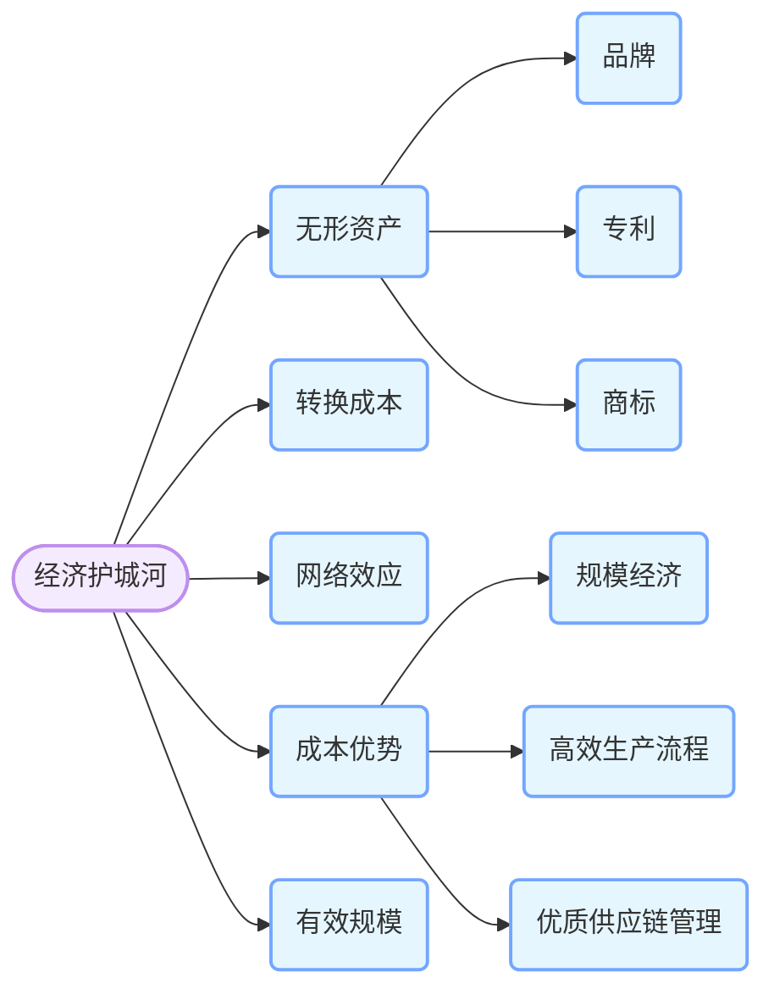

# 巴菲特的经济护城河理论：如何识别持久竞争优势

> 关键词：巴菲特、经济护城河理论、持久竞争优势、识别方法、企业价值

> 摘要：本文深入探讨了巴菲特的经济护城河理论，旨在帮助投资者和企业管理者理解如何识别企业的持久竞争优势。通过对经济护城河理论的背景介绍，详细阐述了核心概念及其联系，剖析了相关的核心算法原理与操作步骤，引入了数学模型和公式进行解读，并结合项目实战案例进行详细说明。同时，探讨了该理论在实际应用中的场景，推荐了学习该理论所需的工具和资源，最后对未来发展趋势与挑战进行了总结，并给出常见问题解答和扩展阅读参考资料。

## 1. 背景介绍 
### 1.1 目的和范围
本文章的主要目的是深入解读巴菲特的经济护城河理论，帮助读者理解如何运用该理论来识别企业的持久竞争优势。通过详细分析理论的各个方面，包括概念、原理、操作方法等，为投资者在评估企业价值时提供有力的工具，同时也为企业管理者提供提升企业竞争力的思路。文章的范围涵盖了经济护城河理论的基本概念、相关算法原理、数学模型、实际应用案例等多个方面，旨在全面而系统地介绍该理论。

### 1.2 预期读者
预期读者包括广大的投资者，无论是个人投资者还是机构投资者，都可以通过本文学习如何运用经济护城河理论来筛选具有持久竞争优势的企业，从而做出更明智的投资决策。此外，企业管理者也可以从本文中获取有关提升企业竞争力的启示，了解如何构建和维护企业的经济护城河。同时，对金融、经济领域感兴趣的学生和研究人员也能从本文中获得有价值的知识和研究思路。

### 1.3 文档结构概述
本文将按照以下结构进行阐述：首先介绍经济护城河理论的背景知识，包括目的、预期读者和文档结构概述等内容；接着详细讲解核心概念及其联系，通过文本示意图和 Mermaid 流程图进行直观展示；然后深入剖析核心算法原理和具体操作步骤，并使用 Python 源代码进行详细说明；之后引入数学模型和公式，进行详细讲解并举例说明；再通过项目实战案例，包括开发环境搭建、源代码实现和代码解读等，进一步加深读者对理论的理解；随后探讨该理论在实际应用中的场景；推荐学习该理论所需的工具和资源；总结未来发展趋势与挑战；提供常见问题解答和扩展阅读参考资料。

### 1.4 术语表
#### 1.4.1 核心术语定义
- **经济护城河**：指企业拥有的一种可持续的竞争优势，使企业能够在长期内抵御竞争对手的侵蚀，保持较高的盈利能力和市场份额。
- **持久竞争优势**：企业在市场中能够长期保持的、不易被模仿和超越的优势，这种优势可以体现在多个方面，如品牌、技术、成本等。
- **无形资产**：企业拥有的没有实物形态的资产，如品牌、专利、商标等，这些资产可以为企业带来竞争优势。
- **转换成本**：客户从一个产品或服务转换到另一个产品或服务时所面临的成本，包括金钱、时间、精力等方面的成本。
- **网络效应**：指随着使用产品或服务的用户数量增加，产品或服务的价值也随之增加的现象。

#### 1.4.2 相关概念解释
- **规模经济**：随着企业生产规模的扩大，单位产品的成本会逐渐降低，从而使企业在市场中具有成本优势。
- **成本优势**：企业通过各种方式降低成本，使其产品或服务的价格低于竞争对手，从而吸引更多的客户。
- **有效规模**：在特定的市场环境下，企业达到的能够实现最佳经济效益的生产规模。

#### 1.4.3 缩略词列表
本文中暂未使用缩略词。

## 2. 核心概念与联系 
### 核心概念原理
巴菲特的经济护城河理论认为，企业要想在长期内获得成功，必须拥有一种或多种可持续的竞争优势，即经济护城河。这种护城河可以保护企业的利润和市场份额，使其在激烈的市场竞争中脱颖而出。经济护城河主要包括以下几种类型：
1. **无形资产**：如强大的品牌、专利、商标等。品牌可以使消费者对企业的产品或服务产生信任和忠诚度，从而愿意支付更高的价格。专利和商标则可以保护企业的创新成果和知识产权，防止竞争对手的模仿。
2. **转换成本**：当客户从一个产品或服务转换到另一个产品或服务时，会面临一定的成本。这些成本包括金钱、时间、精力等方面的成本。如果转换成本很高，客户就不太愿意更换产品或服务，从而为企业提供了一定的竞争优势。
3. **网络效应**：随着使用产品或服务的用户数量增加，产品或服务的价值也会随之增加。例如，社交网络平台的用户越多，其对新用户的吸引力就越大，因为用户可以在平台上结识更多的人。这种网络效应可以形成一种强大的竞争优势，使企业在市场中占据主导地位。
4. **成本优势**：企业通过各种方式降低成本，使其产品或服务的价格低于竞争对手。成本优势可以来自于多种因素，如规模经济、高效的生产流程、优质的供应链管理等。
5. **有效规模**：在某些市场中，由于市场容量有限，只能容纳少数几家企业。这些企业在达到一定的规模后，就可以实现最佳的经济效益，从而形成一种竞争优势。

### 架构的文本示意图
```plaintext
经济护城河
|-- 无形资产
|   |-- 品牌
|   |-- 专利
|   |-- 商标
|-- 转换成本
|-- 网络效应
|-- 成本优势
|   |-- 规模经济
|   |-- 高效生产流程
|   |-- 优质供应链管理
|-- 有效规模
```

### Mermaid 流程图


## 3. 核心算法原理 & 具体操作步骤 
### 核心算法原理
虽然经济护城河理论并没有严格意义上的数学算法，但可以通过一些量化的指标来评估企业的经济护城河。以下是一些常用的指标和计算方法：
1. **毛利率**：毛利率是指企业销售收入减去销售成本后与销售收入的比率，计算公式为：
   $$毛利率 = \frac{销售收入 - 销售成本}{销售收入} \times 100\%$$
   毛利率越高，说明企业在产品或服务的定价上具有更大的优势，可能拥有一定的经济护城河。
2. **净利率**：净利率是指企业净利润与销售收入的比率，计算公式为：
   $$净利率 = \frac{净利润}{销售收入} \times 100\%$$
   净利率反映了企业的盈利能力，净利率较高的企业可能拥有更强的经济护城河。
3. **ROE（净资产收益率）**：ROE 是指企业净利润与净资产的比率，计算公式为：
   $$ROE = \frac{净利润}{净资产} \times 100\%$$
   ROE 衡量了企业运用自有资本的效率，ROE 较高的企业通常具有较好的经济护城河。

### 具体操作步骤
1. **收集数据**：收集企业的财务报表，包括利润表、资产负债表等，获取销售收入、销售成本、净利润、净资产等数据。
2. **计算指标**：根据上述公式计算毛利率、净利率和 ROE 等指标。
3. **分析指标**：将计算得到的指标与同行业其他企业进行比较，评估企业在这些指标上的表现。如果企业的指标明显优于同行业平均水平，说明企业可能拥有经济护城河。
4. **深入分析**：除了量化指标，还需要深入分析企业的业务模式、市场竞争地位、无形资产等方面，以确定企业经济护城河的类型和强度。

### Python 源代码实现
```python
# 定义计算毛利率的函数
def calculate_gross_margin(revenue, cost_of_goods_sold):
    return ((revenue - cost_of_goods_sold) / revenue) * 100

# 定义计算净利率的函数
def calculate_net_profit_margin(net_income, revenue):
    return (net_income / revenue) * 100

# 定义计算 ROE 的函数
def calculate_roe(net_income, shareholders_equity):
    return (net_income / shareholders_equity) * 100

# 示例数据
revenue = 1000000
cost_of_goods_sold = 600000
net_income = 200000
shareholders_equity = 800000

# 计算指标
gross_margin = calculate_gross_margin(revenue, cost_of_goods_sold)
net_profit_margin = calculate_net_profit_margin(net_income, revenue)
roe = calculate_roe(net_income, shareholders_equity)

# 输出结果
print(f"毛利率: {gross_margin:.2f}%")
print(f"净利率: {net_profit_margin:.2f}%")
print(f"ROE: {roe:.2f}%")
```

## 4. 数学模型和公式 & 详细讲解 & 举例说明 
### 数学模型和公式
除了上述提到的毛利率、净利率和 ROE 计算公式外，还可以通过一些其他的数学模型和公式来评估企业的经济护城河。例如，现金流折现模型（DCF）可以用来估算企业的内在价值，从而判断企业是否具有经济护城河。DCF 模型的基本公式为：
$$V = \sum_{t=1}^{n} \frac{CF_t}{(1 + r)^t} + \frac{TV}{(1 + r)^n}$$
其中：
- $V$ 表示企业的内在价值
- $CF_t$ 表示第 $t$ 期的自由现金流
- $r$ 表示折现率
- $n$ 表示预测期数
- $TV$ 表示终值

### 详细讲解
现金流折现模型的核心思想是将企业未来的自由现金流折现到当前，以估算企业的内在价值。自由现金流是指企业在满足了所有必要的资本支出后剩余的现金流量，它反映了企业实际能够为股东创造的价值。折现率则反映了投资者对投资风险的预期，折现率越高，说明投资者对风险的要求越高。终值是指预测期结束后企业的价值，可以通过一些方法进行估算，如永续增长模型。

### 举例说明
假设一家企业预计未来 5 年的自由现金流分别为 100 万元、120 万元、140 万元、160 万元和 180 万元，折现率为 10%，预测期结束后企业的终值为 2000 万元。则该企业的内在价值计算如下：
```python
import numpy as np

# 未来 5 年的自由现金流
cash_flows = np.array([100, 120, 140, 160, 180])
# 折现率
discount_rate = 0.1
# 预测期数
n = 5
# 终值
terminal_value = 2000

# 计算每年现金流的折现值
discounted_cash_flows = cash_flows / (1 + discount_rate) ** np.arange(1, n + 1)
# 计算终值的折现值
discounted_terminal_value = terminal_value / (1 + discount_rate) ** n

# 计算企业的内在价值
intrinsic_value = discounted_cash_flows.sum() + discounted_terminal_value

print(f"企业的内在价值: {intrinsic_value:.2f} 万元")
```
通过比较企业的内在价值和市场价值，可以判断企业是否被低估或高估。如果企业的内在价值远高于市场价值，且企业具有明显的经济护城河，那么该企业可能是一个不错的投资选择。

## 5. 项目实战：代码实际案例和详细解释说明 
### 5.1  开发环境搭建
在进行项目实战之前，需要搭建相应的开发环境。以下是具体的步骤：
1. **安装 Python**：从 Python 官方网站（https://www.python.org/downloads/）下载并安装 Python 3.x 版本。
2. **安装必要的库**：使用 pip 命令安装所需的库，如 numpy、pandas 等。可以在命令行中运行以下命令：
```sh
pip install numpy pandas
```
3. **选择开发工具**：可以选择使用 PyCharm、Jupyter Notebook 等开发工具。这里以 Jupyter Notebook 为例，可以通过以下命令安装：
```sh
pip install jupyter notebook
```
安装完成后，在命令行中运行 `jupyter notebook` 即可启动 Jupyter Notebook。

### 5.2  源代码详细实现和代码解读
以下是一个完整的项目实战案例，通过收集某企业的财务数据，计算毛利率、净利率和 ROE 等指标，并进行分析。

```python
import pandas as pd

# 模拟财务数据
data = {
    '年份': [2018, 2019, 2020, 2021, 2022],
    '销售收入': [1000, 1200, 1300, 1500, 1600],
    '销售成本': [600, 700, 750, 800, 850],
    '净利润': [200, 250, 280, 320, 350],
    '净资产': [800, 900, 1000, 1100, 1200]
}

# 创建 DataFrame
df = pd.DataFrame(data)

# 计算毛利率
df['毛利率'] = ((df['销售收入'] - df['销售成本']) / df['销售收入']) * 100

# 计算净利率
df['净利率'] = (df['净利润'] / df['销售收入']) * 100

# 计算 ROE
df['ROE'] = (df['净利润'] / df['净资产']) * 100

# 输出结果
print(df)
```

### 代码解读与分析
1. **导入库**：导入 `pandas` 库，用于数据处理和分析。
2. **模拟财务数据**：创建一个字典 `data`，包含年份、销售收入、销售成本、净利润和净资产等数据。
3. **创建 DataFrame**：使用 `pd.DataFrame()` 函数将字典转换为 DataFrame 对象，方便后续的数据处理。
4. **计算指标**：使用 DataFrame 的列操作计算毛利率、净利率和 ROE 等指标，并将结果添加到 DataFrame 中。
5. **输出结果**：使用 `print()` 函数输出计算结果。

通过对计算结果的分析，可以观察企业在不同年份的财务表现，评估企业的经济护城河。例如，如果企业的毛利率、净利率和 ROE 等指标在多年内保持稳定或上升趋势，说明企业可能拥有较强的经济护城河。

## 6. 实际应用场景 
### 投资领域
在投资领域，经济护城河理论可以帮助投资者筛选具有持久竞争优势的企业，从而做出更明智的投资决策。投资者可以通过分析企业的经济护城河类型和强度，评估企业的内在价值和投资风险。例如，对于拥有强大品牌和高转换成本的企业，其盈利能力和市场份额相对稳定，投资风险较低。投资者可以选择在合适的时机买入这些企业的股票，长期持有以获取丰厚的回报。

### 企业战略规划
企业管理者可以运用经济护城河理论来制定企业的战略规划，提升企业的竞争力。通过分析企业现有的经济护城河，管理者可以确定企业的核心优势，并在此基础上进行拓展和强化。例如，如果企业拥有成本优势，可以进一步优化生产流程、降低成本，以扩大市场份额。同时，管理者还可以通过创新和并购等方式，构建新的经济护城河，为企业的长期发展奠定基础。

### 行业分析
经济护城河理论也可以用于行业分析，帮助分析师了解行业内企业的竞争格局和发展趋势。通过比较不同企业的经济护城河，分析师可以判断哪些企业在行业中具有竞争优势，哪些企业面临较大的竞争压力。这有助于分析师预测行业的未来发展方向，为投资者和企业管理者提供有价值的参考。

## 7. 工具和资源推荐
### 7.1 学习资源推荐
#### 7.1.1 书籍推荐
- 《巴菲特的护城河》：这本书是关于经济护城河理论的经典著作，详细介绍了经济护城河的概念、类型和评估方法，通过大量的案例分析，帮助读者深入理解该理论。
- 《聪明的投资者》：本杰明·格雷厄姆的经典投资著作，书中强调了价值投资的重要性，为读者提供了评估企业价值和投资风险的方法，与经济护城河理论密切相关。
- 《穷查理宝典》：收录了查理·芒格的演讲和文章，其中包含了许多关于投资和企业分析的智慧，对理解经济护城河理论有很大的帮助。

#### 7.1.2 在线课程
- Coursera 上的“投资学原理”：该课程由知名大学的教授授课，涵盖了投资领域的基础知识和理论，包括企业估值和竞争优势分析等内容。
- 网易云课堂上的“价值投资实战教程”：课程结合实际案例，讲解了价值投资的方法和技巧，其中涉及到经济护城河理论的应用。

#### 7.1.3 技术博客和网站
- 雪球网：一个专业的投资社区，有许多投资者分享关于企业分析和投资策略的文章，其中不乏对经济护城河理论的讨论。
- 东方财富网：提供丰富的金融信息和数据，包括企业的财务报表和行业分析报告，有助于读者运用经济护城河理论进行企业评估。

### 7.2 开发工具框架推荐
#### 7.2.1 IDE和编辑器
- PyCharm：一款专业的 Python 集成开发环境，具有强大的代码编辑、调试和分析功能，适合开发与经济护城河理论相关的数据分析和计算程序。
- Jupyter Notebook：一个交互式的开发环境，支持 Python、R 等多种编程语言，方便用户进行数据探索和可视化分析。

#### 7.2.2 调试和性能分析工具
- pdb：Python 内置的调试工具，可以帮助用户在代码运行过程中进行调试，查找问题所在。
- cProfile：Python 的性能分析工具，可以统计代码的运行时间和函数调用次数，帮助用户优化代码性能。

#### 7.2.3 相关框架和库
- pandas：用于数据处理和分析的 Python 库，提供了高效的数据结构和数据操作方法，适合处理企业的财务数据。
- numpy：一个用于科学计算的 Python 库，提供了高性能的多维数组对象和各种数学函数，可用于计算经济护城河相关的指标。

### 7.3 相关论文著作推荐
#### 7.3.1 经典论文
- 《竞争优势》（迈克尔·波特）：该论文提出了企业竞争优势的概念和分析方法，为经济护城河理论的发展奠定了基础。
- 《创造性破坏的过程》（约瑟夫·熊彼特）：探讨了创新和竞争在经济发展中的作用，对理解企业的持久竞争优势具有重要意义。

#### 7.3.2 最新研究成果
- 可以关注《金融研究》、《管理世界》等学术期刊，这些期刊会发表关于企业竞争优势和投资分析的最新研究成果。

#### 7.3.3 应用案例分析
- 一些专业的财经媒体和研究机构会发布企业竞争优势的应用案例分析报告，如券商的研究报告、咨询公司的行业分析报告等，这些报告可以帮助读者更好地理解经济护城河理论在实际中的应用。

## 8. 总结：未来发展趋势与挑战
### 未来发展趋势
1. **数字化转型带来新的经济护城河**：随着信息技术的快速发展，企业的数字化转型成为趋势。拥有先进的数字化技术和数据资源的企业，将形成新的经济护城河。例如，互联网平台企业通过大数据分析和人工智能技术，能够更好地满足用户需求，提高用户粘性，从而获得竞争优势。
2. **可持续发展成为重要的竞争因素**：在全球关注可持续发展的背景下，企业的环境、社会和治理（ESG）表现将成为影响其经济护城河的重要因素。具有良好 ESG 表现的企业，更容易获得投资者和消费者的认可，从而提升企业的竞争力。
3. **跨界竞争加剧**：随着行业边界的逐渐模糊，跨界竞争将日益加剧。企业需要不断拓展自身的业务领域，构建多元化的经济护城河，以应对来自不同行业的竞争对手。

### 挑战
1. **技术变革带来的不确定性**：快速的技术变革可能会使企业现有的经济护城河在短时间内失去优势。例如，新兴技术的出现可能会颠覆传统行业的商业模式，使拥有传统经济护城河的企业面临巨大的挑战。
2. **市场竞争加剧**：随着全球经济的一体化和市场竞争的加剧，企业面临的竞争压力越来越大。要构建和维护经济护城河，企业需要不断创新和提升自身的竞争力，这对企业的管理和创新能力提出了更高的要求。
3. **数据安全和隐私问题**：在数字化时代，企业的经济护城河往往与数据资源密切相关。然而，数据安全和隐私问题也成为企业面临的重要挑战。一旦企业的数据泄露或受到攻击，不仅会损害企业的声誉，还可能导致企业的经济护城河受到破坏。

## 9. 附录：常见问题与解答
### 问题 1：如何判断企业的经济护城河是可持续的？
解答：判断企业经济护城河的可持续性需要综合考虑多个因素。首先，要分析企业经济护城河的类型和来源，如无形资产、转换成本、网络效应等。如果企业的经济护城河是基于独特的技术、强大的品牌或高转换成本，那么其可持续性相对较高。其次，要关注企业所处的行业环境和竞争态势。如果行业竞争激烈，技术变革迅速，企业的经济护城河可能面临被侵蚀的风险。此外，还需要考察企业的创新能力和管理水平，只有不断创新和提升管理效率，企业才能保持经济护城河的可持续性。

### 问题 2：经济护城河理论适用于所有行业吗？
解答：经济护城河理论适用于大多数行业，但不同行业的经济护城河类型和强度可能存在差异。在一些传统行业，如制造业、消费品行业，品牌、成本优势和规模经济等因素可能是企业经济护城河的重要来源。而在新兴行业，如互联网、科技行业，技术创新、网络效应和数据资源等因素可能更为关键。此外，一些行业由于市场竞争激烈、技术变革迅速，企业的经济护城河可能相对较浅，需要不断努力来构建和维护。

### 问题 3：如何量化评估企业的经济护城河？
解答：可以通过一些量化指标来评估企业的经济护城河，如毛利率、净利率、ROE 等。这些指标可以反映企业的盈利能力和经营效率，较高的指标值通常意味着企业具有较强的经济护城河。此外，还可以使用现金流折现模型等方法来估算企业的内在价值，通过比较内在价值和市场价值，判断企业的经济护城河是否被市场低估。同时，还需要结合定性分析，如对企业的业务模式、市场竞争地位、无形资产等方面的分析，来全面评估企业的经济护城河。

## 10. 扩展阅读 & 参考资料
### 扩展阅读
- 《创新者的窘境》：探讨了创新对企业竞争优势的影响，以及企业如何应对创新带来的挑战。
- 《从优秀到卓越》：研究了优秀企业如何实现向卓越企业的跨越，对理解企业的持久竞争优势有一定的启示。

### 参考资料
- 巴菲特历年致股东的信，可从伯克希尔·哈撒韦公司官方网站获取。
- 相关企业的财务报表和年报，可从证券交易所网站或企业官方网站获取。

作者：AI天才研究院/AI Genius Institute & 禅与计算机程序设计艺术 /Zen And The Art of Computer Programming