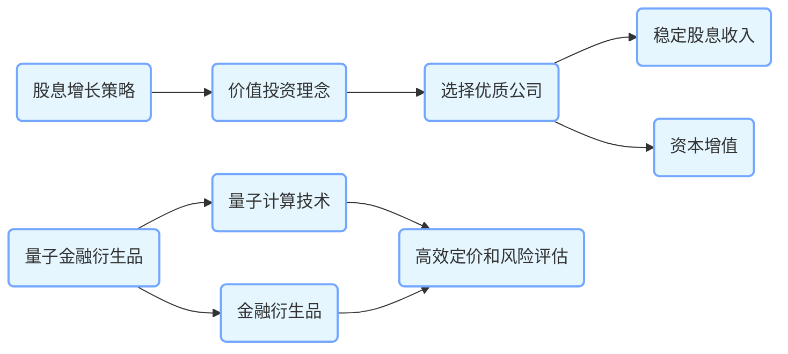

# 巴菲特的股息增长策略：量子金融衍生品的收益来源

> 关键词：巴菲特、股息增长策略、量子金融衍生品、收益来源、投资分析

> 摘要：本文深入探讨了巴菲特的股息增长策略，并聚焦于量子金融衍生品的收益来源。通过对核心概念的解析、算法原理的阐述、数学模型的构建、项目实战案例的分析，揭示了这一投资组合策略背后的逻辑和潜在价值。同时，介绍了相关的实际应用场景、推荐了学习和开发所需的工具与资源，最后对未来发展趋势与挑战进行了总结，为投资者和金融从业者提供了全面且深入的技术分析和理论指导。

## 1. 背景介绍 

### 1.1 目的和范围
本文章旨在深入剖析巴菲特的股息增长策略以及量子金融衍生品的收益来源。研究范围涵盖从基本概念到复杂的数学模型，从理论分析到实际项目案例，试图全面揭示这一投资策略在现代金融市场中的运作机制和潜在价值。通过对该策略的研究，投资者可以更好地理解如何在股息增长和金融衍生品之间找到平衡，以实现长期稳定的投资回报。

### 1.2 预期读者
预期读者包括金融投资者、金融分析师、量化投资从业者、金融专业学生以及对金融市场和投资策略感兴趣的人士。无论是希望深入了解巴菲特投资理念的初学者，还是寻求优化投资组合的专业人士，都能从本文中获取有价值的信息。

### 1.3 文档结构概述
本文将按照以下结构展开：首先介绍核心概念与联系，帮助读者建立基本的知识框架；接着阐述核心算法原理和具体操作步骤，结合Python代码进行详细说明；然后构建数学模型和公式，并通过举例进行详细讲解；之后通过项目实战案例展示如何在实际中应用这些理论；再介绍该策略的实际应用场景；随后推荐相关的学习资源、开发工具框架和论文著作；最后总结未来发展趋势与挑战，并提供常见问题解答和扩展阅读参考资料。

### 1.4 术语表

#### 1.4.1 核心术语定义
- **股息增长策略**：一种投资策略，投资者选择那些具有稳定且不断增长股息支付历史的公司股票进行投资，通过股息收入和资本增值来实现长期投资回报。
- **量子金融衍生品**：结合了量子计算技术和金融衍生品的创新金融工具，利用量子算法的高效性和独特性来处理复杂的金融问题，如风险评估、定价等。
- **收益来源**：指投资活动中产生回报的途径，包括股息收入、资本利得、衍生品交易利润等。

#### 1.4.2 相关概念解释
- **股息**：公司根据盈利情况向股东分配的利润，通常以每股为单位进行支付。股息的多少和稳定性反映了公司的盈利能力和财务健康状况。
- **金融衍生品**：一种金融合约，其价值取决于基础资产（如股票、债券、商品等）的价格、利率、汇率等变量。常见的金融衍生品包括期货、期权、互换等。
- **量子计算**：一种基于量子力学原理的计算方式，具有比传统计算机更强大的计算能力，能够在更短的时间内解决复杂的数学问题。

#### 1.4.3 缩略词列表
- **ETF**：交易型开放式指数基金（Exchange-Traded Fund）
- **OTC**：场外交易（Over-the-Counter）
- **VaR**：风险价值（Value at Risk）

## 2. 核心概念与联系 

### 核心概念原理
#### 股息增长策略原理
巴菲特的股息增长策略基于价值投资理念，他认为投资者应该选择那些具有长期竞争优势、稳定现金流和良好管理团队的公司。这些公司通常会将一部分利润以股息的形式分配给股东，并且随着公司业绩的增长，股息也会不断增加。通过持有这些股票，投资者不仅可以获得稳定的股息收入，还能享受股票价格上涨带来的资本增值。

#### 量子金融衍生品原理
量子金融衍生品结合了量子计算和金融衍生品的优势。量子计算的并行计算能力可以大大提高金融衍生品定价和风险评估的效率。例如，在期权定价中，传统的方法可能需要大量的计算资源和时间来模拟各种市场情景，而量子算法可以更快速地处理这些复杂的计算，从而更准确地确定衍生品的价值。

### 架构的文本示意图
```plaintext
股息增长策略 <-- 价值投资理念 --> 选择优质公司 --> 稳定股息收入 + 资本增值
量子金融衍生品 <-- 量子计算技术 + 金融衍生品 --> 高效定价和风险评估
```

### Mermaid 流程图


## 3. 核心算法原理 & 具体操作步骤 

### 股息增长策略算法原理
股息增长策略的核心是选择具有稳定股息增长的股票。可以通过以下步骤实现：
1. **筛选股票**：根据股息支付率、股息增长率等指标筛选出符合条件的股票。
2. **评估公司基本面**：分析公司的财务报表、行业竞争力、管理团队等因素，评估公司的长期发展潜力。
3. **构建投资组合**：根据筛选和评估结果，选择一定数量的股票构建投资组合，以分散风险。

### Python 代码实现
```python
import pandas as pd
import yfinance as yf

# 定义筛选条件
def screen_stocks(tickers, min_dividend_yield=0.03, min_dividend_growth=0.05):
    selected_stocks = []
    for ticker in tickers:
        try:
            stock = yf.Ticker(ticker)
            dividend_yield = stock.info.get('dividendYield', 0)
            dividends = stock.dividends
            if len(dividends) > 1:
                dividend_growth = (dividends.iloc[-1] - dividends.iloc[-2]) / dividends.iloc[-2]
                if dividend_yield >= min_dividend_yield and dividend_growth >= min_dividend_growth:
                    selected_stocks.append(ticker)
        except Exception as e:
            print(f"Error fetching data for {ticker}: {e}")
    return selected_stocks

# 示例股票列表
tickers = ['AAPL', 'MSFT', 'JNJ', 'PG', 'KO']
selected = screen_stocks(tickers)
print("Selected stocks:", selected)
```

### 量子金融衍生品算法原理
量子金融衍生品的定价和风险评估通常涉及复杂的数学模型，如Black-Scholes模型的量子优化版本。量子算法可以通过量子比特的叠加和纠缠特性，并行处理多个可能的市场情景，从而更快速地计算出衍生品的价值。

### Python 代码示例（简化模拟）
```python
import numpy as np

# 简化的量子金融衍生品定价模拟
def quantum_derivative_pricing(spot_price, strike_price, risk_free_rate, volatility, time_to_maturity):
    # 这里只是简化示例，实际量子算法会更复杂
    d1 = (np.log(spot_price / strike_price) + (risk_free_rate + 0.5 * volatility**2) * time_to_maturity) / (volatility * np.sqrt(time_to_maturity))
    d2 = d1 - volatility * np.sqrt(time_to_maturity)
    option_price = spot_price * 0.5 - strike_price * np.exp(-risk_free_rate * time_to_maturity) * 0.5
    return option_price

# 参数设置
spot_price = 100
strike_price = 105
risk_free_rate = 0.05
volatility = 0.2
time_to_maturity = 1

price = quantum_derivative_pricing(spot_price, strike_price, risk_free_rate, volatility, time_to_maturity)
print("Quantum derivative price:", price)
```

## 4. 数学模型和公式 & 详细讲解 & 举例说明 

### 股息增长模型
#### 戈登增长模型
戈登增长模型是一种常用的股息增长模型，用于估算股票的内在价值。公式如下：
$$V = \frac{D_1}{r - g}$$
其中：
- $V$ 是股票的内在价值
- $D_1$ 是下一期预计股息
- $r$ 是投资者要求的回报率
- $g$ 是股息的固定增长率

**详细讲解**：该模型假设股息以固定的增长率 $g$ 无限期增长。投资者要求的回报率 $r$ 反映了投资该股票的风险程度。当 $r > g$ 时，模型才有意义，因为如果股息增长率超过投资者要求的回报率，股票的价值将趋于无穷大。

**举例说明**：假设某公司下一期预计股息 $D_1 = 2$ 元，投资者要求的回报率 $r = 0.1$，股息固定增长率 $g = 0.05$。则该股票的内在价值为：
$$V = \frac{2}{0.1 - 0.05} = 40$$（元）

### 量子金融衍生品定价模型
#### 量子优化的Black-Scholes模型（简化概念）
传统的Black-Scholes模型用于期权定价，公式如下：
$$C = S_0 N(d_1) - K e^{-rT} N(d_2)$$
其中：
- $C$ 是欧式看涨期权的价格
- $S_0$ 是标的资产的当前价格
- $K$ 是期权的执行价格
- $r$ 是无风险利率
- $T$ 是期权的到期时间
- $N(x)$ 是标准正态分布的累积分布函数
- $d_1 = \frac{\ln(\frac{S_0}{K}) + (r + \frac{\sigma^2}{2})T}{\sigma \sqrt{T}}$
- $d_2 = d_1 - \sigma \sqrt{T}$
- $\sigma$ 是标的资产的波动率

量子优化的Black-Scholes模型通过量子算法更高效地计算 $N(d_1)$ 和 $N(d_2)$ 等复杂函数，从而提高定价的准确性和效率。

**详细讲解**：该模型基于一系列假设，如标的资产价格服从几何布朗运动、市场无摩擦等。在量子优化中，利用量子计算机的并行计算能力，可以同时处理多个可能的市场情景，减少计算时间和误差。

**举例说明**：假设标的资产当前价格 $S_0 = 100$ 元，期权执行价格 $K = 105$ 元，无风险利率 $r = 0.05$，期权到期时间 $T = 1$ 年，标的资产波动率 $\sigma = 0.2$。

首先计算 $d_1$ 和 $d_2$：
$$d_1 = \frac{\ln(\frac{100}{105}) + (0.05 + \frac{0.2^2}{2}) \times 1}{0.2 \times \sqrt{1}} \approx -0.025$$
$$d_2 = d_1 - 0.2 \times \sqrt{1} \approx -0.225$$

查标准正态分布表可得 $N(d_1) \approx 0.49$，$N(d_2) \approx 0.41$。

则欧式看涨期权的价格为：
$$C = 100 \times 0.49 - 105 \times e^{-0.05 \times 1} \times 0.41 \approx 49 - 105 \times 0.9512 \times 0.41 \approx 49 - 40.7 \approx 8.3$$（元）

## 5. 项目实战：代码实际案例和详细解释说明 

### 5.1  开发环境搭建
#### 安装Python
首先需要安装Python，可以从Python官方网站（https://www.python.org/downloads/）下载适合自己操作系统的Python版本。建议安装Python 3.7及以上版本。

#### 安装必要的库
使用pip命令安装以下必要的库：
```bash
pip install pandas yfinance numpy matplotlib
```
- `pandas`：用于数据处理和分析
- `yfinance`：用于获取股票数据
- `numpy`：用于数值计算
- `matplotlib`：用于数据可视化

### 5.2  源代码详细实现和代码解读
```python
import pandas as pd
import yfinance as yf
import numpy as np
import matplotlib.pyplot as plt

# 筛选具有股息增长的股票
def screen_stocks(tickers, min_dividend_yield=0.03, min_dividend_growth=0.05):
    selected_stocks = []
    for ticker in tickers:
        try:
            stock = yf.Ticker(ticker)
            dividend_yield = stock.info.get('dividendYield', 0)
            dividends = stock.dividends
            if len(dividends) > 1:
                dividend_growth = (dividends.iloc[-1] - dividends.iloc[-2]) / dividends.iloc[-2]
                if dividend_yield >= min_dividend_yield and dividend_growth >= min_dividend_growth:
                    selected_stocks.append(ticker)
        except Exception as e:
            print(f"Error fetching data for {ticker}: {e}")
    return selected_stocks

# 构建投资组合并计算收益
def build_portfolio(selected_stocks, start_date, end_date):
    portfolio_returns = []
    for ticker in selected_stocks:
        try:
            data = yf.download(ticker, start=start_date, end=end_date)
            returns = data['AdjClose'].pct_change().dropna()
            portfolio_returns.append(returns)
        except Exception as e:
            print(f"Error fetching data for {ticker}: {e}")
    portfolio_returns = pd.concat(portfolio_returns, axis=1)
    portfolio_returns.columns = selected_stocks
    portfolio_weights = np.ones(len(selected_stocks)) / len(selected_stocks)
    portfolio_value = (1 + portfolio_returns.dot(portfolio_weights)).cumprod()
    return portfolio_value

# 示例股票列表
tickers = ['AAPL', 'MSFT', 'JNJ', 'PG', 'KO']
selected = screen_stocks(tickers)
start_date = '2020-01-01'
end_date = '2023-01-01'
portfolio_value = build_portfolio(selected, start_date, end_date)

# 可视化投资组合价值
plt.figure(figsize=(12, 6))
plt.plot(portfolio_value)
plt.title('Portfolio Value Over Time')
plt.xlabel('Date')
plt.ylabel('Portfolio Value')
plt.show()
```

### 5.3  代码解读与分析
#### `screen_stocks` 函数
该函数用于筛选具有股息增长的股票。首先遍历输入的股票列表，使用 `yfinance` 库获取每只股票的股息收益率和股息数据。然后计算股息增长率，并根据设定的最低股息收益率和最低股息增长率筛选出符合条件的股票。

#### `build_portfolio` 函数
该函数用于构建投资组合并计算其收益。首先遍历筛选出的股票列表，使用 `yfinance` 库获取每只股票在指定时间范围内的调整后收盘价数据，并计算其每日收益率。然后将所有股票的收益率数据合并为一个DataFrame，并计算等权重的投资组合收益率。最后，计算投资组合的累计价值。

#### 可视化部分
使用 `matplotlib` 库将投资组合的累计价值随时间的变化进行可视化，帮助投资者直观地了解投资组合的表现。

## 6. 实际应用场景 
### 个人投资
对于个人投资者来说，巴菲特的股息增长策略可以作为一种长期投资策略。通过选择具有稳定股息增长的股票构建投资组合，投资者可以获得稳定的股息收入和资本增值。同时，量子金融衍生品可以用于风险管理，例如通过期权合约对冲股票投资的风险。

### 机构投资
机构投资者如基金公司、保险公司等可以利用股息增长策略和量子金融衍生品优化投资组合。例如，基金公司可以根据股息增长策略选择优质股票，同时使用量子金融衍生品进行套利和风险对冲，以提高投资组合的收益和稳定性。

### 金融研究
在金融研究领域，股息增长策略和量子金融衍生品是热门的研究课题。研究人员可以通过建立数学模型和进行实证分析，深入探讨这一策略的有效性和量子金融衍生品的定价机制，为金融市场的发展提供理论支持。

## 7. 工具和资源推荐
### 7.1 学习资源推荐
#### 7.1.1 书籍推荐
- 《聪明的投资者》（The Intelligent Investor）：作者本杰明·格雷厄姆（Benjamin Graham），是价值投资的经典著作，对巴菲特的投资理念产生了深远影响。
- 《巴菲特致股东的信》（Letters to Shareholders of Berkshire Hathaway）：收集了巴菲特多年来致股东的信，详细阐述了他的投资哲学和策略。
- 《量子计算与量子信息》（Quantum Computation and Quantum Information）：作者迈克尔·尼尔森（Michael Nielsen）和艾萨克·庄（Isaac Chuang），是量子计算领域的权威教材。

#### 7.1.2 在线课程
- Coursera上的“金融市场”（Financial Markets）课程：由耶鲁大学教授罗伯特·席勒（Robert Shiller）授课，涵盖了金融市场的基本原理和投资策略。
- edX上的“量子计算基础”（Fundamentals of Quantum Computation）课程：介绍了量子计算的基本概念和算法。

#### 7.1.3 技术博客和网站
- Seeking Alpha：提供金融市场分析、投资策略和股票研究报告。
- Quantum Computing Report：专注于量子计算领域的最新动态和研究成果。

### 7.2 开发工具框架推荐
#### 7.2.1 IDE和编辑器
- PyCharm：功能强大的Python集成开发环境，适合开发复杂的金融分析和量化投资程序。
- Jupyter Notebook：交互式笔记本，方便进行数据探索、模型验证和可视化。

#### 7.2.2 调试和性能分析工具
- Py-Spy：用于分析Python程序的性能瓶颈。
- pdb：Python内置的调试器，可用于调试Python代码。

#### 7.2.3 相关框架和库
- TensorFlow Quantum：谷歌开发的用于量子机器学习的框架。
- Qiskit：IBM开发的开源量子计算框架，提供了丰富的量子算法和工具。

### 7.3 相关论文著作推荐
#### 7.3.1 经典论文
- “The Capital Asset Pricing Model: Theory and Evidence”：由尤金·法玛（Eugene F. Fama）和肯尼斯·弗伦奇（Kenneth R. French）发表，对资本资产定价模型进行了深入研究。
- “Quantum Algorithm for Linear Systems of Equations”：由阿伦·哈罗（Aram W. Harrow）、阿维纳坦·哈西迪姆（Avinatan Hassidim）和塞思·劳埃德（Seth Lloyd）发表，提出了用于求解线性方程组的量子算法。

#### 7.3.2 最新研究成果
- 关注《Journal of Finance》、《Quantum Information Processing》等学术期刊，获取最新的金融和量子计算研究成果。

#### 7.3.3 应用案例分析
- 可以参考一些金融机构的研究报告和案例分析，了解股息增长策略和量子金融衍生品在实际应用中的效果和经验。

## 8. 总结：未来发展趋势与挑战
### 未来发展趋势
- **融合发展**：股息增长策略和量子金融衍生品将进一步融合，利用量子计算的强大能力优化股息增长投资组合的构建和风险管理。
- **普及应用**：随着量子计算技术的不断发展和成本的降低，量子金融衍生品将逐渐普及，为投资者提供更多的投资选择和风险管理工具。
- **跨领域合作**：金融领域将与计算机科学、物理学等领域进行更深入的跨领域合作，推动量子金融的创新发展。

### 挑战
- **技术瓶颈**：量子计算技术仍处于发展阶段，面临着量子比特稳定性、量子纠错等技术难题，限制了量子金融衍生品的实际应用。
- **人才短缺**：既懂金融又懂量子计算的复合型人才稀缺，制约了量子金融领域的发展。
- **监管难题**：量子金融衍生品作为一种新兴金融工具，其复杂性和风险性给监管带来了挑战，需要建立相应的监管框架和法规。

## 9. 附录：常见问题与解答
### 问题1：股息增长策略适合短期投资吗？
解答：股息增长策略更适合长期投资。因为该策略的核心是选择具有稳定股息增长的公司，股息的增长和股票的资本增值通常需要较长时间才能体现出来。短期投资可能会受到市场波动的影响，难以获得稳定的回报。

### 问题2：量子金融衍生品的风险大吗？
解答：量子金融衍生品的风险与传统金融衍生品类似，但其复杂性和不确定性可能更高。一方面，量子算法的准确性和可靠性还需要进一步验证；另一方面，量子金融衍生品的定价和交易机制相对复杂，投资者需要具备较高的专业知识和风险承受能力。

### 问题3：如何评估量子金融衍生品的价值？
解答：评估量子金融衍生品的价值需要综合考虑多个因素，如基础资产的价格、波动率、无风险利率等。目前，量子金融衍生品的定价模型仍在研究和发展中，投资者可以参考相关的学术研究和专业机构的分析报告。

## 10. 扩展阅读 & 参考资料
### 扩展阅读
- 《金融炼金术》（The Alchemy of Finance）：作者乔治·索罗斯（George Soros），探讨了金融市场的反身性原理。
- 《量子物理学的哲学基础》（The Philosophy of Quantum Physics）：作者汉斯·赖欣巴哈（Hans Reichenbach），介绍了量子物理学的哲学思考。

### 参考资料
- [Yahoo Finance](https://finance.yahoo.com/)：提供股票、基金等金融数据。
- [IBM Quantum](https://quantum-computing.ibm.com/)：提供量子计算相关的资源和工具。

作者：AI天才研究院/AI Genius Institute & 禅与计算机程序设计艺术 /Zen And The Art of Computer Programming