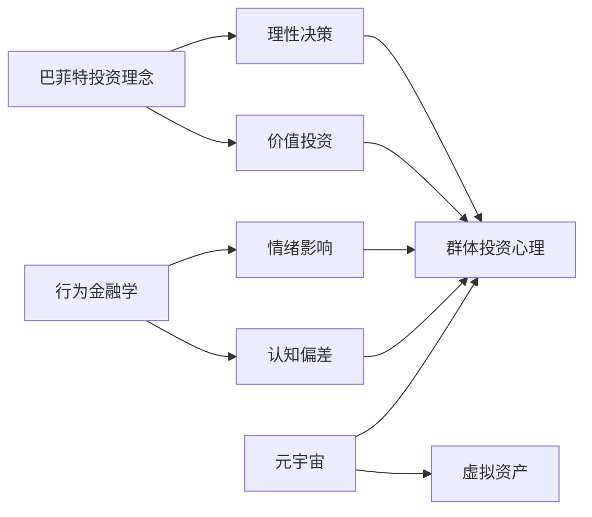

# 巴菲特的行为金融学应用：元宇宙中的群体投资心理

> 关键词：巴菲特、行为金融学、元宇宙、群体投资心理、投资决策

> 摘要：本文深入探讨了巴菲特的行为金融学理念在元宇宙这一新兴领域中群体投资心理方面的应用。首先介绍了行为金融学及元宇宙的背景知识，阐述核心概念及相互联系。接着分析核心算法原理和具体操作步骤，结合数学模型和公式进行详细讲解。通过项目实战案例展示如何运用相关理论进行投资决策。探讨了元宇宙中群体投资心理的实际应用场景，推荐了学习和开发相关知识的工具和资源。最后总结未来发展趋势与挑战，解答常见问题并提供扩展阅读和参考资料，旨在帮助投资者更好地理解和应对元宇宙投资中的群体心理现象。

## 1. 背景介绍 
### 1.1 目的和范围
本研究的目的在于探索巴菲特所倡导的行为金融学理念在元宇宙这一全新投资领域中如何应用于理解群体投资心理。通过分析元宇宙中投资者的行为模式和心理特征，为投资者提供更科学、理性的投资决策依据。研究范围涵盖了行为金融学的基本理论、元宇宙的概念和特点、元宇宙投资市场中的群体行为表现以及如何运用巴菲特的投资智慧应对这些群体行为。

### 1.2 预期读者
本文预期读者包括对投资领域感兴趣的普通投资者、金融从业者、研究行为金融学和元宇宙相关领域的学者以及希望深入了解新兴投资市场中群体心理现象的人士。

### 1.3 文档结构概述
本文首先介绍研究的背景和相关术语，为后续内容奠定基础。接着阐述核心概念及其联系，包括行为金融学、巴菲特投资理念和元宇宙的群体投资心理等。然后详细讲解核心算法原理、具体操作步骤以及相关的数学模型和公式。通过项目实战案例展示如何在实际投资中运用这些理论。之后探讨元宇宙中群体投资心理的实际应用场景。推荐学习和开发所需的工具和资源。最后总结未来发展趋势与挑战，解答常见问题并提供扩展阅读和参考资料。

### 1.4 术语表
#### 1.4.1 核心术语定义
- **行为金融学**：是将心理学、社会学等学科的研究成果融入传统金融学理论的交叉学科，主要研究投资者在决策过程中的认知偏差、情绪和群体行为对金融市场的影响。
- **元宇宙**：是一个基于虚拟现实、增强现实、区块链等技术构建的虚拟世界，用户可以在其中进行社交、娱乐、工作、投资等活动，具有高度的沉浸感和交互性。
- **群体投资心理**：指在投资市场中，投资者群体由于相互影响、模仿等因素而形成的共同的心理倾向和行为模式。

#### 1.4.2 相关概念解释
- **认知偏差**：投资者在处理信息和做出决策时，由于心理因素的影响而产生的系统性偏差，如过度自信、锚定效应、羊群效应等。
- **价值投资**：巴菲特所倡导的投资理念，强调通过分析公司的基本面，寻找被低估的股票进行长期投资。
- **虚拟资产**：在元宇宙中具有价值的数字资产，如虚拟土地、虚拟货币、虚拟艺术品等。

#### 1.4.3 缩略词列表
- **VR**：Virtual Reality，虚拟现实
- **AR**：Augmented Reality，增强现实
- **NFT**：Non - Fungible Token，非同质化代币

## 2. 核心概念与联系 

### 2.1 行为金融学核心原理
行为金融学认为，投资者并非完全理性的经济人，他们的决策往往受到心理因素的影响。其中，认知偏差和情绪是导致投资者做出非理性决策的重要原因。例如，过度自信会使投资者高估自己的投资能力，从而承担过高的风险；锚定效应会使投资者过于依赖最初获得的信息，而忽略了后续的变化。

### 2.2 巴菲特的投资理念
巴菲特是价值投资的代表人物，他强调投资的核心是寻找具有长期竞争优势和稳定现金流的公司，并以合理的价格买入。他认为投资者应该避免受到市场情绪的影响，保持冷静和理性。例如，在市场恐慌时，他会寻找被低估的优质股票进行买入；而在市场过热时，他会保持谨慎，避免盲目跟风。

### 2.3 元宇宙中的群体投资心理
在元宇宙中，由于其虚拟性和创新性，投资者更容易受到群体心理的影响。当元宇宙中的某个项目或资产受到广泛关注时，投资者往往会产生跟风投资的行为，形成羊群效应。此外，元宇宙中的信息传播速度快，容易引发投资者的情绪波动，导致过度乐观或过度悲观的投资决策。

### 2.4 概念联系示意图


该示意图展示了行为金融学中的认知偏差和情绪影响与元宇宙中的群体投资心理相关联，巴菲特的价值投资和理性决策理念也对元宇宙中的投资行为产生影响。

## 3. 核心算法原理 & 具体操作步骤 

### 3.1 核心算法原理
在分析元宇宙中的群体投资心理时，我们可以运用机器学习算法中的聚类分析和情感分析。聚类分析可以将投资者按照投资行为和心理特征进行分类，以便更好地理解不同群体的投资模式。情感分析则可以通过对社交媒体、新闻等文本数据的分析，了解投资者的情绪倾向。

以下是一个简单的Python代码示例，使用`scikit - learn`库进行聚类分析：

```python
import numpy as np
from sklearn.cluster import KMeans

# 假设我们有一些投资者的投资数据，每个投资者有两个特征：投资金额和投资频率
X = np.array([[1000, 5], [2000, 3], [500, 10], [3000, 2], [800, 8]])

# 使用KMeans算法进行聚类，假设分为2类
kmeans = KMeans(n_clusters=2, random_state=0).fit(X)

# 打印每个样本的聚类标签
print(kmeans.labels_)
```

### 3.2 具体操作步骤
#### 3.2.1 数据收集
收集元宇宙投资市场中的相关数据，包括投资者的交易记录、社交媒体上的讨论内容、新闻报道等。

#### 3.2.2 数据预处理
对收集到的数据进行清洗、转换和特征提取。例如，将文本数据进行分词、去除停用词等处理，将交易记录进行标准化处理。

#### 3.2.3 聚类分析
使用聚类算法对投资者进行分类，确定不同的投资群体。

#### 3.2.4 情感分析
对文本数据进行情感分析，判断投资者的情绪倾向是积极、消极还是中性。

#### 3.2.5 结果分析
根据聚类分析和情感分析的结果，分析不同投资群体的行为模式和心理特征，为投资决策提供参考。

## 4. 数学模型和公式 & 详细讲解 & 举例说明 

### 4.1 聚类分析的数学模型
聚类分析的目标是将数据集 $X = \{x_1, x_2, \cdots, x_n\}$ 划分为 $k$ 个不同的簇 $C = \{C_1, C_2, \cdots, C_k\}$，使得同一簇内的数据点相似度较高，不同簇之间的数据点相似度较低。常用的聚类算法是KMeans算法，其目标函数是最小化每个数据点到其所属簇的质心的距离之和，即：

$$
J = \sum_{i = 1}^{k} \sum_{x_j \in C_i} \| x_j - \mu_i \|^2
$$

其中，$\mu_i$ 是簇 $C_i$ 的质心，$\| x_j - \mu_i \|$ 表示数据点 $x_j$ 到质心 $\mu_i$ 的欧几里得距离。

### 4.2 情感分析的数学模型
情感分析可以使用朴素贝叶斯分类器进行文本分类，将文本分为积极、消极和中性三类。朴素贝叶斯分类器基于贝叶斯定理：

$$
P(c|d) = \frac{P(d|c)P(c)}{P(d)}
$$

其中，$P(c|d)$ 是文档 $d$ 属于类别 $c$ 的概率，$P(d|c)$ 是类别 $c$ 下出现文档 $d$ 的概率，$P(c)$ 是类别 $c$ 的先验概率，$P(d)$ 是文档 $d$ 出现的概率。

### 4.3 举例说明
假设我们有一个包含10个投资者的投资数据集，每个投资者有两个特征：投资金额和投资频率。我们使用KMeans算法将这些投资者分为2类。经过计算，得到两个簇的质心分别为 $\mu_1 = [1500, 4]$ 和 $\mu_2 = [650, 9]$。这意味着第一类投资者的平均投资金额较高，投资频率较低；第二类投资者的平均投资金额较低，投资频率较高。

在情感分析方面，假设我们有一段关于元宇宙项目的新闻报道文本，使用朴素贝叶斯分类器进行分类。经过训练和预测，判断该文本的情感倾向为积极，这可能意味着投资者对该项目持乐观态度。

## 5. 项目实战：代码实际案例和详细解释说明 

### 5.1  开发环境搭建
#### 5.1.1 安装Python
首先，需要安装Python编程语言。可以从Python官方网站（https://www.python.org/downloads/）下载适合自己操作系统的Python版本，并按照安装向导进行安装。

#### 5.1.2 安装必要的库
使用`pip`命令安装所需的库，包括`numpy`、`pandas`、`scikit - learn`、`nltk`等。例如：

```sh
pip install numpy pandas scikit-learn nltk
```

### 5.2  源代码详细实现和代码解读
#### 5.2.1 数据收集和预处理
```python
import pandas as pd
import nltk
from nltk.corpus import stopwords
from nltk.tokenize import word_tokenize
nltk.download('stopwords')
nltk.download('punkt')

# 假设我们有一个包含投资者交易记录和社交媒体评论的CSV文件
data = pd.read_csv('investment_data.csv')

# 对社交媒体评论进行预处理
def preprocess_text(text):
    tokens = word_tokenize(text.lower())
    stop_words = set(stopwords.words('english'))
    filtered_tokens = [token for token in tokens if token.isalpha() and token not in stop_words]
    return ' '.join(filtered_tokens)

data['processed_comment'] = data['comment'].apply(preprocess_text)
```

#### 5.2.2 聚类分析
```python
from sklearn.cluster import KMeans
from sklearn.preprocessing import StandardScaler

# 选择投资金额和投资频率作为特征
X = data[['investment_amount', 'investment_frequency']]

# 数据标准化
scaler = StandardScaler()
X_scaled = scaler.fit_transform(X)

# 使用KMeans算法进行聚类
kmeans = KMeans(n_clusters=3, random_state=0).fit(X_scaled)

# 将聚类结果添加到数据集中
data['cluster_label'] = kmeans.labels_
```

#### 5.2.3 情感分析
```python
from sklearn.feature_extraction.text import CountVectorizer
from sklearn.naive_bayes import MultinomialNB
from sklearn.model_selection import train_test_split

# 提取文本特征
vectorizer = CountVectorizer()
X_text = vectorizer.fit_transform(data['processed_comment'])

# 假设我们有一个包含情感标签的列
y = data['sentiment_label']

# 划分训练集和测试集
X_train, X_test, y_train, y_test = train_test_split(X_text, y, test_size=0.2, random_state=0)

# 使用朴素贝叶斯分类器进行训练
clf = MultinomialNB().fit(X_train, y_train)

# 在测试集上进行预测
y_pred = clf.predict(X_test)
```

### 5.3  代码解读与分析
#### 5.3.1 数据收集和预处理
首先，使用`pandas`库读取CSV文件中的数据。然后，定义了一个`preprocess_text`函数，对社交媒体评论进行分词、转换为小写、去除停用词和非字母字符等处理。最后，将处理后的文本添加到数据集中。

#### 5.3.2 聚类分析
选择投资金额和投资频率作为特征，使用`StandardScaler`对数据进行标准化处理，以消除不同特征之间的量纲影响。然后，使用KMeans算法将投资者分为3类，并将聚类结果添加到数据集中。

#### 5.3.3 情感分析
使用`CountVectorizer`将文本数据转换为向量表示，以便机器学习算法能够处理。划分训练集和测试集后，使用`MultinomialNB`朴素贝叶斯分类器进行训练和预测。

## 6. 实际应用场景 
### 6.1 投资决策参考
投资者可以根据对元宇宙中群体投资心理的分析，判断市场的情绪和趋势。当发现某个元宇宙项目受到过度追捧，出现明显的羊群效应时，投资者应保持警惕，避免盲目跟风。相反，当市场情绪过度悲观，一些优质的元宇宙资产被低估时，投资者可以考虑适时买入。

### 6.2 项目评估
对于元宇宙项目的开发者和投资者来说，可以通过分析群体投资心理来评估项目的市场潜力。如果项目能够引发投资者的积极情绪和广泛关注，并且不同投资群体对项目的认可度较高，那么该项目可能具有较大的发展潜力。

### 6.3 风险管理
了解元宇宙中群体投资心理的特点可以帮助投资者更好地管理风险。例如，当市场出现剧烈波动时，投资者可以根据群体情绪的变化及时调整投资组合，避免因情绪波动而做出错误的决策。

## 7. 工具和资源推荐
### 7.1 学习资源推荐
#### 7.1.1 书籍推荐
- 《行为金融学》：全面介绍了行为金融学的理论和应用，帮助读者理解投资者的心理和行为。
- 《巴菲特致股东的信》：巴菲特历年写给股东的信，包含了他的投资理念和方法，是价值投资的经典之作。
- 《元宇宙通证》：深入探讨了元宇宙的经济体系和通证机制，对于了解元宇宙投资有很大帮助。

#### 7.1.2 在线课程
- Coursera上的“Behavioral Finance”课程：由知名教授授课，系统讲解行为金融学的知识。
- Udemy上的“Metaverse Investing: A Beginner's Guide”课程：适合初学者了解元宇宙投资的基础知识和策略。

#### 7.1.3 技术博客和网站
- Medium上有很多关于行为金融学和元宇宙的技术博客，如“Behavioral Finance Insights”和“Metaverse Explorers”。
- CoinDesk和Decrypt等网站提供了元宇宙投资市场的最新动态和分析。

### 7.2 开发工具框架推荐
#### 7.2.1 IDE和编辑器
- PyCharm：功能强大的Python集成开发环境，适合进行数据分析和机器学习项目的开发。
- Jupyter Notebook：交互式的开发环境，方便进行代码编写、数据可视化和结果展示。

#### 7.2.2 调试和性能分析工具
- VS Code的调试功能：可以方便地对Python代码进行调试。
- Scikit - learn的模型评估工具：如`classification_report`和`confusion_matrix`，用于评估机器学习模型的性能。

#### 7.2.3 相关框架和库
- TensorFlow和PyTorch：用于深度学习模型的开发，可用于更复杂的情感分析和预测任务。
- NLTK和SpaCy：自然语言处理库，提供了丰富的文本处理工具和算法。

### 7.3 相关论文著作推荐
#### 7.3.1 经典论文
- “Prospect Theory: An Analysis of Decision under Risk”：提出了前景理论，是行为金融学的经典论文之一。
- “The Efficient Market Hypothesis and Its Critics”：对有效市场假说进行了深入探讨，引发了关于市场效率和投资者行为的讨论。

#### 7.3.2 最新研究成果
- 关注顶级学术期刊如《Journal of Financial Economics》和《Review of Financial Studies》上关于行为金融学和元宇宙投资的最新研究论文。

#### 7.3.3 应用案例分析
- 一些知名金融机构和研究机构发布的关于元宇宙投资的案例分析报告，如麦肯锡和普华永道的相关报告。

## 8. 总结：未来发展趋势与挑战
### 8.1 未来发展趋势
- 随着元宇宙技术的不断发展和普及，元宇宙投资市场将越来越受到关注，群体投资心理的影响也将更加显著。
- 人工智能和大数据技术将在分析元宇宙中群体投资心理方面发挥越来越重要的作用，为投资者提供更准确的决策支持。
- 元宇宙中的投资产品和服务将不断创新，如虚拟资产基金、元宇宙主题的ETF等。

### 8.2 挑战
- 元宇宙的虚拟性和创新性使得市场信息更加复杂和难以获取，投资者容易受到虚假信息和误导性宣传的影响。
- 群体投资心理的变化具有不确定性，难以准确预测，增加了投资决策的难度。
- 元宇宙投资市场的监管尚不完善，存在一定的法律风险和市场风险。

## 9. 附录：常见问题与解答
### 9.1 如何判断元宇宙投资中的羊群效应？
可以通过观察市场的交易活跃度、社交媒体上的讨论热度、投资者的跟风行为等方面来判断。当某个元宇宙项目的交易量突然大幅增加，并且很多投资者没有经过充分的研究就盲目买入时，可能存在羊群效应。

### 9.2 行为金融学的理论在元宇宙投资中一定适用吗？
行为金融学的理论是基于人类的普遍心理和行为模式，在元宇宙投资中具有一定的适用性。但由于元宇宙的特殊性，如虚拟性、创新性等，可能会出现一些新的投资行为和心理现象，需要结合实际情况进行分析和应用。

### 9.3 如何降低元宇宙投资中的群体心理影响？
投资者可以通过加强自身的投资知识学习，提高独立思考能力，避免盲目跟风。同时，要保持冷静和理性，不被市场情绪所左右，制定合理的投资计划和风险控制策略。

## 10. 扩展阅读 & 参考资料
### 10.1 扩展阅读
- 《区块链革命》：介绍了区块链技术的原理和应用，对于理解元宇宙的底层技术有很大帮助。
- 《思考，快与慢》：探讨了人类思维的两种模式，有助于深入理解投资者的认知偏差和决策过程。

### 10.2 参考资料
- Fama, E. F. (1970). Efficient capital markets: A review of theory and empirical work. The Journal of Finance, 25(2), 383 - 417.
- Kahneman, D., & Tversky, A. (1979). Prospect theory: An analysis of decision under risk. Econometrica: Journal of the Econometric Society, 263 - 291.

作者：AI天才研究院/AI Genius Institute & 禅与计算机程序设计艺术 /Zen And The Art of Computer Programming