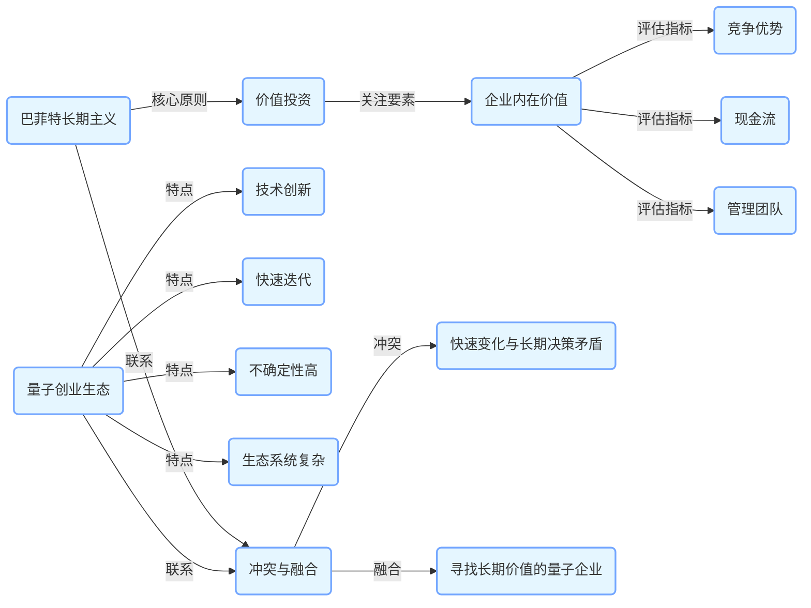

# 巴菲特的长期主义在快速迭代的量子创业生态中的调整

> 关键词：巴菲特长期主义、量子创业生态、快速迭代、投资策略调整、价值投资

> 摘要：本文深入探讨了巴菲特所秉持的长期主义投资理念在快速迭代的量子创业生态中的调整问题。在量子创业生态下，技术革新迅速、市场环境复杂多变，传统的长期主义面临诸多挑战。文章首先介绍了研究的背景、目的、预期读者和文档结构，明确了相关术语。接着阐述了长期主义和量子创业生态的核心概念及其联系，分析了核心算法原理和操作步骤。通过数学模型和公式进一步说明长期主义在新生态下的变化，并结合实际案例进行详细解读。同时，探讨了长期主义在量子创业生态中的实际应用场景，推荐了相关的学习资源、开发工具和论文著作。最后总结了未来发展趋势与挑战，解答了常见问题，并提供了扩展阅读和参考资料，旨在为投资者和创业者在新生态下的决策提供有益的参考。

## 1. 背景介绍 
### 1.1 目的和范围
在当今科技飞速发展的时代，量子创业生态正以前所未有的速度快速迭代。量子技术的兴起为创业领域带来了新的机遇和挑战，市场环境变得更加复杂和不确定。巴菲特的长期主义投资理念以其稳健和成功而闻名于世，但在这种快速变化的量子创业生态中，其适用性需要重新审视和调整。本文的目的在于深入分析长期主义在量子创业生态中的现状，探讨如何对其进行合理调整，以适应新的市场环境，为投资者和创业者提供有价值的指导。研究范围涵盖了量子创业生态的特点、长期主义的核心原则、两者之间的冲突与融合，以及具体的调整策略和实际应用案例等方面。

### 1.2 预期读者
本文预期读者包括对投资领域感兴趣的个人投资者、专业投资机构的从业者、量子创业企业的创业者和管理者、学术研究人员以及关注科技与金融交叉领域发展的人士。对于个人投资者来说，了解长期主义在量子创业生态中的调整有助于优化自己的投资组合，降低投资风险；专业投资机构从业者可以从中获取新的投资思路和策略，提升机构的投资绩效；量子创业企业的创业者和管理者能够更好地理解投资者的需求和市场的变化，为企业的发展制定更合理的战略；学术研究人员可以将本文作为研究该领域的参考资料，进一步深入探讨相关理论和实践问题；关注科技与金融交叉领域发展的人士则可以通过本文了解行业的最新动态和发展趋势。

### 1.3 文档结构概述
本文共分为十个部分。第一部分为背景介绍，阐述了研究的目的、范围、预期读者和文档结构，同时给出了相关术语的定义和解释。第二部分介绍了长期主义和量子创业生态的核心概念，分析了它们之间的联系，并通过文本示意图和 Mermaid 流程图进行直观展示。第三部分讲解了核心算法原理和具体操作步骤，通过 Python 源代码详细阐述了相关算法。第四部分运用数学模型和公式对长期主义在量子创业生态中的调整进行了深入分析，并结合实际例子进行说明。第五部分通过项目实战，介绍了开发环境搭建、源代码实现和代码解读，展示了长期主义在实际项目中的应用。第六部分探讨了长期主义在量子创业生态中的实际应用场景。第七部分推荐了相关的学习资源、开发工具框架和论文著作。第八部分总结了未来发展趋势与挑战。第九部分为附录，解答了常见问题。第十部分提供了扩展阅读和参考资料。

### 1.4 术语表
#### 1.4.1 核心术语定义
- **巴菲特的长期主义**：指由沃伦·巴菲特所倡导的一种投资理念，强调通过深入研究和分析，选择具有长期竞争优势和稳定现金流的企业进行投资，并长期持有其股票，忽略短期市场波动，以获取长期的资本增值。
- **量子创业生态**：是以量子技术为核心驱动力，涵盖量子计算、量子通信、量子传感等领域的创业环境。在这个生态中，创业企业围绕量子技术进行研发、创新和商业化，同时与政府、科研机构、投资机构等各方形成相互关联、相互影响的生态系统。
- **快速迭代**：在量子创业生态中，快速迭代是指创业企业为了适应技术的快速发展和市场的变化，不断对产品、服务和商业模式进行快速更新和改进的过程。这种迭代通常具有周期短、频率高、创新性强等特点。

#### 1.4.2 相关概念解释
- **价值投资**：价值投资是一种投资策略，它的核心是寻找那些被市场低估的资产，通过对企业的基本面进行分析，评估其内在价值，并在价格低于内在价值时买入，等待价格回归价值或企业价值增长，从而获得投资回报。巴菲特的长期主义是价值投资的一种具体实践形式。
- **量子技术**：量子技术是基于量子力学原理发展起来的一系列前沿技术，包括量子计算、量子通信和量子传感等。量子计算具有强大的计算能力，能够解决传统计算机难以处理的复杂问题；量子通信具有高度的安全性，能够实现信息的安全传输；量子传感则具有高精度、高灵敏度等特点，可应用于多个领域。

#### 1.4.3 缩略词列表
- **QC**：Quantum Computing，量子计算
- **QKD**：Quantum Key Distribution，量子密钥分发
- **VC**：Venture Capital，风险投资

## 2. 核心概念与联系 

### 2.1 巴菲特长期主义的核心原理
巴菲特的长期主义基于价值投资的理念，其核心原理在于对企业内在价值的深入分析和评估。他认为，股票的价格会受到市场短期波动的影响，但从长期来看，股票价格会回归其内在价值。因此，投资者应该关注企业的基本面，寻找那些具有长期竞争优势、稳定现金流和良好管理团队的企业。通过长期持有这些企业的股票，投资者可以分享企业成长带来的收益。

例如，巴菲特投资可口可乐公司，就是因为他看到了可口可乐在全球饮料市场的强大品牌影响力、广泛的销售渠道和稳定的盈利能力。尽管市场可能会出现短期的波动，但从长期来看，可口可乐的价值会不断增长，投资者也能获得丰厚的回报。

### 2.2 量子创业生态的特点
量子创业生态具有以下几个显著特点：
- **技术创新性强**：量子技术是当今科技领域的前沿技术，具有高度的创新性和颠覆性。量子创业企业需要不断投入大量的研发资源，推动技术的突破和创新。
- **发展速度快**：由于量子技术的快速发展，量子创业生态也呈现出快速迭代的特点。新的技术和产品不断涌现，市场竞争激烈，企业需要快速响应市场变化，不断调整战略。
- **不确定性高**：量子技术仍处于发展阶段，许多技术和应用还存在不确定性。量子创业企业面临着技术风险、市场风险和政策风险等多种风险，投资决策难度较大。
- **生态系统复杂**：量子创业生态涉及到政府、科研机构、投资机构、企业等多个主体，各主体之间相互关联、相互影响。一个完善的量子创业生态需要各主体之间的协同合作，共同推动量子技术的发展和商业化。

### 2.3 核心概念联系的文本示意图
```plaintext
巴菲特长期主义 <----> 量子创业生态
|                      |
| 价值评估             | 技术创新
| 长期持有             | 快速迭代
| 稳定现金流企业       | 高不确定性企业
|                      |
| 冲突：快速变化与长期决策矛盾
| 融合：寻找长期价值的量子企业
```

### 2.4 Mermaid 流程图


从上述流程图和文本示意图可以看出，巴菲特的长期主义强调对企业内在价值的长期关注和稳定持有，而量子创业生态则以技术创新和快速迭代为主要特点，两者之间存在一定的冲突。然而，在量子创业生态中，也存在一些具有长期价值的企业，通过合理调整长期主义的投资策略，投资者可以在这个生态中寻找新的投资机会，实现两者的融合。

## 3. 核心算法原理 & 具体操作步骤 

### 3.1 传统长期主义投资评估算法
在传统的长期主义投资中，评估企业价值通常采用现金流折现模型（DCF）。该模型的核心思想是将企业未来的现金流折现到当前，以评估企业的内在价值。具体公式如下：

$$V = \sum_{t=1}^{n} \frac{CF_t}{(1 + r)^t} + \frac{TV}{(1 + r)^n}$$

其中，$V$ 表示企业的内在价值，$CF_t$ 表示第 $t$ 期的现金流，$r$ 表示折现率，$n$ 表示预测期数，$TV$ 表示终值。

下面是使用 Python 实现现金流折现模型的代码示例：

```python
def dcf_valuation(cash_flows, discount_rate, terminal_value):
    """
    现金流折现模型计算企业内在价值
    :param cash_flows: 未来各期现金流列表
    :param discount_rate: 折现率
    :param terminal_value: 终值
    :return: 企业内在价值
    """
    n = len(cash_flows)
    present_value = 0
    for t in range(n):
        present_value += cash_flows[t] / ((1 + discount_rate) ** (t + 1))
    present_value += terminal_value / ((1 + discount_rate) ** n)
    return present_value

# 示例数据
cash_flows = [100, 120, 150, 180, 200]
discount_rate = 0.1
terminal_value = 1000

# 计算企业内在价值
value = dcf_valuation(cash_flows, discount_rate, terminal_value)
print(f"企业内在价值: {value}")
```

### 3.2 在量子创业生态中的调整算法
在量子创业生态中，由于企业的不确定性较高，传统的现金流折现模型可能无法准确评估企业的价值。因此，需要对评估算法进行调整。一种可行的方法是引入实物期权的概念。实物期权是指企业在投资决策中所拥有的选择权，例如扩张期权、放弃期权等。通过考虑实物期权的价值，可以更全面地评估量子创业企业的价值。

实物期权定价通常采用二叉树模型或布莱克 - 斯科尔斯模型。这里以二叉树模型为例，简要介绍其原理和 Python 实现。

二叉树模型的基本思想是将时间划分为若干个阶段，每个阶段资产价格有两种可能的变化：上涨或下跌。通过递归计算每个节点的期权价值，最终得到期权的当前价值。

以下是使用 Python 实现二叉树模型计算实物期权价值的代码示例：

```python
import math

def binomial_option_pricing(S, K, r, T, sigma, n, option_type):
    """
    二叉树模型计算实物期权价值
    :param S: 标的资产当前价格
    :param K: 期权执行价格
    :param r: 无风险利率
    :param T: 期权到期时间
    :param sigma: 标的资产波动率
    :param n: 时间步数
    :param option_type: 期权类型，'call' 或 'put'
    :return: 期权价值
    """
    dt = T / n
    u = math.exp(sigma * math.sqrt(dt))
    d = 1 / u
    p = (math.exp(r * dt) - d) / (u - d)

    # 构建二叉树
    stock_tree = [[0 for _ in range(i + 1)] for i in range(n + 1)]
    option_tree = [[0 for _ in range(i + 1)] for i in range(n + 1)]

    # 计算股票价格二叉树
    for i in range(n + 1):
        for j in range(i + 1):
            stock_tree[i][j] = S * (u ** j) * (d ** (i - j))

    # 计算期权到期时的价值
    for j in range(n + 1):
        if option_type == 'call':
            option_tree[n][j] = max(stock_tree[n][j] - K, 0)
        elif option_type == 'put':
            option_tree[n][j] = max(K - stock_tree[n][j], 0)

    # 反向递推计算期权价值
    for i in range(n - 1, -1, -1):
        for j in range(i + 1):
            option_tree[i][j] = math.exp(-r * dt) * (p * option_tree[i + 1][j + 1] + (1 - p) * option_tree[i + 1][j])

    return option_tree[0][0]

# 示例数据
S = 100  # 标的资产当前价格
K = 110  # 期权执行价格
r = 0.05  # 无风险利率
T = 1  # 期权到期时间
sigma = 0.2  # 标的资产波动率
n = 100  # 时间步数
option_type = 'call'  # 期权类型

# 计算期权价值
option_value = binomial_option_pricing(S, K, r, T, sigma, n, option_type)
print(f"实物期权价值: {option_value}")
```

### 3.3 具体操作步骤
1. **收集信息**：在量子创业生态中，投资者需要收集更多关于企业技术创新能力、市场前景、团队背景等方面的信息。例如，了解企业在量子技术领域的专利数量、研发进展、与科研机构的合作情况等。
2. **初步筛选**：根据收集到的信息，对量子创业企业进行初步筛选。可以设定一些基本的筛选标准，如企业的技术创新性、市场潜力、管理团队的经验等。
3. **价值评估**：运用调整后的评估算法，如引入实物期权的现金流折现模型，对筛选后的企业进行价值评估。在评估过程中，要充分考虑企业的不确定性和期权价值。
4. **风险评估**：对企业面临的各种风险进行评估，包括技术风险、市场风险、政策风险等。可以采用风险矩阵等方法，对风险进行量化和排序。
5. **投资决策**：根据价值评估和风险评估的结果，做出投资决策。如果企业的内在价值大于市场价格，且风险在可承受范围内，则可以考虑投资。同时，要根据企业的发展阶段和市场情况，合理确定投资金额和投资期限。

## 4. 数学模型和公式 & 详细讲解 & 举例说明 

### 4.1 传统长期主义的数学模型
#### 4.1.1 现金流折现模型（DCF）
如前所述，现金流折现模型的公式为：

$$V = \sum_{t=1}^{n} \frac{CF_t}{(1 + r)^t} + \frac{TV}{(1 + r)^n}$$

详细讲解：
- $CF_t$ 表示第 $t$ 期的现金流，它反映了企业在该时期内的经营活动所产生的现金流入和流出的净额。现金流是企业价值的重要来源，因为它直接关系到企业的生存和发展能力。
- $r$ 表示折现率，它是投资者要求的必要收益率。折现率的确定需要考虑多种因素，如市场利率、企业的风险水平等。一般来说，风险越高的企业，折现率也越高。
- $n$ 表示预测期数，它是投资者对企业未来现金流进行预测的时间范围。预测期数的选择需要根据企业的实际情况和行业特点来确定。
- $TV$ 表示终值，它是预测期结束后企业的价值。终值的计算通常采用永续增长模型，即假设企业在预测期结束后以一个固定的增长率持续增长。

举例说明：
假设一家传统制造业企业，预计未来 5 年的现金流分别为 100 万元、120 万元、150 万元、180 万元和 200 万元，折现率为 10%，预测期结束后企业的终值为 1000 万元。则该企业的内在价值为：

$$V = \frac{100}{(1 + 0.1)^1} + \frac{120}{(1 + 0.1)^2} + \frac{150}{(1 + 0.1)^3} + \frac{180}{(1 + 0.1)^4} + \frac{200}{(1 + 0.1)^5} + \frac{1000}{(1 + 0.1)^5}$$

```python
import math

cash_flows = [100, 120, 150, 180, 200]
discount_rate = 0.1
terminal_value = 1000
n = len(cash_flows)

present_value = 0
for t in range(n):
    present_value += cash_flows[t] / ((1 + discount_rate) ** (t + 1))
present_value += terminal_value / ((1 + discount_rate) ** n)

print(f"企业内在价值: {present_value}")
```

### 4.2 在量子创业生态中的调整模型
#### 4.2.1 引入实物期权的现金流折现模型
在量子创业生态中，由于企业的不确定性较高，传统的现金流折现模型可能无法准确评估企业的价值。因此，可以引入实物期权的概念，对传统模型进行调整。调整后的模型可以表示为：

$$V_{total} = V_{DCF} + V_{option}$$

其中，$V_{total}$ 表示企业的总价值，$V_{DCF}$ 表示使用传统现金流折现模型计算的企业价值，$V_{option}$ 表示企业所拥有的实物期权的价值。

详细讲解：
- $V_{DCF}$ 的计算方法与传统现金流折现模型相同，它反映了企业在正常经营情况下的内在价值。
- $V_{option}$ 表示企业所拥有的实物期权的价值，如扩张期权、放弃期权等。实物期权的价值可以通过二叉树模型、布莱克 - 斯科尔斯模型等方法进行计算。

举例说明：
假设一家量子创业企业，使用传统现金流折现模型计算的企业价值为 500 万元。同时，该企业拥有一个扩张期权，通过二叉树模型计算该期权的价值为 100 万元。则该企业的总价值为：

$$V_{total} = 500 + 100 = 600$$（万元）

### 4.3 风险评估模型
在量子创业生态中，风险评估是投资决策的重要环节。一种常用的风险评估模型是风险矩阵模型。风险矩阵模型通过对风险的发生概率和影响程度进行评估，将风险分为不同的等级。

风险矩阵的计算公式为：

$$Risk = Probability \times Impact$$

其中，$Risk$ 表示风险等级，$Probability$ 表示风险发生的概率，$Impact$ 表示风险发生时对企业造成的影响程度。

详细讲解：
- $Probability$ 通常用百分比表示，它反映了风险发生的可能性大小。可以通过历史数据、专家判断等方法来确定风险发生的概率。
- $Impact$ 可以用数值或等级来表示，它反映了风险发生时对企业的财务状况、市场份额、声誉等方面造成的影响程度。

举例说明：
假设一家量子创业企业面临技术研发失败的风险，经评估该风险发生的概率为 30%，一旦发生将对企业造成严重的财务损失，影响程度评分为 8 分（满分 10 分）。则该风险的等级为：

$$Risk = 0.3 \times 8 = 2.4$$

根据风险矩阵的划分标准，可以将该风险划分为中等风险等级。企业可以根据风险等级采取相应的风险应对措施，如加强技术研发管理、寻求合作等。

## 5. 项目实战：代码实际案例和详细解释说明 

### 5.1  开发环境搭建
在进行量子创业生态相关的投资分析项目实战时，我们可以使用 Python 作为开发语言。以下是搭建开发环境的具体步骤：

#### 5.1.1 安装 Python
首先，从 Python 官方网站（https://www.python.org/downloads/）下载并安装适合你操作系统的 Python 版本。建议安装 Python 3.7 及以上版本，因为这些版本支持更多的新特性和库。

#### 5.1.2 安装必要的库
在项目中，我们需要使用一些 Python 库来进行数据处理、数学计算和可视化等操作。可以使用以下命令来安装这些库：

```sh
pip install numpy pandas matplotlib scipy
```

- `numpy`：用于进行高效的数值计算和数组操作。
- `pandas`：用于数据处理和分析，提供了方便的数据结构和数据操作方法。
- `matplotlib`：用于数据可视化，能够绘制各种类型的图表。
- `scipy`：提供了许多科学计算和统计分析的工具。

#### 5.1.3 选择开发工具
可以选择使用 Jupyter Notebook 或 PyCharm 等开发工具。Jupyter Notebook 是一个交互式的开发环境，适合进行数据分析和模型验证；PyCharm 是一个功能强大的 Python 集成开发环境，适合进行大型项目的开发。

### 5.2  源代码详细实现和代码解读
#### 5.2.1 数据收集与预处理
假设我们要对一家量子创业企业的财务数据进行分析，首先需要收集相关数据，并进行预处理。以下是一个简单的示例代码：

```python
import pandas as pd

# 模拟收集到的企业财务数据
data = {
    'Year': [2018, 2019, 2020, 2021, 2022],
    'Revenue': [100, 120, 150, 180, 200],
    'Cost': [80, 90, 100, 110, 120]
}

df = pd.DataFrame(data)

# 计算利润
df['Profit'] = df['Revenue'] - df['Cost']

print(df)
```

代码解读：
- 首先，我们使用 `pandas` 库创建了一个包含企业年度收入和成本的数据框。
- 然后，通过简单的计算，我们在数据框中添加了一个新的列 `Profit`，用于记录每年的利润。
- 最后，打印出处理后的数据框。

#### 5.2.2 价值评估模型实现
接下来，我们实现一个简单的现金流折现模型来评估企业的价值。

```python
import numpy as np

def dcf_valuation(cash_flows, discount_rate, terminal_value):
    """
    现金流折现模型计算企业内在价值
    :param cash_flows: 未来各期现金流列表
    :param discount_rate: 折现率
    :param terminal_value: 终值
    :return: 企业内在价值
    """
    n = len(cash_flows)
    present_value = 0
    for t in range(n):
        present_value += cash_flows[t] / ((1 + discount_rate) ** (t + 1))
    present_value += terminal_value / ((1 + discount_rate) ** n)
    return present_value

# 假设未来 5 年的现金流
cash_flows = df['Profit'].tolist()
discount_rate = 0.1
terminal_value = 1000

# 计算企业内在价值
value = dcf_valuation(cash_flows, discount_rate, terminal_value)
print(f"企业内在价值: {value}")
```

代码解读：
- 定义了一个 `dcf_valuation` 函数，用于实现现金流折现模型的计算。
- 将之前计算得到的企业利润作为未来各期的现金流。
- 设定折现率为 10%，终值为 1000 万元。
- 调用 `dcf_valuation` 函数计算企业的内在价值，并打印结果。

#### 5.2.3 风险评估模型实现
我们可以实现一个简单的风险矩阵模型来评估企业面临的风险。

```python
def risk_matrix(probability, impact):
    """
    风险矩阵模型计算风险等级
    :param probability: 风险发生的概率
    :param impact: 风险发生时的影响程度
    :return: 风险等级
    """
    return probability * impact

# 假设技术研发失败的风险概率为 30%，影响程度评分为 8 分
probability = 0.3
impact = 8

# 计算风险等级
risk = risk_matrix(probability, impact)
print(f"风险等级: {risk}")
```

代码解读：
- 定义了一个 `risk_matrix` 函数，用于实现风险矩阵模型的计算。
- 设定技术研发失败的风险概率为 30%，影响程度评分为 8 分。
- 调用 `risk_matrix` 函数计算风险等级，并打印结果。

### 5.3  代码解读与分析
#### 5.3.1 数据收集与预处理部分
通过使用 `pandas` 库，我们可以方便地收集和处理企业的财务数据。数据预处理是数据分析的重要步骤，它可以帮助我们清洗数据、提取有用信息，并为后续的分析和建模做好准备。在这个示例中，我们通过简单的计算得到了企业每年的利润，这是评估企业价值的重要指标之一。

#### 5.3.2 价值评估模型部分
现金流折现模型是一种常用的企业价值评估方法，它通过将企业未来的现金流折现到当前，来评估企业的内在价值。在实际应用中，现金流和折现率的估计是关键环节，需要综合考虑企业的经营状况、市场环境和行业特点等因素。在这个示例中，我们假设了未来 5 年的现金流和终值，并设定了一个固定的折现率，通过调用 `dcf_valuation` 函数计算出了企业的内在价值。

#### 5.3.3 风险评估模型部分
风险矩阵模型是一种简单而有效的风险评估方法，它通过对风险的发生概率和影响程度进行评估，将风险分为不同的等级。在量子创业生态中，风险评估尤为重要，因为企业面临着技术创新、市场竞争和政策变化等多种不确定性。在这个示例中，我们假设了技术研发失败的风险概率和影响程度，通过调用 `risk_matrix` 函数计算出了该风险的等级，企业可以根据这个等级采取相应的风险应对措施。

## 6. 实际应用场景 
### 6.1 投资决策
在量子创业生态中，投资者面临着众多的投资机会，但同时也伴随着较高的风险。巴菲特的长期主义投资理念在经过调整后，可以为投资者提供一种有效的投资决策方法。

投资者可以运用调整后的价值评估模型，如引入实物期权的现金流折现模型，对量子创业企业进行全面的价值评估。在评估过程中，充分考虑企业的技术创新能力、市场前景和潜在的期权价值。例如，一家量子计算创业企业虽然目前可能还没有实现盈利，但它拥有一项具有突破性的量子算法专利，并且与多家科研机构和企业建立了合作关系。通过评估，投资者发现该企业具有较大的潜在增长空间和期权价值，那么即使短期内企业的财务指标不理想，投资者也可以根据长期主义的理念，考虑对其进行投资。

同时，投资者还可以运用风险评估模型，对企业面临的各种风险进行量化和分析。根据风险等级，合理调整投资组合，降低投资风险。例如，对于风险等级较高的量子创业企业，投资者可以适当减少投资金额，或者与其他投资者联合投资，分散风险。

### 6.2 企业战略规划
对于量子创业企业来说，长期主义的理念也可以为企业的战略规划提供指导。企业在制定战略时，不仅要关注短期的市场表现，更要着眼于长期的技术创新和价值创造。

企业可以通过深入分析自身的技术优势和市场定位，确定长期的发展目标和战略方向。例如，一家量子通信创业企业可以将目标设定为在未来 5 - 10 年内成为全球领先的量子通信解决方案提供商。为了实现这个目标，企业需要加大研发投入，不断提升自身的技术水平，拓展市场份额。

在战略实施过程中，企业要保持战略的稳定性和灵活性。一方面，要坚持长期的发展目标，避免因短期市场波动而轻易改变战略；另一方面，要根据市场环境的变化和技术的发展，及时调整战略，以适应新的挑战和机遇。例如，当市场上出现新的竞争对手或技术突破时，企业要及时评估其对自身的影响，并调整研发和市场策略。

### 6.3 行业生态建设
长期主义在量子创业生态的行业生态建设中也具有重要作用。政府、科研机构、投资机构和企业等各方可以共同合作，营造一个有利于量子技术创新和创业的生态环境。

政府可以制定长期的产业政策，加大对量子技术研发和创业的支持力度。例如，提供科研资金、税收优惠和政策引导等，鼓励企业和科研机构开展量子技术研究和创新。科研机构可以加强与企业的合作，将科研成果转化为实际应用，推动量子技术的商业化进程。投资机构可以秉持长期主义的理念，对量子创业企业进行长期投资，为企业提供资金支持和战略指导。

企业之间也可以加强合作与交流，形成产业联盟和创新生态。例如，量子计算企业可以与量子通信企业合作，共同开发量子信息技术解决方案，实现优势互补和协同发展。通过各方的共同努力，可以促进量子创业生态的健康发展，推动量子技术在各个领域的广泛应用。

## 7. 工具和资源推荐
### 7.1 学习资源推荐
#### 7.1.1 书籍推荐
- 《巴菲特致股东的信：股份公司教程》：这本书收录了巴菲特历年致股东的信，详细阐述了他的投资理念、方法和策略，是学习巴菲特长期主义投资思想的经典读物。
- 《聪明的投资者》：作者本杰明·格雷厄姆是价值投资理论的奠基人，这本书是价值投资领域的经典之作，对巴菲特的投资理念产生了深远影响。通过阅读这本书，读者可以深入了解价值投资的基本原理和方法。
- 《量子计算：从基础到应用》：全面介绍了量子计算的基本原理、算法和应用领域，适合对量子技术感兴趣的读者阅读，帮助读者了解量子创业生态的技术基础。

#### 7.1.2 在线课程
- Coursera 上的“Quantum Computing for Everyone”：这是一门面向大众的量子计算入门课程，由知名高校的教授授课，通过生动形象的讲解和案例分析，让学员了解量子计算的基本概念和应用前景。
- edX 上的“Value Investing: From Graham to Buffett and Beyond”：该课程系统地介绍了价值投资的理论和实践，从格雷厄姆的经典价值投资理论到巴菲特的长期主义投资策略，帮助学员掌握价值投资的核心要点。
- Udemy 上的“Startup Investing: How to Find, Evaluate, and Invest in Startups”：课程主要讲解了如何进行创业投资，包括项目筛选、价值评估、风险控制等方面的内容，对在量子创业生态中进行投资的学员具有一定的指导意义。

#### 7.1.3 技术博客和网站
- Quantum Computing Report：专注于量子计算领域的新闻、技术和市场动态，提供了大量关于量子计算企业、研究机构和行业发展的信息，是了解量子创业生态的重要渠道。
- Seeking Alpha：一个投资研究和分析平台，汇集了众多投资者和分析师的观点和研究报告。在该平台上可以找到关于量子创业企业的投资分析和评论，为投资者提供参考。
- Medium 上的一些科技和投资类博客：如 Towards Data Science、TechCrunch 等，经常发布关于量子技术、创业投资等方面的文章，内容丰富多样，具有一定的参考价值。

### 7.2 开发工具框架推荐
#### 7.2.1 IDE和编辑器
- PyCharm：是一款功能强大的 Python 集成开发环境，提供了代码编辑、调试、版本控制等一系列功能，适合进行量子创业生态相关的数据分析和模型开发。
- Jupyter Notebook：是一个交互式的开发环境，支持多种编程语言，尤其适合进行数据探索、模型验证和可视化展示。在量子创业生态的项目实战中，Jupyter Notebook 可以方便地记录和分享代码和分析过程。
- Visual Studio Code：是一款轻量级的代码编辑器，具有丰富的插件生态系统。通过安装 Python 相关的插件，可以实现代码编辑、调试和版本控制等功能，是开发者的常用工具之一。

#### 7.2.2 调试和性能分析工具
- PDB：Python 自带的调试器，可以帮助开发者在代码运行过程中进行调试，定位和解决问题。通过设置断点、查看变量值等操作，开发者可以深入了解代码的执行过程。
- cProfile：Python 标准库中的性能分析工具，可以分析代码的运行时间和函数调用情况。通过使用 cProfile，开发者可以找出代码中的性能瓶颈，进行优化和改进。
- Py-Spy：是一个轻量级的 Python 性能分析工具，可以实时监测 Python 程序的运行状态，提供函数调用栈和 CPU 使用率等信息。它可以帮助开发者快速定位性能问题，提高代码的运行效率。

#### 7.2.3 相关框架和库
- Qiskit：是 IBM 开发的一个开源量子计算框架，提供了量子算法、量子电路设计和模拟等功能。通过使用 Qiskit，开发者可以方便地进行量子计算实验和应用开发。
- PennyLane：是一个跨平台的量子机器学习库，支持多种量子计算硬件和模拟器。它可以帮助开发者将量子计算与机器学习相结合，开发出更强大的算法和模型。
- Scikit-learn：是一个常用的机器学习库，提供了丰富的机器学习算法和工具。在量子创业生态的数据分析和模型开发中，Scikit-learn 可以用于数据预处理、模型选择和评估等任务。

### 7.3 相关论文著作推荐
#### 7.3.1 经典论文
- “Quantum Computation and Quantum Information” by Michael A. Nielsen and Isaac L. Chuang：这是量子计算领域的经典教材，系统地介绍了量子计算的基本原理、算法和应用。它对量子计算的发展产生了深远影响，是研究量子技术的必读文献。
- “The Intelligent Investor” by Benjamin Graham：虽然这是一本著作，但其中包含了许多经典的价值投资理论和方法。该著作中的一些论文和章节对巴菲特的长期主义投资理念产生了重要影响，是价值投资领域的经典之作。
- “A Theory of the Term Structure of Interest Rates” by John C. Cox, Jonathan E. Ingersoll, Jr., and Stephen A. Ross：该论文提出了著名的 Cox - Ingersoll - Ross 模型，用于描述利率的期限结构。在量子创业生态的投资分析中，利率模型是一个重要的研究领域，该论文为相关研究提供了重要的理论基础。

#### 7.3.2 最新研究成果
- 关注 arXiv 上的量子计算和投资领域的最新论文。arXiv 是一个开放获取的预印本平台，许多科研人员会在上面发布他们的最新研究成果。通过关注该平台上的相关论文，可以及时了解量子技术和投资领域的最新动态和研究进展。
- 国际知名学术期刊如 Nature、Science、Physical Review Letters 等经常发表关于量子技术的最新研究成果。这些论文通常代表了该领域的前沿水平，对了解量子创业生态的技术发展具有重要意义。

#### 7.3.3 应用案例分析
- 一些行业报告和研究机构会发布关于量子创业企业的应用案例分析报告。例如，麦肯锡、波士顿咨询集团等咨询公司会对量子技术在金融、医疗、能源等领域的应用案例进行深入分析，为投资者和创业者提供实际的参考和借鉴。
- 企业的官方网站和年报也会介绍自身的发展历程、技术创新和市场应用情况。通过研究这些企业的案例，可以了解量子创业企业在实际运营中的经验和挑战，为自己的投资和创业决策提供参考。

## 8. 总结：未来发展趋势与挑战
### 8.1 未来发展趋势
#### 8.1.1 技术融合加速
未来，量子技术将与人工智能、大数据、区块链等技术加速融合。例如，量子计算可以为人工智能提供更强大的计算能力，加速机器学习算法的训练和优化；量子通信可以为区块链提供更高的安全性，保障数据的隐私和完整性。这种技术融合将为量子创业生态带来更多的创新机会和应用场景，推动量子技术在各个领域的广泛应用。

#### 8.1.2 市场规模扩大
随着量子技术的不断发展和应用，量子创业生态的市场规模将逐渐扩大。量子计算、量子通信和量子传感等领域的市场需求将不断增加，吸引更多的企业和投资者进入该领域。同时，政府也将加大对量子技术产业的支持力度，推动产业的快速发展。预计未来几年，量子创业生态的市场规模将呈现快速增长的趋势。

#### 8.1.3 投资策略多元化
在快速迭代的量子创业生态中，传统的投资策略将面临挑战，投资者需要不断调整和创新投资策略。未来，投资策略将更加多元化，除了传统的股权融资和风险投资外，还将出现更多的创新投资模式，如量子技术专项基金、产业投资联盟等。同时，投资者将更加注重企业的技术创新能力、团队背景和市场前景，而不仅仅关注财务指标。

### 8.2 挑战
#### 8.2.1 技术风险
量子技术仍处于发展阶段，许多技术和应用还存在不确定性。例如，量子计算的硬件实现面临着量子比特的稳定性、纠错能力等技术难题；量子通信的实际应用还面临着成本高、传输距离有限等问题。这些技术风险给量子创业企业的研发和商业化带来了巨大的挑战，也增加了投资者的投资风险。

#### 8.2.2 市场竞争激烈
随着量子创业生态的市场规模不断扩大，越来越多的企业将进入该领域，市场竞争将日益激烈。量子创业企业需要在技术创新、产品质量、市场推广等方面不断提升自身的竞争力，才能在市场中立足。同时，市场竞争也将导致企业的盈利空间受到挤压，增加了企业的生存压力。

#### 8.2.3 人才短缺
量子技术是一门交叉学科，需要具备量子物理、计算机科学、数学等多学科知识的专业人才。目前，全球范围内量子技术领域的专业人才短缺，这给量子创业企业的发展带来了很大的限制。企业需要投入大量的资源来吸引和培养人才，同时政府和高校也需要加强相关学科的建设和人才培养，以满足市场对量子技术人才的需求。

### 8.3 应对策略
#### 8.3.1 加强技术研发合作
量子创业企业可以加强与科研机构、高校和其他企业的合作，共同开展技术研发。通过合作，可以整合各方的资源和优势，加速技术的突破和创新。例如，企业可以与科研机构合作开展量子计算算法的研究，与高校合作培养量子技术专业人才。

#### 8.3.2 优化市场竞争策略
量子创业企业需要深入了解市场需求和竞争态势，制定差异化的市场竞争策略。企业可以通过提供高质量的产品和服务、加强品牌建设、拓展市场渠道等方式，提升自身的市场竞争力。同时，企业还可以通过并购、重组等方式，整合行业资源，扩大市场份额。

#### 8.3.3 加大人才培养力度
政府、高校和企业可以共同合作，加大对量子技术人才的培养力度。政府可以出台相关政策，鼓励高校开设量子技术相关专业，提供奖学金和科研经费支持；高校可以加强与企业的合作，开展产学研联合培养，为学生提供实践机会；企业可以建立人才培养体系，通过内部培训、外部引进等方式，吸引和培养优秀的量子技术人才。

## 9. 附录：常见问题与解答
### 9.1 巴菲特的长期主义在量子创业生态中是否仍然适用？
巴菲特的长期主义在量子创业生态中仍然具有一定的适用性，但需要进行适当的调整。传统的长期主义强调对企业内在价值的长期关注和稳定持有，但在量子创业生态中，由于技术革新迅速、市场环境复杂多变，企业的不确定性较高。因此，投资者需要更加注重企业的技术创新能力、市场前景和潜在的期权价值，同时要合理评估企业面临的风险，灵活调整投资策略。

### 9.2 如何评估量子创业企业的价值？
评估量子创业企业的价值可以采用调整后的价值评估模型，如引入实物期权的现金流折现模型。在评估过程中，需要收集企业的技术创新能力、市场前景、团队背景等方面的信息，充分考虑企业的不确定性和期权价值。同时，还可以运用风险评估模型，对企业面临的各种风险进行量化和分析，综合评估企业的价值。

### 9.3 量子创业企业面临哪些风险？
量子创业企业面临多种风险，主要包括技术风险、市场风险和政策风险等。技术风险方面，量子技术仍处于发展阶段，许多技术和应用还存在不确定性，如量子计算的硬件实现难题、量子通信的成本和传输距离问题等。市场风险方面，随着量子创业生态的市场规模不断扩大，市场竞争将日益激烈，企业需要在技术创新、产品质量、市场推广等方面不断提升自身的竞争力。政策风险方面，政府的相关政策和法规可能会对量子创业企业的发展产生影响，如科研资金支持、税收优惠政策等。

### 9.4 如何在量子创业生态中进行投资决策？
在量子创业生态中进行投资决策，需要综合考虑多个因素。首先，要对量子创业企业进行全面的价值评估，运用调整后的评估模型，评估企业的内在价值和潜在的期权价值。其次，要对企业面临的各种风险进行评估，运用风险评估模型，量化和分析风险等级。最后，根据价值评估和风险评估的结果，做出投资决策。同时，要根据企业的发展阶段和市场情况，合理确定投资金额和投资期限，分散投资风险。

## 10. 扩展阅读 & 参考资料
### 10.1 扩展阅读
- 《量子力学：概念与应用》：深入介绍了量子力学的基本概念和应用，对于理解量子技术的原理具有重要帮助。
- 《创业投资与私募股权投资》：系统地阐述了创业投资和私募股权投资的理论和实践，为在量子创业生态中进行投资提供了更全面的知识体系。
- 《创新者的窘境》：探讨了企业在创新过程中面临的挑战和机遇，对于量子创业企业的战略规划和创新管理具有一定的启示作用。

### 10.2 参考资料
- 巴菲特历年致股东的信，可从伯克希尔·哈撒韦公司官方网站获取。
- 量子计算领域的相关研究报告和学术论文，可从 arXiv、IEEE Xplore 等学术平台获取。
- 量子创业企业的官方网站和年报，可了解企业的发展历程、技术创新和市场应用情况。

作者：AI天才研究院/AI Genius Institute & 禅与计算机程序设计艺术 /Zen And The Art of Computer Programming