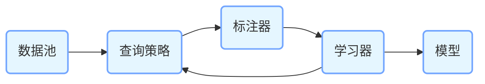

# 开发AI Agent的主动学习能力：优化学习效率

> 关键词：AI Agent、主动学习能力、学习效率优化、核心算法、实际应用场景

> 摘要：本文聚焦于开发AI Agent的主动学习能力以优化学习效率这一主题。首先介绍了相关背景，包括目的、预期读者等内容。接着详细阐述了核心概念与联系，分析了核心算法原理并给出Python代码示例，讲解了数学模型和公式。通过项目实战展示代码实现和解读，探讨了实际应用场景。同时推荐了相关工具和资源，最后总结了未来发展趋势与挑战，还设置了常见问题解答和扩展阅读参考资料，旨在为读者全面深入地介绍开发AI Agent主动学习能力的相关知识和技术。

## 1. 背景介绍 
### 1.1 目的和范围
随着人工智能技术的飞速发展，AI Agent在各个领域的应用越来越广泛。然而，传统的AI Agent学习方式往往依赖于大量的标注数据，学习效率较低且成本较高。开发AI Agent的主动学习能力，能够让其主动选择最有价值的数据进行学习，从而优化学习效率，减少对大量标注数据的依赖。本文的范围涵盖了AI Agent主动学习能力的核心概念、算法原理、数学模型、项目实战、实际应用场景以及相关工具资源等方面，旨在为读者提供全面且深入的技术指导。

### 1.2 预期读者
本文预期读者包括人工智能领域的研究人员、开发者、学生以及对AI Agent主动学习技术感兴趣的专业人士。无论是想要深入研究主动学习理论的学者，还是希望在实际项目中应用主动学习技术的开发者，都能从本文中获取有价值的信息。

### 1.3 文档结构概述
本文将按照以下结构进行阐述：首先介绍背景信息，让读者了解开发AI Agent主动学习能力的目的和意义；接着讲解核心概念与联系，帮助读者建立起对主动学习的基本认知；然后详细分析核心算法原理并给出具体操作步骤，同时用Python代码进行示例；随后介绍数学模型和公式，为算法提供理论支持；通过项目实战展示如何在实际中应用主动学习技术；探讨实际应用场景，让读者了解该技术的实际用途；推荐相关的工具和资源，方便读者进一步学习和实践；最后总结未来发展趋势与挑战，并设置常见问题解答和扩展阅读参考资料，为读者提供全面的知识体系。

### 1.4 术语表
#### 1.4.1 核心术语定义
- **AI Agent**：人工智能代理，是一种能够感知环境、做出决策并采取行动以实现特定目标的软件实体。
- **主动学习**：一种机器学习范式，在该范式中，学习器能够主动选择最有价值的数据进行标注和学习，而不是被动地接受给定的数据。
- **学习效率**：指AI Agent在学习过程中，以较少的资源（如时间、数据、计算资源等）获得较好的学习效果的能力。

#### 1.4.2 相关概念解释
- **不确定性采样**：主动学习中常用的一种策略，通过选择那些模型预测不确定性较高的数据进行标注和学习，以提高模型的性能。
- **委员会查询**：让多个不同的模型组成一个委员会，对数据进行预测，选择那些委员会成员预测结果差异较大的数据进行标注。

#### 1.4.3 缩略词列表
- **ML**：Machine Learning，机器学习
- **AL**：Active Learning，主动学习

## 2. 核心概念与联系 
### 核心概念原理
AI Agent的主动学习能力的核心在于让Agent能够主动地从大量未标注的数据中选择最有价值的数据进行标注和学习。传统的机器学习方法通常是被动地接受所有给定的数据进行学习，而主动学习则是基于一定的策略，如不确定性采样、委员会查询等，来选择那些对模型性能提升最有帮助的数据。

例如，在图像分类任务中，AI Agent可以通过分析未标注图像的特征，判断模型对该图像分类的不确定性。如果不确定性较高，说明该图像可能包含一些模型尚未学习到的信息，将其选择出来进行标注和学习，能够更有效地提升模型的分类性能。

### 架构的文本示意图
AI Agent主动学习的架构主要包括以下几个部分：
1. **数据池**：包含大量未标注的数据，是AI Agent进行主动选择的数据源。
2. **学习器**：负责对已标注的数据进行学习，构建和更新模型。
3. **查询策略**：根据一定的规则，从数据池中选择最有价值的数据。
4. **标注器**：对查询策略选择出来的数据进行标注。

整个过程是一个循环的过程，学习器不断根据新标注的数据更新模型，查询策略根据更新后的模型从数据池中选择新的数据，标注器对新数据进行标注，如此循环，直到达到一定的学习效果。

### Mermaid流程图


该流程图展示了AI Agent主动学习的基本流程。首先，查询策略从数据池中选择数据，然后将选择的数据交给标注器进行标注，标注后的数据输入到学习器中进行学习和模型更新，更新后的模型又会影响查询策略的选择，形成一个循环的学习过程。

## 3. 核心算法原理 & 具体操作步骤 
### 核心算法原理 - 不确定性采样
不确定性采样是主动学习中常用的一种算法。其基本思想是，模型对某些数据的预测不确定性较高，说明这些数据可能包含一些模型尚未学习到的信息，选择这些数据进行标注和学习，能够更有效地提升模型的性能。

常见的不确定性采样方法有基于预测概率的方法，例如选择预测概率最小的样本。假设我们有一个分类模型，对于一个样本 $x$，模型预测其属于各个类别的概率分别为 $p_1, p_2, \cdots, p_n$，则可以选择 $\min(p_1, p_2, \cdots, p_n)$ 最小的样本进行标注。

### 具体操作步骤
1. **初始化模型**：使用少量的标注数据初始化学习器的模型。
2. **选择数据**：使用查询策略（如不确定性采样）从数据池中选择最有价值的数据。
3. **标注数据**：将选择的数据交给标注器进行标注。
4. **更新模型**：将新标注的数据加入到已标注数据集中，使用学习器对新的数据集进行学习，更新模型。
5. **重复步骤2 - 4**：不断重复上述步骤，直到达到预定的学习效果或资源限制。

### Python源代码示例
```python
import numpy as np
from sklearn.datasets import make_classification
from sklearn.model_selection import train_test_split
from sklearn.linear_model import LogisticRegression

# 生成数据集
X, y = make_classification(n_samples=1000, n_features=20, n_informative=10, n_classes=2, random_state=42)
X_train, X_test, y_train, y_test = train_test_split(X, y, test_size=0.2, random_state=42)

# 初始化少量标注数据
n_initial = 100
X_labeled = X_train[:n_initial]
y_labeled = y_train[:n_initial]
X_unlabeled = X_train[n_initial:]

# 初始化模型
model = LogisticRegression()
model.fit(X_labeled, y_labeled)

# 主动学习循环
n_iterations = 10
for i in range(n_iterations):
    # 预测未标注数据的概率
    probabilities = model.predict_proba(X_unlabeled)
    # 计算不确定性（选择预测概率最小的值）
    uncertainties = np.min(probabilities, axis=1)
    # 选择不确定性最大的样本
    query_index = np.argmax(uncertainties)
    # 获取选择的样本
    X_new = X_unlabeled[query_index].reshape(1, -1)
    y_new = y_train[n_initial + query_index].reshape(1,)
    # 更新标注数据集
    X_labeled = np.vstack((X_labeled, X_new))
    y_labeled = np.hstack((y_labeled, y_new))
    # 移除已选择的样本
    X_unlabeled = np.delete(X_unlabeled, query_index, axis=0)
    # 更新模型
    model.fit(X_labeled, y_labeled)

# 评估模型
accuracy = model.score(X_test, y_test)
print(f"Final model accuracy: {accuracy}")
```
在上述代码中，我们首先生成了一个分类数据集，并将其分为训练集和测试集。然后初始化了少量的标注数据和模型。在主动学习循环中，我们使用不确定性采样方法选择最有价值的数据，将其加入到标注数据集中，并更新模型。最后，我们评估了模型在测试集上的准确率。

## 4. 数学模型和公式 & 详细讲解 & 举例说明 
### 数学模型
在主动学习中，我们可以使用贝叶斯模型来描述模型的不确定性。假设我们有一个分类问题，模型的参数为 $\theta$，数据为 $x$，类别为 $y$。根据贝叶斯定理，我们可以得到：

$$P(y|x, \theta) = \frac{P(x|y, \theta)P(y|\theta)}{P(x|\theta)}$$

其中，$P(y|x, \theta)$ 表示在给定数据 $x$ 和模型参数 $\theta$ 的情况下，样本属于类别 $y$ 的概率；$P(x|y, \theta)$ 表示在给定类别 $y$ 和模型参数 $\theta$ 的情况下，生成数据 $x$ 的概率；$P(y|\theta)$ 表示类别 $y$ 的先验概率；$P(x|\theta)$ 表示数据 $x$ 的边缘概率。

### 不确定性度量公式
在不确定性采样中，常用的不确定性度量方法有熵和最小预测概率。

#### 熵
熵是一种常用的不确定性度量方法，其计算公式为：

$$H(y|x, \theta) = -\sum_{i=1}^{n} P(y_i|x, \theta) \log P(y_i|x, \theta)$$

其中，$n$ 是类别的数量，$P(y_i|x, \theta)$ 表示在给定数据 $x$ 和模型参数 $\theta$ 的情况下，样本属于类别 $y_i$ 的概率。熵越大，说明模型对该样本的预测不确定性越高。

#### 最小预测概率
最小预测概率是指模型对样本预测为各个类别的概率中最小的值，其计算公式为：

$$\min_{i=1}^{n} P(y_i|x, \theta)$$

最小预测概率越小，说明模型对该样本的预测不确定性越高。

### 详细讲解
以熵为例，熵的本质是衡量一个随机变量的不确定性。在分类问题中，当模型对一个样本的预测结果比较均匀地分布在各个类别上时，熵的值会比较大，说明模型对该样本的分类比较不确定；当模型对一个样本的预测结果集中在某一个类别上时，熵的值会比较小，说明模型对该样本的分类比较确定。

### 举例说明
假设我们有一个二分类问题，模型对一个样本的预测概率为 $P(y_1|x, \theta) = 0.5$，$P(y_2|x, \theta) = 0.5$，则该样本的熵为：

$$H(y|x, \theta) = - (0.5 \log 0.5 + 0.5 \log 0.5) = \log 2 \approx 0.693$$

如果模型对另一个样本的预测概率为 $P(y_1|x, \theta) = 0.9$，$P(y_2|x, \theta) = 0.1$，则该样本的熵为：

$$H(y|x, \theta) = - (0.9 \log 0.9 + 0.1 \log 0.1) \approx 0.325$$

可以看出，第一个样本的熵较大，说明模型对其预测的不确定性较高；第二个样本的熵较小，说明模型对其预测的不确定性较低。

## 5. 项目实战：代码实际案例和详细解释说明 
### 5.1  开发环境搭建
为了实现AI Agent的主动学习能力，我们需要搭建相应的开发环境。以下是具体的步骤：

#### 安装Python
首先，确保你已经安装了Python。建议使用Python 3.6及以上版本。你可以从Python官方网站（https://www.python.org/downloads/）下载并安装Python。

#### 安装必要的库
我们需要安装一些常用的机器学习库，如NumPy、Scikit-learn等。可以使用以下命令进行安装：
```sh
pip install numpy scikit-learn
```

### 5.2  源代码详细实现和代码解读
以下是一个完整的项目实战代码示例，用于实现基于不确定性采样的主动学习：

```python
import numpy as np
from sklearn.datasets import make_classification
from sklearn.model_selection import train_test_split
from sklearn.linear_model import LogisticRegression

# 生成数据集
X, y = make_classification(n_samples=1000, n_features=20, n_informative=10, n_classes=2, random_state=42)
X_train, X_test, y_train, y_test = train_test_split(X, y, test_size=0.2, random_state=42)

# 初始化少量标注数据
n_initial = 100
X_labeled = X_train[:n_initial]
y_labeled = y_train[:n_initial]
X_unlabeled = X_train[n_initial:]

# 初始化模型
model = LogisticRegression()
model.fit(X_labeled, y_labeled)

# 主动学习循环
n_iterations = 10
accuracies = []
for i in range(n_iterations):
    # 预测未标注数据的概率
    probabilities = model.predict_proba(X_unlabeled)
    # 计算不确定性（选择预测概率最小的值）
    uncertainties = np.min(probabilities, axis=1)
    # 选择不确定性最大的样本
    query_index = np.argmax(uncertainties)
    # 获取选择的样本
    X_new = X_unlabeled[query_index].reshape(1, -1)
    y_new = y_train[n_initial + query_index].reshape(1,)
    # 更新标注数据集
    X_labeled = np.vstack((X_labeled, X_new))
    y_labeled = np.hstack((y_labeled, y_new))
    # 移除已选择的样本
    X_unlabeled = np.delete(X_unlabeled, query_index, axis=0)
    # 更新模型
    model.fit(X_labeled, y_labeled)
    # 评估模型
    accuracy = model.score(X_test, y_test)
    accuracies.append(accuracy)
    print(f"Iteration {i+1}: Model accuracy = {accuracy}")

# 绘制准确率曲线
import matplotlib.pyplot as plt
plt.plot(range(1, n_iterations + 1), accuracies)
plt.xlabel('Iteration')
plt.ylabel('Accuracy')
plt.title('Active Learning Accuracy over Iterations')
plt.show()
```

### 代码解读与分析
1. **数据集生成**：使用 `make_classification` 函数生成一个分类数据集，并将其分为训练集和测试集。
2. **初始化标注数据和模型**：选择少量的训练数据作为初始标注数据，使用逻辑回归模型进行初始化。
3. **主动学习循环**：
    - 预测未标注数据的概率：使用当前模型对未标注数据进行预测，得到每个样本属于各个类别的概率。
    - 计算不确定性：选择预测概率最小的值作为不确定性度量。
    - 选择样本：选择不确定性最大的样本进行标注。
    - 更新标注数据集：将选择的样本加入到标注数据集中。
    - 移除已选择的样本：从未标注数据集中移除已选择的样本。
    - 更新模型：使用新的标注数据集更新模型。
    - 评估模型：在测试集上评估模型的准确率，并记录下来。
4. **绘制准确率曲线**：使用 `matplotlib` 库绘制准确率随迭代次数的变化曲线，直观地展示主动学习的效果。

通过上述代码，我们可以看到主动学习如何通过不断选择有价值的数据来提升模型的性能。

## 6. 实际应用场景 
### 图像分类
在图像分类任务中，标注大量的图像数据是非常耗时和昂贵的。使用AI Agent的主动学习能力，可以让Agent主动选择那些对模型性能提升最有帮助的图像进行标注。例如，在医学图像分类中，Agent可以选择那些模型难以判断的图像，如边界模糊的肿瘤图像，让医生进行标注，从而更有效地提升模型的诊断准确率。

### 自然语言处理
在自然语言处理任务中，如文本分类、情感分析等，主动学习也有广泛的应用。例如，在文本分类任务中，Agent可以选择那些语义模糊的文本进行标注，提高模型对不同类型文本的分类能力。在情感分析任务中，Agent可以选择那些情感倾向不明显的文本进行标注，提升模型对复杂情感的识别能力。

### 语音识别
在语音识别任务中，主动学习可以帮助减少标注数据的工作量。例如，当语音数据中存在一些口音较重、语速较快或背景噪音较大的音频时，模型的识别准确率可能会受到影响。Agent可以主动选择这些难以识别的音频进行标注，从而提高模型的鲁棒性和识别准确率。

## 7. 工具和资源推荐
### 7.1 学习资源推荐
#### 7.1.1 书籍推荐
- 《机器学习》（周志华著）：这本书系统地介绍了机器学习的基本概念、算法和应用，对主动学习也有一定的介绍，适合初学者入门。
- 《深度学习》（Ian Goodfellow、Yoshua Bengio和Aaron Courville著）：深度学习是人工智能领域的热门方向，这本书详细介绍了深度学习的理论和实践，对于理解AI Agent的学习机制有很大的帮助。

#### 7.1.2 在线课程
- Coursera上的“机器学习”课程（Andrew Ng教授授课）：这是一门非常经典的机器学习课程，讲解深入浅出，适合初学者学习。
- edX上的“深度学习”课程：该课程由知名高校的教授授课，内容丰富，涵盖了深度学习的各个方面。

#### 7.1.3 技术博客和网站
- Medium：上面有很多人工智能领域的优秀博客文章，包括主动学习的最新研究成果和实践经验。
- arXiv：一个预印本数据库，提供了大量的学术论文，其中不乏关于主动学习的研究论文。

### 7.2 开发工具框架推荐
#### 7.2.1 IDE和编辑器
- PyCharm：一款专业的Python集成开发环境，提供了丰富的代码编辑、调试和项目管理功能，非常适合Python开发。
- Jupyter Notebook：一个交互式的开发环境，支持Python、R等多种编程语言，方便进行数据探索和模型实验。

#### 7.2.2 调试和性能分析工具
- TensorBoard：一个用于可视化深度学习模型训练过程的工具，可以帮助开发者监控模型的训练进度、损失函数的变化等。
- cProfile：Python自带的性能分析工具，可以帮助开发者找出代码中的性能瓶颈。

#### 7.2.3 相关框架和库
- Scikit-learn：一个简单易用的机器学习库，提供了各种机器学习算法的实现，包括分类、回归、聚类等，方便开发者进行主动学习实验。
- PyTorch：一个开源的深度学习框架，具有动态图的特点，易于使用和调试，广泛应用于深度学习研究和开发中。

### 7.3 相关论文著作推荐
#### 7.3.1 经典论文
- "Active Learning Literature Survey"（Burr Settles著）：这是一篇关于主动学习的综述论文，系统地介绍了主动学习的基本概念、算法和应用，是主动学习领域的经典之作。
- "Query by Committee"（H. S. Seung、M. Opper和H. Sompolinsky著）：该论文提出了委员会查询的主动学习策略，对主动学习的发展产生了重要影响。

#### 7.3.2 最新研究成果
- 在arXiv等学术数据库中，可以搜索到关于主动学习的最新研究论文，了解该领域的最新发展动态。

#### 7.3.3 应用案例分析
- 一些知名的学术会议，如NeurIPS、ICML等，会收录很多关于主动学习在实际应用中的案例分析论文，可以从中学习到主动学习在不同领域的应用经验。

## 8. 总结：未来发展趋势与挑战
### 未来发展趋势
- **与强化学习的结合**：将主动学习与强化学习相结合，可以让AI Agent在更加复杂的环境中进行学习。例如，在机器人导航任务中，Agent可以通过主动学习选择最有价值的数据进行环境感知，同时使用强化学习进行决策和行动，提高机器人的自主学习能力。
- **多模态主动学习**：随着多模态数据（如图像、文本、语音等）的广泛应用，多模态主动学习将成为未来的一个重要发展方向。Agent可以从不同模态的数据中主动选择有价值的信息进行学习，提高模型对多模态数据的处理能力。
- **自动化主动学习**：未来的主动学习系统将更加自动化，能够自动选择查询策略、调整学习参数等，减少人工干预，提高学习效率。

### 挑战
- **查询策略的优化**：目前的查询策略还存在一些局限性，如容易陷入局部最优解等。如何设计更加高效、智能的查询策略是主动学习面临的一个重要挑战。
- **标注成本的控制**：虽然主动学习可以减少标注数据的数量，但标注仍然是一个昂贵的过程。如何进一步降低标注成本，提高标注效率，是需要解决的问题。
- **模型的可解释性**：随着AI Agent的学习能力不断增强，模型的复杂度也越来越高，导致模型的可解释性变差。如何提高主动学习模型的可解释性，让用户更好地理解模型的决策过程，是一个亟待解决的问题。

## 9. 附录：常见问题与解答
### 问题1：主动学习和传统机器学习有什么区别？
答：传统机器学习通常是被动地接受所有给定的数据进行学习，而主动学习则是让学习器主动选择最有价值的数据进行标注和学习。主动学习可以减少对大量标注数据的依赖，提高学习效率。

### 问题2：如何选择合适的查询策略？
答：选择合适的查询策略需要考虑多个因素，如数据的特点、任务的需求、模型的类型等。一般来说，可以通过实验比较不同查询策略的性能，选择效果最好的策略。

### 问题3：主动学习一定能提高模型的性能吗？
答：不一定。主动学习的效果取决于多个因素，如查询策略的选择、数据的质量、模型的性能等。在某些情况下，主动学习可能无法显著提高模型的性能，甚至可能会导致性能下降。因此，在应用主动学习时，需要进行充分的实验和评估。

## 10. 扩展阅读 & 参考资料
- 《Pattern Recognition and Machine Learning》（Christopher M. Bishop著）
- 《Artificial Intelligence: A Modern Approach》（Stuart Russell和Peter Norvig著）
- "A Survey of Active Learning for Natural Language Processing"（Rui Zhang和Donghong Ji著）

作者：AI天才研究院/AI Genius Institute & 禅与计算机程序设计艺术 /Zen And The Art of Computer Programming