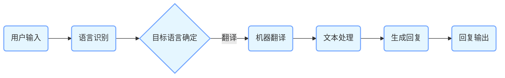

# 开发AI Agent的多语言切换能力：无缝国际化

> 关键词：AI Agent、多语言切换、无缝国际化、自然语言处理、机器翻译

> 摘要：本文聚焦于开发AI Agent的多语言切换能力以实现无缝国际化。首先介绍了该研究的背景，包括目的、预期读者、文档结构和相关术语。接着阐述了核心概念与联系，展示了其原理和架构的示意图及流程图。详细讲解了核心算法原理和具体操作步骤，并结合Python代码进行说明。同时给出了数学模型和公式，辅以举例解释。通过项目实战，从开发环境搭建到源代码实现及解读进行了全面剖析。探讨了实际应用场景，推荐了学习资源、开发工具框架和相关论文著作。最后总结了未来发展趋势与挑战，提供了常见问题解答和扩展阅读参考资料，旨在为开发者提供全面且深入的指导，助力AI Agent多语言能力的开发与应用。

## 1. 背景介绍 
### 1.1 目的和范围
在全球化的今天，AI Agent的应用场景日益广泛，跨越了不同的国家和地区。为了满足全球用户的需求，开发AI Agent的多语言切换能力变得至关重要。本文的目的是深入探讨如何为AI Agent添加多语言切换功能，实现无缝国际化。范围涵盖了核心概念的介绍、算法原理的讲解、实际项目的开发以及相关工具和资源的推荐。

### 1.2 预期读者
本文预期读者包括AI开发者、软件工程师、自然语言处理研究者以及对AI Agent多语言开发感兴趣的技术爱好者。无论您是初学者还是有一定经验的专业人士，都能从本文中获得有价值的信息。

### 1.3 文档结构概述
本文将按照以下结构进行阐述：首先介绍相关背景知识，包括目的、读者和文档结构；接着讲解核心概念与联系，包括原理和架构；然后详细说明核心算法原理和具体操作步骤；随后给出数学模型和公式并举例说明；通过项目实战展示代码实现和解读；探讨实际应用场景；推荐学习资源、开发工具框架和相关论文著作；最后总结未来发展趋势与挑战，提供常见问题解答和扩展阅读参考资料。

### 1.4 术语表
#### 1.4.1 核心术语定义
- **AI Agent**：即人工智能代理，是一种能够感知环境、进行推理并采取行动以实现特定目标的软件实体。
- **多语言切换能力**：指AI Agent能够在不同语言之间灵活切换，准确理解和生成不同语言的文本。
- **无缝国际化**：意味着AI Agent在处理多语言时，用户无需进行复杂的操作，能够自然流畅地与不同语言的用户进行交互。

#### 1.4.2 相关概念解释
- **自然语言处理（NLP）**：是一门研究如何让计算机理解、处理和生成人类自然语言的学科，是实现AI Agent多语言能力的基础。
- **机器翻译**：将一种自然语言翻译成另一种自然语言的技术，在AI Agent多语言切换中起着关键作用。

#### 1.4.3 缩略词列表
- **NLP**：Natural Language Processing（自然语言处理）
- **API**：Application Programming Interface（应用程序编程接口）

## 2. 核心概念与联系 
### 核心概念原理
AI Agent的多语言切换能力主要基于自然语言处理和机器翻译技术。其核心原理是将用户输入的文本进行语言识别，确定输入语言后，根据用户需求将其翻译成目标语言，再进行相应的处理和回复。

### 架构示意图


### 详细解释
1. **用户输入**：用户以某种语言向AI Agent输入文本信息。
2. **语言识别**：使用语言识别算法确定输入文本的语言类型。
3. **目标语言确定**：根据用户的设置或上下文信息，确定需要切换到的目标语言。
4. **机器翻译**：将输入文本从源语言翻译成目标语言。
5. **文本处理**：对翻译后的文本进行自然语言处理，如语义理解、意图识别等。
6. **生成回复**：根据处理结果生成相应的回复文本。
7. **回复输出**：将生成的回复以目标语言输出给用户。

## 3. 核心算法原理 & 具体操作步骤 
### 语言识别算法原理
语言识别的核心是根据文本的特征来判断其所属的语言。常见的方法是使用字符频率统计和机器学习算法。以下是一个简单的基于字符频率统计的语言识别Python代码示例：

```python
import collections

# 定义不同语言的字符频率分布
language_freq = {
    'english': {
        'e': 0.12702, 't': 0.09056, 'a': 0.08167, 'o': 0.07507, 'i': 0.06966,
        'n': 0.06749, 's': 0.06327, 'h': 0.06094, 'r': 0.05987, 'd': 0.04253
    },
    'french': {
        'e': 0.14715, 'a': 0.07636, 'i': 0.07529, 's': 0.07343, 'n': 0.07153,
        'r': 0.06693, 't': 0.06369, 'o': 0.05276, 'l': 0.05243, 'u': 0.04543
    }
}

def language_recognition(text):
    text = text.lower()
    char_count = collections.Counter(text)
    total_chars = sum(char_count.values())
    text_freq = {char: count / total_chars for char, count in char_count.items()}

    scores = {}
    for lang, freq in language_freq.items():
        score = 0
        for char, char_freq in freq.items():
            if char in text_freq:
                score += abs(text_freq[char] - char_freq)
        scores[lang] = score

    return min(scores, key=scores.get)

# 测试
text = "Hello, how are you?"
print(language_recognition(text))
```

### 代码解释
1. **定义语言字符频率分布**：在`language_freq`字典中，存储了英语和法语的常见字符频率。
2. **统计输入文本的字符频率**：使用`collections.Counter`统计输入文本中每个字符的出现次数，并计算其频率。
3. **计算相似度得分**：对于每种语言，计算输入文本的字符频率与该语言字符频率的差异得分。
4. **确定语言**：选择得分最小的语言作为输入文本的语言。

### 机器翻译算法原理
机器翻译可以使用预训练的模型，如Google Translate API或Hugging Face的Transformers库。以下是使用`transformers`库进行机器翻译的示例代码：

```python
from transformers import MarianMTModel, MarianTokenizer

# 加载预训练的翻译模型和分词器
model_name = 'Helsinki-NLP/opus-mt-en-fr'
tokenizer = MarianTokenizer.from_pretrained(model_name)
model = MarianMTModel.from_pretrained(model_name)

def translate(text):
    inputs = tokenizer(text, return_tensors="pt")
    outputs = model.generate(**inputs)
    translated_text = tokenizer.decode(outputs[0], skip_special_tokens=True)
    return translated_text

# 测试
text = "Hello, how are you?"
print(translate(text))
```

### 代码解释
1. **加载模型和分词器**：使用`MarianTokenizer`和`MarianMTModel`从Hugging Face的模型库中加载预训练的英语到法语的翻译模型。
2. **分词和编码**：使用分词器对输入文本进行分词，并将其转换为模型可以处理的张量。
3. **生成翻译结果**：使用模型对输入进行翻译，并生成翻译后的张量。
4. **解码和输出**：使用分词器将翻译后的张量解码为文本，并输出翻译结果。

## 4. 数学模型和公式 & 详细讲解 & 举例说明 
### 语言识别的数学模型
在基于字符频率统计的语言识别中，我们使用的是欧几里得距离来计算输入文本的字符频率与每种语言的字符频率之间的相似度。欧几里得距离的公式如下：

$$d(x,y)=\sqrt{\sum_{i=1}^{n}(x_i - y_i)^2}$$

其中，$x$ 和 $y$ 分别表示输入文本和某种语言的字符频率向量，$n$ 表示字符的数量。

### 详细讲解
在我们的代码示例中，由于只考虑了部分字符，所以使用了简化的距离计算方法，即计算字符频率差异的绝对值之和。假设输入文本的字符频率向量为 $x$，某种语言的字符频率向量为 $y$，则相似度得分 $s$ 的计算公式为：

$$s=\sum_{i=1}^{m}|x_i - y_i|$$

其中，$m$ 表示我们考虑的字符数量。

### 举例说明
假设输入文本为 "Hello"，我们只考虑字符 'e'、'h'、'l'、'o'。输入文本的字符频率向量 $x$ 为：

| 字符 | 频率 |
|------|------|
| e    | 0.2  |
| h    | 0.2  |
| l    | 0.4  |
| o    | 0.2  |

英语的字符频率向量 $y_{english}$ 为：

| 字符 | 频率 |
|------|------|
| e    | 0.12702 |
| h    | 0.06094 |
| l    | 未考虑 |
| o    | 0.07507 |

则相似度得分 $s_{english}$ 为：

$$s_{english}=|0.2 - 0.12702| + |0.2 - 0.06094| + |0.4 - 0| + |0.2 - 0.07507| \approx 0.737$$

通过比较不同语言的相似度得分，我们可以确定输入文本所属的语言。

### 机器翻译的数学模型
机器翻译通常使用基于注意力机制的Transformer模型。Transformer模型的核心是多头注意力机制，其计算公式如下：

$$\text{Attention}(Q, K, V)=\text{softmax}(\frac{QK^T}{\sqrt{d_k}})V$$

其中，$Q$、$K$、$V$ 分别是查询（Query）、键（Key）和值（Value）矩阵，$d_k$ 是键向量的维度。

### 详细讲解
多头注意力机制将注意力计算分为多个头，然后将每个头的输出拼接起来，最后通过一个线性变换得到最终的输出。其公式如下：

$$\text{MultiHead}(Q, K, V)=\text{Concat}(\text{head}_1, \text{head}_2, \cdots, \text{head}_h)W^O$$

其中，$\text{head}_i=\text{Attention}(QW_i^Q, KW_i^K, VW_i^V)$，$W_i^Q$、$W_i^K$、$W_i^V$ 和 $W^O$ 是可学习的权重矩阵。

### 举例说明
假设我们有一个输入序列 $x = [x_1, x_2, x_3]$，我们将其通过线性变换得到 $Q$、$K$、$V$ 矩阵。然后计算注意力分数：

$$\text{Attention}(Q, K, V)=\text{softmax}(\frac{QK^T}{\sqrt{d_k}})V$$

最后将多个头的输出拼接起来，得到最终的输出。

## 5. 项目实战：代码实际案例和详细解释说明 
### 5.1  开发环境搭建
#### 安装Python
首先，确保你已经安装了Python 3.6或更高版本。你可以从Python官方网站（https://www.python.org/downloads/）下载并安装Python。

#### 创建虚拟环境
为了避免不同项目之间的依赖冲突，建议使用虚拟环境。在命令行中执行以下命令创建并激活虚拟环境：

```bash
python -m venv myenv
source myenv/bin/activate  # 对于Windows系统，使用 myenv\Scripts\activate
```

#### 安装依赖库
在虚拟环境中，安装所需的依赖库：

```bash
pip install transformers torch collections
```

### 5.2  源代码详细实现和代码解读
以下是一个完整的AI Agent多语言切换的代码示例：

```python
import collections
from transformers import MarianMTModel, MarianTokenizer

# 定义不同语言的字符频率分布
language_freq = {
    'english': {
        'e': 0.12702, 't': 0.09056, 'a': 0.08167, 'o': 0.07507, 'i': 0.06966,
        'n': 0.06749, 's': 0.06327, 'h': 0.06094, 'r': 0.05987, 'd': 0.04253
    },
    'french': {
        'e': 0.14715, 'a': 0.07636, 'i': 0.07529, 's': 0.07343, 'n': 0.07153,
        'r': 0.06693, 't': 0.06369, 'o': 0.05276, 'l': 0.05243, 'u': 0.04543
    }
}

def language_recognition(text):
    text = text.lower()
    char_count = collections.Counter(text)
    total_chars = sum(char_count.values())
    text_freq = {char: count / total_chars for char, count in char_count.items()}

    scores = {}
    for lang, freq in language_freq.items():
        score = 0
        for char, char_freq in freq.items():
            if char in text_freq:
                score += abs(text_freq[char] - char_freq)
        scores[lang] = score

    return min(scores, key=scores.get)

# 加载预训练的翻译模型和分词器
model_name_en_fr = 'Helsinki-NLP/opus-mt-en-fr'
tokenizer_en_fr = MarianTokenizer.from_pretrained(model_name_en_fr)
model_en_fr = MarianMTModel.from_pretrained(model_name_en_fr)

model_name_fr_en = 'Helsinki-NLP/opus-mt-fr-en'
tokenizer_fr_en = MarianTokenizer.from_pretrained(model_name_fr_en)
model_fr_en = MarianMTModel.from_pretrained(model_name_fr_en)

def translate(text, source_lang, target_lang):
    if source_lang == 'english' and target_lang == 'french':
        tokenizer = tokenizer_en_fr
        model = model_en_fr
    elif source_lang == 'french' and target_lang == 'english':
        tokenizer = tokenizer_fr_en
        model = model_fr_en
    else:
        return text

    inputs = tokenizer(text, return_tensors="pt")
    outputs = model.generate(**inputs)
    translated_text = tokenizer.decode(outputs[0], skip_special_tokens=True)
    return translated_text

def multi_language_agent(input_text, target_lang):
    source_lang = language_recognition(input_text)
    if source_lang!= target_lang:
        translated_text = translate(input_text, source_lang, target_lang)
        return translated_text
    return input_text

# 测试
input_text = "Hello, how are you?"
target_lang = 'french'
output_text = multi_language_agent(input_text, target_lang)
print(output_text)
```

### 5.3  代码解读与分析
1. **语言识别函数**：`language_recognition`函数通过统计输入文本的字符频率，并与预定义的语言字符频率进行比较，确定输入文本的语言。
2. **翻译函数**：`translate`函数根据源语言和目标语言选择合适的翻译模型，并进行翻译。
3. **多语言代理函数**：`multi_language_agent`函数首先调用`language_recognition`函数确定输入文本的语言，然后根据源语言和目标语言调用`translate`函数进行翻译。
4. **测试部分**：输入一个英语文本和目标语言法语，调用`multi_language_agent`函数进行翻译，并输出翻译结果。

## 6. 实际应用场景 
### 客户服务
在客户服务场景中，AI Agent可以根据客户的语言自动切换，为全球客户提供无缝的服务。例如，跨国公司的客服中心可以使用多语言AI Agent来处理不同语言的客户咨询，提高客户满意度。

### 教育领域
在在线教育平台上，AI Agent可以为学生提供多语言的学习支持。例如，学生可以用自己的母语提问，AI Agent将问题翻译成教师的语言进行解答，然后再将解答翻译回学生的语言。

### 旅游行业
在旅游场景中，AI Agent可以帮助游客解决语言障碍。例如，游客可以使用多语言AI Agent查询景点信息、预订酒店、问路等，让旅行更加便捷。

### 国际商务
在国际商务活动中，AI Agent可以协助商务人士进行多语言的沟通和交流。例如，在商务谈判、合同起草等过程中，AI Agent可以实时翻译双方的语言，提高沟通效率。

## 7. 工具和资源推荐
### 7.1 学习资源推荐
#### 7.1.1 书籍推荐
- 《自然语言处理入门》：这本书系统地介绍了自然语言处理的基本概念、算法和应用，适合初学者入门。
- 《深度学习》：深度学习是自然语言处理的重要技术，这本书深入讲解了深度学习的原理和方法。
- 《机器翻译：统计建模与深度学习方法》：详细介绍了机器翻译的各种技术和方法，包括统计机器翻译和神经机器翻译。

#### 7.1.2 在线课程
- Coursera上的“Natural Language Processing Specialization”：由斯坦福大学教授授课，涵盖了自然语言处理的多个方面，包括语言识别、机器翻译等。
- edX上的“Deep Learning for Natural Language Processing”：介绍了深度学习在自然语言处理中的应用，适合有一定编程基础的学习者。

#### 7.1.3 技术博客和网站
- Hugging Face博客：提供了关于自然语言处理和深度学习的最新技术和研究成果。
- Medium上的NLP相关文章：有很多自然语言处理领域的专家分享的经验和见解。

### 7.2 开发工具框架推荐
#### 7.2.1 IDE和编辑器
- PyCharm：是一款专业的Python集成开发环境，提供了丰富的代码编辑、调试和项目管理功能。
- Visual Studio Code：轻量级的代码编辑器，支持多种编程语言和插件扩展，适合快速开发。

#### 7.2.2 调试和性能分析工具
- TensorBoard：用于可视化深度学习模型的训练过程和性能指标。
- Py-Spy：可以对Python代码进行性能分析，找出性能瓶颈。

#### 7.2.3 相关框架和库
- Transformers：Hugging Face开发的自然语言处理框架，提供了丰富的预训练模型和工具。
- NLTK：自然语言工具包，包含了大量的自然语言处理工具和数据集。

### 7.3 相关论文著作推荐
#### 7.3.1 经典论文
- “Attention Is All You Need”：提出了Transformer模型，是自然语言处理领域的经典论文。
- “Neural Machine Translation by Jointly Learning to Align and Translate”：开创了神经机器翻译的先河。

#### 7.3.2 最新研究成果
- 关注ACL（Association for Computational Linguistics）、EMNLP（Conference on Empirical Methods in Natural Language Processing）等会议的最新论文，了解自然语言处理领域的最新研究动态。

#### 7.3.3 应用案例分析
- 一些大型科技公司如Google、Microsoft等会发布关于AI Agent多语言应用的案例分析，可以从中学习实际应用中的经验和技巧。

## 8. 总结：未来发展趋势与挑战
### 未来发展趋势
- **更精准的语言识别和翻译**：随着深度学习技术的不断发展，语言识别和翻译的准确性将不断提高，能够处理更加复杂的语言场景。
- **多模态融合**：未来的AI Agent将不仅仅局限于文本处理，还会融合语音、图像等多模态信息，提供更加丰富的交互体验。
- **个性化服务**：根据用户的语言习惯、文化背景等提供个性化的多语言服务，提高用户满意度。

### 挑战
- **语言多样性**：世界上有数千种语言，每种语言都有其独特的语法、词汇和文化背景，如何处理这些语言的多样性是一个巨大的挑战。
- **数据不足**：对于一些小语种，可用的训练数据非常有限，这会影响模型的性能。
- **文化差异**：不同语言背后的文化差异会导致语义理解的困难，如何在多语言处理中考虑文化因素是一个重要的问题。

## 9. 附录：常见问题与解答
### 如何提高语言识别的准确性？
可以使用更复杂的机器学习算法，如深度学习模型，同时增加训练数据的多样性和规模。

### 机器翻译的质量如何评估？
常用的评估指标有BLEU（Bilingual Evaluation Understudy）、ROUGE（Recall-Oriented Understudy for Gisting Evaluation）等。

### 如何处理多语言中的特殊字符和符号？
可以在预处理阶段对特殊字符和符号进行统一处理，或者使用支持处理特殊字符的模型。

## 10. 扩展阅读 & 参考资料
### 扩展阅读
- 《人工智能：现代方法》：全面介绍了人工智能的各个领域，包括自然语言处理。
- 《Python自然语言处理实战》：通过实际案例讲解如何使用Python进行自然语言处理。

### 参考资料
- Hugging Face官方文档：https://huggingface.co/docs
- NLTK官方文档：https://www.nltk.org/

作者：AI天才研究院/AI Genius Institute & 禅与计算机程序设计艺术 /Zen And The Art of Computer Programming