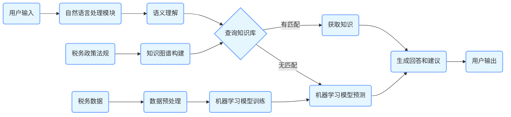

# 开发基于AI的智能税务规划助手

> 关键词：AI、智能税务规划助手、税务算法、机器学习、自然语言处理

> 摘要：本文围绕开发基于AI的智能税务规划助手展开。首先介绍了开发该助手的背景，包括目的、预期读者等信息。接着阐述了核心概念及联系，分析了核心算法原理并给出Python代码示例，详细讲解了数学模型和公式。通过项目实战展示了开发环境搭建、源代码实现与解读。探讨了实际应用场景，推荐了学习资源、开发工具框架以及相关论文著作。最后总结了未来发展趋势与挑战，提供常见问题解答和扩展阅读参考资料，旨在为开发者提供全面且深入的指导，助力开发出高效实用的智能税务规划助手。

## 1. 背景介绍 
### 1.1 目的和范围
在当今复杂多变的税务环境下，企业和个人面临着繁琐的税务计算、政策解读以及规划优化等问题。开发基于AI的智能税务规划助手的目的在于利用人工智能技术，为用户提供便捷、准确、高效的税务规划服务。该助手将涵盖多种税种的计算与规划，包括但不限于企业所得税、增值税、个人所得税等，适用于不同规模的企业和各类有税务规划需求的个人。其范围不仅包括基本的税务计算功能，还涉及根据用户的财务状况和业务场景提供个性化的税务规划建议，以及对最新税务政策的实时解读。

### 1.2 预期读者
本文的预期读者主要包括从事软件开发的程序员、软件架构师，他们对开发智能税务规划助手有技术实现方面的需求；税务专业人士，希望借助AI技术提升税务服务的效率和质量；企业管理者和财务人员，期望通过该助手更好地进行税务规划和财务管理；以及对人工智能在税务领域应用感兴趣的研究人员。

### 1.3 文档结构概述
本文将按照以下结构进行阐述：首先介绍开发智能税务规划助手的背景信息，包括目的、预期读者和文档结构等。接着深入探讨核心概念与联系，分析核心算法原理并给出具体操作步骤，讲解相关的数学模型和公式。通过项目实战展示开发过程，包括环境搭建、代码实现与解读。然后介绍该助手的实际应用场景，推荐相关的学习资源、开发工具框架和论文著作。最后总结未来发展趋势与挑战，提供常见问题解答和扩展阅读参考资料。

### 1.4 术语表
#### 1.4.1 核心术语定义
- **智能税务规划助手**：基于人工智能技术开发的软件系统，能够自动处理税务相关业务，提供税务计算、规划建议和政策解读等服务。
- **机器学习**：一门多领域交叉学科，涉及概率论、统计学、逼近论、凸分析、算法复杂度理论等多门学科。它专门研究计算机怎样模拟或实现人类的学习行为，以获取新的知识或技能，重新组织已有的知识结构使之不断改善自身的性能。
- **自然语言处理**：计算机科学领域与人工智能领域中的一个重要方向。它研究能实现人与计算机之间用自然语言进行有效通信的各种理论和方法，包括文本理解、语义分析、信息抽取等。
- **税务规划**：在合法合规的前提下，通过对经营、投资、理财等活动的事先筹划和安排，尽可能地获得“节税”的税收利益。

#### 1.4.2 相关概念解释
- **深度学习**：机器学习的一个分支领域，它是一种基于对数据进行表征学习的方法。深度学习通过构建具有很多层的神经网络模型，自动从大量数据中学习复杂的模式和特征。
- **知识图谱**：一种语义网络，用于描述实体之间的关系。在税务领域，知识图谱可以将税务政策、法规、企业信息等实体及其关系进行整合，为智能税务规划提供知识支持。

#### 1.4.3 缩略词列表
- **AI**：Artificial Intelligence，人工智能
- **ML**：Machine Learning，机器学习
- **NLP**：Natural Language Processing，自然语言处理
- **DNN**：Deep Neural Network，深度神经网络

## 2. 核心概念与联系 

### 核心概念原理
智能税务规划助手主要基于机器学习和自然语言处理技术。机器学习算法用于分析大量的税务数据，包括历史税务申报记录、企业财务数据等，以发现数据中的模式和规律，从而实现税务计算和规划的自动化。自然语言处理技术则用于处理用户的自然语言输入，理解用户的问题，并生成自然语言的回答和建议。

### 架构的文本示意图
智能税务规划助手的架构主要包括数据层、模型层和应用层。
- **数据层**：负责收集、存储和管理各种税务相关的数据，包括税务政策法规、企业财务数据、历史税务申报记录等。
- **模型层**：包含机器学习模型和自然语言处理模型。机器学习模型用于税务计算和规划，如分类模型用于判断企业适用的税率，回归模型用于预测税务成本等。自然语言处理模型用于文本理解和生成，如语义分析模型用于理解用户的问题，生成式模型用于生成税务规划建议。
- **应用层**：提供用户界面，使用户可以通过网页、移动应用等方式与智能税务规划助手进行交互。应用层还负责将用户的输入传递给模型层进行处理，并将处理结果返回给用户。

### Mermaid流程图


## 3. 核心算法原理 & 具体操作步骤 

### 核心算法原理
#### 机器学习算法
在智能税务规划助手中，常用的机器学习算法包括决策树、随机森林、神经网络等。以决策树算法为例，决策树是一种基于树结构进行决策的模型，每个内部节点是一个属性上的测试，每个分支是一个测试输出，每个叶节点是一个类别或值。在税务规划中，决策树可以根据企业的财务指标（如收入、成本、利润等）来判断企业适用的税率。

#### 自然语言处理算法
自然语言处理算法主要包括词法分析、句法分析、语义分析等。在智能税务规划助手中，常用的自然语言处理技术是预训练语言模型，如BERT（Bidirectional Encoder Representations from Transformers）。BERT模型通过在大规模文本数据上进行无监督学习，能够学习到语言的语义信息。可以使用BERT模型对用户的问题进行语义理解，从而准确地回答用户的问题。

### 具体操作步骤
#### 数据收集与预处理
首先，需要收集各种税务相关的数据，包括税务政策法规、企业财务数据、历史税务申报记录等。然后对收集到的数据进行预处理，包括数据清洗、特征提取、数据归一化等操作。以下是一个使用Python进行数据清洗的示例代码：
```python
import pandas as pd

# 读取数据
data = pd.read_csv('tax_data.csv')

# 去除缺失值
data = data.dropna()

# 去除重复值
data = data.drop_duplicates()

# 保存处理后的数据
data.to_csv('cleaned_tax_data.csv', index=False)
```

#### 模型训练
使用预处理后的数据对机器学习模型和自然语言处理模型进行训练。以下是一个使用决策树算法进行模型训练的示例代码：
```python
from sklearn.tree import DecisionTreeClassifier
from sklearn.model_selection import train_test_split
from sklearn.metrics import accuracy_score
import pandas as pd

# 读取数据
data = pd.read_csv('cleaned_tax_data.csv')

# 分离特征和标签
X = data.drop('tax_rate', axis=1)
y = data['tax_rate']

# 划分训练集和测试集
X_train, X_test, y_train, y_test = train_test_split(X, y, test_size=0.2, random_state=42)

# 创建决策树模型
model = DecisionTreeClassifier()

# 训练模型
model.fit(X_train, y_train)

# 预测
y_pred = model.predict(X_test)

# 评估模型
accuracy = accuracy_score(y_test, y_pred)
print(f"模型准确率: {accuracy}")
```

#### 模型部署
将训练好的模型部署到生产环境中，为用户提供服务。可以使用Flask等Web框架搭建一个简单的API接口，以下是一个使用Flask部署决策树模型的示例代码：
```python
from flask import Flask, request, jsonify
from sklearn.tree import DecisionTreeClassifier
import pandas as pd

# 加载模型
model = DecisionTreeClassifier()
data = pd.read_csv('cleaned_tax_data.csv')
X = data.drop('tax_rate', axis=1)
y = data['tax_rate']
model.fit(X, y)

app = Flask(__name__)

@app.route('/predict', methods=['POST'])
def predict():
    data = request.get_json(force=True)
    input_data = [list(data.values())]
    prediction = model.predict(input_data)
    return jsonify({'tax_rate': int(prediction[0])})

if __name__ == '__main__':
    app.run(debug=True)
```

## 4. 数学模型和公式 & 详细讲解 & 举例说明 

### 税务计算数学模型
#### 企业所得税计算
企业所得税的计算公式为：
$$
\text{应纳税额} = \text{应纳税所得额} \times \text{税率} - \text{减免税额} - \text{抵免税额}
$$
其中，应纳税所得额的计算公式为：
$$
\text{应纳税所得额} = \text{收入总额} - \text{不征税收入} - \text{免税收入} - \text{各项扣除} - \text{以前年度亏损}
$$

**举例说明**：假设某企业年收入总额为1000万元，不征税收入为50万元，免税收入为30万元，各项扣除为600万元，以前年度亏损为100万元，适用税率为25%，无减免税额和抵免税额。则该企业的应纳税所得额为：
$$
\text{应纳税所得额} = 1000 - 50 - 30 - 600 - 100 = 220 \text{（万元）}
$$
应纳税额为：
$$
\text{应纳税额} = 220 \times 25\% = 55 \text{（万元）}
$$

#### 增值税计算
增值税的计算公式为：
$$
\text{应纳税额} = \text{当期销项税额} - \text{当期进项税额}
$$
其中，当期销项税额的计算公式为：
$$
\text{当期销项税额} = \text{销售额} \times \text{税率}
$$

**举例说明**：假设某企业当期销售额为500万元，适用税率为13%，当期进项税额为30万元。则该企业的当期销项税额为：
$$
\text{当期销项税额} = 500 \times 13\% = 65 \text{（万元）}
$$
应纳税额为：
$$
\text{应纳税额} = 65 - 30 = 35 \text{（万元）}
$$

### 机器学习模型数学原理
#### 决策树算法
决策树算法的核心是选择最优的划分属性。常用的划分属性选择方法是信息增益，信息增益的计算公式为：
$$
\text{Gain}(D, a) = \text{Ent}(D) - \sum_{v = 1}^{V} \frac{|D^v|}{|D|} \text{Ent}(D^v)
$$
其中，$D$ 表示数据集，$a$ 表示属性，$V$ 表示属性 $a$ 的取值个数，$D^v$ 表示属性 $a$ 取值为 $v$ 的样本子集，$\text{Ent}(D)$ 表示数据集 $D$ 的信息熵，计算公式为：
$$
\text{Ent}(D) = - \sum_{k = 1}^{K} p_k \log_2 p_k
$$
其中，$K$ 表示类别个数，$p_k$ 表示第 $k$ 类样本在数据集 $D$ 中所占的比例。

**举例说明**：假设有一个数据集 $D$ 包含10个样本，分为两类，其中第一类有6个样本，第二类有4个样本。则数据集 $D$ 的信息熵为：
$$
\text{Ent}(D) = - \left( \frac{6}{10} \log_2 \frac{6}{10} + \frac{4}{10} \log_2 \frac{4}{10} \right) \approx 0.971
$$
假设属性 $a$ 有两个取值，$D^1$ 包含4个样本，其中第一类有3个样本，第二类有1个样本；$D^2$ 包含6个样本，其中第一类有3个样本，第二类有3个样本。则属性 $a$ 的信息增益为：
$$
\begin{align*}
\text{Gain}(D, a) &= \text{Ent}(D) - \left( \frac{4}{10} \text{Ent}(D^1) + \frac{6}{10} \text{Ent}(D^2) \right) \\
&= 0.971 - \left( \frac{4}{10} \left( - \frac{3}{4} \log_2 \frac{3}{4} - \frac{1}{4} \log_2 \frac{1}{4} \right) + \frac{6}{10} \left( - \frac{3}{6} \log_2 \frac{3}{6} - \frac{3}{6} \log_2 \frac{3}{6} \right) \right) \\
&\approx 0.971 - (0.4 \times 0.811 + 0.6 \times 1) \\
&\approx 0.136
\end{align*}
$$

## 5. 项目实战：代码实际案例和详细解释说明 

### 5.1  开发环境搭建
#### 操作系统
建议使用Linux系统，如Ubuntu 18.04或更高版本，因为Linux系统在开发和部署方面具有良好的稳定性和兼容性。

#### 编程语言和框架
- **Python**：作为主要的编程语言，Python具有丰富的科学计算和机器学习库，如NumPy、Pandas、Scikit-learn、TensorFlow等。
- **Flask**：用于搭建Web服务，提供API接口，方便与前端进行交互。

#### 数据库
可以使用MySQL或MongoDB等数据库来存储税务数据和用户信息。

#### 安装依赖库
在终端中运行以下命令安装所需的依赖库：
```bash
pip install pandas scikit-learn flask tensorflow
```

### 5.2  源代码详细实现和代码解读
#### 数据加载和预处理模块
```python
import pandas as pd
from sklearn.preprocessing import StandardScaler

def load_and_preprocess_data(file_path):
    # 加载数据
    data = pd.read_csv(file_path)
    
    # 分离特征和标签
    X = data.drop('tax_rate', axis=1)
    y = data['tax_rate']
    
    # 数据归一化
    scaler = StandardScaler()
    X = scaler.fit_transform(X)
    
    return X, y
```
**代码解读**：该函数用于加载税务数据并进行预处理。首先使用 `pandas` 库读取CSV文件，然后分离特征和标签。最后使用 `StandardScaler` 对特征数据进行归一化处理，以提高模型的训练效果。

#### 模型训练模块
```python
from sklearn.tree import DecisionTreeClassifier
from sklearn.model_selection import train_test_split

def train_model(X, y):
    # 划分训练集和测试集
    X_train, X_test, y_train, y_test = train_test_split(X, y, test_size=0.2, random_state=42)
    
    # 创建决策树模型
    model = DecisionTreeClassifier()
    
    # 训练模型
    model.fit(X_train, y_train)
    
    return model
```
**代码解读**：该函数用于训练决策树模型。首先使用 `train_test_split` 函数将数据集划分为训练集和测试集，然后创建决策树模型并使用训练集进行训练。

#### 模型部署模块
```python
from flask import Flask, request, jsonify
import pandas as pd
from sklearn.preprocessing import StandardScaler
from sklearn.tree import DecisionTreeClassifier

# 加载数据和预处理
X, y = load_and_preprocess_data('tax_data.csv')

# 训练模型
model = train_model(X, y)

app = Flask(__name__)

@app.route('/predict', methods=['POST'])
def predict():
    data = request.get_json(force=True)
    input_data = [list(data.values())]
    
    # 数据归一化
    scaler = StandardScaler()
    X = scaler.fit_transform(X)
    input_data = scaler.transform(input_data)
    
    # 预测
    prediction = model.predict(input_data)
    
    return jsonify({'tax_rate': int(prediction[0])})

if __name__ == '__main__':
    app.run(debug=True)
```
**代码解读**：该代码使用Flask框架搭建了一个Web服务，提供 `/predict` 接口用于接收用户的输入数据并进行预测。首先加载数据并训练模型，然后定义 `/predict` 路由，接收用户的JSON数据，对输入数据进行归一化处理，最后使用训练好的模型进行预测并返回结果。

### 5.3  代码解读与分析
#### 数据预处理的重要性
数据预处理是机器学习模型训练的重要步骤，它可以提高数据的质量和模型的训练效果。在本项目中，使用 `StandardScaler` 对特征数据进行归一化处理，使得不同特征具有相同的尺度，避免了某些特征对模型的影响过大。

#### 模型选择和训练
决策树模型是一种简单而有效的机器学习模型，它具有易于理解和解释的优点。在本项目中，使用决策树模型对税务数据进行分类，根据企业的财务指标预测适用的税率。

#### 模型部署和接口设计
使用Flask框架将训练好的模型部署为Web服务，提供 `/predict` 接口，方便用户通过HTTP请求进行预测。在接口设计中，接收用户的JSON数据，对输入数据进行预处理，然后使用模型进行预测并返回结果。

## 6. 实际应用场景 
### 企业税务规划
企业可以使用智能税务规划助手进行税务成本预测和规划。助手可以根据企业的财务数据和业务情况，分析不同的税务方案，为企业提供最优的税务规划建议，帮助企业降低税务成本。例如，对于一家制造业企业，助手可以分析企业的原材料采购、生产流程、销售渠道等环节，提出合理的税务筹划方案，如合理利用税收优惠政策、优化供应链结构等。

### 个人税务申报
个人在进行税务申报时，可能会遇到各种问题，如不清楚自己的应税收入、不了解税收优惠政策等。智能税务规划助手可以帮助个人准确计算应纳税额，提供税务申报指导。例如，对于一位自由职业者，助手可以根据其收入来源和支出情况，帮助其确定应税收入，指导其填写税务申报表，并提醒其享受相关的税收优惠政策。

### 税务咨询服务
税务咨询机构可以使用智能税务规划助手提高服务效率和质量。助手可以快速解答客户的税务问题，提供专业的税务建议。同时，助手可以对客户的财务数据进行分析，为客户制定个性化的税务规划方案。例如，当客户咨询关于企业重组的税务问题时，助手可以快速查询相关的税收政策法规，结合客户的具体情况，提供详细的税务处理建议。

### 税务监管部门
税务监管部门可以利用智能税务规划助手对企业和个人的税务申报数据进行分析和监控。助手可以通过机器学习算法识别异常的税务申报行为，帮助税务监管部门及时发现潜在的税务风险。例如，助手可以分析企业的收入和成本数据，判断企业是否存在虚开发票、隐瞒收入等违法行为。

## 7. 工具和资源推荐
### 7.1 学习资源推荐
#### 7.1.1 书籍推荐
- 《Python机器学习实战》：本书通过大量的实际案例，介绍了Python在机器学习领域的应用，包括数据预处理、模型选择、模型训练和评估等内容。
- 《自然语言处理入门》：系统地介绍了自然语言处理的基本概念、方法和技术，适合初学者入门。
- 《税务会计与纳税筹划》：详细讲解了各类税种的会计处理和纳税筹划方法，对于理解税务业务有很大的帮助。

#### 7.1.2 在线课程
- Coursera上的“机器学习”课程：由斯坦福大学教授Andrew Ng主讲，是机器学习领域的经典课程，涵盖了机器学习的基本概念、算法和应用。
- edX上的“自然语言处理”课程：介绍了自然语言处理的最新技术和方法，包括深度学习在自然语言处理中的应用。
- 中国大学MOOC上的“税务筹划”课程：由国内知名高校的教授授课，讲解了税务筹划的原理、方法和案例。

#### 7.1.3 技术博客和网站
- 博客园：国内知名的技术博客平台，有很多关于机器学习、Python编程和税务技术的文章。
- Medium：国外的技术博客平台，有很多优秀的机器学习和人工智能相关的文章。
- 国家税务总局官网：提供最新的税务政策法规和税务资讯，是了解税务业务的重要渠道。

### 7.2 开发工具框架推荐
#### 7.2.1 IDE和编辑器
- PyCharm：专业的Python集成开发环境，具有代码编辑、调试、自动补全、版本控制等功能，适合Python开发。
- Visual Studio Code：轻量级的代码编辑器，支持多种编程语言，有丰富的插件扩展，可用于Python和Web开发。

#### 7.2.2 调试和性能分析工具
- Py-Spy：用于分析Python程序的性能瓶颈，找出程序中耗时较长的函数和代码段。
- Flask-DebugToolbar：用于调试Flask应用程序，提供了请求信息、SQL查询、模板渲染等调试信息。

#### 7.2.3 相关框架和库
- Scikit-learn：Python中常用的机器学习库，提供了各种机器学习算法和工具，如分类、回归、聚类等。
- TensorFlow：开源的深度学习框架，广泛应用于图像识别、自然语言处理等领域。
- NLTK：自然语言处理工具包，提供了丰富的语料库和处理工具，如分词、词性标注、命名实体识别等。

### 7.3 相关论文著作推荐
#### 7.3.1 经典论文
- “Gradient-Based Learning Applied to Document Recognition”：介绍了卷积神经网络（CNN）在手写字符识别中的应用，是深度学习领域的经典论文。
- “Attention Is All You Need”：提出了Transformer模型，是自然语言处理领域的重要突破。

#### 7.3.2 最新研究成果
- 关于将深度学习应用于税务风险预测的研究论文，探讨了如何利用深度学习模型对企业的税务风险进行准确预测。
- 关于知识图谱在税务领域应用的研究论文，介绍了如何构建税务知识图谱，以及如何利用知识图谱进行税务政策解读和税务规划。

#### 7.3.3 应用案例分析
- 分析某大型企业如何利用智能税务规划助手进行税务成本优化的案例，详细介绍了助手的功能和应用效果。
- 介绍某税务咨询机构如何使用智能税务规划助手提高服务效率和质量的案例，包括助手的使用流程和客户反馈。

## 8. 总结：未来发展趋势与挑战
### 未来发展趋势
#### 智能化程度不断提高
随着人工智能技术的不断发展，智能税务规划助手的智能化程度将不断提高。未来的助手将能够更准确地理解用户的问题，提供更个性化的税务规划建议。例如，助手可以根据用户的历史税务数据和行为模式，自动调整规划方案，实现动态的税务规划。

#### 与其他系统的集成
智能税务规划助手将与企业的财务系统、ERP系统等进行深度集成，实现数据的实时共享和交互。这样可以提高税务规划的准确性和及时性，同时减少人工操作的工作量。例如，助手可以直接从财务系统中获取企业的财务数据，进行实时的税务计算和规划。

#### 多语言支持
随着全球化的发展，企业和个人的税务业务涉及到不同的国家和地区。未来的智能税务规划助手将支持多语言，方便不同语言背景的用户使用。同时，助手还可以提供不同国家和地区的税务政策解读和规划建议。

### 挑战
#### 数据安全和隐私保护
智能税务规划助手需要处理大量的企业和个人税务数据，这些数据包含了敏感信息，如财务数据、个人身份信息等。因此，数据安全和隐私保护是一个重要的挑战。开发人员需要采取有效的措施，如数据加密、访问控制等，确保数据的安全和隐私。

#### 税务政策的复杂性
税务政策法规不断变化，且不同国家和地区的税务政策存在差异。智能税务规划助手需要及时更新税务政策知识库，确保提供的税务规划建议符合最新的政策法规。同时，如何处理复杂的税务政策和法规，也是一个挑战。

#### 模型的可解释性
机器学习模型，尤其是深度学习模型，往往具有较高的复杂度，其决策过程难以解释。在税务规划领域，用户需要了解模型的决策依据，以便做出合理的决策。因此，提高模型的可解释性是一个重要的挑战。

## 9. 附录：常见问题与解答
### 1. 智能税务规划助手的准确性如何保证？
智能税务规划助手的准确性主要通过以下几个方面来保证：一是使用大量的历史税务数据进行模型训练，让模型学习到数据中的模式和规律；二是及时更新税务政策知识库，确保助手提供的建议符合最新的政策法规；三是对模型进行评估和优化，不断提高模型的性能。

### 2. 智能税务规划助手是否可以替代税务专业人员？
智能税务规划助手不能完全替代税务专业人员。虽然助手可以提供税务计算和规划建议，但税务业务具有复杂性和多样性，需要税务专业人员的经验和专业知识进行综合判断。智能税务规划助手可以作为税务专业人员的辅助工具，提高工作效率和质量。

### 3. 如何保证智能税务规划助手的数据安全？
为了保证智能税务规划助手的数据安全，可以采取以下措施：一是对数据进行加密存储和传输，防止数据泄露；二是设置严格的访问控制权限，只有授权人员才能访问和操作数据；三是定期对数据进行备份，防止数据丢失。

### 4. 智能税务规划助手可以处理哪些税种？
智能税务规划助手可以处理多种税种，包括企业所得税、增值税、个人所得税、消费税等。具体支持的税种取决于助手的功能和设计。

## 10. 扩展阅读 & 参考资料
### 扩展阅读
- 《人工智能：现代方法》：全面介绍了人工智能的基本概念、方法和技术，是人工智能领域的经典教材。
- 《大数据时代》：探讨了大数据对社会、经济和生活的影响，对于理解智能税务规划助手的数据驱动特性有帮助。

### 参考资料
- 国家税务总局发布的税务政策法规文件。
- 相关的学术论文和研究报告，如《机器学习在税务风险评估中的应用研究》等。

作者：AI天才研究院/AI Genius Institute & 禅与计算机程序设计艺术 /Zen And The Art of Computer Programming