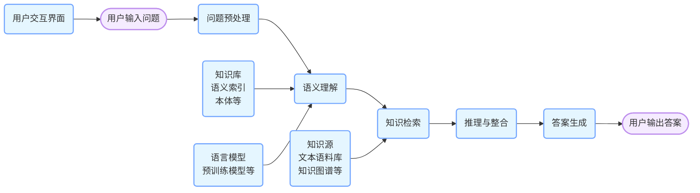

# 开放域问答:测试AI推理能力的极限

> 关键词：开放域问答、AI推理能力、自然语言处理、知识图谱、深度学习

> 摘要：本文聚焦于开放域问答这一前沿领域，深入探讨其在测试AI推理能力极限方面的重要意义。首先介绍了开放域问答的背景知识，包括目的、预期读者、文档结构和相关术语。接着阐述了核心概念及其联系，给出了原理和架构的文本示意图与Mermaid流程图。详细讲解了核心算法原理，并使用Python代码进行说明，同时介绍了相关的数学模型和公式。通过项目实战，展示了开放域问答系统的开发过程，包括环境搭建、代码实现和解读。分析了开放域问答的实际应用场景，推荐了学习资源、开发工具框架和相关论文著作。最后总结了未来发展趋势与挑战，并提供了常见问题解答和扩展阅读参考资料。

## 1. 背景介绍 
### 1.1 目的和范围
开放域问答系统旨在处理来自各种领域、没有特定限制的自然语言问题，并给出准确合理的答案。其目的不仅是为用户提供信息，更重要的是测试AI在复杂、不确定的环境下的推理能力。范围涵盖了自然语言处理、知识表示与推理、机器学习等多个领域的技术融合，以实现对开放域问题的有效理解和解答。

### 1.2 预期读者
本文预期读者包括自然语言处理领域的研究人员、AI开发者、对开放域问答和AI推理能力感兴趣的技术爱好者。对于正在学习或研究相关领域的学生，也能从本文中获得深入的知识和实践指导。

### 1.3 文档结构概述
本文将按照以下结构进行阐述：首先介绍核心概念与联系，包括开放域问答和AI推理能力的基本原理和架构；接着讲解核心算法原理和具体操作步骤，并用Python代码详细说明；然后介绍相关的数学模型和公式，并举例说明；通过项目实战展示开放域问答系统的开发过程；分析实际应用场景；推荐学习资源、开发工具框架和相关论文著作；最后总结未来发展趋势与挑战，提供常见问题解答和扩展阅读参考资料。

### 1.4 术语表
#### 1.4.1 核心术语定义
- **开放域问答（Open Domain Question Answering）**：指系统能够处理来自任意领域的自然语言问题，并给出相应答案，而不受特定领域知识的限制。
- **AI推理能力（AI Reasoning Ability）**：AI系统根据已知信息，运用逻辑规则和知识进行分析、推导，得出新结论的能力。
- **自然语言处理（Natural Language Processing, NLP）**：研究如何让计算机理解、处理和生成人类自然语言的技术领域。
- **知识图谱（Knowledge Graph）**：一种以图结构形式表示实体及其之间关系的知识库，用于存储和组织大量的知识信息。
- **深度学习（Deep Learning）**：一类基于人工神经网络的机器学习方法，通过多层神经网络自动学习数据中的特征和模式。

#### 1.4.2 相关概念解释
- **问答对（Question-Answer Pair）**：由一个问题和对应的答案组成的组合，常用于训练和评估问答系统。
- **上下文理解（Context Understanding）**：在处理问题时，考虑问题所处的语境信息，以更准确地理解问题的含义。
- **语义表示（Semantic Representation）**：将自然语言文本转换为计算机能够理解和处理的语义形式，便于进行推理和匹配。

#### 1.4.3 缩略词列表
- **NLP**：Natural Language Processing（自然语言处理）
- **QA**：Question Answering（问答）
- **KG**：Knowledge Graph（知识图谱）
- **DNN**：Deep Neural Network（深度神经网络）
- **RNN**：Recurrent Neural Network（循环神经网络）
- **LSTM**：Long Short-Term Memory（长短期记忆网络）
- **GRU**：Gated Recurrent Unit（门控循环单元）

## 2. 核心概念与联系 

### 核心概念原理
开放域问答系统的核心原理是将用户提出的自然语言问题进行解析和理解，然后在大规模的知识源中寻找相关信息，通过推理和整合得出答案。这涉及到多个步骤，包括问题预处理、语义理解、知识检索和答案生成。

问题预处理主要对输入的问题进行清洗、分词、词性标注等操作，以去除噪声和将问题转换为便于处理的形式。语义理解则是将预处理后的问题映射到语义空间，识别问题的类型、主题和关键信息。知识检索根据语义理解的结果，在知识源（如文本语料库、知识图谱等）中查找相关的知识片段。最后，答案生成模块对检索到的知识进行推理和整合，生成最终的答案。

AI推理能力在开放域问答中起着关键作用。它能够根据问题和检索到的知识，运用逻辑规则、统计信息和领域知识进行推理，填补知识空缺，得出合理的结论。例如，在处理一些需要多步推理的问题时，AI推理能力可以将多个相关的知识片段进行组合和推导，得到最终的答案。

### 架构的文本示意图
```plaintext
用户输入问题 -> 问题预处理 -> 语义理解 -> 知识检索 -> 推理与整合 -> 答案生成 -> 用户输出答案
|                            |           |           |
|                            |           |           +-> 知识源（文本语料库、知识图谱等）
|                            |           +-> 知识库（语义索引、本体等）
|                            +-> 语言模型（预训练模型等）
+-> 用户交互界面
```

### Mermaid流程图


## 3. 核心算法原理 & 具体操作步骤 

### 核心算法原理
开放域问答系统中常用的核心算法包括基于深度学习的方法和基于知识图谱的方法。以下分别介绍这两种方法的原理。

#### 基于深度学习的方法
基于深度学习的开放域问答方法通常使用预训练语言模型（如BERT、GPT等）来进行问题的语义理解和答案的生成。预训练语言模型在大规模的文本数据上进行无监督学习，学习到了丰富的语言知识和语义表示。在开放域问答中，将问题和相关的文本段落输入到预训练语言模型中，模型会输出每个词的语义表示，通过对这些表示进行进一步的处理和分析，找到最可能的答案。

例如，使用BERT模型进行问答任务时，将问题和文本段落拼接成一个输入序列，输入到BERT模型中。BERT模型会输出每个词的隐藏状态，通过一个线性层将隐藏状态映射到一个得分向量，得分向量表示每个词作为答案起始和结束位置的概率。通过选择得分最高的起始和结束位置，得到最终的答案。

#### 基于知识图谱的方法
基于知识图谱的开放域问答方法利用知识图谱中丰富的结构化知识进行推理和问答。知识图谱以图的形式表示实体和实体之间的关系，每个节点表示一个实体，每条边表示实体之间的关系。在处理问题时，首先将问题中的实体和关系识别出来，然后在知识图谱中查找相关的实体和路径，通过推理得出答案。

例如，对于问题“苹果公司的创始人是谁？”，系统会识别出“苹果公司”这个实体，然后在知识图谱中查找与“苹果公司”相关的“创始人”关系，找到对应的实体（如史蒂夫·乔布斯、史蒂夫·沃兹尼亚克等）作为答案。

### 具体操作步骤
以下是一个基于深度学习的开放域问答系统的具体操作步骤：

#### 步骤1：数据准备
收集和整理问答数据集，包括问题和对应的答案。对数据集进行预处理，如分词、标注等。将数据集划分为训练集、验证集和测试集。

#### 步骤2：模型选择和加载
选择合适的预训练语言模型，如BERT、RoBERTa等。使用开源的深度学习框架（如PyTorch、TensorFlow等）加载预训练模型。

#### 步骤3：模型微调
在训练集上对预训练模型进行微调，以适应开放域问答任务。定义损失函数（如交叉熵损失）和优化器（如Adam优化器），通过反向传播算法更新模型的参数。

#### 步骤4：模型评估
在验证集和测试集上对微调后的模型进行评估，使用评估指标（如准确率、F1值等）来衡量模型的性能。根据评估结果调整模型的参数和超参数。

#### 步骤5：部署和应用
将训练好的模型部署到生产环境中，提供开放域问答服务。开发用户交互界面，让用户可以输入问题并获取答案。

### Python源代码详细阐述
以下是一个使用Hugging Face的Transformers库实现基于BERT的开放域问答系统的示例代码：

```python
from transformers import AutoTokenizer, AutoModelForQuestionAnswering
import torch

# 加载预训练的分词器和问答模型
tokenizer = AutoTokenizer.from_pretrained("bert-large-uncased-whole-word-masking-finetuned-squad")
model = AutoModelForQuestionAnswering.from_pretrained("bert-large-uncased-whole-word-masking-finetuned-squad")

# 定义问题和文本段落
question = "What is the capital of France?"
text = "France is a country in Western Europe. Its capital is Paris."

# 对问题和文本进行分词
inputs = tokenizer(question, text, return_tensors='pt')

# 使用模型进行预测
outputs = model(**inputs)
answer_start_scores = outputs.start_logits
answer_end_scores = outputs.end_logits

# 找到得分最高的起始和结束位置
answer_start = torch.argmax(answer_start_scores)
answer_end = torch.argmax(answer_end_scores) + 1

# 提取答案
answer = tokenizer.convert_tokens_to_string(tokenizer.convert_ids_to_tokens(inputs['input_ids'][0][answer_start:answer_end]))

print("Question:", question)
print("Answer:", answer)
```

在上述代码中，首先使用`AutoTokenizer`和`AutoModelForQuestionAnswering`加载预训练的分词器和问答模型。然后定义问题和文本段落，对其进行分词并输入到模型中进行预测。最后，根据预测的起始和结束位置提取答案并输出。

## 4. 数学模型和公式 & 详细讲解 & 举例说明 

### 基于深度学习的数学模型和公式
在基于深度学习的开放域问答系统中，常用的数学模型是神经网络模型，如BERT模型。BERT模型是一种基于Transformer架构的双向编码器表示模型，其核心是多头自注意力机制（Multi-Head Self-Attention）。

#### 多头自注意力机制
多头自注意力机制允许模型在不同的表示子空间中并行地关注输入序列的不同部分。给定输入序列 $X = [x_1, x_2,..., x_n]$，其中 $x_i$ 是第 $i$ 个词的嵌入向量。多头自注意力机制的计算步骤如下：

1. **线性变换**：将输入序列 $X$ 分别通过三个线性变换矩阵 $W^Q$、$W^K$ 和 $W^V$ 得到查询矩阵 $Q$、键矩阵 $K$ 和值矩阵 $V$：
   $$Q = XW^Q$$
   $$K = XW^K$$
   $$V = XW^V$$

2. **注意力计算**：计算注意力分数 $A$：
   $$A = \text{softmax}\left(\frac{QK^T}{\sqrt{d_k}}\right)$$
   其中 $d_k$ 是查询和键向量的维度。

3. **加权求和**：将注意力分数 $A$ 与值矩阵 $V$ 相乘，得到注意力输出 $O$：
   $$O = AV$$

4. **多头拼接**：将多个头的注意力输出拼接起来，再通过一个线性变换矩阵 $W^O$ 得到最终的输出：
   $$\text{MultiHead}(Q, K, V) = \text{Concat}(\text{head}_1, \text{head}_2,..., \text{head}_h)W^O$$
   其中 $\text{head}_i$ 是第 $i$ 个头的注意力输出，$h$ 是头的数量。

#### 举例说明
假设输入序列 $X$ 是一个长度为 3 的词嵌入向量序列，每个向量的维度为 4，即 $X \in \mathbb{R}^{3 \times 4}$。查询、键和值的线性变换矩阵 $W^Q$、$W^K$ 和 $W^V$ 的维度均为 $4 \times 4$。头的数量 $h = 2$，最终输出的线性变换矩阵 $W^O$ 的维度为 $8 \times 4$。

首先计算查询、键和值矩阵：
$$Q = XW^Q \in \mathbb{R}^{3 \times 4}$$
$$K = XW^K \in \mathbb{R}^{3 \times 4}$$
$$V = XW^V \in \mathbb{R}^{3 \times 4}$$

然后计算注意力分数：
$$A = \text{softmax}\left(\frac{QK^T}{\sqrt{4}}\right) \in \mathbb{R}^{3 \times 3}$$

接着计算注意力输出：
$$O = AV \in \mathbb{R}^{3 \times 4}$$

对于每个头，重复上述步骤，得到两个头的注意力输出 $\text{head}_1$ 和 $\text{head}_2$，它们的维度均为 $3 \times 4$。将它们拼接起来得到 $3 \times 8$ 的矩阵，再通过线性变换矩阵 $W^O$ 得到最终的输出：
$$\text{MultiHead}(Q, K, V) = \text{Concat}(\text{head}_1, \text{head}_2)W^O \in \mathbb{R}^{3 \times 4}$$

### 基于知识图谱的数学模型和公式
在基于知识图谱的开放域问答系统中，常用的数学模型是图神经网络（Graph Neural Network, GNN）。图神经网络可以对知识图谱中的图结构进行建模，学习实体和关系的表示。

#### 图卷积网络（Graph Convolutional Network, GCN）
图卷积网络是一种常用的图神经网络，其核心思想是通过聚合节点的邻居信息来更新节点的表示。给定一个知识图谱 $G = (V, E)$，其中 $V$ 是节点集合，$E$ 是边集合。节点 $i$ 的特征向量为 $h_i$，其邻居节点集合为 $N(i)$。图卷积网络的一层更新公式如下：
$$h_i^{(l+1)} = \sigma\left(\sum_{j \in N(i) \cup \{i\}} \frac{1}{\sqrt{\hat{d}_i \hat{d}_j}} W^{(l)} h_j^{(l)}\right)$$
其中 $h_i^{(l)}$ 是节点 $i$ 在第 $l$ 层的特征向量，$W^{(l)}$ 是第 $l$ 层的可学习权重矩阵，$\hat{d}_i$ 是节点 $i$ 的度加 1，$\sigma$ 是激活函数（如ReLU）。

#### 举例说明
假设知识图谱中有 3 个节点，节点的特征向量维度为 2，即 $h_1, h_2, h_3 \in \mathbb{R}^{2}$。节点 1 的邻居节点是节点 2 和节点 3，节点 2 的邻居节点是节点 1，节点 3 的邻居节点是节点 1。度矩阵 $\hat{D}$ 为：
$$\hat{D} = \begin{bmatrix}
3 & 0 & 0 \\
0 & 2 & 0 \\
0 & 0 & 2
\end{bmatrix}$$

可学习权重矩阵 $W^{(l)}$ 的维度为 $2 \times 2$。对于节点 1，其更新后的特征向量 $h_1^{(l+1)}$ 计算如下：
$$h_1^{(l+1)} = \sigma\left(\frac{1}{\sqrt{3 \times 3}} W^{(l)} h_1^{(l)} + \frac{1}{\sqrt{3 \times 2}} W^{(l)} h_2^{(l)} + \frac{1}{\sqrt{3 \times 2}} W^{(l)} h_3^{(l)}\right)$$

同理，可计算节点 2 和节点 3 更新后的特征向量。通过多层图卷积网络的迭代更新，可以学习到节点的更高级表示，用于知识图谱的推理和问答。

## 5. 项目实战：代码实际案例和详细解释说明 

### 5.1  开发环境搭建
以下是搭建一个基于Python的开放域问答系统开发环境的步骤：

#### 步骤1：安装Python
确保你的系统已经安装了Python 3.6或更高版本。可以从Python官方网站（https://www.python.org/downloads/）下载并安装。

#### 步骤2：创建虚拟环境
使用`venv`或`conda`创建一个虚拟环境，以隔离项目的依赖。例如，使用`venv`创建虚拟环境：
```bash
python -m venv open_domain_qa_env
source open_domain_qa_env/bin/activate  # 激活虚拟环境（Linux/Mac）
open_domain_qa_env\Scripts\activate  # 激活虚拟环境（Windows）
```

#### 步骤3：安装依赖库
在虚拟环境中安装所需的依赖库，包括`transformers`、`torch`等。可以使用`pip`进行安装：
```bash
pip install transformers torch
```

### 5.2  源代码详细实现和代码解读
以下是一个完整的基于BERT的开放域问答系统的源代码：

```python
from transformers import AutoTokenizer, AutoModelForQuestionAnswering
import torch

# 加载预训练的分词器和问答模型
tokenizer = AutoTokenizer.from_pretrained("bert-large-uncased-whole-word-masking-finetuned-squad")
model = AutoModelForQuestionAnswering.from_pretrained("bert-large-uncased-whole-word-masking-finetuned-squad")

def answer_question(question, text):
    # 对问题和文本进行分词
    inputs = tokenizer(question, text, return_tensors='pt')

    # 使用模型进行预测
    outputs = model(**inputs)
    answer_start_scores = outputs.start_logits
    answer_end_scores = outputs.end_logits

    # 找到得分最高的起始和结束位置
    answer_start = torch.argmax(answer_start_scores)
    answer_end = torch.argmax(answer_end_scores) + 1

    # 提取答案
    answer = tokenizer.convert_tokens_to_string(tokenizer.convert_ids_to_tokens(inputs['input_ids'][0][answer_start:answer_end]))

    return answer

# 示例问题和文本
question = "What is the capital of France?"
text = "France is a country in Western Europe. Its capital is Paris."

# 调用函数回答问题
answer = answer_question(question, text)

print("Question:", question)
print("Answer:", answer)
```

### 代码解读
1. **加载预训练模型和分词器**：使用`AutoTokenizer`和`AutoModelForQuestionAnswering`从Hugging Face的模型库中加载预训练的分词器和问答模型。这里使用的是`bert-large-uncased-whole-word-masking-finetuned-squad`模型，该模型在SQuAD数据集上进行了微调。
2. **定义回答问题的函数**：`answer_question`函数接受问题和文本作为输入，首先对其进行分词，然后将分词后的输入传递给模型进行预测。模型输出答案的起始和结束位置的得分，通过`torch.argmax`函数找到得分最高的位置，最后提取答案并返回。
3. **示例问题和文本**：定义一个示例问题和文本，调用`answer_question`函数回答问题，并输出结果。

### 5.3  代码解读与分析
上述代码实现了一个简单的开放域问答系统，使用预训练的BERT模型进行答案的预测。代码的优点是简单易懂，易于实现。但也存在一些局限性，例如模型的泛化能力有限，对于一些复杂的问题可能无法给出准确的答案。

为了提高系统的性能，可以考虑以下几点：
- **数据增强**：使用更多的问答数据集进行训练，或者对现有的数据集进行数据增强，如随机替换、插入等操作。
- **模型微调**：在特定的领域数据集上对预训练模型进行微调，以适应特定领域的问答任务。
- **多模型融合**：将多个不同的模型进行融合，综合利用它们的优势，提高答案的准确性。

## 6. 实际应用场景 
开放域问答系统在多个领域有着广泛的应用，以下是一些常见的实际应用场景：

### 智能客服
在电商、金融、电信等行业，智能客服系统可以使用开放域问答技术来回答用户的常见问题。用户可以通过自然语言提出问题，智能客服系统能够快速准确地给出答案，提高客户服务的效率和质量。

### 搜索引擎
搜索引擎可以利用开放域问答技术，直接在搜索结果中给出问题的答案，而不仅仅是提供相关的网页链接。这可以提高用户获取信息的效率，改善用户体验。

### 智能助手
智能助手（如Siri、小爱同学等）可以集成开放域问答功能，为用户提供更加智能的交互服务。用户可以通过语音或文字与智能助手进行交流，询问各种问题，智能助手能够理解问题并给出相应的答案。

### 教育领域
在教育领域，开放域问答系统可以作为学习工具，帮助学生解答各种学科的问题。学生可以通过输入问题，获取详细的解答和相关的知识，提高学习效果。

### 医疗领域
在医疗领域，开放域问答系统可以为患者提供常见疾病的症状、治疗方法等信息。患者可以通过询问问题，了解相关的医疗知识，提高自我保健意识。

## 7. 工具和资源推荐
### 7.1 学习资源推荐
#### 7.1.1 书籍推荐
- 《自然语言处理入门》：作者何晗，本书系统地介绍了自然语言处理的基础知识和常用技术，适合初学者入门。
- 《深度学习》：作者Ian Goodfellow、Yoshua Bengio和Aaron Courville，本书是深度学习领域的经典教材，涵盖了深度学习的基本原理、模型和算法。
- 《知识图谱：方法、实践与应用》：作者王昊奋、漆桂林、陈华钧，本书详细介绍了知识图谱的构建、表示、推理和应用等方面的知识。

#### 7.1.2 在线课程
- Coursera上的“Natural Language Processing Specialization”：由斯坦福大学的教授授课，涵盖了自然语言处理的多个方面，包括词法分析、句法分析、语义理解等。
- edX上的“Deep Learning Specialization”：由Andrew Ng教授授课，系统地介绍了深度学习的基本概念、模型和算法。
- 哔哩哔哩上的“自然语言处理入门教程”：由一些知名的技术博主制作，以通俗易懂的方式讲解自然语言处理的基础知识和实践案例。

#### 7.1.3 技术博客和网站
- Hugging Face Blog（https://huggingface.co/blog）：提供了关于自然语言处理、深度学习等领域的最新技术和研究成果。
- Medium上的Towards Data Science（https://towardsdatascience.com/）：有很多关于数据科学、机器学习和自然语言处理的高质量文章。
- 机器之心（https://www.alitaimei.com/）：专注于人工智能领域的技术报道和分析，提供了很多前沿的研究成果和应用案例。

### 7.2 开发工具框架推荐
#### 7.2.1 IDE和编辑器
- PyCharm：一款功能强大的Python集成开发环境，提供了代码编辑、调试、版本控制等功能，适合Python开发者使用。
- Visual Studio Code：一款轻量级的代码编辑器，支持多种编程语言，有丰富的插件和扩展，可以方便地进行Python开发。
- Jupyter Notebook：一种交互式的开发环境，适合进行数据探索、模型实验和可视化展示。

#### 7.2.2 调试和性能分析工具
- Py-Spy：一个用于Python代码性能分析的工具，可以实时监测Python程序的CPU使用率和函数调用情况。
- TensorBoard：一个用于深度学习模型可视化和调试的工具，可以展示模型的训练过程、损失曲线、准确率等信息。
- PDB：Python自带的调试器，可以帮助开发者定位和解决代码中的问题。

#### 7.2.3 相关框架和库
- Transformers：Hugging Face开发的一个开源库，提供了丰富的预训练模型和工具，方便进行自然语言处理任务的开发。
- PyTorch：一个开源的深度学习框架，具有动态图的特点，易于使用和调试，广泛应用于自然语言处理、计算机视觉等领域。
- SpaCy：一个用于自然语言处理的Python库，提供了高效的词法分析、句法分析、命名实体识别等功能。

### 7.3 相关论文著作推荐
#### 7.3.1 经典论文
- “Attention Is All You Need”：提出了Transformer架构，为现代自然语言处理和深度学习奠定了基础。
- “BERT: Pre-training of Deep Bidirectional Transformers for Language Understanding”：介绍了BERT模型，在自然语言处理任务中取得了显著的成果。
- “Knowledge Graph Embedding: A Survey of Approaches and Applications”：对知识图谱嵌入技术进行了全面的综述，介绍了各种知识图谱嵌入方法和应用场景。

#### 7.3.2 最新研究成果
- 每年的自然语言处理顶级会议（如ACL、EMNLP、NAACL等）上都会有很多关于开放域问答和AI推理能力的最新研究成果发表，可以关注这些会议的论文集。
- arXiv预印本平台（https://arxiv.org/）上也有很多关于自然语言处理和人工智能的最新研究论文，可以及时了解领域的前沿动态。

#### 7.3.3 应用案例分析
- 《自然语言处理实战：基于Scikit-Learn、Keras和TensorFlow》：书中包含了多个自然语言处理的应用案例，包括文本分类、情感分析、问答系统等，通过实际案例介绍了如何使用相关的技术和工具进行开发。
- 一些知名的科技公司（如Google、Microsoft、百度等）会在其技术博客上分享自然语言处理和开放域问答的应用案例，可以关注这些博客获取更多的实践经验。

## 8. 总结：未来发展趋势与挑战
### 未来发展趋势
- **多模态融合**：未来的开放域问答系统将不仅仅局限于处理文本信息，还会融合图像、语音、视频等多模态信息，以提供更加全面和准确的答案。例如，对于一个关于电影的问题，系统可以不仅提供文字描述，还可以展示电影的海报、预告片等信息。
- **知识增强**：通过引入外部知识源（如知识图谱、百科全书等），增强AI的推理能力和知识储备。知识增强的开放域问答系统可以更好地处理复杂的问题，提供更有深度的答案。
- **个性化问答**：根据用户的兴趣、历史记录和上下文信息，提供个性化的答案。个性化问答系统可以提高用户的满意度和参与度，为用户提供更加贴心的服务。
- **跨语言问答**：支持多种语言的开放域问答，打破语言障碍，为全球用户提供服务。跨语言问答系统可以促进不同国家和地区之间的信息交流和共享。

### 挑战
- **语义理解的局限性**：尽管深度学习技术在自然语言处理方面取得了很大的进展，但目前的AI系统在语义理解方面仍然存在局限性。对于一些复杂的语义表达、隐喻、歧义等问题，系统可能无法准确理解和处理。
- **知识的更新和维护**：开放域的知识是不断更新和变化的，如何及时更新和维护知识源，保证系统的知识储备始终是最新和准确的，是一个挑战。
- **推理能力的提升**：目前的AI系统在简单的推理任务上表现较好，但在复杂的多步推理、常识推理等方面仍然存在不足。如何提高AI的推理能力，使其能够像人类一样进行灵活和深入的推理，是未来需要解决的重要问题。
- **数据隐私和安全**：开放域问答系统通常需要处理大量的用户数据，如何保护用户的隐私和数据安全，防止数据泄露和滥用，是一个需要重视的问题。

## 9. 附录：常见问题与解答
### 问题1：开放域问答系统和封闭域问答系统有什么区别？
开放域问答系统可以处理来自任意领域的问题，不受特定领域知识的限制；而封闭域问答系统只针对特定领域的问题进行解答，如医疗、金融等领域。开放域问答系统的难度更大，需要处理更广泛的知识和更复杂的语义。

### 问题2：如何评估开放域问答系统的性能？
常用的评估指标包括准确率、F1值、召回率等。准确率表示系统回答正确的问题占总问题的比例；F1值是准确率和召回率的调和平均数，综合考虑了系统的准确性和完整性；召回率表示系统能够正确回答的问题占实际有答案的问题的比例。此外，还可以使用人工评估的方法，让专业人员对系统的回答进行评价。

### 问题3：开放域问答系统需要大量的训练数据吗？
一般来说，开放域问答系统需要大量的训练数据来学习语言知识和推理能力。训练数据的质量和数量对系统的性能有很大的影响。可以使用公开的问答数据集（如SQuAD、MS MARCO等）进行训练，也可以自己收集和标注数据。

### 问题4：如何提高开放域问答系统的推理能力？
可以通过以下方法提高开放域问答系统的推理能力：引入知识图谱，利用知识图谱中的结构化知识进行推理；使用预训练模型，预训练模型在大规模数据上学习到了丰富的语言知识和语义表示，可以为推理提供基础；设计合理的推理算法，如基于规则的推理、基于深度学习的推理等。

## 10. 扩展阅读 & 参考资料
- 《自然语言处理实战》，作者：范淼、李超，电子工业出版社
- 《深度学习实战：基于Python的理论与实现》，作者：斋藤康毅，人民邮电出版社
- “SQuAD: 100,000+ Questions for Machine Comprehension of Text”，https://arxiv.org/abs/1606.05250
- “MS MARCO: A Human-Generated MAchine Reading COmprehension Dataset”，https://arxiv.org/abs/1611.09268
- Hugging Face官方文档，https://huggingface.co/docs
- PyTorch官方文档，https://pytorch.org/docs/stable/index.html

作者：AI天才研究院/AI Genius Institute & 禅与计算机程序设计艺术 /Zen And The Art of Computer Programming