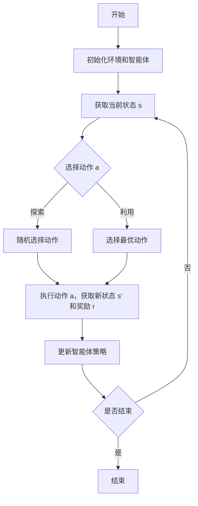

# 强化学习优化AI推理的探索与利用平衡策略设计

> 关键词：强化学习、AI推理、探索与利用平衡、策略设计、优化

> 摘要：本文聚焦于强化学习在优化AI推理过程中探索与利用平衡策略的设计。首先介绍了相关背景知识，包括目的范围、预期读者等。接着阐述了核心概念及其联系，详细讲解了核心算法原理和具体操作步骤，并辅以Python代码。深入探讨了数学模型和公式，通过举例说明其应用。进行项目实战，给出开发环境搭建、源代码实现与解读。分析了实际应用场景，推荐了学习资源、开发工具框架和相关论文著作。最后总结了未来发展趋势与挑战，解答常见问题并提供扩展阅读和参考资料，旨在为研究者和开发者提供全面的技术指导。

## 1. 背景介绍 
### 1.1 目的和范围
在AI推理领域，如何高效地利用已知信息并同时探索新的可能是一个关键问题。强化学习作为一种强大的机器学习方法，为解决这一问题提供了有效的途径。本文的目的在于深入探讨如何通过强化学习设计优化AI推理中探索与利用的平衡策略。范围涵盖从核心概念的介绍、算法原理的分析、数学模型的建立，到实际项目的实现和应用场景的探讨，为相关研究者和开发者提供全面的技术参考。

### 1.2 预期读者
本文预期读者包括从事人工智能、机器学习研究的科研人员，对强化学习和AI推理感兴趣的开发者，以及相关专业的学生。希望通过本文的内容，能帮助他们深入理解强化学习在优化AI推理中探索与利用平衡的重要性和方法。

### 1.3 文档结构概述
本文将按照以下结构展开：首先介绍相关背景知识，包括目的、预期读者和文档结构等；接着阐述核心概念与联系，给出原理和架构的示意图和流程图；详细讲解核心算法原理和具体操作步骤，并使用Python代码进行说明；深入分析数学模型和公式，通过举例加深理解；进行项目实战，包括开发环境搭建、源代码实现和解读；探讨实际应用场景；推荐学习资源、开发工具框架和相关论文著作；最后总结未来发展趋势与挑战，解答常见问题并提供扩展阅读和参考资料。

### 1.4 术语表
#### 1.4.1 核心术语定义
- **强化学习（Reinforcement Learning）**：一种机器学习范式，智能体通过与环境进行交互，根据环境反馈的奖励信号来学习最优行为策略。
- **AI推理（AI Inference）**：利用训练好的AI模型对新的数据进行预测和决策的过程。
- **探索（Exploration）**：智能体尝试不同的行为，以发现更多的环境信息和潜在的最优策略。
- **利用（Exploitation）**：智能体选择当前已知的最优行为，以最大化即时奖励。
- **平衡策略（Balance Strategy）**：在探索和利用之间找到合适的权衡，以实现长期的最优性能。

#### 1.4.2 相关概念解释
- **智能体（Agent）**：在强化学习中，智能体是执行动作并与环境进行交互的实体。
- **环境（Environment）**：智能体所处的外部世界，它接收智能体的动作并返回状态和奖励。
- **状态（State）**：环境在某一时刻的描述，智能体根据状态来选择动作。
- **动作（Action）**：智能体在某一状态下可以采取的行为。
- **奖励（Reward）**：环境对智能体动作的反馈，用于指导智能体学习最优策略。

#### 1.4.3 缩略词列表
- **Q-learning**：一种基于值函数的强化学习算法。
- **SARSA**：一种基于策略的强化学习算法。
- **MDP**：马尔可夫决策过程（Markov Decision Process），是强化学习的数学基础。

## 2. 核心概念与联系 

### 核心概念原理
在强化学习优化AI推理的过程中，探索与利用平衡是关键。探索的目的是为了发现新的、可能更优的策略，而利用则是利用已经掌握的信息来获取即时奖励。这两者之间存在着矛盾，如果只注重探索，可能会浪费大量的时间和资源，而只注重利用，则可能陷入局部最优解。因此，需要设计一种平衡策略来协调这两者的关系。

核心的原理基于马尔可夫决策过程（MDP）。MDP是一个五元组 $(S, A, P, R, \gamma)$，其中 $S$ 是状态集合，$A$ 是动作集合，$P$ 是状态转移概率，$R$ 是奖励函数，$\gamma$ 是折扣因子。智能体在每个时间步根据当前状态 $s_t \in S$ 选择一个动作 $a_t \in A$，环境根据状态转移概率 $P(s_{t+1}|s_t, a_t)$ 转移到下一个状态 $s_{t+1}$，并给予智能体一个奖励 $R(s_t, a_t, s_{t+1})$。智能体的目标是最大化长期累积奖励 $G_t = \sum_{k=0}^{\infty} \gamma^k R(s_{t+k}, a_{t+k}, s_{t+k+1})$。

### 架构的文本示意图
```plaintext
智能体 <-> 环境
|
| 动作选择（探索与利用平衡策略）
|
| 状态感知
|
| 奖励反馈
```
智能体与环境进行交互，根据探索与利用平衡策略选择动作，感知环境的状态，并接收环境给予的奖励。通过不断的交互，智能体学习到最优的行为策略。

### Mermaid 流程图


## 3. 核心算法原理 & 具体操作步骤 

### 核心算法原理
#### Q-learning
Q-learning 是一种基于值函数的强化学习算法，其核心思想是学习一个动作价值函数 $Q(s, a)$，表示在状态 $s$ 下采取动作 $a$ 的预期累积奖励。Q-learning 的更新公式为：
$$Q(s_t, a_t) \leftarrow Q(s_t, a_t) + \alpha [r_{t+1} + \gamma \max_{a} Q(s_{t+1}, a) - Q(s_t, a_t)]$$
其中，$\alpha$ 是学习率，$\gamma$ 是折扣因子，$r_{t+1}$ 是在状态 $s_t$ 采取动作 $a_t$ 后获得的奖励，$s_{t+1}$ 是下一个状态。

#### SARSA
SARSA 是一种基于策略的强化学习算法，与 Q-learning 不同的是，它使用实际采取的下一个动作来更新动作价值函数。SARSA 的更新公式为：
$$Q(s_t, a_t) \leftarrow Q(s_t, a_t) + \alpha [r_{t+1} + \gamma Q(s_{t+1}, a_{t+1}) - Q(s_t, a_t)]$$
其中，$a_{t+1}$ 是在状态 $s_{t+1}$ 实际采取的动作。

### 具体操作步骤
#### 初始化
- 初始化环境和智能体，包括状态空间 $S$、动作空间 $A$、动作价值函数 $Q(s, a)$、学习率 $\alpha$、折扣因子 $\gamma$ 等。

#### 循环迭代
- 对于每个时间步 $t$：
  - 获取当前状态 $s_t$。
  - 根据探索与利用平衡策略选择动作 $a_t$。常见的策略有 $\epsilon$-贪心策略，即以概率 $\epsilon$ 随机选择动作（探索），以概率 $1 - \epsilon$ 选择当前最优动作（利用）。
  - 执行动作 $a_t$，环境返回新状态 $s_{t+1}$ 和奖励 $r_{t+1}$。
  - 根据所选的算法（Q-learning 或 SARSA）更新动作价值函数 $Q(s_t, a_t)$。
  - 判断是否达到终止条件，如果是则结束循环，否则继续下一个时间步。

### Python 代码实现
```python
import numpy as np

# 定义环境
class Environment:
    def __init__(self, num_states, num_actions):
        self.num_states = num_states
        self.num_actions = num_actions

    def step(self, state, action):
        # 简单示例，随机转移到下一个状态并返回奖励
        next_state = np.random.randint(self.num_states)
        reward = np.random.randn()
        return next_state, reward

# 定义智能体
class Agent:
    def __init__(self, num_states, num_actions, alpha=0.1, gamma=0.9, epsilon=0.1):
        self.num_states = num_states
        self.num_actions = num_actions
        self.alpha = alpha
        self.gamma = gamma
        self.epsilon = epsilon
        self.Q = np.zeros((num_states, num_actions))

    def choose_action(self, state):
        if np.random.uniform(0, 1) < self.epsilon:
            # 探索：随机选择动作
            action = np.random.randint(self.num_actions)
        else:
            # 利用：选择最优动作
            action = np.argmax(self.Q[state, :])
        return action

    def update_q_learning(self, state, action, next_state, reward):
        # Q-learning 更新公式
        max_q_next = np.max(self.Q[next_state, :])
        self.Q[state, action] += self.alpha * (reward + self.gamma * max_q_next - self.Q[state, action])

    def update_sarsa(self, state, action, next_state, next_action, reward):
        # SARSA 更新公式
        q_next = self.Q[next_state, next_action]
        self.Q[state, action] += self.alpha * (reward + self.gamma * q_next - self.Q[state, action])

# 主程序
if __name__ == "__main__":
    num_states = 10
    num_actions = 4
    env = Environment(num_states, num_actions)
    agent = Agent(num_states, num_actions)

    num_episodes = 1000
    for episode in range(num_episodes):
        state = np.random.randint(num_states)
        done = False
        while not done:
            action = agent.choose_action(state)
            next_state, reward = env.step(state, action)
            # 使用 Q-learning 更新
            agent.update_q_learning(state, action, next_state, reward)
            state = next_state
            # 简单示例，假设达到某个状态就结束
            if state == 5:
                done = True
```

## 4. 数学模型和公式 & 详细讲解 & 举例说明 

### 马尔可夫决策过程（MDP）
MDP 是强化学习的数学基础，其定义为一个五元组 $(S, A, P, R, \gamma)$。

- **状态集合 $S$**：表示环境所有可能的状态。例如，在一个网格世界中，每个网格的位置就是一个状态，状态集合就是所有网格位置的集合。
- **动作集合 $A$**：表示智能体在每个状态下可以采取的动作。例如，在网格世界中，动作可以是上下左右移动。
- **状态转移概率 $P$**：$P(s_{t+1}|s_t, a_t)$ 表示在状态 $s_t$ 采取动作 $a_t$ 后转移到状态 $s_{t+1}$ 的概率。例如，在一个有风的网格世界中，智能体选择向右移动，但由于风的影响，可能有一定概率移动到其他位置。
- **奖励函数 $R$**：$R(s_t, a_t, s_{t+1})$ 表示在状态 $s_t$ 采取动作 $a_t$ 转移到状态 $s_{t+1}$ 时获得的奖励。例如，在网格世界中，到达目标位置获得正奖励，撞到障碍物获得负奖励。
- **折扣因子 $\gamma$**：$\gamma \in [0, 1]$ 用于衡量未来奖励的重要性。$\gamma$ 越接近 1，表示更重视未来的奖励；$\gamma$ 越接近 0，表示更重视即时奖励。

### 动作价值函数 $Q(s, a)$
动作价值函数 $Q(s, a)$ 表示在状态 $s$ 下采取动作 $a$ 的预期累积奖励。其定义为：
$$Q(s, a) = \mathbb{E}[G_t | s_t = s, a_t = a]$$
其中，$G_t = \sum_{k=0}^{\infty} \gamma^k R(s_{t+k}, a_{t+k}, s_{t+k+1})$ 是从时间步 $t$ 开始的长期累积奖励。

### Q-learning 更新公式推导
Q-learning 的目标是让动作价值函数 $Q(s, a)$ 收敛到最优动作价值函数 $Q^*(s, a)$。根据贝尔曼方程，最优动作价值函数满足：
$$Q^*(s, a) = \mathbb{E}[R(s, a, s') + \gamma \max_{a'} Q^*(s', a')]$$
Q-learning 使用时间差分（TD）学习的思想，通过不断更新 $Q(s, a)$ 来逼近 $Q^*(s, a)$。更新公式为：
$$Q(s_t, a_t) \leftarrow Q(s_t, a_t) + \alpha [r_{t+1} + \gamma \max_{a} Q(s_{t+1}, a) - Q(s_t, a_t)]$$
其中，$r_{t+1} + \gamma \max_{a} Q(s_{t+1}, a)$ 是目标值，$Q(s_t, a_t)$ 是当前估计值，$\alpha$ 是学习率，用于控制每次更新的步长。

### 举例说明
假设我们有一个简单的网格世界，如下所示：
```plaintext
+---+---+---+
| S |   | G |
+---+---+---+
|   | X |   |
+---+---+---+
|   |   |   |
+---+---+---+
```
其中，$S$ 是起始位置，$G$ 是目标位置，$X$ 是障碍物。状态集合 $S$ 是所有网格位置，动作集合 $A$ 是上下左右移动。奖励函数为：到达目标位置获得 +10 奖励，撞到障碍物获得 -1 奖励，其他情况获得 -0.1 奖励。

假设智能体从起始位置 $S$ 开始，当前状态 $s_t$ 是 $S$，选择动作 $a_t$ 向右移动，到达新状态 $s_{t+1}$ 后获得奖励 $r_{t+1} = -0.1$。假设当前的动作价值函数 $Q(s_t, a_t) = 0$，学习率 $\alpha = 0.1$，折扣因子 $\gamma = 0.9$。

根据 Q-learning 更新公式：
$$Q(s_t, a_t) \leftarrow Q(s_t, a_t) + \alpha [r_{t+1} + \gamma \max_{a} Q(s_{t+1}, a) - Q(s_t, a_t)]$$
假设 $\max_{a} Q(s_{t+1}, a) = 1$，则：
$$Q(s_t, a_t) = 0 + 0.1 [-0.1 + 0.9 \times 1 - 0] = 0 + 0.1 \times 0.8 = 0.08$$

## 5. 项目实战：代码实际案例和详细解释说明 

### 5.1  开发环境搭建
#### 安装 Python
首先需要安装 Python，建议使用 Python 3.7 及以上版本。可以从 Python 官方网站（https://www.python.org/downloads/）下载并安装。

#### 安装必要的库
使用 `pip` 安装必要的库，如 `numpy`：
```sh
pip install numpy
```

### 5.2  源代码详细实现和代码解读
```python
import numpy as np

# 定义环境
class Environment:
    def __init__(self, num_states, num_actions):
        self.num_states = num_states
        self.num_actions = num_actions

    def step(self, state, action):
        # 简单示例，随机转移到下一个状态并返回奖励
        next_state = np.random.randint(self.num_states)
        reward = np.random.randn()
        return next_state, reward

# 定义智能体
class Agent:
    def __init__(self, num_states, num_actions, alpha=0.1, gamma=0.9, epsilon=0.1):
        self.num_states = num_states
        self.num_actions = num_actions
        self.alpha = alpha
        self.gamma = gamma
        self.epsilon = epsilon
        self.Q = np.zeros((num_states, num_actions))

    def choose_action(self, state):
        if np.random.uniform(0, 1) < self.epsilon:
            # 探索：随机选择动作
            action = np.random.randint(self.num_actions)
        else:
            # 利用：选择最优动作
            action = np.argmax(self.Q[state, :])
        return action

    def update_q_learning(self, state, action, next_state, reward):
        # Q-learning 更新公式
        max_q_next = np.max(self.Q[next_state, :])
        self.Q[state, action] += self.alpha * (reward + self.gamma * max_q_next - self.Q[state, action])

    def update_sarsa(self, state, action, next_state, next_action, reward):
        # SARSA 更新公式
        q_next = self.Q[next_state, next_action]
        self.Q[state, action] += self.alpha * (reward + self.gamma * q_next - self.Q[state, action])

# 主程序
if __name__ == "__main__":
    num_states = 10
    num_actions = 4
    env = Environment(num_states, num_actions)
    agent = Agent(num_states, num_actions)

    num_episodes = 1000
    for episode in range(num_episodes):
        state = np.random.randint(num_states)
        done = False
        while not done:
            action = agent.choose_action(state)
            next_state, reward = env.step(state, action)
            # 使用 Q-learning 更新
            agent.update_q_learning(state, action, next_state, reward)
            state = next_state
            # 简单示例，假设达到某个状态就结束
            if state == 5:
                done = True
```

### 代码解读与分析
#### 环境类 `Environment`
- `__init__` 方法：初始化环境的状态数量和动作数量。
- `step` 方法：根据当前状态和动作，随机转移到下一个状态并返回奖励。在实际应用中，这个方法需要根据具体的环境规则实现。

#### 智能体类 `Agent`
- `__init__` 方法：初始化智能体的状态数量、动作数量、学习率、折扣因子、探索率和动作价值函数 $Q$。
- `choose_action` 方法：根据 $\epsilon$-贪心策略选择动作。以概率 $\epsilon$ 随机选择动作进行探索，以概率 $1 - \epsilon$ 选择当前最优动作进行利用。
- `update_q_learning` 方法：使用 Q-learning 更新公式更新动作价值函数 $Q$。
- `update_sarsa` 方法：使用 SARSA 更新公式更新动作价值函数 $Q$。

#### 主程序
- 初始化环境和智能体。
- 进行多个回合的训练，每个回合中智能体与环境进行交互，根据选择的动作更新动作价值函数，直到达到终止条件。

## 6. 实际应用场景 
### 游戏领域
在游戏中，智能体需要在探索新的策略和利用已有的经验之间找到平衡。例如，在围棋游戏中，AI 选手需要不断探索新的落子位置，以发现更好的策略，同时也要利用已有的经验来应对当前的局面。通过强化学习优化探索与利用平衡策略，可以提高 AI 选手的游戏水平。

### 机器人控制
在机器人控制中，机器人需要在未知环境中探索新的路径和动作，同时也要利用已有的信息来完成任务。例如，在自动驾驶领域，车辆需要不断探索新的路况和驾驶策略，同时也要利用已有的经验来保证行驶的安全和高效。通过强化学习优化探索与利用平衡策略，可以提高机器人的适应性和智能水平。

### 资源管理
在资源管理中，需要在探索新的资源分配方案和利用已有的最优方案之间找到平衡。例如，在云计算中，需要根据不同的任务需求和资源状态，动态地分配计算资源。通过强化学习优化探索与利用平衡策略，可以提高资源的利用率和系统的性能。

## 7. 工具和资源推荐
### 7.1 学习资源推荐
#### 7.1.1 书籍推荐
- 《强化学习：原理与Python实现》：这本书详细介绍了强化学习的基本原理和算法，并通过 Python 代码进行了实现，适合初学者入门。
- 《Reinforcement Learning: An Introduction》：这是强化学习领域的经典教材，由 Richard S. Sutton 和 Andrew G. Barto 所著，全面介绍了强化学习的理论和方法。

#### 7.1.2 在线课程
- Coursera 上的 “Reinforcement Learning Specialization”：由 University of Alberta 提供，包含多个强化学习的课程，从基础到高级都有涉及。
- edX 上的 “Introduction to Reinforcement Learning”：由 Massachusetts Institute of Technology (MIT) 提供，介绍了强化学习的基本概念和算法。

#### 7.1.3 技术博客和网站
- OpenAI Blog：OpenAI 发布的关于人工智能和强化学习的最新研究成果和应用案例。
- Towards Data Science：一个数据科学和机器学习的博客平台，有很多关于强化学习的文章和教程。

### 7.2 开发工具框架推荐
#### 7.2.1 IDE和编辑器
- PyCharm：一个功能强大的 Python IDE，支持代码调试、代码分析等功能，适合开发强化学习项目。
- Jupyter Notebook：一个交互式的开发环境，适合进行实验和数据分析，常用于强化学习的算法实现和验证。

#### 7.2.2 调试和性能分析工具
- TensorBoard：一个用于可视化深度学习模型训练过程的工具，可以用于查看强化学习中的奖励曲线、动作价值函数等信息。
- cProfile：Python 内置的性能分析工具，可以用于分析强化学习代码的性能瓶颈。

#### 7.2.3 相关框架和库
- OpenAI Gym：一个用于开发和比较强化学习算法的工具包，提供了多种环境和基准测试。
- Stable Baselines3：一个基于 PyTorch 的强化学习库，提供了多种预训练的强化学习算法和模型。

### 7.3 相关论文著作推荐
#### 7.3.1 经典论文
- “Q-learning”：由 Christopher J. C. H. Watkins 和 Peter Dayan 发表，提出了 Q-learning 算法，是强化学习领域的经典论文。
- “Learning to Predict by the Methods of Temporal Differences”：由 Richard S. Sutton 发表，介绍了时间差分学习的方法，是强化学习的重要理论基础。

#### 7.3.2 最新研究成果
- 关注顶级人工智能会议，如 NeurIPS、ICML、AAAI 等，这些会议上会发表很多关于强化学习的最新研究成果。

#### 7.3.3 应用案例分析
- 可以参考一些实际应用中的案例分析，如 Google DeepMind 在游戏、机器人控制等领域的应用案例，了解强化学习在实际场景中的应用和优化方法。

## 8. 总结：未来发展趋势与挑战
### 未来发展趋势
- **结合深度学习**：强化学习与深度学习的结合将是未来的一个重要发展趋势。深度学习可以用于处理复杂的感知任务，如图像、语音等，而强化学习可以用于决策和控制。通过将两者结合，可以实现更强大的智能体。
- **多智能体强化学习**：在现实世界中，很多任务需要多个智能体之间的协作和竞争。多智能体强化学习将研究如何让多个智能体在同一环境中学习和交互，以实现共同的目标。
- **应用领域拓展**：强化学习将在更多的领域得到应用，如医疗、金融、交通等。通过优化探索与利用平衡策略，可以提高这些领域的决策效率和性能。

### 挑战
- **样本效率问题**：强化学习通常需要大量的样本进行训练，样本效率较低。如何提高样本效率，减少训练时间和资源消耗，是一个亟待解决的问题。
- **可解释性问题**：强化学习模型通常是黑盒模型，难以解释其决策过程。在一些对可解释性要求较高的领域，如医疗、金融等，需要提高强化学习模型的可解释性。
- **环境不确定性问题**：在现实世界中，环境往往是不确定的，存在噪声和干扰。如何让智能体在不确定的环境中学习和决策，是一个具有挑战性的问题。

## 9. 附录：常见问题与解答
### 问题 1：如何选择合适的探索率 $\epsilon$？
解答：探索率 $\epsilon$ 的选择需要根据具体的问题和环境来确定。一般来说，在训练初期，可以选择较大的 $\epsilon$ 值，以鼓励智能体进行更多的探索；随着训练的进行，可以逐渐减小 $\epsilon$ 值，让智能体更多地利用已有的经验。常见的方法是使用衰减的 $\epsilon$ 策略，如 $\epsilon = \frac{\epsilon_0}{1 + \alpha t}$，其中 $\epsilon_0$ 是初始探索率，$\alpha$ 是衰减系数，$t$ 是训练步数。

### 问题 2：Q-learning 和 SARSA 有什么区别？
解答：Q-learning 是一种基于值函数的算法，它使用 $\max_{a} Q(s_{t+1}, a)$ 来更新动作价值函数，即总是选择下一个状态的最优动作。而 SARSA 是一种基于策略的算法，它使用实际采取的下一个动作 $a_{t+1}$ 来更新动作价值函数。Q-learning 更具有探索性，而 SARSA 更保守，更注重已有的策略。

### 问题 3：如何处理连续状态和动作空间？
解答：对于连续状态和动作空间，可以使用函数逼近的方法，如神经网络。将状态作为输入，动作价值函数或策略作为输出，通过训练神经网络来学习最优的动作价值函数或策略。常见的方法有深度 Q 网络（DQN）、深度确定性策略梯度（DDPG）等。

## 10. 扩展阅读 & 参考资料
### 扩展阅读
- 《Deep Reinforcement Learning Hands-On》：这本书深入介绍了深度强化学习的理论和实践，包括各种深度强化学习算法和应用案例。
- 《Algorithms for Reinforcement Learning》：这本书详细介绍了强化学习的各种算法，包括动态规划、蒙特卡罗方法、时间差分学习等。

### 参考资料
- Sutton, R. S., & Barto, A. G. (2018). Reinforcement Learning: An Introduction. MIT Press.
- Watkins, C. J. C. H., & Dayan, P. (1992). Q-learning. Machine learning, 8(3-4), 279-292.
- Mnih, V., et al. (2015). Human-level control through deep reinforcement learning. Nature, 518(7540), 529-533.

作者：AI天才研究院/AI Genius Institute & 禅与计算机程序设计艺术 /Zen And The Art of Computer Programming