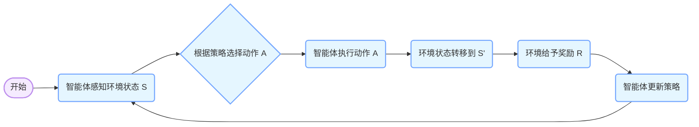

# 强化学习在AI Agent交互策略优化中的运用

> 关键词：强化学习、AI Agent、交互策略优化、马尔可夫决策过程、Q学习算法

> 摘要：本文深入探讨了强化学习在AI Agent交互策略优化中的运用。首先介绍了强化学习和AI Agent的背景知识，包括目的、预期读者和文档结构等。接着详细阐述了核心概念，如马尔可夫决策过程等，并给出了相应的原理和架构示意图。然后讲解了核心算法原理，用Python代码进行了详细说明。通过数学模型和公式进一步分析强化学习的理论基础，并举例说明。在项目实战部分，给出了开发环境搭建、源代码实现及解读。同时介绍了强化学习在不同领域的实际应用场景，推荐了相关的学习资源、开发工具框架和论文著作。最后总结了未来发展趋势与挑战，并提供了常见问题解答和扩展阅读参考资料。

## 1. 背景介绍 
### 1.1 目的和范围
强化学习作为机器学习的一个重要分支，在AI Agent的交互策略优化中有着广泛的应用。本文章的目的在于深入剖析强化学习如何应用于AI Agent的交互策略优化，从理论原理到实际应用进行全面的阐述。范围涵盖强化学习的基本概念、核心算法、数学模型，以及在不同场景下的项目实战，为读者提供一个系统的学习和参考。

### 1.2 预期读者
本文预期读者包括对人工智能、机器学习有一定基础的技术人员，如程序员、数据科学家、软件工程师等；也适合正在学习相关领域知识的学生，希望通过本文深入了解强化学习在AI Agent交互策略优化中的具体应用；同时，对于对人工智能发展趋势感兴趣的行业从业者和研究者也有一定的参考价值。

### 1.3 文档结构概述
本文首先介绍背景知识，让读者对强化学习和AI Agent有初步的了解。接着阐述核心概念和联系，明确相关概念的原理和架构。然后详细讲解核心算法原理和具体操作步骤，并用Python代码进行说明。通过数学模型和公式进一步深化理论理解，并举例说明。项目实战部分给出实际案例和详细解释。之后介绍实际应用场景，推荐相关的工具和资源。最后总结未来发展趋势与挑战，提供常见问题解答和扩展阅读参考资料。

### 1.4 术语表
#### 1.4.1 核心术语定义
- **强化学习（Reinforcement Learning）**：一种机器学习范式，智能体（Agent）通过与环境进行交互，根据环境反馈的奖励信号来学习最优的行为策略。
- **AI Agent（人工智能智能体）**：能够感知环境，根据内部的策略做出决策并执行动作的智能实体。
- **策略（Policy）**：智能体在给定状态下选择动作的规则。
- **奖励（Reward）**：环境在智能体执行动作后给予的反馈信号，用于评估动作的好坏。
- **状态（State）**：环境在某一时刻的描述，智能体根据状态来决定采取的动作。

#### 1.4.2 相关概念解释
- **马尔可夫决策过程（Markov Decision Process，MDP）**：是强化学习的数学基础，描述了智能体与环境交互的动态过程，具有马尔可夫性，即未来的状态只取决于当前状态和动作，而与过去的历史无关。
- **Q学习（Q - Learning）**：一种无模型的强化学习算法，通过学习动作价值函数Q来找到最优策略。

#### 1.4.3 缩略词列表
- **MDP**：Markov Decision Process（马尔可夫决策过程）
- **Q - Learning**：Q学习
- **AI**：Artificial Intelligence（人工智能）

## 2. 核心概念与联系 
### 核心概念原理
#### 马尔可夫决策过程（MDP）
马尔可夫决策过程是一个五元组 $\langle S, A, P, R, \gamma \rangle$，其中：
- $S$ 是有限的状态集合，表示环境可能处于的所有状态。
- $A$ 是有限的动作集合，表示智能体可以采取的所有动作。
- $P(s'|s, a)$ 是状态转移概率，表示在状态 $s$ 下采取动作 $a$ 后转移到状态 $s'$ 的概率。
- $R(s, a, s')$ 是奖励函数，表示在状态 $s$ 下采取动作 $a$ 并转移到状态 $s'$ 时获得的奖励。
- $\gamma \in [0, 1]$ 是折扣因子，用于权衡即时奖励和未来奖励的重要性。

智能体的目标是找到一个最优策略 $\pi^*$，使得长期累积奖励最大化。策略 $\pi$ 定义为从状态到动作的映射，即 $\pi(a|s)$ 表示在状态 $s$ 下采取动作 $a$ 的概率。

#### Q学习
Q学习是一种基于值函数的强化学习算法，其核心是学习动作价值函数 $Q(s, a)$，表示在状态 $s$ 下采取动作 $a$ 后能获得的期望累积奖励。Q学习的更新公式为：
$$Q(s_t, a_t) \leftarrow Q(s_t, a_t) + \alpha [r_{t + 1} + \gamma \max_{a} Q(s_{t + 1}, a) - Q(s_t, a_t)]$$
其中，$\alpha$ 是学习率，$r_{t + 1}$ 是在时刻 $t + 1$ 获得的奖励，$\gamma$ 是折扣因子。

### 架构的文本示意图
```plaintext
智能体 (Agent)
|
|-- 策略 (Policy)
|       |-- 根据状态选择动作
|
|-- 动作 (Action)
|       |-- 作用于环境
|
环境 (Environment)
|
|-- 状态 (State)
|       |-- 反馈给智能体
|
|-- 奖励 (Reward)
|       |-- 反馈给智能体
```

### Mermaid 流程图


## 3. 核心算法原理 & 具体操作步骤 
### Q学习算法原理
Q学习算法的目标是学习最优的动作价值函数 $Q(s, a)$，从而找到最优策略。其基本思想是通过不断地与环境交互，根据环境反馈的奖励来更新 $Q$ 值。

### 具体操作步骤
1. **初始化**：初始化所有的 $Q(s, a)$ 值为 0，设置学习率 $\alpha$、折扣因子 $\gamma$ 和探索率 $\epsilon$。
2. **选择动作**：在状态 $s$ 下，根据 $\epsilon$-贪心策略选择动作 $a$。以 $\epsilon$ 的概率随机选择一个动作，以 $1 - \epsilon$ 的概率选择 $Q(s, \cdot)$ 最大的动作。
3. **执行动作**：智能体执行动作 $a$，环境转移到新的状态 $s'$，并给予奖励 $r$。
4. **更新 $Q$ 值**：根据 Q学习的更新公式更新 $Q(s, a)$ 的值。
5. **重复步骤2 - 4**：直到达到终止条件，如达到最大步数或收敛。

### Python源代码实现
```python
import numpy as np

class QLearningAgent:
    def __init__(self, state_size, action_size, learning_rate=0.1, discount_factor=0.9, exploration_rate=0.1):
        self.state_size = state_size
        self.action_size = action_size
        self.learning_rate = learning_rate
        self.discount_factor = discount_factor
        self.exploration_rate = exploration_rate
        self.q_table = np.zeros((state_size, action_size))

    def choose_action(self, state):
        if np.random.uniform(0, 1) < self.exploration_rate:
            # 随机选择动作
            action = np.random.choice(self.action_size)
        else:
            # 选择 Q 值最大的动作
            action = np.argmax(self.q_table[state, :])
        return action

    def update_q_table(self, state, action, reward, next_state):
        # Q 学习更新公式
        max_q_next = np.max(self.q_table[next_state, :])
        self.q_table[state, action] = (1 - self.learning_rate) * self.q_table[state, action] + \
                                      self.learning_rate * (reward + self.discount_factor * max_q_next)
```

### 代码解释
- `__init__` 方法：初始化智能体的状态大小、动作大小、学习率、折扣因子、探索率和 Q 表。
- `choose_action` 方法：根据 $\epsilon$-贪心策略选择动作。
- `update_q_table` 方法：根据 Q 学习的更新公式更新 Q 表。

## 4. 数学模型和公式 & 详细讲解 & 举例说明 
### 马尔可夫决策过程（MDP）的数学模型
马尔可夫决策过程可以用以下数学模型表示：
- 状态转移概率：$P(s'|s, a)$ 满足 $\sum_{s' \in S} P(s'|s, a) = 1$，表示在状态 $s$ 下采取动作 $a$ 后，必然会转移到某个状态 $s'$。
- 奖励函数：$R(s, a, s')$ 表示在状态 $s$ 下采取动作 $a$ 并转移到状态 $s'$ 时获得的奖励。
- 策略：$\pi(a|s)$ 表示在状态 $s$ 下采取动作 $a$ 的概率，且 $\sum_{a \in A} \pi(a|s) = 1$。

智能体的目标是最大化长期累积奖励，定义为：
$$G_t = \sum_{k = 0}^{\infty} \gamma^k r_{t + k + 1}$$
其中，$r_{t + k + 1}$ 是在时刻 $t + k + 1$ 获得的奖励，$\gamma$ 是折扣因子。

### Q学习的数学公式
Q学习的更新公式为：
$$Q(s_t, a_t) \leftarrow Q(s_t, a_t) + \alpha [r_{t + 1} + \gamma \max_{a} Q(s_{t + 1}, a) - Q(s_t, a_t)]$$
详细解释如下：
- $Q(s_t, a_t)$ 是当前状态 $s_t$ 下采取动作 $a_t$ 的 Q 值。
- $\alpha$ 是学习率，控制每次更新的步长。
- $r_{t + 1}$ 是在时刻 $t + 1$ 获得的即时奖励。
- $\gamma$ 是折扣因子，用于权衡即时奖励和未来奖励的重要性。
- $\max_{a} Q(s_{t + 1}, a)$ 是下一个状态 $s_{t + 1}$ 下所有动作的最大 Q 值。

### 举例说明
假设有一个简单的网格世界，智能体的目标是从起点走到终点。状态 $s$ 表示智能体在网格中的位置，动作 $a$ 包括上下左右移动。奖励设置为：到达终点获得奖励 10，撞到墙壁获得奖励 -1，其他情况获得奖励 0。

初始时，Q 表中的所有值都为 0。智能体在状态 $s_1$ 下选择动作 $a_1$ 向右移动，到达状态 $s_2$，获得奖励 0。假设学习率 $\alpha = 0.1$，折扣因子 $\gamma = 0.9$，则根据 Q 学习的更新公式：
$$Q(s_1, a_1) \leftarrow Q(s_1, a_1) + 0.1 [0 + 0.9 \max_{a} Q(s_2, a) - Q(s_1, a_1)]$$

如果 $\max_{a} Q(s_2, a) = 0$，则 $Q(s_1, a_1)$ 的更新值为：
$$Q(s_1, a_1) = (1 - 0.1) \times 0 + 0.1 \times (0 + 0.9 \times 0 - 0) = 0$$

随着智能体不断与环境交互，Q 表中的值会逐渐收敛到最优值，从而找到最优策略。

## 5. 项目实战：代码实际案例和详细解释说明 
### 5.1  开发环境搭建
#### 安装 Python
首先需要安装 Python，建议使用 Python 3.7 及以上版本。可以从 Python 官方网站（https://www.python.org/downloads/）下载安装包进行安装。

#### 安装必要的库
在项目中，我们需要使用 `numpy` 库进行数值计算。可以使用以下命令进行安装：
```sh
pip install numpy
```

### 5.2  源代码详细实现和代码解读
```python
import numpy as np

# 定义环境
class GridWorld:
    def __init__(self, grid_size=4):
        self.grid_size = grid_size
        self.num_states = grid_size * grid_size
        self.num_actions = 4  # 上、下、左、右
        self.goal_state = self.grid_size * self.grid_size - 1
        self.state = 0

    def reset(self):
        self.state = 0
        return self.state

    def step(self, action):
        row = self.state // self.grid_size
        col = self.state % self.grid_size

        if action == 0 and row > 0:  # 上
            row -= 1
        elif action == 1 and row < self.grid_size - 1:  # 下
            row += 1
        elif action == 2 and col > 0:  # 左
            col -= 1
        elif action == 3 and col < self.grid_size - 1:  # 右
            col += 1

        next_state = row * self.grid_size + col
        reward = 10 if next_state == self.goal_state else -1 if next_state == self.state else 0
        done = next_state == self.goal_state

        self.state = next_state
        return next_state, reward, done

# 定义 Q 学习智能体
class QLearningAgent:
    def __init__(self, state_size, action_size, learning_rate=0.1, discount_factor=0.9, exploration_rate=0.1):
        self.state_size = state_size
        self.action_size = action_size
        self.learning_rate = learning_rate
        self.discount_factor = discount_factor
        self.exploration_rate = exploration_rate
        self.q_table = np.zeros((state_size, action_size))

    def choose_action(self, state):
        if np.random.uniform(0, 1) < self.exploration_rate:
            action = np.random.choice(self.action_size)
        else:
            action = np.argmax(self.q_table[state, :])
        return action

    def update_q_table(self, state, action, reward, next_state):
        max_q_next = np.max(self.q_table[next_state, :])
        self.q_table[state, action] = (1 - self.learning_rate) * self.q_table[state, action] + \
                                      self.learning_rate * (reward + self.discount_factor * max_q_next)

# 训练智能体
def train_agent(agent, env, num_episodes=1000):
    for episode in range(num_episodes):
        state = env.reset()
        done = False
        while not done:
            action = agent.choose_action(state)
            next_state, reward, done = env.step(action)
            agent.update_q_table(state, action, reward, next_state)
            state = next_state

        if episode % 100 == 0:
            print(f"Episode {episode}: Done")

# 主函数
if __name__ == "__main__":
    env = GridWorld()
    agent = QLearningAgent(state_size=env.num_states, action_size=env.num_actions)
    train_agent(agent, env)
    print("Training finished.")
```

### 代码解读与分析
#### `GridWorld` 类
- `__init__` 方法：初始化网格世界的大小、状态数量、动作数量、目标状态和当前状态。
- `reset` 方法：将智能体的状态重置为初始状态，并返回初始状态。
- `step` 方法：根据智能体选择的动作更新状态，计算奖励和判断是否到达终止状态，并返回下一个状态、奖励和终止标志。

#### `QLearningAgent` 类
- `__init__` 方法：初始化智能体的状态大小、动作大小、学习率、折扣因子、探索率和 Q 表。
- `choose_action` 方法：根据 $\epsilon$-贪心策略选择动作。
- `update_q_table` 方法：根据 Q 学习的更新公式更新 Q 表。

#### `train_agent` 函数
该函数用于训练智能体，通过多个回合（episodes）与环境进行交互，不断更新 Q 表。

#### 主函数
创建网格世界环境和 Q 学习智能体，调用 `train_agent` 函数进行训练，并输出训练完成的信息。

## 6. 实际应用场景 
### 游戏领域
在游戏中，AI Agent可以使用强化学习来优化交互策略。例如，在围棋、象棋等棋类游戏中，AI Agent通过与对手不断对弈，根据胜负结果获得奖励，学习最优的落子策略。在电子游戏中，如《星际争霸》等即时战略游戏，AI Agent可以控制游戏角色，根据游戏中的资源、敌人位置等状态信息，选择最优的行动，如建造建筑、训练部队、攻击敌人等。

### 机器人领域
机器人在执行任务时，需要与环境进行交互。例如，在机器人导航中，机器人可以使用强化学习来优化路径规划策略。根据传感器获取的环境信息，如障碍物位置、目标位置等，机器人选择合适的移动方向，通过不断尝试和学习，找到到达目标的最优路径。在机器人操作任务中，如抓取物体，机器人可以根据物体的位置、姿态等状态信息，学习最优的抓取动作。

### 自动驾驶领域
自动驾驶汽车需要在复杂的交通环境中做出决策。强化学习可以用于优化自动驾驶汽车的交互策略，如根据交通信号、其他车辆和行人的状态，选择合适的行驶速度、车道变更等动作。通过模拟不同的交通场景进行训练，自动驾驶汽车可以学习到在各种情况下的最优驾驶策略，提高行车安全性和效率。

### 推荐系统领域
在推荐系统中，AI Agent可以根据用户的历史行为和反馈，优化推荐策略。例如，根据用户的浏览记录、购买记录等状态信息，推荐系统选择合适的商品或内容进行推荐。通过用户的点击、购买等行为获得奖励，不断调整推荐策略，提高推荐的准确性和用户满意度。

## 7. 工具和资源推荐
### 7.1 学习资源推荐
#### 7.1.1 书籍推荐
- 《强化学习：原理与Python实现》：本书系统地介绍了强化学习的基本概念、算法和应用，通过Python代码实现了多种强化学习算法，适合初学者入门。
- 《Reinforcement Learning: An Introduction》：由Richard S. Sutton和Andrew G. Barto所著，是强化学习领域的经典教材，全面深入地介绍了强化学习的理论和方法。

#### 7.1.2 在线课程
- Coursera上的“Reinforcement Learning Specialization”：由阿尔伯塔大学的教授授课，提供了从基础到高级的强化学习课程，包括理论讲解和实践项目。
- edX上的“Introduction to Reinforcement Learning”：由麻省理工学院的教授授课，介绍了强化学习的基本概念和算法。

#### 7.1.3 技术博客和网站
- OpenAI Blog：OpenAI发布的关于人工智能和强化学习的最新研究成果和应用案例。
- DeepMind Blog：DeepMind发布的关于强化学习和人工智能的前沿研究和技术文章。

### 7.2 开发工具框架推荐
#### 7.2.1 IDE和编辑器
- PyCharm：一款功能强大的Python集成开发环境，提供了代码编辑、调试、代码分析等功能，适合开发强化学习项目。
- Jupyter Notebook：一种交互式的开发环境，可以方便地进行代码编写、数据可视化和文档撰写，适合进行强化学习算法的实验和验证。

#### 7.2.2 调试和性能分析工具
- TensorBoard：TensorFlow提供的可视化工具，可以用于可视化强化学习训练过程中的指标，如损失函数、奖励曲线等，帮助调试和分析模型性能。
- Py-Spy：一个轻量级的Python性能分析工具，可以用于分析强化学习代码的性能瓶颈。

#### 7.2.3 相关框架和库
- OpenAI Gym：一个开源的强化学习环境库，提供了多种不同类型的环境，如游戏、机器人等，方便进行强化学习算法的测试和验证。
- Stable Baselines：一个基于TensorFlow的强化学习库，提供了多种预训练的强化学习算法，如A2C、PPO等，可以方便地进行强化学习项目的开发。

### 7.3 相关论文著作推荐
#### 7.3.1 经典论文
- “Q - learning”：由Christopher J. C. H. Watkins和Peter Dayan发表，介绍了Q学习算法，是强化学习领域的经典论文。
- “Policy Gradient Methods for Reinforcement Learning with Function Approximation”：由Richard S. Sutton等人发表，介绍了策略梯度方法，为强化学习的发展奠定了基础。

#### 7.3.2 最新研究成果
- 关注NeurIPS、ICML、AAAI等顶级人工智能会议的论文，了解强化学习领域的最新研究动态和成果。
- 查阅相关学术期刊，如Journal of Artificial Intelligence Research（JAIR）、Artificial Intelligence等。

#### 7.3.3 应用案例分析
- 研究AlphaGo、AlphaZero等强化学习在游戏领域的应用案例，了解如何将强化学习应用于复杂的决策问题。
- 分析自动驾驶汽车、机器人等领域的实际应用案例，学习如何在实际场景中优化AI Agent的交互策略。

## 8. 总结：未来发展趋势与挑战
### 未来发展趋势
- **结合深度学习**：强化学习与深度学习的结合将成为未来的发展趋势。深度强化学习可以处理更复杂的状态和动作空间，如在图像、语音等领域的应用。例如，深度Q网络（DQN）将卷积神经网络与Q学习相结合，在游戏领域取得了显著的成果。
- **多智能体强化学习**：在实际应用中，多个智能体之间的交互和协作是常见的场景。多智能体强化学习研究多个智能体如何在共同的环境中学习最优策略，具有广泛的应用前景，如自动驾驶、机器人协作等。
- **应用于更多领域**：强化学习将在更多领域得到应用，如医疗保健、金融、能源等。例如，在医疗保健领域，强化学习可以用于优化治疗方案；在金融领域，可以用于投资决策。

### 挑战
- **样本效率问题**：强化学习通常需要大量的样本进行训练，样本效率较低。如何提高样本效率，减少训练时间和资源消耗，是强化学习面临的一个重要挑战。
- **可解释性问题**：深度强化学习模型通常是黑盒模型，难以解释其决策过程。在一些对安全性和可靠性要求较高的领域，如自动驾驶、医疗保健等，模型的可解释性至关重要。
- **环境建模问题**：在实际应用中，环境往往是复杂多变的，难以准确建模。如何处理不确定的环境和动态变化的环境，是强化学习需要解决的问题。

## 9. 附录：常见问题与解答
### 1. 强化学习与监督学习、无监督学习有什么区别？
- 监督学习：通过给定的输入 - 输出对进行学习，目标是学习输入到输出的映射关系。例如，图像分类任务中，给定图像和对应的类别标签进行训练。
- 无监督学习：在没有标签的情况下对数据进行学习，发现数据中的结构和模式。例如，聚类算法将数据分为不同的类别。
- 强化学习：智能体通过与环境进行交互，根据环境反馈的奖励信号来学习最优的行为策略。智能体的学习过程是基于试错的，目标是最大化长期累积奖励。

### 2. 如何选择合适的学习率和折扣因子？
- 学习率 $\alpha$：控制每次更新的步长。如果学习率过大，可能导致算法不稳定，无法收敛；如果学习率过小，学习速度会很慢。通常可以通过实验来选择合适的学习率，也可以采用学习率衰减策略，随着训练的进行逐渐减小学习率。
- 折扣因子 $\gamma$：权衡即时奖励和未来奖励的重要性。$\gamma$ 越接近 1，智能体越关注未来的奖励；$\gamma$ 越接近 0，智能体越关注即时奖励。可以根据具体的应用场景来选择合适的折扣因子。

### 3. 什么是策略梯度方法？
策略梯度方法是一类直接优化策略的强化学习算法。与基于值函数的方法（如Q学习）不同，策略梯度方法通过直接对策略进行参数化，然后使用梯度上升的方法来最大化长期累积奖励。策略梯度方法在处理连续动作空间和随机策略方面具有优势。

## 10. 扩展阅读 & 参考资料
### 扩展阅读
- 《动手学深度学习》：本书介绍了深度学习的基本概念和算法，以及如何使用深度学习框架进行实践。可以帮助读者进一步了解深度学习与强化学习的结合。
- 《人工智能：一种现代的方法》：全面介绍了人工智能的各个领域，包括搜索、知识表示、推理、机器学习等，为读者提供了更广泛的人工智能知识体系。

### 参考资料
- Sutton, R. S., & Barto, A. G. (2018). Reinforcement Learning: An Introduction. MIT press.
- Watkins, C. J. C. H., & Dayan, P. (1992). Q - learning. Machine learning, 8(3 - 4), 279 - 292.
- OpenAI Gym官方文档：https://gym.openai.com/docs/
- Stable Baselines官方文档：https://stable - baselines.readthedocs.io/en/master/

作者：AI天才研究院/AI Genius Institute & 禅与计算机程序设计艺术 /Zen And The Art of Computer Programming