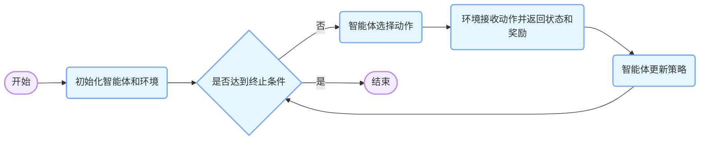

# 强化学习在自适应推理策略生成中的创新应用

> 关键词：强化学习、自适应推理策略、马尔可夫决策过程、智能体、环境交互、策略优化、推理效率

> 摘要：本文深入探讨了强化学习在自适应推理策略生成中的创新应用。首先介绍了强化学习和自适应推理策略的背景知识，阐述了相关核心概念及其联系。详细讲解了强化学习的核心算法原理，包括使用 Python 代码示例。通过数学模型和公式进一步剖析其理论基础，并结合实际例子进行说明。接着通过项目实战展示了如何在实际中实现自适应推理策略，包括开发环境搭建、源代码实现与解读。还介绍了强化学习在自适应推理策略生成中的实际应用场景，推荐了相关的学习资源、开发工具框架和论文著作。最后总结了未来发展趋势与挑战，并给出常见问题解答和参考资料，旨在为相关领域的研究和实践提供全面且深入的指导。

## 1. 背景介绍 
### 1.1 目的和范围
随着人工智能技术的不断发展，推理任务在各个领域的应用日益广泛，如自然语言处理、计算机视觉、智能机器人等。然而，传统的推理策略往往是固定的，难以适应复杂多变的环境和任务需求。强化学习作为一种能够通过与环境交互不断优化策略的机器学习方法，为自适应推理策略的生成提供了新的思路和方法。

本文的目的在于深入研究强化学习在自适应推理策略生成中的应用，包括其原理、算法、实际应用场景等方面。范围涵盖了从理论基础的讲解到实际项目的实现，旨在为研究人员和开发者提供全面的知识和技术指导。

### 1.2 预期读者
本文预期读者包括但不限于人工智能领域的研究人员、机器学习工程师、计算机科学专业的学生以及对强化学习和自适应推理策略感兴趣的技术爱好者。希望通过本文的阅读，读者能够深入理解强化学习在自适应推理策略生成中的应用原理和方法，并能够将其应用到实际项目中。

### 1.3 文档结构概述
本文共分为十个部分。第一部分为背景介绍，包括目的和范围、预期读者、文档结构概述和术语表。第二部分介绍强化学习和自适应推理策略的核心概念与联系，包括原理和架构的文本示意图以及 Mermaid 流程图。第三部分详细讲解强化学习的核心算法原理，并给出 Python 源代码示例。第四部分介绍相关的数学模型和公式，并进行详细讲解和举例说明。第五部分通过项目实战展示自适应推理策略的代码实现和详细解释。第六部分介绍强化学习在自适应推理策略生成中的实际应用场景。第七部分推荐相关的学习资源、开发工具框架和论文著作。第八部分总结未来发展趋势与挑战。第九部分为附录，给出常见问题与解答。第十部分提供扩展阅读和参考资料。

### 1.4 术语表
#### 1.4.1 核心术语定义
- **强化学习（Reinforcement Learning）**：一种机器学习范式，智能体通过与环境进行交互，根据环境反馈的奖励信号来学习最优策略，以最大化长期累积奖励。
- **自适应推理策略（Adaptive Inference Strategy）**：能够根据不同的环境条件、任务需求和数据特征自动调整推理过程和方法的策略。
- **智能体（Agent）**：在强化学习中，执行动作并与环境进行交互的实体。
- **环境（Environment）**：智能体所处的外部世界，它接收智能体的动作并返回状态和奖励。
- **策略（Policy）**：智能体选择动作的规则，通常表示为从状态到动作的映射。
- **奖励（Reward）**：环境根据智能体的动作给予的即时反馈信号，用于指导智能体学习。

#### 1.4.2 相关概念解释
- **马尔可夫决策过程（Markov Decision Process, MDP）**：强化学习的数学基础，描述了智能体与环境交互的动态过程。它由状态集合、动作集合、状态转移概率、奖励函数和折扣因子组成。
- **值函数（Value Function）**：用于评估在某个状态下执行某个动作或遵循某个策略的价值，通常分为状态值函数和动作值函数。
- **探索与利用（Exploration and Exploitation）**：强化学习中的一个重要问题，探索是指尝试新的动作以发现更优的策略，利用是指利用已经学到的经验选择最优动作。

#### 1.4.3 缩略词列表
- **MDP**：Markov Decision Process（马尔可夫决策过程）
- **Q - learning**：Q 学习算法
- **SARSA**：State - Action - Reward - State - Action 算法
- **DQN**：Deep Q - Network（深度 Q 网络）

## 2. 核心概念与联系 

### 强化学习原理
强化学习的核心思想是智能体在环境中不断尝试不同的动作，并根据环境给予的奖励信号来调整自己的行为，以最大化长期累积奖励。智能体通过与环境的交互，不断学习最优策略。

### 自适应推理策略原理
自适应推理策略的目标是根据不同的环境条件和任务需求，自动调整推理过程和方法。它需要能够感知环境的变化，并根据这些变化选择合适的推理策略。

### 两者联系
强化学习为自适应推理策略的生成提供了一种有效的方法。通过将推理过程建模为强化学习问题，智能体可以在不同的环境中学习到最优的推理策略。智能体在推理过程中不断尝试不同的推理动作，根据推理结果得到的奖励信号来调整策略，从而实现自适应推理。

### 文本示意图
```plaintext
智能体 <---- 动作 ----> 环境
         <---- 状态、奖励 ----
```
智能体向环境执行动作，环境根据动作返回当前状态和奖励信号，智能体根据这些反馈调整自己的策略。

### Mermaid 流程图


## 3. 核心算法原理 & 具体操作步骤 

### Q - learning 算法原理
Q - learning 是一种经典的强化学习算法，它通过学习动作值函数 $Q(s, a)$ 来找到最优策略。动作值函数 $Q(s, a)$ 表示在状态 $s$ 下执行动作 $a$ 的期望累积奖励。

Q - learning 算法的更新公式为：
\[Q(s_t, a_t) \leftarrow Q(s_t, a_t) + \alpha [r_{t+1} + \gamma \max_{a} Q(s_{t+1}, a) - Q(s_t, a_t)]\]
其中，$s_t$ 是当前状态，$a_t$ 是当前动作，$r_{t+1}$ 是执行动作后得到的奖励，$s_{t+1}$ 是下一个状态，$\alpha$ 是学习率，$\gamma$ 是折扣因子。

### Python 代码实现
```python
import numpy as np

class QLearningAgent:
    def __init__(self, state_size, action_size, learning_rate=0.1, discount_factor=0.9):
        self.state_size = state_size
        self.action_size = action_size
        self.learning_rate = learning_rate
        self.discount_factor = discount_factor
        self.q_table = np.zeros((state_size, action_size))

    def choose_action(self, state, epsilon=0.1):
        if np.random.uniform(0, 1) < epsilon:
            # 探索：随机选择动作
            action = np.random.choice(self.action_size)
        else:
            # 利用：选择 Q 值最大的动作
            action = np.argmax(self.q_table[state, :])
        return action

    def update_q_table(self, state, action, reward, next_state):
        max_q_next = np.max(self.q_table[next_state, :])
        self.q_table[state, action] += self.learning_rate * (reward + self.discount_factor * max_q_next - self.q_table[state, action])


# 示例使用
state_size = 10
action_size = 4
agent = QLearningAgent(state_size, action_size)

# 模拟一个回合
state = np.random.randint(0, state_size)
for _ in range(100):
    action = agent.choose_action(state)
    # 模拟环境返回奖励和下一个状态
    next_state = np.random.randint(0, state_size)
    reward = np.random.randint(-1, 2)
    agent.update_q_table(state, action, reward, next_state)
    state = next_state
```

### 具体操作步骤
1. **初始化**：初始化智能体的 Q 表，将所有的 $Q(s, a)$ 值设为 0。同时设置学习率 $\alpha$ 和折扣因子 $\gamma$。
2. **选择动作**：在每个时间步，智能体根据当前状态 $s_t$ 选择一个动作 $a_t$。可以使用 $\epsilon$-贪心策略，以 $\epsilon$ 的概率随机选择动作（探索），以 $1 - \epsilon$ 的概率选择 $Q$ 值最大的动作（利用）。
3. **执行动作并接收反馈**：智能体执行选择的动作 $a_t$，环境返回下一个状态 $s_{t+1}$ 和奖励 $r_{t+1}$。
4. **更新 Q 表**：根据 Q - learning 的更新公式更新 $Q(s_t, a_t)$ 的值。
5. **重复步骤 2 - 4**：直到达到终止条件，如达到最大时间步数或智能体达到目标状态。

## 4. 数学模型和公式 & 详细讲解 & 举例说明 

### 马尔可夫决策过程（MDP）
马尔可夫决策过程是强化学习的数学基础，它可以用一个五元组 $(S, A, P, R, \gamma)$ 来表示：
- $S$：状态集合，表示环境的所有可能状态。
- $A$：动作集合，表示智能体可以执行的所有动作。
- $P(s'|s, a)$：状态转移概率，表示在状态 $s$ 下执行动作 $a$ 后转移到状态 $s'$ 的概率。
- $R(s, a, s')$：奖励函数，表示在状态 $s$ 下执行动作 $a$ 转移到状态 $s'$ 时获得的奖励。
- $\gamma$：折扣因子，取值范围为 $[0, 1]$，用于权衡即时奖励和未来奖励的重要性。

### 值函数
#### 状态值函数
状态值函数 $V^{\pi}(s)$ 表示在策略 $\pi$ 下，从状态 $s$ 开始的期望累积奖励：
\[V^{\pi}(s) = \mathbb{E}_{\pi} \left[\sum_{t=0}^{\infty} \gamma^t r_{t+1} | s_0 = s \right]\]

#### 动作值函数
动作值函数 $Q^{\pi}(s, a)$ 表示在策略 $\pi$ 下，从状态 $s$ 执行动作 $a$ 后的期望累积奖励：
\[Q^{\pi}(s, a) = \mathbb{E}_{\pi} \left[\sum_{t=0}^{\infty} \gamma^t r_{t+1} | s_0 = s, a_0 = a \right]\]

### 最优值函数和最优策略
最优状态值函数 $V^*(s)$ 和最优动作值函数 $Q^*(s, a)$ 分别定义为：
\[V^*(s) = \max_{\pi} V^{\pi}(s)\]
\[Q^*(s, a) = \max_{\pi} Q^{\pi}(s, a)\]

最优策略 $\pi^*$ 是使得 $V^{\pi}(s)$ 或 $Q^{\pi}(s, a)$ 达到最大值的策略。

### 举例说明
假设有一个简单的网格世界环境，智能体可以在一个 $3 \times 3$ 的网格中移动，目标是从起点 $(0, 0)$ 移动到终点 $(2, 2)$。智能体可以执行四个动作：上、下、左、右。如果智能体移动到终点，获得奖励 10，否则获得奖励 -1。

状态集合 $S$ 包含 $3 \times 3 = 9$ 个状态，动作集合 $A$ 包含 4 个动作。状态转移概率 $P(s'|s, a)$ 取决于智能体的移动规则，例如，如果智能体在边界位置执行向外移动的动作，状态保持不变。奖励函数 $R(s, a, s')$ 根据智能体是否到达终点来确定。

使用 Q - learning 算法，智能体可以通过不断与环境交互，学习到从起点到终点的最优路径。

## 5. 项目实战：代码实际案例和详细解释说明 

### 5.1  开发环境搭建
#### 安装 Python
首先需要安装 Python 环境，建议使用 Python 3.6 及以上版本。可以从 Python 官方网站（https://www.python.org/downloads/） 下载并安装。

#### 安装依赖库
在项目中，我们需要使用 `numpy` 库进行数值计算。可以使用以下命令安装：
```sh
pip install numpy
```

### 5.2  源代码详细实现和代码解读
以下是一个基于 Q - learning 算法的自适应推理策略生成的完整代码示例：
```python
import numpy as np

# 定义环境类
class GridWorld:
    def __init__(self, grid_size=3):
        self.grid_size = grid_size
        self.state_size = grid_size * grid_size
        self.action_size = 4  # 上、下、左、右
        self.start_state = 0
        self.goal_state = self.state_size - 1
        self.current_state = self.start_state

    def reset(self):
        self.current_state = self.start_state
        return self.current_state

    def step(self, action):
        x, y = self._state_to_xy(self.current_state)
        if action == 0:  # 上
            x = max(x - 1, 0)
        elif action == 1:  # 下
            x = min(x + 1, self.grid_size - 1)
        elif action == 2:  # 左
            y = max(y - 1, 0)
        elif action == 3:  # 右
            y = min(y + 1, self.grid_size - 1)
        next_state = self._xy_to_state(x, y)
        if next_state == self.goal_state:
            reward = 10
            done = True
        else:
            reward = -1
            done = False
        self.current_state = next_state
        return next_state, reward, done

    def _state_to_xy(self, state):
        x = state // self.grid_size
        y = state % self.grid_size
        return x, y

    def _xy_to_state(self, x, y):
        return x * self.grid_size + y


# 定义 Q - learning 智能体类
class QLearningAgent:
    def __init__(self, state_size, action_size, learning_rate=0.1, discount_factor=0.9, epsilon=0.1):
        self.state_size = state_size
        self.action_size = action_size
        self.learning_rate = learning_rate
        self.discount_factor = discount_factor
        self.epsilon = epsilon
        self.q_table = np.zeros((state_size, action_size))

    def choose_action(self, state):
        if np.random.uniform(0, 1) < self.epsilon:
            # 探索：随机选择动作
            action = np.random.choice(self.action_size)
        else:
            # 利用：选择 Q 值最大的动作
            action = np.argmax(self.q_table[state, :])
        return action

    def update_q_table(self, state, action, reward, next_state):
        max_q_next = np.max(self.q_table[next_state, :])
        self.q_table[state, action] += self.learning_rate * (reward + self.discount_factor * max_q_next - self.q_table[state, action])


# 主训练函数
def train():
    env = GridWorld()
    agent = QLearningAgent(env.state_size, env.action_size)
    num_episodes = 1000
    for episode in range(num_episodes):
        state = env.reset()
        done = False
        while not done:
            action = agent.choose_action(state)
            next_state, reward, done = env.step(action)
            agent.update_q_table(state, action, reward, next_state)
            state = next_state
        if episode % 100 == 0:
            print(f"Episode {episode}: Q - table updated.")


if __name__ == "__main__":
    train()


```

### 5.3  代码解读与分析
#### 环境类 `GridWorld`
- `__init__` 方法：初始化环境的网格大小、状态数量、动作数量、起点和终点状态，并将当前状态设置为起点状态。
- `reset` 方法：将当前状态重置为起点状态，并返回该状态。
- `step` 方法：根据智能体选择的动作更新当前状态，计算奖励和是否到达终止状态，并返回下一个状态、奖励和终止标志。
- `_state_to_xy` 和 `_xy_to_state` 方法：用于状态和坐标之间的转换。

#### 智能体类 `QLearningAgent`
- `__init__` 方法：初始化智能体的状态数量、动作数量、学习率、折扣因子、探索率和 Q 表。
- `choose_action` 方法：根据 $\epsilon$-贪心策略选择动作。
- `update_q_table` 方法：根据 Q - learning 的更新公式更新 Q 表。

#### 主训练函数 `train`
- 创建环境和智能体对象。
- 进行多个回合的训练，每个回合中智能体与环境交互，直到达到终止状态。
- 在每个回合中，智能体选择动作，环境返回下一个状态和奖励，智能体更新 Q 表。

通过不断的训练，智能体可以学习到从起点到终点的最优路径，从而实现自适应推理策略的生成。

## 6. 实际应用场景 

### 自然语言处理
在自然语言处理中，如机器翻译、文本生成等任务中，强化学习可以用于自适应推理策略的生成。例如，在机器翻译中，智能体可以根据输入的源语言句子和当前的翻译状态，选择合适的翻译动作，通过与环境（如翻译质量评估器）的交互，不断优化翻译策略，提高翻译质量。

### 计算机视觉
在计算机视觉任务中，如图像分类、目标检测等，强化学习可以用于自适应推理策略的生成。例如，在目标检测中，智能体可以根据图像的特征和当前的检测状态，选择合适的检测动作，通过与环境（如检测准确率评估器）的交互，不断优化检测策略，提高检测准确率。

### 智能机器人
在智能机器人领域，强化学习可以用于机器人的路径规划、动作决策等任务。例如，机器人在未知环境中导航时，智能体可以根据当前的环境状态（如障碍物位置、目标位置等），选择合适的移动动作，通过与环境（如碰撞检测、到达目标奖励）的交互，不断优化路径规划策略，实现高效的导航。

### 推荐系统
在推荐系统中，强化学习可以用于自适应推荐策略的生成。例如，智能体可以根据用户的历史行为和当前的推荐状态，选择合适的推荐动作（如推荐商品、推荐内容等），通过与环境（如用户反馈、点击率等）的交互，不断优化推荐策略，提高推荐的准确性和用户满意度。

## 7. 工具和资源推荐
### 7.1 学习资源推荐
#### 7.1.1 书籍推荐
- 《强化学习：原理与Python实现》：本书系统地介绍了强化学习的基本原理和算法，并通过 Python 代码示例进行详细讲解，适合初学者入门。
- 《Reinforcement Learning: An Introduction》（《强化学习导论》）：由强化学习领域的两位权威学者 Richard S. Sutton 和 Andrew G. Barto 所著，是强化学习领域的经典教材，全面介绍了强化学习的理论和方法。

#### 7.1.2 在线课程
- Coursera 上的 “Reinforcement Learning Specialization”：由 University of Alberta 提供，包含多个强化学习的课程，从基础到高级，适合不同水平的学习者。
- edX 上的 “Introduction to Reinforcement Learning”：由 Massachusetts Institute of Technology 提供，介绍了强化学习的基本概念和算法。

#### 7.1.3 技术博客和网站
- OpenAI Blog（https://openai.com/blog/）：OpenAI 发布的关于人工智能和强化学习的最新研究成果和技术文章。
- DeepMind Blog（https://deepmind.com/blog/）：DeepMind 发布的关于人工智能和强化学习的研究和应用案例。

### 7.2 开发工具框架推荐
#### 7.2.1 IDE和编辑器
- PyCharm：一款功能强大的 Python 集成开发环境，提供代码编辑、调试、版本控制等功能，适合开发强化学习项目。
- Jupyter Notebook：一种交互式的开发环境，支持 Python 代码的编写和运行，方便进行实验和数据分析，适合强化学习算法的实验和验证。

#### 7.2.2 调试和性能分析工具
- TensorBoard：TensorFlow 提供的可视化工具，可以用于可视化强化学习训练过程中的各种指标，如奖励曲线、损失曲线等，帮助调试和优化算法。
- cProfile：Python 内置的性能分析工具，可以用于分析强化学习代码的性能瓶颈，提高代码的运行效率。

#### 7.2.3 相关框架和库
- OpenAI Gym：一个开源的强化学习环境库，提供了多种不同类型的环境，如经典控制问题、机器人模拟等，方便开发者进行强化学习算法的实验和测试。
- Stable Baselines3：一个基于 PyTorch 的强化学习库，提供了多种预训练的强化学习算法和工具，方便开发者快速实现和应用强化学习算法。

### 7.3 相关论文著作推荐
#### 7.3.1 经典论文
- “Q - learning” by Christopher J. C. H. Watkins and Peter Dayan：介绍了 Q - learning 算法的基本原理和方法，是强化学习领域的经典论文。
- “Playing Atari with Deep Reinforcement Learning” by Volodymyr Mnih et al.：提出了深度 Q 网络（DQN）算法，将深度学习与强化学习相结合，在 Atari 游戏中取得了很好的效果。

#### 7.3.2 最新研究成果
- 关注 NeurIPS（Conference on Neural Information Processing Systems）、ICML（International Conference on Machine Learning）、AAAI（Association for the Advancement of Artificial Intelligence）等顶级学术会议上的最新研究成果，了解强化学习在自适应推理策略生成等领域的最新进展。

#### 7.3.3 应用案例分析
- 研究一些实际应用中的强化学习案例，如 AlphaGo、OpenAI Five 等，了解强化学习在复杂任务中的应用和实现方法。

## 8. 总结：未来发展趋势与挑战
### 未来发展趋势
- **深度强化学习与其他技术的融合**：深度强化学习将与深度学习、计算机视觉、自然语言处理等技术进一步融合，实现更加复杂和智能的自适应推理策略。例如，结合计算机视觉技术，智能体可以更好地感知环境；结合自然语言处理技术，智能体可以更好地理解用户需求。
- **多智能体强化学习**：在复杂的环境中，多个智能体之间的协作和竞争将成为研究的热点。多智能体强化学习可以用于解决交通控制、智能电网、物流调度等复杂问题，实现更加高效和智能的自适应推理策略。
- **基于模型的强化学习**：基于模型的强化学习可以通过学习环境模型来提高学习效率和泛化能力。未来，基于模型的强化学习将在自适应推理策略生成中得到更广泛的应用。

### 挑战
- **样本效率问题**：强化学习通常需要大量的样本才能学习到有效的策略，这在实际应用中可能会面临时间和资源的限制。提高样本效率是强化学习面临的一个重要挑战。
- **可解释性问题**：深度强化学习模型通常是黑盒模型，其决策过程难以解释。在一些对安全性和可靠性要求较高的应用场景中，如医疗、金融等，可解释性问题是一个亟待解决的问题。
- **环境复杂性问题**：实际应用中的环境往往非常复杂，如存在不确定性、动态变化等。如何在复杂环境中实现高效和稳定的自适应推理策略是强化学习面临的另一个挑战。

## 9. 附录：常见问题与解答
### Q1：强化学习和监督学习有什么区别？
A1：监督学习是通过给定的输入 - 输出对来学习一个映射函数，而强化学习是通过与环境的交互，根据环境反馈的奖励信号来学习最优策略。监督学习的目标是最小化预测误差，而强化学习的目标是最大化长期累积奖励。

### Q2：如何选择合适的学习率和折扣因子？
A2：学习率 $\alpha$ 控制了 Q 表更新的步长，过大的学习率可能导致学习不稳定，过小的学习率可能导致学习速度过慢。折扣因子 $\gamma$ 权衡了即时奖励和未来奖励的重要性，通常取值在 $[0.9, 0.99]$ 之间。可以通过实验和调参来选择合适的学习率和折扣因子。

### Q3：什么是探索与利用困境？
A3：探索是指尝试新的动作以发现更优的策略，利用是指利用已经学到的经验选择最优动作。在强化学习中，需要在探索和利用之间进行权衡。如果只进行利用，可能会陷入局部最优；如果只进行探索，可能会浪费大量的时间和资源。

### Q4：如何处理连续状态和动作空间？
A4：对于连续状态和动作空间，可以使用函数逼近方法，如深度神经网络来近似值函数或策略函数。例如，深度 Q 网络（DQN）可以用于处理连续状态空间，而策略梯度算法可以用于处理连续动作空间。

## 10. 扩展阅读 & 参考资料
### 扩展阅读
- 阅读一些关于强化学习的高级算法，如策略梯度算法、Actor - Critic 算法等，进一步深入了解强化学习的理论和方法。
- 研究一些强化学习在其他领域的应用案例，如自动驾驶、游戏开发等，拓宽视野。

### 参考资料
- Richard S. Sutton and Andrew G. Barto, “Reinforcement Learning: An Introduction”, MIT Press, 2018.
- Christopher J. C. H. Watkins and Peter Dayan, “Q - learning”, Machine Learning, 1992.
- Volodymyr Mnih et al., “Playing Atari with Deep Reinforcement Learning”, arXiv preprint arXiv:1312.5602, 2013.

作者：AI天才研究院/AI Genius Institute & 禅与计算机程序设计艺术 /Zen And The Art of Computer Programming