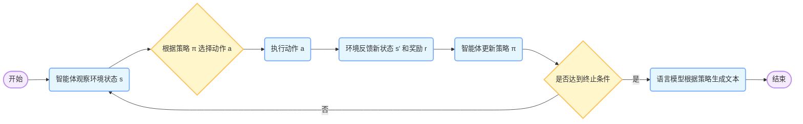

# 强化学习在语言模型训练中的角色

> 关键词：强化学习、语言模型训练、策略梯度、奖励函数、智能体、自然语言处理

> 摘要：本文深入探讨强化学习在语言模型训练中的角色。首先介绍强化学习和语言模型训练的背景知识，接着阐述两者核心概念及联系，详细讲解强化学习用于语言模型训练的核心算法原理、数学模型和公式。通过项目实战展示具体代码实现和解读，分析其在不同场景下的实际应用。推荐相关学习资源、开发工具框架和论文著作，最后总结未来发展趋势与挑战，解答常见问题并给出参考资料，旨在全面揭示强化学习在语言模型训练中的重要作用和潜力。

## 1. 背景介绍 
### 1.1 目的和范围
本文章的目的在于全面、深入地剖析强化学习在语言模型训练中所扮演的角色。随着自然语言处理技术的飞速发展，语言模型的性能不断提升，而强化学习作为一种强大的机器学习方法，逐渐在语言模型训练中展现出独特的优势。我们将探讨强化学习如何与语言模型训练相结合，其在提升语言模型性能、优化生成文本质量等方面的具体作用。范围涵盖强化学习和语言模型的基本概念、核心算法原理、数学模型，以及通过实际项目案例展示其应用，同时分析其在不同场景下的应用情况和未来发展趋势。

### 1.2 预期读者
本文预期读者包括对自然语言处理、机器学习和人工智能领域感兴趣的研究人员、开发者、学生以及相关从业者。无论是希望深入了解强化学习和语言模型训练技术的初学者，还是寻求技术突破和创新应用的专业人士，都能从本文中获取有价值的信息和见解。

### 1.3 文档结构概述
本文将按照以下结构进行阐述：首先介绍强化学习和语言模型训练的背景知识，包括术语定义和相关概念解释；接着阐述强化学习与语言模型训练的核心概念及联系，通过文本示意图和 Mermaid 流程图进行直观展示；然后详细讲解强化学习用于语言模型训练的核心算法原理，结合 Python 源代码进行说明，同时介绍相关数学模型和公式，并举例说明；通过项目实战部分展示代码实际案例，包括开发环境搭建、源代码详细实现和代码解读；分析强化学习在语言模型训练中的实际应用场景；推荐相关的学习资源、开发工具框架和论文著作；最后总结强化学习在语言模型训练中的未来发展趋势与挑战，解答常见问题并给出参考资料。

### 1.4 术语表
#### 1.4.1 核心术语定义
- **强化学习（Reinforcement Learning）**：一种机器学习范式，智能体通过与环境进行交互，根据环境反馈的奖励信号来学习最优策略，以最大化长期累积奖励。
- **语言模型（Language Model）**：一种对自然语言文本进行建模的概率模型，用于预测文本中下一个词或字符的概率分布。
- **策略（Policy）**：在强化学习中，策略是智能体根据当前状态选择动作的规则。
- **奖励函数（Reward Function）**：用于评估智能体在环境中执行某个动作后所获得的即时奖励，是强化学习中引导智能体学习的重要信号。
- **智能体（Agent）**：在强化学习中，智能体是与环境进行交互的主体，通过感知环境状态并执行动作来学习最优策略。

#### 1.4.2 相关概念解释
- **策略梯度（Policy Gradient）**：强化学习中的一种优化算法，通过直接对策略进行梯度更新，使得策略朝着最大化预期奖励的方向改进。
- **Actor - Critic 算法**：一种结合了策略梯度和值函数估计的强化学习算法，其中 Actor 负责学习策略，Critic 负责评估策略的价值。
- **Transformer 架构**：一种基于注意力机制的深度学习架构，在语言模型中得到广泛应用，能够有效处理序列数据。

#### 1.4.3 缩略词列表
- **RL**：Reinforcement Learning（强化学习）
- **LM**：Language Model（语言模型）
- **PG**：Policy Gradient（策略梯度）

## 2. 核心概念与联系 

### 强化学习核心概念
强化学习是一种通过智能体与环境交互来学习最优策略的机器学习方法。智能体在每个时间步观察环境的状态 $s_t$，并根据当前策略 $\pi$ 选择一个动作 $a_t$ 执行。环境接收到动作后，会反馈一个新的状态 $s_{t+1}$ 和一个奖励 $r_t$。智能体的目标是学习一个策略 $\pi$，使得长期累积奖励最大化。

### 语言模型核心概念
语言模型是一种对自然语言文本进行建模的概率模型，其目标是预测文本中下一个词或字符的概率分布。常见的语言模型包括基于统计的 n - 元语法模型和基于深度学习的神经网络语言模型，如循环神经网络（RNN）、长短期记忆网络（LSTM）和 Transformer 架构的语言模型。

### 强化学习与语言模型训练的联系
在语言模型训练中，传统的监督学习方法通常基于最大似然估计来优化模型参数。然而，这种方法可能会导致生成的文本在语义和语用层面上存在不足。强化学习可以为语言模型训练提供一种新的优化方式，通过定义合适的奖励函数，引导语言模型生成更符合特定需求的文本。例如，在文本生成任务中，可以根据生成文本的流畅性、相关性、逻辑性等方面设计奖励函数，让智能体（语言模型）在与环境（文本生成任务）的交互中学习到更好的策略，从而提升生成文本的质量。

### 文本示意图
```plaintext
+-----------------+          +-----------------+
|  强化学习智能体  |          |      环境       |
+-----------------+          +-----------------+
| - 策略 π(a|s)    |          | - 状态 s        |
| - 动作 a         | <------> | - 奖励 r        |
| - 学习更新策略  |          | - 转移状态 s'   |
+-----------------+          +-----------------+

|
|
v

+-----------------+
|  语言模型        |
+-----------------+
| - 输入文本       |
| - 生成文本       |
| - 参数优化       |
+-----------------+
```

### Mermaid 流程图


## 3. 核心算法原理 & 具体操作步骤 

### 策略梯度算法原理
策略梯度算法是强化学习中一种重要的优化算法，其核心思想是直接对策略进行梯度更新，使得策略朝着最大化预期奖励的方向改进。策略通常用一个参数化的函数 $\pi_{\theta}(a|s)$ 表示，其中 $\theta$ 是策略的参数。

策略梯度算法的目标是最大化预期累积奖励 $J(\theta)$，其定义为：
$$J(\theta) = \mathbb{E}_{\tau \sim \pi_{\theta}} \left[ \sum_{t=0}^{T} r_t \right]$$
其中 $\tau = (s_0, a_0, r_0, s_1, a_1, r_1, \cdots, s_T, a_T, r_T)$ 表示一个轨迹，$r_t$ 是在时间步 $t$ 获得的奖励。

根据策略梯度定理，$J(\theta)$ 关于 $\theta$ 的梯度可以表示为：
$$\nabla_{\theta} J(\theta) = \mathbb{E}_{\tau \sim \pi_{\theta}} \left[ \sum_{t=0}^{T} \nabla_{\theta} \log \pi_{\theta}(a_t|s_t) \sum_{k=t}^{T} r_k \right]$$

### 具体操作步骤
1. **初始化策略参数 $\theta$**：随机初始化策略网络的参数。
2. **采样轨迹**：使用当前策略 $\pi_{\theta}$ 与环境进行交互，采样多个轨迹 $\tau_1, \tau_2, \cdots, \tau_N$。
3. **计算梯度**：根据采样的轨迹，计算策略梯度 $\nabla_{\theta} J(\theta)$ 的估计值。
4. **更新策略参数**：使用梯度上升法更新策略参数 $\theta$，即 $\theta \leftarrow \theta + \alpha \nabla_{\theta} J(\theta)$，其中 $\alpha$ 是学习率。
5. **重复步骤 2 - 4**：直到策略收敛或达到最大迭代次数。

### Python 源代码实现
```python
import torch
import torch.nn as nn
import torch.optim as optim
import numpy as np

# 定义策略网络
class PolicyNetwork(nn.Module):
    def __init__(self, input_dim, output_dim):
        super(PolicyNetwork, self).__init__()
        self.fc1 = nn.Linear(input_dim, 64)
        self.fc2 = nn.Linear(64, output_dim)
        self.softmax = nn.Softmax(dim=-1)

    def forward(self, x):
        x = torch.relu(self.fc1(x))
        x = self.fc2(x)
        probs = self.softmax(x)
        return probs

# 定义强化学习智能体
class Agent:
    def __init__(self, input_dim, output_dim, lr=0.001):
        self.policy_network = PolicyNetwork(input_dim, output_dim)
        self.optimizer = optim.Adam(self.policy_network.parameters(), lr=lr)

    def get_action(self, state):
        state = torch.FloatTensor(state).unsqueeze(0)
        probs = self.policy_network(state)
        action = torch.multinomial(probs, 1).item()
        log_prob = torch.log(probs.squeeze(0)[action])
        return action, log_prob

    def update_policy(self, log_probs, rewards):
        discounted_rewards = []
        cumulative_reward = 0
        for reward in reversed(rewards):
            cumulative_reward = reward + 0.9 * cumulative_reward
            discounted_rewards.insert(0, cumulative_reward)
        discounted_rewards = torch.FloatTensor(discounted_rewards)
        discounted_rewards = (discounted_rewards - discounted_rewards.mean()) / (discounted_rewards.std() + 1e-9)

        policy_loss = []
        for log_prob, reward in zip(log_probs, discounted_rewards):
            policy_loss.append(-log_prob * reward)
        policy_loss = torch.stack(policy_loss).sum()

        self.optimizer.zero_grad()
        policy_loss.backward()
        self.optimizer.step()

# 示例使用
input_dim = 4
output_dim = 2
agent = Agent(input_dim, output_dim)

state = np.random.randn(input_dim)
action, log_prob = agent.get_action(state)
reward = np.random.randn(1)[0]
log_probs = [log_prob]
rewards = [reward]
agent.update_policy(log_probs, rewards)
```

## 4. 数学模型和公式 & 详细讲解 & 举例说明 

### 策略梯度公式详细讲解
策略梯度公式 $\nabla_{\theta} J(\theta) = \mathbb{E}_{\tau \sim \pi_{\theta}} \left[ \sum_{t=0}^{T} \nabla_{\theta} \log \pi_{\theta}(a_t|s_t) \sum_{k=t}^{T} r_k \right]$ 可以从以下几个方面进行理解：

- **$\nabla_{\theta} \log \pi_{\theta}(a_t|s_t)$**：这一项表示策略 $\pi_{\theta}(a|s)$ 关于参数 $\theta$ 的对数梯度。对数操作的目的是将乘法运算转化为加法运算，方便计算梯度。$\nabla_{\theta} \log \pi_{\theta}(a_t|s_t)$ 反映了在状态 $s_t$ 下选择动作 $a_t$ 的策略对参数 $\theta$ 的敏感程度。
- **$\sum_{k=t}^{T} r_k$**：这是从时间步 $t$ 到终止时间步 $T$ 的累积奖励，表示在时间步 $t$ 选择动作 $a_t$ 对后续整个轨迹奖励的影响。

### 举例说明
假设我们有一个简单的强化学习环境，智能体在每个时间步有两个动作选择：向左或向右。环境的状态是一个一维向量，策略网络是一个简单的两层神经网络。

在某一次轨迹中，智能体的状态序列为 $s_0, s_1, s_2$，动作序列为 $a_0, a_1, a_2$，奖励序列为 $r_0 = 1, r_1 = 2, r_2 = 3$。

对于时间步 $t = 0$，$\sum_{k=0}^{2} r_k = 1 + 2 + 3 = 6$，假设 $\nabla_{\theta} \log \pi_{\theta}(a_0|s_0)$ 计算得到一个梯度向量 $\mathbf{g}_0$。

对于时间步 $t = 1$，$\sum_{k=1}^{2} r_k = 2 + 3 = 5$，假设 $\nabla_{\theta} \log \pi_{\theta}(a_1|s_1)$ 计算得到一个梯度向量 $\mathbf{g}_1$。

对于时间步 $t = 2$，$\sum_{k=2}^{2} r_k = 3$，假设 $\nabla_{\theta} \log \pi_{\theta}(a_2|s_2)$ 计算得到一个梯度向量 $\mathbf{g}_2$。

则策略梯度 $\nabla_{\theta} J(\theta)$ 的估计值为 $\mathbf{g}_0 \times 6 + \mathbf{g}_1 \times 5 + \mathbf{g}_2 \times 3$。

### 优势函数的引入
在实际应用中，为了减少梯度估计的方差，通常会引入优势函数 $A(s_t, a_t)$ 来代替累积奖励 $\sum_{k=t}^{T} r_k$。优势函数定义为：
$$A(s_t, a_t) = Q(s_t, a_t) - V(s_t)$$
其中 $Q(s_t, a_t)$ 是状态 - 动作值函数，表示在状态 $s_t$ 下执行动作 $a_t$ 的预期累积奖励，$V(s_t)$ 是状态值函数，表示在状态 $s_t$ 下的预期累积奖励。

引入优势函数后，策略梯度公式变为：
$$\nabla_{\theta} J(\theta) = \mathbb{E}_{\tau \sim \pi_{\theta}} \left[ \sum_{t=0}^{T} \nabla_{\theta} \log \pi_{\theta}(a_t|s_t) A(s_t, a_t) \right]$$

## 5. 项目实战：代码实际案例和详细解释说明 

### 5.1  开发环境搭建
#### 操作系统
本项目可以在常见的操作系统上进行开发，如 Windows、Linux 或 macOS。

#### Python 环境
建议使用 Python 3.7 及以上版本。可以使用 Anaconda 或 Miniconda 来管理 Python 环境，创建一个新的虚拟环境：
```bash
conda create -n rl_lm python=3.8
conda activate rl_lm
```

#### 依赖库安装
安装所需的 Python 库，包括 PyTorch、NumPy、Scikit - learn 等：
```bash
pip install torch numpy scikit-learn
```

### 5.2  源代码详细实现和代码解读
#### 定义语言模型
我们使用一个简单的基于 Transformer 的语言模型作为示例：
```python
import torch
import torch.nn as nn
import torch.nn.functional as F

class TransformerLanguageModel(nn.Module):
    def __init__(self, vocab_size, d_model, nhead, num_layers):
        super(TransformerLanguageModel, self).__init__()
        self.embedding = nn.Embedding(vocab_size, d_model)
        self.transformer_encoder = nn.TransformerEncoder(
            nn.TransformerEncoderLayer(d_model, nhead),
            num_layers
        )
        self.fc = nn.Linear(d_model, vocab_size)

    def forward(self, input_ids):
        embedded = self.embedding(input_ids)
        output = self.transformer_encoder(embedded)
        logits = self.fc(output)
        return logits
```
**代码解读**：
- `self.embedding`：将输入的词索引转换为词向量。
- `self.transformer_encoder`：使用 Transformer 编码器对词向量进行编码。
- `self.fc`：将编码后的向量映射到词表大小的维度，得到每个词的预测得分。

#### 定义强化学习智能体
```python
class RLAgent:
    def __init__(self, language_model, lr=0.001):
        self.language_model = language_model
        self.optimizer = torch.optim.Adam(language_model.parameters(), lr=lr)

    def generate_text(self, input_ids, max_length=100):
        generated_ids = input_ids.clone()
        for _ in range(max_length):
            logits = self.language_model(generated_ids)
            probs = F.softmax(logits[:, -1, :], dim=-1)
            next_token_id = torch.multinomial(probs, 1)
            generated_ids = torch.cat([generated_ids, next_token_id], dim=-1)
        return generated_ids

    def update_policy(self, log_probs, rewards):
        discounted_rewards = []
        cumulative_reward = 0
        for reward in reversed(rewards):
            cumulative_reward = reward + 0.9 * cumulative_reward
            discounted_rewards.insert(0, cumulative_reward)
        discounted_rewards = torch.FloatTensor(discounted_rewards)
        discounted_rewards = (discounted_rewards - discounted_rewards.mean()) / (discounted_rewards.std() + 1e-9)

        policy_loss = []
        for log_prob, reward in zip(log_probs, discounted_rewards):
            policy_loss.append(-log_prob * reward)
        policy_loss = torch.stack(policy_loss).sum()

        self.optimizer.zero_grad()
        policy_loss.backward()
        self.optimizer.step()
```
**代码解读**：
- `generate_text` 方法：根据输入的词索引生成文本，通过不断预测下一个词并添加到生成序列中。
- `update_policy` 方法：根据采样的对数概率和奖励，计算策略损失并更新语言模型的参数。

### 5.3  代码解读与分析
#### 文本生成过程
在 `generate_text` 方法中，首先将输入的词索引传递给语言模型，得到预测的词得分。然后使用 `softmax` 函数将得分转换为概率分布，通过 `multinomial` 函数从概率分布中采样得到下一个词的索引。最后将采样得到的词索引添加到生成序列中，重复这个过程直到达到最大长度。

#### 策略更新过程
在 `update_policy` 方法中，首先计算折扣奖励，将奖励序列进行折扣处理，以反映不同时间步奖励的重要性。然后将折扣奖励进行标准化处理，以减少梯度估计的方差。最后根据对数概率和折扣奖励计算策略损失，使用反向传播算法更新语言模型的参数。

## 6. 实际应用场景 

### 文本摘要
在文本摘要任务中，传统的方法通常基于提取式或生成式的规则来生成摘要。使用强化学习可以定义更复杂的奖励函数，如摘要的准确性、连贯性、简洁性等。智能体（语言模型）通过与环境（文本摘要任务）的交互，学习到如何生成更优质的摘要。例如，可以根据摘要与原文的语义相似度、摘要的可读性等方面设计奖励函数，引导语言模型生成更符合需求的摘要。

### 机器翻译
在机器翻译中，强化学习可以用于优化翻译模型的输出质量。传统的机器翻译模型通常基于最大似然估计进行训练，但生成的翻译结果可能存在语法错误、语义不准确等问题。通过定义奖励函数，如翻译的准确性、流畅性、自然度等，强化学习可以引导翻译模型生成更优质的翻译结果。例如，可以使用人工评估或自动评估指标（如 BLEU 分数）作为奖励信号，让智能体学习到更好的翻译策略。

### 对话系统
在对话系统中，强化学习可以用于优化对话策略。对话系统需要根据用户的输入生成合适的回复，强化学习可以通过定义奖励函数，如对话的连贯性、有用性、满意度等，引导对话系统学习到更好的对话策略。例如，可以根据用户的反馈（如点赞、差评）或自动评估指标（如对话的流畅度、相关性）作为奖励信号，让对话系统不断改进自己的对话策略。

### 文本生成任务
在文本生成任务中，如故事生成、诗歌生成等，强化学习可以用于控制生成文本的风格、主题和质量。通过定义奖励函数，如文本的趣味性、逻辑性、文学性等，强化学习可以引导语言模型生成更符合特定需求的文本。例如，可以根据文本的情感倾向、修辞手法等方面设计奖励函数，让智能体学习到如何生成更具有创意和吸引力的文本。

## 7. 工具和资源推荐
### 7.1 学习资源推荐
#### 7.1.1 书籍推荐
- 《强化学习：原理与Python实现》：本书系统地介绍了强化学习的基本概念、算法和应用，通过Python代码实现了各种强化学习算法，适合初学者入门。
- 《深度学习》：这本书是深度学习领域的经典著作，全面介绍了深度学习的基本原理、模型架构和训练方法，对于理解语言模型和强化学习的基础非常有帮助。
- 《自然语言处理入门》：介绍了自然语言处理的基本概念、技术和应用，包括语言模型、文本分类、机器翻译等内容，是学习自然语言处理的优秀教材。

#### 7.1.2 在线课程
- Coursera 上的“强化学习专项课程”：由知名学者授课，系统地介绍了强化学习的理论和实践，通过编程作业和项目实践帮助学生掌握强化学习的算法和应用。
- edX 上的“深度学习基础”：介绍了深度学习的基本概念、模型架构和训练方法，包括神经网络、卷积神经网络、循环神经网络等内容，是学习深度学习的优质课程。
- 吴恩达的“机器学习”课程：虽然主要介绍机器学习的基础知识，但对于理解强化学习和语言模型的基本概念和方法也非常有帮助。

#### 7.1.3 技术博客和网站
- OpenAI 博客：OpenAI 是人工智能领域的领先研究机构，其博客上发布了许多关于强化学习、语言模型等方面的最新研究成果和技术文章。
- Hugging Face 博客：Hugging Face 是自然语言处理领域的知名开源组织，其博客上发布了许多关于语言模型、预训练模型等方面的技术文章和实践经验。
- Medium 上的人工智能和机器学习相关博客：Medium 上有许多优秀的人工智能和机器学习博主，他们分享了自己的研究成果、实践经验和技术见解。

### 7.2 开发工具框架推荐
#### 7.2.1 IDE和编辑器
- PyCharm：一款功能强大的 Python 集成开发环境，提供了代码编辑、调试、版本控制等功能，适合开发 Python 项目。
- Visual Studio Code：一款轻量级的代码编辑器，支持多种编程语言和插件扩展，具有丰富的代码编辑和调试功能。
- Jupyter Notebook：一种交互式的编程环境，适合进行数据探索、模型训练和实验验证，方便展示代码和结果。

#### 7.2.2 调试和性能分析工具
- PyTorch Profiler：PyTorch 提供的性能分析工具，可以帮助开发者分析模型的训练和推理性能，找出性能瓶颈。
- TensorBoard：一款可视化工具，可以帮助开发者可视化模型的训练过程、损失曲线、梯度分布等信息，方便调试和优化模型。
- cProfile：Python 内置的性能分析工具，可以帮助开发者分析代码的性能瓶颈，找出耗时较长的函数和代码段。

#### 7.2.3 相关框架和库
- PyTorch：一个开源的深度学习框架，提供了丰富的深度学习模型和工具，支持 GPU 加速，方便进行模型训练和推理。
- Hugging Face Transformers：一个开源的自然语言处理库，提供了许多预训练的语言模型和工具，方便进行文本生成、文本分类、机器翻译等任务。
- Stable Baselines3：一个开源的强化学习库，提供了许多常见的强化学习算法和工具，方便进行强化学习实验和应用开发。

### 7.3 相关论文著作推荐
#### 7.3.1 经典论文
- “Policy Gradient Methods for Reinforcement Learning with Function Approximation”：这篇论文提出了策略梯度算法，是强化学习领域的经典论文之一，为后续的强化学习研究奠定了基础。
- “Attention Is All You Need”：这篇论文提出了 Transformer 架构，是自然语言处理领域的重要突破，推动了语言模型的发展。
- “Proximal Policy Optimization Algorithms”：这篇论文提出了近端策略优化算法（PPO），是一种高效的强化学习算法，在实际应用中得到了广泛的应用。

#### 7.3.2 最新研究成果
- “Training Language Models to Follow Instructions with Human Feedback”：这篇论文介绍了使用人类反馈进行语言模型训练的方法，通过强化学习优化语言模型的输出质量，取得了很好的效果。
- “Reinforcement Learning for Natural Language Processing: A Survey”：这篇论文对强化学习在自然语言处理中的应用进行了全面的综述，介绍了强化学习在文本生成、机器翻译、对话系统等任务中的应用和研究进展。

#### 7.3.3 应用案例分析
- “Improving Language Understanding by Generative Pre - Training”：这篇论文介绍了 OpenAI 的 GPT 模型，通过无监督的预训练和有监督的微调，在自然语言处理任务中取得了很好的效果，是语言模型领域的重要应用案例。
- “BERT: Pre - training of Deep Bidirectional Transformers for Language Understanding”：这篇论文介绍了 Google 的 BERT 模型，通过双向 Transformer 架构进行预训练，在自然语言处理任务中取得了显著的性能提升，是语言模型领域的另一个重要应用案例。

## 8. 总结：未来发展趋势与挑战
### 未来发展趋势
- **融合多种学习范式**：未来强化学习可能会与监督学习、无监督学习等多种学习范式深度融合，充分发挥各自的优势，提高语言模型的性能和泛化能力。例如，在语言模型预训练阶段使用无监督学习进行大规模数据的学习，在微调阶段使用强化学习进行特定任务的优化。
- **引入更多的先验知识**：通过引入更多的先验知识，如语义知识、常识知识等，可以帮助强化学习更好地引导语言模型生成更符合逻辑和语义的文本。例如，在奖励函数中加入语义相似度、常识判断等因素，让智能体学习到更合理的策略。
- **多智能体协作**：在复杂的自然语言处理任务中，多智能体协作可以提高任务的处理效率和质量。例如，在对话系统中，多个智能体可以分工协作，分别处理不同的任务，如语义理解、对话策略生成、回复生成等，通过强化学习进行协作和优化。
- **可解释性和可信赖性**：随着语言模型在越来越多的关键领域得到应用，其可解释性和可信赖性变得越来越重要。未来强化学习可能会在提高语言模型的可解释性和可信赖性方面发挥重要作用，例如通过设计可解释的奖励函数和策略表示方法，让人们更好地理解语言模型的决策过程。

### 挑战
- **奖励函数设计困难**：设计合适的奖励函数是强化学习中的一个关键问题，在语言模型训练中尤其困难。语言的复杂性使得很难用简单的指标来衡量生成文本的质量，奖励函数的设计需要考虑语义、语用、风格等多个方面的因素，并且不同的任务和应用场景可能需要不同的奖励函数。
- **样本效率低**：强化学习通常需要大量的样本进行训练，样本效率较低。在语言模型训练中，由于文本的多样性和复杂性，需要更多的样本才能学习到有效的策略。如何提高强化学习的样本效率，减少训练所需的样本数量，是一个亟待解决的问题。
- **训练稳定性问题**：强化学习的训练过程通常比较不稳定，容易出现梯度爆炸、梯度消失等问题。在语言模型训练中，由于模型的复杂性和训练数据的大规模性，训练稳定性问题更加突出。如何保证强化学习训练的稳定性，提高模型的收敛速度和性能，是一个挑战。
- **计算资源需求大**：语言模型和强化学习的训练通常需要大量的计算资源，包括 GPU 计算能力、内存等。随着模型规模的不断增大和训练数据的不断增多，计算资源的需求也越来越大。如何在有限的计算资源下进行高效的训练，是一个实际应用中需要解决的问题。

## 9. 附录：常见问题与解答
### 1. 强化学习在语言模型训练中与传统的监督学习有什么区别？
传统的监督学习基于给定的标注数据进行训练，目标是最小化预测值与标注值之间的误差。而强化学习通过智能体与环境的交互，根据环境反馈的奖励信号来学习最优策略，目标是最大化长期累积奖励。在语言模型训练中，传统的监督学习可能会导致生成的文本在语义和语用层面上存在不足，而强化学习可以通过定义合适的奖励函数，引导语言模型生成更符合特定需求的文本。

### 2. 如何设计合适的奖励函数？
设计合适的奖励函数需要考虑任务的具体需求和目标。在语言模型训练中，可以从以下几个方面入手：
- **语义准确性**：根据生成文本与参考文本的语义相似度设计奖励函数，例如使用 BLEU 分数、ROUGE 分数等指标。
- **流畅性**：根据生成文本的语法正确性、连贯性等方面设计奖励函数，例如使用困惑度等指标。
- **有用性**：根据生成文本对用户的有用性设计奖励函数，例如在对话系统中根据用户的满意度进行奖励。
- **风格一致性**：根据生成文本的风格是否符合要求设计奖励函数，例如在诗歌生成中根据诗歌的韵律、格律等方面进行奖励。

### 3. 强化学习训练的收敛速度慢怎么办？
可以尝试以下方法来提高强化学习训练的收敛速度：
- **调整学习率**：合适的学习率可以加快训练的收敛速度。可以使用学习率调度器来动态调整学习率，例如在训练初期使用较大的学习率，在训练后期使用较小的学习率。
- **增加样本数量**：更多的样本可以提供更多的信息，帮助智能体更快地学习到有效的策略。可以通过数据增强、采样技巧等方法增加样本数量。
- **优化策略网络结构**：选择合适的策略网络结构可以提高模型的表达能力和训练效率。可以尝试不同的网络架构和超参数，找到最优的模型配置。
- **使用经验回放**：经验回放可以提高样本的利用率，减少样本之间的相关性，从而加快训练的收敛速度。可以将智能体的经验存储在经验回放缓冲区中，随机从中采样进行训练。

### 4. 强化学习在语言模型训练中会出现过拟合问题吗？
会的。强化学习在语言模型训练中也可能会出现过拟合问题。过拟合通常是由于模型在训练数据上表现良好，但在测试数据上表现不佳。为了避免过拟合，可以采取以下措施：
- **增加训练数据**：更多的训练数据可以减少模型对训练数据的依赖，提高模型的泛化能力。
- **正则化**：可以使用 L1、L2 正则化等方法对模型的参数进行约束，减少模型的复杂度。
- **早停策略**：在训练过程中，监测模型在验证集上的性能，当验证集上的性能不再提升时，停止训练，避免模型过度拟合训练数据。
- **模型融合**：可以使用多个模型进行融合，综合多个模型的预测结果，提高模型的泛化能力。

## 10. 扩展阅读 & 参考资料
### 扩展阅读
- 《人工智能：一种现代的方法》：这本书全面介绍了人工智能的基本概念、技术和应用，包括搜索算法、知识表示、机器学习、自然语言处理等内容，是学习人工智能的经典教材。
- 《深度学习进阶：自然语言处理》：这本书深入介绍了自然语言处理的深度学习方法，包括词嵌入、循环神经网络、Transformer 架构等内容，适合有一定深度学习基础的读者阅读。
- 《强化学习实战》：这本书通过实际案例介绍了强化学习的应用和实践，包括机器人控制、游戏、金融等领域，帮助读者更好地理解和掌握强化学习的算法和应用。

### 参考资料
- Sutton, R. S., & Barto, A. G. (2018). Reinforcement learning: An introduction. MIT press.
- Vaswani, A., Shazeer, N., Parmar, N., Uszkoreit, J., Jones, L., Gomez, A. N., ... & Polosukhin, I. (2017). Attention is all you need. Advances in neural information processing systems, 5998 - 6008.
- OpenAI Blog. https://openai.com/blog/
- Hugging Face Documentation. https://huggingface.co/docs

作者：AI天才研究院/AI Genius Institute & 禅与计算机程序设计艺术 /Zen And The Art of Computer Programming