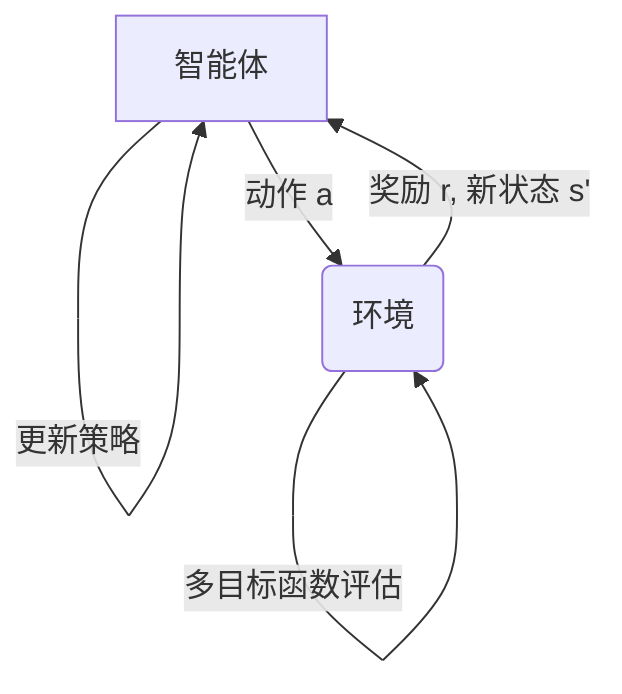

# 强化学习驱动的自适应多目标推理优化策略设计

> 关键词：强化学习、自适应、多目标推理、优化策略、策略设计

> 摘要：本文聚焦于强化学习驱动的自适应多目标推理优化策略设计。首先介绍了相关背景知识，包括研究目的、预期读者、文档结构等内容。接着阐述了核心概念及其联系，给出了原理和架构的文本示意图与 Mermaid 流程图。详细讲解了核心算法原理，通过 Python 代码进行阐述，并给出了相关数学模型和公式。在项目实战部分，展示了开发环境搭建、源代码实现及解读。同时探讨了实际应用场景，推荐了学习资源、开发工具框架以及相关论文著作。最后总结了未来发展趋势与挑战，解答了常见问题，并提供了扩展阅读和参考资料，旨在为该领域的研究和实践提供全面且深入的指导。

## 1. 背景介绍 
### 1.1 目的和范围
在当今复杂的计算环境中，多目标推理任务变得愈发普遍。例如，在智能交通系统中，需要同时考虑交通流量优化、能源消耗最小化以及乘客等待时间缩短等多个目标；在工业生产调度中，要兼顾生产效率、产品质量和成本控制等。传统的推理方法往往难以在多个目标之间取得平衡，而强化学习为解决这类问题提供了新的思路。

本文的目的在于设计一种基于强化学习的自适应多目标推理优化策略。该策略能够根据不同的任务场景和目标动态调整推理过程，以实现多个目标的最优折衷。范围涵盖了从核心概念的阐述、算法原理的讲解、数学模型的建立，到实际项目的应用和案例分析，为读者提供一个全面的技术视角。

### 1.2 预期读者
本文预期读者包括人工智能、机器学习领域的研究人员，他们可以从本文中获取关于强化学习在多目标推理优化方面的最新研究思路和方法；软件开发工程师，能够借鉴本文的算法实现和项目实践部分，将相关技术应用到实际项目中；以及对智能系统优化感兴趣的学生和爱好者，通过本文可以系统地学习强化学习驱动的多目标推理优化策略的设计方法。

### 1.3 文档结构概述
本文共分为十个部分。背景介绍部分说明了研究的目的、预期读者和文档结构；核心概念与联系部分详细解释了强化学习、多目标推理等核心概念，并给出了它们之间的联系；核心算法原理 & 具体操作步骤部分通过 Python 代码详细阐述了优化策略的算法原理；数学模型和公式部分建立了相关的数学模型，并进行了详细讲解和举例说明；项目实战部分展示了如何搭建开发环境、实现源代码以及对代码进行解读和分析；实际应用场景部分探讨了该策略在不同领域的应用；工具和资源推荐部分为读者提供了学习资源、开发工具框架和相关论文著作的推荐；总结部分分析了未来发展趋势与挑战；附录部分解答了常见问题；扩展阅读 & 参考资料部分提供了进一步学习的相关资料。

### 1.4 术语表
#### 1.4.1 核心术语定义
- **强化学习（Reinforcement Learning）**：一种机器学习范式，智能体通过与环境进行交互，根据环境反馈的奖励信号来学习最优行为策略，以最大化长期累积奖励。
- **多目标推理（Multi - objective Inference）**：在推理过程中需要同时考虑多个相互冲突或关联的目标，如准确性、效率、资源消耗等，并找到一个合适的解决方案来平衡这些目标。
- **自适应策略（Adaptive Strategy）**：能够根据环境变化、任务需求和目标动态调整自身行为的策略，以更好地适应不同的情况。
- **推理优化（Inference Optimization）**：通过各种方法和技术，提高推理过程的性能，如减少推理时间、降低资源消耗、提高推理结果的准确性等。

#### 1.4.2 相关概念解释
- **奖励函数（Reward Function）**：在强化学习中，奖励函数用于量化智能体的行为所带来的收益。对于多目标推理问题，奖励函数通常需要综合考虑多个目标，以引导智能体学习到能够平衡这些目标的策略。
- **策略网络（Policy Network）**：在深度强化学习中，策略网络是一个神经网络，用于根据当前的状态输出智能体的行为策略。
- **状态空间（State Space）**：所有可能的环境状态的集合，智能体在不同的状态下需要采取不同的行为来实现目标。
- **动作空间（Action Space）**：智能体可以采取的所有可能动作的集合。

#### 1.4.3 缩略词列表
- **RL**：Reinforcement Learning（强化学习）
- **MOI**：Multi - objective Inference（多目标推理）
- **DNN**：Deep Neural Network（深度神经网络）
- **DQN**：Deep Q - Network（深度 Q 网络）
- **PPO**：Proximal Policy Optimization（近端策略优化）

## 2. 核心概念与联系 

### 核心概念原理
#### 强化学习原理
强化学习的基本原理是智能体（Agent）与环境（Environment）进行交互。在每个时间步，智能体观察环境的当前状态 $s_t$，并根据自身的策略 $\pi$ 选择一个动作 $a_t$ 执行。环境在接收到动作后，会转移到下一个状态 $s_{t + 1}$，并给予智能体一个奖励 $r_t$。智能体的目标是学习一个最优策略 $\pi^*$，使得长期累积奖励 $\sum_{t = 0}^{\infty}\gamma^t r_t$ 最大化，其中 $\gamma$ 是折扣因子，用于权衡近期奖励和远期奖励。

#### 多目标推理原理
多目标推理需要同时考虑多个目标函数 $f_1(s,a), f_2(s,a), \cdots, f_n(s,a)$，其中 $s$ 是状态，$a$ 是动作。这些目标函数可能相互冲突，例如在一个资源分配问题中，提高某个任务的处理速度可能会增加资源消耗。因此，需要找到一个折衷的解决方案，使得多个目标都能在一定程度上得到满足。

#### 自适应策略原理
自适应策略能够根据环境的变化和目标的调整动态改变自身的行为。在强化学习中，这可以通过动态调整奖励函数、策略网络的参数等方式实现。例如，当环境的某些特征发生变化时，奖励函数可以相应地调整，以引导智能体学习到适应新环境的策略。

### 架构的文本示意图
```plaintext
+-------------------+
|  强化学习智能体   |
|                   |
|  策略网络         |
|  价值网络（可选） |
|                   |
+-------------------+
        |
        | 动作 a
        v
+-------------------+
|      环境         |
|                   |
|  状态 s           |
|  多目标函数 f(s,a)|
|                   |
+-------------------+
        |
        | 奖励 r, 新状态 s'
        v
+-------------------+
|  强化学习智能体   |
|                   |
|  更新策略网络     |
|  （可选：更新价值网络） |
|                   |
+-------------------+
```

### Mermaid 流程图


## 3. 核心算法原理 & 具体操作步骤 

### 算法原理
我们采用近端策略优化（PPO）算法作为强化学习的基础算法，因为它具有较高的样本效率和稳定性。PPO 算法通过优化策略网络的参数来最大化一个剪辑后的目标函数，从而避免策略更新过程中出现过大的策略变化。

对于多目标推理问题，我们将多个目标函数通过加权求和的方式整合到奖励函数中。设 $f_i(s,a)$ 是第 $i$ 个目标函数，$\omega_i$ 是其对应的权重，则奖励函数 $r(s,a)$ 可以表示为：

$r(s,a)=\sum_{i = 1}^{n}\omega_i f_i(s,a)$

### Python 代码实现
```python
import torch
import torch.nn as nn
import torch.optim as optim
import numpy as np

# 定义策略网络
class PolicyNetwork(nn.Module):
    def __init__(self, state_dim, action_dim):
        super(PolicyNetwork, self).__init__()
        self.fc1 = nn.Linear(state_dim, 64)
        self.fc2 = nn.Linear(64, 64)
        self.fc3 = nn.Linear(64, action_dim)
        self.softmax = nn.Softmax(dim=-1)

    def forward(self, state):
        x = torch.relu(self.fc1(state))
        x = torch.relu(self.fc2(x))
        action_probs = self.softmax(self.fc3(x))
        return action_probs

# 定义环境
class MultiObjectiveEnvironment:
    def __init__(self):
        self.state_dim = 10
        self.action_dim = 5

    def reset(self):
        state = np.random.randn(self.state_dim)
        return state

    def step(self, action):
        # 这里简单模拟多目标函数
        target1 = np.sum(action)
        target2 = np.sum(np.square(action))
        # 定义权重
        weights = [0.6, 0.4]
        reward = weights[0] * target1 + weights[1] * target2
        next_state = np.random.randn(self.state_dim)
        done = False
        return next_state, reward, done

# 定义 PPO 算法
class PPO:
    def __init__(self, state_dim, action_dim, lr=0.001, gamma=0.99, clip_eps=0.2):
        self.policy = PolicyNetwork(state_dim, action_dim)
        self.optimizer = optim.Adam(self.policy.parameters(), lr=lr)
        self.gamma = gamma
        self.clip_eps = clip_eps

    def select_action(self, state):
        state = torch.FloatTensor(state).unsqueeze(0)
        action_probs = self.policy(state)
        action = torch.multinomial(action_probs, 1).item()
        return action

    def update(self, states, actions, rewards):
        states = torch.FloatTensor(states)
        actions = torch.LongTensor(actions)
        rewards = torch.FloatTensor(rewards)

        # 计算优势函数
        advantages = rewards - rewards.mean()

        # 计算旧策略的动作概率
        old_action_probs = self.policy(states).gather(1, actions.unsqueeze(1)).squeeze(1)

        # 计算新策略的动作概率
        new_action_probs = self.policy(states).gather(1, actions.unsqueeze(1)).squeeze(1)

        # 计算比率
        ratio = new_action_probs / old_action_probs

        # 计算剪辑后的目标函数
        surr1 = ratio * advantages
        surr2 = torch.clamp(ratio, 1 - self.clip_eps, 1 + self.clip_eps) * advantages
        loss = -torch.min(surr1, surr2).mean()

        # 更新策略网络
        self.optimizer.zero_grad()
        loss.backward()
        self.optimizer.step()

# 主训练循环
if __name__ == "__main__":
    env = MultiObjectiveEnvironment()
    state_dim = env.state_dim
    action_dim = env.action_dim
    ppo = PPO(state_dim, action_dim)

    num_episodes = 1000
    for episode in range(num_episodes):
        state = env.reset()
        states, actions, rewards = [], [], []
        done = False
        while not done:
            action = ppo.select_action(state)
            next_state, reward, done = env.step(action)
            states.append(state)
            actions.append(action)
            rewards.append(reward)
            state = next_state
        ppo.update(states, actions, rewards)
        if episode % 100 == 0:
            print(f"Episode {episode}: Total Reward = {sum(rewards)}")
```

### 具体操作步骤
1. **初始化**：初始化策略网络、环境和 PPO 算法的参数。
2. **环境交互**：在每个训练周期中，智能体与环境进行交互，根据当前状态选择动作，执行动作并获取奖励和新状态。
3. **数据收集**：记录每个时间步的状态、动作和奖励。
4. **策略更新**：使用收集到的数据更新策略网络的参数，通过优化剪辑后的目标函数来提高策略性能。
5. **重复训练**：重复步骤 2 - 4，直到达到预设的训练周期数。

## 4. 数学模型和公式 & 详细讲解 & 举例说明 

### 数学模型
#### 多目标函数
设 $S$ 是状态空间，$A$ 是动作空间，$f_i:S\times A\rightarrow\mathbb{R}$ 是第 $i$ 个目标函数，$i = 1,2,\cdots,n$。我们的目标是找到一个策略 $\pi:A|S\rightarrow[0,1]$，使得多个目标函数在一定程度上得到优化。

#### 奖励函数
如前面所述，奖励函数 $r(s,a)$ 是多个目标函数的加权求和：

$r(s,a)=\sum_{i = 1}^{n}\omega_i f_i(s,a)$

其中 $\omega_i\geq0$ 且 $\sum_{i = 1}^{n}\omega_i = 1$。

#### PPO 目标函数
PPO 算法的目标是最大化以下剪辑后的目标函数：

$L^{CLIP}(\theta)=\hat{\mathbb{E}}_t\left[\min\left(r_t(\theta)\hat{A}_t,\text{clip}(r_t(\theta),1 - \epsilon,1+\epsilon)\hat{A}_t\right)\right]$

其中 $r_t(\theta)=\frac{\pi_{\theta}(a_t|s_t)}{\pi_{\theta_{old}}(a_t|s_t)}$ 是新策略和旧策略的动作概率比率，$\hat{A}_t$ 是优势函数，$\epsilon$ 是剪辑参数。

### 详细讲解
#### 多目标函数
多目标函数用于描述不同的优化目标。例如，在一个图像分类任务中，$f_1$ 可以表示分类准确率，$f_2$ 可以表示推理时间。不同的任务和场景会有不同的目标函数，需要根据具体情况进行定义。

#### 奖励函数
奖励函数的作用是将多个目标整合到一个统一的数值中，以便强化学习智能体能够根据奖励信号学习到最优策略。权重 $\omega_i$ 反映了每个目标的重要性，可以根据实际需求进行调整。

#### PPO 目标函数
PPO 目标函数通过剪辑操作来限制策略更新的幅度，避免策略更新过快导致性能不稳定。当 $r_t(\theta)$ 超出 $[1 - \epsilon,1+\epsilon]$ 范围时，使用剪辑后的比率来计算目标函数，从而保证策略更新的平稳性。

### 举例说明
假设我们有一个简单的资源分配问题，有两个目标：最大化资源利用率 $f_1(s,a)$ 和最小化资源消耗 $f_2(s,a)$。我们可以定义权重 $\omega_1 = 0.6$ 和 $\omega_2 = 0.4$，则奖励函数为：

$r(s,a)=0.6f_1(s,a)-0.4f_2(s,a)$

在 PPO 算法中，我们使用这个奖励函数来计算优势函数和目标函数，从而更新策略网络的参数，使得智能体能够学习到在资源利用率和资源消耗之间取得平衡的策略。

## 5. 项目实战：代码实际案例和详细解释说明 

### 5.1  开发环境搭建
#### 操作系统
建议使用 Linux 系统，如 Ubuntu 18.04 或更高版本，因为 Linux 系统对深度学习开发有良好的支持。

#### Python 环境
安装 Python 3.7 或更高版本。可以使用 Anaconda 来管理 Python 环境，具体步骤如下：
1. 下载并安装 Anaconda：从 [Anaconda 官网](https://www.anaconda.com/products/individual) 下载适合自己系统的 Anaconda 安装包，并按照提示进行安装。
2. 创建虚拟环境：打开终端，运行以下命令创建一个名为 `rl_moi` 的虚拟环境：
```bash
conda create -n rl_moi python=3.8
```
3. 激活虚拟环境：
```bash
conda activate rl_moi
```

#### 安装依赖库
在激活的虚拟环境中，安装所需的依赖库，包括 PyTorch、NumPy 等：
```bash
pip install torch numpy
```

### 5.2  源代码详细实现和代码解读
```python
import torch
import torch.nn as nn
import torch.optim as optim
import numpy as np

# 定义策略网络
class PolicyNetwork(nn.Module):
    def __init__(self, state_dim, action_dim):
        super(PolicyNetwork, self).__init__()
        self.fc1 = nn.Linear(state_dim, 64)
        self.fc2 = nn.Linear(64, 64)
        self.fc3 = nn.Linear(64, action_dim)
        self.softmax = nn.Softmax(dim=-1)

    def forward(self, state):
        x = torch.relu(self.fc1(state))
        x = torch.relu(self.fc2(x))
        action_probs = self.softmax(self.fc3(x))
        return action_probs
```
**代码解读**：
- `PolicyNetwork` 类继承自 `nn.Module`，是一个三层全连接神经网络。
- `fc1`、`fc2` 和 `fc3` 分别是三个全连接层，用于对输入的状态进行特征提取和转换。
- `softmax` 函数用于将输出转换为动作概率分布。

```python
# 定义环境
class MultiObjectiveEnvironment:
    def __init__(self):
        self.state_dim = 10
        self.action_dim = 5

    def reset(self):
        state = np.random.randn(self.state_dim)
        return state

    def step(self, action):
        # 这里简单模拟多目标函数
        target1 = np.sum(action)
        target2 = np.sum(np.square(action))
        # 定义权重
        weights = [0.6, 0.4]
        reward = weights[0] * target1 + weights[1] * target2
        next_state = np.random.randn(self.state_dim)
        done = False
        return next_state, reward, done
```
**代码解读**：
- `MultiObjectiveEnvironment` 类模拟了一个多目标推理环境。
- `reset` 方法用于初始化环境状态，返回一个随机生成的状态。
- `step` 方法根据输入的动作计算多目标函数的值，并根据权重计算奖励，同时返回下一个状态和是否结束的标志。

```python
# 定义 PPO 算法
class PPO:
    def __init__(self, state_dim, action_dim, lr=0.001, gamma=0.99, clip_eps=0.2):
        self.policy = PolicyNetwork(state_dim, action_dim)
        self.optimizer = optim.Adam(self.policy.parameters(), lr=lr)
        self.gamma = gamma
        self.clip_eps = clip_eps

    def select_action(self, state):
        state = torch.FloatTensor(state).unsqueeze(0)
        action_probs = self.policy(state)
        action = torch.multinomial(action_probs, 1).item()
        return action

    def update(self, states, actions, rewards):
        states = torch.FloatTensor(states)
        actions = torch.LongTensor(actions)
        rewards = torch.FloatTensor(rewards)

        # 计算优势函数
        advantages = rewards - rewards.mean()

        # 计算旧策略的动作概率
        old_action_probs = self.policy(states).gather(1, actions.unsqueeze(1)).squeeze(1)

        # 计算新策略的动作概率
        new_action_probs = self.policy(states).gather(1, actions.unsqueeze(1)).squeeze(1)

        # 计算比率
        ratio = new_action_probs / old_action_probs

        # 计算剪辑后的目标函数
        surr1 = ratio * advantages
        surr2 = torch.clamp(ratio, 1 - self.clip_eps, 1 + self.clip_eps) * advantages
        loss = -torch.min(surr1, surr2).mean()

        # 更新策略网络
        self.optimizer.zero_grad()
        loss.backward()
        self.optimizer.step()
```
**代码解读**：
- `PPO` 类实现了近端策略优化算法。
- `__init__` 方法初始化策略网络、优化器和超参数。
- `select_action` 方法根据当前状态选择一个动作，通过采样动作概率分布得到。
- `update` 方法根据收集到的数据更新策略网络的参数，包括计算优势函数、旧策略和新策略的动作概率、比率、剪辑后的目标函数和损失，最后进行反向传播和参数更新。

```python
# 主训练循环
if __name__ == "__main__":
    env = MultiObjectiveEnvironment()
    state_dim = env.state_dim
    action_dim = env.action_dim
    ppo = PPO(state_dim, action_dim)

    num_episodes = 1000
    for episode in range(num_episodes):
        state = env.reset()
        states, actions, rewards = [], [], []
        done = False
        while not done:
            action = ppo.select_action(state)
            next_state, reward, done = env.step(action)
            states.append(state)
            actions.append(action)
            rewards.append(reward)
            state = next_state
        ppo.update(states, actions, rewards)
        if episode % 100 == 0:
            print(f"Episode {episode}: Total Reward = {sum(rewards)}")
```
**代码解读**：
- 主训练循环部分创建了环境和 PPO 算法实例。
- 在每个训练周期中，智能体与环境进行交互，收集状态、动作和奖励数据。
- 每个周期结束后，调用 `update` 方法更新策略网络的参数。
- 每 100 个周期打印一次总奖励，用于监控训练过程。

### 5.3  代码解读与分析
#### 策略网络分析
策略网络的结构相对简单，采用了三层全连接神经网络。这种结构可以对输入的状态进行有效的特征提取和转换，将状态映射到动作概率分布。通过 `softmax` 函数，输出的动作概率之和为 1，便于进行动作采样。

#### 环境模拟分析
环境模拟部分通过简单的数学函数模拟了多目标函数，实际应用中需要根据具体的任务和场景进行定义。通过加权求和的方式将多个目标整合到奖励函数中，引导智能体学习到平衡多个目标的策略。

#### PPO 算法分析
PPO 算法通过剪辑目标函数来限制策略更新的幅度，避免了策略更新过快导致的性能不稳定问题。优势函数的使用可以提高算法的收敛速度，使得智能体能够更快地学习到最优策略。

## 6. 实际应用场景 
### 智能交通系统
在智能交通系统中，需要同时考虑交通流量优化、能源消耗最小化和乘客等待时间缩短等多个目标。通过强化学习驱动的自适应多目标推理优化策略，可以根据实时的交通状况动态调整交通信号灯的时间分配、车辆的行驶路线等，以实现多个目标的最优折衷。

### 工业生产调度
工业生产调度中，要兼顾生产效率、产品质量和成本控制等多个目标。该策略可以根据设备状态、原材料供应情况和订单需求等信息，动态调整生产计划和任务分配，提高生产系统的整体性能。

### 金融投资决策
在金融投资决策中，需要同时考虑投资收益最大化、风险最小化和流动性等多个目标。通过强化学习智能体，可以根据市场行情和资产信息，实时调整投资组合，以实现多个目标的平衡。

### 医疗资源分配
在医疗资源分配中，要考虑患者的治疗效果、医疗资源的利用率和公平性等多个目标。该策略可以根据患者的病情、医院的资源状况等信息，合理分配医疗资源，提高医疗服务的质量和效率。

## 7. 工具和资源推荐
### 7.1 学习资源推荐
#### 7.1.1 书籍推荐
- 《Reinforcement Learning: An Introduction》：这是强化学习领域的经典教材，全面介绍了强化学习的基本概念、算法和应用，适合初学者和有一定基础的读者。
- 《Deep Reinforcement Learning Hands-On》：本书通过大量的实践案例，详细介绍了深度强化学习的实现方法和应用技巧，对于想深入学习强化学习的读者非常有帮助。

#### 7.1.2 在线课程
- Coursera 上的 “Reinforcement Learning Specialization”：由顶尖高校的教授授课，系统地介绍了强化学习的理论和实践，提供了丰富的编程作业和项目实践。
- Udemy 上的 “Deep Reinforcement Learning A-Z: Hands-On Artificial Intelligence”：课程内容生动有趣，通过实际案例讲解深度强化学习的原理和应用，适合初学者快速入门。

#### 7.1.3 技术博客和网站
- OpenAI Blog：OpenAI 官方博客，提供了强化学习领域的最新研究成果和技术动态。
- Medium 上的 “Towards Data Science”：该博客上有很多关于强化学习的优质文章，涵盖了理论、算法和应用等多个方面。

### 7.2 开发工具框架推荐
#### 7.2.1 IDE和编辑器
- PyCharm：一款功能强大的 Python 集成开发环境，提供了代码编辑、调试、版本控制等丰富的功能，适合开发强化学习项目。
- Jupyter Notebook：一种交互式的开发环境，方便进行代码编写、实验验证和结果展示，对于强化学习的研究和实践非常有用。

#### 7.2.2 调试和性能分析工具
- TensorBoard：TensorFlow 提供的可视化工具，可以用于监控训练过程中的损失函数、奖励曲线等指标，帮助开发者调试和优化模型。
- Py-Spy：一个轻量级的 Python 性能分析工具，可以分析代码的运行时间和内存使用情况，帮助开发者找出性能瓶颈。

#### 7.2.3 相关框架和库
- PyTorch：一个开源的深度学习框架，提供了丰富的神经网络层和优化算法，对于实现强化学习算法非常方便。
- Stable Baselines3：一个基于 PyTorch 的强化学习库，实现了多种经典的强化学习算法，提供了统一的接口和工具，方便开发者进行实验和应用。

### 7.3 相关论文著作推荐
#### 7.3.1 经典论文
- “Proximal Policy Optimization Algorithms”：PPO 算法的原始论文，详细介绍了 PPO 算法的原理和实现方法。
- “Deep Q-Networks”：深度 Q 网络的经典论文，开创了深度强化学习的先河。

#### 7.3.2 最新研究成果
- 每年的 NeurIPS、ICML、AAAI 等顶级人工智能会议上都会有关于强化学习在多目标推理优化方面的最新研究成果，可以关注这些会议的论文。

#### 7.3.3 应用案例分析
- 一些实际应用案例的论文，如智能交通系统、工业生产调度等领域的强化学习应用论文，可以帮助读者了解该技术在实际场景中的应用方法和效果。

## 8. 总结：未来发展趋势与挑战
### 未来发展趋势
#### 多目标融合的深度强化学习
未来的研究将更加注重多目标之间的融合和协同优化，通过设计更加复杂和有效的奖励函数和策略网络结构，实现多个目标的更优平衡。

#### 自适应策略的动态调整
强化学习智能体将具备更强的自适应能力，能够根据环境的动态变化实时调整策略，以适应不同的任务和场景。

#### 与其他技术的融合
强化学习将与深度学习、计算机视觉、自然语言处理等技术进行更深入的融合，拓展其应用领域和解决问题的能力。

### 挑战
#### 多目标权衡的复杂性
多个目标之间可能存在复杂的相互关系，如何合理地权衡这些目标是一个挑战。需要开发更加科学和有效的多目标优化方法。

#### 数据收集和标注的困难
在一些实际应用场景中，数据收集和标注可能非常困难，这会影响强化学习算法的训练效果。需要探索新的数据收集和增强方法。

#### 算法的可解释性
强化学习算法的决策过程往往缺乏可解释性，这在一些对安全性和可靠性要求较高的领域，如医疗、金融等，是一个重要的问题。需要研究如何提高算法的可解释性。

## 9. 附录：常见问题与解答
### 问题 1：如何选择多目标函数的权重？
答：多目标函数的权重选择需要根据具体的任务和场景进行调整。可以通过先验知识、专家经验或者实验的方法来确定。例如，可以在不同的权重设置下进行多次实验，观察智能体的学习效果和多个目标的实现情况，选择最优的权重组合。

### 问题 2：PPO 算法的超参数如何调整？
答：PPO 算法的超参数包括学习率、折扣因子、剪辑参数等。一般可以采用网格搜索、随机搜索等方法进行超参数调优。也可以参考相关的研究论文和实践经验，选择合适的初始值，然后根据训练过程中的表现进行微调。

### 问题 3：如何处理环境的动态变化？
答：可以采用自适应策略，如动态调整奖励函数、更新策略网络的参数等。也可以使用在线学习的方法，让智能体在与环境交互的过程中不断学习和适应新的环境。

## 10. 扩展阅读 & 参考资料
### 扩展阅读
- 关于多目标优化的其他方法，如遗传算法、粒子群算法等，可以进一步了解它们与强化学习的结合应用。
- 深度学习中的注意力机制、生成对抗网络等技术，可能为强化学习驱动的多目标推理优化提供新的思路。

### 参考资料
- Sutton, R. S., & Barto, A. G. (2018). Reinforcement Learning: An Introduction. MIT press.
- Schulman, J., Wolski, F., Dhariwal, P., Radford, A., & Klimov, O. (2017). Proximal Policy Optimization Algorithms. arXiv preprint arXiv:1707.06347.

作者：AI天才研究院/AI Genius Institute & 禅与计算机程序设计艺术 /Zen And The Art of Computer Programming