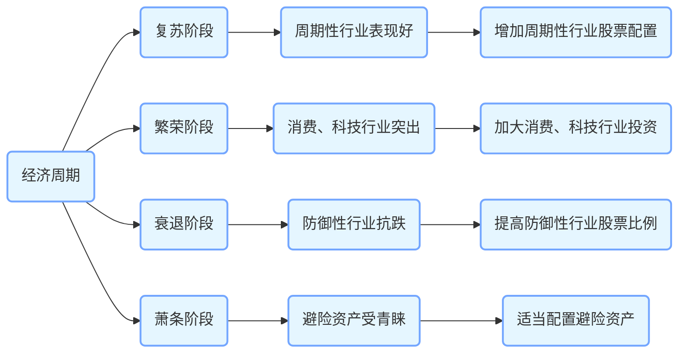

# 彼得·林奇的行业轮动投资策略

> 关键词：彼得·林奇、行业轮动、投资策略、股票市场、经济周期

> 摘要：本文深入探讨彼得·林奇的行业轮动投资策略。从背景介绍入手，阐述该策略产生的目的、适用读者群体等。详细讲解核心概念与联系，剖析其原理与架构，并以流程图展示。接着分析核心算法原理，用 Python 代码说明具体操作步骤。同时给出相关数学模型和公式并举例。通过项目实战，展示代码案例并进行详细解读。探讨该策略的实际应用场景，推荐学习、开发相关的工具和资源，包括书籍、在线课程、技术博客等。最后总结其未来发展趋势与挑战，解答常见问题并提供扩展阅读和参考资料，全面呈现彼得·林奇行业轮动投资策略的全貌。

## 1. 背景介绍 
### 1.1 目的和范围
彼得·林奇作为投资界的传奇人物，其行业轮动投资策略在投资领域有着深远的影响。本文的目的在于深入剖析这一策略，揭示其核心原理、操作方法以及实际应用价值。范围涵盖从理论基础到实际案例的全面分析，旨在帮助投资者更好地理解和运用这一策略，提升投资决策的科学性和有效性。

### 1.2 预期读者
本文预期读者包括广大投资者，无论是专业的金融从业者，还是普通的个人投资者，都能从本文中获取有价值的信息。对于正在学习投资知识的学生，以及对投资策略感兴趣的爱好者，也具有一定的参考意义。

### 1.3 文档结构概述
本文首先介绍彼得·林奇行业轮动投资策略的背景信息，包括目的、读者群体和文档结构等。接着阐述核心概念与联系，通过原理和架构的分析以及流程图的展示，让读者对策略有初步的认识。然后详细讲解核心算法原理和具体操作步骤，结合 Python 代码进行说明。随后给出相关的数学模型和公式，并举例说明其应用。通过项目实战，展示实际代码案例并进行详细解读。探讨该策略在不同场景下的实际应用。推荐学习、开发相关的工具和资源，包括书籍、在线课程等。最后总结未来发展趋势与挑战，解答常见问题并提供扩展阅读和参考资料。

### 1.4 术语表
#### 1.4.1 核心术语定义
- **行业轮动**：指在经济周期的不同阶段，不同行业的表现会有所差异，投资者通过在不同行业之间进行切换，以获取更高的投资回报。
- **经济周期**：指经济活动沿着经济发展的总体趋势所经历的有规律的扩张和收缩，一般包括复苏、繁荣、衰退和萧条四个阶段。
- **成长股**：指发行股票时规模并不大，但公司的业务蒸蒸日上，管理良好、利润丰厚，产品在市场上有较强竞争力的上市公司的股票。
- **价值股**：指相对于它们的现有收益，股价被低估的一类股票。这类股票通常具有较高的股息收益率和较低的市盈率。

#### 1.4.2 相关概念解释
- **行业分析**：对不同行业的市场结构、竞争格局、发展趋势等进行研究和评估的过程。通过行业分析，可以了解各个行业的特点和优势，为投资决策提供依据。
- **基本面分析**：通过对公司的财务状况、经营业绩、行业地位等基本面因素进行分析，评估公司的内在价值，从而判断股票的投资价值。
- **技术分析**：通过对股票价格、成交量等市场数据的分析，预测股票价格的未来走势。技术分析主要基于市场行为和历史数据，不考虑公司的基本面因素。

#### 1.4.3 缩略词列表
- **GDP**：国内生产总值（Gross Domestic Product），是指一个国家（或地区）所有常住单位在一定时期内生产活动的最终成果。
- **CPI**：居民消费价格指数（Consumer Price Index），是一个反映居民家庭一般所购买的消费品和服务项目价格水平变动情况的宏观经济指标。
- **P/E**：市盈率（Price-to-Earnings Ratio），是指股票价格除以每股收益的比率，反映了市场对公司未来盈利的预期。

## 2. 核心概念与联系 
### 核心概念原理
彼得·林奇的行业轮动投资策略基于经济周期理论。经济周期的不同阶段会对各个行业产生不同的影响，从而导致不同行业的股票表现出现差异。在经济复苏阶段，一些周期性行业，如汽车、钢铁等，通常会率先受益，因为随着经济的复苏，对这些行业产品的需求会增加。在经济繁荣阶段，消费、科技等行业往往表现较好，因为消费者的购买力增强，对科技产品的需求也会增加。在经济衰退阶段，防御性行业，如公用事业、医药等，通常比较抗跌，因为这些行业的产品需求相对稳定，不受经济周期的影响较大。在经济萧条阶段，一些避险资产，如黄金等，可能会受到投资者的青睐。

投资者可以根据经济周期的不同阶段，调整自己的投资组合，将资金从表现不佳的行业转移到表现较好的行业，从而实现资产的增值。

### 架构的文本示意图
```plaintext
经济周期
|-- 复苏阶段
|   |-- 周期性行业（汽车、钢铁等）表现较好
|   |-- 投资者增加对周期性行业股票的配置
|-- 繁荣阶段
|   |-- 消费、科技等行业表现突出
|   |-- 投资者加大对消费、科技行业股票的投资
|-- 衰退阶段
|   |-- 防御性行业（公用事业、医药等）相对抗跌
|   |-- 投资者提高防御性行业股票的比例
|-- 萧条阶段
|   |-- 避险资产（黄金等）受青睐
|   |-- 投资者适当配置避险资产
```

### Mermaid 流程图


## 3. 核心算法原理 & 具体操作步骤 
### 核心算法原理
彼得·林奇的行业轮动投资策略的核心算法原理是基于对经济周期的判断和对行业表现的分析。投资者需要通过对宏观经济数据的研究，判断当前经济处于周期的哪个阶段。然后，根据不同阶段各个行业的表现规律，选择表现较好的行业进行投资。

具体来说，投资者可以通过以下步骤来实现行业轮动：
1. **经济周期判断**：通过分析 GDP、CPI 等宏观经济数据，结合经济指标的变化趋势，判断当前经济处于复苏、繁荣、衰退还是萧条阶段。
2. **行业表现分析**：研究历史数据，了解不同经济周期阶段各个行业的表现情况。例如，在经济复苏阶段，周期性行业的盈利增长通常较快，股价表现也较好；在经济繁荣阶段，消费、科技行业的市场需求旺盛，股价可能会大幅上涨。
3. **投资组合调整**：根据经济周期判断和行业表现分析的结果，调整投资组合。将资金从表现不佳的行业转移到表现较好的行业，以实现资产的优化配置。

### Python 源代码详细阐述
```python
import pandas as pd
import numpy as np

# 模拟宏观经济数据
gdp_data = pd.Series([100, 105, 110, 108, 102, 98, 95, 92, 90, 93])
cpi_data = pd.Series([2, 2.2, 2.5, 2.3, 2.1, 1.9, 1.7, 1.5, 1.3, 1.4])

# 定义经济周期判断函数
def judge_economic_cycle(gdp, cpi):
    """
    判断经济周期阶段
    :param gdp: GDP 数据序列
    :param cpi: CPI 数据序列
    :return: 经济周期阶段（复苏、繁荣、衰退、萧条）
    """
    gdp_growth = gdp.pct_change().dropna()
    cpi_growth = cpi.pct_change().dropna()
    
    if gdp_growth.iloc[-1] > 0 and cpi_growth.iloc[-1] > 0:
        return "繁荣阶段"
    elif gdp_growth.iloc[-1] > 0 and cpi_growth.iloc[-1] < 0:
        return "复苏阶段"
    elif gdp_growth.iloc[-1] < 0 and cpi_growth.iloc[-1] > 0:
        return "衰退阶段"
    else:
        return "萧条阶段"

# 定义行业表现字典
industry_performance = {
    "复苏阶段": ["汽车", "钢铁"],
    "繁荣阶段": ["消费", "科技"],
    "衰退阶段": ["公用事业", "医药"],
    "萧条阶段": ["黄金"]
}

# 判断当前经济周期阶段
current_cycle = judge_economic_cycle(gdp_data, cpi_data)
print(f"当前经济处于：{current_cycle}")

# 选择表现较好的行业
good_industries = industry_performance[current_cycle]
print(f"当前阶段表现较好的行业：{good_industries}")
```
### 代码解释
1. **数据模拟**：使用 `pandas` 库创建了模拟的 GDP 和 CPI 数据序列。
2. **经济周期判断函数**：`judge_economic_cycle` 函数通过计算 GDP 和 CPI 的增长率，根据增长率的正负情况判断当前经济处于哪个周期阶段。
3. **行业表现字典**：定义了一个字典 `industry_performance`，存储了不同经济周期阶段表现较好的行业。
4. **判断当前经济周期阶段**：调用 `judge_economic_cycle` 函数，判断当前经济处于哪个周期阶段，并打印结果。
5. **选择表现较好的行业**：根据当前经济周期阶段，从 `industry_performance` 字典中选择表现较好的行业，并打印结果。

## 4. 数学模型和公式 & 详细讲解 & 举例说明 
### 经济周期判断模型
经济周期的判断可以基于一些宏观经济指标的变化。常用的指标包括 GDP 增长率和 CPI 增长率。可以使用以下简单的数学模型来判断经济周期阶段：

设 $g_{GDP}$ 为 GDP 增长率，$g_{CPI}$ 为 CPI 增长率，则经济周期阶段的判断规则如下：
- 当 $g_{GDP} > 0$ 且 $g_{CPI} > 0$ 时，经济处于繁荣阶段；
- 当 $g_{GDP} > 0$ 且 $g_{CPI} < 0$ 时，经济处于复苏阶段；
- 当 $g_{GDP} < 0$ 且 $g_{CPI} > 0$ 时，经济处于衰退阶段；
- 当 $g_{GDP} < 0$ 且 $g_{CPI} < 0$ 时，经济处于萧条阶段。

### 举例说明
假设某国家的 GDP 数据如下：$GDP_1 = 100$，$GDP_2 = 105$，$GDP_3 = 110$，$GDP_4 = 108$。CPI 数据如下：$CPI_1 = 2$，$CPI_2 = 2.2$，$CPI_3 = 2.5$，$CPI_4 = 2.3$。

首先计算 GDP 增长率：
$g_{GDP_2} = \frac{GDP_2 - GDP_1}{GDP_1} = \frac{105 - 100}{100} = 0.05$
$g_{GDP_3} = \frac{GDP_3 - GDP_2}{GDP_2} = \frac{110 - 105}{105} \approx 0.0476$
$g_{GDP_4} = \frac{GDP_4 - GDP_3}{GDP_3} = \frac{108 - 110}{110} \approx -0.0182$

然后计算 CPI 增长率：
$g_{CPI_2} = \frac{CPI_2 - CPI_1}{CPI_1} = \frac{2.2 - 2}{2} = 0.1$
$g_{CPI_3} = \frac{CPI_3 - CPI_2}{CPI_2} = \frac{2.5 - 2.2}{2.2} \approx 0.1364$
$g_{CPI_4} = \frac{CPI_4 - CPI_3}{CPI_3} = \frac{2.3 - 2.5}{2.5} = -0.08$

对于第 4 期数据，$g_{GDP_4} < 0$ 且 $g_{CPI_4} < 0$，根据判断规则，此时经济处于萧条阶段。

## 5. 项目实战：代码实际案例和详细解释说明 
### 5.1  开发环境搭建
- **Python 安装**：从 Python 官方网站（https://www.python.org/downloads/）下载并安装 Python 3.x 版本。
- **IDE 选择**：推荐使用 PyCharm 或 Jupyter Notebook 作为开发环境。
- **库安装**：在命令行中使用以下命令安装所需的库：
```sh
pip install pandas numpy
```

### 5.2  源代码详细实现和代码解读
```python
import pandas as pd
import numpy as np
import yfinance as yf  # 用于获取股票数据

# 定义行业股票代码列表
industry_stocks = {
    "汽车": ["TSLA", "GM"],
    "钢铁": ["X", "NUE"],
    "消费": ["PG", "KO"],
    "科技": ["AAPL", "MSFT"],
    "公用事业": ["DUK", "SO"],
    "医药": ["JNJ", "PFE"],
    "黄金": ["GLD", "ABX"]
}

# 定义时间范围
start_date = "2020-01-01"
end_date = "2021-12-31"

# 获取宏观经济数据（这里使用模拟数据，实际应用中可从相关网站获取）
gdp_data = pd.Series([100, 105, 110, 108, 102, 98, 95, 92, 90, 93])
cpi_data = pd.Series([2, 2.2, 2.5, 2.3, 2.1, 1.9, 1.7, 1.5, 1.3, 1.4])

# 定义经济周期判断函数
def judge_economic_cycle(gdp, cpi):
    """
    判断经济周期阶段
    :param gdp: GDP 数据序列
    :param cpi: CPI 数据序列
    :return: 经济周期阶段（复苏、繁荣、衰退、萧条）
    """
    gdp_growth = gdp.pct_change().dropna()
    cpi_growth = cpi.pct_change().dropna()
    
    if gdp_growth.iloc[-1] > 0 and cpi_growth.iloc[-1] > 0:
        return "繁荣阶段"
    elif gdp_growth.iloc[-1] > 0 and cpi_growth.iloc[-1] < 0:
        return "复苏阶段"
    elif gdp_growth.iloc[-1] < 0 and cpi_growth.iloc[-1] > 0:
        return "衰退阶段"
    else:
        return "萧条阶段"

# 定义行业表现字典
industry_performance = {
    "复苏阶段": ["汽车", "钢铁"],
    "繁荣阶段": ["消费", "科技"],
    "衰退阶段": ["公用事业", "医药"],
    "萧条阶段": ["黄金"]
}

# 判断当前经济周期阶段
current_cycle = judge_economic_cycle(gdp_data, cpi_data)
print(f"当前经济处于：{current_cycle}")

# 选择表现较好的行业
good_industries = industry_performance[current_cycle]
print(f"当前阶段表现较好的行业：{good_industries}")

# 获取表现较好行业的股票数据
good_stocks = []
for industry in good_industries:
    good_stocks.extend(industry_stocks[industry])

stock_data = yf.download(good_stocks, start=start_date, end=end_date)
print("表现较好行业的股票数据：")
print(stock_data.head())
```
### 5.3  代码解读与分析
1. **行业股票代码列表**：定义了一个字典 `industry_stocks`，存储了各个行业的股票代码。
2. **时间范围定义**：定义了获取股票数据的时间范围 `start_date` 和 `end_date`。
3. **宏观经济数据**：使用模拟的 GDP 和 CPI 数据，实际应用中可从相关网站获取真实数据。
4. **经济周期判断函数**：与前面的代码相同，用于判断当前经济处于哪个周期阶段。
5. **选择表现较好的行业**：根据当前经济周期阶段，从 `industry_performance` 字典中选择表现较好的行业。
6. **获取股票数据**：使用 `yfinance` 库获取表现较好行业的股票数据，并打印数据的前几行。

## 6. 实际应用场景 
### 个人投资者
对于个人投资者来说，彼得·林奇的行业轮动投资策略可以帮助他们优化投资组合，提高投资收益。个人投资者可以根据经济周期的变化，调整自己的股票投资比例，将资金从表现不佳的行业转移到表现较好的行业。例如，在经济复苏阶段，增加对汽车、钢铁等周期性行业股票的投资；在经济繁荣阶段，加大对消费、科技等行业股票的配置。

### 机构投资者
机构投资者，如基金公司、保险公司等，也可以运用行业轮动投资策略进行资产配置。机构投资者通常拥有更丰富的研究资源和专业的投资团队，能够更准确地判断经济周期的变化和行业的表现。通过行业轮动策略，机构投资者可以实现资产的多元化配置，降低投资风险，提高投资组合的整体收益。

### 风险管理
行业轮动投资策略还可以用于风险管理。在经济衰退阶段，投资者可以增加对防御性行业，如公用事业、医药等行业股票的投资，以降低投资组合的波动性。在经济萧条阶段，适当配置避险资产，如黄金等，能够有效抵御市场风险，保护投资者的资产安全。

## 7. 工具和资源推荐
### 7.1 学习资源推荐
#### 7.1.1 书籍推荐
- 《彼得·林奇的成功投资》：彼得·林奇的经典著作，详细介绍了他的投资理念和方法，包括行业轮动投资策略。
- 《聪明的投资者》：本杰明·格雷厄姆的经典投资书籍，阐述了价值投资的理念和方法，对理解行业轮动投资策略有一定的帮助。
- 《漫步华尔街》：伯顿·马尔基尔的著作，介绍了各种投资理论和方法，包括随机漫步理论和有效市场假说，有助于投资者拓宽投资视野。

#### 7.1.2 在线课程
- Coursera 上的《投资学原理》：由知名大学教授授课，系统介绍投资学的基本原理和方法，包括资产定价、投资组合管理等内容。
- edX 上的《金融市场》：由耶鲁大学教授罗伯特·席勒授课，讲解金融市场的运行机制和投资策略，对理解行业轮动投资策略有一定的启发。

#### 7.1.3 技术博客和网站
- 雪球网：国内知名的投资交流社区，提供股票、基金等投资产品的资讯和分析，投资者可以在上面交流投资经验和心得。
- 东方财富网：提供全面的金融资讯和数据服务，包括股票行情、宏观经济数据等，有助于投资者了解市场动态和行业信息。

### 7.2 开发工具框架推荐
#### 7.2.1 IDE和编辑器
- PyCharm：专业的 Python 集成开发环境，提供代码编辑、调试、版本控制等功能，适合开发复杂的投资分析程序。
- Jupyter Notebook：交互式的开发环境，支持 Python、R 等多种编程语言，方便进行数据探索和分析。

#### 7.2.2 调试和性能分析工具
- Py-Spy：用于分析 Python 程序的性能，找出程序中的性能瓶颈。
- PDB：Python 内置的调试工具，可用于调试 Python 代码，定位程序中的错误。

#### 7.2.3 相关框架和库
- Pandas：用于数据处理和分析的 Python 库，提供了高效的数据结构和数据操作方法，适合处理金融数据。
- Numpy：Python 的数值计算库，提供了高效的数组操作和数学函数，可用于金融数据的计算和分析。
- yfinance：用于获取股票数据的 Python 库，支持从雅虎财经获取股票行情、财务报表等数据。

### 7.3 相关论文著作推荐
#### 7.3.1 经典论文
- Fama, E. F., & French, K. R. (1992). The cross-section of expected stock returns. *The Journal of Finance*, 47(2), 427-465. 该论文提出了著名的 Fama-French 三因子模型，对理解股票收益的影响因素有重要意义。
- Sharpe, W. F. (1964). Capital asset prices: A theory of market equilibrium under conditions of risk. *The Journal of Finance*, 19(3), 425-442. 该论文提出了资本资产定价模型（CAPM），为资产定价提供了理论基础。

#### 7.3.2 最新研究成果
- 关注顶级金融学术期刊，如 *The Journal of Finance*、*The Review of Financial Studies* 等，了解行业轮动投资策略的最新研究进展。

#### 7.3.3 应用案例分析
- 可以参考一些知名投资机构的研究报告和案例分析，了解他们在实际投资中如何运用行业轮动投资策略。

## 8. 总结：未来发展趋势与挑战
### 未来发展趋势
- **智能化发展**：随着人工智能和大数据技术的不断发展，行业轮动投资策略将越来越智能化。投资者可以利用机器学习算法对宏观经济数据和行业数据进行分析，更准确地判断经济周期的变化和行业的表现，从而实现更精准的行业轮动。
- **全球化趋势**：在全球化的背景下，各个国家和地区的经济联系日益紧密，行业轮动投资策略也将更加注重全球市场的变化。投资者需要关注全球宏观经济形势和不同国家和地区的行业发展动态，进行跨市场的行业轮动投资。
- **多元化投资**：未来的行业轮动投资策略将不仅仅局限于股票市场，还将涉及债券、期货、外汇等多个金融市场。投资者可以通过多元化的投资组合，进一步降低投资风险，提高投资收益。

### 挑战
- **经济周期判断难度加大**：随着全球经济的复杂性和不确定性增加，经济周期的变化越来越难以准确判断。宏观经济数据的波动频繁，经济指标之间的关系也变得更加复杂，这给投资者判断经济周期带来了很大的挑战。
- **行业竞争加剧**：各个行业的竞争日益激烈，行业的发展趋势也更加难以预测。一些新兴行业的崛起和传统行业的衰落速度加快，投资者需要及时调整投资策略，跟上行业变化的步伐。
- **政策风险**：政府的政策调整对经济和行业的影响较大。政策的不确定性增加了投资的风险，投资者需要密切关注政策变化，及时调整投资组合。

## 9. 附录：常见问题与解答
### 1. 如何准确判断经济周期阶段？
判断经济周期阶段需要综合考虑多个宏观经济指标，如 GDP、CPI、失业率等。可以通过分析这些指标的变化趋势，结合经济理论和历史经验，来判断当前经济处于哪个周期阶段。同时，还可以参考专业机构的研究报告和分析观点，提高判断的准确性。

### 2. 行业轮动投资策略一定能获得高收益吗？
行业轮动投资策略并不能保证一定能获得高收益。投资市场存在不确定性，经济周期的变化和行业的表现也受到多种因素的影响。即使准确判断了经济周期和行业趋势，也可能由于市场波动、突发事件等原因导致投资收益不理想。因此，投资者在运用行业轮动投资策略时，需要合理控制风险，做好资产配置。

### 3. 如何选择具体的投资标的？
在选择具体的投资标的时，需要考虑多个因素，如公司的基本面、行业地位、财务状况、估值水平等。可以通过基本面分析和技术分析等方法，筛选出具有投资价值的股票。同时，还可以参考专业机构的研究报告和投资建议，提高投资决策的科学性。

## 10. 扩展阅读 & 参考资料
### 扩展阅读
- 《金融炼金术》：乔治·索罗斯的著作，介绍了他的投资哲学和反身性理论，对理解金融市场的运行机制有一定的启发。
- 《黑天鹅》：纳西姆·尼古拉斯·塔勒布的著作，探讨了不可预测的重大事件对金融市场和投资的影响，提醒投资者要关注不确定性。

### 参考资料
- 彼得·林奇相关的官方网站和访谈资料。
- 各大金融资讯网站和数据库，如 Bloomberg、Wind 等提供的宏观经济数据和行业数据。
- 金融学术期刊上发表的相关研究论文。

作者：AI天才研究院/AI Genius Institute & 禅与计算机程序设计艺术 /Zen And The Art of Computer Programming