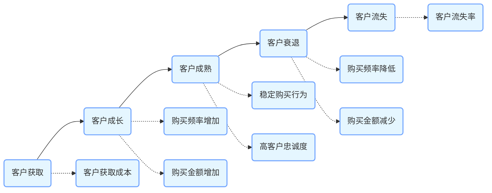

# 彼得林奇如何分析公司的客户生命周期价值

> 关键词：彼得林奇、客户生命周期价值、公司分析、价值评估、投资策略

> 摘要：本文深入探讨彼得林奇分析公司客户生命周期价值的方法。首先介绍相关背景知识，包括目的、预期读者等。接着阐述核心概念及联系，详细讲解核心算法原理与具体操作步骤，并结合数学模型和公式进行说明。通过项目实战案例，展示如何在实际中运用这些方法进行分析。还探讨了其实际应用场景，推荐相关工具和资源。最后总结未来发展趋势与挑战，解答常见问题，并提供扩展阅读和参考资料，帮助读者全面理解彼得林奇分析公司客户生命周期价值的思路和方法。

## 1. 背景介绍 
### 1.1 目的和范围
本文章的主要目的是深入研究彼得林奇这位投资大师分析公司客户生命周期价值的方法。彼得林奇以其卓越的投资业绩和独特的投资理念闻名于世，他在选股时非常注重公司的基本面，而客户生命周期价值是评估公司基本面的重要指标之一。通过对彼得林奇分析方法的研究，我们可以更好地理解如何评估一家公司的潜在价值，为投资者提供更科学的投资决策依据。

本文的范围将涵盖彼得林奇分析客户生命周期价值的核心概念、算法原理、数学模型，还会通过实际案例展示如何应用这些方法进行公司分析，同时探讨其在不同行业的实际应用场景，以及相关的学习资源和工具推荐。

### 1.2 预期读者
本文预期读者主要包括以下几类人群：
- **投资者**：无论是个人投资者还是机构投资者，都可以从彼得林奇的分析方法中获取有价值的信息，提升投资决策的准确性。
- **金融分析师**：有助于他们深入了解公司的价值评估方法，完善自己的分析体系。
- **企业管理者**：可以借鉴彼得林奇的思路，更好地管理客户关系，提高客户生命周期价值，从而提升企业的整体竞争力。
- **对投资和金融领域感兴趣的学习者**：为他们提供一个系统学习公司价值分析的案例和方法。

### 1.3 文档结构概述
本文将按照以下结构进行阐述：
- **核心概念与联系**：介绍客户生命周期价值的定义、相关概念以及它们之间的关系，并通过文本示意图和Mermaid流程图进行直观展示。
- **核心算法原理 & 具体操作步骤**：详细讲解彼得林奇分析客户生命周期价值的核心算法，并用Python源代码进行说明，同时给出具体的操作步骤。
- **数学模型和公式 & 详细讲解 & 举例说明**：运用数学模型和公式对客户生命周期价值进行量化分析，通过具体例子加深读者的理解。
- **项目实战：代码实际案例和详细解释说明**：通过实际项目案例，展示如何运用上述方法进行公司客户生命周期价值的分析，包括开发环境搭建、源代码实现和代码解读。
- **实际应用场景**：探讨彼得林奇分析方法在不同行业的实际应用场景。
- **工具和资源推荐**：推荐相关的学习资源、开发工具和论文著作。
- **总结：未来发展趋势与挑战**：总结彼得林奇分析方法的优势和不足，探讨未来的发展趋势和面临的挑战。
- **附录：常见问题与解答**：解答读者在学习和应用过程中可能遇到的常见问题。
- **扩展阅读 & 参考资料**：提供相关的扩展阅读资料和参考书目。

### 1.4 术语表
#### 1.4.1 核心术语定义
- **客户生命周期价值（Customer Lifetime Value，CLV）**：是指一个客户在其与公司的整个关系期间内，为公司带来的净现金流的现值。它考虑了客户在不同阶段的购买行为、购买频率、购买金额等因素，是衡量客户对公司长期价值的重要指标。
- **客户获取成本（Customer Acquisition Cost，CAC）**：是指公司为获取一个新客户所花费的平均成本，包括营销费用、销售费用等。
- **客户留存率（Customer Retention Rate，CRR）**：是指在一定时期内，公司保留的客户数量占期初客户数量的比例，反映了公司留住客户的能力。

#### 1.4.2 相关概念解释
- **客户终身价值与客户价值的区别**：客户价值通常是指客户在某一特定时期内为公司带来的价值，而客户终身价值则考虑了客户与公司关系的整个生命周期，更能反映客户对公司的长期贡献。
- **客户流失率（Customer Churn Rate）**：与客户留存率相反，是指在一定时期内，流失的客户数量占期初客户数量的比例，它是影响客户生命周期价值的重要因素之一。

#### 1.4.3 缩略词列表
- CLV：Customer Lifetime Value
- CAC：Customer Acquisition Cost
- CRR：Customer Retention Rate

## 2. 核心概念与联系 
### 核心概念原理
客户生命周期价值（CLV）是基于客户与公司的长期关系来评估客户对公司的价值。它的核心原理是将客户在其与公司关系的整个生命周期内所产生的收入，扣除相应的成本后，按照一定的折现率折现到当前时刻，得到的净现值就是客户生命周期价值。

客户在与公司的关系中通常会经历获取、成长、成熟、衰退和流失等阶段。在不同阶段，客户的购买行为和为公司带来的价值是不同的。例如，在获取阶段，公司需要投入一定的成本来吸引客户；在成长和成熟阶段，客户的购买频率和购买金额可能会逐渐增加，为公司带来更多的收入；而在衰退和流失阶段，客户的购买行为会减少，甚至不再购买。

### 架构的文本示意图
客户生命周期价值的架构可以用以下文本示意图表示：

```plaintext
客户生命周期价值
|-- 客户获取
|   |-- 客户获取成本（CAC）
|-- 客户成长
|   |-- 购买频率增加
|   |-- 购买金额增加
|-- 客户成熟
|   |-- 稳定的购买行为
|   |-- 较高的客户忠诚度
|-- 客户衰退
|   |-- 购买频率降低
|   |-- 购买金额减少
|-- 客户流失
|   |-- 客户流失率
```

### Mermaid流程图


这个流程图展示了客户在与公司关系的整个生命周期中所经历的各个阶段，以及每个阶段相关的关键因素。

## 3. 核心算法原理 & 具体操作步骤 
### 核心算法原理
计算客户生命周期价值的一种常见方法是基于客户的平均购买价值、购买频率、客户生命周期长度等因素。以下是一个简化的计算公式：

$$CLV = \frac{AVP \times APF \times CL}{1 + d - r}$$

其中：
- $AVP$（Average Value per Purchase）：平均每次购买的价值，即客户每次购买的平均金额。
- $APF$（Average Purchase Frequency）：平均购买频率，即客户在一定时期内的平均购买次数。
- $CL$（Customer Lifespan）：客户生命周期长度，即客户与公司保持关系的平均时间。
- $d$（Discount Rate）：折现率，用于将未来的现金流折现到当前时刻。
- $r$（Retention Rate）：客户留存率。

### Python源代码详细阐述
```python
def calculate_clv(avp, apf, cl, d, r):
    """
    计算客户生命周期价值
    :param avp: 平均每次购买的价值
    :param apf: 平均购买频率
    :param cl: 客户生命周期长度
    :param d: 折现率
    :param r: 客户留存率
    :return: 客户生命周期价值
    """
    numerator = avp * apf * cl
    denominator = 1 + d - r
    clv = numerator / denominator
    return clv

# 示例数据
avp = 100  # 平均每次购买价值为100元
apf = 4  # 平均每年购买4次
cl = 5  # 客户生命周期为5年
d = 0.1  # 折现率为10%
r = 0.8  # 客户留存率为80%

# 计算客户生命周期价值
clv = calculate_clv(avp, apf, cl, d, r)
print(f"客户生命周期价值为: {clv} 元")
```

### 具体操作步骤
1. **数据收集**：收集公司的历史销售数据，包括客户的购买金额、购买时间等信息，以便计算平均每次购买的价值和平均购买频率。同时，统计客户的留存情况，确定客户留存率和客户生命周期长度。
2. **确定折现率**：折现率反映了资金的时间价值和投资的风险。一般来说，可以参考市场利率或公司的资本成本来确定折现率。
3. **代入公式计算**：将收集到的数据代入上述公式，计算客户生命周期价值。
4. **分析结果**：根据计算结果，评估客户对公司的长期价值，为公司的营销策略、客户关系管理等提供决策依据。

## 4. 数学模型和公式 & 详细讲解 & 举例说明 
### 数学模型和公式
前面已经介绍了一个简化的客户生命周期价值计算公式：

$$CLV = \frac{AVP \times APF \times CL}{1 + d - r}$$

下面对公式中的各个参数进行详细讲解：

- **平均每次购买的价值（$AVP$）**：可以通过以下公式计算：

$$AVP = \frac{\text{总购买金额}}{\text{总购买次数}}$$

例如，某公司在一年中，所有客户的总购买金额为100000元，总购买次数为1000次，则平均每次购买的价值为：

$$AVP = \frac{100000}{1000} = 100 \text{ 元}$$

- **平均购买频率（$APF$）**：可以通过以下公式计算：

$$APF = \frac{\text{总购买次数}}{\text{客户数量}}$$

假设该公司有200个客户，则平均购买频率为：

$$APF = \frac{1000}{200} = 5 \text{ 次/年}$$

- **客户生命周期长度（$CL$）**：可以通过分析历史客户数据，统计客户从首次购买到最后一次购买的平均时间来确定。例如，通过对过去几年的客户数据进行分析，发现客户与公司保持关系的平均时间为3年，则$CL = 3$。

- **折现率（$d$）**：是将未来的现金流折现到当前时刻的比率。假设市场利率为5%，考虑到投资的风险，公司确定折现率为10%，即$d = 0.1$。

- **客户留存率（$r$）**：可以通过以下公式计算：

$$r = \frac{\text{期末留存客户数量}}{\text{期初客户数量}}$$

例如，某公司在年初有100个客户，年末还有80个客户，则客户留存率为：

$$r = \frac{80}{100} = 0.8$$

### 举例说明
假设某电商公司收集到以下数据：
- 平均每次购买的价值（$AVP$）：200元
- 平均购买频率（$APF$）：3次/年
- 客户生命周期长度（$CL$）：4年
- 折现率（$d$）：0.1
- 客户留存率（$r$）：0.7

将这些数据代入公式计算客户生命周期价值：

$$CLV = \frac{200 \times 3 \times 4}{1 + 0.1 - 0.7} = \frac{2400}{0.4} = 6000 \text{ 元}$$

这意味着该电商公司的每个客户在其与公司的整个关系期间内，平均为公司带来的净现金流的现值为6000元。

## 5. 项目实战：代码实际案例和详细解释说明 
### 5.1  开发环境搭建
为了实现客户生命周期价值的计算，我们可以使用Python进行开发。以下是搭建开发环境的步骤：

1. **安装Python**：从Python官方网站（https://www.python.org/downloads/）下载并安装Python 3.x版本。
2. **安装必要的库**：我们主要使用Python的基本库进行计算，不需要额外安装其他复杂的库。

### 5.2  源代码详细实现和代码解读
以下是一个完整的Python代码示例，用于计算客户生命周期价值，并根据不同的客户群体进行分析：

```python
# 定义计算客户生命周期价值的函数
def calculate_clv(avp, apf, cl, d, r):
    """
    计算客户生命周期价值
    :param avp: 平均每次购买的价值
    :param apf: 平均购买频率
    :param cl: 客户生命周期长度
    :param d: 折现率
    :param r: 客户留存率
    :return: 客户生命周期价值
    """
    numerator = avp * apf * cl
    denominator = 1 + d - r
    clv = numerator / denominator
    return clv

# 示例客户数据
customer_groups = [
    {
        "group_name": "高价值客户",
        "avp": 300,
        "apf": 5,
        "cl": 6,
        "d": 0.1,
        "r": 0.8
    },
    {
        "group_name": "中等价值客户",
        "avp": 150,
        "apf": 3,
        "cl": 4,
        "d": 0.1,
        "r": 0.7
    },
    {
        "group_name": "低价值客户",
        "avp": 50,
        "apf": 1,
        "cl": 2,
        "d": 0.1,
        "r": 0.6
    }
]

# 计算每个客户群体的客户生命周期价值
for group in customer_groups:
    group_name = group["group_name"]
    avp = group["avp"]
    apf = group["apf"]
    cl = group["cl"]
    d = group["d"]
    r = group["r"]

    clv = calculate_clv(avp, apf, cl, d, r)
    print(f"{group_name} 的客户生命周期价值为: {clv} 元")
```

### 代码解读与分析
1. **函数定义**：`calculate_clv` 函数接受平均每次购买的价值、平均购买频率、客户生命周期长度、折现率和客户留存率作为参数，根据前面介绍的公式计算客户生命周期价值。
2. **客户数据定义**：使用一个列表 `customer_groups` 存储不同客户群体的数据，每个客户群体用一个字典表示，包含群体名称、平均每次购买的价值、平均购买频率、客户生命周期长度、折现率和客户留存率。
3. **循环计算**：通过循环遍历每个客户群体，调用 `calculate_clv` 函数计算其客户生命周期价值，并打印结果。

通过这个代码示例，我们可以对不同客户群体的客户生命周期价值进行比较和分析，从而为公司制定针对性的营销策略提供依据。例如，对于高价值客户群体，可以提供更优质的服务和个性化的营销活动，以提高客户的忠诚度和购买频率；对于低价值客户群体，可以通过促销活动等方式提高其购买金额和购买频率。

## 6. 实际应用场景 
### 零售行业
在零售行业，客户生命周期价值的分析可以帮助企业制定精准的营销策略。例如，通过分析不同客户群体的客户生命周期价值，企业可以将营销资源重点投入到高价值客户群体上，提供个性化的优惠活动和服务，提高客户的忠诚度和购买频率。同时，对于低价值客户群体，可以通过推出新的产品或服务，吸引他们增加购买金额和购买频率。

### 金融行业
在金融行业，客户生命周期价值的评估对于银行、保险等机构非常重要。银行可以根据客户的生命周期价值，为不同客户提供不同的金融产品和服务，如为高价值客户提供专属的理财产品和贵宾服务。保险公司可以通过分析客户的生命周期价值，优化保险产品的定价和营销策略，提高客户的续保率和满意度。

### 互联网行业
在互联网行业，客户生命周期价值的分析可以帮助企业优化用户体验和广告投放策略。例如，互联网电商平台可以根据用户的生命周期价值，为不同用户提供个性化的商品推荐和购物体验，提高用户的购买转化率和忠诚度。在线游戏公司可以通过分析玩家的生命周期价值，制定合理的收费策略和运营活动，提高玩家的付费意愿和留存率。

## 7. 工具和资源推荐
### 7.1 学习资源推荐
#### 7.1.1 书籍推荐
- 《彼得林奇的成功投资》：彼得林奇本人撰写的经典投资著作，详细介绍了他的投资理念和选股方法，对于理解如何分析公司的价值具有重要的参考价值。
- 《客户生命周期管理：概念、方法与应用》：系统介绍了客户生命周期管理的理论和方法，包括客户生命周期价值的计算和应用。
- 《数据分析实战》：涵盖了数据分析的各个方面，包括数据收集、清洗、分析和可视化，对于学习如何运用数据分析方法计算客户生命周期价值有很大的帮助。

#### 7.1.2 在线课程
- Coursera上的“数据分析基础”课程：提供了数据分析的基础知识和技能，包括Python编程、数据处理和可视化等内容，为学习客户生命周期价值分析提供了必要的技术支持。
- edX上的“投资学原理”课程：介绍了投资学的基本原理和方法，对于理解客户生命周期价值在投资决策中的应用有很大的帮助。

#### 7.1.3 技术博客和网站
- 知乎：有很多关于投资和数据分析的话题讨论，用户可以在上面找到相关的文章和经验分享。
- 博客园：有许多技术博客分享数据分析和投资领域的知识和经验，对于学习客户生命周期价值分析有一定的参考价值。

### 7.2 开发工具框架推荐
#### 7.2.1 IDE和编辑器
- PyCharm：一款功能强大的Python集成开发环境，提供了代码编辑、调试、版本控制等功能，适合开发Python程序进行客户生命周期价值的计算和分析。
- Jupyter Notebook：一种交互式的开发环境，支持Python、R等多种编程语言，适合进行数据分析和可视化，方便用户展示和分享分析结果。

#### 7.2.2 调试和性能分析工具
- PDB：Python自带的调试工具，可以帮助用户在程序运行过程中进行调试，查找和解决问题。
- cProfile：Python的性能分析工具，可以帮助用户分析程序的性能瓶颈，优化代码的执行效率。

#### 7.2.3 相关框架和库
- Pandas：Python的数据分析库，提供了高效的数据结构和数据处理功能，方便用户进行数据的读取、清洗和分析。
- NumPy：Python的数值计算库，提供了高性能的多维数组对象和数学函数，对于进行数学模型的计算非常有用。
- Matplotlib：Python的绘图库，提供了丰富的绘图功能，方便用户进行数据可视化，直观展示客户生命周期价值的分析结果。

### 7.3 相关论文著作推荐
#### 7.3.1 经典论文
- “Customer Lifetime Value: Marketing Models and Applications”：这篇论文系统地介绍了客户生命周期价值的概念、模型和应用，是该领域的经典文献之一。
- “Managing Customers as Investments: The Strategic Value of Customers in the Long Run”：探讨了将客户视为投资的理念，强调了客户生命周期价值在企业战略决策中的重要性。

#### 7.3.2 最新研究成果
- 可以通过学术数据库如IEEE Xplore、ACM Digital Library等搜索关于客户生命周期价值的最新研究论文，了解该领域的最新发展动态和研究方法。

#### 7.3.3 应用案例分析
- 一些商业期刊和研究报告中会有关于客户生命周期价值在不同行业的应用案例分析，如《哈佛商业评论》、《麦肯锡季刊》等，可以从中学习实际应用中的经验和教训。

## 8. 总结：未来发展趋势与挑战
### 未来发展趋势
- **数据驱动的精准营销**：随着大数据和人工智能技术的不断发展，企业可以收集和分析更多的客户数据，更加精准地计算客户生命周期价值，从而制定更加个性化的营销策略，提高营销效果和客户满意度。
- **跨行业整合**：客户生命周期价值的分析不再局限于单一行业，未来不同行业之间的整合将更加频繁。例如，零售行业可以与金融行业合作，根据客户的消费行为和金融需求，提供更加综合的服务和产品，提高客户的生命周期价值。
- **智能化客户关系管理**：借助人工智能和机器学习技术，企业可以实现智能化的客户关系管理。例如，通过预测客户的流失概率和购买行为，提前采取措施进行客户挽留和营销推广，提高客户的留存率和购买频率。

### 挑战
- **数据质量和隐私问题**：准确计算客户生命周期价值需要大量高质量的客户数据，但数据的收集、存储和使用过程中存在数据质量不高、数据泄露等问题，如何保证数据的质量和隐私是企业面临的重要挑战。
- **模型的复杂性和适应性**：客户生命周期价值的计算模型越来越复杂，需要考虑更多的因素和变量。同时，不同行业和企业的客户行为和特点差异较大，如何建立具有适应性的模型是一个挑战。
- **组织变革和人才短缺**：实施基于客户生命周期价值的营销策略需要企业进行组织变革，调整业务流程和组织结构。同时，企业需要具备数据分析和营销管理等多方面知识的复合型人才，但目前这类人才相对短缺。

## 9. 附录：常见问题与解答
### 问题1：客户生命周期价值的计算结果是否准确？
客户生命周期价值的计算结果受到多种因素的影响，如数据的准确性、模型的合理性、假设条件的有效性等。因此，计算结果只是一个估计值，不能完全准确地反映客户的实际价值。但通过合理的数据收集和分析方法，以及不断优化模型，可以提高计算结果的准确性。

### 问题2：如何提高客户生命周期价值？
可以从以下几个方面提高客户生命周期价值：
- **提高客户留存率**：通过提供优质的产品和服务，建立良好的客户关系，提高客户的满意度和忠诚度，减少客户流失。
- **增加客户购买频率**：通过推出促销活动、会员制度等方式，鼓励客户增加购买次数。
- **提高客户购买金额**：通过提供个性化的产品推荐、套餐组合等方式，引导客户购买更高价值的产品和服务。

### 问题3：客户生命周期价值分析适用于所有行业吗？
客户生命周期价值分析适用于大多数行业，但不同行业的应用方式和重点可能会有所不同。例如，对于一些快速消费品行业，客户的购买频率较高，重点可能在于提高客户的购买频率和购买金额；对于一些耐用消费品行业，客户的购买周期较长，重点可能在于提高客户的留存率和忠诚度。

## 10. 扩展阅读 & 参考资料
### 扩展阅读
- 《巴菲特致股东的信：投资者和公司高管教程》：虽然主要介绍巴菲特的投资理念，但其中关于公司价值评估的方法和思路对于理解客户生命周期价值的分析也有一定的启示。
- 《精益数据分析》：强调了数据分析在创业和企业发展中的重要性，介绍了一些实用的数据分析方法和工具，对于学习客户生命周期价值分析有一定的帮助。

### 参考资料
- 《彼得林奇的成功投资》，彼得·林奇著
- “Customer Lifetime Value: Marketing Models and Applications”，Berger and Nasr, Journal of Marketing Research, 1998
- “Managing Customers as Investments: The Strategic Value of Customers in the Long Run”，Blattberg and Deighton, Journal of Marketing, 1996

作者：AI天才研究院/AI Genius Institute & 禅与计算机程序设计艺术 /Zen And The Art of Computer Programming